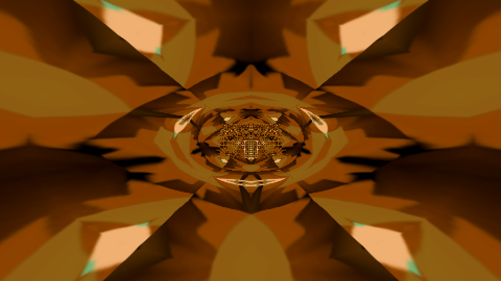
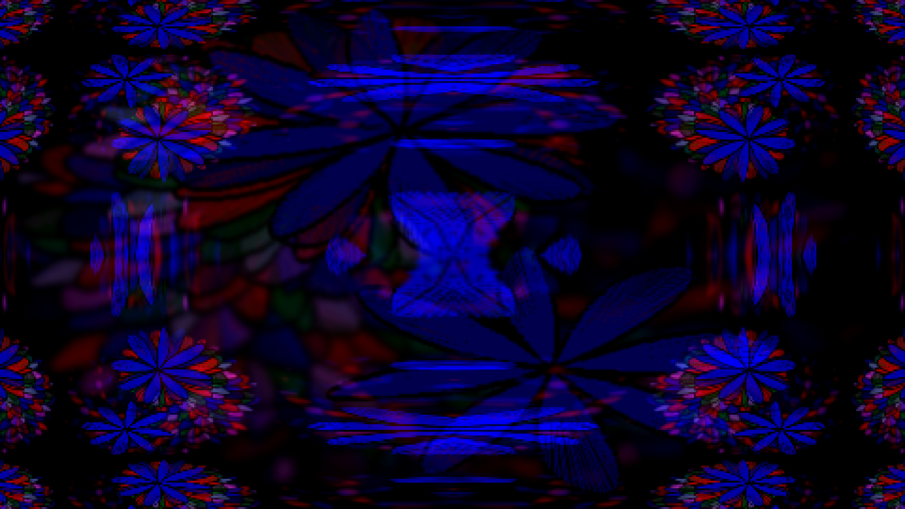
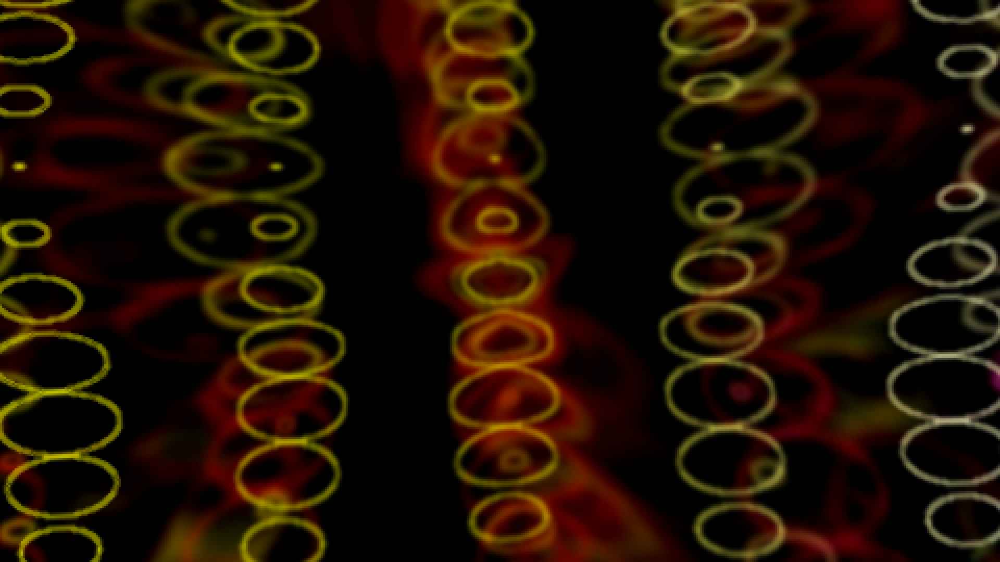
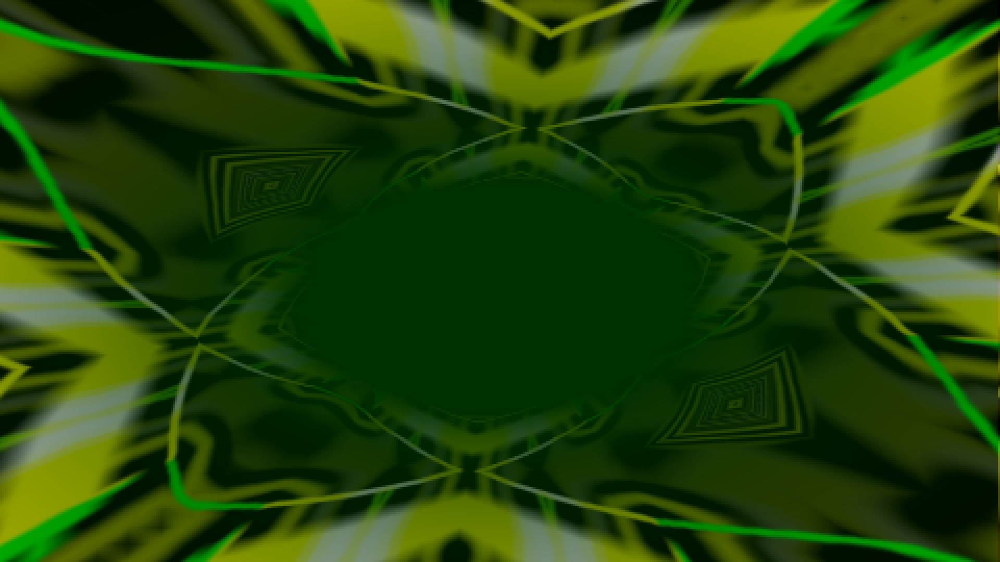
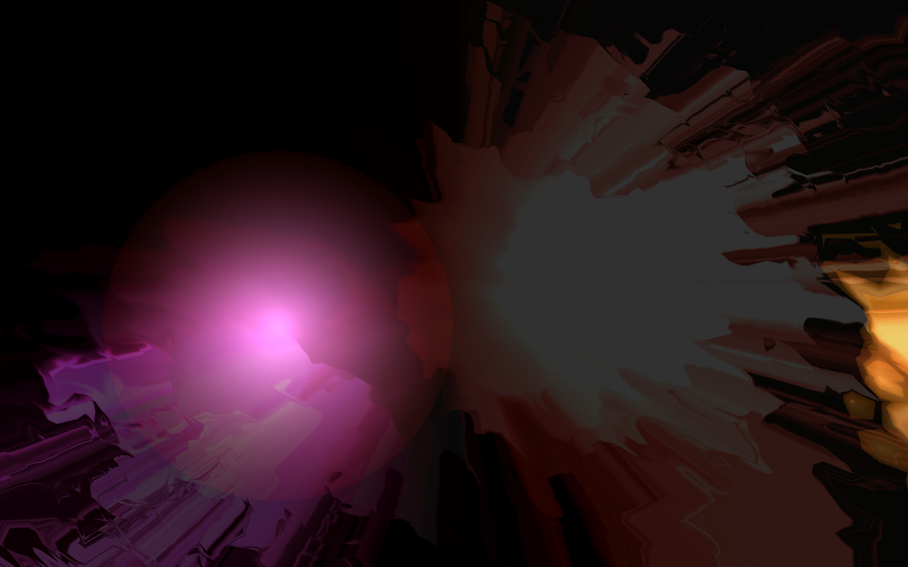
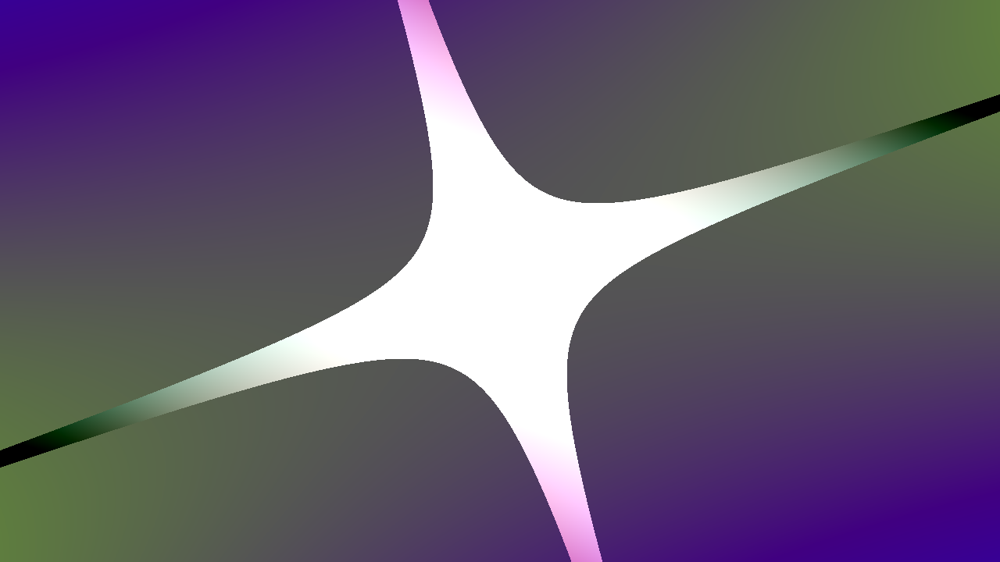
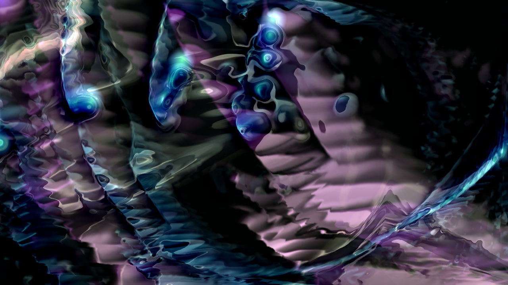

# LumiViz

**Audio-Visualizer für Windows und Linux — Qt 6 / OpenGL, C++20.**

LumiViz spielt Musik ab und rechnet dazu Bilder: klassische Visualisierungen
(Equalizer, Oszilloskop, Superscope, Waveform, Pulsing) und ein Knoten-basierter
Multieffekt-Host, der **AVS-** und **MilkDrop**-Presets importiert und
nachrechnet. Dazu kommen Shader-Knoten für **Shadertoy**-GLSL und das
**Interactive Shader Format (ISF)**.

> **Status:** aktiv in Entwicklung, Einzelentwickler-Projekt. Es gibt noch keine
> Release-Binaries — wer LumiViz nutzen will, baut es selbst (siehe
> [BUILDING.md](BUILDING.md)).

---

## Wie das aussieht

**AVS-Presets**, in LumiViz gerechnet:

| | |
|:--:|:--:|
|  |  |
|  |  |

**MilkDrop-Presets**, dieselbe Anwendung:

| | |
|:--:|:--:|
|  |  |
|  |  |

Alle acht sind Standbilder aus laufenden Presets — sie bewegen sich zur Musik.
Die gezeigten Presets liegen im Repository und werden beim Bauen neben die
Anwendung gelegt; du kannst sie also sofort selbst starten.

---

## Was es kann

**Audio.** Wiedergabe über [BASS](https://www.un4seen.com/) (MP3, FLAC, WAV u. a.),
Playlist mit M3U-Unterstützung, FFT- und Waveform-Analyse als Signalquelle für
alles Visuelle, Beat-Erkennung.

**Visualisierung.** Fünf eigenständige Visualizer plus ein **Multieffekt-Host**,
in dem sich Effekt-Knoten zu Ketten verschalten lassen — Renderer, Transformationen,
Puffer-Rückkopplung, Skript-Knoten. Skripte laufen in EEL-Schreibweise
(nach Lua übersetzt) oder direkt in Lua, in einer abgeschotteten Umgebung.

**Oberfläche.** Andockbare Panels (Qt Advanced Docking System), frei belegbare
Hotkeys, Vollbildmodus, Screenshot-Ablage, gespeicherte Layouts.

---

## Fremde Presets importieren

Das ist der Kern des Projekts: LumiViz spielt **Presets aus zwei Visualizern
der 2000er Jahre** ab, die es so nicht mehr gibt — und macht sie bearbeitbar.

### AVS (Winamp Advanced Visualization Studio)

Eine `.avs`-Datei ist ein Baum aus Effekten mit eingebetteten Formeln. LumiViz
liest den Container, übersetzt jeden Effekt in einen eigenen Knoten und die
EEL-Formeln nach Lua. Danach ist das Preset eine ganz normale LumiViz-Kette:
jeder Knoten einzeln abschaltbar, jeder Wert veränderbar, alles speicherbar.

**Abdeckung:** 44 eingebaute Effekte und 17 APEs (Erweiterungen). Die Treue
wird nicht geschätzt, sondern gemessen — gegen **AvsRef**, den originalen
Winamp-Renderer, der als Vergleichswerkzeug im Repository liegt. Bild gegen
Bild, Effekt für Effekt.

### MilkDrop

Eine `.milk`-Datei ist etwas ganz anderes: ein Gitter, das jedes Bild verzerrt,
plus Shader-Stufen für Warp und Composite. LumiViz rechnet das Gitter nach,
übersetzt die Preset-Shader von HLSL nach GLSL und führt sie aus.

**Gemessen gegen MilkdropRef**, dem originalen MilkDrop3-Kern — ebenfalls im
Repository.

### Shader

**Shadertoy**-GLSL läuft in einem eigenen Knoten, mit den Audiodaten an den
`iChannel`-Eingängen. **ISF**-Dateien (Interactive Shader Format) führt LumiViz
**unverändert** aus, inklusive Vertex-Stufe und Multipass — von 327 Dateien der
Vidvox-Bibliothek übersetzen und linken 321.

### Was mitgeliefert wird — und was nicht

Im Repository liegt eine **kleine Auswahl eigener Presets** (10 AVS, 19
MilkDrop), die beim Bauen neben die Anwendung kopiert wird. Damit hat LumiViz
sofort etwas zu zeigen.

**Fremde Preset-Sammlungen sind bewusst nicht dabei** — sie sind Werke ihrer
Autoren. LumiViz lädt sie aus jedem beliebigen Ordner; mitgeliefert werden sie
nicht. Begründung: [THIRD_PARTY_NOTICES.md](THIRD_PARTY_NOTICES.md), Abschnitt
„Nicht enthaltene Inhalte".

---

## Eigene Presets bauen

Der Import ist nur der Einstieg — Ketten lassen sich auch von Grund auf bauen:
54 Knotentypen, Puffer-Rückkopplung, und in jedem Skriptfeld stehen die
Audiodaten zur Verfügung.

- **[Preset-Quickstart](projects/apps/LumiViz/docs/Preset_Quickstart.md)** —
  eine Seite, fünf Schritte zum ersten eigenen Visual
- **[Preset-Anleitung](projects/apps/LumiViz/docs/Preset_Anleitung.md)** —
  wie eine Kette denkt, die Knotentypen, Rückkopplung, Formeln, Fehlersuche
- **[Benutzerhandbuch](projects/apps/LumiViz/docs/Benutzerhandbuch.md)** —
  die vollständige Bedienung

Alle drei landen beim Bauen als `docs/` neben der Anwendung.

---

## Bauen

Kurzfassung für Windows:

```bash
git clone https://github.com/PatrikNeunteufel/LumiViz.git
```

Danach **BASS beschaffen** (proprietär, darf nicht mitgeliefert werden — Anleitung:
[`externals/bass/SETUP.md`](externals/bass/SETUP.md)), `QT_ROOT` setzen und:

```bash
cmake --preset windows-vs-x64-debug_dynamic
```

```bash
cmake --build --preset build-vs-x64-Debug
```

**Die vollständige Anleitung mit allen Voraussetzungen steht in
[BUILDING.md](BUILDING.md)** — bitte dort anfangen, der Build braucht drei
Vorbereitungsschritte.

---

## Aufbau des Repositorys

| Pfad | Inhalt |
|---|---|
| `projects/apps/LumiViz/` | die Anwendung — `audio/`, `visualizers/`, `UI/`, `services/`, `scripting/` |
| `projects/libs/` | wiederverwendbare Header-only-Bibliotheken: `EelTranspiler`, `AvsParser`, `MilkParser`, `HlslTranspiler`, `BasicLogger` |
| `projects/apps/LumiViz/docs/` | Architektur- und Anwenderdokumentation, Einstieg: [`docs/INDEX.md`](projects/apps/LumiViz/docs/INDEX.md) |
| `tools/AvsRef`, `tools/MilkdropRef` | Referenz-Renderer der Originale, dienen als Vergleichsmaßstab der Kalibrierung |
| `asset/` | eigene Presets, Effektketten, Shader und Kalibrier-Material |
| `externals/` | mitgelieferte Fremdbibliotheken (doctest, glad) |
| `Solution.json` | Beschreibung der Solution: Targets, Abhängigkeiten, Externals |

Das Build-System ist ausgelagert:
**[CMakeCraft](https://github.com/PatrikNeunteufel/CMakeCraft)** — ein
JSON-gesteuerter CMake-Aufbau, der beim Konfigurieren automatisch in der in
`cmakecraft.pin` festgelegten Version geholt wird.

## Tests

```bash
ctest --preset ctest-vs-x64-Testing -R UnitTests
```

593 doctest-Fälle über Service-Fundament, Skript-Übersetzer, Parser, Preset-Persistenz
und OpenGL-Rauchtests. Voraussetzung: Konfiguration mit dem Testing-Preset
(siehe [BUILDING.md](BUILDING.md)).

---

## Lizenz

LumiViz steht wahlweise unter **MIT** ([LICENSE-MIT](LICENSE-MIT)) oder
**Apache-2.0** ([LICENSE-APACHE](LICENSE-APACHE)) — such dir aus, was besser passt.

Das gilt für den LumiViz-eigenen Code. Die Anwendung nutzt und portiert
Fremdkomponenten mit eigenen Bedingungen — darunter das **proprietäre BASS**,
das für nicht-kommerzielle Nutzung kostenlos ist, für kommerzielle Nutzung aber
eine Lizenz von un4seen erfordert. Vollständige Aufstellung:
**[THIRD_PARTY_NOTICES.md](THIRD_PARTY_NOTICES.md)**.

Sofern du nicht ausdrücklich etwas anderes erklärst, gilt jeder Beitrag, den du
zur Aufnahme einreichst, als unter denselben beiden Lizenzen stehend.
