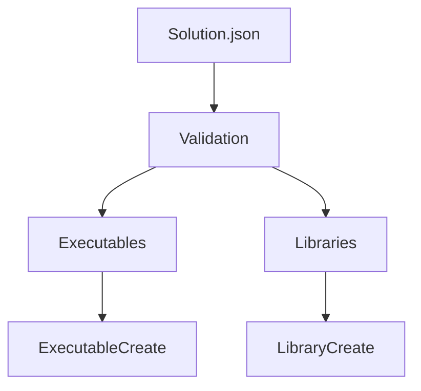

# Concept — Standard für Architektur-Konzepte

> **Version:** 1.0.0  
> **Datum:** 2025-12-13  
> **Typ:** Blueprint  
> **Status:** In Entwicklung  
> **Basiert auf:** Doc v0.5, Blueprint v0.5  
> **Zielgruppe:** Dokumentations-Ersteller, Architekten  
> **Sprache:** Deutsch  
> **English:** [Concept.md](../../en/blueprints/Concept.md)

---

## Inhaltsverzeichnis

1. [Übersicht](#1-übersicht)
2. [Geltungsbereich](#2-geltungsbereich)
3. [Header-Struktur](#3-header-struktur)
4. [Pflichtabschnitte](#4-pflichtabschnitte)
5. [Diagramme und Visualisierung](#5-diagramme-und-visualisierung)
6. [Entscheidungsdokumentation](#6-entscheidungsdokumentation)
7. [Beispiel: Vollständiges Konzept](#7-beispiel-vollständiges-konzept)
8. [Review-Checkliste](#8-review-checkliste)
9. [Siehe auch](#9-siehe-auch)
10. [Changelog](#10-changelog)

---

## 1. Übersicht

Dieser Blueprint definiert die **Struktur für Architektur-Konzepte**. Konzept-Dokumentationen erklären das **Warum** hinter Design-Entscheidungen.

### Zielgruppe

- Build-System-Entwickler
- Architekten und technische Leads
- Neue Team-Mitglieder (Onboarding)

### Abgrenzung

| Dokumentations-Typ | Fokus |
|-------------------|-------|
| **Concept** | Warum wurde X so entschieden? |
| **ModuleDoc** | Wie funktioniert Modul X? |
| **Guide** | Wie nutze ich X? |
| **Reference** | Was ist X? |

---

## 2. Geltungsbereich

Dieser Blueprint gilt für:
- Architektur-Übersichten
- Design-Entscheidungen (ADRs)
- System-Konzepte
- Pipeline-Beschreibungen

**Typischer Ordner:** `docs/[lang]/concepts/`

**Beispiele:**
- `master_concept_v0_1_0.md`
- `AppContainer_Concept_v0_2_0.md`
- `Fetch_v0_2_1_Konzept.md`

---

## 3. Header-Struktur

### 3.1 Standard-Header

```markdown
# [Name] — Konzept

> **Version:** X.Y.Z  
> **Datum:** YYYY-MM-DD  
> **Typ:** Concept  
> **Status:** [In Entwicklung | Stabil | Deprecated]  
> **Zielgruppe:** Build-System-Entwickler, Architekten  
> **Sprache:** Deutsch  
> **English:** [Name_Concept.md](../../en/concepts/Name_Concept.md)
```

### 3.2 Optionale Felder

| Feld | Beschreibung |
|------|--------------|
| `Bezug:` | Welche Module/Systeme betrifft dieses Konzept? |

---

## 4. Pflichtabschnitte

Konzepte verwenden diese Struktur:

```
## Inhaltsverzeichnis

## 1. Einleitung / Vision
## 2. Problemstellung
## 3. Lösungsansatz
## 4. Architektur
## 5. Design-Entscheidungen
## 6. Alternativen (verworfen)
## 7. Offene Punkte
## 8. Siehe auch
## Changelog
```

### 4.1 Abschnitts-Details

| # | Abschnitt | Inhalt |
|---|-----------|--------|
| 1 | Einleitung | Vision, Ziele, Scope |
| 2 | Problemstellung | Welches Problem wird gelöst? |
| 3 | Lösungsansatz | Gewählter Ansatz, Kernideen |
| 4 | Architektur | Struktur, Komponenten, Datenfluss |
| 5 | Design-Entscheidungen | Warum so und nicht anders? |
| 6 | Alternativen | Betrachtete aber verworfene Ansätze |
| 7 | Offene Punkte | Noch zu klären, Future Work |
| 8 | Siehe auch | Verwandte Konzepte, Module |

---

## 5. Diagramme und Visualisierung

### 5.1 ASCII-Diagramme

Für einfache Strukturen:

```markdown
Pipeline-Flow
─────────────
Solution.json
     │
     ▼
┌─────────────┐
│ Validation  │
└─────────────┘
     │
     ▼
┌─────────────┐
│ Executables │
└─────────────┘
```

### 5.2 Mermaid-Diagramme

Für komplexere Strukturen (wenn vom Renderer unterstützt):
```
graph TD
    A[Solution.json] --> B[Validation]
    B --> C[Executables]
    B --> D[Libraries]
    C --> E[ExecutableCreate]
    D --> F[LibraryCreate]
```




### 5.3 Tabellen für Komponenten

| Komponente | Verantwortung | Input | Output |
|------------|---------------|-------|--------|
| Validator | Schema-Prüfung | JSON | Fehler oder OK |
| Collector | Daten sammeln | JSON | Context |
| Creator | Target erstellen | Context | CMake Target |


---

## 6. Entscheidungsdokumentation

### 6.1 Format für Design-Entscheidungen

```markdown
### 5.1 Entscheidung: GLOBAL PROPERTY statt PARENT_SCOPE

**Kontext:**  
CMake-Variablen haben Funktions-Scope. Bei verschachtelten Aufrufen 
(A ruft B ruft C) gehen mit PARENT_SCOPE gesetzte Werte verloren.

**Optionen:**

| Option | Pro | Contra |
|--------|-----|--------|
| PARENT_SCOPE | CMake-Standard | Funktioniert nicht bei > 2 Ebenen |
| CACHE INTERNAL | Persistent | Verschmutzt Cache, langsam |
| GLOBAL PROPERTY | Sofort global | Kein Auto-Cleanup |

**Entscheidung:**  
GLOBAL PROPERTY mit Namenskonvention `${PREFIX}_${KEY}`.

**Begründung:**  
Zuverlässige Propagation ist wichtiger als Auto-Cleanup. 
Namenskonvention verhindert Kollisionen.

**Konsequenzen:**
- Alle Collector-Module müssen GLOBAL PROPERTY nutzen
- Debugging erfordert `ctx_dump()` statt `message()`
```

### 6.2 ADR-Light Format

Für wichtige Entscheidungen kann das ADR-Format verwendet werden:

```markdown
### ADR-001: JSON als Konfigurationsformat

**Status:** Akzeptiert (2025-12-01)

**Kontext:**  
Wir brauchen ein maschinenlesbares Format für Solution-Konfiguration.

**Entscheidung:**  
JSON mit CMake 3.19+ `file(READ)` und `string(JSON)`.

**Konsequenzen:**
- Positive: Native CMake-Unterstützung, weit verbreitet
- Negative: Keine Kommentare im Standard-JSON
```

---

## 7. Beispiel: Vollständiges Konzept

```markdown
# Context Pattern — Konzept

> **Version:** 1.0.0  
> **Datum:** 2025-12-13  
> **Typ:** Concept  
> **Status:** Stabil  
> **Zielgruppe:** Build-System-Entwickler  
> **Bezug:** cmake/core/Context.cmake  
> **Sprache:** Deutsch  
> **English:** [Context_Pattern_Concept.md](../../en/concepts/Context_Pattern_Concept.md)

---

## Inhaltsverzeichnis

1. [Einleitung](#1-einleitung)
2. [Problemstellung](#2-problemstellung)
3. [Lösungsansatz](#3-lösungsansatz)
4. [Architektur](#4-architektur)
5. [Design-Entscheidungen](#5-design-entscheidungen)
6. [Verworfene Alternativen](#6-verworfene-alternativen)
7. [Offene Punkte](#7-offene-punkte)
8. [Siehe auch](#8-siehe-auch)
9. [Changelog](#9-changelog)

---

## 1. Einleitung

Das Context Pattern ermöglicht **isolierte Namespaces** für die 
Datensammlung während der Pipeline-Verarbeitung. Es löst das 
Problem der Variable-Scope-Limitierung in CMake.

### Ziele

- Zuverlässige Datenpropagation über Funktionsebenen
- Isolierte Namespaces pro Executable/Library/Test
- Einfaches Debugging

---

## 2. Problemstellung

CMake-Variablen haben Funktions-Scope:

```cmake
function(outer)
    set(MY_VAR "value" PARENT_SCOPE)  # Setzt in Caller
endfunction()

function(middle)
    outer()
    message("${MY_VAR}")  # LEER - nicht propagiert
endfunction()
```

Bei verschachtelten Pipeline-Aufrufen geht Information verloren.

---

## 3. Lösungsansatz

GLOBAL PROPERTY als Speicher mit Namenskonvention:

```cmake
# Statt PARENT_SCOPE
set_property(GLOBAL PROPERTY EXE_MyApp_NAME "MyApp")

# Lesen von überall
get_property(_name GLOBAL PROPERTY EXE_MyApp_NAME)
```

---

## 4. Architektur

```
ctx_create(EXE_MyApp)
        │
        ▼
┌───────────────────────────────┐
│  GLOBAL PROPERTY: EXE_MyApp_  │
│  ├── NAME = "MyApp"           │
│  ├── VERSION = "1.0.0"        │
│  └── EXTERNALS = "bass;imgui" │
└───────────────────────────────┘
        │
        ▼
ctx_get(EXE_MyApp NAME _var)
```

---

## 5. Design-Entscheidungen

### 5.1 GLOBAL PROPERTY statt PARENT_SCOPE

[... wie in Abschnitt 6.1 beschrieben ...]

### 5.2 Namenskonvention ${PREFIX}_${KEY}

**Kontext:** Mehrere Contexts könnten kollidieren.

**Entscheidung:** Prefixes: `EXE_`, `LIB_`, `TEST_`

**Begründung:** Eindeutig, selbstdokumentierend.

---

## 6. Verworfene Alternativen

### 6.1 CACHE INTERNAL

**Problem:** Persistiert über Konfigurationsläufe, verschmutzt Cache.

### 6.2 Globale Variablen

**Problem:** Keine Isolation zwischen Targets.

---

## 7. Offene Punkte

- [ ] Automatisches Cleanup nach Pipeline-Durchlauf
- [ ] Performance bei >100 Targets

---

## 8. Siehe auch

- [Context.cmake](../modules/core/Context.md)
- [ExecutableCollect.cmake](../modules/project/ExecutableCollect.md)

---

## Changelog

| Version | Datum | Änderungen |
|---------|-------|------------|
| **0.1.0** | **2025-12-13** | **Initial** |
```

---

## 8. Review-Checkliste

Zusätzlich zur Doc.md Checkliste:

**Inhalt:**
- [ ] Problemstellung klar beschrieben
- [ ] Lösungsansatz nachvollziehbar
- [ ] Architektur visualisiert (Diagramm/Tabelle)
- [ ] Design-Entscheidungen dokumentiert mit Begründung
- [ ] Verworfene Alternativen genannt

**Qualität:**
- [ ] "Warum" beantwortet, nicht nur "Was"
- [ ] Für neue Team-Mitglieder verständlich
- [ ] Offene Punkte ehrlich benannt

---

## 9. Siehe auch

- [Doc.md](Doc.md) — Allgemeine Dokumentations-Regeln
- [ModuleDoc.md](ModuleDoc.md) — Für Modul-Details

---

## Changelog

| Version | Datum | Änderungen |
|---------|-------|------------|
| **0.5.0** | **2025-12-13** | **Neu: Diagramm-Formate, ADR-Light, Entscheidungsdokumentation** |
| 0.1.0 | 2025-12-03 | Initial (Teil von Documentation_Blueprint) |
