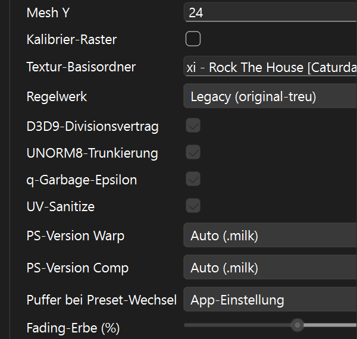
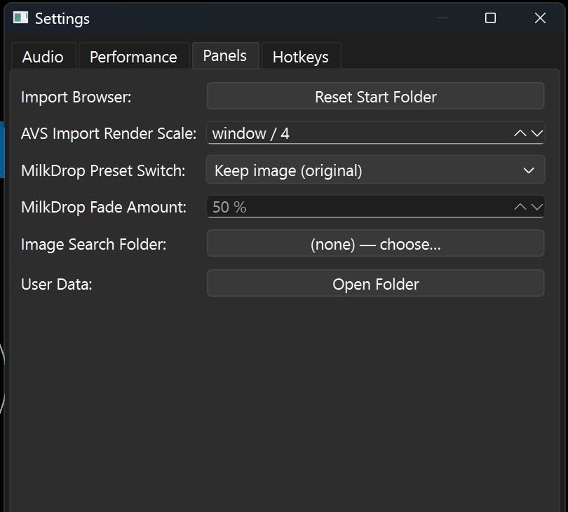

# LumiViz — Benutzerhandbuch

> **Version:** 1.10.0
> **Datum:** 2026-08-06
> **Typ:** Benutzerhandbuch
> **Status:** Aktiv
> **Zielgruppe:** Anwender
> **Sprache:** Deutsch

LumiViz ist ein Audio-Player mit Echtzeit-Visualisierung: Musik abspielen,
zuschauen, und jede Stufe der Visualisierung live verstellen. Dieses Handbuch
beschreibt die Bedienung der App als Ganzes; die Detail-Bedienung des
Konfigurations-Panels steht im
[ConfigPanel-Guide §2](ui/ConfigPanel_Guide.md#2-bedienung).

---

## Inhaltsverzeichnis

1. [Der erste Blick](#1-der-erste-blick)
2. [Musik abspielen (Player)](#2-musik-abspielen-player)
3. [Playlist verwalten](#3-playlist-verwalten)
4. [Visualizer auswählen](#4-visualizer-auswählen)
5. [Visualizer konfigurieren](#5-visualizer-konfigurieren)
6. [Vollbild](#6-vollbild)
7. [Fenster-Layout (Docking)](#7-fenster-layout-docking)
8. [Einstellungen & Frame-Modus](#8-einstellungen--frame-modus)
9. [Tastenkürzel](#9-tastenkürzel)
10. [Automatisch gemerkt / Bekanntes](#10-automatisch-gemerkt--bekanntes)
11. [Effektketten, Milkdrop & Host-Gruppen](#11-effektketten-milkdrop--host-gruppen)
12. [Shadertoy](#12-shadertoy)
13. [Video & Kamera als Quelle](#13-video--kamera-als-quelle)
14. [Stilfilter (Pixel Filter)](#14-stilfilter-pixel-filter)

---

## 1. Der erste Blick

```
┌───────────────────────────────────────────────┬──────────────┐
│ Menü: File · Edit · View · Settings · Help    │              │
├───────────────────────────────────────────────┤  Seitentabs  │
│                                               │  (Auto-Hide) │
│         Visualizer (zentrale Ansicht)         │  Visualizer  │
│                                               │  Config      │
│                                               │  Playlist    │
├───────────────────────────────────────────────┤  Visualizers │
│ Player (Dock unten)                           │              │
├───────────────────────────────────────────────┴──────────────┤
│ Statusleiste: Meldungen · FPS-Anzeige (rechts)                │
└───────────────────────────────────────────────────────────────┘
```

Die Panels sind **andockbare Fenster** (siehe §7): am Rand als schmale
Seitentabs geparkt, per Klick ausklappbar, frei verschieb- und abdockbar.
Die FPS-Anzeige rechts unten zeigt die Bildrate des Haupt-Visualizers.

## 2. Musik abspielen (Player)

Das **Player-Panel** steuert die Wiedergabe:

| Element | Funktion |
|---|---|
| ⏮ / ⏭ | Voriger / nächster Track der Playlist |
| ▶ / ⏸ | Wiedergabe starten / pausieren |
| ⏹ | Stopp (zurück an den Trackanfang) |
| Loop-Taste | **Aktuellen Track** wiederholen (leuchtet bei aktiv) |
| Fortschrittsbalken | Anfassen und ziehen = Spulen (Seek) |
| 🔇 + Lautstärkeregler | Stummschalten / Lautstärke |

Musik kommt über die Playlist (§3) in die App — Titel dort doppelklicken
startet die Wiedergabe.

## 3. Playlist verwalten

Das **Playlist-Panel** führt die Titelliste:

- **Add files** — Audiodateien hinzufügen (Mehrfachauswahl möglich).
- **Doppelklick** auf einen Titel — abspielen.
- **Remove selected / Clear** — Auswahl entfernen bzw. Liste leeren.
- **Save / Load** — Playlist als Datei sichern/laden
  (**M3U/M3U8**, PLS, JSON).
- **Shuffle-Modus** — nächster Titel wird zufällig gewählt (mischt die Liste
  nicht um).
- **Loop-Playlist** — nach dem letzten Titel geht es vorn weiter.

**Session-Playlist:** Beim Beenden wird die aktuelle Playlist automatisch
gespeichert und beim nächsten Start wiederhergestellt (inklusive Position in
der Liste, ohne Autostart). Es gibt nichts zu tun — einfach schließen.

## 4. Visualizer auswählen

Im **Visualizers-Panel** stehen die verfügbaren Visualisierungen
(Pulsing, Equalizer, Waveform, Oscilloscope, Superscope), gruppiert nach
Kategorie und mit Kurzbeschreibung. Auswahl markieren → **Apply** — die
zentrale Ansicht wechselt sofort.

**Mehrere Visualizer gleichzeitig:** *View → New Visualizer* (Ctrl+N) öffnet
ein weiteres Visualizer-Fenster als Tab bzw. Dock — jedes rendert unabhängig
mit eigener Bildrate; frei anordnen wie in §7 beschrieben.

## 5. Visualizer konfigurieren

Das **Visualizer-Config-Panel** zeigt alle Parameter des aktiven Visualizers,
gegliedert nach den Pipeline-Stufen (1 Audio/Analyse → 6 Post). Die
vollständige Bedienungsanleitung — Parametergruppen, Presets speichern/laden,
Farbverlaufs-Editor, Stufen-Vorschauen (Auge-Symbol im Gruppenkopf) — steht im
**[ConfigPanel-Guide §2](ui/ConfigPanel_Guide.md#2-bedienung)**.

Das Wichtigste in Kürze:

- Jede Änderung wirkt **sofort** im Bild.
- **Undo/Redo:** *Edit → Undo/Redo* (Ctrl+Z / Ctrl+Y) — Slider-Züge werden
  zu einem Schritt zusammengefasst.
- **Presets:** oben im Panel je Visualizer speichern/laden; „Default" setzt
  auf die Werkseinstellung zurück.
- **Live-Vorschauen** je Stufe über das Auge-Symbol einblenden (standardmäßig
  aus, kosten nichts solange ausgeblendet).

## 6. Vollbild

- **Rein:** Doppelklick auf die Visualizer-Fläche — oder *View → Fullscreen*
  (F11). Es erscheint NUR das Bild, randlos ohne Menü/Tabs/Panels.
- **Raus:** **Esc** oder erneuter Doppelklick.
- Bei mehreren Visualizern geht genau der **doppelt geklickte** in den
  Vollbildmodus (F11/Menü nehmen den Haupt-Visualizer).

## 7. Fenster-Layout (Docking)

Alle Panels und Visualizer-Fenster sind frei andockbar:

- **Verschieben:** Titelleiste ziehen — beim Ziehen erscheinen
  Andock-Zonen; loslassen dockt an, außerhalb entsteht ein
  **schwebendes Fenster**.
- **Tabs:** Zwei Docks übereinander ziehen stapelt sie als Tabs.
- **Auto-Hide:** Pin-Symbol in der Dock-Titelleiste parkt das Panel als
  Seitentab am Rand; Klick auf den Tab klappt es temporär aus.
- **Panels ein-/ausblenden:** *View → Panels*.
- **Perspektiven:** *View → Perspectives* — benannte Layouts speichern und
  umschalten; *Reset Layout* stellt das Standard-Layout wieder her,
  *Save Layout as Default* macht das aktuelle Layout zum Standard.
- Das Layout wird beim Beenden **automatisch gespeichert** und beim
  nächsten Start wiederhergestellt.

## 8. Einstellungen & Frame-Modus

**Settings-Panel** (Seitentab) mit vier Reitern:

- **Audio:** Ausgabegerät wählen; Puffergröße (kleiner = weniger Latenz,
  größer = stabiler) und Samplerate.
- **Performance:** Frame-Modus und Ziel-FPS · **Graphics Card** — welche
  Grafikkarte LumiViz rendert (Automatisch / High Performance / Power Saving).
  Der Wert landet in der Windows-Grafikeinstellung und greift erst beim
  Prozessstart, deshalb **startet die App bei einer Änderung sofort neu**.
  Darunter zeigt *Active GPU* die tatsächlich benutzte Karte.
- **Panels:** Startordner des Import-Browsers zurücksetzen — er springt danach in
  den **Programmordner**, wo der mitgelieferte Ordner `presets/` liegt · Render-Scale-Divisor
  für AVS-Importe · **Bilder-Suchordner** — wird beim Import durchsucht, wenn
  neben dem Preset kein Bild für Picture/Texer liegt, und ist der Startordner der
  Bildauswahl in der Effektkette · **Benutzerdaten-Ordner öffnen** — dort liegen
  deine eigenen Knoten-Voreinstellungen (`nodepresets/<typ>/`); der Ordner wird
  beim ersten Öffnen angelegt · **MilkDrop Preset Switch** + **MilkDrop Fade
  Amount** — der App-Standard dafür, was beim MilkDrop-Preset-Wechsel mit dem
  geerbten Bild passiert (Details und die Regeln je Node: §11,
  „Preset-Wechsel: das geerbte Bild").
- **Hotkeys:** Tastenbelegung je Aktion (siehe §9).

Der **Frame-Modus** (auch über *Settings → Frame Mode* im Menü) bestimmt die
Bildrate der Visualizer:

| Modus | Verhalten |
|---|---|
| **Limited (60 FPS)** | feste Zielrate, Standard — sparsam und gleichmäßig |
| **Unlimited** | so schnell wie möglich (Benchmark/Test) |
| **VSync** | synchron zur Bildwiederholrate des Monitors (z. B. 240 Hz) |

Die Oberfläche bleibt in allen Modi flüssig — das Rendering läuft von der
Bedienung entkoppelt.

## 9. Tastenkürzel

| Kürzel | Aktion |
|---|---|
| Ctrl+N | Neues Visualizer-Fenster |
| F11 | Vollbild ein/aus (Haupt-Visualizer) |
| Esc | Vollbild verlassen |
| Ctrl+Z / Ctrl+Y | Parameter-Änderung rückgängig / wiederherstellen |
| Ctrl+O | *Open Audio…* (derzeit ohne Funktion, siehe §10) |
| Ctrl+Shift+N | *File → New Effect Chain* — leere Kette als Ausgangspunkt für ein neues Preset (fragt vorher nach) |
| F1 | Über LumiViz |
| Alt+F4 | Beenden |

### Presets durchblättern

| Kürzel | Aktion |
|---|---|
| Bild ab | Nächstes Preset im **aktiven Ordner des Import-Browsers** |
| Bild auf | Voriges Preset |

`Bild ab` geht in der Liste nach unten, also **vorwärts**.

Geblättert wird über die Presets des Ordners, der im Import-Browser offen ist —
Unterordner werden übersprungen, am Ende des Ordners hält es an. Das Panel muss
dafür **nicht** sichtbar oder fokussiert sein. Während in einem Textfeld oder
Skript-Editor getippt wird, blättern die Tasten nicht, sondern verhalten sich
normal.

### Musikwiedergabe

| Kürzel | Aktion |
|---|---|
| Leertaste | Wiedergabe / Pause |
| Ctrl+→ / Ctrl+← | Nächster / voriger Song |
| Ctrl+↑ / Ctrl+↓ | Lauter / leiser (5 % je Anschlag) |

Diese Tasten wirken wie die Knöpfe des Player-Panels und funktionieren auch, wenn
das Panel nicht sichtbar ist.

### Screenshot des Visuals

`Druck` legt ein Bild **des Visuals** (ohne Panels) ab — in einem Ordner je
Programmlauf, benannt nach dem Startzeitpunkt:

```
…\asset\calibration\screenshot\2026-07-27_11-47-57\
    Alien Alloy_avs.png     das Bild
    Alien Alloy_avs.txt     der vollständige Pfad des Presets
```

Dieselbe Aufnahme mehrfach ergibt `_2`, `_3` — es wird nie überschrieben. Der
Zielordner lässt sich über den Einstellungsschlüssel `screenshot/baseDir`
verlegen; ohne Eintrag sucht die App den Projekt-Ordner `asset/calibration`.

> Öffnet `Druck` bei Dir das Windows-Snipping-Tool, ist das eine
> Windows-Einstellung. Dann in *Einstellungen → Hotkeys* eine andere Taste
> vergeben.

**Im Vollbild** erscheint bei einem Fehler **kein** Meldungsfenster mehr:
stattdessen wird automatisch ein Screenshot aufgenommen und die Meldung an
`fehler.log` im selben Ordner angehängt. Im Fenster kommt weiterhin der Dialog.

### Eigene Belegung

*Einstellungen → Hotkeys*: jede Aktion hat ein Aufnahmefeld, ein
*Standard*-Knopf je Zeile und *Alle auf Standard* für die ganze Liste. Eine
Taste, die schon vergeben ist, wird **abgelehnt** statt still umgehängt — erst
die andere Zuweisung freimachen. Die Transporttasten (Leertaste, Ctrl+Pfeile)
sind für die Musikwiedergabe reserviert und lassen sich nicht an Preset-Aktionen
vergeben.

## 10. Automatisch gemerkt / Bekanntes

**Automatisch gespeichert** (keine Aktion nötig):

- Fenster-Layout (Panels, Docks, Perspektiven)
- Session-Playlist inkl. aktueller Position
- Eingeblendete Stufen-Vorschauen je Visualizer

**Bekannte Einschränkungen:**

- *File → Open Audio…* (Ctrl+O) ist noch ohne Funktion — Dateien über die
  Playlist (**Add files**) hinzufügen.
- Im Preset-Dropdown des Config-Panels kann „Default" bei einzelnen
  Visualizern von der Start-Optik abweichen (bekannt beim Pulsing-Farbverlauf).

---

## 11. Effektketten, Milkdrop & Host-Gruppen

Der Visualizer **„Multi Effect"** rendert eine frei editierbare Effektkette.
Bearbeitet wird sie im Panel **View → Panels → Effect Chain**; Presets lädt
der **Import Browser** (Panel rechts) per Doppelklick — `.avs`, `.milk`,
`.lvfx` und `.lvfx2`.

### Ketten-Editor

- **Baum** = die Kette; das **Auge** (Spalte 2) blendet einen Effekt aus/ein.
- **Toolbar:** Typ im Dropdown wählen, **+** fügt in die selektierte
  Liste/Gruppe ein (sonst ans Ende), **−** entfernt, **⧉** klont,
  **↑/↓** sortiert; Drag & Drop verschiebt (auf eine Gruppe fallen lassen =
  hinein).
- Unter dem Baum: der **Eigenschafts-Editor** des selektierten Eintrags.
- **File → New Effect Chain** (`Ctrl+Shift+N`) beginnt mit einer leeren Kette —
  der Ausgangspunkt für ein eigenes Preset. Es wird vorher gefragt.

### Voreinstellungen je Knoten

Ganz oben im Eigenschafts-Editor steht die Zeile **Preset**. Sie gilt für
**jeden** Knotentyp — auch für Effect List, Movement oder eine Host-Gruppe.

- **Auswählen** lädt einen benannten Parametersatz. Mitgeliefertes steht ohne
  Zusatz in der Liste, Selbstgespeichertes mit `*`.
- **Save as…** fragt nach einem Namen und zeigt **jedes Feld des Knotens mit
  einem Häkchen**. Was du abwählst, kommt nicht in die Datei — und bleibt beim
  Laden unangetastet. So speicherst du „nur die Formeln, nicht die Farbe".
- **🗑** löscht eine eigene Voreinstellung; mitgelieferte lassen sich nicht
  löschen.
- Die **SuperScope-Figuren** (Spiral, Butterfly, Hypocycloid …) sind seit
  Session 53 solche Voreinstellungen — das frühere Dropdown „Figure" ist
  entfallen. Da sie nur die Formeln enthalten, behältst du beim Laden deine
  Farbtafel und Linienbreite.
- Seit Session 60/61 liefert die App einen **Grundkatalog von 125
  Voreinstellungen für 39 Knotentypen** mit: Bewegungs-Klassiker (u. a. die
  acht originalen AVS-Movement-Formeln wie *Big Swirl Out* und *6-way
  Kaleida*), Faltungskerne (Weichzeichner, Schärfen, Kanten, Relief),
  Farbverläufe (Feuer, Ozean, Neon), Wasser-, Gitter-, Zoom-, Spiegel- und
  Beat-Vorlagen, die **Fraktal-Familie** (Mandelbrot-Ausschnitte, Mandelbulb,
  Plasma, Attraktoren, Reaktions-Diffusion), **Bloom** (inkl. der
  Lights-Referenzwerte) sowie sechs aus der Preset-Sammlung **geerntete
  Dynamic-Movement-Warps** (Quelle je Vorlage im Katalog genannt). Alles
  Teil-Presets: sie setzen nur die Felder, die den Charakter ausmachen. Der
  vollständige Katalog mit Erklärung je Vorlage steht in
  `asset/nodepresets/README.md`.

Eigene Voreinstellungen liegen im Benutzerdaten-Ordner (*Einstellungen →
Panels → Benutzerdaten: Open Folder*), mitgelieferte unter
`asset/nodepresets/`. Wer eine eigene weitergeben will, kopiert die Datei
dorthin.

### Werte per Formel steuern

Fast jeder Knoten hat unten drei EEL-Felder: **Init** (einmal), **Frame** (jedes
Bild) und **Beat** (bei jedem Beat). Darin lassen sich die Regler desselben
Knotens berechnen — etwa bei Rotating Stars:

```
Frame:  points = 5 + bass*8
```

Die schreibbaren Namen sind die Feldbezeichnungen in Kleinschreibung; dazu gibt
es `b` (Beat), `w`/`h` (Bildmaße) und den Audio-Satz (`bass`, `mid`, `treb`,
`vol` …). Eigene Variablen darfst du frei benennen — sie gelten innerhalb
**eines** Knotens über alle Slots hinweg. Zwischen Knoten wandern nur
`reg00..reg99`, `q1..q64` und `gmegabuf`.

Ein leeres Feld kostet nichts: ohne Formel läuft kein Skript.

> **Movement ist die Ausnahme.** Es baut eine *statische* Tabelle — sein
> Point-Code läuft nur, wenn sich Größe oder Text ändern. Ein Wert, der sich
> über die Zeit ändert (ein Beat-Zähler etwa), kann das Bild dort nicht bewegen.
> Für Zeitabhängiges ist **Dynamic Movement** der richtige Knoten; der Editor
> weist darauf hin.

### Bilder in Picture, Picture II und Texer

Die Bild-Knoten zeigen in der Zeile **Image**, ob ein Bild eingebettet ist.
**Choose…** wählt eine Datei und bettet sie in die Kette ein — ein gespeichertes
Preset bleibt damit für sich allein lauffähig. **Clear** wirft das Bild wieder
raus.

Findet der Import das Bild eines AVS-Presets nicht neben der Datei, sucht er bis
zu drei Ordner aufwärts und zuletzt im **Bilder-Suchordner** aus den
Einstellungen (§8).

### Milkdrop-Presets bearbeiten

Ein geladenes `.milk` erscheint als **Milkdrop-Node** mit sechs Sektionen im
Baum: **Code** (Init/Frame/Point-EEL) · **Waves** · **Shapes** · **Shader**
(Warp/Comp-HLSL) · **Sprites** · **Parameter** (alle numerischen Basiswerte:
Decay, Gamma, Echo, fShader-Farbwash, Waveform, Motion, Borders, Motion
Vectors, Blur).

- **Wave/Shape/Sprite anlegen:** im Toolbar-Dropdown „Custom Wave", „Custom
  Shape" oder „Sprite" wählen und **+** drücken (Milkdrop-Node oder eine
  seiner Sektionen muss selektiert sein). **Entfernen/Klonen:** das Element
  im Baum markieren, dann **−**/**⧉**. Ein Element anklicken zeigt seinen
  Voll-Editor (numerische Startwerte + Code).
- **ⓘ neben jedem Skript-Feld** öffnet die zur Sektion passende
  Variablen-Referenz (per_frame/per_pixel, Wave, Shape, Sprite) — nur
  Original-MilkDrop-Variablen, damit Presets kompatibel bleiben. Auch die
  **Shader-Editoren** haben ein ⓘ (Inputs, Konstanten, Sampler, Funktionen).
- Hinweis: Presets mit eigenem Comp-Shader „backen" Gamma/Echo/Filter/
  fShader in den Shader ein — die Parameter-Regler wirken dort erst, wenn
  der Shader geleert wird (Original-Verhalten).

### Preset-Wechsel: das geerbte Bild

MilkDrop löscht den Bildpuffer beim Preset-Wechsel **nie** — jedes Preset
startet auf dem letzten Bild seines Vorgängers. Das ist Kern-Ästhetik des
Originals: „Verstärker"-Presets ohne eigene Energiequelle leben von diesem
Erbe, und chaotische Feedback-Presets (z. B. die *Rock The House*-Familie)
kippen je nach Vorgänger dauerhaft in **andere Farb-/Form-Äste**. Dasselbe
Preset kann nach Vorgänger A also anders aussehen als nach Vorgänger B oder
nach einem App-Start — das ist kein Fehler, sondern Original-Verhalten.

Seit Session 66 ist das Verhalten einstellbar. Im Milkdrop-Node (Sektion
**Parameter**) steht **„Puffer bei Preset-Wechsel"**:

| Einstellung | Wirkung beim Laden des nächsten Presets |
|---|---|
| **App-Einstellung** | folgt dem Standard aus *Einstellungen → Panels* (Vorgabe: Behalten) |
| **Behalten (Original)** | das Bild bleibt vollständig — Original-MilkDrop-Semantik |
| **Löschen** | frischer Start: deterministische Rausch-Saat + neu gewürfelte Preset-Zufallswerte (Rotations-/Farbphasen wie bei einer frischen Instanz). Die Audio-Analyse läuft bewusst eingeschwungen weiter (ein Reset ließe laufende Musik auf der leeren Rampe zu extremen Beat-Spitzen explodieren). **Wichtig:** Was die Musik gerade liefert, prägt ein reaktives Preset immer — leiser App-Start und volle Musik ergeben zwangsläufig verschiedene Bilder; das ist Eingabe, kein geerbter Zustand |
| **Fading (einmaliger Mix)** | Mix **im Moment des Wechsels**: der Regler **Fading-Erbe (%)** bestimmt, wie viel vom alten Bild als Startpunkt überlebt (0 % = Löschen, 100 % = Behalten) — kein zeitlicher Verlauf |
| **Ausblenden (über Zeit)** | das geerbte Bild **stirbt über die Ausblend-Dauer weg**: das Echo wird jedes Bild zusätzlich gedämpft und nicht nachgespeist; was das neue Preset frisch zeichnet, bleibt. Nach Ablauf ist nur noch das neue Preset zu sehen |

> **„Löschen" ist nicht Schwarz:** Der frische Start ist die Rausch-Saat des
> Kaltstarts — mit Schwarz blieben „Verstärker"-Presets ohne eigene
> Energiequelle für immer dunkel. Presets wie *Rock The House* zünden aus der
> Saat in unter einer Sekunde wieder ein Vollbild; entscheidend ist, dass es
> **ihr eigenes** Bild ist und nicht die Farben/Formen des Vorgängers trägt.
>
> Damit die Saat selbst nicht als Rausch-Blitz zu sehen ist, blendet
> **„MilkDrop Start Fade-in"** (*Einstellungen → Panels*, Vorgabe: an) das
> Bild nach jedem frischen Saat-Start (App-Start, Größenwechsel, Löschen)
> etwa eine halbe Sekunde von Schwarz ein — rein kosmetisch, die Preset-
> Dynamik und die Saat-Energie bleiben unangetastet.

Die Einstellung gehört zum **Node**, nicht zum Preset — sie überlebt das
Durchblättern von Presets (Bild auf/ab) und wird mit der Kette gespeichert.



Der App-Standard dazu steht in *Einstellungen → Panels* („MilkDrop Preset
Switch" + „MilkDrop Fade Amount" — der Prozentwert ist nur im Fade-Modus
aktiv):



**Was bei „Behalten" genau erhalten bleibt** — die Erbschaft ist bewusst
klein:

- **Das Bild im Feedback-Puffer** (beide Hälften des Doppelpuffers). Es ist
  die einzige echte Erbschaft und überlebt auch Fenstergrößen-Änderungen
  (das Bild wird beim Resize umkopiert).
- **Die Lautstärke-Historie** der Audio-Analyse (die Langzeit-Mittel hinter
  `bass`/`mid`/`treb` und `*_att`) läuft über den Wechsel weiter — wie im
  Original, wo die Sound-Analyse global ist.
- **Die Host-Einstellungen des Nodes:** Mesh X/Y, Kalibrier-Raster,
  Textur-Basisordner und der Puffer-Wechsel-Schalter selbst.

**Alles andere startet bei jedem Preset-Wechsel neu:**

- Alle **Skripte**: `per_frame_init` läuft neu; `q1..q64`, `reg00..reg99`,
  `gmegabuf`, eigene Variablen und `monitor` sind frisch.
- **`time`, `frame`, `progress`** beginnen bei 0.
- **Custom Waves/Shapes/Sprites** (inkl. `t1..t8`-Schnappschüsse und
  Sprite-Lebenszustand).
- **Warp-/Comp-Shader** werden neu übersetzt, **Texturen** neu geladen,
  die fShader-Farbwash-Phasen neu bestimmt.

Zwei Grenzfälle: Beim Laden einer **ganzen Ketten-Datei** (.lvfx-Kette) oder
beim Visualizer-Wechsel wird die Laufzeit immer komplett neu aufgebaut — dort
gibt es kein Erbe, unabhängig vom Schalter. Und der Prüfstand-Schalter
`LUMIVIZ_MILKDROP_NOSEED` macht die „frische Saat" schwarz statt verrauscht
(Kalibrier-Werkzeug, kein App-Zustand).

### Regelwerk: Legacy / Modern / Benutzerdefiniert

Jeder Milkdrop-Node deklariert in der **Parameter**-Sektion seine Betriebsart
(**Regelwerk**, Session 65):

- **Legacy (original-treu)** — Standard bei jedem Import: alle vier
  D3D9-Emulationen sind aktiv, das Bild entspricht dem kalibrierten
  Original-Verhalten.
- **Modern (IEEE)** — reines IEEE/GL-Rechnen ohne die Legacy-Krücken; für
  eigene, neue Presets.
- **Benutzerdefiniert** — die vier Einzelschalter zählen:
  D3D9-Divisionsvertrag (0/0 = 0), UNORM-Trunkierung im Feedback-Pfad,
  q-Garbage-Epsilon für Presets ohne `per_frame_init`, UV-Sanitize
  (NaN→0 + Riesen-UV-Wrap). Jeder Tooltip nennt den Beweis-Fall.

Dazu je Shader-Stufe ein **PS-Version-Override** (Auto/PS2/PS3/„MD1
erzwingen" — Letzteres ignoriert den Custom-Shader-Text und rendert den
exakten MD1-Pfad).

### Host-Gruppen & Crossfade

Eine **Host-Gruppe** (Dropdown „Host Group") kapselt ein komplettes Visual —
eine ganze AVS-Kette, ein Milkdrop-Preset oder eigene Effekte — mit eigenem
Feedback-Bild, eigenen Buffer-Slots und eigenen Skript-Variablen. Mehrere
Gruppen dürfen gleichzeitig aktiv sein und mischen sich über ihren
**Blend Out**; eine Gruppe in einer Gruppe ist nicht erlaubt.

- **Crossfade:** Das Auge einer Gruppe blendet sie **weich** ein/aus
  (Dauer: „Crossfade-Dauer (s)" — gilt synchron für alle Gruppen;
  **Ein-/Ausgangskurve** je Gruppe: Linear, S-Kurve, Ease-In, Ease-Out,
  Exponentiell). Beide Visuals laufen während des Übergangs live weiter.
- **„Zu dieser Gruppe wechseln (Crossfade)"** im Gruppen-Editor blendet die
  gewählte Gruppe ein und alle anderen aus — der schnelle Preset-Wechsel.
- **„.lvfx in diese Gruppe importieren…"** übernimmt eine gespeicherte
  Kette als Gruppeninhalt.
- **Speichern:** Ketten mit Host-Gruppe(n) werden automatisch als
  **`.lvfx2`** gespeichert, flache Ketten bleiben `.lvfx`; laden kann die
  App beides.

---

## 12. Shadertoy

Seit Session 65 gibt es den Ketten-Knoten **„Shadertoy (GLSL)"**: er führt
einen Shadertoy-Shader (`mainImage`-Funktion) als Effekt in der Kette aus —
mit dem vollen Uniform-Satz (`iTime`, `iResolution`, `iMouse`, `iFrame` …)
plus LumiViz-Extras (`bass`, `mid`, `treb`, `vol`, `beat`).

### Was an einem `iChannel` hängen kann

Jeder der vier `iChannel` bekommt seine Quelle über eine eigene Auswahl —
im Image-Pass und in jedem Buffer-Pass getrennt.

| Quelle | Was ankommt | Wofür |
|---|---|---|
| **Nichts** | schwarz | Kanal bewusst leer lassen |
| **Buffer A–D** | Ausgang des jeweiligen Puffers | Multipass wie auf shadertoy.com. Eine Referenz auf sich selbst oder einen **späteren** Puffer liest das **Vorframe** (Feedback), eine auf einen früheren das frische Bild dieses Frames. |
| **Audio** | 512×2-Textur im Shadertoy-Layout (Zeile 0 = Spektrum, Zeile 1 = Waveform) | alles Audioreaktive — dazu gibt es `bass`/`mid`/`treb`/`vol`/`beat` auch als einfache Zahlen |
| **Ketten-Eingang** *(neu, S72)* | das Bild, das dieser Knoten von der Kette vorfindet | **Shadertoy-Bildfilter laufen damit direkt.** Sehr viele Shader auf shadertoy.com erwarten an `iChannel0` ein Bild und verzerren/färben es — ohne diese Quelle blieb das schwarz. Beispiel: einen Blur-/Glitch-Shader hinter einen Superscope hängen. |
| **AVS-Buffer 1–8** *(neu, S72)* | der Inhalt eines „Buffer Save"-Slots | ein **eingefrorenes** Bild als Textur weiterverwenden: irgendwo in der Kette mit „Buffer Save" in Slot 3 schreiben, hier Slot 3 lesen. Der Stand ist der **beim Lauf dieses Knotens** — die Reihenfolge in der Kette zählt also, genau wie bei Buffer Save selbst. Ein nie beschriebener Slot ist schwarz. |

In Host-Gruppen greifen die AVS-Buffer automatisch auf die Puffer **der
eigenen Gruppe** zu — dieselbe Trennung wie bei Buffer Save.

- **Blend:** Ersetzen, Additiv oder 50:50 mit dem Ketten-Bild darunter.
- **Fehler:** Kompilierfehler zeigen die Zeilennummern **deines** Codes; der
  Knoten reicht das Bild solange unverändert durch.
- **Editor-Komfort:** Groß-Editor und ⓘ-Referenz (Uniforms, Audio-Layout,
  Buffer) an jedem GLSL-Feld.

**Import von shadertoy.com:** Im Knoten-Editor eine Shadertoy-URL oder -ID
eintragen und **Importieren** drücken (Netzzugriff nur auf Knopfdruck; dafür
ist ein Shadertoy-**API-Key** in den Einstellungen nötig — die API liefert
nur Shader der Sichtbarkeit „public + api"). Der **Shadertoy-Browser**
(Panel) sucht mit Stichwort und Sortierung, zeigt Thumbnails, und ein
Doppelklick lädt den Shader als Ein-Knoten-Kette.

**Mitgeliefert:** 100 eigene, portable Shader in vier Serien liegen als
fertige Ketten unter `asset/effectchain/shadertoys/` — jeder mit einem
„STELLSCHRAUBEN"-Konstantenblock am Anfang zum Spielen.

---

## 13. Video & Kamera als Quelle

Seit Session 70 gibt es den Ketten-Knoten **„Video/Kamera (Quelle)"**
(Palette, Rubrik „Scopes & Sources"): er zeichnet Videobilder auf das
Ketten-Bild — als Startpunkt einer Kette oder als Ebene mitten drin.

**Drei Quellen** (Umschalter im Knoten):

- **Datei** — MP4, MKV, WebM, MOV, WMV, AVI (über das FFmpeg-Backend von
  Qt Multimedia). Der Pfad bleibt im Preset stehen; Videos werden **nicht**
  eingebettet. Relative Pfade werden beim Laden gegen den Preset-Ordner
  aufgelöst.
- **Kamera (live)** — Gerät aus der Liste wählen. **Eine Kamera startet nie
  von selbst:** erst der Knopf „Kamera freigeben (dieser App-Lauf)" schaltet
  sie frei (dann fragt Windows ggf. nach der Berechtigung). Beim Laden eines
  Presets mit Kamera-Quelle fragt die App einmal per Dialog, ob sie freigeben
  soll — ohne Freigabe bleibt der Knoten schwarz.
- **Testaufnahme** — ein kurzer Kamera-Clip aus den Einstellungen (s. u.),
  der wie eine Datei abgespielt wird: der reproduzierbare Kamera-Ersatz,
  auch als Ausweich, wenn gerade keine Kamera angeschlossen ist.

**Abspielverhalten:**

- **Echtzeit-Streaming** (Schalter): an = die Datei streamt uhrgetrieben
  (beliebig lange Videos, wenig Speicher); aus = **Frame-Schritt** — die
  Datei wird einmal komplett dekodiert und läuft dann deterministisch mit
  der Sim-Uhr (kurze Clips; zwei Läufe sind bit-identisch).
- **Tempo** (0,05–20×), **Schleife** (aus = letztes Bild halten),
  **Deckkraft** und **Blend** (Ersetzen/Additiv/50:50).
- **Einpassung:** Strecken · Einpassen (Balken zeigen das Ketten-Bild
  darunter) · Füllen (beschneiden).
- **Parameter-Skripte** `init`/`frame`/`beat` können `speed` und `opacity`
  audio-reaktiv steuern (`bass`, `mid`, `treb`, `vol`, `beat`).

**Testaufnahmen (Einstellungen → Kamera):** Gerät wählen, Dauer einstellen,
**„● Testaufnahme starten"** — der Clip landet benutzerlokal (nicht im
Projekt) und erscheint danach im Knoten unter Quelle „Testaufnahme". Der
Aufnahme-Klick erteilt zugleich die Kamera-Freigabe des App-Laufs.

---

## 14. Stilfilter (Pixel Filter)

Seit Session 70 gibt es den Ketten-Knoten **„Pixel Filter (GLSL)"**
(Palette, Rubrik „GPU-Module"): ein frei skriptbarer Stilfilter, der je
Pixel über das Ketten-Bild läuft — und damit auf **jede** Quelle wirkt:
Video, Kamera, Scopes, MilkDrop, Shadertoy.

- **Eigene Filter schreiben:** eine GLSL-Funktion
  `vec4 farbe(vec2 uv, vec4 src)` liefert die neue Farbe (`src` =
  Quellpixel; Nachbarn über `texture(uTex, …)` — so entstehen Kantenzüge).
  Der Audio-Satz (`bass`, `mid`, `treb`, `vol`, `beat`) steht als Uniforms
  bereit. Groß-Editor, Apply und ⓘ-Referenz wie bei Shadertoy.
  (*Warum „farbe"? `filter` ist in GLSL ein reserviertes Wort.*)
- **Werks-Looks:** 12 Voreinstellungen liegen bei — **Take-On-Me-Comic**
  (der a-ha-Rotoskopie-Look: Tusche-Konturen, Papier, beat-zitternde
  Schraffur), Bleistift-Skizze, Posterize, Zeitungsdruck, CRT, VHS,
  Kuwahara-Ölbild, Sepia, Noir-Schwarzweiß, Wärmebild, Pixel-Art,
  Duotone-Neon. Laden über die Zeile „Voreinstellung"; eigene Filter
  speichert **„Save as…"** in dieselbe Sammlung.
- **Filter stapeln:** mehrere Filter = mehrere Knoten hintereinander —
  umsortieren, ein-/ausschalten und gruppieren wie jeden anderen Knoten.
  Ein Knoten ist genau EIN Render-Pass; Looks mit echtem Multipass
  (Blur-Pyramiden) baut man im Shadertoy-Knoten mit Buffer A–D.
- **Mix-Regler:** blendet zwischen Original und Filter (per Skript
  `mixamount` auch audio-gesteuert — z. B. Comic nur auf dem Beat).
- **Klassiker-Kombi:** Video-/Kamera-Quelle (§13) + Take-On-Me-Comic =
  das Musikvideo-Gefühl live; Demo: `asset/examples/pixelFilter -
  Take-On-Me.lvfx`.

### Filter als Datei laden und weitergeben

Der Groß-Editor (⤢) hat an allen Shader-Feldern **„Import…"** und
**„Export…"** — praktisch, um Filter zu sammeln, zu sichern oder zu teilen.

- **Export** schlägt einen sprechenden Namen vor:
  `<Preset>[.<Feld>].<Vertrag>.glsl`, zum Beispiel
  `MeinLook.pixelfilter.glsl` oder `Tunnel.image.shadertoy.glsl`. Existiert
  die Datei schon, zählt der Vorschlag automatisch hoch
  (`MeinLook(2).pixelfilter.glsl`). MilkDrop-Felder werden als `.hlsl`
  gespeichert — sie sind HLSL, keine GLSL.
- **Import** ersetzt nur den Editor-Text; übernommen wird er erst mit
  **Apply** oder **OK**. Jedes Feld merkt sich seinen **eigenen** Ordner.
- **Warnung bei falschem Vertrag:** Die Shader-Sorten sind nicht
  austauschbar — ein Stilfilter erwartet `farbe(uv, src)`, ein Shadertoy
  `mainImage(...)`, ein Mesh-Warp `warp(uv)`. Lädst du versehentlich das
  Falsche, sagt LumiViz das im Klartext und nennt den zuständigen Knoten,
  statt dich in einen unverständlichen Shader-Fehler laufen zu lassen. Laden
  kannst du trotzdem — etwa wenn du nur einzelne Hilfsfunktionen übernehmen
  willst.
- **Fremde Shader:** Wer Filter aus dem Netz übernimmt (Shadertoy, ISF &
  Co.), sollte die **Lizenz des jeweiligen Shaders** beachten. Jeder Import
  schreibt Titel, Autor, Quelle und Lizenz in den Knoten; oben im Knoten
  stehen sie sichtbar. Beim **Export** wandert dieselbe Angabe als
  Kommentarblock an den Anfang der Datei — die Herkunft geht also beim
  Weitergeben nicht mehr verloren.

### ISF-Filter laden (fertige Filter aus dem Netz)

**ISF** („Interactive Shader Format", *isf.video*) ist so etwas wie
Shadertoy für Filter: GLSL-Dateien mit der Endung **`.fs`**, die ihre
Regler gleich mitbringen. Die Kategorie **FX** passt genau auf den
Stilfilter — LumiViz übersetzt sie beim Import automatisch.

So geht's: im Stilfilter-Knoten den Groß-Editor (**⤢**) öffnen →
**Import…** → eine `.fs`-Datei wählen. Danach steht der übersetzte Filter
im Editor, oben im Knoten die **Herkunft**, und darunter erscheinen die
**Regler des Filters** als aufklappbarer Baum — mit dem richtigen
Bedienelement je Sorte: Kästchen, Zähler, Klartext-Auswahl, Farbwähler,
XY-Feld. Ein Regler wirkt sofort.

Zwei Dinge, die LumiViz dabei sagt statt sie zu verschlucken:

- **Nicht jede `.fs` ist ein Filter.** *Generatoren* (erzeugen ein Bild aus
  dem Nichts) und *Übergänge* (blenden zwischen zwei Bildern) haben kein
  Quellbild und werden mit einer Klartext-Meldung abgelehnt. Ebenso
  Dateien, die **Geometrie** verformen — dafür ist der Mesh-Warp-Knoten da.
- **Manche Filter brauchen eine zweite Datei.** Kanten-, Blur- und
  Schärfefilter legen ihre Nachbar-Koordinaten in einer gleichnamigen
  **`.vs`** ab. Liegt sie neben der `.fs`, wird sie automatisch
  mitgenommen; fehlt sie, sagt LumiViz welche Datei es braucht.

Was der Filter nicht übernehmen kann (zusätzliche Bilder, Multipass,
Audio-Texturen), steht nach dem Import als Hinweisliste im Dialog — der
Filter läuft trotzdem.

---

## Changelog

| Version | Datum | Änderungen |
|---|---|---|
| 1.10.0 | 2026-08-07 | Session 72 (Filter-Strang). **§12: Tabelle „Was an einem `iChannel` hängen kann"** — die beiden neuen Quellen **Ketten-Eingang** (macht Shadertoy-Bildfilter direkt lauffähig) und **AVS-Buffer 1–8** (Buffer-Save-Slots als Textur, Stand beim Lauf des Knotens, Host-Gruppen-Trennung) je mit Anwendungsbeispiel. **§14 NEU „ISF-Filter laden"** — Import von `.fs`-Dateien, Parameter-Baum mit typrichtigen Bedienelementen, was abgelehnt wird (Generator/Übergang/Geometrie) und warum manche Filter eine `.vs` brauchen. §14 Lizenz-Absatz: Herkunft wandert jetzt auch in die **exportierte Datei** |
| 1.9.0 | 2026-08-07 | NEU §14 „Filter als Datei laden und weitergeben" (S71): Import…/Export… an allen Shader-Feldern erklärt (Namensschema `<Preset>[.<Feld>].<Vertrag>.glsl`, automatisch hochzählender Vorschlag, eigener Ordner je Feld, `.hlsl` für MilkDrop), Warnung bei falschem Shader-Vertrag, Lizenz-Hinweis für fremde Shader. Schließt eine Doku-Lücke seit S69 |
| 1.8.0 | 2026-08-06 | NEU §14 „Stilfilter (Pixel Filter)" (S70): skriptbarer Pixel-Filter (farbe()-Vertrag, Mix, Stapeln als Knoten) + 12 Werks-Looks inkl. Take-On-Me-Comic |
| 1.7.0 | 2026-08-06 | NEU §13 „Video & Kamera als Quelle" (S70): videoSource-Knoten (Datei/Kamera/Testaufnahme, Streaming vs. Frame-Schritt, Einpassung, Blend/Deckkraft, Parameter-Skripte) + Settings-Tab „Kamera" mit Testaufnahmen |
| 1.6.0 | 2026-08-04 | §11: neue Einstellung „MilkDrop Start Fade-in" (Sicht-Blende, S67) — halbe Sekunde Schwarz-Einblendung über der Rausch-Saat bei App-Start/Größenwechsel/Löschen; Vorgabe an |
| 1.5.1 | 2026-08-03 | §11: fünfte Option „Ausblenden (über Zeit)" (Erbe stirbt über die Dauer weg), Fading als „einmaliger Mix" präzisiert, Hinweis „Löschen ≠ Schwarz" (Rausch-Saat) |
| 1.5.0 | 2026-08-03 | §11: „Preset-Wechsel: das geerbte Bild" (S66-Schalter Behalten/Löschen/Fading + exakte Liste, was Behalten erhält) und „Regelwerk" (S65). +§12 Shadertoy (S65). §8: Graphics-Card-Einstellung (S61) + MilkDrop-Preset-Switch-Standard |
| 1.4.0 | 2026-08-01 | §11: Grundkatalog auf 125 Vorlagen für 39 Knotentypen erweitert (Session 61 — Fraktal-Familie, Bloom, blur/simpleScope/customBpm, sechs geerntete Dynamic-Movement-Warps mit Quellenangabe) |
| 1.3.0 | 2026-08-01 | §11: Grundkatalog der mitgelieferten Voreinstellungen (Session 60 — 84 Vorlagen für 26 Knotentypen, Katalogverweis auf `asset/nodepresets/README.md`) |
| 1.2.0 | 2026-07-27 | §11 erweitert (Session 53): Voreinstellungen je Knoten (mit Feldauswahl beim Speichern, SuperScope-Figuren als Presets), Werte per Formel (Init/Frame/Beat, Variablen-Regeln, Movement-Ausnahme), Bild-Auswahl bei Picture/Texer, *New Effect Chain*. §8 auf vier Reiter berichtigt (waren zwei) + Bilder-Suchordner und Benutzerdaten-Ordner. §9 um `Ctrl+Shift+N` |
| 1.1.0 | 2026-07-23 | +§11 (Session 42): Effektketten-Editor, Milkdrop-Node mit sechs Sektionen (inkl. Wave/Shape/Sprite anlegen, Parameter-Sektion, sektions-genaue ⓘ-Referenzen, Shader-ⓘ), Host-Gruppen mit Crossfade (Kurven, Wechsel-Button, .lvfx2) |
| 1.0.0 | 2026-07-20 | Initial (Session 31): Player, Playlist inkl. Session-Playlist, Visualizer-Auswahl, Config-Verweis, echtes Vollbild, Docking/Perspektiven, Frame-Modus, Tastenkürzel |
