# Pyramid Spiral – Ein Shader von Grund auf

> **Dokumenttyp:** Tutorial  
> **Version:** 1.2.0  
> **Status:** Stabil  
> **Domain:** Programming  
> **Kategorie:** Algorithms  
> **Programmiersprache:** GLSL (Shadertoy/WebGL2)  
> **Voraussetzungen:** Keine; dies ist der Einstieg der Shader-Tutorial-Serie  
> **Schwierigkeitsgrad:** Grundlagen  
> **Tutorial-Typ:** Implementierung  
> **Zeitschätzung:** 6–8 h für die Schritte 1–16 auf shadertoy.com (inkl. Experimentieren), zusätzlich ~3 h für die Anhänge A/B; reines Durchlesen ~2 h  
> **Gültigkeit:** Shadertoy-Image-Shader (WebGL2); die 📦-LumiViz-Kästen zusätzlich für den Shadertoy-Node der LumiViz-Effect-Chain (Stand Session 65/67)  
> **Zweck:** Schritt-für-Schritt-Aufbau des Shaders „Pyramid Spiral" (Noztol) – ein geraymarchter Kaleidoskop-Tunnel aus leuchtenden Oktaedern – vom ersten Pixel bis zum fertigen Original samt Audio-Reaktivität und Varianten-Weiche.  
> **Zielgruppe:** Einsteiger in die Shader-Programmierung ohne Vorwissen; Leser der Shader-Tutorial-Serie (Serien-Einstieg)  
> **Sprache:** Deutsch  

> ⚠ **HINWEIS: Nicht-normative Symbol-Markierungen**
>
> Dieses Dokument enthält keine ASCII-Diagramme; die Emoji-Markierungen der Schritte (💡, 🎨, 🧠, ⚠️, ↪, 📦)
> dienen ausschließlich der **illustrativen Unterstützung** als Lesehilfe. Verbindlich sind die textuelle
> Beschreibung und der Code.

---

## Inhaltsverzeichnis

1. Einleitung
2. Lernziele
3. Voraussetzungen
4. Übersicht der Schritte
5. Bevor es losgeht: Wie ein Fragment-Shader denkt
6. Schritt 1 – Der erste Pixel: UV-Koordinaten
7. Schritt 2 – Zentrieren und Seitenverhältnis korrigieren
8. Schritt 3 – Raymarching: Ein Strahl trifft eine Kugel
9. Schritt 4 – Tiefe sichtbar machen
10. Schritt 5 – Das Oktaeder: die Pyramidenform des Originals
11. Schritt 6 – Normalen und erstes Licht
12. Schritt 7 – Den Raum wiederholen: aus eins mach unendlich
13. Schritt 8 – Der unendliche Flug: Repetition in der Tiefe
14. Schritt 9 – Das Kaleidoskop: 9 Arme aus einem
15. Schritt 10 – Der Twist: aus dem Tunnel wird eine Spirale
16. Schritt 11 – Animation: die Spirale dreht sich, die Kamera lebt
17. Schritt 12 – Farbe: die Cosinus-Palette
18. Schritt 13 – Licht wie im Original: Fresnel + Glanzpunkt
19. Schritt 14 – Glow: Licht aus den Beinahe-Treffern
20. Schritt 15 – Nebel und Stabilität: die Ingenieurs-Zeilen
21. Schritt 16 – Politur: Tonemapping, Gamma, Vignette – das Original
22. Rückblick: Die Methode hinter den 16 Schritten
23. Anhang A: Audio-Reaktivität – der Shader hört Musik (A1–A3)
24. Anhang B: Die Weiche – Varianten am Objekt-Feld (B1–B3)
25. End-Validierung
26. Fehlerbehebung
27. Nächste Schritte
28. Siehe auch
29. Changelog

---

## Einleitung

**Ziel:** Den Shader [„Pyramid Spiral" von Noztol](https://www.shadertoy.com/view/fcy3R3) in 16 kleinen, nachvollziehbaren Schritten selbst aufbauen – ein geraymarchter, unendlicher Kaleidoskop-Tunnel aus leuchtenden Oktaedern.

**So funktioniert dieses Tutorial:**

- Jeder Schritt ist ein **vollständiger, lauffähiger Shader**. Kopiere ihn nach [shadertoy.com/new](https://www.shadertoy.com/new), drücke `Alt+Enter` (kompilieren) – fertig.
- Jeder Schritt fügt **genau eine Technik** hinzu. Vergleiche den Code mit dem vorherigen Schritt, um zu sehen, was sich geändert hat.
- Die Reihenfolge ist kein Zufall: **Geometrie → Bewegung → Farbe → Licht → Politur.** Genau so bauen erfahrene Shader-Entwickler ihre Werke auf – erst muss die Form stimmen, dann kommt der Schmuck.
- **In LumiViz:** Jeder Schritt liegt zusätzlich als lauffähige Ein-Node-Chain in `pyramid_spiral_schritte/` (generiert aus diesem Dokument per `make_schritte.py` – das Markdown ist die SSOT). Die Screenshots bei den Schritten stammen aus genau diesen Chains, gerendert im AvsStandalone (`AvsStandalone pyramid_spiral_schritte --auto --frames 300 --size 800x450 --out pyramid_spiral_bilder`); die Anhang-Bilder hören dabei das synthetische Testsignal des Standalone.

Die Schritt-Konvention der Serie deckt die vier Elemente eines Tutorial-Schritts (Ziel, Anleitung, Validierung, Vertiefung) mit festen Markierungen ab – Tab. 1 zeigt die Zuordnung, die in jedem Schritt dieses Dokuments gilt:

| Konvention im Schritt | Bedeutung |
|---|---|
| **Neu:** | Ziel des Schritts – die eine Technik, die hinzukommt |
| Code-Block | Durchführung – der vollständige, lauffähige Shader-Code |
| **Ergebnis:** | Validierung des Schritts – das prüfbare Sichtergebnis |
| „Was passiert hier" | Anleitung und Erklärung des Codes |
| 🎨 Experimentieren | Optionale Vertiefung und Variationen |

*Tab. 1: Konventions-Mapping – Schritt-Markierungen dieses Tutorials und ihre Rolle in der Schritt-Struktur*

## Lernziele

Nach diesem Tutorial können Sie …

1. … ein zentriertes, seitenverhältnis-korrigiertes **UV-Koordinatensystem** aufbauen und Zwischenwerte (Koordinaten, Distanzen, Normalen, Iterationszahlen) als Farbe zur Fehlersuche ausgeben (Schritte 1–2; Debug-Ansichten in 3, 4, 6).
2. … einen **SDF-Raymarcher** (Sphere Tracing) mit Kamera, Treffer- und Abbruchbedingung sowie Gradient-Normalen implementieren und mit Diffus-, Fresnel- und Specular-Beleuchtung kombinieren (Schritte 3–6, 13).
3. … den Raum per **Domain Repetition, Kaleidoskop-Faltung und Twist** verbiegen, dabei die Zellgrößen-Regel einhalten und Marsch-Artefakte durch Kantenrundung und Schrittdrosselung beheben (Schritte 7–10, 15).
4. … Bewegung, Farbe und Politur **deterministisch aus der Zeit** aufbauen: Cosinus-Ease-Kurven für Rotation und Kamera, die Cosinus-Palette als Farbsteuerung sowie Glow, Nebel, Tonemapping, Gamma und Vignette in korrekter Pipeline-Reihenfolge (Schritte 11–12, 14–16).
5. … die Shadertoy-**Audio-Textur** (FFT + Wellenform) auslesen, zu stabilen Bandpegeln mitteln und nach dem Muster „musikalische Rolle → visuelle Rolle" auf Shader-Parameter legen – ohne die Teleport-Falle `iTime * Audio` (Anhang A).
6. … Zellen der Domain Repetition per **Zell-Index und Hash individualisieren** und daraus Varianten implementieren: gestreute Formen/Größen, einen 3D-Equalizer mit Zellwand-Bremse und beat-getriggerte Blitze (Anhang B).

## Voraussetzungen

**Wissen:**

- Keine – dieses Tutorial ist der Einstieg der Shader-Tutorial-Serie und setzt kein Shader- oder GPU-Vorwissen voraus. Schulmathematik (Vektoren, Sinus/Cosinus) genügt; alle weiteren Konzepte werden im Text eingeführt.

**Software:**

- Ein aktueller, WebGL2-fähiger Browser (Chrome, Firefox, Edge oder Safari in einer aktuellen Desktop-Version) – Shadertoy ist eine Web-Plattform, es ist keine Installation nötig.
- Zugang zu [shadertoy.com](https://www.shadertoy.com/new) – Shader lassen sich ohne Konto erstellen und ausführen; zum Speichern eigener Shader ist ein kostenloses Konto erforderlich.
- Für Anhang A sowie die Schritte B2/B3: ein „Music"-Kanal im Shadertoy-Editor (eingebaute Track-Auswahl, keine eigene Datei nötig).

**Optional (nur für die LumiViz-Hinweise):**

- LumiViz/LumiViz mit Shadertoy-Node in der Effect-Chain (Stand Session 65/67) – für die 📦-Kästen und die mitgelieferten Schritt-Chains in `pyramid_spiral_schritte/`.

## Übersicht der Schritte

Das Tutorial führt in 16 Schritten vom ersten Pixel zum fertigen Original; die Anhänge ergänzen Audio-Reaktivität (A1–A3) und die Varianten-Weiche am Objekt-Feld (B1–B3):

1. Der erste Pixel: UV-Koordinaten
2. Zentrieren und Seitenverhältnis korrigieren
3. Raymarching: Ein Strahl trifft eine Kugel
4. Tiefe sichtbar machen
5. Das Oktaeder: die Pyramidenform des Originals
6. Normalen und erstes Licht
7. Den Raum wiederholen: aus eins mach unendlich
8. Der unendliche Flug: Repetition in der Tiefe
9. Das Kaleidoskop: 9 Arme aus einem
10. Der Twist: aus dem Tunnel wird eine Spirale
11. Animation: die Spirale dreht sich, die Kamera lebt
12. Farbe: die Cosinus-Palette
13. Licht wie im Original: Fresnel + Glanzpunkt
14. Glow: Licht aus den Beinahe-Treffern
15. Nebel und Stabilität: die Ingenieurs-Zeilen
16. Politur: Tonemapping, Gamma, Vignette – das Original

Dieselben Schritte, nach Phasen gruppiert (Tab. 2):

| Phase | Schritte | Thema |
|---|---|---|
| Grundlagen | 1–2 | Pixel, UV-Koordinaten |
| Raymarching | 3–6 | Strahlen, SDFs, Oktaeder, Normalen |
| Raum verbiegen | 7–10 | Wiederholung, Kaleidoskop, Twist |
| Bewegung | 11 | Animation & Kamera |
| Farbe & Licht | 12–13 | Cosinus-Palette, Fresnel, Specular |
| Atmosphäre | 14–15 | Glow, Nebel, Stabilität |
| Politur | 16 | Tonemapping, Gamma, Vignette |
| Anhang A | A1–A3 | Audio-Reaktivität |
| Anhang B | B1–B3 | Die Weiche: Formen, 3D-Equalizer, Beat-Blitze |

*Tab. 2: Phasen-Gliederung der Schritte und Anhänge*

---

## Bevor es losgeht: Wie ein Fragment-Shader denkt

Ein Fragment-Shader ist ein kleines Programm, das die GPU **für jeden Pixel gleichzeitig** ausführt. Es gibt keine Schleife über Pixel, keinen Zustand zwischen Pixeln, kein „Zeichne eine Linie von A nach B". Es gibt nur eine einzige Frage, millionenfach parallel gestellt:

> „Du bist Pixel (x, y). Welche Farbe hast du?"

Alles in diesem Tutorial ist eine Antwort auf diese Frage. Shadertoy gibt dir dafür:

| Uniform | Bedeutung |
|---|---|
| `fragCoord` | Position des aktuellen Pixels (z. B. `(800.0, 450.0)`) |
| `iResolution` | Auflösung des Bildes in Pixeln |
| `iTime` | Sekunden seit Start – unsere einzige Uhr |
| `fragColor` | Die Ausgabe: RGBA-Farbe des Pixels |

*Tab. 3: Shadertoy-Uniforms – die Ein- und Ausgaben eines Image-Shaders*

🧠 **Merke:** Ein Shader *zeichnet* nichts. Er *berechnet* für jeden Ort im Bild, welche Farbe dort sein muss, damit das Gesamtbild entsteht. Dieses Umdenken ist die eigentliche Hürde – der Rest ist Mathematik.

---

## Schritt 1 – Der erste Pixel: UV-Koordinaten

**Neu:** `fragCoord` in normalisierte Koordinaten umrechnen und als Farbe sichtbar machen.

```glsl
void mainImage(out vec4 fragColor, in vec2 fragCoord)
{
    // Pixelposition in den Bereich 0..1 bringen
    vec2 uv = fragCoord / iResolution.xy;

    // uv.x als Rot, uv.y als Gruen ausgeben
    fragColor = vec4(uv.x, uv.y, 0.0, 1.0);
}
```

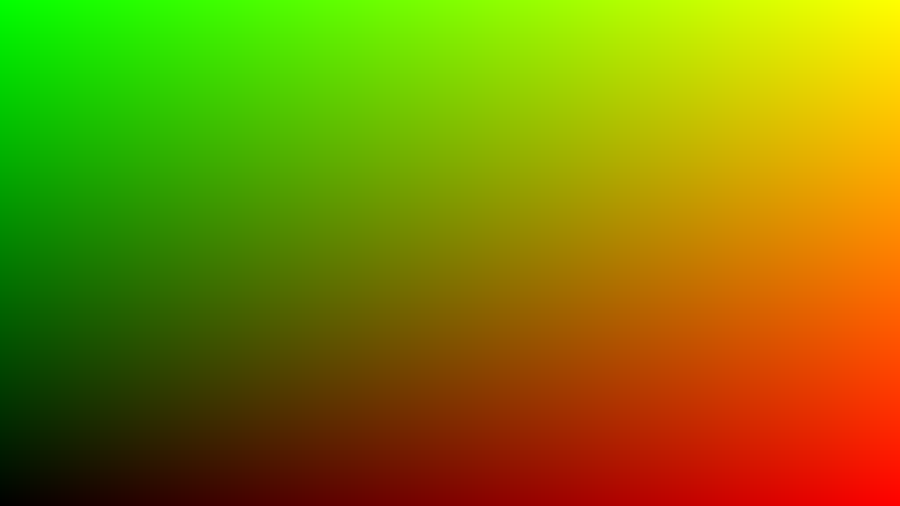

**Ergebnis:** Ein Farbverlauf – schwarz unten links, rot unten rechts, grün oben links, gelb oben rechts.

### Was passiert hier

`fragCoord` liefert rohe Pixelkoordinaten (z. B. 0 bis 1920). Damit kann man schlecht rechnen, weil der Code dann von der Auflösung abhängt. Die Division durch `iResolution.xy` normalisiert auf **0 bis 1** – das nennt man UV-Koordinaten.

Die Ausgabe der Koordinaten *als Farbe* ist der wichtigste Debug-Trick der Shader-Welt: Man sieht sofort, welcher Wert wo im Bild welchen Betrag hat.

### 💡 Warum dieser Schritt zuerst?

Jeder Shader – egal wie komplex – beginnt damit, ein sauberes Koordinatensystem aufzubauen. Fehler hier pflanzen sich durch alles Weitere fort.

### 🎨 Experimentieren

- `fragColor = vec4(uv.x, uv.x, uv.x, 1.0);` → Graustufen-Verlauf nur in x
- `fragColor = vec4(fract(uv * 10.0), 0.0, 1.0);` → 10×10 Kacheln (`fract` = Nachkommateil – erster Vorgeschmack auf „Wiederholung")

---

## Schritt 2 – Zentrieren und Seitenverhältnis korrigieren

**Neu:** Die im Original verwendete UV-Formel – Ursprung in der Bildmitte, keine Verzerrung.

```glsl
void mainImage(out vec4 fragColor, in vec2 fragCoord)
{
    // Ursprung in die Mitte, Division durch die HOEHE (nur y!)
    vec2 uv = (fragCoord - 0.5 * iResolution.xy) / iResolution.y;

    // Abstand zur Mitte als Helligkeit anzeigen
    fragColor = vec4(vec3(length(uv)), 1.0);
}
```

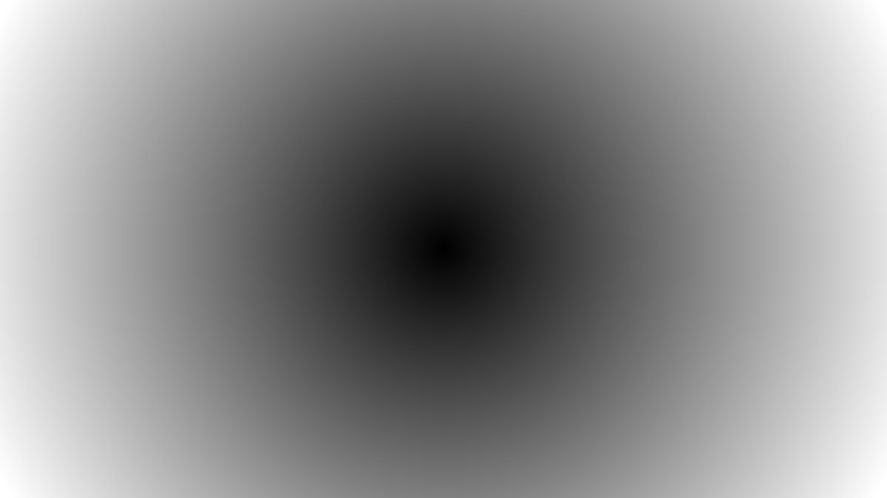

**Ergebnis:** Ein weicher radialer Verlauf – schwarz in der Mitte, hell zum Rand. Und zwar **kreisrund**, nicht oval.

### Was passiert hier

Zwei Änderungen gegenüber Schritt 1:

1. `fragCoord - 0.5 * iResolution.xy` verschiebt den Ursprung `(0,0)` in die **Bildmitte**. Links davon ist x negativ, rechts positiv.
2. Geteilt wird durch `iResolution.y` – **nur die Höhe**. Würde man x durch die Breite und y durch die Höhe teilen, wäre eine „Einheit" horizontal länger als vertikal → Kreise würden zu Ellipsen. Mit einem gemeinsamen Teiler bleibt die Geometrie unverzerrt; x läuft dann z. B. von −0.89 bis +0.89 (bei 16:9), y von −0.5 bis +0.5.

### 💡 Warum?

Der Ziel-Shader ist radialsymmetrisch (Spirale, Tunnel, Kaleidoskop). Dafür braucht man zwingend ein zentriertes, unverzerrtes Koordinatensystem. Diese eine Zeile ist der Standard-Opener von 90 % aller Shadertoy-Shader:

```glsl
vec2 uv = (fragCoord - 0.5 * iResolution.xy) / iResolution.y;
```

### 🎨 Experimentieren

- Teile stattdessen durch `iResolution.xy` und beobachte, wie der Kreis zum Oval wird
- `fragColor = vec4(vec3(step(0.3, length(uv))), 1.0);` → harter Kreis mit Radius 0.3. Glückwunsch: Du hast soeben deine erste **Distanzfunktion** benutzt, ohne es zu merken

---

## Schritt 3 – Raymarching: Ein Strahl trifft eine Kugel

**Neu:** Die 3D-Kernidee des ganzen Shaders – Sphere Tracing mit einer Signed Distance Function (SDF).

```glsl
// SDF: Abstand vom Punkt p zur Oberflaeche einer Kugel mit Radius 1
float map(vec3 p)
{
    return length(p) - 1.0;
}

void mainImage(out vec4 fragColor, in vec2 fragCoord)
{
    vec2 uv = (fragCoord - 0.5 * iResolution.xy) / iResolution.y;

    // Kamera: Position (ray origin) und Blickrichtung (ray direction)
    vec3 ro = vec3(0.0, 0.0, -3.0);          // 3 Einheiten vor der Szene
    vec3 rd = normalize(vec3(uv, 1.0));      // durch "unseren" Pixel nach vorn

    float dist = 0.0;                        // bisher zurueckgelegte Strecke
    vec3 color = vec3(0.0);                  // Hintergrund: schwarz

    for (int i = 0; i < 80; i++)
    {
        vec3 p = ro + rd * dist;             // aktuelle Position auf dem Strahl
        float d = map(p);                    // Abstand zur naechsten Oberflaeche

        if (d < 0.001) {                     // nah genug -> Treffer!
            color = vec3(1.0);
            break;
        }
        if (dist > 15.0) break;              // zu weit -> ins Leere gelaufen

        dist += d;                           // sicheren Schritt vorwaerts gehen
    }

    fragColor = vec4(color, 1.0);
}
```

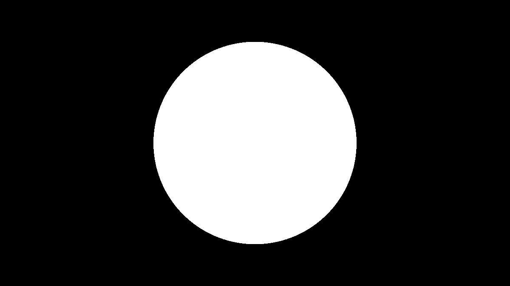

**Ergebnis:** Ein weißer Kreis auf schwarzem Grund. Unspektakulär – aber das ist eine echte 3D-Kugel, von einer echten Kamera aus gerendert.

### Was passiert hier

**Die SDF (`map`):** Eine Funktion, die für *jeden Punkt im Raum* sagt, wie weit die nächste Oberfläche entfernt ist. Für eine Kugel im Ursprung: Abstand zum Zentrum minus Radius. Positiv = außerhalb, negativ = innerhalb, null = genau auf der Oberfläche. Diese eine Funktion **ist** unsere gesamte Szene.

**Die Kamera:** `ro` (ray origin) ist der Augpunkt. `rd` (ray direction) zeigt für jeden Pixel leicht anders in die Szene – die `uv`-Werte kippen den Strahl nach links/rechts/oben/unten, die `1.0` in z bestimmt das Sichtfeld (kleiner = Weitwinkel).

**Der Marsch:** Und jetzt der geniale Trick des *Sphere Tracing*: Wir wissen nicht, *wo* der Strahl die Oberfläche trifft. Aber `map(p)` sagt uns: „Die nächste Oberfläche ist mindestens `d` entfernt." Also dürfen wir gefahrlos genau `d` weit vorwärtsgehen – wir können nichts überspringen. Das wiederholen wir: Weit weg von allem macht der Strahl große Schritte, nahe an Oberflächen immer kleinere, bis `d` praktisch null ist → Treffer.

### 💡 Warum Raymarching statt Dreiecke?

Weil die Szene dann nur *Mathematik* ist. Später verbiegen wir den Raum selbst (Wiederholung, Kaleidoskop, Twist) mit je 2–3 Zeilen – mit Dreiecks-Meshes wäre das praktisch unmöglich. Raymarching ist der Standardansatz für so gut wie alle abstrakten 3D-Shader auf Shadertoy.

### 🎨 Experimentieren

- `vec3 ro = vec3(0.0, 0.0, -6.0);` → Kamera weiter weg, Kugel kleiner
- `rd = normalize(vec3(uv, 2.0));` → Tele-Objektiv (engeres Sichtfeld)
- `return length(p) - 1.3;` → größerer Radius
- Ersetze `color = vec3(1.0)` durch `color = vec3(float(i) / 80.0);` → zeigt die *Anzahl der Schritte* pro Pixel. An den Rändern der Kugel wird es hell: Dort „schrammt" der Strahl lange an der Oberfläche entlang. Wichtiger Debug-Trick!

🧠 **Merke:** Raymarching = „Frag die SDF, wie weit du gehen darfst, und geh genau so weit. Wiederhole, bis du auftriffst oder aufgibst."

---

## Schritt 4 – Tiefe sichtbar machen

**Neu:** Statt „getroffen/nicht getroffen" nutzen wir die gelaufene Distanz als Helligkeit – unser erstes echtes 3D-Gefühl.

```glsl
float map(vec3 p)
{
    return length(p) - 1.0;
}

void mainImage(out vec4 fragColor, in vec2 fragCoord)
{
    vec2 uv = (fragCoord - 0.5 * iResolution.xy) / iResolution.y;

    vec3 ro = vec3(0.0, 0.0, -3.0);
    vec3 rd = normalize(vec3(uv, 1.0));

    float dist = 0.0;
    vec3 color = vec3(0.0);

    for (int i = 0; i < 80; i++)
    {
        vec3 p = ro + rd * dist;
        float d = map(p);

        if (d < 0.001) {
            // Nah = hell, fern = dunkel
            color = vec3(1.0 - dist * 0.25);
            break;
        }
        if (dist > 15.0) break;

        dist += d;
    }

    fragColor = vec4(color, 1.0);
}
```


**Ergebnis:** Die Kugel bekommt eine weiche Schattierung – die Mitte (näher an der Kamera) ist heller als der Rand.

### Was passiert hier

`dist` ist am Ende des Marsches die Entfernung Kamera → Auftreffpunkt. In der Kugelmitte trifft der Strahl früher auf (dist ≈ 2), am Rand später (dist ≈ 2.8). `1.0 - dist * 0.25` macht daraus Helligkeit.

### 💡 Warum dieser Zwischenschritt?

Zwei Gründe. Erstens: **`dist` ist eine der wertvollsten Informationen des Raymarchers** – das Original benutzt sie später gleich zweimal (für Nebel und für die Glow-Farbe). Zweitens ist das die Lehrbuch-Methode, um zwischen jedem Schritt zu prüfen, ob die Geometrie stimmt, *bevor* Beleuchtung ins Spiel kommt. Merksatz: **Erst Form, dann Farbe.**

### 🎨 Experimentieren

- `color = vec3(fract(dist));` → „Höhenlinien" der Entfernung
- Verschiebe die Kugel: `return length(p - vec3(0.8, 0.0, 0.0)) - 1.0;`

---

## Schritt 5 – Das Oktaeder: die Pyramidenform des Originals

**Neu:** `sdOctahedron` – die SDF, aus der später der gesamte Tunnel besteht.

```glsl
// SDF eines Oktaeders (Doppelpyramide) mit "Radius" s
float sdOctahedron(vec3 p, float s)
{
    p = abs(p);
    return (p.x + p.y + p.z - s) * 0.57735027;
}

float map(vec3 p)
{
    return sdOctahedron(p, 1.0);
}

void mainImage(out vec4 fragColor, in vec2 fragCoord)
{
    vec2 uv = (fragCoord - 0.5 * iResolution.xy) / iResolution.y;

    vec3 ro = vec3(0.0, 0.0, -3.0);
    vec3 rd = normalize(vec3(uv, 1.0));

    float dist = 0.0;
    vec3 color = vec3(0.0);

    for (int i = 0; i < 80; i++)
    {
        vec3 p = ro + rd * dist;
        float d = map(p);

        if (d < 0.001) {
            color = vec3(1.0 - dist * 0.25);
            break;
        }
        if (dist > 15.0) break;

        dist += d;
    }

    fragColor = vec4(color, 1.0);
}
```

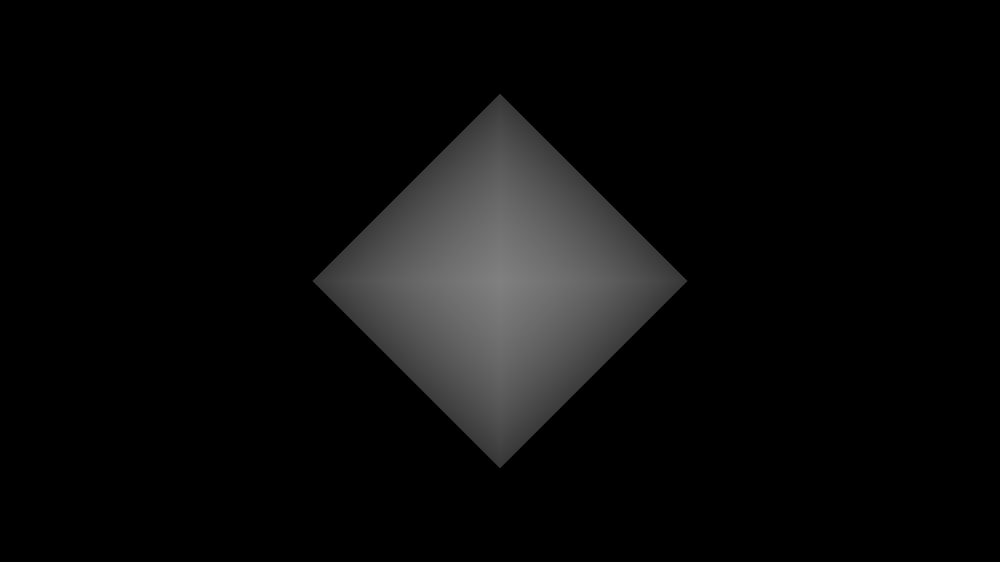

**Ergebnis:** Statt der Kugel eine Raute – wir schauen frontal auf eine Doppelpyramide (zwei mit den Grundflächen zusammengeklebte Pyramiden).

### Was passiert hier – die Mathematik

Ein Oktaeder ist die Menge aller Punkte mit `|x| + |y| + |z| = s` (die sogenannte „Manhattan-Distanz").

1. `p = abs(p);` faltet den Raum in den positiven Oktanten – wegen der Symmetrie des Oktaeders müssen wir nur noch eine seiner acht Flächen betrachten. **Raum falten statt acht Flächen einzeln prüfen** – dieses Muster (Symmetrie ausnutzen via `abs`) sehen wir beim Kaleidoskop wieder.
2. `p.x + p.y + p.z - s` ist null genau auf der Fläche, positiv außerhalb.
3. `* 0.57735027` – das ist **1/√3**. Der Ausdruck davor ist der Abstand zur *Ebene* mit Normalenvektor `(1,1,1)`, aber dieser Vektor hat Länge √3. Die Division normiert das Ergebnis auf einen *echten* euklidischen Abstand. Ohne diesen Faktor würde die SDF zu große Abstände melden, der Raymarcher würde zu große Schritte machen und durch Kanten hindurchspringen.

*(Streng genommen ist diese Formel nur in der Nähe der Flächen exakt und an den Kanten eine Näherung – für unsere Zwecke reicht das völlig, und sie ist herrlich billig.)*

### 💡 Warum ein Oktaeder?

Ästhetik trifft Ökonomie: Die Form hat scharfe Kanten und Spitzen (fängt später Licht und Fresnel wunderschön), kostet aber nur eine Handvoll Instruktionen – wichtig, denn `map` wird pro Pixel bis zu 80× aufgerufen, bei Normalenberechnung sogar 6× zusätzlich.

### 🎨 Experimentieren

- Lass `* 0.57735027` weg und schau auf die Kanten – Löcher und Artefakte!
- `p = abs(p); return max(max(p.x, p.y), p.z) - s;` → ein Würfel. Nur die Kombinationsregel ändert sich: Summe = Oktaeder, Maximum = Würfel
- Eine riesige Formelsammlung solcher SDFs pflegt Inigo Quilez: [iquilezles.org/articles/distfunctions](https://iquilezles.org/articles/distfunctions/)

---

## Schritt 6 – Normalen und erstes Licht

**Neu:** `calcNormal` – Oberflächenrichtungen aus der SDF ableiten – und eine einfache Diffus-Beleuchtung.

```glsl
float sdOctahedron(vec3 p, float s)
{
    p = abs(p);
    return (p.x + p.y + p.z - s) * 0.57735027;
}

float map(vec3 p)
{
    return sdOctahedron(p, 1.0);
}

// Normale = Richtung, in der die SDF am staerksten waechst (Gradient)
vec3 calcNormal(vec3 p)
{
    vec2 e = vec2(0.002, 0.0);
    return normalize(vec3(
        map(p + e.xyy) - map(p - e.xyy),   // Steigung in x
        map(p + e.yxy) - map(p - e.yxy),   // Steigung in y
        map(p + e.yyx) - map(p - e.yyx)    // Steigung in z
    ));
}

void mainImage(out vec4 fragColor, in vec2 fragCoord)
{
    vec2 uv = (fragCoord - 0.5 * iResolution.xy) / iResolution.y;

    vec3 ro = vec3(0.0, 0.0, -3.0);
    vec3 rd = normalize(vec3(uv, 1.0));

    float dist = 0.0;
    vec3 color = vec3(0.0);

    for (int i = 0; i < 80; i++)
    {
        vec3 p = ro + rd * dist;
        float d = map(p);

        if (d < 0.001) {
            vec3 n = calcNormal(p);

            // Debug-Ansicht (auskommentiert): Normalen als Farbe
            // color = n * 0.5 + 0.5;

            // Diffuses Licht: hell, wenn die Flaeche zum Licht zeigt
            vec3 lightDir = normalize(vec3(1.0, 1.0, -1.0));
            float diffuse = max(dot(n, lightDir), 0.0);
            color = vec3(0.1) + vec3(0.9) * diffuse;
            break;
        }
        if (dist > 15.0) break;

        dist += d;
    }

    fragColor = vec4(color, 1.0);
}
```

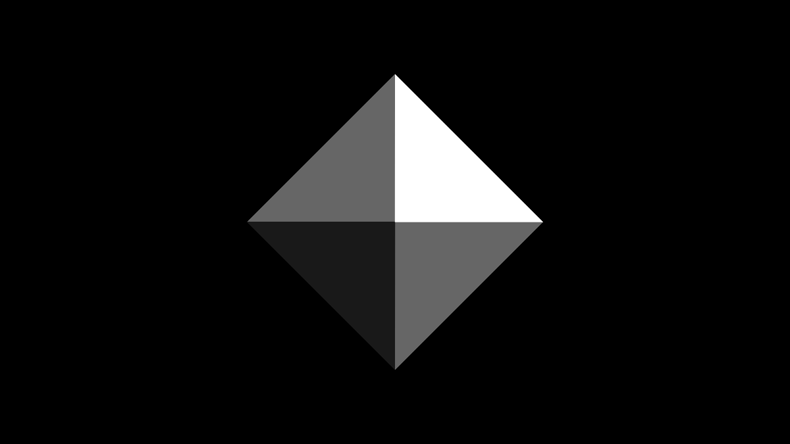

**Ergebnis:** Das Oktaeder ist plastisch – jede Fläche hat je nach Ausrichtung zum Licht eine eigene Helligkeit.

### Was passiert hier

**Die Normale** ist der Vektor, der senkrecht auf der Oberfläche steht – ohne sie keine Beleuchtung. Bei einer SDF bekommen wir sie fast geschenkt: Die SDF wächst am schnellsten, wenn man sich *senkrecht* von der Oberfläche entfernt. Die Richtung des stärksten Wachstums (der **Gradient**) ist also genau die Normale.

`calcNormal` misst diesen Gradienten numerisch: Für jede Achse wird die SDF ein winziges Stück (`0.002`) vor und zurück ausgewertet – die Differenz ist die Steigung in dieser Richtung (*zentrale Differenzen*, exakt wie im Original). Die Swizzles `e.xyy`, `e.yxy`, `e.yyx` sind nur eine kompakte Schreibweise für die Offsets `(0.002,0,0)`, `(0,0.002,0)`, `(0,0,0.002)`.

**Diffuses Licht:** `dot(n, lightDir)` ist 1, wenn die Fläche frontal zum Licht zeigt, 0 bei 90°, negativ auf der Rückseite (deshalb `max(..., 0.0)`). Das ist das Lambert-Modell – die einfachste physikalisch motivierte Beleuchtung.

### 💡 Warum jetzt?

Beleuchtung braucht Normalen, Normalen brauchen eine fertige `map`. Deshalb kommt dieser Schritt *nach* der Geometrie – und deshalb ändern wir `calcNormal` später nie wieder, egal wie wild wir `map` noch verbiegen: Der Gradient-Trick funktioniert automatisch für **jede** Szene, die `map` beschreibt. Das ist die stille Superkraft von SDFs.

### 🎨 Experimentieren

- Kommentiere die Debug-Zeile ein: Rot = Normale zeigt nach rechts (+x), Grün = nach oben (+y), Blau = zur Kamera... äh, von ihr weg (+z)
- Animiere das Licht: `vec3 lightDir = normalize(vec3(sin(iTime), 1.0, cos(iTime)));` – genau so macht es später das Original

---

## Schritt 7 – Den Raum wiederholen: aus eins mach unendlich

**Neu:** Domain Repetition mit `mod` – die wichtigste Raumverbiegung des ganzen Shaders.

```glsl
float sdOctahedron(vec3 p, float s)
{
    p = abs(p);
    return (p.x + p.y + p.z - s) * 0.57735027;
}

float map(vec3 p)
{
    // Raum in x-Richtung alle 1.0 Einheiten wiederholen
    p.x = mod(p.x, 1.0) - 0.5;

    return sdOctahedron(p, 0.25);
}

vec3 calcNormal(vec3 p)
{
    vec2 e = vec2(0.002, 0.0);
    return normalize(vec3(
        map(p + e.xyy) - map(p - e.xyy),
        map(p + e.yxy) - map(p - e.yxy),
        map(p + e.yyx) - map(p - e.yyx)
    ));
}

void mainImage(out vec4 fragColor, in vec2 fragCoord)
{
    vec2 uv = (fragCoord - 0.5 * iResolution.xy) / iResolution.y;

    vec3 ro = vec3(0.0, 0.0, -3.0);
    vec3 rd = normalize(vec3(uv, 1.0));

    float dist = 0.0;
    vec3 color = vec3(0.0);

    for (int i = 0; i < 80; i++)
    {
        vec3 p = ro + rd * dist;
        float d = map(p);

        if (d < 0.001) {
            vec3 n = calcNormal(p);
            vec3 lightDir = normalize(vec3(1.0, 1.0, -1.0));
            float diffuse = max(dot(n, lightDir), 0.0);
            color = vec3(0.1) + vec3(0.9) * diffuse;
            break;
        }
        if (dist > 15.0) break;

        dist += d;
    }

    fragColor = vec4(color, 1.0);
}
```

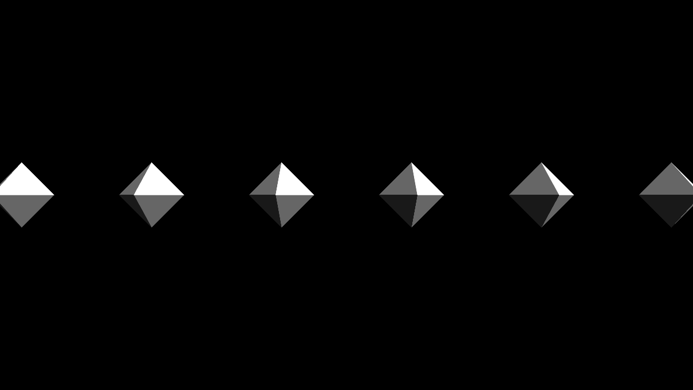

**Ergebnis:** Eine unendliche Reihe kleiner Oktaeder, die sich links und rechts aus dem Bild zieht. Wir haben **eine** Zeile geändert und **nichts** kopiert.

### Was passiert hier – das schönste Konzept im Raymarching

Wir wiederholen nicht das Objekt. Wir falten die **Frage**.

`mod(p.x, 1.0)` bildet jede x-Position auf den Bereich `0..1` ab: Der Punkt `x = 3.7` stellt der SDF dieselbe Frage wie `x = 0.7`. Das `- 0.5` zentriert die Zelle auf `-0.5..0.5`, sodass das Oktaeder in der **Mitte** jeder Zelle sitzt – ließe man es weg, säße die Form an der Zellgrenze und würde von `mod` in zwei Hälften zerschnitten.

Für die SDF sieht es so aus, als gäbe es nur ein einziges Oktaeder – aber jeder Punkt im Raum wird vor der Abfrage in dieselbe Einheitszelle teleportiert. Ergebnis: unendlich viele Kopien, **Kosten: null**. Kein anderes Renderverfahren kann das.

⚠️ **Eine Regel dabei:** Die Form muss in ihre Zelle *passen* (hier: Radius 0.25 < halbe Zellbreite 0.5). Ragt sie heraus, sieht die SDF die Nachbarkopie nicht, meldet zu große Abstände – und der Strahl springt durch Geometrie hindurch. Wenn du bei Repetition Artefakte siehst: fast immer das.

### 🎨 Experimentieren

- `p.x = mod(p.x, 0.6) - 0.3;` → dichtere Reihe
- Zusätzlich `p.y = mod(p.y, 1.0) - 0.5;` → ein ganzes 2D-Gitter
- Verletze absichtlich die Regel: `sdOctahedron(p, 0.6)` – und beobachte das Chaos

🧠 **Merke:** Domain Repetition = *„Verbiege die Eingabe der SDF, nicht die SDF selbst."* Nach diesem Prinzip funktionieren auch Kaleidoskop und Twist in den nächsten Schritten.

---

## Schritt 8 – Der unendliche Flug: Repetition in der Tiefe

**Neu:** Wiederholung auch in z + eine Kamera, die für immer vorwärts fliegt. Ab hier bewegt sich das Bild!

```glsl
float sdOctahedron(vec3 p, float s)
{
    p = abs(p);
    return (p.x + p.y + p.z - s) * 0.57735027;
}

float map(vec3 p)
{
    // Wiederholung in der Tiefe (z) und zur Seite (x) - Werte des Originals
    p.z = mod(p.z, 0.4) - 0.2;
    p.x = mod(p.x, 0.3) - 0.15;

    return sdOctahedron(p, 0.06);
}

vec3 calcNormal(vec3 p)
{
    vec2 e = vec2(0.002, 0.0);
    return normalize(vec3(
        map(p + e.xyy) - map(p - e.xyy),
        map(p + e.yxy) - map(p - e.yxy),
        map(p + e.yyx) - map(p - e.yyx)
    ));
}

void mainImage(out vec4 fragColor, in vec2 fragCoord)
{
    vec2 uv = (fragCoord - 0.5 * iResolution.xy) / iResolution.y;

    vec3 rd = normalize(vec3(uv, 1.0));

    // Kamera fliegt endlos nach vorn (leicht versetzt, um nicht
    // exakt durch eine Oktaeder-Reihe zu fliegen)
    vec3 ro = vec3(0.15, 0.1, -iTime * 0.8);

    float dist = 0.0;
    vec3 color = vec3(0.0);

    for (int i = 0; i < 80; i++)
    {
        vec3 p = ro + rd * dist;
        float d = map(p);

        if (d < 0.001) {
            vec3 n = calcNormal(p);
            vec3 lightDir = normalize(vec3(1.0, 1.0, -1.0));
            float diffuse = max(dot(n, lightDir), 0.0);
            color = vec3(0.1) + vec3(0.9) * diffuse;
            break;
        }
        if (dist > 15.0) break;

        dist += d;
    }

    fragColor = vec4(color, 1.0);
}
```

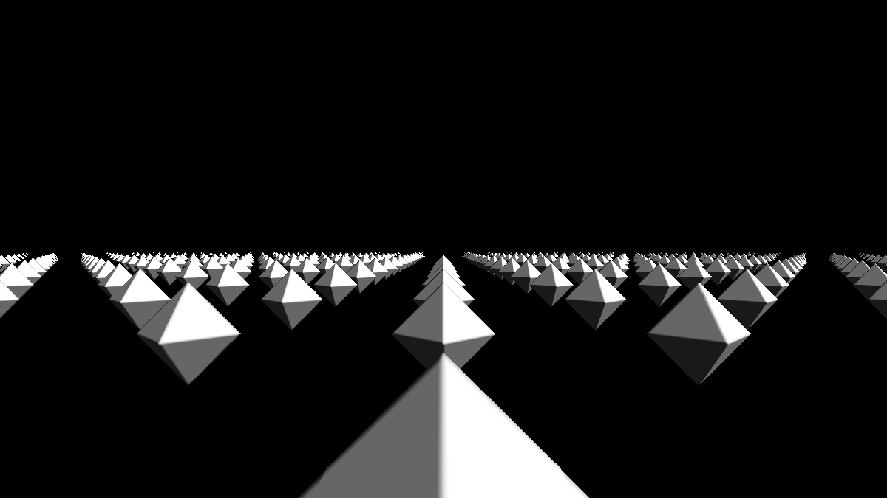

**Ergebnis:** Ein endloser Flug durch ein Feld winziger Oktaeder. In der Ferne flimmert es hässlich – das ist okay, das reparieren Nebel (Schritt 15) und Glow (Schritt 14) später.

### Was passiert hier

Zwei Dinge greifen ineinander:

1. **`map` wiederholt z alle 0.4 und x alle 0.3 Einheiten** – exakt die Zahlen des Originals. Die Oktaeder (Radius 0.06) sind winzig im Vergleich zur Zellgröße, es bleibt viel Leerraum: Genau da hindurch wird später der Blick durch den Tunnel gehen.
2. **Die Kamera fliegt:** `ro.z = -iTime * 0.8`. Moment – *minus*? Die Kamera bewegt sich in −z, schaut aber nach +z? Ja, und es funktioniert trotzdem perfekt: Der Raum ist in z unendlich wiederholt, also ist Vorwärts- von Rückwärtsflug nicht unterscheidbar – man sieht einfach endlos neue Zellen auf sich zukommen. (Warum das Original das Minus wählt: Es lässt die Textur der Welt in +z „vorbeiziehen", was sich mit der späteren Farbanimation gut verzahnt.)

**Der eigentliche Aha-Moment:** Kamerabewegung im Raymarching kostet nichts. Kein Nachladen, kein Level-Streaming – `ro` ist nur eine Zahl, die wächst. Die Welt existiert nirgends; sie wird an jedem Punkt frisch ausgerechnet, an dem ein Strahl vorbeikommt.

### 💡 Warum die Kamera versetzt (`0.15, 0.1`)?

Bei `ro = (0,0,...)` flöge die Kamera exakt auf einer Gitterlinie – periodisch mitten durch ein Oktaeder (schwarzes Vollbild für einen Moment). Der kleine Versatz legt die Flugbahn in den Leerraum zwischen den Reihen. Im fertigen Shader darf `ro` wieder auf `(0,0,...)`, weil das Kaleidoskop im nächsten Schritt die Mittelachse automatisch freiräumt.

### 🎨 Experimentieren

- `-iTime * 3.0` → Warp-Geschwindigkeit
- `p.z = mod(p.z, 1.5) - 0.75;` → luftigere Abstände in der Tiefe
- Setze `ro = vec3(0.0, 0.0, -iTime * 0.8)` und erlebe den periodischen „Augenblick der Finsternis"

### ↪ Die Weiche

Dieses flache, endlose Objekt-Feld ist mehr als ein Zwischenschritt – es ist ein **Verzweigungspunkt**. Die Hauptstrecke biegt ab Schritt 9 zum Kaleidoskop-Tunnel ab; **Anhang B** nimmt stattdessen genau diesen Stand als Ausgangspunkt und baut daraus eigene Varianten: austauschbare Formen mit gestreuten Größen (B1), eine 3D-Equalizer-Fläche, deren Ausschläge das Spektrum abbilden (B2), und Beat-Blitze, die zufällige Zellen aufglühen lassen (B3).

---

## Schritt 9 – Das Kaleidoskop: 9 Arme aus einem

**Neu:** Polare Raumfaltung – der Schritt, der aus dem Gitter die charakteristische Blüten-/Spiralstruktur des Originals macht.

```glsl
float sdOctahedron(vec3 p, float s)
{
    p = abs(p);
    return (p.x + p.y + p.z - s) * 0.57735027;
}

float map(vec3 p)
{
    // --- NEU: Kaleidoskop - Raum um die z-Achse in 9 Sektoren falten ---
    float r = length(p.xy);              // 1. In Polarkoordinaten:  Radius
    float a = atan(p.y, p.x);            //    ... und Winkel (-pi..pi)
    float sector = 6.2831853 / 9.0;      // 2. Winkelbreite eines Sektors (2pi/9)
    a = mod(a, sector) - sector / 2.0;   // 3. Winkel in EINEN Sektor falten
    p.xy = r * vec2(cos(a), sin(a));     // 4. Zurueck in kartesische Koordinaten

    // Wiederholung wie gehabt
    p.z = mod(p.z, 0.4) - 0.2;
    p.x = mod(p.x, 0.3) - 0.15;

    return sdOctahedron(p, 0.06);
}

vec3 calcNormal(vec3 p)
{
    vec2 e = vec2(0.002, 0.0);
    return normalize(vec3(
        map(p + e.xyy) - map(p - e.xyy),
        map(p + e.yxy) - map(p - e.yxy),
        map(p + e.yyx) - map(p - e.yyx)
    ));
}

void mainImage(out vec4 fragColor, in vec2 fragCoord)
{
    vec2 uv = (fragCoord - 0.5 * iResolution.xy) / iResolution.y;

    vec3 rd = normalize(vec3(uv, 1.0));

    // Kamera darf jetzt auf die Mittelachse - die bleibt frei (siehe unten)
    vec3 ro = vec3(0.0, 0.0, -iTime * 0.8);

    float dist = 0.0;
    vec3 color = vec3(0.0);

    for (int i = 0; i < 80; i++)
    {
        vec3 p = ro + rd * dist;
        float d = map(p);

        if (d < 0.001) {
            vec3 n = calcNormal(p);
            vec3 lightDir = normalize(vec3(1.0, 1.0, -1.0));
            float diffuse = max(dot(n, lightDir), 0.0);
            color = vec3(0.1) + vec3(0.9) * diffuse;
            break;
        }
        if (dist > 15.0) break;

        dist += d;
    }

    fragColor = vec4(color, 1.0);
}
```

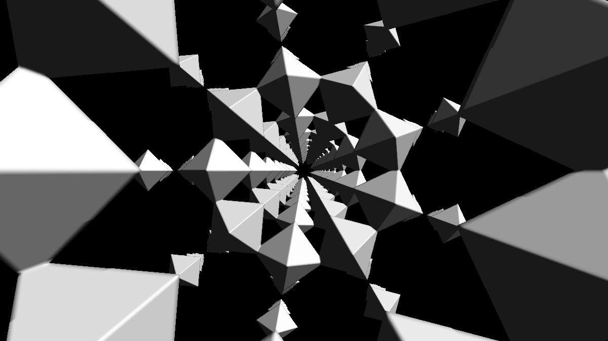

**Ergebnis:** Der Flug durch einen Tunnel mit **neunfacher Radialsymmetrie** – neun identische „Arme" aus Oktaeder-Ketten, die sich strahlenförmig um das Zentrum anordnen. Die Grundgeometrie des Originals steht!

### Was passiert hier – Zeile für Zeile

Dasselbe Prinzip wie `mod(p.x, ...)` – nur auf den **Winkel** angewandt statt auf eine Achse:

1. `length(p.xy)` und `atan(p.y, p.x)` übersetzen die xy-Position in Polarkoordinaten: *Wie weit weg von der z-Achse (Radius r), und in welcher Himmelsrichtung (Winkel a)?* Die z-Achse ist dabei unsere Tunnelachse.
2. Der Vollkreis (2π ≈ 6.2831853) wird durch 9 geteilt → jeder Sektor ist 40° breit.
3. `mod(a, sector) - sector/2.0` faltet **alle** Winkel in den einen Sektor um die x-Achse herum – exakt das Zentrier-Muster aus Schritt 7, nur rotationsförmig.
4. Zurück nach kartesisch, denn `sdOctahedron` und die mod-Zeilen erwarten x/y/z.

Danach genügt es, den **einen** Sektor mit Inhalt zu füllen (das erledigen die zwei mod-Zeilen: `p.x` ist nach der Faltung ≈ der Radius, die x-Repetition erzeugt also Oktaeder-Ketten *nach außen*) – das Kaleidoskop stempelt ihn neunmal um die Achse.

**Warum die Mittelachse frei bleibt:** Nach der Faltung landet die erste Oktaeder-Reihe bei Radius ≈ 0.15 – direkt auf der Achse (r = 0) ist nichts. Deshalb kann die Kamera nun gefahrlos bei `(0,0)` fliegen: Sie schaut durch das leere Zentrum des Kaleidoskops. Kein Zufall, sondern Design.

### 💡 Warum 9?

Reine Ästhetik – probier's aus. Ungerade Zahlen wirken organischer, weil sich gegenüberliegende Arme nicht exakt spiegeln. Kleiner Schönheitsfehler der Methode, den auch das Original hat: An den Sektorgrenzen können Formen hart abgeschnitten werden und die Normalen springen. Bei kleinen Objekten und viel Bewegung fällt das nicht auf.

### 🎨 Experimentieren

- `/ 9.0` → `/ 5.0` oder `/ 16.0` – völlig anderer Charakter
- Kaleidoskop-Zeilen auskommentieren → wieder Schritt 8. Dieser Vorher/Nachher-Vergleich ist der beste Weg, die Faltung zu *begreifen*
- `a = mod(a, sector);` ohne das `- sector/2.0` → die Arme sitzen asymmetrisch im Sektor, an der 0°-Grenze entstehen Schnittkanten

🧠 **Merke:** Kaleidoskop = `mod` auf dem Winkel. Wiederholung = `mod` auf einer Achse. Es ist *dieselbe Idee* in zwei Koordinatensystemen.

---

## Schritt 10 – Der Twist: aus dem Tunnel wird eine Spirale

**Neu:** Das Rotations-Makro `R(a)` und eine Verdrehung des Raums entlang der Tiefe.

```glsl
// 2D-Rotationsmatrix um den Winkel a
#define R(a) mat2(cos(a), sin(a), -sin(a), cos(a))

float sdOctahedron(vec3 p, float s)
{
    p = abs(p);
    return (p.x + p.y + p.z - s) * 0.57735027;
}

float map(vec3 p)
{
    // --- NEU: Twist - Rotation um die z-Achse, abhaengig von der Tiefe ---
    p.xy *= R(p.z * 0.15);

    // Kaleidoskop
    float r = length(p.xy);
    float a = atan(p.y, p.x);
    float sector = 6.2831853 / 9.0;
    a = mod(a, sector) - sector / 2.0;
    p.xy = r * vec2(cos(a), sin(a));

    // Wiederholung
    p.z = mod(p.z, 0.4) - 0.2;
    p.x = mod(p.x, 0.3) - 0.15;

    return sdOctahedron(p, 0.06);
}

vec3 calcNormal(vec3 p)
{
    vec2 e = vec2(0.002, 0.0);
    return normalize(vec3(
        map(p + e.xyy) - map(p - e.xyy),
        map(p + e.yxy) - map(p - e.yxy),
        map(p + e.yyx) - map(p - e.yyx)
    ));
}

void mainImage(out vec4 fragColor, in vec2 fragCoord)
{
    vec2 uv = (fragCoord - 0.5 * iResolution.xy) / iResolution.y;

    vec3 rd = normalize(vec3(uv, 1.0));
    vec3 ro = vec3(0.0, 0.0, -iTime * 0.8);

    float dist = 0.0;
    vec3 color = vec3(0.0);

    for (int i = 0; i < 80; i++)
    {
        vec3 p = ro + rd * dist;
        float d = map(p);

        if (d < 0.001) {
            vec3 n = calcNormal(p);
            vec3 lightDir = normalize(vec3(1.0, 1.0, -1.0));
            float diffuse = max(dot(n, lightDir), 0.0);
            color = vec3(0.1) + vec3(0.9) * diffuse;
            break;
        }
        if (dist > 15.0) break;

        dist += d;
    }

    fragColor = vec4(color, 1.0);
}
```

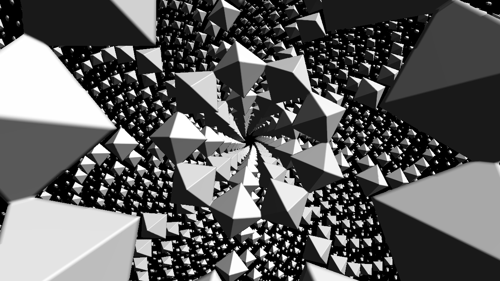

**Ergebnis:** Die neun geraden Arme winden sich jetzt schraubenförmig um die Tunnelachse – die namensgebende **Spirale** ist da.

### Was passiert hier

**Das Makro:** `R(a)` baut die klassische 2D-Rotationsmatrix. `p.xy *= R(a)` dreht den Punkt in der xy-Ebene, z bleibt unberührt. Als `#define`, weil es gleich an drei Stellen gebraucht wird (Twist, Kamera-Roll, Kamera-Nicken).

**Der Twist:** Der Drehwinkel ist nicht konstant, sondern `p.z * 0.15` – **je tiefer im Tunnel, desto stärker verdreht**. Bei z = 0 keine Drehung, bei z = 10 sind es 1.5 Radiant (~86°). Jede „Scheibe" des Raums ist gegen ihre Nachbarscheibe minimal verdreht; über die Distanz summiert sich das zur Schraube. Wieder das Prinzip aus Schritt 7: Wir verbiegen die *Eingabe* der SDF – die Oktaeder selbst wissen von alledem nichts.

**⚠️ Die Reihenfolge in `map` ist entscheidend:** Twist → Kaleidoskop → Repetition. Jede Zeile verformt den Raum, in dem die *nachfolgenden* Zeilen arbeiten. Vertauscht man Twist und Kaleidoskop, werden die bereits gefalteten Sektoren verdreht – ein sichtbar anderes (zerrissenes) Bild. Beim Bauen eigener Shader ist das Durchprobieren dieser Reihenfolge übrigens eine ergiebige Quelle glücklicher Unfälle.

### 💡 Der versteckte Preis des Twists

Ein Twist ist keine „ehrliche" Abstandserhaltung mehr: Er staucht den Raum tangential, die SDF kann dadurch **etwas zu große** Abstände melden – der Marschierer kann übers Ziel hinausschießen. Bei mildem `0.15` geht es meist gut; wird das Bild an Kanten unruhig, ist das der Grund. Das Original begegnet dem mit verkürzten Schritten – das bauen wir in Schritt 15 ein. Merke schon jetzt: **Raum verbiegen ist nie gratis.**

### 🎨 Experimentieren

- `p.z * 0.5` → dramatische Korkenzieher-Optik (und deutlich mehr Artefakte – gut zum Verständnis!)
- `p.z * 0.0` → Twist aus, direkter Vergleich zu Schritt 9
- Twist *nach* dem Kaleidoskop einfügen und den Unterschied ansehen

---

## Schritt 11 – Animation: die Spirale dreht sich, die Kamera lebt

**Neu:** Ein zeitgesteuerter Drehwinkel `spinAngle` – synchron im Raum *und* auf der Kamera – plus ein sanftes Kamera-Nicken.

```glsl
#define R(a) mat2(cos(a), sin(a), -sin(a), cos(a))

float sdOctahedron(vec3 p, float s)
{
    p = abs(p);
    return (p.x + p.y + p.z - s) * 0.57735027;
}

float map(vec3 p)
{
    // --- NEU: Twist bekommt einen animierten Zusatzwinkel ---
    float spinAngle = (1.0 - cos(iTime * 0.15)) * 3.14159265;
    p.xy *= R(p.z * 0.15 + spinAngle);

    float r = length(p.xy);
    float a = atan(p.y, p.x);
    float sector = 6.2831853 / 9.0;
    a = mod(a, sector) - sector / 2.0;
    p.xy = r * vec2(cos(a), sin(a));

    p.z = mod(p.z, 0.4) - 0.2;
    p.x = mod(p.x, 0.3) - 0.15;

    return sdOctahedron(p, 0.06);
}

vec3 calcNormal(vec3 p)
{
    vec2 e = vec2(0.002, 0.0);
    return normalize(vec3(
        map(p + e.xyy) - map(p - e.xyy),
        map(p + e.yxy) - map(p - e.yxy),
        map(p + e.yyx) - map(p - e.yyx)
    ));
}

void mainImage(out vec4 fragColor, in vec2 fragCoord)
{
    vec2 uv = (fragCoord - 0.5 * iResolution.xy) / iResolution.y;
    vec3 rd = normalize(vec3(uv, 1.0));

    // --- NEU: Kamera dreht mit halber Staerke mit und nickt leicht ---
    float spinAngle = (1.0 - cos(iTime * 0.15)) * 3.14159265;
    rd.xy *= R(spinAngle * 0.5);            // Roll (Drehung um Blickachse)
    rd.xz *= R(sin(iTime * 0.5) * 0.1);     // sanftes Pendeln zur Seite

    vec3 ro = vec3(0.0, 0.0, -iTime * 0.8);

    float dist = 0.0;
    vec3 color = vec3(0.0);

    for (int i = 0; i < 80; i++)
    {
        vec3 p = ro + rd * dist;
        float d = map(p);

        if (d < 0.001) {
            vec3 n = calcNormal(p);
            vec3 lightDir = normalize(vec3(1.0, 1.0, -1.0));
            float diffuse = max(dot(n, lightDir), 0.0);
            color = vec3(0.1) + vec3(0.9) * diffuse;
            break;
        }
        if (dist > 15.0) break;

        dist += d;
    }

    fragColor = vec4(color, 1.0);
}
```

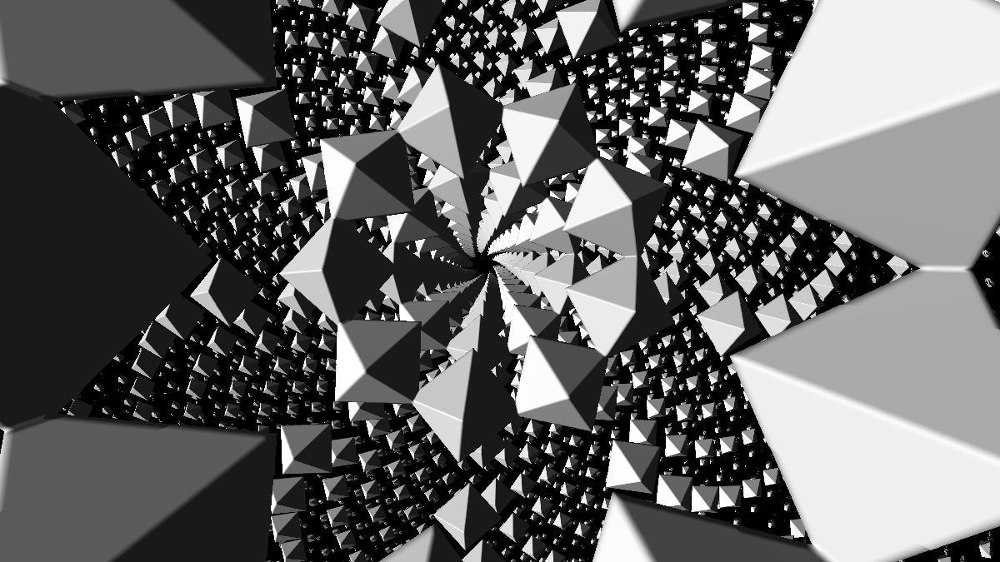

**Ergebnis:** Die gesamte Spirale rotiert – mal beschleunigend, mal fast stillstehend – während die Kamera dazu leicht rollt und pendelt. Die hypnotische Bewegung des Originals.

### Was passiert hier

**Die Winkel-Formel** `(1.0 - cos(t * 0.15)) * π` ist raffinierter, als sie aussieht:

- `cos(t * 0.15)` pendelt sehr langsam (eine Periode ≈ 42 s) zwischen −1 und 1
- `1.0 - cos(...)` verschiebt das auf **0 bis 2**
- mal π → der Winkel pendelt zwischen **0 und 2π**, also genau einer Vollumdrehung

Der Clou: An den Umkehrpunkten (0 und 2π) ist die Winkel*geschwindigkeit* null – die Rotation schwingt organisch an und aus, statt monoton zu kreiseln wie ein simples `iTime * speed`. Solche Ease-in/Ease-out-Kurven aus Cosinus zu bauen ist ein Standardwerkzeug für „lebendige" Animation.

**Warum derselbe Winkel an zwei Orten?** Im `map` dreht `spinAngle` die Welt; auf `rd` dreht er (halb so stark) die Kamera **mit**. Die Kamera „verfolgt" die Rotation also zu 50 % – die Welt scheint sich zu drehen *und* man selbst kippt mit. Dieses Gegeneinander zweier gekoppelter Rotationen erzeugt den sogartigen, leicht schwindelerregenden Charakter. Setze testweise `* 0.5` auf `* 1.0` (Kamera klebt an der Welt, wirkt statischer) oder `* 0.0` (nüchternes Zuschauen von außen).

**`rd.xz *= R(sin(iTime*0.5)*0.1)`** schwenkt den Blick um ±0.1 Radiant (±6°) zur Seite – kaum bewusst wahrnehmbar, aber es nimmt dem Bild die sterile Achsensymmetrie. Kamerabewegung im Raymarching heißt schlicht: **`rd` rotieren, `ro` verschieben.** Mehr ist es nie.

### 💡 Warum Animation vor Farbe und Licht?

Weil Bewegung Geometrie *ist*: Erst wenn Timing und Raumverformung sitzen, lohnt es sich, Farben abzustimmen – die hängen im Original nämlich von Position **und** Zeit ab. Andersherum müsste man die Farbabstimmung nach jeder Timing-Änderung wiederholen.

### 🎨 Experimentieren

- `iTime * 0.15` → `iTime * 0.6`: hektischer Puls statt Meditation
- Kamera-Roll auf `* 1.0` bzw. `* 0.0` (siehe oben)
- `rd.xz *= R(sin(iTime * 0.5) * 0.4);` → seekrank in 30 Sekunden

---

## Schritt 12 – Farbe: die Cosinus-Palette

**Neu:** `palette()` – prozedurale Farbverläufe nach Inigo Quilez, gesteuert durch die Position im Raum.

```glsl
#define R(a) mat2(cos(a), sin(a), -sin(a), cos(a))

float sdOctahedron(vec3 p, float s)
{
    p = abs(p);
    return (p.x + p.y + p.z - s) * 0.57735027;
}

// --- NEU: Cosinus-Farbpalette ---
vec3 palette(float t)
{
    vec3 d = vec3(0.0, 0.333, 0.667);                 // Phasenversatz R/G/B
    vec3 col = 0.5 + 0.5 * cos(6.28318 * (t + d));    // drei versetzte Wellen
    return smoothstep(0.15, 0.85, col);               // Kontrast anheben
}

float map(vec3 p)
{
    float spinAngle = (1.0 - cos(iTime * 0.15)) * 3.14159265;
    p.xy *= R(p.z * 0.15 + spinAngle);

    float r = length(p.xy);
    float a = atan(p.y, p.x);
    float sector = 6.2831853 / 9.0;
    a = mod(a, sector) - sector / 2.0;
    p.xy = r * vec2(cos(a), sin(a));

    p.z = mod(p.z, 0.4) - 0.2;
    p.x = mod(p.x, 0.3) - 0.15;

    return sdOctahedron(p, 0.06);
}

vec3 calcNormal(vec3 p)
{
    vec2 e = vec2(0.002, 0.0);
    return normalize(vec3(
        map(p + e.xyy) - map(p - e.xyy),
        map(p + e.yxy) - map(p - e.yxy),
        map(p + e.yyx) - map(p - e.yyx)
    ));
}

void mainImage(out vec4 fragColor, in vec2 fragCoord)
{
    vec2 uv = (fragCoord - 0.5 * iResolution.xy) / iResolution.y;
    vec3 rd = normalize(vec3(uv, 1.0));

    float spinAngle = (1.0 - cos(iTime * 0.15)) * 3.14159265;
    rd.xy *= R(spinAngle * 0.5);
    rd.xz *= R(sin(iTime * 0.5) * 0.1);

    vec3 ro = vec3(0.0, 0.0, -iTime * 0.8);

    float dist = 0.0;
    vec3 color = vec3(0.0);

    for (int i = 0; i < 80; i++)
    {
        vec3 p = ro + rd * dist;
        float d = map(p);

        if (d < 0.001) {
            vec3 n = calcNormal(p);

            // --- NEU: Grundfarbe aus Position + Zeit ---
            vec3 albedo = palette(p.z * 1.5 + iTime * 0.5 + p.x);

            vec3 lightDir = normalize(vec3(1.0, 1.0, -1.0));
            float diffuse = max(dot(n, lightDir), 0.0);
            color = albedo * (0.2 + 0.8 * diffuse);
            break;
        }
        if (dist > 15.0) break;

        dist += d;
    }

    fragColor = vec4(color, 1.0);
}
```

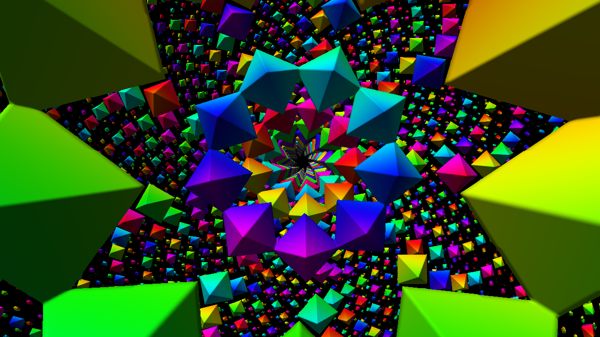

**Ergebnis:** Der Tunnel färbt sich in fließende Regenbogenbänder, die mit der Tiefe wandern und langsam durch die Szene pulsieren.

### Was passiert hier – die eleganteste Farbformel der Shader-Welt

`0.5 + 0.5 * cos(2π · (t + d))` erzeugt pro Farbkanal eine Welle zwischen 0 und 1. Der Trick steckt im **Phasenversatz** `d = (0.0, 0.333, 0.667)`: Rot, Grün und Blau durchlaufen dieselbe Welle, aber jeweils um ein Drittel Periode verschoben. Läuft `t` von 0 bis 1, wandert die Farbe einmal durch den kompletten Farbkreis – und weil alles auf Cosinus basiert, ist der Verlauf **nahtlos periodisch**: perfekt für unsere endlos wiederholte Welt. (Die allgemeine Form `a + b·cos(2π(c·t+d))` mit vier Stellschrauben stammt von Inigo Quilez: [iquilezles.org/articles/palettes](https://iquilezles.org/articles/palettes/).)

Das `smoothstep(0.15, 0.85, col)` ist Noztols persönliche Note: Es beschneidet die flauen Enden der Wellen und drückt die Farben Richtung satt/leuchtend – aus Pastell wird Neon.

**Der Eingabewert ist die halbe Miete:** `palette(p.z * 1.5 + iTime * 0.5 + p.x)` mischt drei Quellen –

- `p.z * 1.5` → Farbbänder entlang der Tunneltiefe (Ringe)
- `iTime * 0.5` → die Bänder wandern durch die Zeit
- `+ p.x` → leichte Schrägstellung, damit die Ringe nicht steril konzentrisch sind

### 💡 Warum eine berechnete Palette statt fester Farben?

Weil sich *ein einziger Float* (`t`) als Steuerkanal durch den ganzen Shader ziehen lässt: Position, Zeit, Entfernung – alles kann Farbe werden. Das Original nutzt genau das später ein zweites Mal, um den **Glow** mit `palette(dist * ...)` einzufärben – gleiche Funktion, andere Eingabe, stimmiges Gesamtbild gratis.

### 🎨 Experimentieren

- `vec3 d = vec3(0.0, 0.1, 0.2);` → enges, goldglühendes Schema statt Regenbogen
- `smoothstep(0.15, 0.85, ...)` entfernen → weiche Pastellversion
- `palette(p.z * 6.0 + ...)` → schmale, schnelle Farbringe

---

## Schritt 13 – Licht wie im Original: Fresnel + Glanzpunkt

**Neu:** Das Diffus-Provisorium fliegt raus; stattdessen Kantenglühen (Fresnel) und wandernde Spitzlichter (Specular) – exakt der Look des Originals.

```glsl
#define R(a) mat2(cos(a), sin(a), -sin(a), cos(a))

float sdOctahedron(vec3 p, float s)
{
    p = abs(p);
    return (p.x + p.y + p.z - s) * 0.57735027;
}

vec3 palette(float t)
{
    vec3 d = vec3(0.0, 0.333, 0.667);
    vec3 col = 0.5 + 0.5 * cos(6.28318 * (t + d));
    return smoothstep(0.15, 0.85, col);
}

float map(vec3 p)
{
    float spinAngle = (1.0 - cos(iTime * 0.15)) * 3.14159265;
    p.xy *= R(p.z * 0.15 + spinAngle);

    float r = length(p.xy);
    float a = atan(p.y, p.x);
    float sector = 6.2831853 / 9.0;
    a = mod(a, sector) - sector / 2.0;
    p.xy = r * vec2(cos(a), sin(a));

    p.z = mod(p.z, 0.4) - 0.2;
    p.x = mod(p.x, 0.3) - 0.15;

    return sdOctahedron(p, 0.06);
}

vec3 calcNormal(vec3 p)
{
    vec2 e = vec2(0.002, 0.0);
    return normalize(vec3(
        map(p + e.xyy) - map(p - e.xyy),
        map(p + e.yxy) - map(p - e.yxy),
        map(p + e.yyx) - map(p - e.yyx)
    ));
}

void mainImage(out vec4 fragColor, in vec2 fragCoord)
{
    vec2 uv = (fragCoord - 0.5 * iResolution.xy) / iResolution.y;
    vec3 rd = normalize(vec3(uv, 1.0));

    float spinAngle = (1.0 - cos(iTime * 0.15)) * 3.14159265;
    rd.xy *= R(spinAngle * 0.5);
    rd.xz *= R(sin(iTime * 0.5) * 0.1);

    vec3 ro = vec3(0.0, 0.0, -iTime * 0.8);

    float dist = 0.0;
    vec3 color = vec3(0.0);

    for (int i = 0; i < 80; i++)
    {
        vec3 p = ro + rd * dist;
        float d = map(p);

        if (d < 0.001) {
            vec3 n = calcNormal(p);

            // --- NEU: Fresnel - Flaechen leuchten, wo man flach drueberschaut ---
            float fresnel = pow(1.0 - max(dot(n, -rd), 0.0), 2.5);
            vec3 albedo = palette(p.z * 1.5 + iTime * 0.5 + p.x);
            color = albedo * fresnel * 2.5;

            // --- NEU: Specular - wanderndes Spitzlicht ---
            vec3 lightDir = normalize(vec3(sin(iTime), 1.0, cos(iTime)));
            float spec = pow(max(dot(reflect(rd, n), lightDir), 0.0), 32.0);
            color += spec * albedo * 2.0;

            break;
        }
        if (dist > 15.0) break;

        dist += d;
    }

    fragColor = vec4(color, 1.0);
}
```

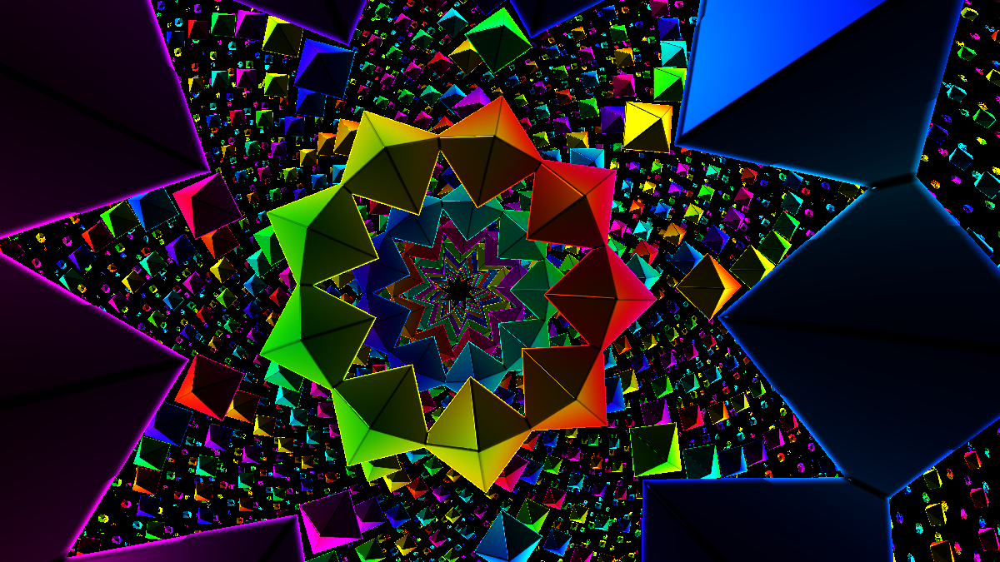

**Ergebnis:** Die Oktaeder wirken plötzlich wie aus dunklem Glas oder Kristall – frontal fast schwarz, an den Kanten und Silhouetten farbglühend, mit umherwandernden Glanzblitzen.

### Was passiert hier

**Fresnel** – benannt nach dem Physiker: Oberflächen reflektieren umso stärker, je *flacher* der Blickwinkel. Denk an einen See – senkrecht von oben siehst du den Grund, flach übers Wasser einen Spiegel.

- `dot(n, -rd)` misst, wie frontal wir auf die Fläche schauen (1 = senkrecht drauf, 0 = streifend)
- `1.0 - ...` kehrt es um: streifende Blicke bekommen den hohen Wert
- `pow(..., 2.5)` konzentriert den Effekt auf wirklich flache Winkel

Ergebnis: Flächenmitten dunkel, **Kanten und Umrisse leuchten** – bei einer kantigen Form wie dem Oktaeder werden dadurch buchstäblich die Konturen nachgezeichnet. Deshalb der „Neon-Drahtgitter"-Charakter des Originals: Er ist keine gezeichnete Linie, sondern pure Blickwinkel-Physik. Das `* 2.5` pumpt die Helligkeit über 1.0 – Absicht: Das Tonemapping in Schritt 16 fängt das wieder ein.

**Specular:** `reflect(rd, n)` berechnet, wohin der Blickstrahl von der Fläche abprallen würde. Zeigt dieser Reflexionsstrahl zufällig zur Lichtquelle → Glanzpunkt. `pow(..., 32.0)` macht ihn klein und hart (je höher der Exponent, desto polierter wirkt das Material). Da `lightDir` mit `sin(iTime)/cos(iTime)` im Kreis fährt, **wandern** die Glanzblitze über die Facetten – das Glitzern im fertigen Shader.

### 💡 Warum kein Diffus-Anteil?

Eine bewusste Stilentscheidung: Diffuses Licht würde die Flächen gleichmäßig füllen – das Objekt sähe aus wie Plastik. Nur-Fresnel + Specular lässt die Flächen dunkel und die Kanten sprechen: Kristall statt Plastik. Beim Licht-Design gilt: **Weglassen formt den Look genauso wie Hinzufügen.**

### 🎨 Experimentieren

- `pow(..., 2.5)` → `pow(..., 6.0)`: nur noch hauchdünne Kantenlinien
- `pow(..., 32.0)` → `pow(..., 4.0)`: breite, seifige Glanzflächen
- Füge testweise `color += albedo * 0.3;` hinzu → der „Plastik-Vergleich"

---

## Schritt 14 – Glow: Licht aus den Beinahe-Treffern

**Neu:** Der Volumen-Glow – das atmosphärische Leuchten, das den Shader von „Geometrie-Demo" zu „Kunstwerk" macht.

```glsl
#define R(a) mat2(cos(a), sin(a), -sin(a), cos(a))

float sdOctahedron(vec3 p, float s)
{
    p = abs(p);
    return (p.x + p.y + p.z - s) * 0.57735027;
}

vec3 palette(float t)
{
    vec3 d = vec3(0.0, 0.333, 0.667);
    vec3 col = 0.5 + 0.5 * cos(6.28318 * (t + d));
    return smoothstep(0.15, 0.85, col);
}

float map(vec3 p)
{
    float spinAngle = (1.0 - cos(iTime * 0.15)) * 3.14159265;
    p.xy *= R(p.z * 0.15 + spinAngle);

    float r = length(p.xy);
    float a = atan(p.y, p.x);
    float sector = 6.2831853 / 9.0;
    a = mod(a, sector) - sector / 2.0;
    p.xy = r * vec2(cos(a), sin(a));

    p.z = mod(p.z, 0.4) - 0.2;
    p.x = mod(p.x, 0.3) - 0.15;

    return sdOctahedron(p, 0.06);
}

vec3 calcNormal(vec3 p)
{
    vec2 e = vec2(0.002, 0.0);
    return normalize(vec3(
        map(p + e.xyy) - map(p - e.xyy),
        map(p + e.yxy) - map(p - e.yxy),
        map(p + e.yyx) - map(p - e.yyx)
    ));
}

void mainImage(out vec4 fragColor, in vec2 fragCoord)
{
    vec2 uv = (fragCoord - 0.5 * iResolution.xy) / iResolution.y;
    vec3 rd = normalize(vec3(uv, 1.0));

    float spinAngle = (1.0 - cos(iTime * 0.15)) * 3.14159265;
    rd.xy *= R(spinAngle * 0.5);
    rd.xz *= R(sin(iTime * 0.5) * 0.1);

    vec3 ro = vec3(0.0, 0.0, -iTime * 0.8);

    float dist = 0.0;
    vec3 color = vec3(0.0);
    float glow = 0.0;                       // --- NEU: Glow-Sammler ---

    for (int i = 0; i < 80; i++)
    {
        vec3 p = ro + rd * dist;
        float d = map(p);

        // --- NEU: Bei JEDEM Schritt Leuchten aufsammeln ---
        glow += 0.0015 / (0.0005 + abs(d));

        if (d < 0.001) {
            vec3 n = calcNormal(p);

            float fresnel = pow(1.0 - max(dot(n, -rd), 0.0), 2.5);
            vec3 albedo = palette(p.z * 1.5 + iTime * 0.5 + p.x);
            color = albedo * fresnel * 2.5;

            vec3 lightDir = normalize(vec3(sin(iTime), 1.0, cos(iTime)));
            float spec = pow(max(dot(reflect(rd, n), lightDir), 0.0), 32.0);
            color += spec * albedo * 2.0;

            break;
        }
        if (dist > 15.0) break;

        dist += d;
    }

    // --- NEU: Glow einfaerben und ueber das Bild legen ---
    vec3 glowColor = palette(dist * 0.2 - iTime) * glow * 0.06;
    color += glowColor;

    fragColor = vec4(color, 1.0);
}
```

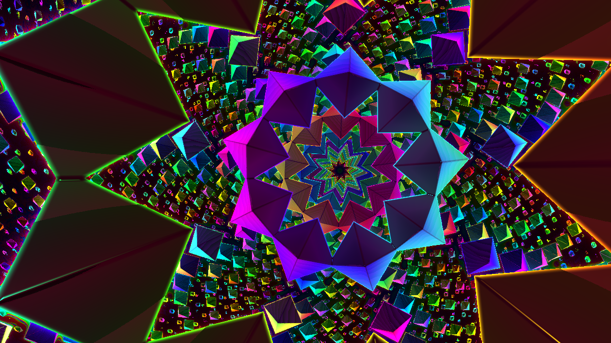

**Ergebnis:** Ein farbiger Lichtnebel legt sich um alle Formen; auch Strahlen, die knapp *vorbei*fliegen, hinterlassen Leuchtspuren. Die Tunneltiefe füllt sich mit diffusem Glühen.

### Was passiert hier – der Nebeneffekt wird zum Hauptdarsteller

Bisher haben wir die Marsch-Schleife nur benutzt, um den Auftreffpunkt zu finden. Aber sie weiß nebenbei viel mehr: **Bei jedem Schritt kennt sie den Abstand `d` zur nächsten Oberfläche.** Die Zeile

```glsl
glow += 0.0015 / (0.0005 + abs(d));
```

verwandelt das in Licht: Ist `d` groß (Strahl weit weg von allem), ist der Beitrag winzig. Ist `d` klein (Strahl schrammt knapp an einer Kante vorbei), explodiert der Bruch. Über alle 80 Schritte summiert entsteht so ein Maß dafür, *wie nah der gesamte Strahl der Geometrie insgesamt gekommen ist* – physikalisch unkorrekt, optisch ein perfekter Halo. Das `0.0005` im Nenner verhindert die Division durch null und deckelt den Maximalbeitrag; das `abs(d)` sorgt dafür, dass der (leicht) ins Innere geratene Strahl gleich behandelt wird.

Bonus-Effekt: Erinnere dich an Schritt 3 – an Silhouettenkanten macht der Marschierer besonders *viele, kleine* Schritte. Genau dort sammeln sich also die meisten Glow-Beiträge: Das Leuchten schmiegt sich von selbst an die Konturen.

**Die Einfärbung** recycelt unsere Palette mit neuer Eingabe: `palette(dist * 0.2 - iTime)` – ferne Bereiche glühen in anderen Farben als nahe, und der Verlauf strömt durch die Zeit. Ein Aufruf, null neue Konzepte, maximaler Zusammenhalt mit der Objektfarbe.

### 💡 Warum ist Glow so wichtig?

Er füllt das Schwarz. Ohne Glow ist jeder Fehlschuss-Pixel hart schwarz und die Szene zerfällt in „Objekt oder Nichts". Der Glow gibt dem leeren Raum Tiefe und verkauft die Illusion eines lichterfüllten Mediums – und kaschiert ganz nebenbei das Fern-Flimmern aus Schritt 8.

### 🎨 Experimentieren

- `* 0.06` → `* 0.2`: der Nebel übernimmt das Bild
- `glow += 0.0015 / (0.02 + abs(d));` → weicher, breiter Schein statt scharfer Kantenaura
- Setze `color = vec3(0.0)` vor die Glow-Addition (Treffer-Farbe verwerfen) → reiner „Geister-Modus": nur noch Glow rendert die Szene

---

## Schritt 15 – Nebel und Stabilität: die Ingenieurs-Zeilen

**Neu:** Drei unscheinbare Änderungen, die das Bild beruhigen und ihm Tiefe geben – der Unterschied zwischen „Demo" und „fertig".

```glsl
#define R(a) mat2(cos(a), sin(a), -sin(a), cos(a))

float sdOctahedron(vec3 p, float s)
{
    p = abs(p);
    return (p.x + p.y + p.z - s) * 0.57735027;
}

vec3 palette(float t)
{
    vec3 d = vec3(0.0, 0.333, 0.667);
    vec3 col = 0.5 + 0.5 * cos(6.28318 * (t + d));
    return smoothstep(0.15, 0.85, col);
}

float map(vec3 p)
{
    float spinAngle = (1.0 - cos(iTime * 0.15)) * 3.14159265;
    p.xy *= R(p.z * 0.15 + spinAngle);

    float r = length(p.xy);
    float a = atan(p.y, p.x);
    float sector = 6.2831853 / 9.0;
    a = mod(a, sector) - sector / 2.0;
    p.xy = r * vec2(cos(a), sin(a));

    p.z = mod(p.z, 0.4) - 0.2;
    p.x = mod(p.x, 0.3) - 0.15;

    float shape = sdOctahedron(p, 0.06);

    // --- NEU (1): Kanten runden + gemeldeten Abstand stauchen ---
    return (shape - 0.005) * 0.8;
}

vec3 calcNormal(vec3 p)
{
    vec2 e = vec2(0.002, 0.0);
    return normalize(vec3(
        map(p + e.xyy) - map(p - e.xyy),
        map(p + e.yxy) - map(p - e.yxy),
        map(p + e.yyx) - map(p - e.yyx)
    ));
}

void mainImage(out vec4 fragColor, in vec2 fragCoord)
{
    vec2 uv = (fragCoord - 0.5 * iResolution.xy) / iResolution.y;
    vec3 rd = normalize(vec3(uv, 1.0));

    float spinAngle = (1.0 - cos(iTime * 0.15)) * 3.14159265;
    rd.xy *= R(spinAngle * 0.5);
    rd.xz *= R(sin(iTime * 0.5) * 0.1);

    vec3 ro = vec3(0.0, 0.0, -iTime * 0.8);

    float dist = 0.0;
    vec3 color = vec3(0.0);
    float glow = 0.0;

    for (int i = 0; i < 80; i++)
    {
        vec3 p = ro + rd * dist;
        float d = map(p);

        glow += 0.0015 / (0.0005 + abs(d));

        if (d < 0.001) {
            vec3 n = calcNormal(p);

            float fresnel = pow(1.0 - max(dot(n, -rd), 0.0), 2.5);
            vec3 albedo = palette(p.z * 1.5 + iTime * 0.5 + p.x);
            color = albedo * fresnel * 2.5;

            vec3 lightDir = normalize(vec3(sin(iTime), 1.0, cos(iTime)));
            float spec = pow(max(dot(reflect(rd, n), lightDir), 0.0), 32.0);
            color += spec * albedo * 2.0;

            break;
        }
        if (dist > 15.0) break;

        // --- NEU (2): nur 90 % des erlaubten Schritts gehen ---
        dist += d * 0.9;
    }

    vec3 glowColor = palette(dist * 0.2 - iTime) * glow * 0.06;
    color += glowColor;

    // --- NEU (3): Entfernungsnebel ---
    color = mix(color, vec3(0.0, 0.0, 0.0), 1.0 - exp(-0.02 * dist * dist));

    fragColor = vec4(color, 1.0);
}
```

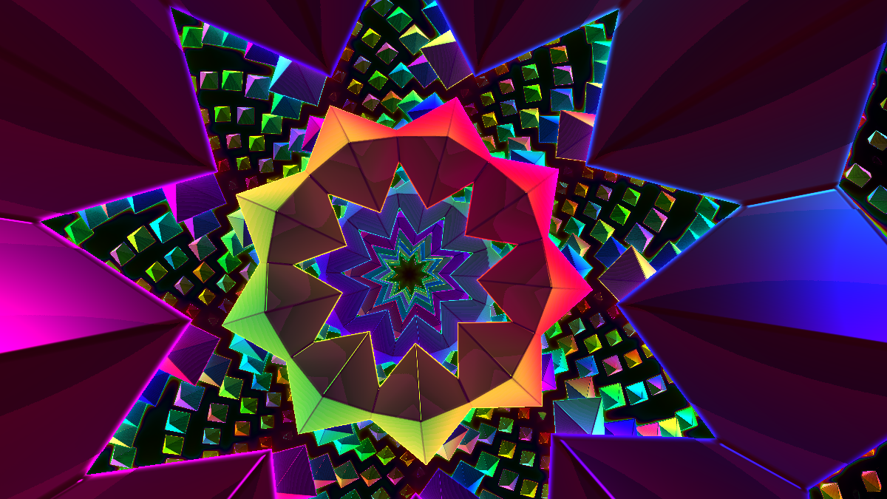

**Ergebnis:** Das Fern-Flimmern ist verschwunden, die Kanten sind ruhig, und der Tunnel versinkt weich in schwarzer Tiefe.

### Was passiert hier – dreimal Handwerk

**(1) `(shape - 0.005) * 0.8`** – zwei Tricks in einer Zeile:

- `- 0.005` bläht die Form minimal auf und **rundet** dabei die messerscharfen Kanten (die Fläche „Abstand = 0.005" um ein kantiges Objekt ist überall sanft gekrümmt). Weiche Kanten → stabilere Normalen → ruhigeres Fresnel-Glitzern.
- `* 0.8` staucht den *gemeldeten* Abstand: Der Marschierer glaubt, die Oberfläche sei näher, und macht vorsichtigere Schritte. Das ist die Versicherung gegen den Twist aus Schritt 10, der die SDF ja leicht „lügen" lässt.

**(2) `dist += d * 0.9`** – dieselbe Versicherung nochmal an anderer Stelle: Selbst vom (schon gestauchten) Abstand wird nur 90 % gegangen. Gürtel *und* Hosenträger. Zusammen wirkt effektiv Faktor 0.72 – der Preis sind ein paar mehr Iterationen, der Gewinn ist ein flimmerfreies Bild. Netter Nebeneffekt: Langsameres Anschleichen an Oberflächen = mehr Beinahe-Schritte = **satterer Glow**.

**(3) Der Nebel:** `1.0 - exp(-0.02 · dist²)` ist bei kleinen Distanzen ≈ 0 (kein Nebel) und geht für große gegen 1 (alles schwarz). Das ist physikalisch motivierte Lichtauslöschung (Beer-Lambert), mit `dist²` statt `dist` für einen besonders klaren Vordergrund und schnell zufallende Tiefe. Der Nebel löst zwei Probleme zugleich: Er ist die **ästhetische Tiefenstaffelung** – und er versteckt die Region nahe der 15er-Abbruchgrenze, wo die Geometrie unterabgetastet flimmern würde. Deshalb *muss* die Nebeldichte zur `if (dist > 15.0)`-Grenze passen: bei 0.02 ist bei dist ≈ 12 praktisch alles schwarz – die Grenze ist unsichtbar.

### 💡 Die Lektion dieses Schritts

Solche Zeilen stehen in fast jedem guten Raymarcher, aber in keinem Lehrbuch-Erstbeispiel: Sie entstehen beim **Anschauen des eigenen Bildes**. Flimmert es → Schritte verkürzen. Zittern die Kanten → Form runden. Sieht das Ende der Welt hässlich aus → Nebel davor. Shader-Entwicklung ist zur Hälfte diese Sorte iterativer Bildkritik.

### 🎨 Experimentieren

- Setze beide Faktoren auf `1.0` zurück und suche das Flimmern an Kanten und in der Ferne
- `-0.02` → `-0.005`: tiefer Blick den Tunnel hinab (dann aber Flimmern an der 15er-Grenze – erhöhe sie mit!)
- `shape - 0.02` → deutlich pummeligere, weich geschliffene Oktaeder

---

## Schritt 16 – Politur: Tonemapping, Gamma, Vignette – das Original

**Neu:** Die letzten vier Zeilen Farbnachbearbeitung. Dieser Code ist der fertige Shader – identisch mit Noztols Original.

```glsl
// Pyramid Spiral
// By Noztol
#define R(a) mat2(cos(a), sin(a), -sin(a), cos(a))

float sdOctahedron(vec3 p, float s) {
    p = abs(p);
    return (p.x + p.y + p.z - s) * 0.57735027; 
}

vec3 palette(float t) {
    vec3 d = vec3(0.0, 0.333, 0.667); 
    vec3 col = 0.5 + 0.5 * cos(6.28318 * (t + d));
    return smoothstep(0.15, 0.85, col);
}

float map(vec3 p) {
    float spinAngle = (1.0 - cos(iTime * 0.15)) * 3.14159265;
    
    // 1. Twist
    p.xy *= R(p.z * 0.15 + spinAngle);

    // 2. Kaleidoscope into 9 arms
    float r = length(p.xy);
    float a = atan(p.y, p.x);
    float sector = 6.2831853 / 9.0;
    a = mod(a, sector) - sector / 2.0;
    p.xy = r * vec2(cos(a), sin(a));
    
    // 3. Repeat space infinitely
    p.z = mod(p.z, 0.4) - 0.2;
    p.x = mod(p.x, 0.3) - 0.15;
    
    // 4. Draw the shape
    float shape = sdOctahedron(p, 0.06);
    
    // keep step size small for more stability
    return (shape - 0.005) * 0.8;
}

vec3 calcNormal(vec3 p) {
    vec2 e = vec2(0.002, 0.0);
    return normalize(vec3(
        map(p + e.xyy) - map(p - e.xyy),
        map(p + e.yxy) - map(p - e.yxy),
        map(p + e.yyx) - map(p - e.yyx)
    ));
}

void mainImage(out vec4 fragColor, vec2 fragCoord) {
    vec2 uv = (fragCoord - 0.5 * iResolution.xy) / iResolution.y;
    vec3 rd = normalize(vec3(uv, 1.0));
    
    float spinAngle = (1.0 - cos(iTime * 0.15)) * 3.14159265;
    rd.xy *= R(spinAngle * 0.5); 
    rd.xz *= R(sin(iTime * 0.5) * 0.1);
    
    vec3 ro = vec3(0.0, 0.0, -iTime * 0.8);
    
    float dist = 0.0;
    vec3 color = vec3(0.0);
    float glow = 0.0;
    
    for(int i = 0; i < 80; i++) {
        vec3 p = ro + rd * dist;
        float d = map(p);
        
        glow += 0.0015 / (0.0005 + abs(d));
        
        if(d < 0.001) {
            vec3 n = calcNormal(p);
            
            float fresnel = pow(1.0 - max(dot(n, -rd), 0.0), 2.5);
            vec3 albedo = palette(p.z * 1.5 + iTime * 0.5 + p.x);
            
            color = albedo * fresnel * 2.5;
            
            vec3 lightDir = normalize(vec3(sin(iTime), 1.0, cos(iTime)));
            float spec = pow(max(dot(reflect(rd, n), lightDir), 0.0), 32.0);
            color += spec * albedo * 2.0;
            
            break;
        }
        
        if(dist > 15.0) break;
        
        // Raymarch step size
        dist += d * 0.9; 
    }
    
    vec3 glowColor = palette(dist * 0.2 - iTime) * glow * 0.06;
    color += glowColor;
    
    color = mix(color, vec3(0.0, 0.0, 0.0), 1.0 - exp(-0.02 * dist * dist));
    
    // --- NEU (1): weiches Tonemapping ---
    color = smoothstep(0.0, 1.0, color); 

    // --- NEU (2): Gamma-Korrektur ---
    color = pow(color, vec3(1.0 / 2.2));
    
    // --- NEU (3): flackernde Farb-Vignette ---
    float vignette = length(uv);
    color.r *= 1.0 + vignette * 0.1 * sin(iTime * 10.0);
    color.b *= 1.0 - vignette * 0.1 * cos(iTime * 15.0);
    
    fragColor = vec4(color, 1.0);
}
```

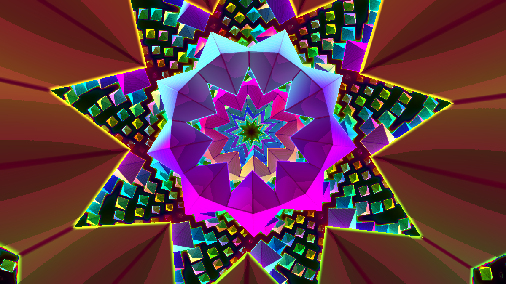

**Ergebnis:** Das Original. 🎉

### Was passiert hier

**(1) `smoothstep(0.0, 1.0, color)` als Tonemapper:** Erinnere dich – Fresnel (`* 2.5`) und Specular (`* 2.0`) produzieren absichtlich Werte über 1.0. Einfaches Abschneiden (Clipping) ergäbe hässliche, flache Weißflecken. `smoothstep` bildet stattdessen mit einer S-Kurve ab: Helles läuft weich in die Sättigung, Dunkles wird zusätzlich leicht abgesenkt (mehr Kontrast im Schwarz). Ein Ein-Zeilen-Ersatz für „richtige" Tonemapping-Operatoren – für einen Neon-Shader völlig ausreichend.

**(2) Gamma:** Monitore zeigen Farbwerte nicht linear an – ohne Korrektur wirken physikalisch korrekt gerechnete Bilder zu dunkel und die Mitteltöne abgesoffen. `pow(color, 1.0/2.2)` konvertiert von unserem linearen Arbeitsraum in den sRGB-Anzeigeraum. Faustregel: **Rechnen linear, ganz am Ende einmal `pow(c, 1/2.2)`** – und zwar wirklich am Ende, nach allen Additionen und dem Tonemapping.

**(3) Die Chromatik-Vignette** ist das Sahnehäubchen: `length(uv)` ist 0 in der Bildmitte und wächst zum Rand (unsere Erkenntnis aus Schritt 2 kehrt zurück!). Am Rand wird der Rotkanal mit 10 Hz, der Blaukanal mit ~15 Hz leicht moduliert – die Bildmitte bleibt sauber, die Ränder bekommen ein subtiles rot/blaues Schimmern wie bei einer analogen Linse bzw. einem alten Monitor. Zwei Frequenzen, die kein ganzzahliges Verhältnis haben, damit das Muster nie sichtbar loopt.

### 💡 Warum Politur als letzter Schritt?

Weil alle drei Operationen das **fertige Bild als Ganzes** behandeln – wie die Farbkorrektur beim Film. Würde man das Gamma z. B. vor der Glow-Addition anwenden, würde jede spätere Additon im falschen Farbraum stattfinden und die Abstimmung zerstören. Pipeline-Reihenfolge: *Szene rechnen (linear) → alles addieren → Tonemapping → Gamma → Effekte, die die Anzeige imitieren.*

### 🎨 Experimentieren

- Alle drei Politur-Blöcke auskommentieren → direkter Vergleich „roh vs. fertig". Der Unterschied ist verblüffend groß für sieben Zeilen
- `sin(iTime * 10.0)` → `sin(iTime * 2.0)`: träges Atmen statt Nervosität am Rand
- `pow(color, vec3(1.0/1.2))` → düster-kontrastige Variante

---

## Rückblick: Die Methode hinter den 16 Schritten

Was du nebenbei gelernt hast, ist wichtiger als dieser eine Shader – es ist das **Vorgehensmodell**, mit dem du jeden Raymarching-Shader angehen kannst:

1. **Koordinaten zuerst.** Zentriert, unverzerrt, als Farbe verifiziert (Schritt 1–2).
2. **Geometrie vor Schönheit.** Ein weißes „getroffen/nicht getroffen" reicht, um jede Formänderung zu prüfen (3–5). Farbe zu früh einzubauen verschleiert Geometriefehler.
3. **Verbiege den Raum, nicht das Objekt.** `mod` auf Achsen, `mod` auf Winkeln, positionsabhängige Rotation – die SDF bleibt ein simples Oktaeder, der *Raum davor* macht die Komplexität (7–10).
4. **Eine Änderung pro Durchlauf.** Jeder Schritt hier war compile-fähig. Wer fünf Dinge gleichzeitig ändert, weiß nie, welches das Bild zerstört hat.
5. **Debug-Ansichten sind Werkzeuge, keine Umwege.** Distanz als Grau, Iterationen als Helligkeit, Normalen als RGB – jede davon hat in diesem Tutorial mindestens einen Fehler sichtbar gemacht, bevor er entstand.
6. **Werte wiederverwenden.** `dist` → Tiefenschattierung, Nebel, Glow-Farbe. `d` → Glow. `palette` → Objekt und Atmosphäre. Gute Shader sind sparsam: wenige Größen, viele Verwendungen.
7. **Politur ganz zum Schluss, in fester Reihenfolge.** Linear rechnen → Tonemap → Gamma → Linsen-Effekte.

### Umbau-Ideen für den eigenen Shader

Der schnellste Lernweg ab hier: das Original als Spielwiese benutzen. Lohnende Baustellen, grob nach Aufwand sortiert:

- **Trivial:** Sektorzahl (9), Palette-Phasen `d`, Fluggeschwindigkeit, Twist-Stärke, Glow-Menge
- **Mittel:** `sdOctahedron` durch Würfel/Torus/Kapsel ersetzen (Formeln: [iquilezles.org/articles/distfunctions](https://iquilezles.org/articles/distfunctions/)) – beachte die Zellgrößen-Regel aus Schritt 7! Oder: zweite Form mit `min(d1, d2)` in die Szene mischen
- **Anspruchsvoll:** Die Repetition pro Zelle variieren (Zell-Index aus `floor(p.z / 0.4)` ableiten und damit Größe/Rotation streuen), weiche Vereinigung (`smin`) zwischen den Oktaedern, oder Mausinteraktion über `iMouse` auf den Twist legen

### Weiterführendes

- **Inigo Quilez** – Artikel zu SDFs, Paletten, Raymarching; die Referenz schlechthin: [iquilezles.org/articles](https://iquilezles.org/articles/)
- **The Art of Code** (Martijn Steinrucken, YouTube) – Video-Tutorials, die genau dem hier geübten Schritt-für-Schritt-Stil folgen
- **Shadertoy selbst:** Bei jedem Shader auf den Code klicken, Zeilen auskommentieren, Konstanten verstellen. Es gibt keinen besseren Unterricht.

Viel Spaß beim Verbiegen des Raums. 🌀

---

# Anhang A: Audio-Reaktivität – der Shader hört Musik

Der fertige Shader ist hübsch – aber er ist taub. In diesem Anhang bekommt er Ohren: Erst machen wir das Audiosignal *sichtbar* (derselbe Debug-zuerst-Ansatz wie in Schritt 1), dann destillieren wir daraus brauchbare Steuerwerte, und zum Schluss verdrahten wir sie mit der Spirale.

**Vorbereitung auf Shadertoy:** Klicke unter dem Code-Editor auf den Kanal **iChannel0** und wähle im Tab **Music** einen der mitgelieferten Tracks (oder im Tab **SoundCloud** einen eigenen Link). Ohne belegten Kanal liefert die Audio-Textur nur Nullen – das Bild bleibt dann schwarz bzw. unbewegt, das ist kein Fehler im Code.

**Wie Shadertoy Audio anliefert:** Nicht als Zahlenliste, sondern als **Textur** von 512×2 Pixeln auf dem gewählten iChannel:

| Zeile | Auslesen bei | Inhalt |
|---|---|---|
| 0 (unten) | `texture(iChannel0, vec2(x, 0.25)).x` | **FFT-Spektrum** – Frequenzen von links (Bass) nach rechts (Höhen), Werte 0..1 |
| 1 (oben) | `texture(iChannel0, vec2(x, 0.75)).x` | **Wellenform** – der rohe Schwingungsverlauf des aktuellen Moments |

*Tab. 4: Die 512×2-Audio-Textur – FFT-Zeile und Wellenform-Zeile*

Das Spektrum ist bereits logarithmisch (dB) skaliert und zeitlich leicht geglättet – man kann es also direkt verwenden, ohne selbst eine FFT rechnen zu müssen.

---

## Schritt A1 – Das Audiosignal sichtbar machen

**Neu:** Die Audio-Textur auslesen und als Spektrum-Balken + Wellenform-Linie anzeigen – *bevor* wir irgendetwas damit steuern.

```glsl
void mainImage(out vec4 fragColor, in vec2 fragCoord)
{
    vec2 uv = fragCoord / iResolution.xy;

    // Zeile 0 der Audio-Textur: FFT-Spektrum an der x-Position dieses Pixels
    float fft  = texture(iChannel0, vec2(uv.x, 0.25)).x;

    // Zeile 1: Wellenform
    float wave = texture(iChannel0, vec2(uv.x, 0.75)).x;

    vec3 color = vec3(0.02);

    // Spektrum als Balken: Pixel unterhalb des FFT-Werts einfaerben
    if (uv.y < fft)
        color = vec3(uv.x, 1.0 - uv.x, 0.5);

    // Wellenform als duenne weisse Linie darueberlegen
    color += vec3(smoothstep(0.01, 0.0, abs(uv.y - wave)));

    fragColor = vec4(color, 1.0);
}
```

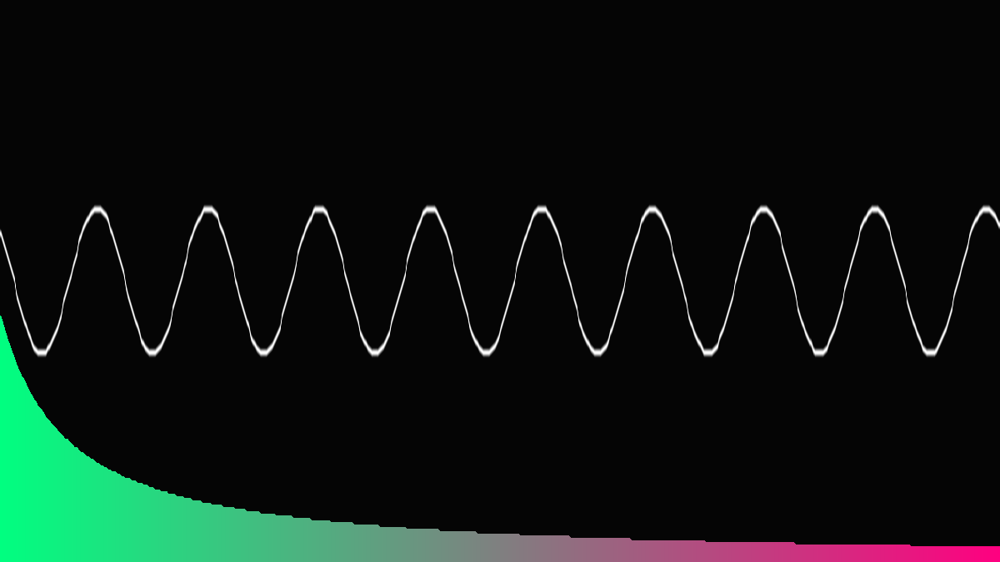

**Ergebnis:** Ein klassischer Spektrum-Analyzer – tanzende Balken (links Bass, rechts Höhen) mit einer zappelnden Wellenformlinie darüber.

### Was passiert hier

Jeder Pixel fragt die Audio-Textur an seiner eigenen x-Position ab – das Bild *ist* dadurch automatisch das Spektrum. Zwei Dinge fallen sofort auf, und beide sind wichtig für alles Weitere:

1. **Der Bass wohnt ganz links.** Die 512 Texel decken den Frequenzbereich bis ~11 kHz *linear* ab – der musikalisch interessante Bass (< 250 Hz) belegt also nur die ersten Prozent der Breite. Wer „Bass" bei x = 0.5 abliest, misst in Wahrheit Mitten.
2. **Das Signal zittert.** Trotz der eingebauten Glättung springen die Werte von Frame zu Frame deutlich. Roh auf einen Parameter gelegt ergäbe das Nervosität statt Groove – darum kümmern wir uns in A2.

### 💡 Warum wieder ein Debug-Schritt?

Dieselbe Lektion wie in Schritt 1: Bevor ein Wert etwas *steuern* darf, muss man gesehen haben, wie er sich *verhält* – Wertebereich, Trägheit, wo im Spektrum die Musik überhaupt stattfindet. Dreißig Sekunden Zuschauen ersparen später eine Stunde Rätselraten, warum die Spirale „nicht auf den Beat" reagiert.

### 🎨 Experimentieren

- `texture(iChannel0, vec2(uv.x * 0.1, 0.25)).x` → nur die ersten 10 % des Spektrums auf volle Breite gespreizt: So sieht der Bassbereich in Großaufnahme aus
- `pow(fft, 3.0)` statt `fft` → Kontrast: nur laute Anteile bleiben sichtbar
- Verschiedene Music-Tracks durchprobieren – wie unterschiedlich die Spektren aussehen, erklärt später, warum ein Mapping nicht für jeden Song gleich gut funktioniert

---

## Schritt A2 – Frequenzbänder: aus 512 Werten werden drei Regler

**Neu:** Eine `bandLevel`-Funktion mittelt Spektrumsbereiche zu stabilen Steuerwerten – Bass, Mitten, Höhen als drei Pegel-Balken.

```glsl
// Mittelwert des FFT-Spektrums zwischen zwei x-Positionen (0..1)
float bandLevel(float lo, float hi)
{
    float sum = 0.0;
    const int N = 12;
    for (int i = 0; i < N; i++)
    {
        float x = mix(lo, hi, (float(i) + 0.5) / float(N));
        sum += texture(iChannel0, vec2(x, 0.25)).x;
    }
    return sum / float(N);
}

void mainImage(out vec4 fragColor, in vec2 fragCoord)
{
    vec2 uv = fragCoord / iResolution.xy;

    // Drei Baender (x-Bereiche der Audio-Textur, grob: Hz-Angaben s. Text)
    float bass = bandLevel(0.00, 0.05);
    float mid  = bandLevel(0.05, 0.25);
    float treb = bandLevel(0.25, 0.70);

    // Als drei Pegel-Balken anzeigen
    float level;
    vec3 barColor;
    if (uv.x < 0.333)      { level = bass; barColor = vec3(1.0, 0.25, 0.25); }
    else if (uv.x < 0.666) { level = mid;  barColor = vec3(0.25, 1.0, 0.35); }
    else                   { level = treb; barColor = vec3(0.3, 0.5, 1.0);  }

    fragColor = vec4(uv.y < level ? barColor : vec3(0.02), 1.0);
}
```

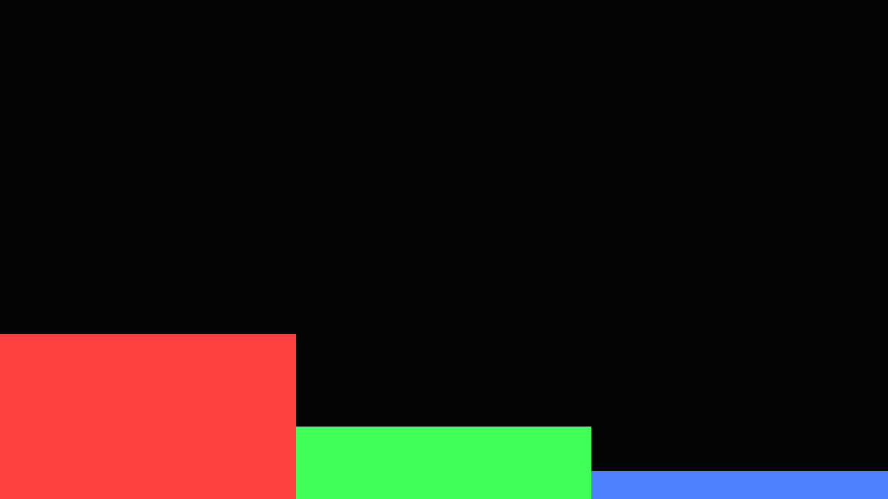

**Ergebnis:** Drei breite Balken – Rot (Bass) pumpt im Takt der Kickdrum, Grün (Mitten) folgt Gesang und Melodie, Blau (Höhen) flackert mit Hi-Hats und Becken.

### Was passiert hier

`bandLevel` tastet einen Ausschnitt des Spektrums an 12 Stellen ab und mittelt. Diese Mittelung ist der eigentliche Trick: Ein einzelner Texel zittert (siehe A1), aber der **Durchschnitt über einen Bereich** ist ruhig genug, um direkt einen Parameter zu steuern – dieselbe Idee wie „viele Messungen glätten den Messfehler".

Die Bereichsgrenzen sind bewusst gewählt (bei ~11 kHz Texturbreite):

| Band | x-Bereich | entspricht grob | reagiert auf |
|---|---|---|---|
| `bass` | 0.00–0.05 | bis ~550 Hz | Kickdrum, Bassline |
| `mid` | 0.05–0.25 | ~550 Hz–2.8 kHz | Gesang, Gitarren, Synths |
| `treb` | 0.25–0.70 | ~2.8–7.7 kHz | Hi-Hats, Becken, „Luft" |

*Tab. 5: Die drei Frequenzbänder – x-Bereiche, ungefähre Frequenzen und musikalische Bedeutung*

Oberhalb von x ≈ 0.7 ist bei den meisten Aufnahmen kaum noch Energie – der Bereich bliebe im Mittelwert nur Ballast.

### 💡 Warum Bänder statt des rohen Spektrums?

Aus demselben Grund, aus dem Schritt 12 alles durch *einen* Palette-Parameter `t` steuert: **Wenige, bedeutungsvolle Größen sind mächtiger als viele rohe.** Drei Pegel mit klarer musikalischer Bedeutung („der Beat", „die Melodie", „das Glitzern") lassen sich gezielt auf drei visuelle Eigenschaften legen. 512 Einzelwerte dagegen kann man nur unspezifisch „irgendwie draufmultiplizieren" – das Ergebnis wirkt dann wie Rauschen, nicht wie Rhythmus.

### 🎨 Experimentieren

- `pow(bass, 2.0)` → „Punch": leise Passagen werden ganz still, Schläge stechen heraus
- `smoothstep(0.4, 0.8, bass)` → Schwellwert-Charakter: das Band ist *aus* oder *an* – Vorstufe einer Beat-Erkennung
- `N` auf 3 senken → das Zittern kehrt zurück; auf 32 erhöhen → noch träger/glatter

---

## Schritt A3 – Die Spirale hört zu

**Neu:** Die drei Bänder aus A2 wandern in den fertigen Shader aus Schritt 16 – Bass pulst die Oktaeder und den Glow, Mitten schieben die Farben, Höhen lassen die Glanzlichter explodieren.

```glsl
// Pyramid Spiral - audio-reaktive Variante
// Basis: "Pyramid Spiral" by Noztol
#define R(a) mat2(cos(a), sin(a), -sin(a), cos(a))

// --- AUDIO: Bandpegel, einmal pro Frame in mainImage gefuellt ---
float gBass = 0.0;
float gMid  = 0.0;
float gTreb = 0.0;

float bandLevel(float lo, float hi)
{
    float sum = 0.0;
    const int N = 12;
    for (int i = 0; i < N; i++)
    {
        float x = mix(lo, hi, (float(i) + 0.5) / float(N));
        sum += texture(iChannel0, vec2(x, 0.25)).x;
    }
    return sum / float(N);
}

float sdOctahedron(vec3 p, float s) {
    p = abs(p);
    return (p.x + p.y + p.z - s) * 0.57735027;
}

vec3 palette(float t) {
    vec3 d = vec3(0.0, 0.333, 0.667);
    vec3 col = 0.5 + 0.5 * cos(6.28318 * (t + d));
    return smoothstep(0.15, 0.85, col);
}

float map(vec3 p) {
    float spinAngle = (1.0 - cos(iTime * 0.15)) * 3.14159265;
    p.xy *= R(p.z * 0.15 + spinAngle);

    float r = length(p.xy);
    float a = atan(p.y, p.x);
    float sector = 6.2831853 / 9.0;
    a = mod(a, sector) - sector / 2.0;
    p.xy = r * vec2(cos(a), sin(a));

    p.z = mod(p.z, 0.4) - 0.2;
    p.x = mod(p.x, 0.3) - 0.15;

    // --- AUDIO (1): Bass pumpt die Oktaeder auf (max. Radius 0.102 -
    //     bleibt unter der halben Zellbreite 0.15, Regel aus Schritt 7!) ---
    float shape = sdOctahedron(p, 0.06 * (1.0 + gBass * 0.7));

    return (shape - 0.005) * 0.8;
}

vec3 calcNormal(vec3 p) {
    vec2 e = vec2(0.002, 0.0);
    return normalize(vec3(
        map(p + e.xyy) - map(p - e.xyy),
        map(p + e.yxy) - map(p - e.yxy),
        map(p + e.yyx) - map(p - e.yyx)
    ));
}

void mainImage(out vec4 fragColor, vec2 fragCoord) {
    // --- AUDIO: Baender EINMAL bestimmen, bevor der Marsch beginnt ---
    gBass = bandLevel(0.00, 0.05);
    gMid  = bandLevel(0.05, 0.25);
    gTreb = bandLevel(0.25, 0.70);

    vec2 uv = (fragCoord - 0.5 * iResolution.xy) / iResolution.y;
    vec3 rd = normalize(vec3(uv, 1.0));

    float spinAngle = (1.0 - cos(iTime * 0.15)) * 3.14159265;
    rd.xy *= R(spinAngle * 0.5);
    rd.xz *= R(sin(iTime * 0.5) * 0.1);

    vec3 ro = vec3(0.0, 0.0, -iTime * 0.8);

    float dist = 0.0;
    vec3 color = vec3(0.0);
    float glow = 0.0;

    for (int i = 0; i < 80; i++) {
        vec3 p = ro + rd * dist;
        float d = map(p);

        glow += 0.0015 / (0.0005 + abs(d));

        if (d < 0.001) {
            vec3 n = calcNormal(p);

            float fresnel = pow(1.0 - max(dot(n, -rd), 0.0), 2.5);

            // --- AUDIO (2): Mitten verschieben die Farbpalette ---
            vec3 albedo = palette(p.z * 1.5 + iTime * 0.5 + p.x + gMid * 0.4);

            color = albedo * fresnel * 2.5;

            vec3 lightDir = normalize(vec3(sin(iTime), 1.0, cos(iTime)));
            float spec = pow(max(dot(reflect(rd, n), lightDir), 0.0), 32.0);

            // --- AUDIO (3): Hoehen verstaerken die Glanzblitze ---
            color += spec * albedo * (2.0 + gTreb * 6.0);

            break;
        }

        if (dist > 15.0) break;

        dist += d * 0.9;
    }

    // --- AUDIO (4): Bass befeuert den Glow ---
    vec3 glowColor = palette(dist * 0.2 - iTime) * glow * (0.03 + gBass * 0.09);
    color += glowColor;

    color = mix(color, vec3(0.0, 0.0, 0.0), 1.0 - exp(-0.02 * dist * dist));

    color = smoothstep(0.0, 1.0, color);
    color = pow(color, vec3(1.0 / 2.2));

    float vignette = length(uv);
    color.r *= 1.0 + vignette * 0.1 * sin(iTime * 10.0);
    color.b *= 1.0 - vignette * 0.1 * cos(iTime * 15.0);

    fragColor = vec4(color, 1.0);
}
```

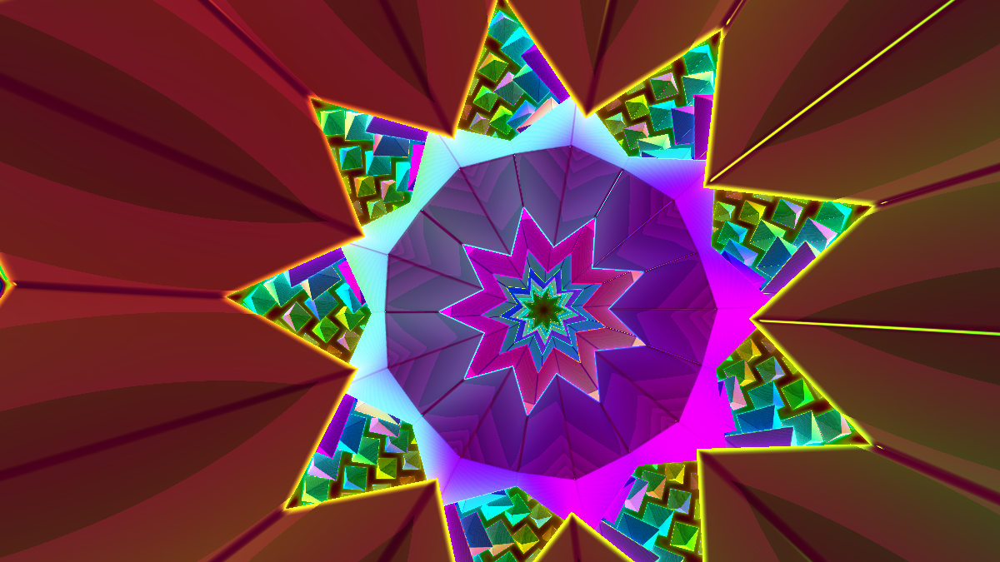

**Ergebnis:** Die Spirale lebt mit der Musik – bei jedem Basskick schwellen die Oktaeder an und der Lichtnebel flammt auf, die Farben schieben sich mit der Melodie, und Hi-Hats lassen Glanzblitze über die Facetten sprühen.

### Was passiert hier – die Kunst des Mappings

**Die Mechanik zuerst:** `gBass/gMid/gTreb` sind globale Variablen, die `mainImage` **einmal vor dem Marsch** füllt. Wichtig, denn `map` wird pro Pixel bis zu 80× aufgerufen (plus 6× für Normalen) – die Textur-Abtastung dort hineinzulegen würde die Kosten vervielfachen, ohne dass sich am Ergebnis etwas ändert: Die Pegel sind ja für alle Pixel des Frames gleich.

**Die vier Mappings** folgen einer Regel: *Musikalische Rolle → passende visuelle Rolle.*

| Audio | steuert | warum das passt |
|---|---|---|
| Bass (1)+(4) | Oktaeder-Größe + Glow-Menge | Der Beat ist das *Fundament* – also darf er Masse und Licht der ganzen Szene pumpen |
| Mitten (2) | Palette-Verschiebung | Melodie = Verlauf, Stimmung – Farbe ist ihr visuelles Gegenstück |
| Höhen (3) | Specular-Stärke | Hi-Hats sind kurz, spitz, glitzernd – exakt der Charakter von Glanzlichtern |

*Tab. 6: Die vier Audio-Mappings in A3 – musikalische Rolle → visuelle Rolle*

Und wieder trägt Schritt 7 Früchte: Der Bass-Puls in `map` muss die **Zellgrößen-Regel** respektieren. `0.06 * 1.7 = 0.102` bleibt unter der halben Zellbreite 0.15 – wer den Faktor auf `* 2.0` dreht, verletzt die Regel bei lauten Passagen und erntet genau die Durchschieß-Artefakte von damals, nur jetzt *im Takt der Musik*.

### 💡 Die wichtigste Warnung: Audio niemals auf die Zeit multiplizieren

Der verlockendste Fehler wäre `ro.z = -iTime * (0.8 + gBass)` – „bei Bass schneller fliegen!". Aber `iTime * speed` ist eine **Position**, keine Geschwindigkeit: Ändert sich `speed` sprunghaft, springt die Position – die Kamera *teleportiert* bei jedem Beat vor und zurück, das Bild reißt. Ein Fragment-Shader hat kein Gedächtnis zwischen den Frames, er kann eine wechselnde Geschwindigkeit nicht zu einer glatten Strecke aufintegrieren (dafür bräuchte es einen Buffer, der seinen Vorzustand liest). Faustregel: **Audio auf zustandslose Größen legen** – Größe, Helligkeit, Farbe, Winkel-*Offsets* – niemals auf den Faktor vor `iTime`.

### 🎨 Experimentieren

- Alle vier Mappings einzeln auskommentieren und wieder aktivieren – welches trägt am meisten „Musik-Gefühl"? (Meist der Bass-Glow.)
- `gBass * 0.7` → `pow(gBass, 2.0) * 0.9`: der Puls wird knackiger, weil leise Passagen die Oktaeder ganz in Ruhe lassen
- Höhen auf die Vignette legen: `vignette * (0.05 + gTreb * 0.3) * sin(iTime * 10.0)` → das Randflackern zuckt mit den Becken
- Mitten stattdessen auf den Twist: `p.xy *= R(p.z * (0.15 + gMid * 0.1) + spinAngle);` → die Schraube windet sich mit der Melodie enger und wieder auf

### 📦 Hinweis für LumiViz

Im **Shadertoy-Node** von LumiViz funktioniert dieser Anhang unverändert: Die App stellt die Audio-Textur im selben 512×2-Layout (Zeile 0 FFT, Zeile 1 Waveform) auf dem im Editor gewählten iChannel bereit – `bandLevel` und alle Mappings laufen 1:1. Zusätzlich – und **nur** in LumiViz, nicht auf shadertoy.com – gibt es die fertig berechneten Uniforms `bass`, `mid`, `treb`, `vol` und `beat`: Damit kann man sich `bandLevel` samt Globals komplett sparen (`gBass` → `bass` usw.). Der Preis ist die Portabilität – wer den Shader weiterhin auf shadertoy.com einfügen können will, bleibt beim iChannel-Weg dieses Anhangs.

Und jetzt: Musik an. 🎵🌀

---

# Anhang B: Die Weiche – Varianten am Objekt-Feld

Schritt 8 endet mit einem flachen, unendlichen Feld kleiner Oktaeder – und genau dort zweigt dieser Anhang ab. Statt weiter zum Kaleidoskop zu falten, bleiben wir auf der Ebene und variieren sie: erst die **Form** der Bewohner (B1), dann wird die Fläche zum **3D-Equalizer**, dessen Ausschläge das Musikspektrum abbilden (B2), und schließlich zünden **Beat-Blitze** an zufälligen Zellen und glühen aus (B3).

Das tragende neue Konzept aller drei Schritte: der **Zell-Index**. Bisher waren alle Kopien der Domain Repetition identisch – ab jetzt bekommt jede Zelle eine Identität und darf sich von ihren Nachbarn unterscheiden.

B1 braucht kein Audio; für B2/B3 gilt wie im Anhang A: **iChannel0 mit Music belegen.**

---

## Schritt B1 – Formen und Größen streuen

**Neu:** `sdForm` als Form-Weiche (Oktaeder/Kugel/Würfel), ein 2D-Hash – und der Zell-Index `floor(p / zelle)`, der jeder Kopie ihre eigene Größe gibt.

```glsl
// ---- STELLSCHRAUBEN --------------------------------------------------------
const int   FORM          = 1;    // 0 = Oktaeder, 1 = Kugel, 2 = Wuerfel
const float GROESSE       = 0.06; // Grundradius (Zellregel: unter 0.15 bleiben!)
const float GROESSE_STREU = 0.7;  // 0 = alle gleich, 1 = maximal gestreut
// ----------------------------------------------------------------------------

// 2D-Hash: Zell-Index -> "Zufallszahl" 0..1 (deterministisch, jeder Frame gleich)
float hash21(vec2 id)
{
    return fract(sin(dot(id, vec2(127.1, 311.7))) * 43758.5453);
}

// Die Form-Weiche: dieselbe Schnittstelle wie sdOctahedron, drei Gestalten
float sdForm(vec3 p, float s)
{
    if (FORM == 0) { p = abs(p); return (p.x + p.y + p.z - s) * 0.57735027; }
    if (FORM == 1) { return length(p) - s; }
    vec3 q = abs(p) - s * 0.8;                       // Wuerfel
    return length(max(q, 0.0)) + min(max(q.x, max(q.y, q.z)), 0.0);
}

float map(vec3 p)
{
    // Zell-Index VOR der Faltung ablesen - jede Kopie bekommt eine Identitaet
    vec2 id = vec2(floor(p.x / 0.3), floor(p.z / 0.4));

    // Wiederholung wie in Schritt 8
    p.z = mod(p.z, 0.4) - 0.2;
    p.x = mod(p.x, 0.3) - 0.15;

    // Groesse je Zelle streuen: 0.4x bis 1.6x der Grundgroesse
    float s = GROESSE * mix(1.0, 0.4 + 1.2 * hash21(id), GROESSE_STREU);
    return sdForm(p, s);
}

vec3 calcNormal(vec3 p)
{
    vec2 e = vec2(0.002, 0.0);
    return normalize(vec3(
        map(p + e.xyy) - map(p - e.xyy),
        map(p + e.yxy) - map(p - e.yxy),
        map(p + e.yyx) - map(p - e.yyx)
    ));
}

void mainImage(out vec4 fragColor, in vec2 fragCoord)
{
    vec2 uv = (fragCoord - 0.5 * iResolution.xy) / iResolution.y;

    vec3 rd = normalize(vec3(uv, 1.0));
    vec3 ro = vec3(0.15, 0.1, -iTime * 0.8);

    float dist = 0.0;
    vec3 color = vec3(0.0);

    for (int i = 0; i < 80; i++)
    {
        vec3 p = ro + rd * dist;
        float d = map(p);

        if (d < 0.001) {
            vec3 n = calcNormal(p);
            vec3 lightDir = normalize(vec3(1.0, 1.0, -1.0));
            float diffuse = max(dot(n, lightDir), 0.0);
            color = vec3(0.1) + vec3(0.9) * diffuse;
            break;
        }
        if (dist > 15.0) break;

        dist += d;
    }

    fragColor = vec4(color, 1.0);
}
```

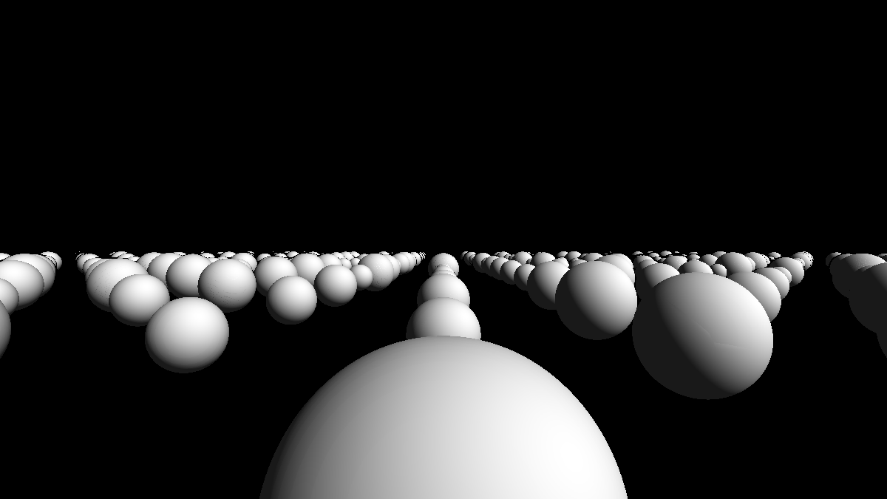

**Ergebnis:** Der Flug aus Schritt 8 – aber durch ein Feld aus Kugeln, deren Größen sich von Zelle zu Zelle unterscheiden. Ein Schalter, und es sind Würfel oder wieder Oktaeder.

### Was passiert hier

**Der Zell-Index** ist die Schlüsselzeile: `floor(p.x / 0.3)` fragt *vor* der `mod`-Faltung, „in der wievielten Zelle stehe ich?" – während `mod` alle Zellen gleich macht, merkt sich `id`, welche es war. Damit ist die Anonymität der Kopien aufgehoben: Alles, was danach von `id` abhängt, darf pro Zelle anders sein.

**Der Hash** verwandelt den Index in eine pseudozufällige Zahl 0..1 – dieselbe Zelle bekommt in jedem Frame denselben Wert (wichtig: kein Flackern), verschiedene Zellen aber praktisch unkorrelierte. Die krummen Konstanten sind Absicht: Sie verhindern sichtbare Muster. Dieses `fract(sin(dot(...)))`-Idiom ist der Standard-„Zufall" der Shader-Welt.

**Die Form-Weiche** `sdForm` tauscht nur die Distanzfunktion aus – Raymarcher, Normalen, Licht bleiben unberührt. Genau das ist die in Schritt 6 versprochene Superkraft der SDFs: `map` beschreibt die Welt, alles andere funktioniert automatisch weiter.

⚠️ Die **Zellgrößen-Regel** aus Schritt 7 gilt pro Zelle: Die größte gestreute Kugel (0.06 · 1.6 = 0.096) bleibt unter der halben Zellbreite 0.15. Wer `GROESSE` oder die Streuung erhöht, muss das nachrechnen.

### 🎨 Experimentieren

- `FORM = 2` → Würfel-Feld; `GROESSE_STREU = 0.0` → wieder uniform
- Auch die **Form** je Zelle streuen: in `map` z. B. `float w = hash21(id + 50.0);` und in `sdForm` statt der Konstante `FORM` einen Parameter übergeben (`w < 0.33 ? 0 : w < 0.66 ? 1 : 2`) → gemischtes Feld
- Die Position streuen: `p.x += (hash21(id + 90.0) - 0.5) * 0.08;` *nach* dem `mod` → das Gitter wirkt organisch statt militärisch (Versatz klein halten – Zellregel!)

🧠 **Merke:** `mod` macht Kopien, `floor` gibt ihnen Namen. Das Paar aus beiden ist der Schlüssel zu „unendlich viele, aber alle verschieden".

---

## Schritt B2 – Die Equalizer-Ebene: das Spektrum als Landschaft

**Neu:** Aus den Objekten wird ein 3D-Equalizer auf einer Bodenplatte: Jede Spalte liest *ihr* Frequenzband aus der Audio-Textur und schlägt entsprechend hoch aus. Dazu kommen zwei Baukästen: eine **Formbibliothek** (Block, Kugel, Kapsel, Pyramiden, Kegel, Prismen, Zylinder, Kristallnadel) und ein **Kamerafahrten-Schalter** (geradeaus, Orbit um die Fläche, Gassen-Tiefflug, Wellen-Überflug).

```glsl
// ---- STELLSCHRAUBEN --------------------------------------------------------
const int   FORM            = 4;      // 0 Block | 1 Kugel | 2 Kapsel
                                      // 3 Pyramide 3-seitig | 4 Pyramide 4-seitig
                                      // 5 Kegel | 6/7/8 Prisma 4-/6-/8-eckig
                                      // 9 Zylinder | 10 Kristallnadel
const int   KAMERA          = 1;      // 0 geradeaus | 1 Orbit
                                      // 2 Gassen-Tiefflug | 3 Wellen-Ueberflug
const vec2  ZELLE           = vec2(0.34, 0.34); // Zellgroesse x/z
const float GROESSE         = 0.095;  // halbe Objektbreite -> sichtbarer Spalt
const float SPEKTRUM_ZELLEN = 24.0;   // so viele Spalten bis zu den Hoehen
const float AUSSCHLAG       = 1.6;    // maximaler Hub - hohe Peaks
const float SOCKEL          = 0.05;   // Grundhoehe bei Stille
const float STREUUNG        = 0.5;    // Pegel-Variation je Zeile (0..1)
const float HOEHE_MAX       = 2.3;    // hoeher wohnt keine Geometrie
// ----------------------------------------------------------------------------

float hash21(vec2 id)
{
    return fract(sin(dot(id, vec2(127.1, 311.7))) * 43758.5453);
}

vec3 palette(float t)
{
    vec3 d = vec3(0.0, 0.333, 0.667);
    vec3 col = 0.5 + 0.5 * cos(6.28318 * (t + d));
    return smoothstep(0.15, 0.85, col);
}

// ---- Formbibliothek --------------------------------------------------------
// Jede Form steht mit dem Fuss auf y=0, ist ~r breit und h hoch.

// Querschnitts-Abstand zum regelmaessigen n-Eck in der xz-Ebene - dieselbe
// Winkel-Faltung wie das Kaleidoskop in Schritt 9, nur als Querschnitt
float nEck(vec3 p, float r, float n)
{
    float sektor = 6.2831853 / n;
    float a = mod(atan(p.z, p.x), sektor) - 0.5 * sektor;
    return length(p.xz) * cos(a) - r;
}

float sdSaeule(vec3 p, float r, float h)
{
    if (FORM == 0) {                                   // Block
        vec3 b = abs(p - vec3(0.0, 0.5 * h, 0.0)) - vec3(r, 0.5 * h, r);
        return length(max(b, 0.0)) + min(max(b.x, max(b.y, b.z)), 0.0);
    }
    if (FORM == 1) {                                   // Kugel (Ellipsoid)
        vec3 q = (p - vec3(0.0, 0.5 * h, 0.0)) / vec3(r, 0.5 * h, r);
        return (length(q) - 1.0) * min(r, 0.5 * h);
    }
    if (FORM == 2) {                                   // Kapsel
        float k = clamp(p.y, r, max(h - r, r));
        return length(p - vec3(0.0, k, 0.0)) - r;
    }
    if (FORM <= 5) {                                   // Pyramiden + Kegel
        float n = FORM == 3 ? 3.0 : FORM == 4 ? 4.0 : 64.0;
        // 3-Eck-ECKEN ragen weit ueber das Apothem hinaus -> schmaler ansetzen
        float basis = FORM == 3 ? 0.75 * r : 1.1 * r;
        float rr = basis * (1.0 - clamp(p.y / h, 0.0, 1.0));
        return max(nEck(p, rr, n), max(p.y - h, -p.y)) * 0.6;
    }
    if (FORM <= 8) {                                   // Prisma 4-/6-/8-eckig
        float n = FORM == 6 ? 4.0 : FORM == 7 ? 6.0 : 8.0;
        return max(nEck(p, r, n), abs(p.y - 0.5 * h) - 0.5 * h);
    }
    if (FORM == 9) {                                   // Zylinder (rund)
        return max(length(p.xz) - r, abs(p.y - 0.5 * h) - 0.5 * h);
    }
    // Kristallnadel: der Oktaeder aus Schritt 5, vertikal auf h gestreckt
    vec3 q = abs(vec3(p.x, (p.y - 0.5 * h) * (2.0 * r / h), p.z));
    return (q.x + q.y + q.z - r) * 0.57735027 * min(1.0, 0.5 * h / r);
}

// Zellwerte der zuletzt befragten Position - fuer die Faerbung am Auftreffpunkt
float gPegel = 0.0;
float gBinX  = 0.0;

float map(vec3 p)
{
    vec2 id = floor(p.xz / ZELLE);
    vec2 q  = mod(p.xz, ZELLE) - 0.5 * ZELLE;

    // Spalten-Index -> Spektrum-Position: Bass in der Mitte, Hoehen aussen
    float binX  = clamp(abs(id.x) / SPEKTRUM_ZELLEN, 0.0, 1.0);
    float pegel = texture(iChannel0, vec2(binX * 0.7, 0.25)).x;
    pegel *= mix(1.0, 0.5 + hash21(id), STREUUNG);   // jede Zeile etwas anders
    gPegel = pegel;
    gBinX  = binX;

    // Das Objekt der Zelle: Form aus der Bibliothek, Hoehe = Pegel-Ausschlag
    float h = SOCKEL + AUSSCHLAG * pegel;
    float objekt = sdSaeule(vec3(q.x, p.y, q.y), GROESSE, h) - 0.015;

    float d = min(objekt, p.y);                       // p.y = Bodenplatte

    // WICHTIG: Nachbarzellen haben ANDERE Hoehen - die lokale SDF weiss von
    // ihnen nichts. Deshalb darf ein Schritt nie ueber die Zellwand hinaus:
    if (p.y < HOEHE_MAX)
    {
        float wand = min(0.5 * ZELLE.x - abs(q.x), 0.5 * ZELLE.y - abs(q.y));
        d = min(d, wand + 0.04);   // Puffer < 0.05 (Wandabstand der Saeulen)
    }
    return d;
}

vec3 calcNormal(vec3 p)
{
    vec2 e = vec2(0.002, 0.0);
    return normalize(vec3(
        map(p + e.xyy) - map(p - e.xyy),
        map(p + e.yxy) - map(p - e.yxy),
        map(p + e.yyx) - map(p - e.yyx)
    ));
}

// ---- Kamerafahrten ---------------------------------------------------------
// Look-at-Basis: Kamera steht in ro und schaut auf ziel
mat3 lookAt(vec3 ro, vec3 ziel)
{
    vec3 f = normalize(ziel - ro);
    vec3 r = normalize(cross(vec3(0.0, 1.0, 0.0), f));
    return mat3(r, cross(f, r), f);
}

void kamera(vec2 uv, out vec3 ro, out vec3 rd)
{
    if (KAMERA == 0) {                 // Geradeausflug (wie Schritt 8, nur hoeher)
        ro = vec3(0.0, 2.2, iTime * 0.6);
        rd = normalize(vec3(uv.x, uv.y - 0.55, 1.0));
        return;
    }
    if (KAMERA == 1) {                 // Orbit: die Kamera kreist um die Flaeche
        vec3 anker = vec3(0.0, 0.5, iTime * 0.4);   // wandert langsam vorwaerts
        float w = iTime * 0.25;
        ro = anker + vec3(3.0 * cos(w), 2.0 + 0.5 * sin(iTime * 0.11), 3.0 * sin(w));
        rd = lookAt(ro, anker) * normalize(vec3(uv, 1.4));
        return;
    }
    if (KAMERA == 2) {                 // Tiefflug durch die Gasse (x=0 ist frei!)
        ro = vec3(0.0, 0.45, iTime * 1.6);
        rd = lookAt(ro, ro + vec3(0.0, -0.05, 1.0)) * normalize(vec3(uv, 1.2));
        return;
    }
    // KAMERA == 3: Wellen-Ueberflug - Hoehe pendelt, der Blick taucht mit
    float ph = iTime * 0.3;
    ro = vec3(0.0, 1.85 + 1.35 * sin(ph), iTime * 0.8);
    vec3 ziel = ro + vec3(0.3 * sin(ph * 0.5), -0.35 - 0.3 * sin(ph), 1.0);
    rd = lookAt(ro, ziel) * normalize(vec3(uv, 1.3));
}

void mainImage(out vec4 fragColor, in vec2 fragCoord)
{
    vec2 uv = (fragCoord - 0.5 * iResolution.xy) / iResolution.y;

    vec3 ro, rd;
    kamera(uv, ro, rd);

    float dist = 0.0;
    vec3 color = vec3(0.0);

    for (int i = 0; i < 192; i++)
    {
        vec3 p = ro + rd * dist;
        float d = map(p);

        if (d < 0.001) {
            float pegel = gPegel;      // Zellwerte VOR calcNormal sichern -
            float binX  = gBinX;       // dessen map-Aufrufe ueberschreiben sie!
            vec3 n = calcNormal(p);

            vec3 albedo = palette(binX * 0.9 + iTime * 0.08);
            vec3 lightDir = normalize(vec3(0.4, 0.8, -0.3));
            float diffuse = max(dot(n, lightDir), 0.0);
            color = albedo * (0.12 + 0.88 * diffuse);
            color += albedo * pegel * 0.7;             // laute Saeulen leuchten
            if (p.y < 0.005) color *= 0.25;            // Boden zuruecknehmen
            break;
        }
        if (dist > 24.0) break;

        dist += d * 0.9;
    }

    color = mix(color, vec3(0.0), 1.0 - exp(-0.01 * dist * dist));
    color = pow(color, vec3(1.0 / 2.2));
    fragColor = vec4(color, 1.0);
}
```

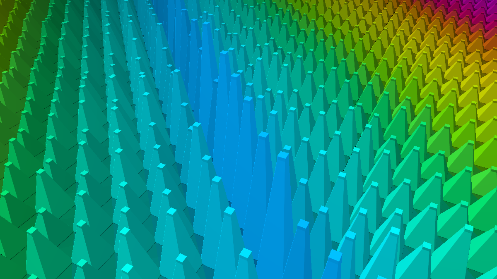

**Ergebnis:** Eine endlose Platte voller frei stehender Pyramiden mit deutlichem Spalt dazwischen – der Bass türmt sich als hoher Grat in der Mitte, zu den Rändern hin flirren die Höhen, und die Kamera **umkreist** das Ganze in einer langsamen Orbit-Fahrt. Ein `FORM`-Dreh, und aus den Pyramiden werden Kugeln, Sechskant-Prismen oder Kristallnadeln; ein `KAMERA`-Dreh wechselt auf Tiefflug oder Wellen-Überflug.

### Was passiert hier

**Jede Zelle liest ihr eigenes Frequenzband:** `abs(id.x) / SPEKTRUM_ZELLEN` bildet den Spalten-Index auf die x-Position der FFT-Zeile ab – Spalte 0 (Bildmitte) hört den Bass, Spalte 24 die Höhen, gespiegelt nach beiden Seiten. Die Säulenhöhe ist dann nichts als `SOCKEL + AUSSCHLAG * pegel`. Damit die Fläche nicht wie ein steriles Balkendiagramm aussieht, streut `hash21(id)` die Pegel je Zeile leicht (B1-Technik!) – dieselbe Frequenz, aber jede Reihe tanzt individuell.

**Die Zellwand-Bremse** ist die wichtige Ingenieurs-Zeile dieses Schritts. In Schritt 7/8 waren alle Kopien identisch – die SDF galt global. Jetzt lügt sie prinzipbedingt: Sie kennt nur die Säule der *eigenen* Zelle, und der Marschierer würde mit ihrer Auskunft glatt durch die hohe Nachbarsäule hindurchspringen. Die Formel `min(d, wand + 0.04)` deckelt jeden Schritt auf „bis zur Zellwand plus ein Krümel" (der Puffer muss kleiner bleiben als der Abstand Säule↔Wand, hier 0.05 – sonst kann der Sprung über die Wand doch wieder in die Nachbarsäule stechen) – dahinter wird neu gefragt, dann mit den Daten der nächsten Zelle. (Das `if (p.y < HOEHE_MAX)` schenkt Strahlen oberhalb aller Geometrie die Bremse – sonst würde der leere Himmel in Trippelschritten marschiert.) Das ist dieselbe Lektion wie der Twist-Preis aus Schritt 10: **Wer die Wiederholung variiert, muss dem Marschierer die Wahrheit rationieren.**

**Die Formbibliothek** steckt komplett in `sdSaeule` – eine Funktion, ein Vertrag: *Fuß auf y=0, Breite r, Höhe h.* Weil alle Formen denselben Vertrag erfüllen, ist der Tausch ein reiner Konstanten-Dreh. Das Arbeitstier dahinter ist `nEck`: die Winkel-Faltung aus Schritt 9 (Kaleidoskop!), angewandt auf den Querschnitt – **ein** Stück Code liefert 4-, 6-, 8-Eck und mit n=64 praktisch den Kreis; Pyramiden und Kegel entstehen, indem das Apothem mit der Höhe auf null schrumpft. Zwei Ehrlichkeiten dazu: Die Pyramiden-Distanz ist wegen des höhenabhängigen Querschnitts nur eine Näherung – deshalb dämpft `* 0.6` die gemeldeten Abstände (dieselbe Medizin wie beim Twist in Schritt 15). Und beim Dreieck sitzt die Sicherung im `0.75 * r`: Seine *Ecken* ragen doppelt so weit hinaus wie seine Kanten – wer hier `1.1` einträgt, verletzt die Zellregel, ohne es der Kante anzusehen.

**Die Kamerafahrten** bringen das zweite neue Werkzeug: die **Look-at-Kamera**. Bisher haben wir `rd` nur gekippt und gerollt – `lookAt` baut stattdessen aus „Position + Blickziel" ein komplettes Kamera-Dreibein (rechts/oben/vorn), durch das die Pixel-Strahlen geschickt werden. Damit sind Choreografien plötzlich trivial zu beschreiben: Der **Orbit** lässt `ro` auf einem Kreis um einen langsam vorwanderndern Anker laufen und schaut ihn einfach an; der **Tiefflug** nutzt aus, dass die Gasse `x = 0` zwischen den Spalten konstruktionsbedingt frei bleibt (Zellzentren liegen bei ±0.17!); der **Wellen-Überflug** pendelt die Höhe per Sinus und senkt den Blick beim Abtauchen mit. Wichtig fürs Selberbauen: Die Kamera darf nie *in* die Geometrie geraten – Orbit und Welle bleiben deshalb über bzw. in der freien Gasse der Spaltenlandschaft.

**Kosten-Hinweis:** Die Wand-Bremse macht Schritte klein – deshalb braucht die Schleife hier 192 statt 80 Iterationen, sonst gehen flachen Horizont-Strahlen die Schritte aus (sichtbar als dunkle „Vorhänge"). Und `texture(...)` läuft *innerhalb* von `map`, also bis zu ~200× pro Pixel. Das ist auf moderner Hardware in Ordnung – aber es erklärt, warum die Bänder in Anhang A außerhalb der Schleife gemittelt wurden, wenn sie global gebraucht werden.

### 🎨 Experimentieren

- Alle elf `FORM`-Werte einmal durchdrehen – Kugeln (1) wirken wie blubbernde Tropfen, Kristallnadeln (10) wie ein Nadelkissen aus Licht
- Alle vier `KAMERA`-Werte testen; der Gassen-Tiefflug (2) ist mit `AUSSCHLAG = 1.6` eine Schluchtenfahrt
- **Die Fläche rotieren statt der Kamera:** ganz oben in `map` ein `p.xz *= mat2(cos(iTime*0.1), sin(iTime*0.1), -sin(iTime*0.1), cos(iTime*0.1));` → die ganze Landschaft dreht sich unter der Kamera (das Spektrum-Muster dreht mit – auch schön)
- `SPEKTRUM_ZELLEN = 8.0` → breite, wuchtige Bänder; `= 64.0` → feine Spektrallandschaft
- Statt Spiegelung eine laufende Achse: `float binX = fract(id.x / SPEKTRUM_ZELLEN);` → das Spektrum wiederholt sich seitlich endlos
- Auch z zur Frequenzachse machen: `binX` aus `length(id)` statt `abs(id.x)` → konzentrische Pegel-Ringe um die Flugbahn
- `ZELLE = vec2(0.5, 0.5)` → noch mehr Luft zwischen den Objekten (die Gasse für den Tiefflug wird breiter)
- Die Wand-Bremse testweise auskommentieren und flach über die Platte schauen → Objekte bekommen Löcher und Geisterkanten. Der beste Beweis, warum sie da ist

---

## Schritt B3 – Beat-Blitze: zufällige Zellen glühen auf und aus

**Neu:** Ein Beat-Raster wählt pro Schlag eine zufällige Teilmenge der Zellen; die blitzt emissiv auf, wirft Glow in die Nachbarschaft – und glüht über den Taktabstand aus.

```glsl
// ---- STELLSCHRAUBEN --------------------------------------------------------
const int   FORM            = 7;      // Formbibliothek wie B2 (hier: 6-Eck-Prisma)
const int   KAMERA          = 3;      // Kamerafahrten wie B2 (hier: Wellen-Ueberflug)
const vec2  ZELLE           = vec2(0.34, 0.34);
const float GROESSE         = 0.095;
const float SPEKTRUM_ZELLEN = 24.0;
const float AUSSCHLAG       = 1.6;
const float SOCKEL          = 0.05;
const float STREUUNG        = 0.5;
const float HOEHE_MAX       = 2.3;
const float BPM             = 120.0; // Beat-Raster (Shadertoy hat keinen Detektor)
const float BLITZ_ANTEIL    = 0.10;  // Anteil der Zellen, die je Beat zuenden
const float ABKLINGEN       = 5.0;   // wie schnell ein Blitz ausgluehen soll
const vec3  BLITZ_FARBE     = vec3(1.0, 0.85, 0.55);
// ----------------------------------------------------------------------------

float hash21(vec2 id)
{
    return fract(sin(dot(id, vec2(127.1, 311.7))) * 43758.5453);
}

vec3 palette(float t)
{
    vec3 d = vec3(0.0, 0.333, 0.667);
    vec3 col = 0.5 + 0.5 * cos(6.28318 * (t + d));
    return smoothstep(0.15, 0.85, col);
}

float bandLevel(float lo, float hi)
{
    float sum = 0.0;
    const int N = 12;
    for (int i = 0; i < N; i++)
    {
        float x = mix(lo, hi, (float(i) + 0.5) / float(N));
        sum += texture(iChannel0, vec2(x, 0.25)).x;
    }
    return sum / float(N);
}

// ---- Formbibliothek (identisch zu B2) --------------------------------------
float nEck(vec3 p, float r, float n)
{
    float sektor = 6.2831853 / n;
    float a = mod(atan(p.z, p.x), sektor) - 0.5 * sektor;
    return length(p.xz) * cos(a) - r;
}

float sdSaeule(vec3 p, float r, float h)
{
    if (FORM == 0) {                                   // Block
        vec3 b = abs(p - vec3(0.0, 0.5 * h, 0.0)) - vec3(r, 0.5 * h, r);
        return length(max(b, 0.0)) + min(max(b.x, max(b.y, b.z)), 0.0);
    }
    if (FORM == 1) {                                   // Kugel (Ellipsoid)
        vec3 q = (p - vec3(0.0, 0.5 * h, 0.0)) / vec3(r, 0.5 * h, r);
        return (length(q) - 1.0) * min(r, 0.5 * h);
    }
    if (FORM == 2) {                                   // Kapsel
        float k = clamp(p.y, r, max(h - r, r));
        return length(p - vec3(0.0, k, 0.0)) - r;
    }
    if (FORM <= 5) {                                   // Pyramiden + Kegel
        float n = FORM == 3 ? 3.0 : FORM == 4 ? 4.0 : 64.0;
        float basis = FORM == 3 ? 0.75 * r : 1.1 * r;
        float rr = basis * (1.0 - clamp(p.y / h, 0.0, 1.0));
        return max(nEck(p, rr, n), max(p.y - h, -p.y)) * 0.6;
    }
    if (FORM <= 8) {                                   // Prisma 4-/6-/8-eckig
        float n = FORM == 6 ? 4.0 : FORM == 7 ? 6.0 : 8.0;
        return max(nEck(p, r, n), abs(p.y - 0.5 * h) - 0.5 * h);
    }
    if (FORM == 9) {                                   // Zylinder (rund)
        return max(length(p.xz) - r, abs(p.y - 0.5 * h) - 0.5 * h);
    }
    vec3 q = abs(vec3(p.x, (p.y - 0.5 * h) * (2.0 * r / h), p.z)); // Kristallnadel
    return (q.x + q.y + q.z - r) * 0.57735027 * min(1.0, 0.5 * h / r);
}

float gPegel  = 0.0;
float gBinX   = 0.0;
float gFlash  = 0.0; // Blitz-Staerke der zuletzt befragten Zelle
float gPuls   = 0.0; // Beat-Huellkurve dieses Frames (einmal berechnet)
float gBeatId = 0.0; // Nummer des aktuellen Beats (waehlt die Zellen)

float map(vec3 p)
{
    vec2 id = floor(p.xz / ZELLE);
    vec2 q  = mod(p.xz, ZELLE) - 0.5 * ZELLE;

    float binX  = clamp(abs(id.x) / SPEKTRUM_ZELLEN, 0.0, 1.0);
    float pegel = texture(iChannel0, vec2(binX * 0.7, 0.25)).x;
    pegel *= mix(1.0, 0.5 + hash21(id), STREUUNG);
    gPegel = pegel;
    gBinX  = binX;

    // --- NEU: Ist DIESE Zelle in DIESEM Beat ausgelost? ---
    float sel = step(1.0 - BLITZ_ANTEIL, hash21(id + gBeatId * vec2(13.7, 7.31)));
    gFlash = sel * gPuls;

    // Blitz hebt das Objekt zusaetzlich leicht an
    float h = SOCKEL + AUSSCHLAG * pegel + 0.15 * gFlash;
    float objekt = sdSaeule(vec3(q.x, p.y, q.y), GROESSE, h) - 0.015;

    float d = min(objekt, p.y);
    if (p.y < HOEHE_MAX)
    {
        float wand = min(0.5 * ZELLE.x - abs(q.x), 0.5 * ZELLE.y - abs(q.y));
        d = min(d, wand + 0.04);   // Puffer < 0.05 (Wandabstand der Saeulen)
    }
    return d;
}

vec3 calcNormal(vec3 p)
{
    vec2 e = vec2(0.002, 0.0);
    return normalize(vec3(
        map(p + e.xyy) - map(p - e.xyy),
        map(p + e.yxy) - map(p - e.yxy),
        map(p + e.yyx) - map(p - e.yyx)
    ));
}

// ---- Kamerafahrten (identisch zu B2) ---------------------------------------
mat3 lookAt(vec3 ro, vec3 ziel)
{
    vec3 f = normalize(ziel - ro);
    vec3 r = normalize(cross(vec3(0.0, 1.0, 0.0), f));
    return mat3(r, cross(f, r), f);
}

void kamera(vec2 uv, out vec3 ro, out vec3 rd)
{
    if (KAMERA == 0) {
        ro = vec3(0.0, 2.2, iTime * 0.6);
        rd = normalize(vec3(uv.x, uv.y - 0.55, 1.0));
        return;
    }
    if (KAMERA == 1) {
        vec3 anker = vec3(0.0, 0.5, iTime * 0.4);
        float w = iTime * 0.25;
        ro = anker + vec3(3.0 * cos(w), 2.0 + 0.5 * sin(iTime * 0.11), 3.0 * sin(w));
        rd = lookAt(ro, anker) * normalize(vec3(uv, 1.4));
        return;
    }
    if (KAMERA == 2) {
        ro = vec3(0.0, 0.45, iTime * 1.6);
        rd = lookAt(ro, ro + vec3(0.0, -0.05, 1.0)) * normalize(vec3(uv, 1.2));
        return;
    }
    float ph = iTime * 0.3;
    ro = vec3(0.0, 1.85 + 1.35 * sin(ph), iTime * 0.8);
    vec3 ziel = ro + vec3(0.3 * sin(ph * 0.5), -0.35 - 0.3 * sin(ph), 1.0);
    rd = lookAt(ro, ziel) * normalize(vec3(uv, 1.3));
}

void mainImage(out vec4 fragColor, in vec2 fragCoord)
{
    // --- NEU: Beat-Raster + Huellkurve, EINMAL pro Frame ---
    float takt = iTime * BPM / 60.0;
    gBeatId = mod(floor(takt), 64.0);          // klein halten (sin-Praezision!)
    gPuls = exp(-ABKLINGEN * fract(takt))      // zuendet hart, glueht aus ...
          * smoothstep(0.10, 0.30, bandLevel(0.0, 0.05)); // ... nur wenn Bass da

    vec2 uv = (fragCoord - 0.5 * iResolution.xy) / iResolution.y;

    vec3 ro, rd;
    kamera(uv, ro, rd);

    float dist = 0.0;
    vec3 color = vec3(0.0);
    float glowBlitz = 0.0;

    for (int i = 0; i < 192; i++)
    {
        vec3 p = ro + rd * dist;
        float d = map(p);

        // --- NEU: nur gezuendete Zellen speisen den Glow (Schritt-14-Formel) ---
        glowBlitz += gFlash * 0.002 / (0.0008 + abs(d));

        if (d < 0.001) {
            float pegel = gPegel;
            float binX  = gBinX;
            float flash = gFlash;      // ebenfalls VOR calcNormal sichern
            vec3 n = calcNormal(p);

            vec3 albedo = palette(binX * 0.9 + iTime * 0.08);
            vec3 lightDir = normalize(vec3(0.4, 0.8, -0.3));
            float diffuse = max(dot(n, lightDir), 0.0);
            color = albedo * (0.12 + 0.88 * diffuse);
            color += albedo * pegel * 0.7;
            if (p.y < 0.005) color *= 0.25;

            // --- NEU: die gezuendete Saeule brennt emissiv ---
            color += BLITZ_FARBE * flash * 2.5;
            break;
        }
        if (dist > 24.0) break;

        dist += d * 0.9;
    }

    // --- NEU: Blitz-Glow ueber das Bild legen (vor dem Nebel, wie Schritt 15) ---
    color += BLITZ_FARBE * glowBlitz * 0.04;

    color = mix(color, vec3(0.0), 1.0 - exp(-0.01 * dist * dist));
    color = pow(color, vec3(1.0 / 2.2));
    fragColor = vec4(color, 1.0);
}
```

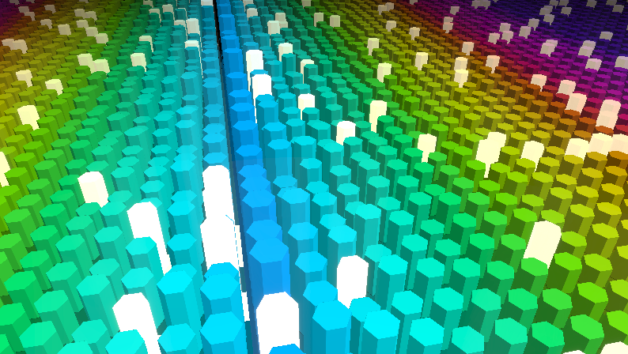

**Ergebnis:** Die Equalizer-Landschaft aus B2 – hier als Sechskant-Prismen im Wellen-Überflug – aber im Takt zucken einzelne Objekte warmweiß auf, werfen einen Lichthof über ihre Nachbarn und verglimmen bis zum nächsten Schlag. Welche Zellen zünden, wechselt mit jedem Beat; Formbibliothek und Kamerafahrten aus B2 sind unverändert an Bord.

### Was passiert hier

**Der Beat ohne Detektor:** Shadertoy liefert keinen Beat-Impuls, und ein Fragment-Shader kann keinen detektieren und *festhalten* (kein Gedächtnis – die A3-Lektion). Der Ausweg ist ein **deterministisches Beat-Raster**: `iTime * BPM / 60` zählt Schläge, `floor` davon ist die Beat-Nummer, `fract` die Position im Schlag. `exp(-ABKLINGEN * fract(...))` springt bei jedem Schlag auf 1 und fällt exponentiell – *das* ist das Ausglühen, als reine Funktion der Zeit statt als gespeicherter Zustand. Damit das Raster nicht stur weiterblinkt, wenn die Musik schweigt, wird es mit dem Bass-Band gegated (`smoothstep(...)` auf `bandLevel` aus A2): kein Bass, keine Blitze. Ehrliche Grenze: Das Raster läuft mit *konstanten* BPM neben dem Song her – für echtes Beat-Tracking bräuchte es einen Buffer mit Vorzustand (oder LumiViz, siehe Kasten).

**Die Auslosung** ist B1-Technik mit einem Dreh: `hash21(id + gBeatId * vec2(...))` mischt die Beat-Nummer in den Zell-Hash – dieselbe Zelle würfelt also jeden Schlag neu. `step(1.0 - BLITZ_ANTEIL, ...)` macht daraus ein Ja/Nein mit einstellbarer Trefferquote. Innerhalb eines Beats ist die Auswahl stabil (kein Flackern), zwischen Beats wandert sie.

**Der Glow recycelt Schritt 14 wortwörtlich** – nur wird der Beitrag mit `gFlash` multipliziert: Der Lichthof entsteht ausschließlich um gezündete Säulen, denn nur dort, wo der Strahl *ihnen* nahekommt, ist `gFlash` beim Aufsammeln ≠ 0. Ein globaler Wert, im richtigen Moment abgefragt – dieselbe Sparsamkeit wie `dist`/`d` im Haupt-Tutorial.

### 💡 Das Globals-Muster (und seine Falle)

`map` liefert nur eine Zahl – aber B2/B3 brauchen am Auftreffpunkt auch Pegel, Frequenz und Blitz-Status. Statt die Signatur aufzubohren, schreibt `map` die Werte der zuletzt befragten Zelle in globale Variablen (`gPegel`, `gFlash`, ...). Die Falle: `calcNormal` ruft `map` sechsmal an *Nachbar*punkten auf und überschreibt die Globals – deshalb werden sie am Treffer **sofort in Lokale gesichert**, bevor die Normale berechnet wird. Wer diese Zeilen umsortiert, färbt mit den Werten des Normalen-Tastpunkts.

### 🎨 Experimentieren

- `BLITZ_ANTEIL = 0.4` → Gewitter; `= 0.02` → seltene, kostbare Einschläge
- `ABKLINGEN = 1.5` → die Blitze verschmelzen zu einem Atmen; `= 12.0` → harte Strobo-Nadeln
- `BPM` an den laufenden Track anpassen – schon grob richtig fühlt es sich „getroffen" an
- Blitz-Farbe aus der Palette statt konstant: `BLITZ_FARBE` durch `palette(gBeatId * 0.13)` am Treffer ersetzen → jeder Beat hat seine Farbe

### 📦 Hinweis für LumiViz

Wie in Anhang A gilt: Alles hier läuft 1:1 im Shadertoy-Node. Zusätzlich lohnt in LumiViz vor allem der **`beat`-Uniform**: Er ersetzt das starre BPM-Raster durch die echte Beat-Erkennung der App — `gPuls` wird dann aus `beat` gespeist statt aus `fract(iTime * BPM / 60)`. Das Ausglühen bleibt trotzdem eine Zeitfunktion (der Shader hat weiterhin kein Gedächtnis); wer echtes Nachleuchten über Sekunden will, hängt in der Effect-Chain einen Feedback-/Trail-Node hinter den Shadertoy-Node.

Die Weiche ist gestellt – wohin sie weiterführt, entscheidest du. 🚦

---

## End-Validierung

Diese Validierung steht bewusst **hinter den Anhängen**: A1–A3 und B1–B3 sind reguläre Schritte dieses Tutorials, und die Lernziele 5 (Audio-Reaktivität) und 6 (Zell-Individualisierung) sind erst dort erreichbar – die End-Validierung muss aber alle Lernziele abdecken. Die Kriterien 1–5 prüfen den Kern (Schritte 1–16), die Kriterien 6–7 die Anhänge. Jedes Kriterium ist am laufenden Shader auf shadertoy.com objektiv prüfbar:

1. **Kompilierbarkeit:** Das Gesamtlisting aus Schritt 16 kompiliert auf shadertoy.com ohne Fehlermeldung und rendert die animierte, farbige Spirale – kein Schwarzbild, kein Standbild. *(Basis aller Lernziele)*
2. **Koordinatensystem:** Im Stand von Schritt 2 ist der radiale Verlauf **kreisrund**, nicht oval; Gegenprobe: Division durch `iResolution.xy` statt `iResolution.y` macht ihn sichtbar oval, zurückgestellt verschwindet die Verzerrung wieder. *(Lernziel 1)*
3. **Raymarcher und Licht:** Im Stand von Schritt 6 zeigt die einkommentierte Debug-Zeile `color = n * 0.5 + 0.5;` pro Oktaeder-Fläche eine homogene RGB-Farbe (Normalen korrekt); im Stand von Schritt 13 sind Flächenmitten dunkel und Kanten/Silhouetten farbglühend, mit wandernden Glanzblitzen. *(Lernziel 2)*
4. **Raumfaltung:** Ab Schritt 9 zeigt ein Standbild neun Arme (Sektorzahl `/ 9.0` abzählbar); `sdOctahedron(p, 0.6)` in Schritt 7 erzeugt die beschriebenen Durchschieß-Artefakte, Radius 0.25 beseitigt sie wieder; die Stabilitäts-Faktoren aus Schritt 15 auf `1.0` zurückgesetzt bringen Kanten- und Fern-Flimmern zurück, restauriert verschwindet es. *(Lernziel 3)*
5. **Animation und Politur:** Die Rotation schwingt sichtbar an und aus (Umkehrpunkte mit Winkelgeschwindigkeit null statt monotonem Kreiseln); Auskommentieren der drei Politur-Blöcke in Schritt 16 verändert das Bild deutlich (flache Weißflecken, abgesoffene Mitteltöne, ruhige Ränder), einkommentiert kehrt der fertige Look zurück. *(Lernziel 4)*
6. **Audio:** Im A3-Stand (iChannel0 = Music) schwellen die Oktaeder und der Glow im Takt der Kickdrum, die Farben schieben sich mit der Melodie, Glanzblitze folgen den Hi-Hats; **ohne belegten Kanal** läuft die Spirale unverändert stumm weiter. *(Lernziel 5)*
7. **Varianten:** In B1 wechselt der `FORM`-Schalter die Objektform ohne weitere Codeänderung und `GROESSE_STREU` streut die Größen pro Zelle flackerfrei; in B2 türmt sich der Bass als Grat in der Bildmitte und alle vier `KAMERA`-Fahrten laufen ohne Durchschieß-Artefakte; in B3 zünden pro Beat wechselnde Zellen und glühen bis zum nächsten Schlag aus. *(Lernziel 6)*

---

## Fehlerbehebung

Die häufigsten Stolperstellen dieses Tutorials, gesammelt nach Symptom (Tab. 7). Die schritt-lokalen ⚠-Hinweise (etwa zur Zellgrößen-Regel in Schritt 7 oder zur Zellwand-Bremse in B2) bleiben davon unberührt – hier stehen die Probleme, die typischerweise erst beim Zusammenbau oder beim Experimentieren auftreten:

| # | Symptom | Ursache | Lösung |
|---|---|---|---|
| 1 | Schwarzes Bild nach dem Einfügen | Code unvollständig kopiert (Hilfsfunktionen fehlen) oder Kompilierfehler – Shadertoy rendert dann nichts bzw. den letzten lauffähigen Stand | Das vollständige Listing des Schritts kopieren, mit `Alt+Enter` kompilieren und die Fehlerkonsole unter dem Editor lesen |
| 2 | Löcher und Geisterkanten, Strahl springt durch Geometrie | Zellgrößen-Regel verletzt – die Form ragt über die halbe Zellbreite hinaus, die SDF sieht die Nachbarkopie nicht (Schritt 7); in B2/B3 zusätzlich: Zellwand-Bremse entfernt oder Puffer zu groß | Form-Radius unter die halbe Zellbreite bringen; beim Audio-Puls in A3 den Maximal-Radius nachrechnen; in B2/B3 die `wand`-Zeile aktiv lassen |
| 3 | Unruhige Kanten, Flimmern in der Ferne | Twist lässt die SDF zu große Abstände melden, Fernbereich ist unterabgetastet | Die Stabilitäts-Zeilen aus Schritt 15 aktiv lassen (`(shape - 0.005) * 0.8` und `dist += d * 0.9`) und die Nebeldichte zur Abbruchgrenze passend halten |
| 4 | Periodisches Schwarzbild beim Flug (Schritt 8) | Kamera fliegt exakt auf einer Gitterlinie und damit periodisch mitten durch ein Oktaeder | Kamera versetzen (`ro = vec3(0.15, 0.1, ...)`) oder ab Schritt 9 die konstruktionsbedingt freie Mittelachse des Kaleidoskops nutzen |
| 5 | Bild in den Anhängen schwarz bzw. unbewegt | iChannel0 nicht mit „Music" belegt – die Audio-Textur liefert nur Nullen, das ist kein Fehler im Code | Kanal-Kachel unter dem Code-Editor prüfen und im Tab „Music" einen Track wählen (Vorbereitung am Anfang von Anhang A) |
| 6 | Kamera „teleportiert" im Takt der Musik | Audio-Pegel auf den Faktor vor `iTime` gelegt – `iTime * speed` ist eine Position, die bei Pegeländerung springt | Audio nur auf zustandslose Größen legen (Größe, Helligkeit, Farbe, Winkel-Offsets) – die Warnung in Schritt A3 |
| 7 | Konstanten wirken anders als beschrieben | Die Shader dieser Serie sind konstruiert, nachgerechnet und in LumiViz gegengerendert (Screenshots im Text) – aber nicht jeder Zahlwert ist gegen das beschriebene Zielbild feinabgeglichen, und der Sichttest auf shadertoy.com ist noch offen | Die Stellschraube in kleinen Schritten nachstimmen; die beschriebene **Wirkrichtung** jeder Konstante stimmt, der Absolutwert ist Startpunkt, nicht Dogma |

*Tab. 7: Fehlerbehebung – Symptom, Ursache, Lösung*

---

## Nächste Schritte

Die Fortsetzung folgt der [Wegleitung](ShaderTutorials-overview.md) der Serie:

- **Als Nächstes:** [Crystal-Lights](CrystalLights-tutorial.md) – die zweite große Renderschule (Höhenfeld-Raymarching statt Tunnel) mit Noise/FBM/Voronoi, Brechung und Kamera-Choreografie; sein Anhang B ist die **Vollreferenz Shadertoy ↔ LumiViz** der Serie.
- **Danach verzweigt der Weg:** [Stratospheric-Tunnel](StratosphericTunnel-tutorial.md) (Architektur, Lichtdesign, Kamerapfade – der direkteste Nachfolger dieses Tunnels), [Space-Debris](SpaceDebris-tutorial.md) (Objektfelder – vertieft die Domain Repetition aus Schritt 7/B1 in 3D mit Rotation) oder [Pimped-Kaleidoscope](PimpedKaleidoscope-tutorial.md) (2D-Strang, Feedback und Zustand – braucht nur die Grundlagen dieses Tutorials).
- **Später:** [Juggernaut](Juggernaut-tutorial.md) und die Composites – [Portals](CompositePortals-tutorial.md), [Postfx](CompositePostfx-tutorial.md), [Transitions](CompositeTransitions-tutorial.md) – setzen die Gesamtlistings der Basis-Tutorials voraus.

---

## Siehe auch

**Voraussetzungen:**

- Keine – dieses Tutorial ist der Einstieg der Shader-Tutorial-Serie; alle übrigen Tutorials der Serie setzen es voraus.

**Verwandte Dokumente:**

- [Shader-Tutorials-Wegleitung](ShaderTutorials-overview.md) – Fokus-Tabellen, Lesereihenfolge und Technik-Index der gesamten Tutorial-Serie.
- [Raymarching – Referenz](Raymarching-reference.md) – die technische Referenz zu Algorithmus, Distanzfunktionen, Normalen, Varianten und Artefakten; das „Warum" hinter den Schritten 3–10 zum Nachschlagen.

**Weiterführendes:**

- [„Pyramid Spiral" von Noztol](https://www.shadertoy.com/view/fcy3R3) – der Original-Shader auf shadertoy.com, dessen Aufbau dieses Tutorial Schritt für Schritt nachvollzieht.
- [iquilezles.org](https://iquilezles.org/articles/) – die Artikelsammlung von Inigo Quilez zu Distanzfunktionen, Paletten und Raymarching; die Primärquelle der meisten hier verwendeten Techniken.

## Changelog

| Version | Datum | Änderungen |
|---|---|---|
| **1.2.0** | 2026-08-05 | Formalisierung nach Tutorial_Base (nach dem Muster des Piloten Crystal-Lights): Blockquote-Header, Inhaltsverzeichnis, Lernziele, Voraussetzungen, Übersicht der Schritte, Konventions-Mapping (Tab. 1), End-Validierung, Fehlerbehebung, Nächste Schritte, Siehe auch; bestehende Tabellen als Tab. 2–6 indexiert, Fehlerbehebung als Tab. 7; Anhang-A-Überschrift zur Serien-Konvention um „A" ergänzt. Didaktischer Bestand (16 Schritte, Anhänge A/B mit der Weiche, Code, Bilder, 🎨-Kästen) inhaltlich unverändert. Zuvor Umzug der Serie nach `projects/apps/LumiViz/docs/tutorials/` und Umbenennung nach FNM-01 zu `PyramidSpiral-tutorial.md` (Entscheid Patrik, 2026-08-04). |
| **1.1.0** | 2026-08-04 | Schritt-Chains + Screenshots (bereits vor der Formalisierung): je Schritt eine lauffähige Ein-Node-Chain in `pyramid_spiral_schritte/` (generiert per `make_schritte.py`, das Markdown ist die SSOT) und ein eingebettetes Render-Bild in `pyramid_spiral_bilder/` (AvsStandalone, 800×450; Anhang-Bilder mit dem synthetischen Testsignal des Standalone); Einleitungs-Bullet „In LumiViz". |
| **1.0.0** | 2026-08-04 | Erstfassung: 16 Schritte (Geometrie → Bewegung → Farbe → Licht → Politur) + Anhang A (Audio-Reaktivität, A1–A3) + Anhang B (Die Weiche: Formen, 3D-Equalizer, Beat-Blitze, B1–B3). |
