# Composite: PostFX – Eine Nachbearbeitungs-Küche von Grund auf

**Ziel:** Kein neues Motiv – eine neue **Maschine hinter dem Motiv**. Der Juggernaut-Moloch aus dem gleichnamigen Tutorial wird durch eine **Multipass-Nachbearbeitungs-Kette** veredelt: Die 3D-Szene zieht in **Buffer A** um und liefert neben dem Bild ihre **Tiefe im Alpha-Kanal** mit; **Buffer B und C** bauen daraus ein echtes **Bloom** (Bright-Pass + separierbarer Gauß-Blur – das ehrliche Pendant zu Milkdrops `GetBlur1/2/3`); der **Image-Pass** wird zur Anrichte: **Depth of Field** aus dem Tiefenkanal, ein wählbares **Kaleidoskop-Finish** über die fertige Szene, **Temporal-Glättung** gegen Flimmern – und die komplette Politur (Nebel, Tonemapping, Vignette), die endlich dort wohnt, wo sie hingehört: **am Ende der Kette**. Die `STIMMUNG`-Stellschraube der Szene reicht dabei bis in die Post hinein: *dark* bekommt mehr Bloom, eine offenere Blende und dichteren Nebel.

**Stil-Vorbilder** (diesmal vor allem die Serie selbst – plus das eine Milkdrop-Werkzeug, das alle ihre Presets benutzen):

- **Das Juggernaut-Tutorial** (gleicher Ordner) liefert die Szene: den kolossalen, gepanzerten Orb mit seinen drei Gitter-Oktaven, zwei Licht-Welten und der `STIMMUNG`-Blende. Wir bauen ihn nicht neu – wir **kondensieren** ihn (Schritt 1) und lernen dabei, was an einem Shader *Look-Träger* ist und was *Politur*. Ein Lehr-Punkt gleich vorweg: Seine God-Rays und Streu-Sonnen-Keulen waren **Ersatzkonstruktionen** für den 2D-Post-Pass, den ein Single-Pass-Shader nicht hat. Jetzt bauen wir das echte Werkzeug.
- **Das Pimped-Kaleidoscope-Tutorial** (gleicher Ordner) liefert die Kernel- und Faltungs-Techniken: den Kreuz-Blur (`blur4` – hier wächst er zum richtigen Gauß aus), die Winkel-Faltung und die Spiegel-Kachel (hier: als optionales Finish über eine 3D-Szene) und die **Common-Tab-Disziplin** – ein SSOT für Stellschrauben über alle Pässe (dort Schritt 13).
- **Milkdrops `GetBlur1/2/3`**: Jedes Preset der Serie greift darauf zu – *frosty caves* mischt `GetBlur1` als Schimmer bei, *pimped caleidoscope* baut seine Unsharp Mask daraus, die *juggernaut*-Presets füttern damit ihren 27er-Shine-Loop. Milkdrop schenkt jedem Preset drei fertig weichgezeichnete Kopien des Bildes – **genau diese Infrastruktur bauen wir hier selbst**, als Buffer-Kette mit eigenen Reglern.

**So funktioniert dieses Tutorial:**

- Es läuft **direkt auf Shadertoy**: Jeder Schritt ist ein vollständiger, lauffähiger Stand. Kopiere ihn nach [shadertoy.com/new](https://www.shadertoy.com/new), drücke `Alt+Enter` – fertig. **Ab Schritt 2 ist der Shader mehrteilig** (Tabs „Common", „Buffer A", „Buffer B", „Buffer C", „Image"); jeder Schritt sagt präzise, **welcher Code in welchen Tab** gehört und welche iChannel-Verdrahtung er braucht. Unveränderte Tabs werden als „*unverändert*" markiert.
- **In LumiViz:** Jeder Schritt liegt zusätzlich als lauffähige Multipass-Chain in `composite_postfx_schritte/` (generiert aus diesem Dokument per `make_schritte.py` – das Markdown ist die SSOT; ab Schritt 2 als Shadertoy-Node mit Buffer A(+B+C) + Image, der Common-Tab wird dabei jedem Pass vorangestellt). Die Screenshots bei den Schritten stammen aus genau diesen Chains, gerendert im AvsStandalone (`AvsStandalone composite_postfx_schritte --auto --frames 300 --size 800x450 --out composite_postfx_bilder`; nur Schritt 4 mit `--frames 240`, damit ein Blink-Moment der Positionslichter im Bild ist). Vier dokumentierte Abweichungen stecken NUR in den generierten Dateien, die Codeblöcke hier bleiben Shadertoy-treu: manuelles bilineares Lesen (`lesBilinear0/1` – die Buffer-FBOs der App filtern derzeit NEAREST; Gauß-Taps, DOF-Gather und gefaltete Lesungen brauchen die bilineare Shadertoy-Semantik), die Chain-Kalibrierung `SCHWELLE 0.7 → 0.3` (in der dark-Stimmung liegt keine Lichtquelle *lum-gewichtet* über 0.7 – die „~1.4" der Fenster ist ihr Rot-Kanal; mit 0.7 blieb die Bloom-Leitung im Gegen-Rendern praktisch leer, Details im Kopf von `make_schritte.py`), Monitor-/Schalter-Stände je Schritt-Bild (ANSICHT 1/2 in Schritt 3–5, FALT_VOR_BLOOM 1.0 in Schritt 9, FINISH ab Schritt 10 wieder 0) sowie in Anhang A1/A3 die App-Audio-Uniforms statt der FFT-Absolutschwellen (die dB-FFT des Standalone-Testsignals sättigt bei 1.0).
- Jeder Schritt fügt **genau eine Technik** hinzu; unter jedem Schritt stehen Variationsideen (🎨).
- Die Reihenfolge folgt diesmal der Küchen-Logik: **Rohware → Architektur → Bloom → Tiefe → Finish → Politur.** Erst die kondensierte Szene, dann die Pass-Struktur, dann Station für Station – und ganz am Ende das Anrichten.
- Vorwissen: Das **Juggernaut-Tutorial** wird vorausgesetzt (die Szene wird kondensiert, nicht neu hergeleitet – wer eine `map`- oder `kamera`-Zeile nicht versteht, findet dort die ausführliche Fassung). Vom **Pimped-Kaleidoscope-Tutorial** braucht es die Schritte 3–6 (Buffer, Feedback, Blur) und 8–9 (Faltungen). Neu ist diesmal die Königsdisziplin **Datenfluss**: mehrere Pässe, die einander zuarbeiten – und ein Nebenkanal, der Geometrie-Wissen als Bilddaten transportiert.

**Inhalt**

| Phase | Schritte | Thema |
|---|---|---|
| Rohware | 1 | Kondensieren: das Szenen-Skelett (Look-Träger vs. Politur) |
| Architektur | 2–3 | Buffer A + Image, Common als SSOT, Tiefe im Alpha-Kanal |
| Bloom | 4–6 | Bright-Pass, separierbarer Gauß (H+V), additive Mischung |
| Tiefe | 7 | Depth of Field aus dem Tiefenkanal (Gather-DOF light) |
| Finish | 8–9 | Kaleidoskop als Post-Transformation, Faltung vor/nach Bloom |
| Zeit | 10 | Temporal-Glättung: der Szenen-Pass bekommt ein Gedächtnis |
| Politur | 11–12 | Nebel/Tonemapping/Vignette ans Ketten-Ende, STIMMUNGs-Kopplung |
| Endstand | 13 | Der fertige Shader: Common + Buffer A + B + C + Image |
| Anhang A | A1–A3 | Audio auf die Küchenstationen (Bass→Bloom & Co.) |
| Anhang B | B1–B2 | Multipass-Import + die Effect-Chain-Brücke |

---

## Der Bauplan: Was wir eigentlich rendern

Bevor die erste Zeile fällt, ein Blick auf die Architektur – diesmal ist sie keine Etagen-Landschaft (Crystal Lights) und kein Kreislauf (Kaleidoscope), sondern eine **Fließband-Küche** mit einem Nebenkanal:

```
   ┌─────────────────────────────────────────────────────────────────┐
   │  BUFFER A – DIE SZENE  (der kondensierte Moloch)                │
   │   rgb = lineares HDR-Bild        a = Marsch-Distanz (TIEFE!)    │◀──┐
   │   + Temporal-Mix mit dem eigenen Vorframe        (Schritt 10)   │───┘
   └────────────────┬───────────────────────────────┬────────────────┘
                    │ iChannel0                     │ iChannel0
                    ▼                               │
   ┌────────────────────────────────┐               │
   │  BUFFER B – BRIGHT + H-BLUR    │               │
   │   Schwelle, dann Gauss QUER    │               │
   └────────────────┬───────────────┘               │
                    │ iChannel0                     │
                    ▼                               │
   ┌────────────────────────────────┐               │
   │  BUFFER C – V-BLUR             │               │  (rgb UND a:
   │   Gauss HOCH: fertiges Bloom   │               │   Bild + Tiefe)
   └────────────────┬───────────────┘               │
                    │ iChannel1                     │
                    ▼                               ▼
   ┌─────────────────────────────────────────────────────────────────┐
   │  IMAGE – DIE ANRICHTE                                           │
   │   Kaleidoskop-Finish · DOF aus der Tiefe · Tiefen-Nebel         │
   │   + Bloom · Farbdrift · Tonemapping · Vignette · Dither         │
   └─────────────────────────────────────────────────────────────────┘

        COMMON: STELLSCHRAUBEN + geteilte Helfer – wird JEDEM Pass
                vorangestellt (das SSOT der ganzen Küche)
```

Vier Pässe, ein geteilter Kopf. Drei Beobachtungen, die das ganze Tutorial tragen:

1. **Die Szene ist nur noch ein Zulieferer.** Buffer A rendert den Moloch **linear und roh** – kein Tonemapping, kein Nebel, keine Vignette. Alles, was „Geschmack" ist, passiert stromabwärts. Das ist die zentrale Lektion: *Politur gehört ans Ende der Kette, nicht in die Szene* – denn nur dort sieht sie das ganze Bild (inklusive Bloom), und nur dort ist sie umbaubar, ohne die Szene anzufassen.
2. **Der Alpha-Kanal ist ein Gratis-Nebenkanal.** Der Raymarcher kennt für jedes Pixel die Marsch-Distanz – ein komplettes Tiefenbild, das im Single-Pass-Shader am Ende des Frames einfach weggeworfen wurde. Jetzt schreiben wir es ins `a` von Buffer A, und zwei Stationen weiter unten wird daraus Tiefenschärfe und Tiefen-Nebel.
3. **Der Blur ist zweigeteilt, weil Mathematik es erlaubt.** Ein 2D-Gauß-Kernel ist **separierbar**: erst horizontal verwischen (Buffer B), dann das Ergebnis vertikal (Buffer C) – gleiche Wirkung wie der volle 2D-Kernel, aber `2·N` statt `N²` Textur-Abgriffe. Die Kostenrechnung dazu steht in Schritt 5; sie ist der Grund, warum diese Kette überhaupt drei Buffer braucht statt einem.

Und die Klammer über allem: **Shadertoy rendert die Tabs in fester Reihenfolge** – Buffer A, B, C, D, dann Image, jeden Frame. Ein Pass, der einen *früheren* Tab liest, bekommt dessen frisches Ergebnis; ein Pass, der einen *späteren* (oder sich selbst) liest, bekommt das **Vorframe**. Unsere Kette fließt strikt vorwärts – bis auf eine bewusste Ausnahme: Buffer A liest sich in Schritt 10 selbst, und genau diese Vorframe-Semantik ist dann das Werkzeug.

---

## Schritt 1 – Kondensieren: das Szenen-Skelett

**Neu:** Das Juggernaut-Gesamtlisting wird auf ein **Szenen-Skelett** eingedampft – nach zwei klaren Regeln – und läuft zunächst als ganz normaler Single-Pass-Shader. (Der Umzug in die Buffer kommt in Schritt 2; erst muss die Rohware stimmen.)

Die zwei Kondensier-Regeln:

- **Look-Träger bleiben.** Alles, was den Moloch zum Moloch macht: die Riesenkugel mit allen drei Gitter-Oktaven, beide Licht-Welten samt `STIMMUNG`-Blende, die blinkenden Positionslichter (die werden gleich das beste Bloom-Futter!), der volumetrische Glow (der ist **geometriegebunden** – ein 2D-Post-Blur kann ihn nicht ersetzen, er umrandet die Silhouette mit echter Parallaxe) und die Orbit-Kamera.
- **Politur fliegt raus – sie zieht ja gerade um.** Gestrichen werden: der Dunst (kommt als Tiefen-Nebel im Post wieder, gespeist aus dem Alpha-Kanal), Farbdrift, Tonemapping, Gamma, Vignette, Dither (alle fünf kommen als Image-Politur wieder) – **und die Strahlenkeulen der Streu-Sonne**. Die waren im Original die ehrliche Notlösung für den fehlenden 2D-Shine-Pass (Juggernaut-Tutorial, Schritt 11–12); jetzt, wo wir das echte Bloom bauen, wäre der Fake doppelt gemoppelt. Die Sonnen-Korona bleibt – das Bloom wird sie von selbst zum Strahlen bringen.

Eine kleine Umbenennung fällt dabei an: Die Juggernaut-Konstante `TIEFE` (die Fugen-Schale unter dem Nennradius) heißt hier **`SCHALE`** – der Name `TIEFE` ist in dieser Küche für den Tiefenkanal reserviert.

```glsl
// ============================================================================
// Schritt 1: das Szenen-Skelett - der kondensierte Moloch als Single-Pass.
// Quelle: Juggernaut-Shader-Tutorial (gleicher Ordner), Schritt 14, MINUS
// Politur/Dunst/Strahlenkeulen (ziehen in die Post-Kette um).
// ============================================================================

// ---- STELLSCHRAUBEN (Auszug - waechst mit jedem Schritt) -------------------
const float STIMMUNG  = 0.0;   // 0.0 = dark .. 1.0 = brighter
const float RADIUS    = 6.0;   // Radius des Molochs
const float ZELLE1    = 2.6;   // Kantenlaenge der grossen Platten
const float ZELLE2    = 0.9;   // Raster der Aufbauten + Positionslichter
const float ZELLE3    = 0.32;  // Raster der feinen Rillen
const float PLATTE    = 0.35;  // Hoehenspiel der grossen Platten
const float AUFBAU    = 0.22;  // Hoehe der mittleren Aufbauten
const float FUGE      = 0.07;  // halbe Breite der Panelfugen
const float SCHALE    = 0.30;  // Fugen-Schale unter dem Nennradius (war: TIEFE)
const float RILLE     = 0.02;  // Tiefe der feinen Rillen
const float GLAETTE   = 0.05;  // Kanten-Weiche der smax-Fugen
const float DROSSEL   = 0.5;   // Marsch-Drossel
const float GODRAY    = 1.0;   // volumetrischer Glow der Szene
const float TEMPO     = 1.0;   // Orbit-Tempo
const float NAH       = 8.5;   // Orbit-Radius nah
const float FERN      = 15.0;  // Orbit-Radius fern
const float TIEFE_MAX = 40.0;  // Marsch-Limit ("unendlich weit weg")
// ----------------------------------------------------------------------------

#define R(a) mat2(cos(a), sin(a), -sin(a), cos(a))

float hash21(vec2 p) { return fract(sin(dot(p, vec2(127.1, 311.7))) * 43758.5453); }
float hash31(vec3 p) { return fract(sin(dot(p, vec3(127.1, 311.7, 74.7))) * 43758.5453); }

float smin(float a, float b, float k)
{
    float h = max(k - abs(a - b), 0.0) / k;
    return min(a, b) - h * h * k * 0.25;
}
float smax(float a, float b, float k) { return -smin(-a, -b, k); }

vec3 gSonne = vec3(0.0, 0.3, 1.0);   // wird je Frame in kamera() gesetzt

// ---- Geometrie (Juggernaut Schritte 2-6, unveraendert kondensiert) ---------

vec3 gedreht(vec3 p)
{
    p.yz *= R(0.42);
    p.xz *= R(iTime * 0.02);
    return p;
}

float fugen(vec3 p, float zelle)
{
    vec3 q = abs(fract(p / zelle) - 0.5) * zelle;
    return zelle * 0.5 - max(q.x, max(q.y, q.z));
}

float map(vec3 p)
{
    vec3 q = gedreht(p);

    float d = length(q) - RADIUS;                       // Basis: Riesenkugel

    vec3 z1 = floor(q / ZELLE1);                        // Oktave 1: Platten
    d -= (hash31(z1) - 0.5) * PLATTE;

    float slab   = fugen(q, ZELLE1) - FUGE;             // Fugen abziehen
    float schale = (RADIUS - SCHALE) - length(q);
    d = smax(d, -max(slab, schale), GLAETTE);

    vec3 z2 = floor(q / ZELLE2);                        // Oktave 2: Aufbauten
    d -= step(0.72, hash31(z2 + 7.0)) * AUFBAU * (0.35 + 0.65 * hash31(z2 + 13.0));

    vec3 h = pow(abs(2.0 * fract(q / ZELLE3) - 1.0), vec3(3.0));
    d += RILLE * (h.x + h.y + h.z) * 0.33;              // Oktave 3: Rillen

    return d;
}

float march(vec3 ro, vec3 rd, out float glow)
{
    glow = 0.0;
    float t = 0.0;
    for (int i = 0; i < 160; i++) {
        vec3 p = ro + rd * t;
        float d = map(p);
        glow += 0.012 / (0.05 + d * d);      // God-Ray-Saat (geometriegebunden)
        if (d < 0.001 + 0.0008 * t) return t;
        if (t > TIEFE_MAX) break;
        t += d * DROSSEL;
    }
    return -1.0;
}

vec3 calcNormal(vec3 p)
{
    const vec2 e = vec2(0.004, 0.0);
    return normalize(vec3(map(p + e.xyy) - map(p - e.xyy),
                          map(p + e.yxy) - map(p - e.yxy),
                          map(p + e.yyx) - map(p - e.yyx)));
}

// ---- Positionslichter (Juggernaut Schritt 10) - das Bloom-Futter -----------

float fenster(vec3 q)
{
    vec3 z = floor(q / ZELLE2);
    float an = step(0.93, hash31(z + 29.0));

    float sp = 0.10 + 0.25 * hash31(z + 3.0);
    float w  = 0.5 + 0.5 * sin(6.28318 * (iTime * sp + hash31(z + 11.0)));
    float blink = 0.25 + 0.75 * smoothstep(0.55, 0.95, w);

    vec3 lokal = (fract(q / ZELLE2) - 0.5) * ZELLE2;
    float punkt = 1.0 - smoothstep(0.06, 0.24, length(lokal));

    return an * blink * punkt;
}

// ---- Licht: EIN Shader, ZWEI Stimmungen (Juggernaut Schritte 7-9) ----------

vec3 himmel(vec3 rd)
{
    vec3 oben  = mix(vec3(0.010, 0.012, 0.022), vec3(0.10, 0.13, 0.20), STIMMUNG);
    vec3 unten = mix(vec3(0.030, 0.028, 0.045), vec3(0.24, 0.20, 0.18), STIMMUNG);
    vec3 col = mix(unten, oben, clamp(rd.y * 1.5 + 0.5, 0.0, 1.0));

    // Sonnen-Korona OHNE Strahlenkeulen - das Strahlen uebernimmt das Bloom!
    float s = max(dot(rd, gSonne), 0.0);
    vec3 sonnenFarbe = mix(vec3(0.35, 0.42, 0.60), vec3(1.2, 0.9, 0.6), STIMMUNG);
    col += pow(s, 30.0) * sonnenFarbe * 1.2;
    col += pow(s, 5.0) * sonnenFarbe * 0.12;

    return col;
}

vec3 shade(vec3 p, vec3 rd)
{
    vec3 n = calcNormal(p);

    vec3 sonnenFarbe = mix(vec3(0.30, 0.38, 0.55), vec3(1.05, 0.80, 0.55), STIMMUNG);
    vec3 himmelLicht = mix(vec3(0.020, 0.025, 0.045), vec3(0.10, 0.12, 0.16), STIMMUNG);
    float difStaerke = mix(0.6, 1.0, STIMMUNG);
    float rimStaerke = mix(0.55, 0.22, STIMMUNG);
    float speStaerke = mix(0.06, 0.30, STIMMUNG);

    vec3 albedo = vec3(0.16, 0.17, 0.19);

    float dif = max(dot(n, gSonne), 0.0);
    float amb = 0.5 + 0.5 * n.y;
    vec3 col = albedo * (dif * sonnenFarbe * difStaerke + amb * himmelLicht);

    float rim = pow(1.0 - max(dot(n, -rd), 0.0), 3.0);
    col += rim * sonnenFarbe * rimStaerke;

    float spe = pow(max(dot(reflect(rd, n), gSonne), 0.0), 24.0);
    col += spe * sonnenFarbe * speStaerke;

    vec3 lichtFarbe = mix(vec3(1.0, 0.12, 0.08), vec3(1.0, 0.75, 0.45), STIMMUNG);
    col += fenster(gedreht(p)) * lichtFarbe * mix(1.4, 0.8, STIMMUNG);

    return col;
}

// ---- Kamera (Juggernaut Schritt 13) ----------------------------------------

void kamera(vec2 uv, out vec3 ro, out vec3 rd)
{
    float zt = iTime * TEMPO;

    float wink   = 2.6 * sin(zt * 0.021);
    float radius = mix(NAH, FERN, 0.5 + 0.5 * sin(zt * 0.013));
    float hoehe  = mix(-3.2, 0.6, 0.5 + 0.5 * sin(zt * 0.017));

    ro = vec3(sin(wink) * radius, hoehe, cos(wink) * radius);
    vec3 ta = vec3(0.0, mix(1.8, -0.5, 0.5 + 0.5 * sin(zt * 0.029)), 0.0);

    vec3 fw = normalize(ta - ro);
    vec3 rt = normalize(cross(vec3(0.0, 1.0, 0.0), fw));
    vec3 up = cross(fw, rt);

    rd = normalize(fw * 1.1 + rt * uv.x + up * uv.y);

    gSonne = normalize(mix(fw + vec3(0.0, 0.35, 0.0),
                           rt * 1.3 + vec3(0.0, 0.55, 0.0) - fw * 0.10,
                           STIMMUNG));
}

// ---- die ganze Szene als EINE Funktion: liefert LINEARES HDR ---------------

vec3 szene(vec2 uv)
{
    vec3 ro, rd;
    kamera(uv, ro, rd);

    float glow;
    float t = march(ro, rd, glow);

    vec3 col = (t > 0.0) ? shade(ro + rd * t, rd) : himmel(rd);

    vec3 strahlFarbe = mix(vec3(0.28, 0.34, 0.55), vec3(1.0, 0.75, 0.50), STIMMUNG);
    col += glow * 0.06 * GODRAY * strahlFarbe;

    return col;   // LINEAR und roh - KEINE Politur hier!
}

// ---- Hauptprogramm ----------------------------------------------------------

void mainImage(out vec4 fragColor, in vec2 fragCoord)
{
    vec2 uv = (fragCoord - 0.5 * iResolution.xy) / iResolution.y;

    vec3 col = szene(uv);

    // NOT-POLITUR: nur damit das lineare Bild anschaubar ist.
    // Zieht in Schritt 2 in den Image-Pass um und waechst dort zur echten Politur.
    col = 1.0 - exp(-col * 2.0);
    col = pow(col, vec3(1.0 / 2.2));

    fragColor = vec4(col, 1.0);
}
```

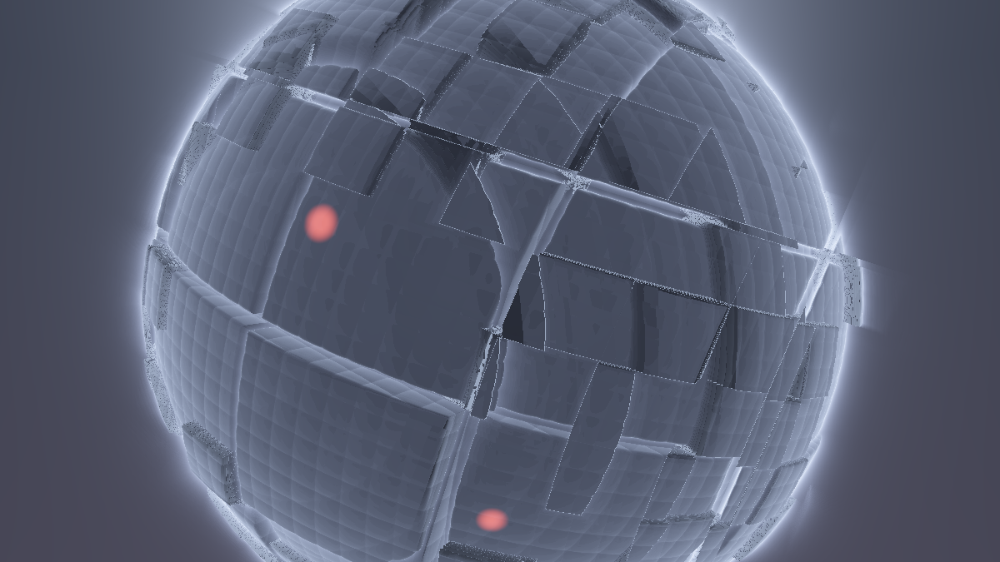

**Ergebnis:** Der vertraute Moloch – aber merklich nüchterner als am Ende des Juggernaut-Tutorials: kein Dunst, keine Strahlenkeulen hinter der Silhouette, keine Vignette, kein Dither. Eine gut beleuchtete Rohware. Genau so soll es sein – die fehlenden 20 % sind die Arbeitsliste dieses Tutorials.

### Was passiert hier

**Die Kondensier-Regeln sind das eigentliche Thema dieses Schritts.** Wer einen fertigen Shader in eine Post-Kette umbauen will, muss zuerst entscheiden, was *Szene* ist und was *Nachbearbeitung* – und die Trennlinie ist präziser, als sie aussieht:

- **Look-Träger** ist alles, was *Geometrie- oder Material-Wissen* braucht: `map`, Normalen, die zwei Licht-Setups, `fenster`, der volumetrische Glow (er entsteht *entlang des Strahls*, kennt also die 3D-Distanz – ein 2D-Blur über das fertige Bild weiß davon nichts mehr).
- **Politur** ist alles, was nur *Farben des fertigen Bildes* verrechnet: Tonemapping, Drift, Vignette, Dither. Sie kann – und soll – nach hinten.
- **Der interessante Grenzfall** ist der Dunst: Er braucht die Distanz `t` (also Szenen-Wissen), verrechnet aber nur Farben (also Post-Arbeit). Die Auflösung des Widerspruchs ist der ganze Schritt 3: Die Szene *exportiert* ihr Wissen als Tiefenkanal, und der Dunst zieht mit diesem Wissen ins Post um.

Zwei bewusste Rückbauten verdienen einen zweiten Blick: Die **Strahlenkeulen** (das `sin(wink · 27)` im Himmel) waren im Juggernaut-Tutorial die analytische Nachbildung eines Post-Effekts – das Original-Preset erzeugt seine Strahlen als 27 radiale Blur-Abgriffe *über das fertige Bild*, und der Single-Pass-Shader konnte das prinzipiell nicht (er kann sein eigenes Ergebnis nicht lesen). Wir können es **jetzt** – ab Schritt 2 ist das eigene Ergebnis eine lesbare Textur. Das Bloom wird die Korona weich aufblühen lassen; wer die diskreten Keulen zurückwill, findet sie als 🎨-Variante in Schritt 6. Und die **Not-Politur** am Ende ist ehrlich als solche markiert: Ohne Tonemapping wäre das lineare HDR-Bild (Fenster > 1, Korona ≫ 1) hart geclippt und viel zu dunkel in den Mitten – aber sie ist ein Platzhalter, kein Bestandteil der Szene. `szene()` selbst gibt rohe Werte zurück; diese Funktionsgrenze *ist* schon die künftige Pass-Grenze.

### 💡 Warum die Szene linear bleiben muss

Alle Stationen der Kette – Schwelle, Blur, additive Bloom-Mischung, Nebel – rechnen mit **Licht-Mengen**. Das funktioniert nur, solange die Werte proportional zu Licht sind, also *vor* Tonemapping und Gamma: Ein Bright-Pass auf einem getonemappten Bild findet keine „überstrahlenden" Werte mehr (das Tonemapping hat ja alles unter 1.0 gedrückt), und ein Blur über Gamma-Werte verfälscht die Energiebilanz (dunkle Säume um helle Punkte). **Die Regel: Die ganze Kette rechnet linear, und die allerletzte Station der Anrichte macht das Bild anschaubar.** Wer im Juggernaut-Tutorial das `1-exp`-Tonemapping als „wichtigste Politur-Zeile" kennengelernt hat: Sie bleibt es – sie rückt nur ganz ans Ende.

### 🎨 Experimentieren

- `STIMMUNG` einmal durchschalten (0.0 / 0.5 / 1.0) – die Blende funktioniert unverändert, nur eben „unpoliert"
- Die Not-Politur auskommentieren und das rohe lineare Bild ansehen: zu dunkel, harte weiße Kerne auf Fenstern und Korona – *so* sieht die Rohware wirklich aus, und genau diese Über-1-Kerne wird der Bright-Pass ernten
- `GODRAY = 0.0`: der Moloch ohne seinen Silhouetten-Kranz – als Vorher-Bild für den Moment, in dem das Bloom übernimmt

---

## Schritt 2 – Der Umzug: Buffer A, Image und der Common-Tab

**Neu:** Die Kerntechnik 1 – **Multipass-Architektur**. Die Szene zieht in **Buffer A** um, der **Image**-Pass wird ein reiner Anzeige-Pass, und die Stellschrauben samt geteilter Helfer ziehen in den **Common**-Tab, der jedem Pass automatisch vorangestellt wird. Optisch ändert sich *nichts* – und genau das ist der Test.

So wird auf shadertoy.com umgebaut (im Editor über dem Code-Feld):

1. **„+" → Common** anlegen: Dieser Tab hat kein eigenes `mainImage` – sein Inhalt wird an den Anfang **jedes** anderen Passes kopiert. Unser SSOT.
2. **„+" → Buffer A** anlegen: Hierhin kommt die komplette Szene.
3. Der **Image**-Tab bleibt (es gibt ihn immer): Er wird zur Anzeige. In seiner Kanal-Leiste **iChannel0 → Buffer A** wählen.

**Common** *(neu – Stellschrauben + geteilte Helfer)*

```glsl
// ============================================================================
// COMMON - wird jedem Pass vorangestellt. Das SSOT der Kueche:
// ALLE Stellschrauben und geteilten Helfer wohnen hier (Muster:
// Pimped-Kaleidoscope-Tutorial, Schritt 13).
// ============================================================================

// ---- STELLSCHRAUBEN --------------------------------------------------------
// Szene (Buffer A)
const float STIMMUNG  = 0.0;   // 0.0 = dark .. 1.0 = brighter
const float RADIUS    = 6.0;   // Radius des Molochs
const float ZELLE1    = 2.6;   // Kantenlaenge der grossen Platten
const float ZELLE2    = 0.9;   // Raster der Aufbauten + Positionslichter
const float ZELLE3    = 0.32;  // Raster der feinen Rillen
const float PLATTE    = 0.35;  // Hoehenspiel der grossen Platten
const float AUFBAU    = 0.22;  // Hoehe der mittleren Aufbauten
const float FUGE      = 0.07;  // halbe Breite der Panelfugen
const float SCHALE    = 0.30;  // Fugen-Schale unter dem Nennradius
const float RILLE     = 0.02;  // Tiefe der feinen Rillen
const float GLAETTE   = 0.05;  // Kanten-Weiche der smax-Fugen
const float DROSSEL   = 0.5;   // Marsch-Drossel
const float GODRAY    = 1.0;   // volumetrischer Glow der Szene
const float TEMPO     = 1.0;   // Orbit-Tempo
const float NAH       = 8.5;   // Orbit-Radius nah
const float FERN      = 15.0;  // Orbit-Radius fern
const float TIEFE_MAX = 40.0;  // Marsch-Limit ("unendlich weit weg")
// ----------------------------------------------------------------------------

#define R(a) mat2(cos(a), sin(a), -sin(a), cos(a))

float hash21(vec2 p) { return fract(sin(dot(p, vec2(127.1, 311.7))) * 43758.5453); }
float hash31(vec3 p) { return fract(sin(dot(p, vec3(127.1, 311.7, 74.7))) * 43758.5453); }

float lum(vec3 c) { return dot(c, vec3(0.299, 0.587, 0.114)); }

// zentrierte, hoehen-normierte Koordinaten -> 0..1-Texturkoordinaten
vec2 uvZuTex(vec2 uv)
{
    return uv * vec2(iResolution.y / iResolution.x, 1.0) + 0.5;
}
```

**Buffer A** *(die komplette Szene aus Schritt 1 – abzüglich dessen, was ins Common gezogen ist)*

```glsl
// BUFFER A - die Szene. Enthaelt woertlich die Schritt-1-Funktionen
// smin/smax, gSonne, gedreht, fugen, map, march, calcNormal, fenster,
// himmel, shade, kamera, szene - NUR die Stellschrauben, R(), hash21/hash31
// sind jetzt im Common. Neu ist allein dieses mainImage:

void mainImage(out vec4 fragColor, in vec2 fragCoord)
{
    vec2 uv = (fragCoord - 0.5 * iResolution.xy) / iResolution.y;

    fragColor = vec4(szene(uv), 1.0);   // LINEAR - keine Not-Politur mehr!
}
```

**Image** *(iChannel0 = Buffer A)*

```glsl
// IMAGE - die Anrichte. Vorerst: anzeigen + Not-Politur.

void mainImage(out vec4 fragColor, in vec2 fragCoord)
{
    vec2 uv = (fragCoord - 0.5 * iResolution.xy) / iResolution.y;

    vec3 col = texture(iChannel0, uvZuTex(uv)).rgb;

    // Not-Politur (aus Schritt 1 hierher umgezogen - waechst ab Schritt 11)
    col = 1.0 - exp(-col * 2.0);
    col = pow(col, vec3(1.0 / 2.2));

    fragColor = vec4(col, 1.0);
}
```

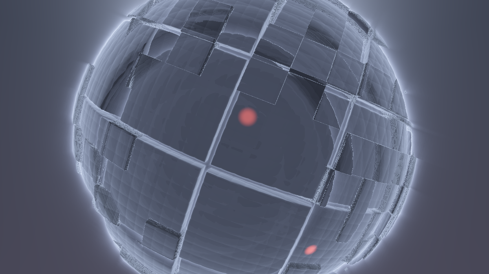

**Ergebnis:** Pixelgenau dasselbe Bild wie in Schritt 1. Ein Refactoring-Schritt – und der wichtigste Test dieses Tutorials: Wenn sich *irgendetwas* geändert hat, stimmt die Verdrahtung nicht (häufigster Fehler: iChannel0 im Image nicht auf Buffer A gesetzt → schwarzes Bild).

### Was passiert hier

**Der Datenfluss ist jetzt explizit.** Shadertoy rendert pro Frame erst Buffer A (unsere Szene, in eine Float-Textur), dann den Image-Pass (der diese Textur liest und anzeigt). Buffer A weiß nichts vom Image; das Image kennt die Szene nur noch als Bild. Diese Einbahnstraße ist der Kern jeder Post-Architektur – und der Grund, warum die **Tab-Reihenfolge zählt**: Ein früherer Pass, der einen späteren läse, bekäme dessen *Vorframe* (das nutzen wir in Schritt 10 gezielt aus; bis dahin ist es eine Falle, in die man nicht hineingeraten sollte).

**Der Common-Tab ist die wichtigste Organisations-Entscheidung.** Ohne ihn müsste jede Konstante, die zwei Pässe brauchen (später: `SCHWELLE` in Buffer B *und* die Bloom-Stärke im Image – oder `STIMMUNG` in Szene *und* Politur), in mehreren Tabs gepflegt werden – der klassische Divergenz-Bug: Man ändert die Zahl in einem Tab und wundert sich. Das Pimped-Kaleidoscope-Tutorial hat dieses Muster in Schritt 13 etabliert; wir übernehmen es von Anfang an, weil unsere Küche vier Pässe hat statt zwei. **Regel: Jede Konstante und jeder Helfer, den mehr als ein Pass braucht (oder brauchen könnte), wohnt im Common.** Die szenen-spezifischen Funktionen (`map`, `shade` …) bleiben dagegen in Buffer A – kein anderer Pass braucht sie, und der Common soll Kopf bleiben, nicht Müllhalde werden.

**Warum `uvZuTex` statt einfach `fragCoord / iResolution.xy`?** Für das reine Durchreichen wäre das Einfache identisch. Aber ab Schritt 7 rechnet das Image in zentrierten, höhen-normierten Koordinaten (DOF-Offsets, Faltungen – alles kreistreu in diesem Raum), und dann braucht jede Lesung die saubere Rückübersetzung in 0..1-Texturkoordinaten. Die Konvention von Anfang an zu benutzen erspart den Umbau – und `uvZuTex` ist wörtlich die Funktion aus dem Kaleidoscope-Common.

### 💡 Float-Buffer: warum das lineare HDR den Umzug überlebt

Shadertoy-Buffer sind **32-Bit-Float-Texturen** (RGBA). Unsere Szene schreibt Werte über 1.0 (Fenster ~1.4, Korona weit darüber) – in einer klassischen 8-Bit-Textur wären die nach dem Pass hart auf 1.0 geclippt und der Bright-Pass fände nur noch Einheitsbrei. Im Float-Buffer kommen sie unversehrt an. Dasselbe Privileg trägt gleich noch mehr: In Schritt 3 legen wir eine *Distanz in Welteinheiten* (bis 40.0) in den Alpha-Kanal – auch das übersteht nur ein Float-Format. **Die Kette funktioniert, weil zwischen den Stationen nichts verloren geht.**

### 🎨 Experimentieren

- Im Image testweise `col = texture(iChannel0, uvZuTex(uv * 0.5)).rgb;` → das Bild zoomt digital – der erste Beweis, dass die Szene jetzt eine *Textur* ist, mit der man machen kann, was man will
- Die Not-Politur wieder in Buffer A schieben und im Image weglassen → sieht gleich aus, ist aber falsch herum (ab Schritt 4 würde der Bright-Pass auf getonemappten Werten arbeiten – merken, wie leicht dieser Fehler passiert!)
- `iResolution` prüfen: beide Pässe laufen in voller Auflösung – Shadertoy kennt keine Halbbild-Buffer (das wird in Schritt 5 noch wichtig)

---

## Schritt 3 – Der Nebenkanal: Tiefe im Alpha

**Neu:** Die Kerntechnik 2 – **Nebenkanal-Daten**. Buffer A schreibt die Marsch-Distanz in seinen Alpha-Kanal: Die Szenen-Tiefe ist ein Gratis-Ausgang des Raymarchers. Dazu der **Küchen-Monitor**: eine `ANSICHT`-Stellschraube, die den Tiefenkanal als Graustufenbild zeigt – der Debug-Blick, der ab jetzt jede weitere Station begleitet.

**Common** *(Stellschrauben erweitert)*

```glsl
// Kuechen-Monitor
const int   ANSICHT   = 0;     // 0 = fertiges Bild, 1 = Tiefe (Debug)
```

**Buffer A** *(zwei Änderungen: `szene` liefert die Tiefe heraus, `mainImage` schreibt sie ins Alpha)*

```glsl
// GEAENDERT: szene() exportiert die Marsch-Distanz
vec3 szene(vec2 uv, out float tiefe)
{
    vec3 ro, rd;
    kamera(uv, ro, rd);

    float glow;
    float t = march(ro, rd, glow);

    vec3 col;
    if (t > 0.0) { col = shade(ro + rd * t, rd); tiefe = t; }
    else         { col = himmel(rd);             tiefe = TIEFE_MAX; }   // Himmel = "unendlich"

    vec3 strahlFarbe = mix(vec3(0.28, 0.34, 0.55), vec3(1.0, 0.75, 0.50), STIMMUNG);
    col += glow * 0.06 * GODRAY * strahlFarbe;

    return col;
}

// GEAENDERT: die Tiefe faehrt im Alpha-Kanal mit
void mainImage(out vec4 fragColor, in vec2 fragCoord)
{
    vec2 uv = (fragCoord - 0.5 * iResolution.xy) / iResolution.y;

    float tiefe;
    vec3 col = szene(uv, tiefe);

    fragColor = vec4(col, tiefe);
}
```

**Image** *(liest jetzt `vec4` und bekommt den Monitor)*

```glsl
void mainImage(out vec4 fragColor, in vec2 fragCoord)
{
    vec2 uv = (fragCoord - 0.5 * iResolution.xy) / iResolution.y;

    vec4 roh   = texture(iChannel0, uvZuTex(uv));
    vec3 col   = roh.rgb;
    float tiefe = roh.a;

    // Kuechen-Monitor: ANSICHT = 1 zeigt den Tiefenkanal
    if (ANSICHT == 1) { fragColor = vec4(vec3(tiefe / TIEFE_MAX), 1.0); return; }

    col = 1.0 - exp(-col * 2.0);
    col = pow(col, vec3(1.0 / 2.2));

    fragColor = vec4(col, 1.0);
}
```

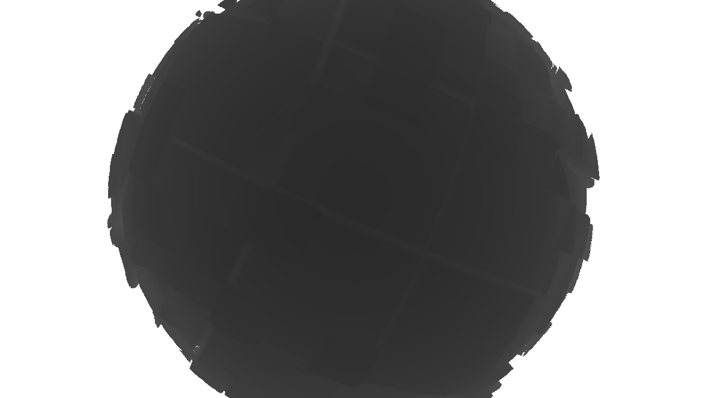

**Ergebnis:** Mit `ANSICHT = 0` unverändert. Mit `ANSICHT = 1`: der Moloch als **Tiefenrelief** – nahe Platten dunkelgrau, ferne Rundung heller, der Himmel weiß. Man sieht die Kamera pendeln (das ganze Relief atmet heller und dunkler) und die Panelfugen als feine Linien – die Tiefe ist ein vollwertiges zweites Bild der Szene.

### Was passiert hier

**Der Alpha-Kanal war die ganze Zeit da – und leer.** Jeder Pass schreibt `vec4`, und die Anzeige ignoriert das `a` des Image-Passes ohnehin. Zwischen Buffern aber wird der vierte Kanal **verlustfrei transportiert** (Float-Textur, Schritt 2). Wir zweckentfremden ihn als Datenleitung: `rgb` = Licht, `a` = Geometrie. Der Raymarcher *hat* die Distanz sowieso – `march` gibt sie zurück, der Single-Pass-Shader hat sie nach dem Dunst-Term weggeworfen. Jetzt ist sie ein Produkt.

**Der `TIEFE_MAX`-Vertrag** ist die kleine, wichtige Design-Entscheidung: Der Himmel bekommt nicht etwa −1 (den „kein Treffer"-Marker von `march`), sondern die Marsch-Grenze 40.0 – also „so weit weg wie messbar". Damit rechnen die Abnehmer stromabwärts einfach weiter (DOF: maximal unscharf; Nebel: maximal vernebelt – bzw. gezielt ausgenommen, Schritt 11), statt überall Sonderfälle für „Himmel" zu prüfen. Ein Sentinel-Wert *innerhalb* des gültigen Wertebereichs statt außerhalb – die Schule des `mix(-6, h, gap)`-Tricks aus dem Crystal-Lights-Tutorial (dort Schritt 8): kein zweiter Codepfad, das Loch ist einfach sehr tiefes Terrain.

**Der Küchen-Monitor** ist mehr als Bequemlichkeit. In einer Kette mit vier Stationen ist die häufigste Frage nicht „stimmt die Formel?", sondern „**welche Station** liefert Murks?" – und die Antwort bekommt man nur, wenn man jede Zwischenleitung einzeln ansehen kann. `ANSICHT` wächst darum mit: Schritt 4 hängt die Bloom-Leitung dran. (Dasselbe Prinzip wie das Schachbrett im Crystal-Lights-Schritt 2 und die „Brille abnehmen"-Übung des Kaleidoskops: erst das Rohsignal prüfen, dann den Effekt beurteilen.)

### 💡 Eine ehrliche Fußnote: gefilterte Tiefe

`texture()` liest **bilinear gefiltert** – auch den Alpha-Kanal. An der Silhouette des Molochs mischt der Filter also Vordergrund-Tiefe (~9) und Himmels-Tiefe (40) zu Zwischenwerten, die *keiner realen Oberfläche entsprechen*. Für den Nebel und das DOF ist das meist unsichtbar (ein Pixel Saum), aber es ist der Grund für die Kanten-Artefakte, die wir in Schritt 7 ehrlich benennen werden. Wer es exakt braucht: `texelFetch(iChannel0, ivec2(fragCoord), 0)` liest ungefiltert – als 🎨-Upgrade dort, wo es zählt.

### 🎨 Experimentieren

- `ANSICHT = 1` und `STIMMUNG` wechseln → das Tiefenbild ist **identisch**: Die Beleuchtung hat auf die Geometrie-Leitung keinerlei Einfluss – Kanaltrennung, wie sie sein soll
- Statt der Tiefe testweise `fenster(gedreht(p))` in den Alpha exportieren (in `szene` durchreichen) → eine „Lichter-Maske" als Nebenkanal; genau so würde man dem Post gezielt einzelne Bildelemente melden (Emissions-Maske statt Helligkeits-Schwelle – die Edel-Variante des Bright-Pass)
- `vec3(tiefe / TIEFE_MAX)` → `vec3(fract(tiefe))` im Monitor: Konturlinien im Meter-Abstand – ein Topografie-Blick auf den Moloch

---

## Schritt 4 – Bright-Pass: die Schwelle

**Neu:** Das Herzstück beginnt – die erste Station der Bloom-Kette. **Buffer B** liest die Szene und behält nur, was **überstrahlt**: alles über einer Helligkeits-Schwelle, mit weichem Knie. Das Image bekommt die Bloom-Leitung auf iChannel1 und der Monitor eine zweite Ansicht.

*Ab jetzt zeigen die Schritte nur noch die geänderten bzw. neuen Blöcke – unveränderte Tabs sind als solche markiert. (In Schritt 13 steht der komplette Stand noch einmal Tab für Tab.)*

**Neuer Tab: Buffer B** *(anlegen: „+" → Buffer B; Kanal-Leiste: iChannel0 = Buffer A)*

```glsl
// BUFFER B (v1) - der Bright-Pass: nur das Ueberstrahlende bleibt.
// iChannel0 = Buffer A

void mainImage(out vec4 fragColor, in vec2 fragCoord)
{
    vec2 st = fragCoord / iResolution.xy;

    vec3 c = texture(iChannel0, st).rgb;

    // Schwelle mit weichem Knie: unterhalb SCHWELLE -> 0,
    // ab SCHWELLE + KNIE -> volle Farbe, dazwischen weicher Anstieg
    float faktor = smoothstep(SCHWELLE, SCHWELLE + KNIE, lum(c));

    fragColor = vec4(c * faktor, 1.0);
}
```

**Common** *(Stellschrauben erweitert)*

```glsl
// Bloom (Buffer B + C)
const float SCHWELLE  = 0.7;   // Bright-Pass: ab dieser Leuchtdichte "ueberstrahlt"
const float KNIE      = 0.5;   // weicher Uebergang oberhalb der Schwelle
```

**Image** *(iChannel1 = Buffer B setzen; Monitor erweitert)*

```glsl
// NEU in mainImage, nach dem Lesen von roh:
    vec3 bloomLeitung = texture(iChannel1, uvZuTex(uv)).rgb;

    if (ANSICHT == 1) { fragColor = vec4(vec3(tiefe / TIEFE_MAX), 1.0); return; }
    if (ANSICHT == 2) { fragColor = vec4(bloomLeitung, 1.0); return; }
```

Und im Common: `ANSICHT`-Kommentar auf `// 0 = fertig, 1 = Tiefe, 2 = Bloom-Leitung` erweitern.

**Buffer A: unverändert.**

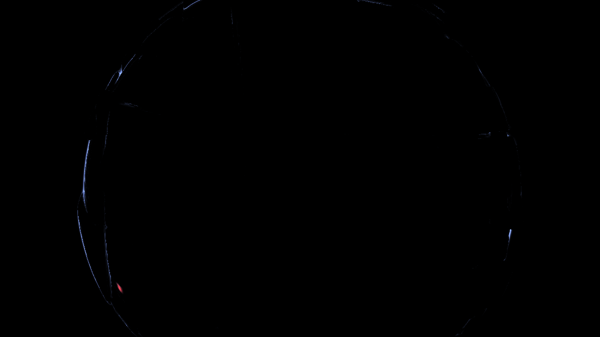

**Ergebnis:** Mit `ANSICHT = 2`: fast schwarzes Bild, auf dem nur die **Lichtquellen** stehen – die blinkenden Positionslichter, die Sonnen-Korona, die hellsten Rim-Säume und Glow-Spitzen. Genau die Teile des Bildes, die später glühen sollen. Mit `ANSICHT = 0` ist noch alles beim Alten – die Leitung ist gelegt, aber noch nicht angeschlossen.

### Was passiert hier

**Die Schwelle ist eine Frage an das lineare Bild: „Was ist hier Lichtquelle?"** In unserem HDR-Rohmaterial ist die Antwort messbar: Beleuchtete Flächen liegen (je nach Stimmung) um 0.1–0.6, die Fenster bei ~1.4, die Korona weit über 1. `SCHWELLE = 0.7` trennt also sauber „reflektiert Licht" von „sendet Licht" – **und das funktioniert nur, weil kein Tonemapping dazwischenkam** (die Warnung aus Schritt 2 in Aktion: nach `1-exp` läge alles unter 1.0 und die Schwelle würde blind).

Zwei Details der Formel:

1. **`lum()` statt Kanal-Maximum:** Die Schwelle wird auf der wahrnehmungsgewichteten Helligkeit entschieden, aber der *Faktor* multipliziert die volle Farbe – ein rotes Positionslicht bleibt im Bloom rot, wird nicht zu weißem Brei. (Erst schwellen, dann färben wäre die falsche Reihenfolge.)
2. **Das Knie (`smoothstep` statt `step`):** Eine harte Schwelle flackert – ein Pixel, dessen Helligkeit um die Schwelle „sägt" (blinkende Fenster!), springt binär in die Bloom-Leitung und wieder heraus. Das Knie macht aus dem Schalter eine Rampe; dieselbe Anti-Flacker-Medizin wie beim Beat-Gate im Crystal-Lights-Anhang A.

**Warum eine eigene Station dafür?** Man könnte die Schwelle in den Blur-Pass einbauen (und wird es in Schritt 5 aus Kostengründen genau so tun – als Funktion je Tap). Aber *didaktisch* zuerst die nackte Schwelle zu sehen ist Gold wert: `ANSICHT = 2` zeigt jetzt exakt, **was** gleich verschmiert wird. Ist hier zu viel drin (ganze Flächen statt Lichter), wird das Bloom später matschig – und man reguliert es *hier*, an der Schwelle, nicht hinten an der Intensität. Erste Station, erste Kostprobe: In einer Kette schmeckt man jede Zutat einzeln ab.

### 🎨 Experimentieren

- `SCHWELLE = 0.3` → auch beleuchtete Platten rutschen in die Leitung (später: Weichzeichner-Look statt Glow); `1.2` → nur noch Fenster-Kerne und Korona (später: harte, edle Glints)
- `KNIE = 0.05` → fast harte Schwelle: bei blinkenden Fenstern sieht man in `ANSICHT = 2` das Flackern der Kante – der beste Beweis für das Knie
- `STIMMUNG = 1.0` mit `ANSICHT = 2`: im brighter-Setup reißt die Schwelle mehr Flächen mit (helleres Grundniveau) – Vorgeschmack auf Schritt 12, wo die Schwelle an die Stimmung gekoppelt wird

---

## Schritt 5 – Separierbarer Blur I: horizontal

**Neu:** Buffer B wächst zum **Bright-Pass + horizontalem Gauß-Blur** – die erste Hälfte des separierbaren Filters. Dazu die Kostenrechnung, die diese Architektur begründet, und die saubere Behandlung der Auflösungsabhängigkeit.

**Buffer B** *(komplett ersetzt)*

```glsl
// BUFFER B (v2) - Bright-Pass + horizontaler Gauss.
// iChannel0 = Buffer A

// die Schwelle aus Schritt 4, jetzt als Funktion je Abgriff
vec3 hell(vec2 uv)
{
    vec3 c = texture(iChannel0, uvZuTex(uv)).rgb;
    return c * smoothstep(SCHWELLE, SCHWELLE + KNIE, lum(c));
}

void mainImage(out vec4 fragColor, in vec2 fragCoord)
{
    vec2 uv = (fragCoord - 0.5 * iResolution.xy) / iResolution.y;

    vec3 acc = vec3(0.0);
    float wsum = 0.0;

    for (int i = -RAD; i <= RAD; i++) {
        float w = exp(-float(i * i) / (2.0 * SIGMA * SIGMA));   // Gauss-Gewicht
        acc  += hell(uv + vec2(float(i), 0.0) * STREU * 0.001) * w;
        wsum += w;
    }

    fragColor = vec4(acc / wsum, 1.0);
}
```

**Common** *(Stellschrauben erweitert)*

```glsl
const int   RAD       = 6;     // Blur-Taps je Seite (Kernel = 2*RAD+1 = 13)
const float SIGMA     = 3.0;   // Gauss-Breite in Tap-Einheiten
const float STREU     = 2.5;   // Tap-Abstand in PROMILLE der Bildhoehe
```

**Buffer A, Image: unverändert.**

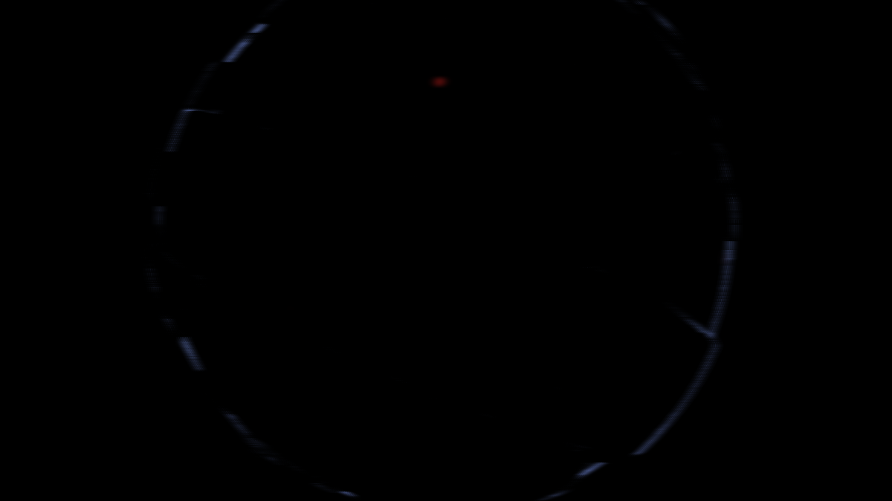

**Ergebnis:** Mit `ANSICHT = 2`: Die Lichtpunkte sind zu **horizontalen Leuchtstrichen** verschmiert – jedes Fenster ein kleiner Querbalken, die Korona ein breiter Streifen. Sieht kaputt aus? Ist es nicht – es ist ein **halber** Blur, und die fehlende Hälfte ist der ganze nächste Schritt.

### Was passiert hier – die Kostenrechnung

**Warum zwei Pässe für einen Blur?** Ein runder Weichzeichner mit Radius `RAD = 6` braucht als 2D-Kernel `(2·6+1)² = 169` Textur-Abgriffe **pro Pixel**. Der Gauß hat aber eine mathematische Sonderbegabung – er ist **separierbar**:

```
exp(-(x² + y²) / 2σ²)  =  exp(-x² / 2σ²) · exp(-y² / 2σ²)
```

Der 2D-Kernel ist exakt das Produkt zweier 1D-Kernel. Also darf man erst horizontal filtern (13 Abgriffe), das Ergebnis in eine Textur schreiben, und *dieses* dann vertikal filtern (nochmal 13): `13 + 13 = 26` statt `169` – **Faktor 6.5**, und er wächst quadratisch mit dem Radius (bei `RAD = 12`: 50 statt 625, Faktor 12.5). Der Preis ist genau eine Zwischentextur – und die ist in einer Multipass-Architektur gratis. **Das ist der Grund, warum jede ernsthafte Bloom-Implementierung – Milkdrops Blur-Kette eingeschlossen – als Pass-Paar gebaut ist.** Wichtig fürs Verständnis: Der Zwischenstand nach dem H-Pass ist *kein* „schlechter Blur", sondern ein mathematisch exakter Halbschritt; erst das Produkt beider Pässe ergibt den runden Kernel.

**Die Gewichte** werden im Loop berechnet und über `wsum` normiert – so bleibt die Energiebilanz bei jedem `RAD`/`SIGMA`-Paar exakt (die Summe der Gewichte teilt sich selbst heraus), und niemand muss Zahlenkolonnen pflegen. `SIGMA = RAD/2` ist die bewährte Faustregel: Das Randgewicht fällt auf `exp(-2) ≈ 0.13` – der Kernel nutzt seine Breite aus, ohne hart abgeschnitten zu wirken.

**Die Auflösungsfrage** steckt in `STREU * 0.001`: Die Tap-Abstände sind in unseren höhen-normierten UV-Einheiten angegeben – **Promille der Bildhöhe**, nicht Texel. Damit ist der Blur-Radius ein fester Anteil des *Bildes* (bei `RAD·STREU = 15 ‰` rund 1.5 % der Bildhöhe), egal ob das Vorschaufenster 360 Pixel hoch ist oder der Vollbildmodus 2160. Hätten wir stattdessen „1 Texel pro Tap" genommen (`1/iResolution.y`), wäre das Bloom in 4K viermal schmaler als im Editor-Fenster – der klassische „auf meinem Rechner sah das breiter aus"-Bug.

### 💡 Die ehrliche Fußnote: Tap-Lücken

Promille-Abstände heißen aber auch: In hohen Auflösungen liegen zwischen zwei Taps **mehrere Pixel** (2.5 ‰ bei 2160p ≈ 5 px). Ein einzelner heller Pixel kann dann *zwischen* die Taps fallen und flackern, und sehr harte Kanten können feine Streifen zeigen. Die großen Engines lösen das mit **Halbbildern**: Bloom wird auf halber/viertel Auflösung gerechnet (dort ist 1 Texel automatisch breit), was nebenbei nochmal Faktor 4–16 Rechenzeit spart. Shadertoy-Buffer sind stur **Vollbild** – unser Promille-Abstand *simuliert* das Halbbild (größere Schrittweite statt kleinerer Textur), erbt aber dessen Ersparnis nicht und das Lücken-Risiko obendrein. In dieser Szene ist das gutmütig (die Lichter sind mehrere Pixel groß, und Schritt 10 glättet Rest-Flimmern) – aber es ist eine *Grenze der Plattform*, keine der Technik. In LumiViz wäre die saubere Antwort ein eigener Node mit echter reduzierter Auflösung (Anhang B).

### 🎨 Experimentieren

- `STREU = 6.0` → breite, weiche Schlieren; in `ANSICHT = 2` nach Tap-Streifen an den Fenstern suchen (Lücken-Fußnote live)
- `RAD = 10, SIGMA = 5.0` → teurer, aber cremiger Kernel; `RAD = 3, SIGMA = 1.5` → billig und knackig
- `SIGMA = 30.0` (viel größer als `RAD`) → die Gewichte werden fast gleich: aus dem Gauß wird ein **Box-Blur** – man sieht den Qualitätsunterschied (kantige „Balken"-Enden) sofort
- Die Schwelle testweise auf `0.0` → Buffer B blurrt das *ganze* Bild: die Vorschau auf `GetBlur1` als Allzweck-Werkzeug (so eine Leitung will man manchmal zusätzlich – siehe Schritt 6, 💡)

---

## Schritt 6 – Separierbarer Blur II: vertikal – das Bloom steht

**Neu:** **Buffer C** vollendet den Gauß in der Vertikalen, und das Image mischt das fertige Bloom **additiv** in das lineare Bild. Das Herzstück schließt sich – und wir vergleichen es mit dem Vorbild `GetBlur1/2/3`.

**Neuer Tab: Buffer C** *(anlegen; Kanal-Leiste: iChannel0 = **Buffer B**)*

```glsl
// BUFFER C - vertikaler Gauss ueber Buffer B: das fertige Bloom.
// iChannel0 = Buffer B

void mainImage(out vec4 fragColor, in vec2 fragCoord)
{
    vec2 uv = (fragCoord - 0.5 * iResolution.xy) / iResolution.y;

    vec3 acc = vec3(0.0);
    float wsum = 0.0;

    for (int i = -RAD; i <= RAD; i++) {
        float w = exp(-float(i * i) / (2.0 * SIGMA * SIGMA));
        acc  += texture(iChannel0, uvZuTex(uv + vec2(0.0, float(i)) * STREU * 0.001)).rgb * w;
        wsum += w;
    }

    fragColor = vec4(acc / wsum, 1.0);
}
```

**Image** *(Kanal-Leiste umstecken: iChannel1 = **Buffer C** – die Bloom-Leitung zeigt jetzt ans Ende der Kette. Dann die Mischung:)*

```glsl
// GEAENDERT in mainImage: die Bloom-Leitung wird angeschlossen -
// ADDITIV und LINEAR, VOR der (Not-)Politur
    vec3 bloom = texture(iChannel1, uvZuTex(uv)).rgb;
    vec3 col   = roh.rgb + bloom * BLOOM_STAERKE;

    if (ANSICHT == 1) { fragColor = vec4(vec3(tiefe / TIEFE_MAX), 1.0); return; }
    if (ANSICHT == 2) { fragColor = vec4(bloom, 1.0); return; }

    col = 1.0 - exp(-col * 2.0);
    col = pow(col, vec3(1.0 / 2.2));
```

**Common** *(Stellschraube ergänzt)*

```glsl
const float BLOOM_STAERKE = 0.7; // Anteil des Blooms im Endbild
```

**Buffer A, Buffer B: unverändert.**

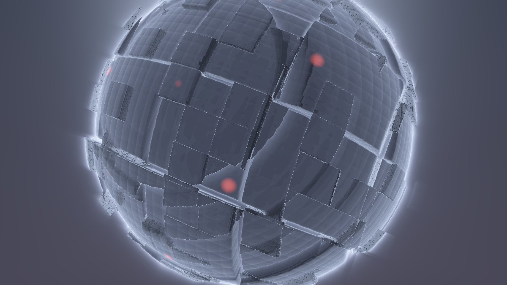

**Ergebnis:** Der Moment, für den die Kette gebaut wurde: Die Positionslichter **glühen** – jedes rote Blinken wirft einen weichen Hof auf die umliegenden Panels; die Sonnen-Korona blüht hinter der Silhouette auf und leckt über deren Rand (da ist er wieder, der Shine des Vorbild-Presets – diesmal echt); die hellsten Rim-Kanten schimmern. Und weil alles **vor** dem Tonemapping addiert wird, clippt nichts: Die Höfe glühen aus, statt weiß zuzulaufen.

### Was passiert hier

**Additiv, linear, vor dem Tonemapping – jede dieser drei Eigenschaften trägt:**

- **Additiv**, weil Bloom physikalisch *Streulicht* ist – Licht, das in Auge oder Linse verschmiert wird, kommt zum direkten Bild **dazu**, ersetzt es nicht. (Ein `mix` würde die scharfe Szene unter dem Bloom ausbleichen – der klassische „Weichzeichner statt Glow"-Fehler.)
- **Linear**, weil nur so die Energieverhältnisse stimmen: Ein doppelt so helles Fenster erzeugt einen doppelt so hellen Hof.
- **Vor dem Tonemapping**, weil die `1-exp`-Kurve dann Szene *und* Bloom gemeinsam sättigt – Kern und Hof gehen ineinander über, statt dass ein fertig getonemapptes Bild einen aufgesetzten Glanz bekommt. Die wichtigste Politur-Zeile der Serie (frosty caves → Crystal Lights → Juggernaut) zeigt hier, warum sie ans **Ende der Kette** gehört: Sie ist der Deckel auf dem ganzen Topf.

`BLOOM_STAERKE` ist bewusst die *letzte* Stellschraube der Kette: Schwelle (was glüht), Streu/Rad (wie breit), Stärke (wie viel) – drei orthogonale Regler, drei Stationen. Wer am Ende „mehr Glow" will, muss jetzt nie wieder die Szene anfassen.

### 💡 GetBlur1/2/3 – der Vergleich mit dem Vorbild

Milkdrop stellt jedem Preset drei weichgezeichnete Kopien des Bildes bereit: `GetBlur1` (fein) bis `GetBlur3` (sehr breit), **kaskadiert** gerechnet – Blur2 ist ein Blur von Blur1, Blur3 einer von Blur2, intern auf verkleinerten Zwischenbildern. Das ist Infrastruktur: immer da, nie konfigurierbar. Unsere Kette ist das Gegenteil – *ein* Blur, aber mit eigener Schwelle, eigenem Radius, eigener Mischlogik. Die Kaskaden-Idee lohnt trotzdem als Erweiterung, denn ein einstufiges Bloom hat genau einen Radius, echtes Glühen aber viele Skalen (enger Kern + weiter Schleier):

**Mehrstufiges Bloom als Variante** – „weiter Blur auf dem Halbbild", simuliert über die Schrittweite: In Buffer B *und* C je eine **zweite Schleife** mit `STREU * 3.0` laufen lassen und beide Ergebnisse gewichtet summieren (`0.65 * eng + 0.35 * weit`). Zwei Ehrlichkeiten dazu: Erstens erbt die weite Stufe das Lücken-Risiko aus Schritt 5 verdreifacht (sie *ist* die Halbbild-Simulation samt Kosten). Zweitens entstehen beim Separieren der Summe **Kreuzterme** (eng-horizontal × weit-vertikal und umgekehrt) – mathematisch kein Gauß-Paar mehr, sichtbar als leichte Kreuz-Ausläufer an sehr hellen Punkten. Viele finden genau das schön (es erinnert an anamorphotische Flares); wer es sauber will, braucht pro Stufe ein eigenes Pass-Paar – Buffer D ist noch frei, und „Blur auf Blur darf grob sein" (Milkdrops eigene Kaskaden-Weisheit) macht daraus ein dankbares Eigenprojekt. Für den Endstand dieses Tutorials bleiben wir einstufig – die Kette soll lesbar bleiben.

### 🎨 Experimentieren

- `BLOOM_STAERKE = 2.0` in der dark-Stimmung → der Moloch „brennt"; mit `GODRAY = 0.0` dazu sieht man, wie viel vom alten God-Ray-Gefühl das Bloom allein stemmt (und was fehlt: die Parallaxe des volumetrischen Kranzes – die zwei Techniken ergänzen sich, sie ersetzen sich nicht)
- Die 27-Keulen-Hommage zurückholen: in der Bloom-Mischung `bloom * (0.75 + 0.25 * sin(atan(uv.y, uv.x - 0.0) * 27.0))` → das Bloom selbst wird radial gekeult – der Shine-Loop als Post-Effekt, wie im Original
- Mehrstufig (siehe 💡) mit `0.5 * eng + 0.5 * weit` und `BLOOM_STAERKE = 1.2` → Nebelschleier-Look
- Farbiges Bloom: `bloom * vec3(0.9, 1.0, 1.2) * BLOOM_STAERKE` → kalter Schleier über warmem Licht (oder umgekehrt) – die billigste „Filmlook"-Stellschraube der Kette

---

## Schritt 7 – Depth of Field: die Tiefe wird Blende

**Neu:** Der Nebenkanal aus Schritt 3 zahlt aus: **Tiefenschärfe** im Image-Pass – die Blur-Stärke jedes Pixels hängt an seinem Abstand zur Fokus-Ebene, und die Fokus-Distanz **pendelt** auf einer Sinus-Uhr durch die Szene. Ehrlich etikettiert: Das ist „**Gather-DOF light**", mit benennbaren Artefakten an Kanten.

**Common** *(Stellschrauben + der feste Tap-Satz)*

```glsl
// Depth of Field (Image)
const float FOKUS     = 6.0;   // Fokus-Distanz in Welteinheiten
const float FOKUS_HUB = 3.0;   // Pendel-Amplitude der Fokus-Uhr (0.0 = statisch)
const float BLENDE    = 0.012; // Blendenweite: maximaler Zerstreuungskreis (uv-Einheiten)
const float COC_MAX   = 0.015; // Sicherheitsdeckel des Zerstreuungskreises

// fester Abtast-Satz fuer das Gather-DOF: 1 Zentrum + 8 auf dem Ring
const int  DOF_TAPS = 9;
const vec2 TAP[DOF_TAPS] = vec2[DOF_TAPS](
    vec2( 0.000,  0.000),
    vec2( 1.000,  0.000), vec2( 0.707,  0.707), vec2( 0.000,  1.000),
    vec2(-0.707,  0.707), vec2(-1.000,  0.000), vec2(-0.707, -0.707),
    vec2( 0.000, -1.000), vec2( 0.707, -0.707)
);
```

**Image** *(die Szenen-Lesung wird zur DOF-Abtastung)*

```glsl
// GEAENDERT: mainImage - der Anfang bis zur Bloom-Mischung
void mainImage(out vec4 fragColor, in vec2 fragCoord)
{
    vec2 uv = (fragCoord - 0.5 * iResolution.xy) / iResolution.y;

    // (1) Tiefe dieses Pixels + pendelnder Fokus (sin-Uhr: Position, nie Tempo!)
    float tiefe = texture(iChannel0, uvZuTex(uv)).a;
    float fokus = FOKUS + FOKUS_HUB * sin(iTime * 0.11);

    // (2) Zerstreuungskreis: 0 auf der Fokus-Ebene, waechst mit dem Abstand
    float coc = min(BLENDE * abs(tiefe - fokus) / max(tiefe, 1.0), COC_MAX);

    // (3) Gather: die Szene mit tiefenabhaengigem Radius abtasten
    vec3 szeneCol = vec3(0.0);
    for (int i = 0; i < DOF_TAPS; i++)
        szeneCol += texture(iChannel0, uvZuTex(uv + TAP[i] * coc)).rgb;
    szeneCol /= float(DOF_TAPS);

    // (4) Bloom addieren (wie gehabt, nur auf die DOF-Szene)
    vec3 bloom = texture(iChannel1, uvZuTex(uv)).rgb;
    vec3 col   = szeneCol + bloom * BLOOM_STAERKE;

    // ... Monitor + Not-Politur unveraendert ...
```

**Buffer A, B, C: unverändert.**

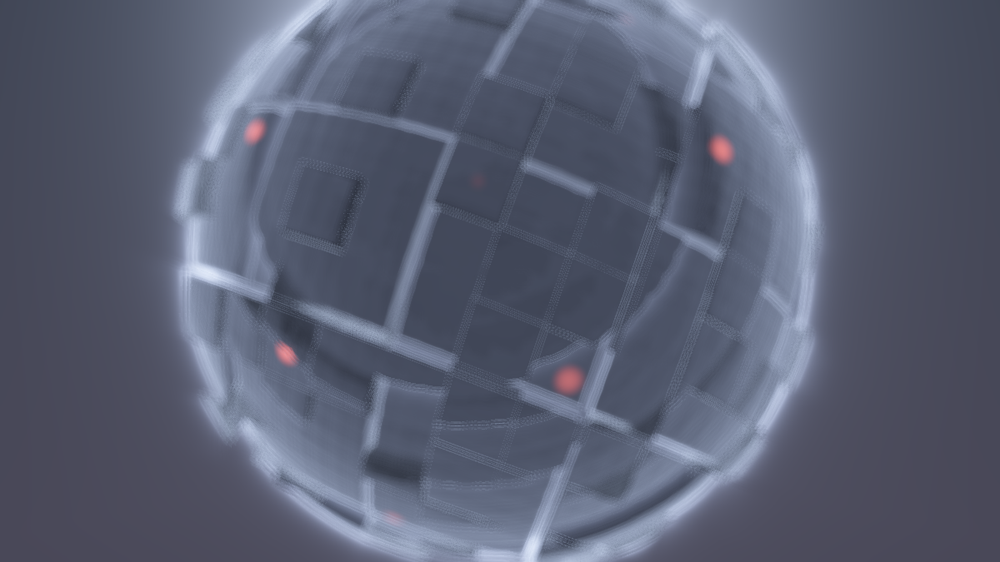

**Ergebnis:** Die Szene bekommt eine **fotografische Ebene**: Wo die Fokus-Distanz gerade liegt, sind die Panels knackscharf, davor und dahinter verschwimmen sie weich – und weil `fokus` pendelt, wandert die Schärfe-Ebene in Zeitlupe durch den Moloch: mal die nahen Platten scharf und die ferne Rundung im Nebelschleier, mal umgekehrt. Zusammen mit dem Bloom wirkt das Bild ab jetzt „gefilmt" statt „berechnet".

### Was passiert hier

**Der Zerstreuungskreis (Circle of Confusion, `coc`)** ist Foto-Optik in einer Zeile: Ein Punkt, der nicht auf der Fokus-Ebene liegt, wird von einer Linse nicht als Punkt, sondern als Scheibchen abgebildet – umso größer, je weiter er von der Ebene entfernt ist und je offener die Blende. `abs(tiefe - fokus)` ist der Abstand, `BLENDE` die Öffnung; das `/ max(tiefe, 1.0)` staucht den Effekt für ferne Objekte (in echten Linsen wächst der Kreis hinter dem Fokus langsamer als davor – unsere Näherung reicht dafür). `COC_MAX` deckelt das Ganze: Der Himmel (Tiefe 40) darf unscharf sein, aber nicht das halbe Bild verschmieren.

**Das Gather-Prinzip** – und sein eingebauter Kompromiss: Wir stehen am *Ziel*-Pixel und sammeln Farbe aus der Umgebung („gather"). Physikalisch richtig wäre das Umgekehrte: Jeder unscharfe *Quell*-Punkt verteilt seine Farbe als Scheibchen („scatter") – aber das kann ein Fragment-Shader nicht (er schreibt genau ein Pixel). Gather ist die Standard-Echtzeit-Näherung, und ihr Preis hat einen Namen:

**Die ehrlichen Artefakte – alle drei an der Silhouette zu Hause:**

1. **Hintergrund-Bluten:** Ein scharfes Vordergrund-Pixel direkt neben der Silhouette sammelt mit – sein eigener `coc` ist klein, gut. Aber ein *unscharfes Himmels-Pixel* daneben sammelt mit großem Radius und erwischt dabei die scharfe Moloch-Kante: Der Rand „blutet" in den unscharfen Himmel. Echte Optik würde umgekehrt den *Vordergrund* über den Hintergrund bluten lassen.
2. **Die gefilterte Tiefe** (Fußnote aus Schritt 3): Am Silhouetten-Saum liefert der bilineare Filter Zwischen-Tiefen → ein ein bis zwei Pixel breiter Saum mit „falschem" `coc`. Meist unsichtbar, bei ruhender Kamera vor hellem Himmel findbar.
3. **Ring-Bokeh:** Neun Taps auf einem Ring sind bei großem `coc` als Ring erkennbar (statt als gefüllte Scheibe). Gegenmittel im 🎨-Kasten.

Warum wir sie akzeptieren: Der Aufwand ist *ein* Textur-Loop mit konstanten Grenzen, und in einer bewegten, dunstigen Szene fallen die Säume unter die Wahrnehmungsschwelle. „DOF light" eben – das Etikett gehört zur Redlichkeit dazu. (Die sauberen Verfahren – tiefensortiertes Scatter, Vordergrund-Dilatation – sind Compute-Shader-Material und ein anderes Tutorial.)

**Die Fokus-Uhr** ist die spinAngle-Lektion der Serie in ihrer reinsten Form: `FOKUS + HUB * sin(iTime * 0.11)` ist eine **Position**, keine Geschwindigkeit – der Fokus wird an den Umkehrpunkten von selbst langsam, verweilt einen Atemzug auf der nahen bzw. fernen Ebene und wandert zurück. Deterministisch, zustandslos, unkaputtbar.

### 🎨 Experimentieren

- `FOKUS_HUB = 0.0`, dann `FOKUS` von Hand durchfahren (5 / 9 / 14) → das „Focus Pulling" des Kameramanns als Stellschraube
- `BLENDE = 0.03, COC_MAX = 0.03` → Miniatur-Effekt („Tilt-Shift"): der Moloch wirkt plötzlich wie ein Modell auf dem Basteltisch – und das Ring-Bokeh (Artefakt 3) wird gut sichtbar
- Gegen das Ring-Bokeh: den Tap-Satz um einen inneren Ring erweitern (`vec2(0.4, 0.15)`-Skala, `DOF_TAPS = 13`) → gefülltere Scheibe, 4 Taps teurer
- Fokus auf den Beat legen wollen? Noch nicht – das ist Anhang A, Mapping 2 (und dort steht auch, warum es ein *Kick* sein muss und kein Dauer-Mapping)

---

## Schritt 8 – Kaleidoskop als Post I: das Finish

**Neu:** Die Kerntechnik 3 – die Faltungen aus dem Kaleidoscope-Tutorial als **optionale Lese-Transformation** über die fertige 3D-Szene. Eine Stellschraube `FINISH` wählt: `0` = aus, `1` = Sektor-Faltung, `2` = Spiegel-Kachel. Die Szene weiß davon nichts – das Kaleidoskop ist eine Brille.

**Common** *(Stellschrauben + die Faltungen – sie ziehen ins Common, weil Schritt 9 sie auch in Buffer B brauchen wird)*

```glsl
// Kaleidoskop-Finish (Image; ab Schritt 9 optional Buffer B)
const int   FINISH    = 1;     // 0 = aus, 1 = Sektor-Faltung, 2 = Spiegel-Kachel
const float SEKTOREN  = 6.0;   // Spiegel-Sektoren (FINISH 1)
const float KACHEL    = 1.2;   // Kacheln pro Bildhoehe (FINISH 2)

// Winkel-Faltung: alle Richtungen in EINEN Sektor spiegeln
// (Herleitung: Pimped-Kaleidoscope-Tutorial, Schritt 8)
vec2 falteWinkel(vec2 uv, float n)
{
    float sektor = 6.28318 / n;
    float ang = atan(uv.y, uv.x);
    ang = mod(ang, sektor);
    ang = abs(ang - 0.5 * sektor);
    return length(uv) * vec2(cos(ang), sin(ang));
}

// Spiegel-Kachel: die Ebene als Teppich gespiegelter Kopien einer Zelle
// (Herleitung: Pimped-Kaleidoscope-Tutorial, Schritt 9)
vec2 falteKachel(vec2 uv, float dichte)
{
    return abs(fract(uv * dichte) - 0.5) / dichte;
}

// die Finish-Weiche
vec2 faltUV(vec2 uv)
{
    if (FINISH == 1) return falteWinkel(uv, SEKTOREN);
    if (FINISH == 2) return falteKachel(uv, KACHEL);
    return uv;
}
```

**Image** *(eine neue Zeile am Anfang – und `k` ersetzt `uv` bei **allen** Szenen-/Tiefen-/Bloom-Lesungen)*

```glsl
void mainImage(out vec4 fragColor, in vec2 fragCoord)
{
    vec2 uv = (fragCoord - 0.5 * iResolution.xy) / iResolution.y;

    // NEU: das Finish - alle LESUNGEN laufen ueber die gefaltete Koordinate
    vec2 k = faltUV(uv);

    float tiefe = texture(iChannel0, uvZuTex(k)).a;
    float fokus = FOKUS + FOKUS_HUB * sin(iTime * 0.11);
    float coc = min(BLENDE * abs(tiefe - fokus) / max(tiefe, 1.0), COC_MAX);

    vec3 szeneCol = vec3(0.0);
    for (int i = 0; i < DOF_TAPS; i++)
        szeneCol += texture(iChannel0, uvZuTex(k + TAP[i] * coc)).rgb;
    szeneCol /= float(DOF_TAPS);

    vec3 bloom = texture(iChannel1, uvZuTex(k)).rgb;
    vec3 col   = szeneCol + bloom * BLOOM_STAERKE;

    // ... Monitor + Not-Politur unveraendert (Vignette spaeter auf uv, nicht k!) ...
```

**Buffer A, B, C: unverändert.**

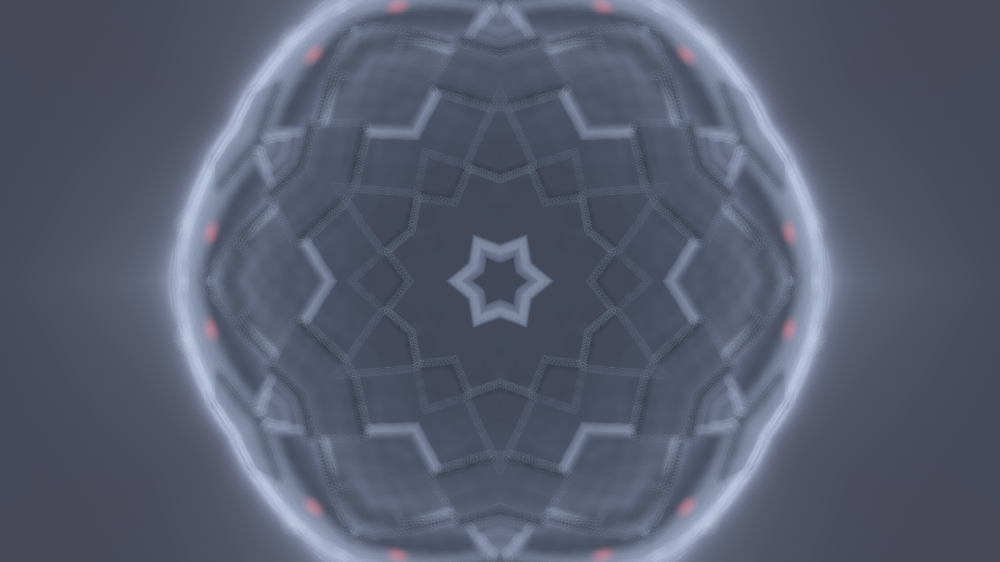

**Ergebnis (mit `FINISH = 1`):** Der Moloch als **Mandala** – sechs gespiegelte Keile der 3D-Szene rotieren umeinander, die Positionslichter blinken synchron in allen Sektoren, die Sonnen-Korona wird zur sechszähligen Glorie, und die Kamerafahrt der Szene wird zur kaleidoskopischen Strömung. `FINISH = 2` legt stattdessen einen gespiegelten Fliesenteppich aus Moloch-Ausschnitten über den Schirm. `FINISH = 0`: alles wie in Schritt 7 – das Finish ist ein Gast, kein Umbau.

### Was passiert hier

**Eine 3D-Szene durch eine 2D-Faltung zu schicken ist begrifflich der interessanteste Moment dieses Tutorials.** Im Kaleidoscope-Tutorial faltete die Brille ein Feedback-Gemälde – abstrakte Farbe, der Symmetrie egal ist. Hier faltet sie ein *perspektivisches Bild*: Der Betrachter sieht sechsmal denselben Keil einer räumlichen Szene, und das Hirn versucht trotzdem, Raum daraus zu lesen – dieses Flackern zwischen „Ornament" und „Raum" ist der besondere Reiz des 3D-Kaleidoskops (und der Grund, warum Musik-Visuals ihn so lieben: Milkdrop-Presets legen ihre Faltungen fast immer über *bewegte* Bilder, nie über statische Muster).

Technisch ist alles geerbt: `mod` + `abs` machen die Sektorgrenzen zu **stetigen Spiegelnähten** (Kaleidoscope-Tutorial, Schritt 8 – dort steht auch die Naht-Herleitung), und die Faltung sitzt in der **Anzeige**, nicht im System (die dortige Design-Diskussion „Brille vs. Kreislauf" kehrt in Schritt 9 als „Faltung vor oder nach Bloom" wieder). Wichtig ist die Konsequenz im Detail: **Alle drei Lesungen** – Szene, Tiefe, Bloom – laufen über dieselbe gefaltete Koordinate `k`. Würde nur die Farbe gefaltet, die Tiefe aber nicht, bekäme jeder Sektor das DOF des *ungefalteten* Bildes – ein subtiler, schwer zu findender Versatz. Der Nebenkanal ist Teil des Bildes; er wird mitgefaltet.

**Und eine Grenze gehört benannt:** Das DOF-Gather tastet um `k` herum ab – nahe einer Faltnaht greifen seine Taps über die Naht hinaus in den *ungefalteten* Buffer und sammeln Bildinhalt, der im gefalteten Bild dort gar nicht liegt. Sichtbar wird das als leichte Asymmetrie der Unschärfe an den Nähten, praktisch nur bei großem `coc`. Wer es perfekt will, faltet jeden Tap einzeln (`faltUV(k + TAP[i] * coc)` – neun `atan` teurer); für das Tutorial bleibt es bei der ehrlichen Fußnote.

### 🎨 Experimentieren

- `SEKTOREN = 3.0` → grafisch-grob; `12.0` → Spitzendeckchen; `1.0` → ein einziger Klappspiegel quer durchs Bild (subtiler Effekt, sehr brauchbar)
- `KACHEL = 0.6` (mit `FINISH = 2`) → große, ruhige Spiegelfelder, in denen die Kamerafahrt gegenläufige Wellen erzeugt
- Faltung + Iso-Trick: `k = faltUV(uv * 1.5)` → das Mandala zoomt heraus, mehr Moloch pro Keil
- Beide Faltungen stapeln: in `faltUV` bei `FINISH == 3` `falteKachel(falteWinkel(uv, SEKTOREN), KACHEL)` zurückgeben → die „gotische" Dichte aus dem Kaleidoscope-Tutorial, jetzt über der 3D-Szene

---

## Schritt 9 – Kaleidoskop als Post II: Faltung vor oder nach dem Bloom?

**Neu:** Kein neuer Effekt – eine **Architektur-Entscheidung mit Schalter**: `FALT_VOR_BLOOM` verlegt die Faltung wahlweise **vor** die Bloom-Kette (Buffer B faltet seine Lese-Koordinate – das Bloom sieht das gefaltete Bild) statt dahinter (Stand von Schritt 8). Beide Varianten sind gültig; der Unterschied sitzt an den Faltnähten.

**Common** *(Stellschraube)*

```glsl
const float FALT_VOR_BLOOM = 0.0; // 1.0 = das Bloom sieht das GEFALTETE Bild
```

**Buffer B** *(nur `hell()` ändert sich – jeder Abgriff faltet optional selbst)*

```glsl
// GEAENDERT: die Schwelle liest wahlweise durch die Faltbrille
vec3 hell(vec2 uv)
{
    vec2 st = uvZuTex(FALT_VOR_BLOOM > 0.5 ? faltUV(uv) : uv);
    vec3 c = texture(iChannel0, st).rgb;
    return c * smoothstep(SCHWELLE, SCHWELLE + KNIE, lum(c));
}
```

**Image** *(nur die Bloom-Lesung – wenn Buffer B schon gefaltet hat, darf das Image nicht noch einmal falten)*

```glsl
// GEAENDERT: die Bloom-Leitung
    vec2 kBloom = (FALT_VOR_BLOOM > 0.5) ? uv : k;
    vec3 bloom  = texture(iChannel1, uvZuTex(kBloom)).rgb;
```

**Buffer A, C: unverändert.** *(Buffer C blurrt, was B liefert – ihm ist egal, ob es gefaltet ist.)*

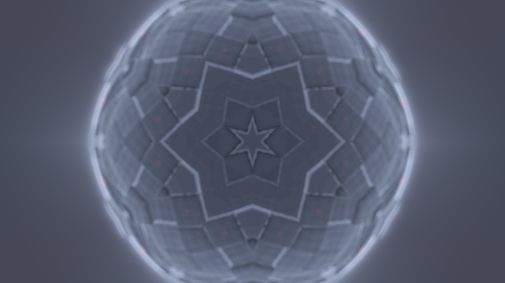

**Ergebnis:** Bei `FINISH = 0` wirkungslos (die Weiche schaltet dann zwischen zwei identischen Wegen). Mit `FINISH = 1` und einem Blick auf die Sektorgrenzen: **`0.0` (nach dem Bloom):** Jeder Sektor trägt exakt denselben Bloom-Hof – makellos symmetrisch, aber die Höfe **enden** an den Nähten und knicken dort spiegelbildlich um; ein Licht nahe der Naht hat einen sichtbar „gefalteten" Halo. **`1.0` (vor dem Bloom):** Der Blur läuft über das *bereits gefaltete* Bild – Glow fließt **über die Nähte hinweg**, ein Licht auf der Naht strahlt weich in beide Nachbar-Sektoren, das Mandala wirkt „eingewachsen" statt gespiegelt.

### Was passiert hier

**Die Reihenfolge von Stationen ist selbst ein Gestaltungsmittel** – das ist die Lektion, und sie lässt sich hier exakt begründen. Blur und Faltung **kommutieren nicht**: `blur(falte(Bild)) ≠ falte(blur(Bild))`. Warum nicht? Der Blur mischt jeden Punkt mit seiner *Nachbarschaft* – und die Faltung ändert, *wer* Nachbar ist:

- **Nach dem Bloom** (Faltung zuletzt): Der Blur arbeitet in der ungefalteten Welt; seine Höfe kennen die Nähte nicht. Die Faltung spiegelt anschließend fertige Höfe – an jeder Naht treffen sich zwei Spiegelbilder desselben Hofs. Das ist *stetig* (kein Sprung – dieselbe Mathematik wie bei den Faltnähten selbst), aber die **Ableitung knickt**: Ein Hof, der schräg auf die Naht zuläuft, läuft nach der Spiegelung schräg wieder weg – das Auge liest ein „Ornament aus Glow".
- **Vor dem Bloom** (Faltung zuerst): Buffer B rendert bereits das Mandala (jeder Abgriff faltet seine eigene Koordinate – deshalb die Faltung *pro Tap* in `hell()`, nicht einmal pro Pixel: der Kernel soll im **gefalteten** Bild ein Kernel sein). Der Blur verschmiert dann Mandala-Nachbarn – Glow überquert die Nähte, als wären sie nie da gewesen. Physikalisch „richtiger" (das Kaleidoskop-Bild glüht als Ganzes), dafür ist die Symmetrie des Blooms nur noch näherungsweise perfekt.

Es gibt kein Richtig – es gibt zwei Charaktere: **ornamental** (nach) und **organisch** (vor). Deshalb ein Schalter statt einer Entscheidung. Und das Muster ist verallgemeinerbar: Dieselbe Frage stellt sich für *jede* Umordnung der Kette (DOF vor oder nach der Faltung? Nebel vor oder nach dem Bloom? – Schritt 11 beantwortet die zweite). Wer eine Post-Kette entwirft, entwirft eine **Reihenfolge**.

Nebenbei zeigt der Schritt, warum die Faltungen in Schritt 8 ins **Common** gezogen wurden: Jetzt brauchen zwei Pässe dieselbe `faltUV`-Definition – hätte jeder seine Kopie, wären divergierende Faltungen (B faltet 6 Sektoren, Image 8) ein Frame-genauer Alptraum. SSOT zahlt sich in dem Moment aus, in dem eine Funktion die Pass-Grenze überquert.

### 🎨 Experimentieren

- Ein einzelnes helles Fenster nahe einer Naht suchen (Kamera-Moment abwarten) und `FALT_VOR_BLOOM` umschalten – der direkteste Vorher/Nachher-Blick auf den Unterschied
- `FALT_VOR_BLOOM = 1.0` + `STREU = 6.0` → breiter Glow, der die Sektoren regelrecht verschweißt: das Mandala als eine leuchtende Masse
- Asymmetrie als Stil: `FALT_VOR_BLOOM = 1.0` und im Image **zusätzlich** `kBloom = k` erzwingen → das Bloom wird doppelt gefaltet – mathematisch „falsch", ergibt aber interferenzartige Glow-Muster (ausprobieren, verwerfen oder behalten)
- Die DOF-Variante derselben Frage: die Tap-Faltung aus Schritt 8 (💡-Fußnote) einbauen und vergleichen – Unschärfe, die die Nähte respektiert, vs. Unschärfe, die darüber hinwegsammelt

---

## Schritt 10 – Temporal-Glättung: der Szenen-Pass bekommt ein Gedächtnis

**Neu:** Buffer A liest **sich selbst** und mischt einen Anteil seines Vorframes in die frische Szene – Flimmern und Tap-Restzappeln werden glattgezogen, schnelle Lichtwechsel bekommen einen filmischen Nachzieh-Schweif. Der ehrliche Preis heißt **Geisterbilder**. Die Tiefe im Alpha bleibt dabei bewusst **frisch**.

**Buffer A** *(Kanal-Leiste: iChannel0 = **Buffer A** – die Selbstreferenz! Dann zwei Zeilen in `mainImage`:)*

```glsl
// GEAENDERT: mainImage - Temporal-Mix mit dem eigenen Vorframe
void mainImage(out vec4 fragColor, in vec2 fragCoord)
{
    vec2 uv = (fragCoord - 0.5 * iResolution.xy) / iResolution.y;

    float tiefe;
    vec3 col = szene(uv, tiefe);

    // NEU: Vorframe-Anteil - NUR auf die Farbe. Die Tiefe ist Geometrie,
    // kein Licht: sie wird jeden Frame frisch geschrieben.
    vec3 alt = texture(iChannel0, fragCoord / iResolution.xy).rgb;
    col = mix(col, alt, NACHZIEH);

    fragColor = vec4(col, tiefe);
}
```

**Common** *(Stellschraube)*

```glsl
// Temporal (Buffer A)
const float NACHZIEH  = 0.35;  // Vorframe-Anteil (0.0 = aus; nie >= 1.0!)
```

**Buffer B, C, Image: unverändert.** *(Aber alle profitieren – sie lesen ab jetzt die geglättete Szene.)*

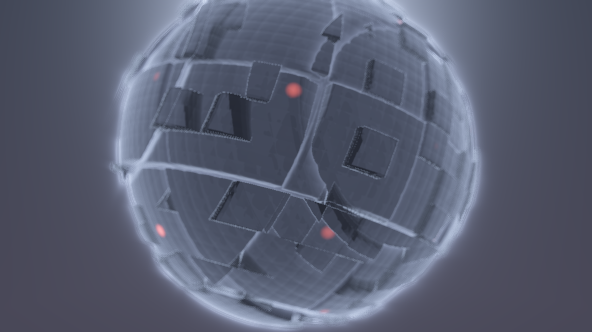

**Ergebnis:** Auf den ersten Blick subtil, auf den zweiten überall: Das feine Pixel-Gewimmel der Rillen-Oktave in der Ferne beruhigt sich, das Bloom pumpt nicht mehr im Frame-Takt der blinkenden Fenster, sondern **atmet** – jedes Aufleuchten zieht einen kurzen Abkling-Schweif hinter sich her. Bei schnellen Kamera-Momenten schmieren kontrastreiche Kanten leicht nach: der Motion-Blur-Ersatz. Und beim Neuladen des Shaders sieht man den **Kaltstart**: einen Sekundenbruchteil, in dem sich das Bild aus Schwarz „einschwingt".

### Was passiert hier

**Das ist der Feedback-Kreislauf des Kaleidoscope-Tutorials – in seiner zahmsten Form.** Dort war die Selbstreferenz der Motor des ganzen Bildes (`alt * DECAY + seeds`); hier ist sie ein Glättungsfilter: `mix(frisch, alt, NACHZIEH)` ist ein **exponentiell gleitendes Mittel über die Zeit** – exakt die Tiefpass-Zeile aus dem Crystal-Lights-Anhang B3 (`mix(alt.x, bass, 0.10)`), nur auf jedes Pixel angewandt statt auf einen Pegel. Jeder Frame trägt `(1-NACHZIEH)`, der vorige `NACHZIEH·(1-NACHZIEH)`, der davor `NACHZIEH²·(1-NACHZIEH)` … eine geometrisch abklingende Erinnerung. Bei 0.35 ist nach vier Frames ~98 % der Vergangenheit verdaut: Glättung ja, Schleppe kaum.

**Warum dieses Feedback nicht explodieren kann** – der feine Unterschied zum Kaleidoskop: Dort war die Vorschrift `alt * DECAY + seeds`, eine Summe – wächst die Saat, wächst der Pegel, und `DECAY ≥ 1` brennt durch. Unser `mix` ist dagegen ein **gewichteter Durchschnitt** (die Gewichte summieren zu 1): Das Ergebnis liegt immer *zwischen* frisch und alt, kann also nie über das hellste je gerenderte Bild hinaus. Solange `NACHZIEH < 1` bleibt, ist das System unbedingt stabil – bei `1.0` friert das Bild ein (nur noch Vergangenheit), knapp darunter wird es zäh wie Sirup. Die Stabilitätslehre des Kaleidoskops gilt weiter, aber die Konstruktion hat sie diesmal eingebaut.

**Die Geisterbilder sind kein Bug, sondern der Kaufpreis.** Ein Fenster, das hart auf AUS schaltet, glimmt `NACHZIEH`-gewichtet nach; eine schnelle Kamerabewegung hinterlässt Doppelkanten. Bei 0.35 liest das Auge beides als „filmisch" (Kameras haben Belichtungszeit – echtes Motion Blur *ist* Vergangenheits-Mischung). Ab ~0.7 wird es sichtbar schmierig, und der Charakter kippt von „Glättung" zu „Effekt" – auch das kann gewollt sein (🎨).

**Und die eine Design-Entscheidung, die man leicht übersieht:** Die Tiefe wird **nicht** gemischt. Licht darf Vergangenheit tragen – Geometrie nicht: Ein zeitgemittelter Tiefenwert entspräche einer Oberfläche, die nie existiert hat, und DOF/Nebel würden auf Phantom-Distanzen rechnen (sichtbar als Fokus-Schlieren bei jeder Kamerabewegung). Der Nebenkanal hat andere Regeln als das Bild, in dem er wohnt – wer Kanäle zweckentfremdet (Schritt 3), muss sie auch getrennt *behandeln*.

### 💡 Warum im Szenen-Pass und nicht am Ende der Kette?

Gefühlt gehört „Temporal" doch in die Anrichte? Zwei Gründe dagegen: Erstens kann der Image-Pass auf Shadertoy **nicht als iChannel gewählt werden** – wer am Kettenende glätten will, braucht einen zusätzlichen Compositing-Buffer (Buffer D wäre frei; ein sauberes Eigenprojekt). Zweitens ist *früh* hier auch sachlich besser: Die Glättung wirkt vor Schwelle und Blur – die ganze Bloom-Kette rechnet auf beruhigtem Material und flimmert selbst nicht mehr; ein Temporal-Mix *nach* dem Bloom müsste dessen Pumpen nachträglich wegbügeln. Frühe Stationen heilen, späte kaschieren.

### 🎨 Experimentieren

- `NACHZIEH = 0.0` ↔ `0.35` im A/B-Blick auf die fernen Rillen und ein blinkendes Fenster – die zwei Wirkungen (Ruhe + Schweif) einzeln würdigen
- `NACHZIEH = 0.8` → bewusster Trail-Look: der Moloch malt mit seinen Lichtern Spuren in die eigene Rotation; mit `FINISH = 1` dazu ist das schon fast wieder das Kaleidoscope-Tutorial
- Die Falle einmal absichtlich: `fragColor = vec4(col, mix(tiefe, texture(iChannel0, fragCoord / iResolution.xy).a, 0.9));` → gemischte Tiefe; dann mit `FOKUS_HUB = 0` die Fokus-Schlieren bei Kamerafahrt beobachten – und die Zeile wieder löschen
- Selektiv glätten: `col = mix(col, alt, NACHZIEH * smoothstep(0.5, 2.0, lum(alt)));` → nur helle Bereiche ziehen nach (Lichter-Trails ohne Flächen-Schmieren)

---

## Schritt 11 – Die Anrichte: Politur ans Ende der Kette

**Neu:** Die Not-Politur wird zur echten – **Tiefen-Nebel** (aus dem Alpha-Kanal, die Rückkehr des gestrichenen Dunsts), **Farbdrift**, das **`1-exp`-Tonemapping** mit stimmungsabhängiger Belichtung, **Gamma, Vignette, Dither**. Alles im Image, alles nach allem anderen – die Lektion dieses Tutorials in Code: *Politur gehört ans Ende der Kette, nicht in die Szene.*

**Common** *(Stellschrauben)*

```glsl
// Politur (Image)
const float NEBEL     = 1.0;   // Tiefen-Nebel-Skala (Dichte haengt an STIMMUNG)
const float BELICHTUNG= 1.0;   // Skala vor dem 1-exp-Tonemapping
const float VIGNETTE  = 0.32;  // Randabdunklung
const float DITHER    = 1.5;   // Anti-Banding-Rauschen in 1/255-Stufen
```

**Image** *(der Schluss von `mainImage` – ersetzt die Not-Politur)*

```glsl
    // (4) NEU: Tiefen-Nebel auf die SZENE - der Dunst aus dem Juggernaut-
    //     Tutorial, wiederauferstanden aus dem Alpha-Kanal. Der Himmel
    //     (tiefe = TIEFE_MAX) ist per Vertrag ausgenommen: er traegt seine
    //     Dunstfarbe schon im Verlauf.
    float dichte = NEBEL * mix(0.0035, 0.0012, STIMMUNG);
    vec3 nebelFarbe = mix(vec3(0.020, 0.024, 0.040), vec3(0.16, 0.15, 0.15), STIMMUNG);
    float nebel = (tiefe < TIEFE_MAX * 0.99) ? 1.0 - exp(-dichte * tiefe * tiefe) : 0.0;
    szeneCol = mix(szeneCol, nebelFarbe, nebel);

    // (5) Bloom addieren - NACH dem Nebel: die Hoefe stechen durch den Dunst
    vec2 kBloom = (FALT_VOR_BLOOM > 0.5) ? uv : k;
    vec3 bloom  = texture(iChannel1, uvZuTex(kBloom)).rgb;
    vec3 col    = szeneCol + bloom * BLOOM_STAERKE;

    if (ANSICHT == 1) { fragColor = vec4(vec3(tiefe / TIEFE_MAX), 1.0); return; }
    if (ANSICHT == 2) { fragColor = vec4(bloom, 1.0); return; }

    // (6) NEU: die echte Politur - ganz am Ende der Kette
    col *= 0.92 + 0.08 * cos(iTime * 0.04 + vec3(0.0, 2.1, 4.2));       // Farbdrift
    col = 1.0 - exp(-col * BELICHTUNG * mix(2.4, 1.6, STIMMUNG));       // Tonemapping
    col = pow(col, vec3(1.0 / 2.2));                                    // Gamma
    col *= 1.0 - VIGNETTE * dot(uv, uv);                                // Vignette (Schirm-uv!)
    col += (hash21(fragCoord + fract(iTime * 0.37) * 61.7) - 0.5) * (DITHER / 255.0);

    fragColor = vec4(col, 1.0);
}
```

**Buffer A, B, C: unverändert.**

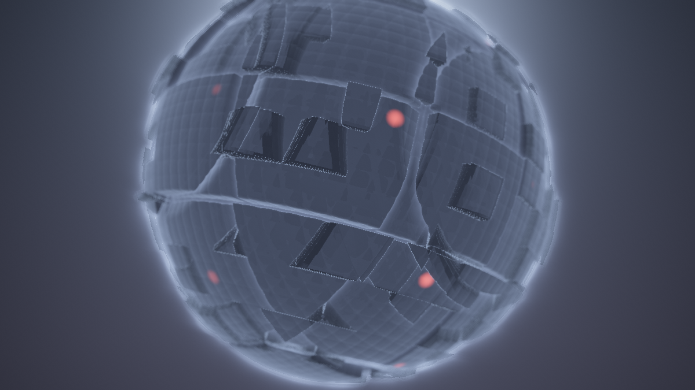

**Ergebnis:** Jetzt erst ist das Juggernaut-Niveau wieder erreicht – und überschritten: Der Moloch tritt aus dichtem (dark) bzw. leichtem (brighter) Dunst hervor **und** glüht dabei durch sein Bloom; die Ferne versinkt weich, die Vignette rahmt, kein Banding im Dunst-Verlauf. Dieselben fünf Politur-Griffe wie im Vorgänger – aber sie sitzen jetzt hinter Bloom, DOF, Finish und Temporal, und genau deshalb wirken sie auf das *ganze* Bild.

### Was passiert hier

**Der Tiefen-Nebel schließt den Bogen von Schritt 1.** Der Dunst war der „interessante Grenzfall" beim Kondensieren: braucht Szenen-Wissen (`t`), leistet Post-Arbeit (Farb-Mischung). Der Nebenkanal löst ihn sauber auf – dieselbe Formel wie im Juggernaut-Schritt 14 (`1 - exp(-dichte · t²)`, stimmungsgekoppelte Dichte), aber `t` kommt jetzt aus einer Textur statt aus dem Marsch. Der `TIEFE_MAX`-Vertrag aus Schritt 3 zahlt zum zweiten Mal aus: „Himmel" ist am Sentinel erkennbar und bleibt unvernebelt – wie im Original, wo der Dunst nur auf dem Treffer-Zweig lag. *(Die ehrliche Rest-Fußnote: Am Silhouetten-Saum liefert die bilinear gefilterte Tiefe Zwischenwerte unterhalb des Sentinels – ein ein Pixel schmaler Nebelsaum um den Moloch vor dem Himmel. Dither und Bloom decken ihn praktisch zu; wer ihn doch sieht: `texelFetch` für die Tiefe, Schritt-3-💡.)*

**Die Reihenfolge Nebel → Bloom ist eine Entscheidung, keine Notwendigkeit** – die zweite Kostprobe der Schritt-9-Lektion. Physikalisch müsste auch das Streulicht des Blooms vom Dunst geschluckt werden. Aber das Bloom *hat keine Tiefe mehr* – der Blur hat die Tiefen seiner Quellen unrettbar vermischt (welche Distanz hat ein Hof, der aus einem nahen Fenster und der fernen Korona gespeist ist?). Die Kette **kann** den Nebel nur auf die scharfe Szene legen. Der Fehler ist aber einer in die richtige Richtung: Lichter, die durch den Dunst stechen, sind genau das Verhalten echter Lichtquellen im Nebel – aus der technischen Grenze wird ein Look. Solche Stellen zu erkennen (und zu *benennen*, statt sie zufällig richtig zu haben) ist die halbe Post-Kompetenz.

**Die restlichen vier Griffe** sind wörtlich das Juggernaut-Erbe: Farbdrift (±8 %, drei inkommensurable Cosinus-Uhren), Tonemapping mit Stimmungs-Belichtung (dark wird stärker „entwickelt" – 2.4 vs. 1.6 –, sonst ersäuft die Fast-Schwärze), Gamma, Vignette, Dither gegen das Banding, das dunkle Verläufe in 8 Bit unweigerlich zeigen. Nur eine Kleinigkeit ist neu und wichtig: **Die Vignette rechnet auf `uv`, nicht auf `k`.** Sie gehört zum *Schirm* (der Blick durch eine Linse), nicht zum *Bild* – eine mitgefaltete Vignette würde in jedem Kaleidoskop-Sektor eine eigene dunkle Ecke spiegeln. Das Gegenstück zur mitgefalteten Tiefe aus Schritt 8: Man muss bei jeder Zutat wissen, ob sie im Bild- oder im Schirm-Raum lebt.

### 🎨 Experimentieren

- `NEBEL = 2.5` in dark → der Moloch als Ahnung im Dunst, nur Bloom und Positionslichter kommen durch: der düsterste Look des Tutorials
- Die Reihenfolge einmal falsch: die Bloom-Addition testweise **vor** den Nebel ziehen → das Glühen ersäuft im Dunst; zurückbauen und den Unterschied als Merksatz behalten
- Vignette auf `k` statt `uv` (mit `FINISH = 1`) → die gespiegelten Dunkel-Ecken im Mandala; der schnellste Beweis für die Schirm-Raum-Regel
- Drift-Amplitude `0.08` → `0.20` → das Bild „atmet" farblich sichtbar; hübsch mit `FINISH = 2`

---

## Schritt 12 – Die STIMMUNGs-Kopplung: eine Blende für die ganze Küche

**Neu:** Die `STIMMUNG`-Stellschraube der Szene greift bis in die Post: **effektive Parameter** im Common koppeln Bloom-Stärke, Schwelle, Blende und Nebel an die Stimmung – *dark* bekommt fette Post (mehr Bloom, offene Blende), *brighter* eine nüchterne. EIN Regler, ZWEI komplette Bild-Welten – jetzt inklusive Nachbearbeitung.

**Common** *(neu: die Kopplungs-Schicht – direkt unter den Stellschrauben)*

```glsl
// ---- STIMMUNGs-Kopplung: dark = fette Post, brighter = nuechterne Post ------
// Die Basis-Stellschrauben bleiben die Regler; die eff*()-Funktionen legen
// die Stimmungs-Gewichtung darueber. ALLE Paesse lesen nur noch eff*().
float effBloomStaerke() { return BLOOM_STAERKE * mix(1.6, 0.8, STIMMUNG); }
float effSchwelle()     { return SCHWELLE      * mix(0.85, 1.15, STIMMUNG); }
float effBlende()       { return BLENDE        * mix(1.4, 0.7, STIMMUNG); }
float effNebelDichte()  { return NEBEL * mix(0.0035, 0.0012, STIMMUNG); }
```

**Buffer B** *(in `hell()`: `SCHWELLE` → `effSchwelle()` – zweimal)*

```glsl
    return c * smoothstep(effSchwelle(), effSchwelle() + KNIE, lum(c));
```

**Image** *(drei Ersetzungen)*

```glsl
    float coc = min(effBlende() * abs(tiefe - fokus) / max(tiefe, 1.0), COC_MAX);
    // ...
    float dichte = effNebelDichte();
    // ...
    vec3 col = szeneCol + bloom * effBloomStaerke();
```

**Buffer A, C: unverändert.**

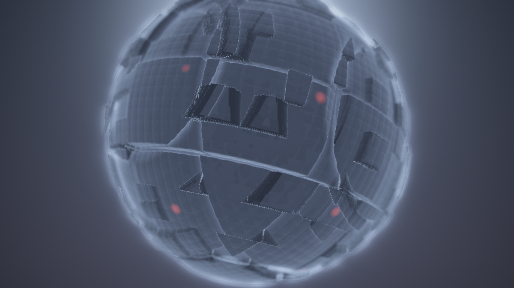

**Ergebnis:** `STIMMUNG` einmal von 0 nach 1 gedreht ist jetzt ein kompletter **Grading-Wechsel**: dark = tiefschwarze Masse, aus der rote Höfe weit herausglühen, weite Unschärfe-Zonen, dichter Dunst – die Post trägt die Drohung mit. brighter = warmes, klares Licht, diszipliniertes Bloom (höhere Schwelle, weniger Stärke), geschlossene Blende, leichter Dunst – die Post hält sich zurück und lässt die Struktur sprechen.

### Was passiert hier

**Das ist die STIMMUNGs-Blende des Juggernaut-Tutorials, zu Ende gedacht.** Dort endete sie bei zwei Politur-Konstanten (Dunstdichte, Belichtung – „die Stimmungs-Blende reicht bis in die Nachbearbeitung", hieß es im dortigen Schritt 14). Jetzt, wo die Nachbearbeitung eine eigene Maschine mit eigenen Reglern ist, wird aus der Notiz ein Prinzip: **Jeder Post-Parameter, der eine ästhetische Rolle spielt, bekommt eine Stimmungs-Gewichtung.** Die Zuordnungen selbst sind Dramaturgie, nicht Mathematik – dark bekommt *mehr* Bloom (im Dunkeln ist jede Lichtquelle ein Ereignis), eine *niedrigere* Schwelle (auch schwache Lichter dürfen glühen), die *offenere* Blende (Nachtaufnahmen-Optik: wenig Licht → Blende auf → geringe Schärfentiefe – ein fotografisches Zitat, das das Auge sofort versteht) und den *dichteren* Nebel (das Juggernaut-Erbe).

**Die `eff*()`-Schicht ist das Architektur-Muster des Schritts.** Die rohen Stellschrauben bleiben die Regler des Nutzers; die Kopplung liegt als dünne Funktions-Schicht darüber, und **alle Pässe lesen nur noch die Schicht**. Das geht ausschließlich deshalb so glatt, weil beide Zutaten im Common wohnen: `STIMMUNG` (seit Schritt 2) und die Post-Konstanten (seit ihren Schritten). Eine Kopplung über vier Tabs hinweg wäre ohne SSOT ein Wartungs-Alptraum – mit ihm sind es vier Einzeiler. Wer später Audio auf die Stimmung legen will (der Juggernaut-Anhang A lässt grüßen), ändert *eine* Stelle, und die ganze Küche folgt.

### 🎨 Experimentieren

- Die Kopplungen einzeln abschalten (Faktor auf `1.0`) und `STIMMUNG` drehen → welcher der vier Griffe trägt am meisten? (Wette: die Schwelle – sie entscheidet, *was überhaupt* glüht)
- Gegenläufig koppeln: brighter mit *mehr* Bloom (`mix(0.8, 1.6, STIMMUNG)`) → ein überstrahlter „Traumsequenz"-Look; die Kopplung ist Dramaturgie, also darf man sie umdrehen
- `STIMMUNG` langsam fahren: `const` durch `0.5 + 0.5 * sin(iTime * 0.02)` ersetzen (im Common – wirkt überall!) → der Shader wandert in ~5-Minuten-Zyklen zwischen den Welten; die Kette zieht ruckfrei mit
- Eine fünfte Kopplung erfinden: `effNachzieh()` mit mehr Trail im dark? Vorsicht – `NACHZIEH` wirkt in Buffer A, die Kopplung wäre dort zu lesen; das Muster trägt auch das

---

## Schritt 13 – Der fertige Shader: Common + Buffer A + B + C + Image

**Neu:** Kein neuer Effekt – der Endstand als **Gesamtlisting**, Tab für Tab, zum Einfügen. Vorweg die Verdrahtung als Tabelle (der häufigste Stolperstein beim Nachbauen):

| Tab | iChannel0 | iChannel1 | Aufgabe |
|---|---|---|---|
| Common | – | – | Stellschrauben, Kopplung, geteilte Helfer (SSOT) |
| Buffer A | **Buffer A** (selbst!) | – | Szene: rgb = lineares HDR, a = Tiefe; Temporal-Mix |
| Buffer B | Buffer A | – | Bright-Pass + horizontaler Gauß |
| Buffer C | Buffer B | – | vertikaler Gauß → fertiges Bloom |
| Image | Buffer A | Buffer C | Finish, DOF, Nebel, Bloom-Mix, Politur |

**Common** *(Tab „Common")*

```glsl
// ============================================================================
// "Composite: PostFX" - der Juggernaut-Moloch hinter einer Multipass-
// Nachbearbeitungs-Kette. Endstand des Tutorials (Schritt 13).
// Szene: Juggernaut-Shader-Tutorial (kondensiert). Faltungen: Pimped-
// Kaleidoscope-Tutorial. Bloom-Kette: das Pendant zu Milkdrops GetBlur1/2/3.
// Verdrahtung: Buffer A liest SICH SELBST (iChannel0), Buffer B liest A,
// Buffer C liest B, Image liest A (iChannel0) und C (iChannel1).
// ============================================================================

// ---- STELLSCHRAUBEN --------------------------------------------------------
// Kuechen-Monitor
const int   ANSICHT   = 0;     // 0 = fertig, 1 = Tiefe, 2 = Bloom-Leitung
// Szene (Buffer A)
const float STIMMUNG  = 0.0;   // 0.0 = dark .. 1.0 = brighter (wirkt bis in die Post!)
const float RADIUS    = 6.0;   // Radius des Molochs
const float ZELLE1    = 2.6;   // Kantenlaenge der grossen Platten
const float ZELLE2    = 0.9;   // Raster der Aufbauten + Positionslichter
const float ZELLE3    = 0.32;  // Raster der feinen Rillen
const float PLATTE    = 0.35;  // Hoehenspiel der grossen Platten
const float AUFBAU    = 0.22;  // Hoehe der mittleren Aufbauten
const float FUGE      = 0.07;  // halbe Breite der Panelfugen
const float SCHALE    = 0.30;  // Fugen-Schale unter dem Nennradius
const float RILLE     = 0.02;  // Tiefe der feinen Rillen
const float GLAETTE   = 0.05;  // Kanten-Weiche der smax-Fugen
const float DROSSEL   = 0.5;   // Marsch-Drossel
const float GODRAY    = 1.0;   // volumetrischer Glow der Szene
const float TEMPO     = 1.0;   // Orbit-Tempo
const float NAH       = 8.5;   // Orbit-Radius nah
const float FERN      = 15.0;  // Orbit-Radius fern
const float TIEFE_MAX = 40.0;  // Marsch-Limit = "unendlich" im Tiefenkanal
// Temporal (Buffer A)
const float NACHZIEH  = 0.35;  // Vorframe-Anteil (0.0 = aus; nie >= 1.0!)
// Bloom (Buffer B + C)
const float SCHWELLE  = 0.7;   // Bright-Pass: ab dieser Leuchtdichte "ueberstrahlt"
const float KNIE      = 0.5;   // weicher Uebergang oberhalb der Schwelle
const int   RAD       = 6;     // Blur-Taps je Seite (Kernel = 2*RAD+1 = 13)
const float SIGMA     = 3.0;   // Gauss-Breite in Tap-Einheiten
const float STREU     = 2.5;   // Tap-Abstand in Promille der Bildhoehe
const float BLOOM_STAERKE = 0.7; // Anteil des Blooms im Endbild
// Depth of Field (Image)
const float FOKUS     = 6.0;   // Fokus-Distanz in Welteinheiten
const float FOKUS_HUB = 3.0;   // Pendel-Amplitude der Fokus-Uhr (0.0 = statisch)
const float BLENDE    = 0.012; // Blendenweite: max. Zerstreuungskreis (uv-Einheiten)
const float COC_MAX   = 0.015; // Sicherheitsdeckel des Zerstreuungskreises
// Kaleidoskop-Finish (Image + Buffer B)
const int   FINISH    = 0;     // 0 = aus, 1 = Sektor-Faltung, 2 = Spiegel-Kachel
const float SEKTOREN  = 6.0;   // Spiegel-Sektoren (FINISH 1)
const float KACHEL    = 1.2;   // Kacheln pro Bildhoehe (FINISH 2)
const float FALT_VOR_BLOOM = 0.0; // 1.0 = das Bloom sieht das GEFALTETE Bild
// Politur (Image)
const float NEBEL     = 1.0;   // Tiefen-Nebel-Skala (Dichte haengt an STIMMUNG)
const float BELICHTUNG= 1.0;   // Skala vor dem 1-exp-Tonemapping
const float VIGNETTE  = 0.32;  // Randabdunklung
const float DITHER    = 1.5;   // Anti-Banding-Rauschen in 1/255-Stufen
// ----------------------------------------------------------------------------

// ---- STIMMUNGs-Kopplung: dark = fette Post, brighter = nuechterne Post ------
float effBloomStaerke() { return BLOOM_STAERKE * mix(1.6, 0.8, STIMMUNG); }
float effSchwelle()     { return SCHWELLE      * mix(0.85, 1.15, STIMMUNG); }
float effBlende()       { return BLENDE        * mix(1.4, 0.7, STIMMUNG); }
float effNebelDichte()  { return NEBEL * mix(0.0035, 0.0012, STIMMUNG); }

// ---- geteilte Helfer --------------------------------------------------------

#define R(a) mat2(cos(a), sin(a), -sin(a), cos(a))

float hash21(vec2 p) { return fract(sin(dot(p, vec2(127.1, 311.7))) * 43758.5453); }
float hash31(vec3 p) { return fract(sin(dot(p, vec3(127.1, 311.7, 74.7))) * 43758.5453); }

float lum(vec3 c) { return dot(c, vec3(0.299, 0.587, 0.114)); }

// zentrierte, hoehen-normierte Koordinaten -> 0..1-Texturkoordinaten
vec2 uvZuTex(vec2 uv)
{
    return uv * vec2(iResolution.y / iResolution.x, 1.0) + 0.5;
}

// Winkel-Faltung: alle Richtungen in EINEN Sektor spiegeln
vec2 falteWinkel(vec2 uv, float n)
{
    float sektor = 6.28318 / n;
    float ang = atan(uv.y, uv.x);
    ang = mod(ang, sektor);
    ang = abs(ang - 0.5 * sektor);
    return length(uv) * vec2(cos(ang), sin(ang));
}

// Spiegel-Kachel: die Ebene als Teppich gespiegelter Kopien einer Zelle
vec2 falteKachel(vec2 uv, float dichte)
{
    return abs(fract(uv * dichte) - 0.5) / dichte;
}

// die Finish-Weiche
vec2 faltUV(vec2 uv)
{
    if (FINISH == 1) return falteWinkel(uv, SEKTOREN);
    if (FINISH == 2) return falteKachel(uv, KACHEL);
    return uv;
}

// fester Abtast-Satz fuer das Gather-DOF: 1 Zentrum + 8 auf dem Ring
const int  DOF_TAPS = 9;
const vec2 TAP[DOF_TAPS] = vec2[DOF_TAPS](
    vec2( 0.000,  0.000),
    vec2( 1.000,  0.000), vec2( 0.707,  0.707), vec2( 0.000,  1.000),
    vec2(-0.707,  0.707), vec2(-1.000,  0.000), vec2(-0.707, -0.707),
    vec2( 0.000, -1.000), vec2( 0.707, -0.707)
);
```

**Buffer A** *(iChannel0 = Buffer A – die Selbstreferenz)*

```glsl
// BUFFER A - die Szene: der kondensierte Moloch.
// rgb = lineares HDR-Bild, a = Marsch-Distanz (Tiefe). KEINE Politur hier.

float smin(float a, float b, float k)
{
    float h = max(k - abs(a - b), 0.0) / k;
    return min(a, b) - h * h * k * 0.25;
}
float smax(float a, float b, float k) { return -smin(-a, -b, k); }

vec3 gSonne = vec3(0.0, 0.3, 1.0);   // wird je Frame in kamera() gesetzt

vec3 gedreht(vec3 p)
{
    p.yz *= R(0.42);
    p.xz *= R(iTime * 0.02);
    return p;
}

float fugen(vec3 p, float zelle)
{
    vec3 q = abs(fract(p / zelle) - 0.5) * zelle;
    return zelle * 0.5 - max(q.x, max(q.y, q.z));
}

float map(vec3 p)
{
    vec3 q = gedreht(p);

    float d = length(q) - RADIUS;

    vec3 z1 = floor(q / ZELLE1);
    d -= (hash31(z1) - 0.5) * PLATTE;

    float slab   = fugen(q, ZELLE1) - FUGE;
    float schale = (RADIUS - SCHALE) - length(q);
    d = smax(d, -max(slab, schale), GLAETTE);

    vec3 z2 = floor(q / ZELLE2);
    d -= step(0.72, hash31(z2 + 7.0)) * AUFBAU * (0.35 + 0.65 * hash31(z2 + 13.0));

    vec3 h = pow(abs(2.0 * fract(q / ZELLE3) - 1.0), vec3(3.0));
    d += RILLE * (h.x + h.y + h.z) * 0.33;

    return d;
}

float march(vec3 ro, vec3 rd, out float glow)
{
    glow = 0.0;
    float t = 0.0;
    for (int i = 0; i < 160; i++) {
        vec3 p = ro + rd * t;
        float d = map(p);
        glow += 0.012 / (0.05 + d * d);
        if (d < 0.001 + 0.0008 * t) return t;
        if (t > TIEFE_MAX) break;
        t += d * DROSSEL;
    }
    return -1.0;
}

vec3 calcNormal(vec3 p)
{
    const vec2 e = vec2(0.004, 0.0);
    return normalize(vec3(map(p + e.xyy) - map(p - e.xyy),
                          map(p + e.yxy) - map(p - e.yxy),
                          map(p + e.yyx) - map(p - e.yyx)));
}

float fenster(vec3 q)
{
    vec3 z = floor(q / ZELLE2);
    float an = step(0.93, hash31(z + 29.0));

    float sp = 0.10 + 0.25 * hash31(z + 3.0);
    float w  = 0.5 + 0.5 * sin(6.28318 * (iTime * sp + hash31(z + 11.0)));
    float blink = 0.25 + 0.75 * smoothstep(0.55, 0.95, w);

    vec3 lokal = (fract(q / ZELLE2) - 0.5) * ZELLE2;
    float punkt = 1.0 - smoothstep(0.06, 0.24, length(lokal));

    return an * blink * punkt;
}

vec3 himmel(vec3 rd)
{
    vec3 oben  = mix(vec3(0.010, 0.012, 0.022), vec3(0.10, 0.13, 0.20), STIMMUNG);
    vec3 unten = mix(vec3(0.030, 0.028, 0.045), vec3(0.24, 0.20, 0.18), STIMMUNG);
    vec3 col = mix(unten, oben, clamp(rd.y * 1.5 + 0.5, 0.0, 1.0));

    // Korona ohne Strahlenkeulen - das Strahlen macht die Bloom-Kette
    float s = max(dot(rd, gSonne), 0.0);
    vec3 sonnenFarbe = mix(vec3(0.35, 0.42, 0.60), vec3(1.2, 0.9, 0.6), STIMMUNG);
    col += pow(s, 30.0) * sonnenFarbe * 1.2;
    col += pow(s, 5.0) * sonnenFarbe * 0.12;

    return col;
}

vec3 shade(vec3 p, vec3 rd)
{
    vec3 n = calcNormal(p);

    vec3 sonnenFarbe = mix(vec3(0.30, 0.38, 0.55), vec3(1.05, 0.80, 0.55), STIMMUNG);
    vec3 himmelLicht = mix(vec3(0.020, 0.025, 0.045), vec3(0.10, 0.12, 0.16), STIMMUNG);
    float difStaerke = mix(0.6, 1.0, STIMMUNG);
    float rimStaerke = mix(0.55, 0.22, STIMMUNG);
    float speStaerke = mix(0.06, 0.30, STIMMUNG);

    vec3 albedo = vec3(0.16, 0.17, 0.19);

    float dif = max(dot(n, gSonne), 0.0);
    float amb = 0.5 + 0.5 * n.y;
    vec3 col = albedo * (dif * sonnenFarbe * difStaerke + amb * himmelLicht);

    float rim = pow(1.0 - max(dot(n, -rd), 0.0), 3.0);
    col += rim * sonnenFarbe * rimStaerke;

    float spe = pow(max(dot(reflect(rd, n), gSonne), 0.0), 24.0);
    col += spe * sonnenFarbe * speStaerke;

    vec3 lichtFarbe = mix(vec3(1.0, 0.12, 0.08), vec3(1.0, 0.75, 0.45), STIMMUNG);
    col += fenster(gedreht(p)) * lichtFarbe * mix(1.4, 0.8, STIMMUNG);

    return col;
}

void kamera(vec2 uv, out vec3 ro, out vec3 rd)
{
    float zt = iTime * TEMPO;

    float wink   = 2.6 * sin(zt * 0.021);
    float radius = mix(NAH, FERN, 0.5 + 0.5 * sin(zt * 0.013));
    float hoehe  = mix(-3.2, 0.6, 0.5 + 0.5 * sin(zt * 0.017));

    ro = vec3(sin(wink) * radius, hoehe, cos(wink) * radius);
    vec3 ta = vec3(0.0, mix(1.8, -0.5, 0.5 + 0.5 * sin(zt * 0.029)), 0.0);

    vec3 fw = normalize(ta - ro);
    vec3 rt = normalize(cross(vec3(0.0, 1.0, 0.0), fw));
    vec3 up = cross(fw, rt);

    rd = normalize(fw * 1.1 + rt * uv.x + up * uv.y);

    gSonne = normalize(mix(fw + vec3(0.0, 0.35, 0.0),
                           rt * 1.3 + vec3(0.0, 0.55, 0.0) - fw * 0.10,
                           STIMMUNG));
}

vec3 szene(vec2 uv, out float tiefe)
{
    vec3 ro, rd;
    kamera(uv, ro, rd);

    float glow;
    float t = march(ro, rd, glow);

    vec3 col;
    if (t > 0.0) { col = shade(ro + rd * t, rd); tiefe = t; }
    else         { col = himmel(rd);             tiefe = TIEFE_MAX; }

    vec3 strahlFarbe = mix(vec3(0.28, 0.34, 0.55), vec3(1.0, 0.75, 0.50), STIMMUNG);
    col += glow * 0.06 * GODRAY * strahlFarbe;

    return col;
}

void mainImage(out vec4 fragColor, in vec2 fragCoord)
{
    vec2 uv = (fragCoord - 0.5 * iResolution.xy) / iResolution.y;

    float tiefe;
    vec3 col = szene(uv, tiefe);

    // Temporal-Glaettung: nur die FARBE mischt mit dem Vorframe -
    // die Tiefe (Geometrie) wird jeden Frame frisch geschrieben
    vec3 alt = texture(iChannel0, fragCoord / iResolution.xy).rgb;
    col = mix(col, alt, NACHZIEH);

    fragColor = vec4(col, tiefe);
}
```

**Buffer B** *(iChannel0 = Buffer A)*

```glsl
// BUFFER B - Bright-Pass + horizontaler Gauss (erste Haelfte des Blooms).

// Schwelle mit Knie, je Abgriff; liest bei FALT_VOR_BLOOM durch die Faltbrille
vec3 hell(vec2 uv)
{
    vec2 st = uvZuTex(FALT_VOR_BLOOM > 0.5 ? faltUV(uv) : uv);
    vec3 c = texture(iChannel0, st).rgb;
    return c * smoothstep(effSchwelle(), effSchwelle() + KNIE, lum(c));
}

void mainImage(out vec4 fragColor, in vec2 fragCoord)
{
    vec2 uv = (fragCoord - 0.5 * iResolution.xy) / iResolution.y;

    vec3 acc = vec3(0.0);
    float wsum = 0.0;

    for (int i = -RAD; i <= RAD; i++) {
        float w = exp(-float(i * i) / (2.0 * SIGMA * SIGMA));
        acc  += hell(uv + vec2(float(i), 0.0) * STREU * 0.001) * w;
        wsum += w;
    }

    fragColor = vec4(acc / wsum, 1.0);
}
```

**Buffer C** *(iChannel0 = Buffer B)*

```glsl
// BUFFER C - vertikaler Gauss ueber Buffer B: das fertige Bloom.

void mainImage(out vec4 fragColor, in vec2 fragCoord)
{
    vec2 uv = (fragCoord - 0.5 * iResolution.xy) / iResolution.y;

    vec3 acc = vec3(0.0);
    float wsum = 0.0;

    for (int i = -RAD; i <= RAD; i++) {
        float w = exp(-float(i * i) / (2.0 * SIGMA * SIGMA));
        acc  += texture(iChannel0, uvZuTex(uv + vec2(0.0, float(i)) * STREU * 0.001)).rgb * w;
        wsum += w;
    }

    fragColor = vec4(acc / wsum, 1.0);
}
```

**Image** *(iChannel0 = Buffer A, iChannel1 = Buffer C)*

```glsl
// IMAGE - die Anrichte: Finish, DOF, Nebel, Bloom-Mix, Politur.

void mainImage(out vec4 fragColor, in vec2 fragCoord)
{
    vec2 uv = (fragCoord - 0.5 * iResolution.xy) / iResolution.y;

    // (1) das Kaleidoskop-Finish: alle Lesungen laufen ueber k
    vec2 k = faltUV(uv);

    // (2) Tiefe + pendelnder Fokus + Zerstreuungskreis
    float tiefe = texture(iChannel0, uvZuTex(k)).a;
    float fokus = FOKUS + FOKUS_HUB * sin(iTime * 0.11);
    float coc = min(effBlende() * abs(tiefe - fokus) / max(tiefe, 1.0), COC_MAX);

    // (3) Gather-DOF: die Szene mit tiefenabhaengigem Radius abtasten
    vec3 szeneCol = vec3(0.0);
    for (int i = 0; i < DOF_TAPS; i++)
        szeneCol += texture(iChannel0, uvZuTex(k + TAP[i] * coc)).rgb;
    szeneCol /= float(DOF_TAPS);

    // (4) Tiefen-Nebel auf die Szene (Himmel per TIEFE_MAX-Vertrag ausgenommen)
    vec3 nebelFarbe = mix(vec3(0.020, 0.024, 0.040), vec3(0.16, 0.15, 0.15), STIMMUNG);
    float nebel = (tiefe < TIEFE_MAX * 0.99)
                ? 1.0 - exp(-effNebelDichte() * tiefe * tiefe) : 0.0;
    szeneCol = mix(szeneCol, nebelFarbe, nebel);

    // (5) Bloom addieren - linear, nach dem Nebel (Hoefe stechen durch)
    vec2 kBloom = (FALT_VOR_BLOOM > 0.5) ? uv : k;
    vec3 bloom  = texture(iChannel1, uvZuTex(kBloom)).rgb;
    vec3 col    = szeneCol + bloom * effBloomStaerke();

    // Kuechen-Monitor
    if (ANSICHT == 1) { fragColor = vec4(vec3(tiefe / TIEFE_MAX), 1.0); return; }
    if (ANSICHT == 2) { fragColor = vec4(bloom, 1.0); return; }

    // (6) Politur - ganz am Ende der Kette
    col *= 0.92 + 0.08 * cos(iTime * 0.04 + vec3(0.0, 2.1, 4.2));       // Farbdrift
    col = 1.0 - exp(-col * BELICHTUNG * mix(2.4, 1.6, STIMMUNG));       // Tonemapping
    col = pow(col, vec3(1.0 / 2.2));                                    // Gamma
    col *= 1.0 - VIGNETTE * dot(uv, uv);                                // Vignette (Schirm!)
    col += (hash21(fragCoord + fract(iTime * 0.37) * 61.7) - 0.5) * (DITHER / 255.0);

    fragColor = vec4(col, 1.0);
}
```

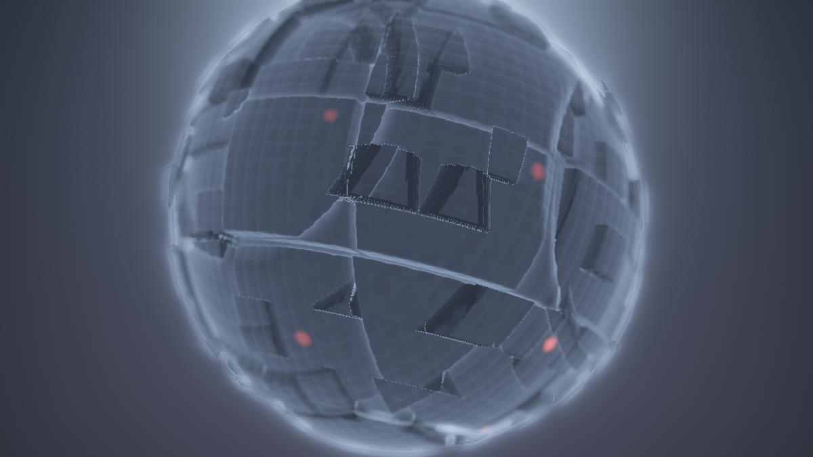

**Ergebnis:** Der fertige Composite-Shader. Die kondensierte Szene liefert lineares HDR plus Tiefe und glättet sich temporal; die Bloom-Kette erntet, verschmiert und mischt das Überstrahlende; die Anrichte faltet (wenn gewünscht), fokussiert, vernebelt und poliert – und `STIMMUNG` dreht die ganze Küche mit. Vier Pässe, ein Common, fünfundzwanzig Stellschrauben.

### Was passiert hier – die Kette im Rückblick

Lies die Tabs noch einmal in Render-Reihenfolge – jeder ist eine Antwort auf eine einzige Frage:

| Pass | Frage | Werkzeug |
|---|---|---|
| Buffer A | Was ist da – und wie weit weg? | Raymarcher + Tiefen-Export + Temporal-Mix |
| Buffer B | Was davon leuchtet – und wie sieht es quer verschmiert aus? | Schwelle + halber Gauß |
| Buffer C | … und ganz verschmiert? | die zweite Gauß-Hälfte |
| Image | Wie wird daraus EIN Bild? | Finish, DOF, Nebel, Mischung, Politur |

Das ist zugleich die Landkarte für eigene Ketten: **Stationen, die je genau eine Frage beantworten, in einer begründeten Reihenfolge, mit einem Monitor auf jeder Leitung.** Wer ab hier eine eigene Post-Küche baut – für eine andere Szene, ein anderes Motiv –, tauscht Buffer A aus und behält den Rest wörtlich. Genau das ist der Punkt der Architektur.

### 🎨 Experimentieren – jetzt am Gesamtwerk

- Drei erprobte Charaktere aus dem Stellschrauben-Brett: `STIMMUNG 0.0 / BLOOM_STAERKE 1.4 / NEBEL 2.0 / FINISH 0` (Dread-Maschine) · `STIMMUNG 1.0 / FINISH 1 / SEKTOREN 8 / FALT_VOR_BLOOM 1.0` (goldene Rosette) · `STIMMUNG 0.4 / FINISH 2 / KACHEL 2.5 / NACHZIEH 0.7 / BLENDE 0.02` (träumender Fliesenspiegel)
- `ANSICHT` einmal durchschalten und die Leitungen im Endzustand betrachten – der Küchen-Monitor ist auch ein Erklär-Werkzeug für Dritte
- Buffer A durch eine *eigene* Szene ersetzen (einzige Pflicht: rgb linear, a = Tiefe, `TIEFE_MAX`-Vertrag) – die gesamte Post-Küche läuft unverändert weiter; das Crystal-Lights-Terrain ist ein dankbarer Kandidat (sein `marchTerrain` liefert `t` frei Haus)

---

# Anhang A: Audio-Reaktivität

Voraussetzung auf shadertoy.com: **iChannel3 mit „Music"** belegen – und zwar **in jedem Pass, der Audio liest** (bei uns: Buffer B und Image; für Mapping 5 auch Buffer A). Wir nehmen bewusst Kanal 3, weil er in *allen* unseren Pässen frei ist – so liest `bandLevel` überall dieselbe Adresse. Die Textur ist 512×2: Zeile 0 (`y ≈ 0.25`) das FFT-Spektrum, Zeile 1 (`y ≈ 0.75`) die Wellenform. Die Grundlagen – `bandLevel`-Bänder, die Milkdrop-vs-Shadertoy-Skalenfalle, Beat-Gates, Envelopes über einen Zustands-Buffer – stehen ausführlich im **Anhang A des Crystal-Lights-Tutorials** (A1/A2 und B3 dort); das wiederholen wir nicht. Hier geht es um das, was eine **Post-Kette** anders macht: Audio steuert nicht das Motiv, sondern die *Küche* – und das ist ein eigenes dramaturgisches Register.

---

## Schritt A1 – Die Infrastruktur (kurz)

**Neu:** Nur das Nötigste, einmal ins **Common** – damit jeder Pass dieselben Werkzeuge hat:

```glsl
// ---- AUDIO (Common) - iChannel3 = Music in jedem lesenden Pass! ------------
float gBass = 0.0, gMid = 0.0, gTreb = 0.0, gVol = 0.0, gGate = 0.0;

float bandLevel(float lo, float hi)
{
    float sum = 0.0;
    const int N = 12;
    for (int i = 0; i < N; i++) {
        float x = mix(lo, hi, (float(i) + 0.5) / float(N));
        sum += texture(iChannel3, vec2(x, 0.25)).x;
    }
    return sum / float(N);
}

// einmal am Anfang von mainImage jedes lesenden Passes aufrufen
void audioFuellen()
{
    gBass = bandLevel(0.00, 0.05);
    gMid  = bandLevel(0.05, 0.25);
    gTreb = bandLevel(0.25, 0.70);
    gVol  = bandLevel(0.00, 0.70);
    gGate = smoothstep(0.60, 0.75, gBass);   // Beat-Gate (Skala: Handarbeit, s. Schablone)
}
```

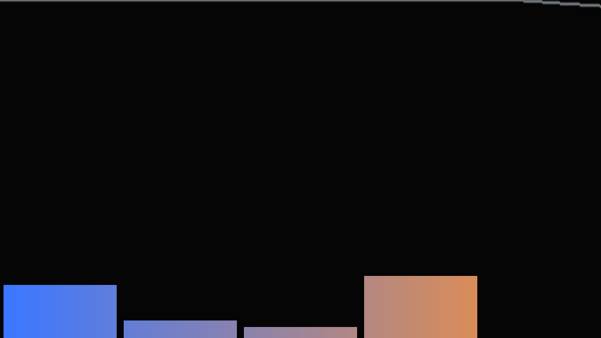

Die Globals wohnen im Common, werden aber **je Pass** gefüllt (jeder Pass ist ein eigenes Programm – `audioFuellen()` am Anfang jedes `mainImage`, das Audio braucht). Wer weiche Envelopes statt roher Pegel will: Das Buffer-Zustandspixel-Muster steht in der Schablone (Crystal Lights, B3) und ließe sich hier in eine Ecke von Buffer A legen.

---

## Schritt A2 – Der Mapping-Katalog: Audio auf die Küchenstationen

Kein neuer Shader – die Landkarte. Das Besondere einer Post-Kette: Die Mappings fassen **nicht die Szene** an, sondern die Verarbeitung – dieselbe Rohware, aber die Küche kocht im Takt. Alle Schnipsel beziehen sich auf das Gesamtlisting aus Schritt 13.

| # | Audio | steuert | Eingriff (Pass) | warum es passt |
|---|---|---|---|---|
| 1 | Bass (kontinuierlich) | **Bloom-Intensität** | Image: `bloom * effBloomStaerke() * (0.5 + 1.5 * gBass)` | **Der Klassiker** – der Beat ist Energie, und Energie ist Überstrahlen; das ganze Bild pulst, ohne dass sich ein Pixel der Szene bewegt |
| 2 | Beat-**Gate** | **Fokus-Kick** (DOF-Puls) | Image: `fokus = FOKUS + FOKUS_HUB * sin(iTime * 0.11) - gGate * 2.5;` | Bei jedem Kick springt die Schärfe-Ebene kurz nach vorn und gleitet zurück – das „Rack Focus" des Kameramanns als Schlagzeug; ein *Kick* auf eine Position, kein Dauer-Mapping (die spinAngle-Warnung der Serie gilt: nie Uhren beschleunigen) |
| 3 | Höhen | **Bright-Pass-Schwelle senken** | Buffer B, in `hell()`: `effSchwelle() * (1.0 - 0.5 * gTreb)` (beide Vorkommen) | Hi-Hats reißen die Schwelle herunter → sekundenweise glüht *alles* ein wenig: die **Glitzer-Explosion**; teuflisch wirksam, sparsam dosieren |
| 4 | Mitten | **Kaleidoskop-Faltungs-Drift** | Common, in `falteWinkel()`: `ang = mod(ang + gMid * 0.5, sektor);` vor dem `abs` | Die Melodie schiebt das Mandala um seine Achse – eine *Amplitude* auf dem Winkel-Offset (Pegel rein, Pegel raus – kein akkumulierender Zustand, darum erlaubt) |
| 5 | Lautheit | **Nachzieh-Länge** | Buffer A: `mix(col, alt, NACHZIEH * (1.0 - 0.6 * min(gVol * 2.0, 1.0)))` | Laute Passagen = kurzes Gedächtnis (knackig), leise = lange Schweife (träumerisch) – die Zeitauflösung des Bildes folgt der Dichte der Musik |

**Die Post-spezifische Warnung: Szene und Küche getrennt halten.** Wer die Juggernaut-Anhang-A-Mappings (Fenster zünden bei `gGate`, STIMMUNG folgt `gVol`) in Buffer A übernimmt *und* die Katalog-Mappings oben aktiviert, baut **Doppel-Mappings**: Der Bass macht die Fenster heller (Szene) → hellere Fenster reißen die Schwelle *ohnehin* stärker → und Mapping 1 verstärkt das Bloom *nochmals* – der Effekt schaukelt sich multiplikativ auf und clippt bei jedem Kick ins Weiße. Die Regel: **Ein Signal → eine Station.** Entweder der Bass zündet die Lichter (Szene reagiert, Küche bleibt neutral) oder er pumpt das Bloom (Szene bleibt stoisch, Küche reagiert) – beides zusammen nur mit halbierten Amplituden und offenen Augen. Der stoische Moloch mit tanzender Küche ist übrigens der interessantere Charakter: *Die Welt bleibt, wie sie ist – nur unser Blick auf sie pulsiert.*

---

## Schritt A3 – Die Küche hört zu

**Neu:** Die Mappings 1–5 wandern in den fertigen Shader – als Diffs gegen das Gesamtlisting aus Schritt 13. Auf shadertoy.com zusätzlich **iChannel3 = Music in Buffer A, Buffer B und Image** setzen.

**(a) Common:** den Audio-Block aus A1 einfügen (unter die eff-Funktionen). In `falteWinkel()` für Mapping 4:

```glsl
    ang = mod(ang + gMid * 0.5, sektor);     // [4] Mitten drehen das Mandala
    ang = abs(ang - 0.5 * sektor);
```

**(b) Buffer A** – Anfang von `mainImage`, plus Mapping 5:

```glsl
    audioFuellen();                                            // iChannel3 = Music!
    // ...
    float nz = NACHZIEH * (1.0 - 0.6 * min(gVol * 2.0, 1.0));  // [5] Lautheit kuerzt
    col = mix(col, alt, nz);                                   //     das Gedaechtnis
```

**(c) Buffer B** – Anfang von `mainImage` ein `audioFuellen();`, und in `hell()`:

```glsl
    float schwelle = effSchwelle() * (1.0 - 0.5 * gTreb);      // [3] Glitzer-Explosion
    return c * smoothstep(schwelle, schwelle + KNIE, lum(c));
```

**(d) Image** – Anfang von `mainImage` ein `audioFuellen();`, dann:

```glsl
    float fokus = FOKUS + FOKUS_HUB * sin(iTime * 0.11)
                - gGate * 2.5;                                 // [2] Fokus-Kick
    // ...
    vec3 col = szeneCol + bloom * effBloomStaerke()
             * (0.5 + 1.5 * gBass);                            // [1] Bass pumpt Bloom
```

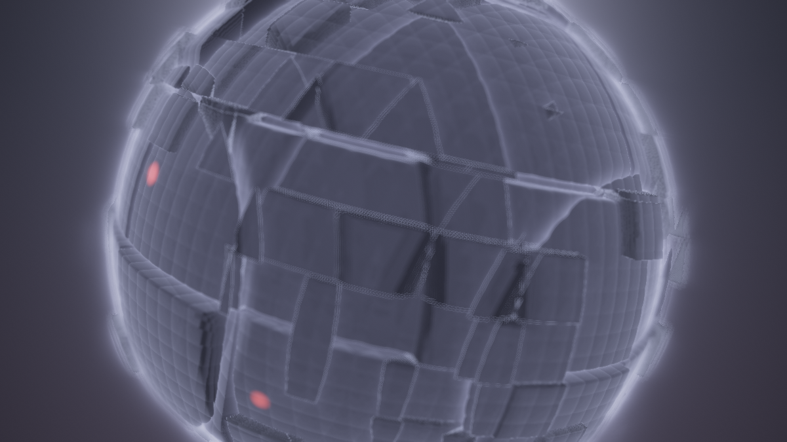

**Ergebnis:** Die Szene dreht stoisch ihre Runden – aber der **Blick** auf sie spielt mit: Jeder Kick lässt das Glühen anschwellen und die Schärfe nach vorn schnappen, Hi-Hats überziehen den Panzer mit sekundenkurzem Glitzern, die Melodie schiebt das Mandala (falls `FINISH = 1`), und in lauten Passagen wird das Bild knackig-direkt, während es in ruhigen in weiche Schweife zurücksinkt. Ohne Musik fällt alles auf den sehenswerten Schritt-13-Stand zurück – die Küchen-Fassung der alten Regel: *Ein Visualizer, der ohne Musik tot ist, ist auch mit Musik meist nur ein VU-Meter.*

### Was passiert hier

Das Kalkül ist dasselbe wie in der ganzen Serie – Faktoren wie `(0.5 + 1.5·gBass)` statt `gBass` pur, damit Stille nicht Schwarz bedeutet –, aber die **Trennung der Zuständigkeiten** ist neu: Alle fünf Mappings leben in der Verarbeitung; `szene()` selbst bleibt byte-identisch zum Schritt-13-Stand. Das macht die Audio-Fassung *überprüfbar* – `ANSICHT = 1` zeigt weiter eine musik-unabhängige Tiefe (Geometrie hört nicht zu), und wer ein Mapping abschalten will, löscht eine Zeile in genau einem Pass. Die riskanteste Zeile ist Mapping 3 (die Schwelle): Sie steuert, *was überhaupt* in die Bloom-Leitung fällt – bei zu viel Hub (`0.5` → `0.9`) glüht in lauten Passagen das ganze Bild und das Tonemapping muss retten, was die Schwelle durchgelassen hat.

### 🎨 Experimentieren

- Nur Mapping 1 aktiv → „das Bild atmet"; nur Mapping 2 → „das Bild blinzelt": zwei Ein-Zeilen-Visualizer mit völlig verschiedenem Charakter
- Mapping 2 mit positivem Vorzeichen (`+ gGate * 2.5`) → der Kick wirft den Fokus in die *Ferne* – wirkt wie ein erschrockenes Zurückweichen
- Die Juggernaut-Hommage: zusätzlich `STIMMUNG` audio-fahren (dort Anhang A) – dann aber Mapping 1 und 3 halbieren (Doppel-Mapping-Warnung aus A2!)
- `gGate` auf `VIGNETTE`: `1.0 - (VIGNETTE - gGate * 0.15) * dot(uv, uv)` → das Bild „öffnet sich" bei jedem Beat um die Ränder – subtil und sehr wirksam

---

# Anhang B: Der Weg in die App – kompakt

Die Grundlagen stehen in der Schablone und werden hier nicht wiederholt: **Die drei Import-Wege** (Copy & Paste in den Shadertoy-Node, URL-/ID-Import mit App-Key, Shadertoy-Browser-Panel), **die Portabilitäts-Checkliste und der Audio-Adapter** (`aBass()`-Weiche statt fest verdrahtetem `bandLevel`) stehen im **Crystal-Lights-Shader-Tutorial, Anhang B**; die Multipass-Besonderheiten beim Import hat das **Pimped-Kaleidoscope-Tutorial, Anhang B1** vorgeführt. Unser Shader hält dieselben Konventionen (nur Standard-Uniforms, STELLSCHRAUBEN im Common) – alle Wege funktionieren unverändert. Hier nur, was an *diesem* Shader besonders ist – und die eine konzeptionelle Brücke, für die er wie kein zweiter taugt. *(UI-Namen und Verhalten: Stand Session 65/67.)*

## B1 – Multipass-Import: die Vier-Pass-Topologie

Der Shadertoy-Node der Effect-Chain unterstützt Buffer A–D als eigene Pässe mit frei verdrahtbaren Kanälen – unsere Topologie (A liest sich selbst, B liest A, C liest B, Image liest A + C) passt ohne Umbau:

- **Beim URL-Import** wird die Buffer-Topologie **automatisch aufgelöst** – Pässe, Kanal-Zuordnungen und die Selbstreferenz von Buffer A landen fertig verdrahtet im Node; der Common-Inhalt wird jedem Pass vorangestellt (exakt die Semantik, auf die unser Gesamtlisting gebaut ist).
- **Bei Copy & Paste** die fünf Blöcke aus Schritt 13 einzeln in die Pass-Felder des Node-Editors kopieren und die Kanäle nach der Verdrahtungstabelle (Schritt 13) von Hand setzen. Die Tabelle ist dabei wichtiger als der Code: **Vier der fünf denkbaren Nachbau-Fehler dieses Tutorials sind Verdrahtungsfehler.**
- **Selbstreferenz und Kaltstart** verhalten sich wie auf shadertoy.com: Ein Pass mit sich selbst als Eingang liest das Vorframe (Ping-Pong), und nach Laden/Resize/Puffer-Löschen startet Buffer A schwarz – unser Temporal-Mix schwingt sich in einem Sekundenbruchteil ein (gutmütiger Kandidat; das Puffer-Wechsel-Verhalten je Node und das optionale Start-Fade-in der App greifen hier sichtbar).
- **Determinismus:** kein echter Zufall, alle Uhren auf `iTime` – mit der deterministischen Sim-Uhr der App ist jede Frame-Folge reproduzierbar, Temporal-Mix eingeschlossen.

## B2 – Die Brücke: diese Post-Kette IST eine Effect-Chain

Und damit zur eigentlichen Pointe dieses Anhangs. Was wir in dreizehn Schritten gebaut haben – Stationen, die Texturen weiterreichen; jede mit eigener Aufgabe und eigenen Reglern; eine begründete Reihenfolge – **ist architektonisch exakt das, was in LumiViz die Effect-Chain macht**: Ein Post-Pass entspricht einem Chain-Node, die iChannel-Verdrahtung dem Datenfluss zwischen Nodes, der Küchen-Monitor der Vorschau je Node. Wer dieses Tutorial durchgearbeitet hat, hat verstanden, *warum* die Effect-Chain so gebaut ist, wie sie ist.

Daraus folgt eine echte Design-Entscheidung: **Wann gehört ein Post-Effekt IN den Shader (In-Shader-Multipass, wie hier) – und wann wird er besser ein eigener Chain-Node?**

**In den Shader gehört er, wenn er zum *Werk* gehört:**

- Er braucht **Nebenkanal-Wissen** der Szene – unser DOF und Nebel lesen die Tiefe aus dem Alpha; ein generischer Chain-Node hinter einem beliebigen Visualizer wüsste von dieser Tiefe nichts (der Vertrag „a = Marsch-Distanz" ist eine private Abmachung zwischen unseren Pässen).
- Seine Parameter sind mit der Szene **gekoppelt** – die STIMMUNGs-Kopplung aus Schritt 12 lebt davon, dass Szene und Post dasselbe Common lesen.
- Das Ganze soll **eine importierbare Einheit** bleiben: eine URL, ein Node, ein Kunstwerk mit eingebautem Look.

**Ein Chain-Node wird er, wenn er zur *Bühne* gehört:**

- Er ist **generisch** – unsere Bloom-Kette (Schwelle → H → V → Mix) enthält keine einzige Moloch-Zeile; als Node-Paar würde sie *jeden* Visualizer der App veredeln, vom Equalizer bis zum Milkdrop-Preset. Genau das ist Milkdrops `GetBlur1/2/3`-Modell: Blur als **Infrastruktur**, die jedes Preset gratis bekommt – und die Effect-Chain ist LumiViz' Weg, solche Infrastruktur ohne Shader-Kenntnis zusammenzustecken.
- Er soll im **Panel** geregelt, einzeln an- und abgeschaltet oder hinter *verschiedene* Quellen gehängt werden.
- Er braucht Fähigkeiten, die ein Shadertoy-Pass nicht hat – echte **Halbbild-Auflösung** etwa (die Schritt-5-Fußnote): ein nativer Bloom-Node kann seine Zwischenbilder wirklich verkleinern, statt die Schrittweite zu spreizen.

Faustregel: **Gehört der Effekt zum Werk → in den Shader. Gehört er zur Bühne → in die Chain.** Unser Shader ist bewusst ein Grenzgänger – DOF/Nebel/Kopplung sind Werk (bleiben drin), das Bloom ist der geborene Bühnen-Kandidat (die lohnendste Portierungs-Übung, die dieses Tutorial hinterlässt).

---

## Abspann

Damit ist die Küche komplett: eine kondensierte Szene, die lineares HDR und ihre Tiefe liefert; ein Bright-Pass mit Knie; ein separierbarer Gauß in zwei Pässen samt Kostenrechnung; Tiefenschärfe und Tiefen-Nebel aus dem Alpha-Kanal; ein Kaleidoskop-Finish mit einer Reihenfolge-Debatte; ein zahmes Temporal-Feedback; und eine Politur, die endlich am Ende der Kette wohnt – alles an einer STIMMUNGs-Blende, die von der Szene bis in die Nachbearbeitung reicht.

Zwei ehrliche Hinweise zum Schluss:

- **Dieses Tutorial ist am Schreibtisch konstruiert – und inzwischen in LumiViz gegengerendert:** Alle Schritte laufen als Chains im AvsStandalone (die Screenshots bei den Schritten; Einleitung und `composite_postfx_schritte/`), jeder Stand kompiliert dort ohne Warnung; auf shadertoy.com selbst wurde weiterhin kein Schritt geprüft, dort sind Überraschungen möglich. Eine ästhetische Fehleinschätzung hat das lebende Bild bereits gefunden: In der dark-Stimmung liegt keine Lichtquelle **lum-gewichtet** über `SCHWELLE = 0.7` – die „~1.4" der Fenster ist ihr Rot-Kanal, `lum()` drückt sie auf ~0.53 – und die Bloom-Leitung blieb praktisch leer; die Chains rendern darum mit `SCHWELLE = 0.3`, dem Wert aus dem 🎨-Kasten von Schritt 4 (auf shadertoy.com selbst nachprüfen und nachziehen). Bei einer Multipass-Küche bleibt daneben die häufigste Fehlerquelle: **die Verdrahtung.** Bleibt das Bild schwarz oder seltsam, zuerst die Kanal-Tabelle aus Schritt 13 gegen die Kanal-Leisten prüfen – dann erst den Code verdächtigen. Und die Stimm-Reihenfolge, wenn es klemmt, liefert der Küchen-Monitor gleich mit: erst `ANSICHT = 1` (stimmt die Tiefe?), dann `ANSICHT = 2` (stimmt die Bloom-Leitung?), erst zuletzt das fertige Bild beurteilen – eine Kette repariert man Station für Station, nie am Endprodukt.
- **Post-Parameter sind Verhältnis-Größen.** `SCHWELLE`, `BLOOM_STAERKE` und die Tonemapping-Belichtung greifen ineinander wie die dark-Konstanten des Juggernaut-Tutorials: Wer eine ändert, zieht praktisch immer eine zweite nach (Schwelle runter → Stärke runter, sonst Matsch). Und zwei Abhängigkeiten von der Umgebung bleiben trotz aller Sorgfalt: Der Promille-Blur ist auflösungs-normiert, aber sein *Lücken-Risiko* nicht (Schritt 5), und der Temporal-Mix hängt an der Framerate (bei 30 fps wirkt `NACHZIEH = 0.35` doppelt so lang wie bei 60). Ein Vollbild-Lauf ist ein anderes Tier als das Editor-Fenster – einmal gegenprüfen.

Wer weitermachen will: Fast jeder 🎨-Kasten ist ein eigener Shader – besonders ergiebig sind die echte Blur-Kaskade über Buffer D (Schritt 6), das tap-gefaltete DOF (Schritt 8) und die Crystal-Lights-Szene hinter dieser Küche (Schritt 13). Und wer die Brücke aus Anhang B2 begehen will: Die Bloom-Kette als generische Chain-Nodes nachzubauen ist die Übung, bei der aus dem Shadertoy-Wissen App-Architektur-Wissen wird.

Screenshots: gerendert mit AvsStandalone (Testing-Build), Chains in `composite_postfx_schritte/`.

Und jetzt: Musik an. 🎵🔭


