# Composite: Transitions – Zwei Welten, ein Werk

**Ziel:** Ein Programm, das **endlos zwischen zwei fertigen Shadern dieser Tutorial-Serie wechselt** – dem bunten, kalten **Kristall-Terrain** aus *Crystal Lights* und dem monochrom-dunklen **Juggernaut**-Moloch – und dabei alle Spielarten des **Übergangs** beherrscht: harter Schnitt, Crossfade, Verweil-Plateaus, maskierte Wipes mit glühender Wechselfront, Parameter-Morph, eine Kamera, die beide Welten trägt, und am Ende ein **beat-getriggerter Wechsel** über eine Zustandsmaschine in Buffer A. Das ist das Shadertoy-Analogon zum **Milkdrop-Preset-Wechsel**: Nicht die Welten sind diesmal das Thema, sondern der Moment dazwischen.

**Stil-Vorbilder** (diesmal keine Presets, sondern zwei Tutorials dieser Serie – beide im selben Ordner – plus eine Maschine):

- *CrystalLights-tutorial.md* – **Welt A**: das halbliquide Kristall-Terrain über blinkenden `1/d²`-Leuchtkörpern. Wir übernehmen sein Höhenfeld, sein Lampenraster, seine Brechung – als kompaktes Skelett.
- *Juggernaut-tutorial.md* – **Welt B**: der kolossale Moloch im Dunst, dark-Stimmung, God-Ray-Glow, Positionslichter. Ebenfalls als Skelett. Die beiden Welten sind mit Absicht **maximal verschieden**: Terrain vs. Objekt, bunt vs. monochrom-dunkel, Blick von oben vs. Low-Angle-Orbit – wenn der Übergang *dieses* Paar schafft, schafft er jedes.
- **MilkDrops Preset-Blende** als konzeptionelles Vorbild: Beim Preset-Wechsel rendert MilkDrop für kurze Zeit **beide** Presets und mischt sie über gemusterte Blend-Masken (Wipes, Plasma-Fronten), während die Preset-Parameter weich ineinander übergehen. Genau diese zwei Herzstücke – **Maske** und **Parameter-Morph** – bauen wir in GLSL nach, plus das dritte, das ein Preset-Player gratis hat und ein Shader sich verdienen muss: den **Wechsel auf ein Ereignis** (Beat), also Zustand.

**So funktioniert dieses Tutorial:**

- Es läuft **direkt auf Shadertoy**: Jeder Schritt ist ein vollständiger, lauffähiger Shader. Kopiere ihn nach [shadertoy.com/new](https://www.shadertoy.com/new), drücke `Alt+Enter` – fertig. Ab Schritt 11 kommt ein zweiter Pass (Buffer A) dazu – der Einbau steht dort Schritt für Schritt.
- Jeder Schritt fügt **genau eine Technik** hinzu; unter jedem Schritt stehen Variationsideen (🎨).
- Die Reihenfolge folgt der Schule der Serie, aber die Phasen heißen diesmal anders: **Skelette → Blende → Maske → Morph → Zustand → Politur.** Erst müssen beide Welten stehen, dann wird der Übergang gebaut – vom naiven Fehlstart bis zur Zustandsmaschine.
- **In LumiViz:** Jeder Schritt liegt zusätzlich als lauffähige Chain in `composite_transitions_schritte/` (generiert aus diesem Dokument per `make_schritte.py` – das Markdown ist die SSOT; Schritte 1–10 als Ein-Node-Single-Pass, ab Schritt 11 als Multipass-Shadertoy-Node Buffer A + Image, das Common des Gesamtlistings wird dabei beiden Pässen vorangestellt). Die Screenshots bei den Schritten stammen aus genau diesen Chains, gerendert im AvsStandalone (`AvsStandalone <gruppe> --auto --frames N --size 800x450 --out composite_transitions_bilder`) – weil Übergangs-Schritte ihren Charakter nur **mitten in der Blende** zeigen, rendert jede Schritt-Gruppe bis zu einem eigens aus den Timing-Konstanten gerechneten Frame (Sim-Uhr des Standalone: fest 1/60 s je Frame; die Wahl je Schritt dokumentiert `make_schritte.py`). Eine dokumentierte LumiViz-Anpassung steckt NUR in den generierten Anhang-Chains, die Codeblöcke hier bleiben Shadertoy-treu: `schlag` kommt dort aus dem App-Uniform `beat`, denn die dB-FFT des Standalone-Testsignals sättigt bei 1.0, und der adaptive Trigger aus A1 kann an einem konstant gesättigten Band nie feuern (die B1-Regel; der Timer-Kern der Schritte 3–12 ist davon unberührt und wechselt deterministisch).
- Vorausgesetzt sind die beiden Quell-Tutorials (mindestens ihre Gesamtlistings und „Bauplan"-Kapitel) – die Welten selbst erklären wir hier **nicht** noch einmal, sondern kondensieren sie. Die Kondensier-Technik als eigenes Thema (was darf raus, was muss bleiben) behandelt das Portals-Composite-Tutorial ausführlicher; hier wenden wir sie nur an, und zwar so, dass jeder Schritt trotzdem für sich lauffähig ist.

**Inhalt**

| Phase | Schritte | Thema |
|---|---|---|
| Skelette | 1–3 | Welt A kondensiert, Welt B kondensiert, der harte Schnitt |
| Blende | 4–5 | Der naive Crossfade (und warum er flau ist), Übergangs-Kurven & Plateaus |
| Maske | 6–8 | Noise-Wipe mit Glühsaum, Radial-/Richtungs-Wipe, Masken-Early-Out |
| Morph | 9–10 | Parameter-Morph statt Bild-Mix, Kamera-Kontinuität |
| Zustand | 11 | Zustandsmaschine in Buffer A – der Wechsel als Ereignis (Timer-Modus) |
| Politur | 12 | Kohärenz, Wechsel-Akzente, Anti-Flau-Checkliste – das fertige Werk |
| Anhang A | A1–A3 | Audio: der beat-getriggerte Wechsel (Kernthema, voll ausgeführt) |
| Anhang B | B1–B2 | LumiViz: In-Shader-Übergang vs. Chain-Wechsel in der App |

---

## Der Bauplan: Was wir eigentlich rendern

Diesmal ist die Architektur keine Raumaufteilung, sondern eine **Zeitachse** – der ewige Kreislauf aus Halten und Wechseln:

```
zeit ─────────────────────────────────────────────────────────────────────►
│■■■■■ HALTEN A ■■■■■│░░ BLENDE ░░│■■■■■ HALTEN B ■■■■■│░░ BLENDE ░░│■ A …
│                    │            │                    │
│  Kristall-Terrain  │  3 Dinge   │  Juggernaut pur    │  3 Dinge
│  pur (nur Welt A   │  zugleich: │  (nur Welt B       │  (rueckwaerts)
│  wird gerechnet)   │            │  wird gerechnet)   │
                     │  1. MORPH: Parameter beider Welten
                     │     wachsen aufeinander zu (global)
                     │  2. MASKE: eine Front wandert durchs
                     │     Bild, jedes Pixel kippt einzeln
                     │  3. AKZENT: Gluehsaum an der Front,
                     │     Belichtungs-Kick im Wechselmoment
```

Drei Erkenntnisse stecken in dieser Skizze, und sie ordnen die Schritte:

1. **Das Halten ist der Normalzustand.** Die pure Welt dominiert die Zeit – und im Halten darf pro Pixel auch nur *eine* Welt gerechnet werden (Performance!). Der Übergang ist das Ereignis, nicht der Dauerzustand. Der naive Crossfade (Schritt 4) verletzt genau das – deshalb ist er unser lehrreicher Fehlstart.
2. **Der Übergang hat drei Ebenen**, die unabhängig gebaut und dann gestapelt werden: der globale **Morph** (die Welten kommen sich entgegen, *bevor* sie sich mischen), die örtliche **Maske** (welche Welt gewinnt *dieses* Pixel?) und der **Akzent** (der Wechsel ist ein Auftritt, kein Unfall).
3. **„Wechsel auf Ereignis" braucht Gedächtnis.** Solange die Zeitachse eine reine Funktion von `iTime` ist (Schritte 3–10), ist alles deterministisch und zustandsfrei – aber der Wechsel kann nur nach *Fahrplan* kommen. Ein Wechsel, der auf einen Beat wartet, braucht einen Buffer (Schritt 11 als Timer, Anhang A mit Audio).

---

## Schritt 1 – Welt A als Skelett: das Kristall-Terrain, kondensiert

**Neu:** Der komplette Crystal-Lights-Shader, auf sein tragendes Skelett reduziert und mit dem Präfix `a_` in einen **Namensraum** gestellt – die Vorbereitung darauf, dass gleich eine zweite Welt in dieselbe Datei zieht.

```glsl
// ============================================================================
// COMPOSITE: TRANSITIONS - Schritt 1: Welt A als Skelett (Kristall-Terrain)
// Vollausbau und Herleitung: Crystal-Lights-Shader-Tutorial (gleicher Ordner)
// ============================================================================

// ---- STELLSCHRAUBEN --------------------------------------------------------
const float A_TIEFE = -1.8;   // y der Lichtebene unter dem Terrain
const float A_ZELLE = 1.7;    // Rasterabstand der Leuchtkoerper
// ----------------------------------------------------------------------------

#define R(a) mat2(cos(a), sin(a), -sin(a), cos(a))

// ---- gemeinsamer Zufalls-Baukasten (den teilen sich spaeter BEIDE Welten) --
float hash21(vec2 p) { return fract(sin(dot(p, vec2(127.1, 311.7))) * 43758.5453); }

vec2 hash22(vec2 p)
{
    return fract(sin(vec2(dot(p, vec2(127.1, 311.7)),
                          dot(p, vec2(269.5, 183.3)))) * 43758.5453);
}

float vnoise(vec2 p)
{
    vec2 i = floor(p), f = fract(p);
    vec2 u = f * f * (3.0 - 2.0 * f);
    return mix(mix(hash21(i),              hash21(i + vec2(1, 0)), u.x),
               mix(hash21(i + vec2(0, 1)), hash21(i + vec2(1, 1)), u.x), u.y);
}

float fbm(vec2 p)
{
    float v = 0.0, a = 0.5;
    for (int i = 0; i < 4; i++) { v += a * vnoise(p); p = p * 2.03 + 11.7; a *= 0.5; }
    return v;
}

// ---- WELT A: Kristall-Terrain (Skelett) ------------------------------------

float a_terrain(vec2 p) { return (fbm(p * 0.35) - 0.45) * 2.4; }

float a_march(vec3 ro, vec3 rd)
{
    float t = 0.0;
    for (int i = 0; i < 90; i++) {              // Skelett: 90 statt 150 Schritte
        vec3 p = ro + rd * t;
        float d = p.y - a_terrain(p.xz);
        if (d < 0.002 + 0.002 * t) return t;
        if (t > 30.0) break;
        t += d * 0.45;
    }
    return -1.0;
}

vec3 a_normal(vec2 p, float t)
{
    vec2 e = vec2(0.014 * (1.0 + t * 0.12), 0.0);
    return normalize(vec3(a_terrain(p - e.xy) - a_terrain(p + e.xy),
                          2.0 * e.x,
                          a_terrain(p - e.yx) - a_terrain(p + e.yx)));
}

vec3 a_lampColor(float t)
{
    return 0.55 + 0.45 * cos(6.28318 * (t + vec3(0.0, 0.33, 0.67)));
}

float a_blink(vec2 id)
{
    float ph = hash21(id + 31.7);
    float sp = 0.35 + 0.75 * hash21(id + 17.3);
    float w  = 0.5 + 0.5 * sin(6.28318 * (iTime * sp * 0.25 + ph));
    return smoothstep(0.70, 0.97, w) * (0.2 + 0.8 * hash21(id + 5.1));
}

vec3 a_lights(vec2 q)
{
    vec2 base = floor(q / A_ZELLE);
    vec3 acc = vec3(0.0);
    for (int y = -1; y <= 1; y++)
    for (int x = -1; x <= 1; x++) {
        vec2 id = base + vec2(float(x), float(y));
        vec2 c  = (id + 0.5 + 0.7 * (hash22(id + 7.0) - 0.5)) * A_ZELLE;
        vec2 d  = q - c;
        float hell = a_blink(id) + 0.05;
        acc += a_lampColor(hash21(id)) * hell / (0.02 + dot(d, d) * 14.0);
    }
    return acc * 0.05;
}

vec3 a_himmel(vec3 rd)
{
    return mix(vec3(0.10, 0.12, 0.22), vec3(0.02, 0.03, 0.08),
               clamp(rd.y * 3.0, 0.0, 1.0));
}

// liefert LINEARE Farbe - das Tonemapping macht am Ende das Composite
vec3 a_render(vec3 ro, vec3 rd)
{
    float t = a_march(ro, rd);
    vec3 col;
    if (t > 0.0) {
        vec3 p = ro + rd * t;
        vec3 n = a_normal(p.xz, t);

        vec3 rr = refract(rd, n, 1.0 / 1.45);       // Brechung in den Kristall
        if (dot(rr, rr) < 0.5) rr = rd;
        float tE = (A_TIEFE - p.y) / min(rr.y, -0.05);
        vec2 q = (p + rr * tE).xz;

        float dicke = max(p.y - A_TIEFE, 0.0);
        vec3 T = exp(-dicke * vec3(0.85, 0.30, 0.16) * 0.55);   // Beer-Lambert

        col = a_lights(q) * T;                       // gebrochenes Lampenlicht

        float fres = pow(1.0 - max(dot(n, -rd), 0.0), 3.0);
        col += fres * vec3(0.35, 0.50, 0.65) * 0.5;  // Himmel-Spiegelung
        col += max(dot(n, normalize(vec3(0.4, 0.75, -0.5))), 0.0)
             * vec3(0.10, 0.14, 0.20);               // Mond-Schimmer

        col = mix(col, vec3(0.05, 0.07, 0.12),       // Distanznebel
                  1.0 - exp(-0.0018 * t * t));
    } else {
        col = a_himmel(rd);
    }
    return col;
}

void a_kamera(vec2 uv, out vec3 ro, out vec3 rd)
{
    ro = vec3(0.0, 2.8, iTime * 0.8);               // Vorwaertsflug wie im Original
    rd = normalize(vec3(uv, 1.3));
    rd.yz *= R(-0.12);
}

void mainImage(out vec4 fragColor, in vec2 fragCoord)
{
    vec2 uv = (fragCoord - 0.5 * iResolution.xy) / iResolution.y;

    vec3 ro, rd;
    a_kamera(uv, ro, rd);
    vec3 col = a_render(ro, rd);

    // Abschluss - vorerst je Welt eigener; wird in Schritt 9 EINER fuer beide
    col = 1.0 - exp(-col * 1.5);
    col = pow(col, vec3(1.0 / 2.2));
    col *= 1.0 - 0.33 * dot(uv, uv);

    fragColor = vec4(col, 1.0);
}
```

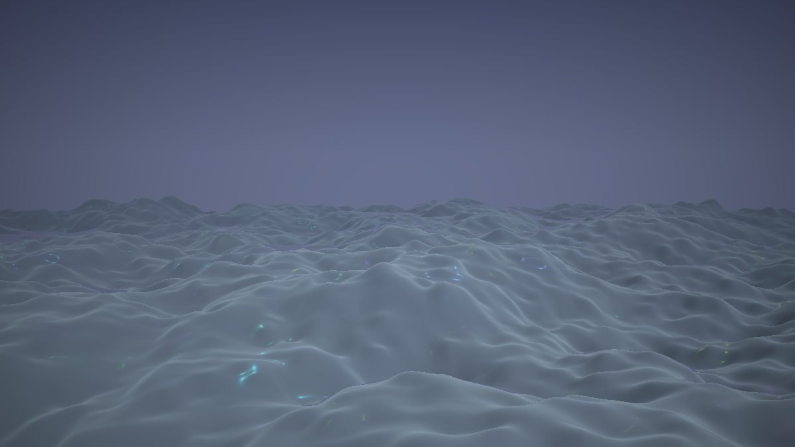

**Ergebnis:** Das Kristall-Terrain aus dem Crystal-Lights-Tutorial, wiedererkennbar auf einen Blick: eisblaue Hügel, farbig blinkende Lampen unter dem Material, Fresnel-Glanz. Aber merklich schlanker – keine Voronoi-Platten, kein Liquiditätsfeld, keine Lücken, keine Iso-Kamera.

### Was passiert hier – die Kunst des Kondensierens

Vier Entscheidungen machen aus 250 Zeilen Vollausbau ein ~150-Zeilen-Skelett, und jede folgt derselben Frage: **Was macht die Welt *erkennbar*, was macht sie nur *reicher*?**

1. **Behalten: die Identität.** FBM-Terrain, `1/d²`-Lampenraster mit Blink-Dramaturgie, Brechung + Beer-Lambert-Absorption, die Eis-Palette. Ohne diese vier ist es nicht mehr Crystal Lights.
2. **Gestrichen: die Binnendifferenzierung.** Voronoi-Facetten, Liquiditätsfeld, Lückenmaske, Glow/Sparkle – alles Ebenen, die die Welt *in sich* interessanter machen. In einem Composite hat jede Welt nur wenige Sekunden Auftritt am Stück; die Feinheiten sähe niemand, aber bezahlen müsste sie jedes Pixel.
3. **Gesenkt: die Schrittzahlen.** 90 statt 150 Marsch-Schritte, 4 statt 5 FBM-Oktaven, Sichtweite 30 statt 45. Das ist Vorsorge: Im Misch-Saum des Übergangs rechnen wir später **beide** Welten pro Pixel (Schritt 8 macht die Rechnung auf) – die Skelette müssen sich das Doppel leisten können.
4. **Umgebaut: die Schnittstelle.** `a_render(ro, rd)` liefert **lineare** Farbe zurück – Tonemapping, Gamma und Vignette wandern nach `mainImage`. Das wirkt jetzt pedantisch und ist in Schritt 9 die halbe Miete: Mischen muss man *vor* dem Entwickeln.

Das Präfix `a_` an jeder Funktion und Konstante ist das **Namespacing**: GLSL kennt keine Module – zwei Welten in einer Datei überleben nur, wenn ihre Namen es tun. Der Zufalls-Baukasten (`hash*`, `vnoise`, `fbm`) bleibt bewusst **unpräfixiert**: Er ist Allgemeingut, und die Übergangs-Maske wird ihn später selbst brauchen.

### 🎨 Experimentieren

- Die Schrittzahl weiter senken (`90` → `50`): Wo bricht die Terrain-Silhouette zuerst? Das ist die Reserve, die im Saum später draufgeht
- Eine gestrichene Ebene zurückholen (z. B. das Liquiditätsfeld aus Crystal-Lights Schritt 7) und den Preis im Shadertoy-FPS-Zähler ablesen
- `a_`-Präfix probeweise entfernen und in Gedanken Schritt 3 vorwegnehmen: welche Namen kollidieren? (`terrain` nicht – aber `R`, `hash21`, und später `map`/`march`/`kamera` sehr wohl)

---

## Schritt 2 – Welt B als Skelett: der Juggernaut, kondensiert

**Neu:** Dieselbe Kondensier-Übung für die zweite Welt – der Moloch aus dem Juggernaut-Tutorial im `b_`-Namensraum, festgenagelt auf seine **dark**-Stimmung (maximaler Kontrast zu Welt A).

```glsl
// ============================================================================
// COMPOSITE: TRANSITIONS - Schritt 2: Welt B als Skelett (Juggernaut, dark)
// Vollausbau und Herleitung: Juggernaut-Shader-Tutorial (gleicher Ordner)
// ============================================================================

#define R(a) mat2(cos(a), sin(a), -sin(a), cos(a))

float hash31(vec3 p) { return fract(sin(dot(p, vec3(127.1, 311.7, 74.7))) * 43758.5453); }

float smin(float a, float b, float k)
{
    float h = max(k - abs(a - b), 0.0) / k;
    return min(a, b) - h * h * k * 0.25;
}
float smax(float a, float b, float k) { return -smin(-a, -b, k); }

// ---- WELT B: Juggernaut (Skelett, dark) ------------------------------------

const float B_RADIUS = 6.0;    // Radius des Molochs
const float B_ZELLE1 = 2.6;    // grosse Platten
const float B_ZELLE2 = 0.9;    // Raster der Positionslichter
const float B_ZELLE3 = 0.32;   // feine Rillen

vec3 b_sonne = vec3(0.0, 0.3, 1.0);   // setzt die Kamera je Frame (Gegenlicht)

vec3 b_gedreht(vec3 p)
{
    p.yz *= R(0.42);                   // schiefe Achse
    p.xz *= R(iTime * 0.02);           // traege Eigendrehung
    return p;
}

float b_fugen(vec3 p, float zelle)
{
    vec3 q = abs(fract(p / zelle) - 0.5) * zelle;
    return zelle * 0.5 - max(q.x, max(q.y, q.z));
}

float b_map(vec3 p)
{
    vec3 q = b_gedreht(p);
    float d = length(q) - B_RADIUS;

    vec3 z1 = floor(q / B_ZELLE1);                    // Oktave 1: grosse Platten
    d -= (hash31(z1) - 0.5) * 0.35;

    float slab   = b_fugen(q, B_ZELLE1) - 0.07;       // Panelfugen, weich abgezogen
    float schale = (B_RADIUS - 0.30) - length(q);
    d = smax(d, -max(slab, schale), 0.05);

    vec3 h = pow(abs(2.0 * fract(q / B_ZELLE3) - 1.0), vec3(3.0));
    d += 0.02 * (h.x + h.y + h.z) * 0.33;             // Oktave 3: feine Rillen

    return d;
}

float b_march(vec3 ro, vec3 rd, out float glow)
{
    glow = 0.0;
    float t = 0.0;
    for (int i = 0; i < 110; i++) {           // Skelett: 110 statt 160 Schritte
        vec3 p = ro + rd * t;
        float d = b_map(p);
        glow += 0.012 / (0.05 + d * d);       // God-Ray-Saat: Naehe zum Moloch
        if (d < 0.001 + 0.001 * t) return t;
        if (t > 40.0) break;
        t += d * 0.5;                          // Displacement -> Drossel 0.5
    }
    return -1.0;
}

vec3 b_normal(vec3 p)
{
    const vec2 e = vec2(0.004, 0.0);
    return normalize(vec3(b_map(p + e.xyy) - b_map(p - e.xyy),
                          b_map(p + e.yxy) - b_map(p - e.yxy),
                          b_map(p + e.yyx) - b_map(p - e.yyx)));
}

float b_fenster(vec3 q)
{
    vec3 z = floor(q / B_ZELLE2);
    float an = step(0.93, hash31(z + 29.0));
    float sp = 0.10 + 0.25 * hash31(z + 3.0);
    float w  = 0.5 + 0.5 * sin(6.28318 * (iTime * sp + hash31(z + 11.0)));
    float blink = 0.25 + 0.75 * smoothstep(0.55, 0.95, w);
    vec3 lokal = (fract(q / B_ZELLE2) - 0.5) * B_ZELLE2;
    float punkt = 1.0 - smoothstep(0.06, 0.24, length(lokal));
    return an * blink * punkt;
}

vec3 b_himmel(vec3 rd)
{
    vec3 col = mix(vec3(0.030, 0.028, 0.045), vec3(0.010, 0.012, 0.022),
                   clamp(rd.y * 1.5 + 0.5, 0.0, 1.0));
    float s = max(dot(rd, b_sonne), 0.0);
    col += pow(s, 30.0) * vec3(0.35, 0.42, 0.60) * 1.2;   // fahle Streu-Sonne
    col += pow(s, 5.0)  * vec3(0.35, 0.42, 0.60) * 0.12;
    return col;
}

vec3 b_shade(vec3 p, vec3 rd)
{
    vec3 n = b_normal(p);
    vec3 albedo = vec3(0.16, 0.17, 0.19);        // dunkles, mattes Metall

    float dif = max(dot(n, b_sonne), 0.0);
    float amb = 0.5 + 0.5 * n.y;
    vec3 col = albedo * (dif * vec3(0.30, 0.38, 0.55) * 0.6
                       + amb * vec3(0.020, 0.025, 0.045));

    float rim = pow(1.0 - max(dot(n, -rd), 0.0), 3.0);
    col += rim * vec3(0.30, 0.38, 0.55) * 0.55;  // Silhouetten-Saum (traegt dark)

    col += b_fenster(b_gedreht(p)) * vec3(1.0, 0.12, 0.08) * 1.4;  // rote Lichter

    return col;
}

// liefert LINEARE Farbe - gleiche Schnittstelle wie a_render
vec3 b_render(vec3 ro, vec3 rd)
{
    float glow;
    float t = b_march(ro, rd, glow);
    vec3 col;
    if (t > 0.0) {
        col = b_shade(ro + rd * t, rd);
        col = mix(col, vec3(0.020, 0.024, 0.040),     // dichter dark-Dunst
                  1.0 - exp(-0.0035 * t * t));
    } else {
        col = b_himmel(rd);
    }
    col += glow * 0.05 * vec3(0.28, 0.34, 0.55);      // God-Ray-Glow
    return col;
}

void b_kamera(vec2 uv, out vec3 ro, out vec3 rd)
{
    float zt = iTime;
    float wink   = 2.6 * sin(zt * 0.021);                       // Orbit + Umkehr
    float radius = mix(8.5, 13.0, 0.5 + 0.5 * sin(zt * 0.013));
    float hoehe  = mix(-3.2, 0.6, 0.5 + 0.5 * sin(zt * 0.017));

    ro = vec3(sin(wink) * radius, hoehe, cos(wink) * radius);
    vec3 ta = vec3(0.0, 1.2, 0.0);

    vec3 fw = normalize(ta - ro);
    vec3 rt = normalize(cross(vec3(0.0, 1.0, 0.0), fw));
    vec3 up = cross(fw, rt);
    rd = normalize(fw * 1.1 + rt * uv.x + up * uv.y);           // Weitwinkel

    b_sonne = normalize(fw + vec3(0.0, 0.35, 0.0));  // Sonne HINTER dem Orb
}

void mainImage(out vec4 fragColor, in vec2 fragCoord)
{
    vec2 uv = (fragCoord - 0.5 * iResolution.xy) / iResolution.y;

    vec3 ro, rd;
    b_kamera(uv, ro, rd);
    vec3 col = b_render(ro, rd);

    col = 1.0 - exp(-col * 2.3);       // dark braucht mehr Belichtung (s. Original)
    col = pow(col, vec3(1.0 / 2.2));
    col *= 1.0 - 0.33 * dot(uv, uv);

    fragColor = vec4(col, 1.0);
}
```

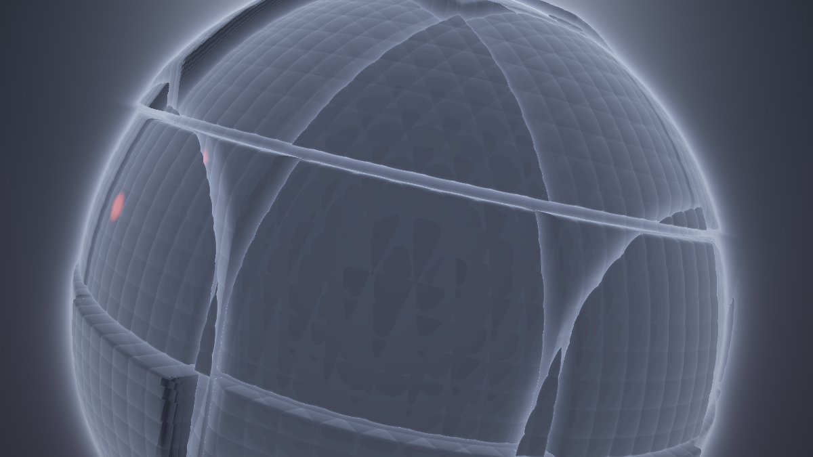

**Ergebnis:** Der Moloch in seiner dark-Stimmung: eine fast schwarze, gepanzerte Masse, träge rotierend im dichten Dunst, rote Positionslichter, kalter Silhouetten-Saum, Glow um die Kontur. Auch hier: erkennbar, aber schlanker als das Original.

### Was passiert hier

Dieselben vier Kondensier-Entscheidungen, auf die zweite Welt angewandt – und eine fünfte, die nur das Composite betrifft:

- **Behalten:** Riesenkugel + Panel-Platten + Fugen + Rillen (die Greeble-Identität), der marsch-akkumulierte God-Ray-Glow, Fenster-Blinken, Gegenlicht-Rim. **Gestrichen:** die mittlere Aufbauten-Oktave, die 27 Strahlenkeulen der Korona (der Glow allein trägt die Silhouette), Dither. **Gesenkt:** 110 statt 160 Schritte. **Schnittstelle:** `b_render` liefert linear, wie `a_render`.
- **Festgenagelt: `STIMMUNG = dark`.** Das Original ist ein Zwei-Stimmungen-Shader mit einem Blende-Regler – aber *dieses* Tutorial baut seine eigene große Blende, und zwei geschachtelte Blendsysteme wären didaktischer Nebel. Also sind alle `mix(dunkel, hell, STIMMUNG)`-Stellen auf ihre dunklen Werte eingedampft. Der Gewinn ist dramaturgisch: Welt A ist bunt, offen, von oben – Welt B ist monochrom, massiv, von unten. Härter kann ein Kontrastpaar kaum sein.

💡 **Warum ausgerechnet dark, wo doch dark „Feinmechanik" ist?** (So nennt es der Juggernaut-Abspann.) Gerade deshalb: Der Übergang wird zeigen, dass die Belichtungen der beiden Welten (1.5 vs. 2.3) nicht zusammenpassen – das ist kein Ärgernis, sondern das erste Morph-Kandidatenpaar von Schritt 9. Ein Composite aus zwei gutmütigen Welten würde die halben Lektionen verstecken.

### 🎨 Experimentieren

- `b_kamera`-Ziel `ta.y = 1.2` → `3.5`: der Blick kippt steiler nach oben, der Moloch „hängt über" der Kamera – noch bedrohlicher
- Die Keulen-Korona aus dem Original zurückholen (Juggernaut Schritt 12) und den Preis messen – im Composite zahlt sie sich erst, wenn Welt B lange hält
- `STIMMUNG`-Probe: alle dunklen Konstanten testweise gegen die brighter-Werte des Originals tauschen – das Composite funktioniert genauso, verliert aber seinen Hell-Dunkel-Kontrast zum Terrain

---

## Schritt 3 – Beide in einer Datei: der harte Schnitt

**Neu:** Die zwei Skelette ziehen zusammen, und der erste – ehrlichste – Übergang der Sammlung: der **Schnitt**. Eine Uhr teilt die Zeit in A-Hälften und B-Hälften.

*Ab hier gilt Baukasten-Montage: Der Shader dieses Schritts ist **Schritt 1 + Schritt 2 in einer Datei** – alle `a_`-Funktionen, alle `b_`-Funktionen und die geteilten Helfer untereinander. Doppelt vorhandenes nur **einmal** übernehmen: die Zeile `#define R(a) ...`. Sonst kollidiert nichts – das ist der Lohn des Namespacings. Die beiden alten `mainImage` fliegen raus; neu dazu kommt nur:*

```glsl
// ---- STELLSCHRAUBEN (neu) --------------------------------------------------
const float PERIODE = 26.0;   // Sekunden fuer einen vollen Zyklus A -> B -> A
// ----------------------------------------------------------------------------

void mainImage(out vec4 fragColor, in vec2 fragCoord)
{
    vec2 uv = (fragCoord - 0.5 * iResolution.xy) / iResolution.y;

    // Uhr-Position im Zyklus: erste Haelfte Welt A, zweite Haelfte Welt B
    float u    = fract(iTime / PERIODE);
    float welt = step(0.5, u);              // 0 = A, 1 = B: der harte Schnitt

    vec3 ro, rd, col;
    float belichtung;
    if (welt < 0.5) {
        a_kamera(uv, ro, rd);
        col = a_render(ro, rd);
        belichtung = 1.5;
    } else {
        b_kamera(uv, ro, rd);
        col = b_render(ro, rd);
        belichtung = 2.3;
    }

    col = 1.0 - exp(-col * belichtung);
    col = pow(col, vec3(1.0 / 2.2));
    col *= 1.0 - 0.33 * dot(uv, uv);

    fragColor = vec4(col, 1.0);
}
```

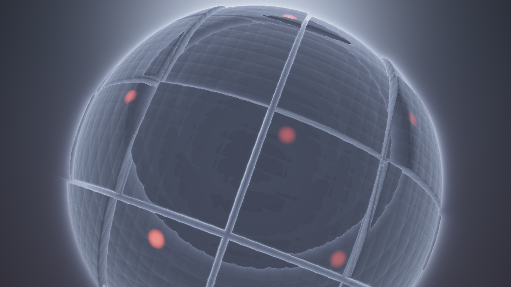

**Ergebnis:** 13 Sekunden Kristall-Terrain, *schnitt*, 13 Sekunden Moloch, *schnitt*, von vorn. Es funktioniert – und genau das ist die Überraschung dieses Schritts.

### Was passiert hier

**Der Schnitt ist ein vollwertiger Übergang.** Das Kino arbeitet zu 95 % mit ihm, und auch MilkDrop kennt ihn (Preset-Wechsel mit Blend-Zeit 0). Er hat zwei ehrliche Qualitäten: Er ist **gratis** (pro Pixel wird immer nur eine Welt gerechnet – `welt` ist für alle Pixel gleich, die GPU nimmt für das ganze Bild denselben Zweig) und er ist **klar** – keine Sekunde Mischzustand, keine Kompromiss-Farben.

Was ihm fehlt, spürt man nach zwei Zyklen: **Der Moment des Wechsels erzählt nichts.** Beide Kameras laufen ja die ganze Zeit weiter (ihre Uhren ticken auch, während ihre Welt unsichtbar ist – `iTime` hält für niemanden an); beim Schnitt springt der Blick also von einem beliebigen Punkt der A-Fahrt zu einem beliebigen Punkt der B-Fahrt. Im Kino wählt ein Editor die beiden Anschluss-Bilder – wir schneiden blind. Alles Weitere in diesem Tutorial ist der Versuch, diesen Moment zum *Ereignis* zu machen, ohne seine Klarheit zu verlieren.

🧠 **Merke:** `step` auf einer Uhr ist die billigste Zustandsmaschine der Welt – zwei Zustände, keine Übergänge, kein Gedächtnis. Jede weitere Stufe dieses Tutorials kauft *einem* der drei fehlenden Dinge nach: weiche Übergänge (Schritte 4–10), Ereignis-Steuerung (Schritt 11), Dramaturgie (Schritt 12).

### 🎨 Experimentieren

- `PERIODE = 6.0` → der Wechsel wird zum rhythmischen Stilmittel (Vorgeschmack auf den Beat-Trigger aus Anhang A)
- Ungleiche Anteile: `step(0.7, u)` → das Terrain bekommt 70 % der Zeit – Gewichtung ist Regie
- Drei-Welten-Probe (gedanklich): `float welt = floor(u * 3.0);` – das Schema skaliert; nur braucht jede weitere Welt ein weiteres Skelett

---

## Schritt 4 – Der naive Crossfade: der lehrreiche Fehlstart

**Neu:** `mix(farbeA, farbeB, t)` – der Übergang, den jeder zuerst schreibt. Wir bauen ihn mit Absicht, denn seine drei Schwächen sind der Lehrplan der nächsten sechs Schritte.

*Wieder nur `mainImage` tauschen (die `PERIODE`-Stellschraube bleibt):*

```glsl
void mainImage(out vec4 fragColor, in vec2 fragCoord)
{
    vec2 uv = (fragCoord - 0.5 * iResolution.xy) / iResolution.y;

    // Dreieck statt Schalter: 0 -> 1 -> 0 ueber die Periode, LINEAR
    float u = fract(iTime / PERIODE);
    float t = 1.0 - abs(2.0 * u - 1.0);

    // beide Welten, beide Kameras - fuer JEDES Pixel, in JEDEM Frame
    vec3 roA, rdA, roB, rdB;
    a_kamera(uv, roA, rdA);
    b_kamera(uv, roB, rdB);

    vec3 colA = 1.0 - exp(-a_render(roA, rdA) * 1.5);
    vec3 colB = 1.0 - exp(-b_render(roB, rdB) * 2.3);

    vec3 col = mix(colA, colB, t);          // DER naive Crossfade

    col = pow(col, vec3(1.0 / 2.2));
    col *= 1.0 - 0.33 * dot(uv, uv);

    fragColor = vec4(col, 1.0);
}
```

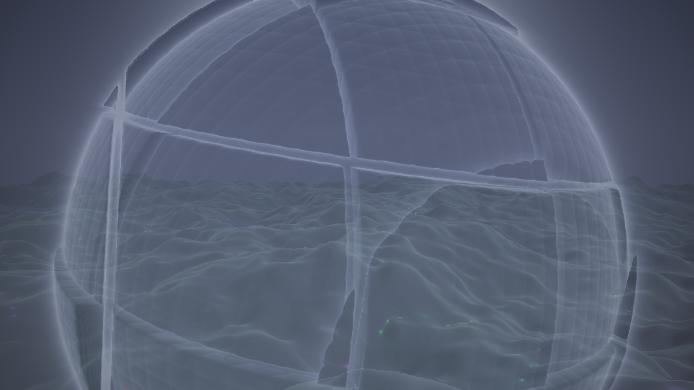

**Ergebnis:** Es blendet! Und es sieht die meiste Zeit **flau** aus: ein milchiges Doppelbild, in dem ein durchsichtiger Moloch über einem verwaschenen Terrain schwebt, zwei Kamerabewegungen gleichzeitig ziehen, und nichts mehr richtig dunkel oder richtig bunt ist. Genau dieses Ergebnis wollen wir einmal gesehen haben.

### Was passiert hier – die Anatomie des Flauen

Drei unabhängige Fehler stecken in der einen `mix`-Zeile, und jeder bekommt später sein eigenes Gegenmittel:

1. **Doppelbelichtungs-Grau.** `mix` ist ein Mittelwert – und der Mittelwert zweier *unkorrelierter* Bilder hat weniger Kontrast als jedes einzelne. Wo A hell ist, ist B meist dunkel und umgekehrt; bei `t = 0.5` heben sich die Extreme gegenseitig auf. Die tiefschwarze Panzerung des Molochs? Halb aufgehellt vom Eisblau dahinter. Die glühenden Lampenkerne? Halb zugedeckt vom Dunst der anderen Welt. Beide Welten verlieren genau das, was sie ausmacht – ihre Extreme. *(Gegenmittel: die Maske, Schritt 6 – ein Pixel zeigt EINE Welt, gemischt wird nur im schmalen Saum.)*
2. **Konkurrierende Kameras.** Beide Fahrten laufen weiter, also schieben sich zwei verschiedene Bewegungsfelder übereinander – das Auge kann keinem folgen. Das ist der Unterschied zwischen einer Doppelbelichtung (zwei Welten, zwei Blicke) und einer *Verwandlung* (eine Welt wird zur anderen vor demselben Blick). *(Gegenmittel: Kamera-Kontinuität, Schritt 10.)*
3. **Kein Verweilen.** Das lineare Dreieck ist *immer* unterwegs: 80 % der Zeit liegt `t` zwischen 0.1 und 0.9 – der Mischzustand ist der Normalfall geworden, die puren Welten sind die Ausnahme. Der Bauplan sagt es andersherum. *(Gegenmittel: Verweil-Plateaus, gleich in Schritt 5.)*

Dazu kommt der stille vierte Punkt: Wir zahlen ab sofort **beide Welten für jedes Pixel** – auch bei `t = 0.0`, wo Welt B unsichtbar ist. Der FPS-Zähler quittiert es. *(Gegenmittel: Early-Out, Schritt 8.)*

💡 **Warum bauen wir den Fehler überhaupt?** Weil „Crossfade sieht flau aus" als Behauptung nichts lehrt – als *Beobachtung am eigenen Shader* aber sofort erklärt, wozu Maske, Morph und Kamera-Einheit gut sind. Die Serie macht das öfter (Crystal Lights lässt den Marsch absichtlich Löcher fressen): Die beste Impfung gegen ein Artefakt ist, es einmal absichtlich zu erzeugen.

### 🎨 Experimentieren

- Standbild-Test: `float t = 0.5;` fest verdrahten und das Doppelbild in Ruhe sezieren – was stammt von A, was von B, was von keinem?
- Nur Fehler 2 isolieren: beide Welten mit **derselben** Kamera rendern (`b_kamera` für beide) – das Bild wird sofort ruhiger, obwohl es noch genauso grau ist. Vorgeschmack auf Schritt 10
- `mix` durch `max(colA * (1.0 - t * 0.5), colB * (0.5 + t * 0.5))` ersetzen – „heller gewinnt" ist die klassische Additiv-Ausweichlösung; weniger grau, dafür übersteuert sie

---

## Schritt 5 – Übergangs-Kurven: Halten, Blenden, Halten

**Neu:** Die **Anatomie eines Übergangs** als wiederverwendbare Phasen-Funktion – eine Sinus-Uhr, der `clamp`-Trick der Serie für die Verweil-Plateaus und `smoothstep` für ruckfreie Enden. Zwei Stellschrauben: Haltedauer und Blendedauer.

*Ab jetzt zeigen die Schritte nur noch die geänderten bzw. neuen Funktionen – alles andere bleibt wörtlich wie im vorherigen Schritt stehen. (Am Ende von Schritt 12 steht das komplette Werk noch einmal am Stück.)*

```glsl
// ---- STELLSCHRAUBEN (erweitert) --------------------------------------------
const float PERIODE       = 26.0;  // Sekunden fuer einen vollen Zyklus A -> B -> A
const float BLENDE_ANTEIL = 0.30;  // Anteil jeder Halbperiode, der Uebergang ist
// ----------------------------------------------------------------------------

// NEU: die Anatomie eines Uebergangs - Halten A, Blende, Halten B, Blende ...
// sin liefert die Uhr, clamp schneidet die Verweil-Plateaus heraus,
// smoothstep macht Start und Ende jeder Blende ruckfrei.
float uebergang(float zeit)
{
    float amp = 0.5 / sin(1.5708 * BLENDE_ANTEIL);   // 1.5708 = pi/2
    float u   = clamp(0.5 + amp * sin(6.28318 * zeit / PERIODE), 0.0, 1.0);
    return smoothstep(0.0, 1.0, u);
}
```

*Und in `mainImage` ersetzt die neue Funktion das Dreieck:*

```glsl
    float t = uebergang(iTime);
```

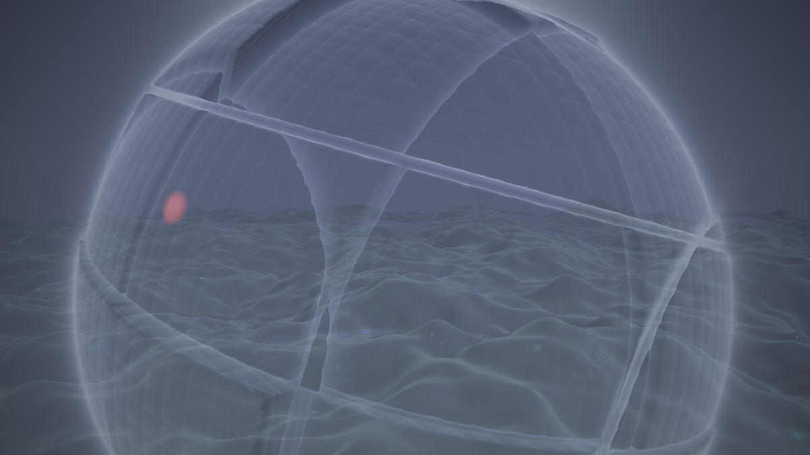

**Ergebnis:** Der Rhythmus stimmt jetzt: ~9 Sekunden pures Kristall-Terrain, dann eine ~4-sekündige Blende, ~9 Sekunden purer Moloch, zurück. Der Mischzustand ist zur kurzen Passage geworden – auch wenn er *während* der Blende noch genauso flau aussieht wie in Schritt 4.

### Was passiert hier

**Der `clamp`-Trick der Serie, jetzt als Hauptdarsteller.** Crystal Lights benutzte ihn beiläufig für den Perspektivwechsel (`persp = clamp(0.5 + 0.65·sin(...))` – „verweilt durch das clamp an beiden Enden"). Hier ist er das ganze Thema: Eine Sinuswelle mit Amplitude **größer als ½** schießt über den Wertebereich [0,1] hinaus, und `clamp` schneidet die Überstände zu **Plateaus** ab. Oben Plateau = Halten B, unten Plateau = Halten A, die steilen Flanken dazwischen = die Blenden. Eine Zeile, vier Phasen.

**Die Amplituden-Formel ist der präzise Teil.** Wie lange die Blende dauert, bestimmt, wie schnell der Sinus durch das Fenster [0,1] läuft – also die Amplitude: je größer `amp`, desto steiler die Flanke, desto kürzer die Blende. Die Rechnung: Der Sinus liegt im Fenster, solange `|sin| < 0.5/amp`, und das ist (pro Halbperiode) der Zeitanteil `(2/π)·asin(0.5/amp)`. Stellt man das um, damit dieser Anteil **exakt** `BLENDE_ANTEIL` beträgt, ergibt sich `amp = 0.5 / sin(π/2 · BLENDE_ANTEIL)` – genau die erste Zeile. Damit sind die beiden Wunschgrößen direkt ablesbar:

- **Haltedauer** = `PERIODE/2 · (1 − BLENDE_ANTEIL)` → mit den Defaults 9.1 s
- **Blendedauer** = `PERIODE/2 · BLENDE_ANTEIL` → mit den Defaults 3.9 s

**Das `smoothstep` obendrauf** behebt den letzten Schönheitsfehler: `clamp` erzeugt Knicke – die Blende startete mit voller Geschwindigkeit aus dem Stand. `smoothstep(0,1,u)` hat an beiden Enden Steigung null: Die Blende *beschleunigt hinein und bremst hinaus*, wie eine gute Kamerafahrt. (Das ist dieselbe Lektion wie die sin-Positions-Uhren der Serie: Übergänge sind Positionen, und Positionen sollen glatte Funktionen sein.)

### 💡 Warum eine sin-Uhr statt einer fract-Rampe?

Das Dreieck aus Schritt 4 (`fract`-basiert) hätte sich ebenfalls mit `clamp` zu Plateaus strecken lassen – wozu also der Sinus? Wegen der **Ableitung**: `fract` hat am Perioden-Ende einen Knick erster Ordnung (die Rampe klappt schlagartig um), und jede Größe, die später an `t` hängt (Kamera-Ziele! Belichtung!), erbt diesen Knick als sichtbaren Ruck – ausgerechnet im Moment maximaler Aufmerksamkeit. Die sin-Uhr ist an *jeder* Stelle beliebig glatt; `clamp` fügt zwar selbst kleine Knicke ein, aber genau dort, wo `smoothstep` sie anschließend wieder plättet. Es ist dieselbe Hierarchie wie bei den Kamera-Uhren der Serie: erst eine glatte Position, dann Formung – nie umgekehrt.

🧠 **Merke:** `uebergang(zeit)` ist ab jetzt die **eine** Quelle der Wahrheit über den Blendezustand – Maske, Morph, Kamera und Akzente (alles Kommende) lesen alle dasselbe `t`. Ein Übergang, dessen Ebenen verschiedene Uhren lesen, fällt auseinander.

### 🎨 Experimentieren

- `BLENDE_ANTEIL = 1.0` → `amp = 0.5`, keine Plateaus: das ist exakt der Dauer-Mischzustand aus Schritt 4, nur weicher. `0.08` → fast ein Schnitt mit Anlauf. Die ganze Bandbreite „Schnitt ↔ Crossfade" ist EINE Zahl
- `PERIODE = 60.0, BLENDE_ANTEIL = 0.5` → Ambient-Modus: minutenlange Verwandlungen
- Asymmetrie: `u` vor dem smoothstep durch `pow(u, 1.6)` schicken → der Aufbruch aus Welt A zögert, die Ankunft in B kommt schneller – Übergänge dürfen eine Richtung haben

---

## Schritt 6 – Maskierte Übergänge: der Noise-Wipe mit Glühsaum

**Neu:** Das erste Herzstück. Statt global zu mischen, entscheidet eine **Maske pro Pixel**, welche Welt sichtbar ist – eine FBM-Schwelle wandert durch das Bild, die neue Welt frisst sich als **ausgefranste Front** durch die alte. Und die Front bekommt einen **Glühsaum**: Sie „brennt" durch.

```glsl
// ---- STELLSCHRAUBEN (erweitert) --------------------------------------------
const float SAUM = 0.06;   // halbe Breite des Misch-Saums (in Masken-Einheiten)
const float GLUT = 1.2;    // Staerke des Gluehsaums an der Wechselfront
// ----------------------------------------------------------------------------

// NEU: das Front-Feld - ordnet jedem Pixel einen festen "Wechsel-Zeitpunkt" zu.
// Ein STATISCHES Feld ueber den BILDSCHIRM-Koordinaten (nicht der Welt!).
float front(vec2 uv)
{
    return clamp((fbm(uv * 3.0 + 17.0) - 0.5) * 1.6 + 0.5, 0.0, 1.0);
}

// NEU: die Maske - 0 = Welt A, 1 = Welt B, dazwischen der schmale Misch-Saum
float maske(vec2 uv, float t)
{
    float s = mix(-2.0 * SAUM, 1.0 + 2.0 * SAUM, t);   // wandernde Schwelle
    return 1.0 - smoothstep(s - SAUM, s + SAUM, front(uv));
}

// NEU: der Gluehsaum - die Wechselfront brennt durch das Bild
vec3 saumGlut(vec2 uv, float t)
{
    float s = mix(-2.0 * SAUM, 1.0 + 2.0 * SAUM, t);
    float d = abs(front(uv) - s);                   // Abstand zur Front
    float glut = GLUT / (1.0 + d * d * 900.0);      // 1/d-Idiom, auf die Maske gelegt
    glut *= 4.0 * t * (1.0 - t);                    // nur WAEHREND der Blende aktiv
    return glut * vec3(1.1, 0.55, 0.25) * 0.5;      // warmes Schwelbrand-Orange
}
```

*In `mainImage` ersetzt die Maske den globalen Mix, und der Saum kommt obendrauf:*

```glsl
    float m = maske(uv, t);
    vec3 col = mix(colA, colB, m);      // pro PIXEL statt pro BILD
    col += saumGlut(uv, t);
```

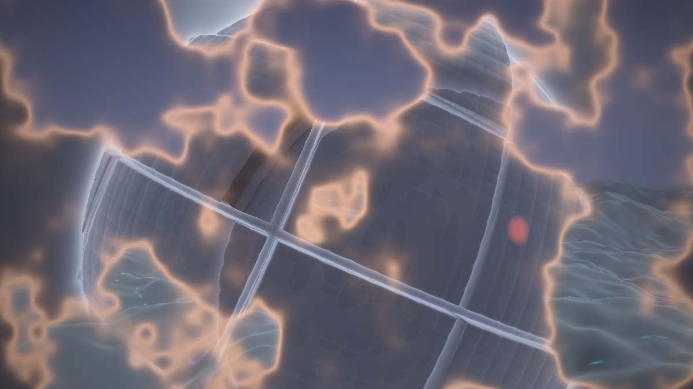

**Ergebnis:** Der Unterschied zu Schritt 5 ist drastisch: Während der Blende steht kein Doppelbild mehr im Frame, sondern **zwei intakte Welten mit einer glühenden Grenze** – der Moloch frisst sich als ausgefranste, orange schwelende Front durch das Kristall-Terrain (und beim Rückweg umgekehrt). Jede Seite der Front zeigt ihre Welt in vollem Kontrast.

### Was passiert hier

Die Mechanik auf einen Blick – jedes Pixel hat einen festen Platz auf der Front-Achse, und die Schwelle wandert darüber hinweg:

```
front(uv):   0 ─────────────────────────────────────── 1
             (jedes Pixel sitzt fest auf dieser Achse)

                          s(t)  ──►  wandert mit t von links nach rechts
   ◄── front < s: schon    ┌SAUM┐    front > s: noch ──►
       Welt B (m = 1)      │Mix │    Welt A (m = 0)
                           └─▲──┘
                     Gluehsaum sitzt genau hier
```

**Die Maske ist das Schwellwert-Muster der Serie – auf die Zeit angewandt.** Crystal Lights baute aus `smoothstep(schwelle, …, noise)` örtliche Materialzonen; hier läuft die **Schwelle selbst** mit `t` durch den Wertebereich: `s = mix(−2·SAUM, 1+2·SAUM, t)`. Jedes Pixel besitzt über `front(uv)` einen festen „Wechsel-Zeitpunkt" zwischen 0 und 1 – Pixel mit kleinem Front-Wert kippen früh zur Welt B, Pixel mit großem spät. Die Überstände `±2·SAUM` an beiden Enden garantieren, dass bei `t = 0` wirklich *alle* Pixel A zeigen und bei `t = 1` alle B – auch die im halben Saum. Das `1.0 −` dreht die Leserichtung: Maske 1 = Welt B.

Dass die Front **ausgefranst** ist, kommt gratis aus dem FBM: Die Niveaulinien eines fraktalen Feldes sind selbst fraktal – die Grenze wabert, franst, schließt Inseln ein, die erst später kippen. Genau der Look der MilkDrop-Blend-Patterns („Plasma-Wipe"), und genau deshalb liegt `front` über den **Bildschirm**-UVs: Die Blende ist ein Ereignis *auf der Leinwand*, nicht in einer der Welten – sie muss beiden gegenüber neutral sein. *(Ein Front-Feld in Weltkoordinaten wäre auch möglich – aber in wessen Welt?)*

**Der Glühsaum ist das `1/d²`-Idiom der Serie auf einem neuen Abstand.** Crystal Lights legte `1/(0.02 + d²)` über den Abstand zur Lampe, Juggernaut über den Marsch-Abstand zum Moloch – hier liegt es über dem **Maskenabstand** `|front(uv) − s|`: Pixel nahe der Front glühen, mit unendlich weichem Abfall zu beiden Seiten. Damit ist die Front kein Artefakt, das man kaschiert, sondern ein **Gestaltungselement**: Die Verwandlung hat eine sichtbare, brennende Kante. Der Faktor `4t(1−t)` (eine Parabel mit Maximum bei t = 0.5, null an beiden Enden) schaltet die Glut außerhalb der Blende sauber ab – während der Plateaus steht keine Restwärme im Bild.

### 💡 Warum sieht die Maske so viel besser aus als der Crossfade?

Weil sie das Doppelbelichtungs-Problem an der Wurzel packt: **Gemischt wird nur noch im Saum** – ein paar Prozent der Pixel statt aller. Überall sonst zeigt jedes Pixel eine pure Welt mit ihren puren Extremen: Das Schwarz des Molochs bleibt schwarz, das Lampen-Glühen bleibt bunt. Der Kontrastverlust des `mix` ist auf einen schmalen Streifen eingesperrt – und dort übertönt ihn die Glut. Auch das zweite Problem (konkurrierende Kameras) mildert die Maske: Jede Bildregion folgt jetzt *einer* Bewegung. Ganz heilen wird das erst Schritt 10.

### 🎨 Experimentieren

- `SAUM = 0.015` → gestanzte, fast harte Front (Comic-Look); `0.2` → breiter Weichzeichner-Saum, halb Crossfade
- `GLUT = 0.0` → ohne Glut wirkt dieselbe Maske sofort „technischer" – der beste Beweis, wie viel der Saum zur Dramaturgie beiträgt
- Front-Frequenz `uv * 3.0` → `uv * 8.0`: feine Fransen (nervöser); `* 1.2`: wenige große Lappen (majestätischer)
- Glutfarbe `vec3(1.1, 0.55, 0.25)` → `vec3(0.4, 0.9, 1.2)`: kalter Plasma-Riss statt Schwelbrand

---

## Schritt 7 – Blendarten: Radial- und Richtungs-Wipe

**Neu:** Das Front-Feld wird austauschbar – eine `BLENDART`-Stellschraube wählt zwischen globalem Crossfade, Noise-Wipe, **Radial-Wipe** (die neue Welt wächst aus der Bildmitte) und **Richtungs-Wipe** (die Front zieht von links nach rechts).

```glsl
// ---- STELLSCHRAUBEN (erweitert) --------------------------------------------
const int BLENDART = 1;   // 0 = Crossfade  1 = Noise-Wipe  2 = radial  3 = Richtung
// ----------------------------------------------------------------------------

// GEAENDERT: front() kennt jetzt drei Wipe-Spielarten
float front(vec2 uv)
{
    if (BLENDART == 2)        // Radial-Wipe: die neue Welt waechst aus der Mitte
        return clamp(length(uv) * 1.1
                     + (fbm(uv * 4.0 + 5.0) - 0.5) * 0.25, 0.0, 1.0);
    if (BLENDART == 3)        // Richtungs-Wipe: die Front zieht von links nach rechts
        return clamp(uv.x + 0.5
                     + (fbm(uv * 5.0 + 9.0) - 0.5) * 0.30, 0.0, 1.0);
    // Noise-Wipe (Standard)
    return clamp((fbm(uv * 3.0 + 17.0) - 0.5) * 1.6 + 0.5, 0.0, 1.0);
}

// GEAENDERT: maske() und saumGlut() behandeln BLENDART 0 als Sonderfall
float maske(vec2 uv, float t)
{
    if (BLENDART == 0) return t;                        // globaler Crossfade
    float s = mix(-2.0 * SAUM, 1.0 + 2.0 * SAUM, t);
    return 1.0 - smoothstep(s - SAUM, s + SAUM, front(uv));
}

vec3 saumGlut(vec2 uv, float t)
{
    if (BLENDART == 0) return vec3(0.0);                // Crossfade hat keine Front
    float s = mix(-2.0 * SAUM, 1.0 + 2.0 * SAUM, t);
    float d = abs(front(uv) - s);
    float glut = GLUT / (1.0 + d * d * 900.0);
    glut *= 4.0 * t * (1.0 - t);
    return glut * vec3(1.1, 0.55, 0.25) * 0.5;
}
```

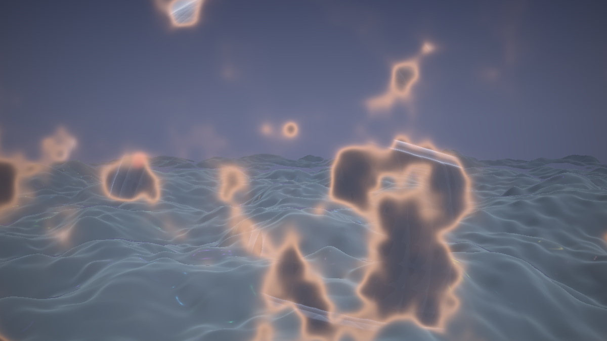

**Ergebnis:** Vier wählbare Übergangs-Charaktere aus einer Konstante: der wabernde Plasma-Fraß (1), ein Kreis, der sich – mit ausgefranster Kante – aus der Bildmitte öffnet (2), ein schräg verzahnter Vorhang von links (3), und als ehrlicher Nullpunkt der alte Crossfade (0).

### Was passiert hier

**Alle Wipes sind dasselbe Programm mit anderem Front-Feld** – das ist die eigentliche Pointe des Schritts. Maske, Saum, Glut, Timing: unverändert. Nur die Funktion, die jedem Pixel seinen Wechsel-Zeitpunkt zuweist, wird getauscht:

- **Radial** nimmt `length(uv)` – den Abstand zur Bildmitte, dieselbe Größe, auf der die Vignette der Serie sitzt (und das `rad` der MilkDrop-Presets). Die neue Welt erscheint dort zuerst, wo das Auge ohnehin hinschaut, und die letzte alte Bildecke stirbt dort, wo die Vignette sie schon abgedunkelt hat – ein Wipe, der mit der Bildkomposition arbeitet statt gegen sie.
- **Richtung** nimmt `uv.x + 0.5` – eine schlichte Rampe. Pur wäre das eine Lineal-Kante; die kleine FBM-Beimischung (`± 0.15`) verzahnt die Front, ohne die Richtung zu verwischen.
- Auch die „reinen" Geometrie-Wipes bekommen also ihre **Noise-Fransen** – der Term ist jeweils klein gegen die Rampe, sodass der Charakter (kreisförmig, gerichtet) erhalten bleibt. Fransen sind das Salz jedes Wipes: eine mathematisch exakte Kante sieht nach Software aus, eine ausgefranste nach Naturereignis.

Das `clamp` auf [0,1] in allen Varianten ist kein Kosmetik-Detail, sondern der **Vertrag mit der Maske**: Die Schwelle `s` läuft von `−2·SAUM` bis `1+2·SAUM` – nur wenn `front` garantiert in [0,1] liegt, ist bei `t = 0` wirklich alles A und bei `t = 1` alles B. Ein Front-Wert von 1.3 wäre ein Pixel, das **nie** zur Welt B kippt.

💡 **`BLENDART` ist eine Konstante, kein Uniform** – der Compiler wirft die toten Zweige weg, die Wahl kostet nichts. Wer die Blendart *pro Wechsel* variieren will (mal radial, mal Noise), braucht eine Laufzeit-Größe – die liefert die Zustandsmaschine aus Schritt 11 fast nebenbei (🎨 dort).

### 🎨 Experimentieren

- Radial invertieren: `1.0 - length(uv) * 1.1 + …` → die neue Welt kommt vom Rand und schnürt die alte in der Mitte ein – deutlich bedrohlicher
- Richtungs-Wipe diagonal: `uv.x * 0.7 + uv.y * 0.7 + 0.5` – oder vertikal (`uv.y + 0.5`): der Moloch „sinkt herab"
- Eigene Blendart 4: `front = clamp(abs(uv.y) * 2.2 + fransen, 0.0, 1.0)` → die neue Welt reißt als horizontaler Spalt in der Bildmitte auf
- Fransen-Anteil auf `0.6` erhöhen: Der Radial-Wipe wird zum „Noise-Wipe mit radialer Tendenz" – die Grenzen zwischen den Arten sind fließend

---

## Schritt 8 – Masken-Early-Out: nur zahlen, was man sieht

**Neu:** Die Performance-Dividende der Maske wird eingelöst – pro Pixel wird **nur die sichtbare Welt** gerechnet; beide zahlt nur, wer im Misch-Saum liegt.

*Nur der Welt-Aufruf in `mainImage` ändert sich:*

```glsl
    float m = maske(uv, t);

    vec3 col;
    if (m < 0.002) {                        // Pixel ist sicher Welt A
        vec3 ro, rd;
        a_kamera(uv, ro, rd);
        col = 1.0 - exp(-a_render(ro, rd) * 1.5);
    } else if (m > 0.998) {                 // Pixel ist sicher Welt B
        vec3 ro, rd;
        b_kamera(uv, ro, rd);
        col = 1.0 - exp(-b_render(ro, rd) * 2.3);
    } else {                                // Misch-Saum: hier zahlen wir doppelt
        vec3 roA, rdA, roB, rdB;
        a_kamera(uv, roA, rdA);
        b_kamera(uv, roB, rdB);
        col = mix(1.0 - exp(-a_render(roA, rdA) * 1.5),
                  1.0 - exp(-b_render(roB, rdB) * 2.3), m);
    }
    col += saumGlut(uv, t);
```

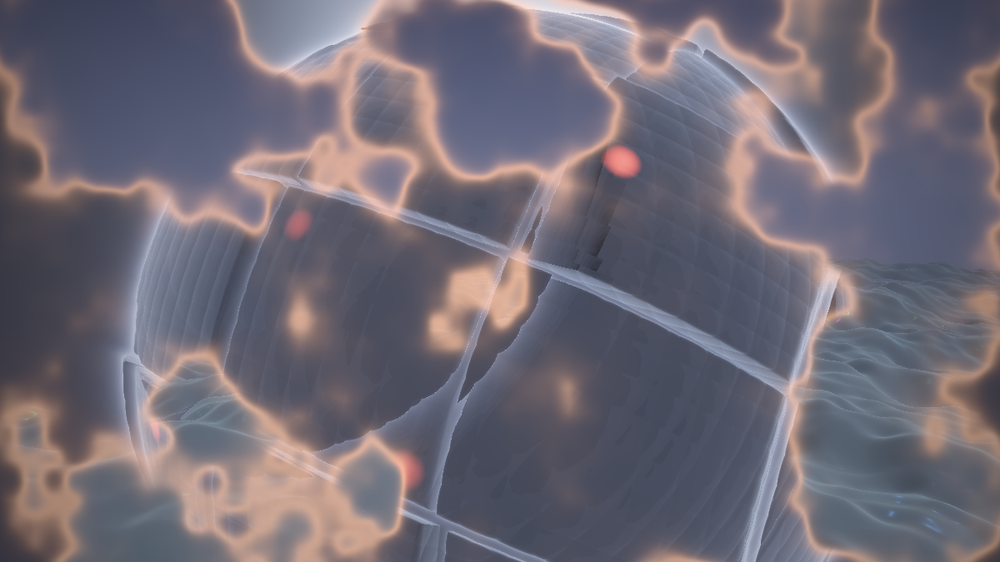

**Ergebnis:** Optisch identisch mit Schritt 7 – aber der FPS-Zähler erzählt eine andere Geschichte: Während der Halte-Phasen läuft das Composite wieder so schnell wie die jeweilige Einzelwelt, und selbst mitten in der Blende zahlt nur der schmale Frontstreifen den Doppelpreis.

### Was passiert hier – die Kostenrechnung

Rechnen wir die Währung dieses Shaders einmal aus – *Marsch-Schritte pro Pixel*, grob:

| Zustand | Welt A | Welt B | Summe |
|---|---|---|---|
| Halten A | 90 | 0 | 90 |
| Halten B | 0 | 110 | 110 |
| Blende, Pixel außerhalb des Saums | 90 **oder** 110 | – | ~100 |
| Blende, Pixel **im** Saum | 90 | 110 | **200** |
| Schritt 4–7 (ohne Early-Out), immer | 90 | 110 | **200** |

Der Saum umfasst bei `SAUM = 0.06` nur wenige Prozent der Pixel – der Early-Out drückt die Durchschnittskosten der Blende also von 200 auf etwa 105, und die der Halte-Phasen (den Löwenanteil der Zeit!) auf den Einzelwelt-Preis. **Deshalb** wurden die Skelette in Schritt 1/2 auf 90/110 Schritte gesenkt: Der Worst Case (Saum-Pixel: 200 Schritte plus zweimal Beleuchtung) muss flüssig bleiben, denn er entscheidet über den Eindruck des Übergangs – ein Wechsel, der ruckelt, ist kein Ereignis, sondern ein Schluckauf.

Zwei Feinheiten der Umsetzung:

1. **Die Schwellen `0.002/0.998` statt `0.0/1.0`.** `smoothstep` erreicht seine Enden exakt – aber erst *am* Rand des Saums. Die Mini-Toleranz erspart dem Grenzpixel den Doppelpreis für unsichtbare 0.1-%-Beimischungen.
2. **Divergenz ist hier gutmütig.** GPUs rechnen Pixel in Gruppen (Warps); liegen in einer Gruppe A- *und* B-Pixel, zahlt die Gruppe beide Zweige – Early-Out hin oder her. Aber unsere Maske ist **räumlich kohärent** (große zusammenhängende A- und B-Gebiete, dünner Saum): Fast alle Gruppen sind sortenrein. Ein Front-Feld aus Pixelrauschen (`hash21(uv * 1000.)`) würde dagegen die gesamte Ersparnis vernichten – *Masken müssen klumpen, nicht streuen.*

🧠 **Merke:** `BLENDART = 0` (globaler Crossfade) ist nach diesem Schritt die **teuerste** Blendart – `m = t` liegt während der gesamten Blende für alle Pixel im Mischbereich. Auch das spricht für Wipes.

### 🎨 Experimentieren

- Saum-Kosten sichtbar machen: im Misch-Zweig `col = vec3(1.0, 0.0, 1.0);` → der Doppelzahler-Streifen leuchtet magenta; seine Breite ist deine `SAUM`-Rechnung
- Shadertoy-Auflösung hochdrehen und `SAUM = 0.25` setzen: die Blende wird messbar zäher – der Saum-Anteil ist der Performance-Regler
- Die Schrittzahlen der Skelette (90/110) probeweise auf Originalniveau (150/160) heben und den Blende-Moment beobachten: genau dafür war das Kondensieren da

---

## Schritt 9 – Parameter-Morph: die Welten wachsen aufeinander zu

**Neu:** Das zweite Herzstück. Statt nur *Bilder* zu mischen, fahren wir die **gemeinsamen Größen** beider Welten – Dunst, Belichtung, Akzentfarben – über EINEN Satz Meta-Regler und interpolieren sie beim Wechsel: Die Welten nähern sich einander an, **bevor** die Maske läuft. Das ist das Milkdrop-Blend-Analogon: Dort morphen beim Übergang die Preset-*Parameter*, nicht nur die Pixel.

```glsl
// ---- META-ZUSTAND: EIN Satz Regler fuer beide Welten -----------------------
// (setzt mainImage je Frame aus t - VOR allen Welt- und Kamera-Aufrufen)
float gMorph      = 0.0;                       // 0 = Welt A haelt .. 1 = Welt B haelt
float gDunst      = 0.0018;                    // Dunstdichte   (geteilt)
vec3  gDunstFarbe = vec3(0.05, 0.07, 0.12);    // Dunstfarbe    (geteilt)
// ----------------------------------------------------------------------------

// GEAENDERT (Welt A): der Nebel liest die Meta-Regler ...
//   in a_render, die Distanznebel-Zeile:
    col = mix(col, gDunstFarbe, 1.0 - exp(-gDunst * t * t));

// ... und die Lampen morphen in Richtung der Welt-B-Positionslichter:
vec3 a_lampColor(float t)
{
    vec3 bunt = 0.55 + 0.45 * cos(6.28318 * (t + vec3(0.0, 0.33, 0.67)));
    return mix(bunt, vec3(1.0, 0.16, 0.10), gMorph * 0.7);
}

// GEAENDERT (Welt B): derselbe Nebel ...
//   in b_render, die Dunst-Zeile:
    col = mix(col, gDunstFarbe, 1.0 - exp(-gDunst * t * t));

// ... und die Positionslichter morphen in Richtung der Welt-A-Lampen:
//   in b_shade, die Fenster-Zeile:
    vec3 lichtFarbe = mix(vec3(0.45, 0.75, 1.00), vec3(1.0, 0.12, 0.08), gMorph);
    col += b_fenster(b_gedreht(p)) * lichtFarbe * 1.4;
```

*Und `mainImage` setzt die Regler und entwickelt zum ersten Mal **einmal für beides** – die Welt-Aufrufe verlieren ihre eigenen Tonemappings (nur noch `a_render(...)` bzw. `b_render(...)`, linear gemischt):*

```glsl
    float t = uebergang(iTime);

    // Parameter-Morph: die Welten wachsen aufeinander zu, BEVOR die Maske laeuft
    gMorph      = t;
    gDunst      = mix(0.0018, 0.0035, t);
    gDunstFarbe = mix(vec3(0.05, 0.07, 0.12), vec3(0.020, 0.024, 0.040), t);
    float belichtung = mix(1.5, 2.3, t);

    float m = maske(uv, t);
    vec3 col;
    if (m < 0.002) {
        vec3 ro, rd; a_kamera(uv, ro, rd);
        col = a_render(ro, rd);
    } else if (m > 0.998) {
        vec3 ro, rd; b_kamera(uv, ro, rd);
        col = b_render(ro, rd);
    } else {
        vec3 roA, rdA, roB, rdB;
        a_kamera(uv, roA, rdA);
        b_kamera(uv, roB, rdB);
        col = mix(a_render(roA, rdA), b_render(roB, rdB), m);   // LINEAR mischen
    }

    col += saumGlut(uv, t);                  // Glut VOR der Entwicklung: sie glueht aus
    col = 1.0 - exp(-col * belichtung);      // EIN Tonemapping fuer beides
    col = pow(col, vec3(1.0 / 2.2));
    col *= 1.0 - 0.33 * dot(uv, uv);
```

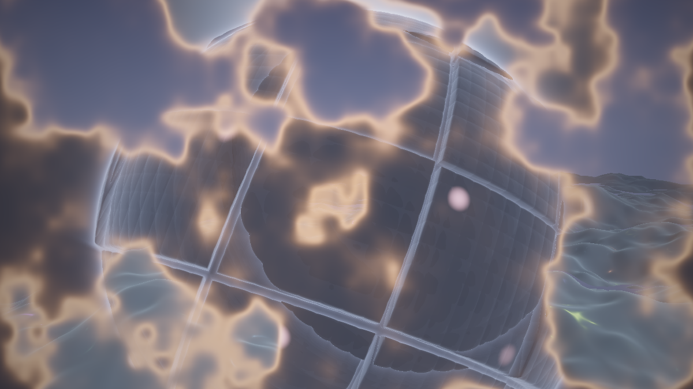

**Ergebnis:** Der Übergang bekommt eine Vorgeschichte: Schon während die Front erst losläuft, wird das Terrain merklich dunstiger und seine Lampen glimmen rötlicher – und wo der Moloch frisch erscheint, blinken seine Fenster noch eisblau-bunt nach, bevor sie sich zu Rot beruhigen. Die beiden Seiten der Front gehören sichtbar **zum selben Moment**.

### Was passiert hier

**Morphen kann man nur Größen, die in beiden Welten dieselbe *Rolle* spielen.** Das ist die Kernregel dieses Schritts, und sie sortiert alle Kandidaten in zwei Listen:

| ✅ morpht (gemeinsame Rolle) | über |
|---|---|
| Belichtung (1.5 ↔ 2.3) | `belichtung` in `mainImage` |
| Dunstdichte (0.0018 ↔ 0.0035) und Dunstfarbe | `gDunst`, `gDunstFarbe` |
| Akzentlicht-Farben (bunte Lampen ↔ rote Fenster) | `gMorph` in `a_lampColor` / `b_shade` |
| Kamera-Distanz, -Höhe, -Brennweite | Schritt 10 |
| Farbdrift-Tempo/-Tiefe (Politur) | Schritt 12 |

| ❌ morpht nicht (keine Korrespondenz) | warum |
|---|---|
| Terrainhöhe ↔ Orb-Radius | ein *Feld* und ein *Objekt* – es gibt keine Zwischenform, die nicht beides kaputt macht |
| Höhenfeld-Marsch ↔ SDF-Marsch | zwei Algorithmen; ein „halber" Marsch existiert nicht |
| Lampenraster ↔ Panelzellen | verschiedene Topologien (2D-Ebene vs. Kugeloberfläche) – die Zell-Identitäten haben keine Paarung |
| Blink-Rhythmen | jede Lampe/jedes Fenster hat seine Hash-Identität; „interpolierte Identität" ist Rauschen |

Alles aus der zweiten Liste bleibt Sache der **Maske** – deshalb sind Morph und Maske keine Konkurrenten, sondern Arbeitsteilung: *Der Morph gleicht die Atmosphären an, die Maske tauscht die Strukturen.* Genau so macht es MilkDrop: Skalare Preset-Variablen (Zoom, Warp, Farbanteile) werden über die Blendzeit interpoliert, während die Blend-Maske die Bildanteile tauscht – ein „halbes Warp-Feld" versucht auch dort niemand.

**Das eine Tonemapping ist die zweite Hälfte des Schritts.** Bisher wurde jede Welt separat „entwickelt" und dann gemischt – zwei fertige Fotos übereinandergelegt. Jetzt mischen wir **linear** (physikalisch: Licht addiert sich linear) und entwickeln das Gemisch einmal, mit gemorphter Belichtung. Der Unterschied ist subtil, aber sichtbar: Im Saum verhalten sich helle Quellen jetzt wie Licht in einer Szene (die `1−exp`-Sättigung wirkt auf die *Summe*), nicht wie halbtransparente Aufkleber. Und der Glühsaum wandert mit unter die Entwicklung – seine Spitzen „glühen aus", statt zu clippen: das Crystal-Lights-Argument für `1−exp`, wortwörtlich wiederverwendet.

🧠 **Merke:** Die Meta-Regler werden gesetzt, **bevor** irgendeine Welt-Funktion läuft – Globals in GLSL sind gewöhnliche Variablen, ihre Reihenfolge ist Handarbeit. Wer `gMorph` nach `a_render` setzt, morpht mit dem Wert des Vorframes … nein: mit dem Initialwert. Es gibt kein Vorframe – noch nicht (Schritt 11).

### 🎨 Experimentieren

- Morph ohne Maske testen: `BLENDART = 0` – der pure Crossfade sieht mit Morph schon deutlich weniger flau aus, weil die Welten sich farblich entgegenkommen. Maske + Morph zusammen sind trotzdem die Liga darüber
- Die Annäherung übertreiben: `gMorph * 0.7` → `* 1.0` in `a_lampColor` – kurz vor dem Wechsel ist das Terrain komplett rotbeleuchtet; ein starker „es kündigt sich an"-Effekt, aber die Welt A verliert ihre Identität schon im Halten-Ausklang
- Asymmetrischer Dunst: `gDunst = mix(0.0018, 0.0035, smoothstep(0.0, 0.4, t))` – der Dunst kommt früh, die Front läuft dann durch bereits vernebeltes Terrain („der Moloch bringt sein Wetter mit")

---

## Schritt 10 – Kamera-Kontinuität: eine Fahrt, zwei Welten

**Neu:** Die letzte Doppelung fällt: **EINE Kamerafahrt** bedient beide Welten – gemeinsame Orbit-Basis, und die Welt-spezifischen Ziel-Offsets (Distanz, Höhe, Blickpunkt, Brennweite) werden vom Morph mitgeblendet. Aus „Szenenwechsel" wird „die Welt verwandelt sich".

```glsl
// NEU: EINE Kamera fuer beide Welten (ERSETZT a_kamera und b_kamera)
void kamera(vec2 uv, out vec3 ro, out vec3 rd)
{
    float zt = iTime;

    // gemeinsame Basis: ein Orbit um den Ursprung, mit atmendem Tempo
    float wink = zt * 0.03 + 1.2 * sin(zt * 0.021);

    // Welt-spezifische ZIELE - der Morph blendet sie mit:
    float dist  = mix(7.0, 11.5, gMorph);   // A: eng ueberm Terrain, B: mit Abstand
    float hoehe = mix(3.2, -1.4, gMorph);   // A: von oben, B: Low-Angle
    vec3  ta    = vec3(0.0, mix(0.0, 1.6, gMorph), 0.0);
    float brenn = mix(1.4, 1.1, gMorph);    // B ist weitwinkliger

    ro = vec3(sin(wink) * dist, hoehe, cos(wink) * dist);
    // Boden-Anker: bindend nur, solange Welt A das Bild traegt
    ro.y = max(ro.y, mix(a_terrain(ro.xz) + 1.5, -4.0, gMorph));

    vec3 fw = normalize(ta - ro);
    vec3 rt = normalize(cross(vec3(0.0, 1.0, 0.0), fw));
    vec3 up = cross(fw, rt);
    rd = normalize(fw * brenn + rt * uv.x + up * uv.y);

    b_sonne = normalize(fw + vec3(0.0, 0.35, 0.0));   // Gegenlicht der Welt B
}
```

*In `mainImage` schrumpfen die drei Kamera-Blöcke auf einen – **vor** der Maske, nach den Meta-Reglern:*

```glsl
    vec3 ro, rd;
    kamera(uv, ro, rd);                    // liest gMorph -> NACH dem Morph-Block!

    float m = maske(uv, t);
    vec3 col;
    if      (m < 0.002) col = a_render(ro, rd);
    else if (m > 0.998) col = b_render(ro, rd);
    else                col = mix(a_render(ro, rd), b_render(ro, rd), m);
```

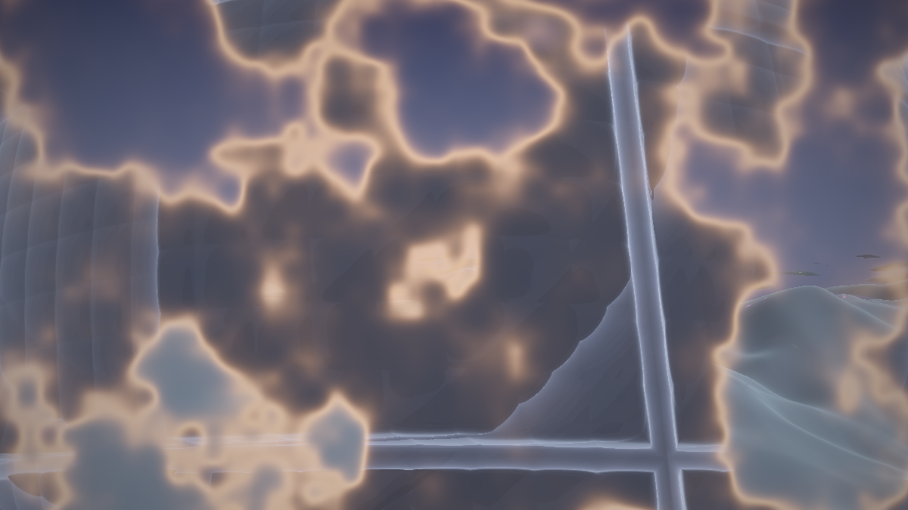

**Ergebnis:** Der Charakter des Übergangs kippt fühlbar: Beide Seiten der Front zeigen jetzt **denselben Blick** – dieselbe Bewegung, denselben Horizontwinkel. Während der Blende hebt sich die Kamera vom Terrain-Überflug in den Low-Angle-Orbit (oder senkt sich zurück), und die Front frisst sich durch ein Bild, das *als Bild* stillhält. Es sieht nicht mehr aus wie zwei Videos mit Wischblende, sondern wie ein Ort, der sich verwandelt.

### Was passiert hier

**Der Unterschied zwischen „Szenenwechsel" und „Verwandlung" liegt fast nur in der Kamera.** Das ist die zentrale Behauptung dieses Schritts, und der A/B-Vergleich mit Schritt 9 beweist sie: Gleiche Maske, gleicher Morph, gleiche Welten – aber mit zwei Kameras liest das Auge „hier werden zwei Aufnahmen gemischt", mit einer liest es „vor mir passiert etwas". Der Grund ist das Bewegungsfeld: Das Sehsystem gruppiert nach gemeinsamer Bewegung („common fate"); zwei konkurrierende Felder zerlegen das Bild in zwei Schichten, ein gemeinsames verschmilzt es zu einer Szene.

Die Konstruktion folgt dem Serie-Muster (Basis aus `fw`/`rt`/`up`, Positions-Uhren), mit drei Composite-Eigenheiten:

1. **Die Basis ist geteilt, die Ziele sind gemorpht.** Orbit-Winkel und -Takt sind *eine* Wahrheit; Distanz, Höhe, Blickpunkt und Brennweite sind `mix(A-Wunsch, B-Wunsch, gMorph)`. Damit ist die Kamera während der Plateaus exakt die Wunschkamera der haltenden Welt – und während der Blende eine *stetige* Reise zwischen beiden. (Dass ein Orbit für ein Terrain überhaupt funktioniert, liegt an dessen Feld-Natur: Ein Höhenfeld hat kein „Vorne" – über ihm zu kreisen ist so gültig wie darüber hinwegzufliegen.)
2. **Der Boden-Anker wird mit-gemorpht.** Welt A verbietet Kamerapositionen im Terrain (`max(ro.y, terrain + 1.5)`); Welt B *braucht* Positionen unterhalb von Terrain-Niveau (Low-Angle bei `hoehe = −1.4`). Der `mix` auf den Anker-Wert löst den Konflikt stetig: Solange A sichtbar ist, greift der Anker – je mehr B übernimmt, desto weiter senkt sich die erlaubte Untergrenze. Kein Sprung, kein Clipping.
3. **`kamera` liest `gMorph` → Aufruf-Reihenfolge.** Meta-Regler zuerst, Kamera danach, Welten zuletzt. Auch `b_sonne` hängt jetzt an der geteilten Kamera – das Gegenlicht der Welt B steht damit automatisch richtig, egal aus welcher Richtung die gemeinsame Fahrt gerade schaut.

💡 **Warum nicht auch die Kamera-Uhr morphen?** Weil die Uhr eine *Position* ist – die spinAngle-Lektion der Serie. `mix(uhrA(zeit), uhrB(zeit), t)` wäre in Ordnung (Mix zweier Positionen ist eine Position); ein gemorphtes *Tempo* vor `iTime` dagegen teleportiert. Wir sind noch strenger und teilen gleich die ganze Uhr: weniger Freiheit, null Fehlerquellen.

### 🎨 Experimentieren

- Den alten Zustand zurückholen (beide alten Kameras, eine Zeile im Misch-Zweig) und im 10-Sekunden-Wechsel vergleichen – der stärkste Vorher/Nachher-Moment des Tutorials
- `dist`-Spreizung vergrößern: `mix(6.0, 16.0, gMorph)` → die Blende wird zur spürbaren Rück-Fahrt („dolly out") – der Übergang bekommt eine eigene Kamerabewegung als Erzählung
- Die Brennweiten-Blende isoliert testen: `brenn = mix(2.2, 0.9, gMorph)` – ein Hauch Dolly-Zoom-Gefühl im Wechselmoment (Verwandtes tat Crystal Lights mit seiner Perspektiv-Blende)
- Orbit-Exzentrik: `wink`-Formel um `+ 0.4 * sin(zt * 0.007)` ergänzen – noch weniger wiederholte Blickwinkel

### Sammelpunkt: der komplette Single-Pass-Stand

Bevor Schritt 11 die Datei in drei Pässe zerlegt, lohnt eine Bestandsaufnahme – die Diffs der Schritte 5–10 haben sich verteilt. Die Datei enthält jetzt, in dieser Reihenfolge: Stellschrauben (`PERIODE`, `BLENDE_ANTEIL`, `SAUM`, `GLUT`, `BLENDART`, `A_*`, `B_*`) → `R` → Meta-Globals (`gMorph`, `gDunst`, `gDunstFarbe`, `b_sonne`) → Zufalls-Baukasten → `smin`/`smax` → alle `a_`-Funktionen → alle `b_`-Funktionen → `kamera` → `uebergang` → `front`/`maske`/`saumGlut` → `mainImage`. Und das `mainImage` liest sich als Zusammenfassung des halben Tutorials:

```glsl
void mainImage(out vec4 fragColor, in vec2 fragCoord)
{
    vec2 uv = (fragCoord - 0.5 * iResolution.xy) / iResolution.y;

    // Uebergang (Schritt 5): eine Uhr, vier Phasen
    float t = uebergang(iTime);

    // Parameter-Morph (Schritt 9): VOR Kamera und Welten
    gMorph      = t;
    gDunst      = mix(0.0018, 0.0035, t);
    gDunstFarbe = mix(vec3(0.05, 0.07, 0.12), vec3(0.020, 0.024, 0.040), t);
    float belichtung = mix(1.5, 2.3, t);

    // EINE Kamera (Schritt 10)
    vec3 ro, rd;
    kamera(uv, ro, rd);

    // Maske mit Early-Out (Schritte 6-8)
    float m = maske(uv, t);
    vec3 col;
    if      (m < 0.002) col = a_render(ro, rd);
    else if (m > 0.998) col = b_render(ro, rd);
    else                col = mix(a_render(ro, rd), b_render(ro, rd), m);

    // Gluehsaum (Schritt 6) + EIN Abschluss (Schritt 9)
    col += saumGlut(uv, t);
    col = 1.0 - exp(-col * belichtung);
    col = pow(col, vec3(1.0 / 2.2));
    col *= 1.0 - 0.33 * dot(uv, uv);

    fragColor = vec4(col, 1.0);
}
```

Dieser Stand ist ein vollwertiges Endprodukt für alle, die keinen Ereignis-Wechsel brauchen: **komplett zustandsfrei, ein Pass, perfekt deterministisch** – Frame 500 sieht auf jeder Maschine gleich aus. Wer hier aussteigt, hat ein fertiges Fahrplan-Composite. Wer den Beat will, steigt um.

---

## Schritt 11 – Die Zustandsmaschine in Buffer A: der Wechsel als Ereignis

**Neu:** Das dritte Herzstück, und der größte Umbau: Der Übergang hängt nicht mehr an einer Uhr-**Position**, sondern an einem **Zustand mit Gedächtnis** – ein 1-Pixel-Speicher in Buffer A hält `phase`, `welt`, `haltezeit` und `cooldown`; ein Trigger *startet* die Blende, die Phase *integriert* mit fester Rate. Vorerst triggert ein deterministischer **Timer** – der Beat übernimmt in Anhang A dieselbe eine Zeile.

Zuerst die ehrliche Begründung, **warum** es ohne diesen Umbau nicht geht: Die Positions-Uhr-Regel der Serie sagt „schreibe Positionen als glatte Funktionen der Zeit" – und `uebergang(iTime)` ist die perfekte Erfüllung. Aber sie hat eine harte Grenze: Eine Funktion von `iTime` kann nur wissen, *wie spät es ist* – nie, *was passiert ist*. „Wechsle, wenn der Beat kommt" heißt: Der Zustand „Blende läuft seit dem Kick bei t = 37.2" muss irgendwo **gespeichert** sein, denn aus der aktuellen Uhrzeit allein ist er nicht rekonstruierbar. Ein Image-Shader hat kein Gedächtnis – ein Buffer, der sich selbst liest, hat eins (sein Vorframe). **Der Buffer ist die Erlaubnis, Geschwindigkeit statt Position zu steuern:** `phase += rate` ist genau das Muster, vor dem die Serie im zustandslosen Shader immer gewarnt hat – mit Zustand ist es legal und exakt richtig.

**Der Umbau auf Shadertoy** (drei Handgriffe):

1. Unter dem Shader-Editor **„Common" anlegen** und *alles außer `mainImage` und den Masken-Funktionen* dorthin verschieben: Stellschrauben, `R`, Meta-Globals, Zufalls-Baukasten, `smin`/`smax`, alle `a_`- und `b_`-Funktionen, `kamera`. (Common wird jedem Pass vorangestellt – Buffer A und Image teilen sich so die Konstanten.) Die Stellschrauben `PERIODE`/`BLENDE_ANTEIL` werden dabei **ersetzt** durch:

```glsl
// ---- STELLSCHRAUBEN (Uebergangs-Timing, ersetzt PERIODE/BLENDE_ANTEIL) -----
const float HALTEDAUER  = 9.0;   // s Verweilzeit je Welt (Timer-Trigger)
const float BLENDEDAUER = 4.0;   // s je Uebergang
const float COOLDOWN    = 2.0;   // s Sperrzeit nach der Blende (gegen Doppel-Trigger)
// ----------------------------------------------------------------------------
```

2. **Tab „Buffer A" anlegen**, dort `iChannel0` auf **Buffer A selbst** legen (Selbstreferenz = Vorframe lesen), und diesen Pass hineinschreiben:

```glsl
// ============================================================================
// BUFFER A - die Zustandsmaschine. Zustand lebt in Pixel (0,0):
//   x = phase     (0 = halten; 0..1 = Blende laeuft)
//   y = welt      (0 = Basis ist A, 1 = Basis ist B)
//   z = haltezeit (s seit Ende der letzten Blende)
//   w = cooldown  (s Restsperre gegen Doppel-Trigger)
// iChannel0: Buffer A (Selbstreferenz)
// ============================================================================

void mainImage(out vec4 fragColor, in vec2 fragCoord)
{
    vec4 z = texelFetch(iChannel0, ivec2(0, 0), 0);
    float phase = z.x, welt = z.y, halte = z.z, cool = z.w;

    // Kaltstart: Frame 0 liest nur Nullen -> sauber definieren
    if (iFrame == 0) { phase = 0.0; welt = 0.0; halte = 0.0; cool = 0.0; }

    // Zeitschritt, gegen Ausreisser geklemmt (Tab-Wechsel, Ruckler)
    float dt = clamp(iTimeDelta, 1.0 / 240.0, 1.0 / 24.0);

    if (phase <= 0.0) {
        // ---- HALTEN: warten auf den Ausloeser --------------------------------
        halte += dt;

        // TRIGGER (Timer-Modus): nach HALTEDAUER wird gewechselt.
        // Anhang A ersetzt GENAU DIESE ZEILE durch das Beat-Ereignis.
        bool wechsel = halte > HALTEDAUER;

        if (wechsel && cool <= 0.0) phase = 0.0001;   // Blende starten
    } else {
        // ---- BLENDEN: Geschwindigkeit statt Position - die Buffer-Erlaubnis --
        phase += dt / BLENDEDAUER;
        if (phase >= 1.0) {
            phase = 0.0;                // Ankunft:
            welt  = 1.0 - welt;         //   die andere Welt ist jetzt die Basis,
            halte = 0.0;                //   Verweilzeit laeuft neu an,
            cool  = COOLDOWN;           //   Trigger kurz gesperrt
        }
    }
    cool = max(cool - dt, 0.0);

    fragColor = vec4(phase, welt, halte, cool);
}
```

3. Im **Image**-Pass `iChannel0` auf **Buffer A** legen; dort bleiben `front`/`maske`/`saumGlut` und `mainImage` – und statt `uebergang(iTime)` (die Funktion kann weg) liest das Image den Zustand:

```glsl
    // Blende & Basis-Welt aus der Zustandsmaschine
    vec4 z = texelFetch(iChannel0, ivec2(0, 0), 0);
    float kurve = smoothstep(0.0, 1.0, z.x);          // weiche Enden wie gehabt
    float t = mix(kurve, 1.0 - kurve, z.y);           // Basis B? Dann rueckwaerts
```

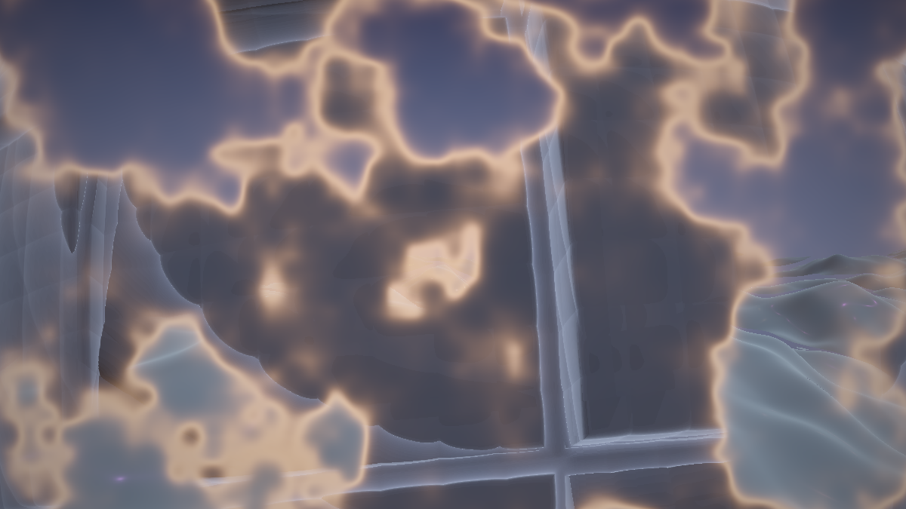

**Ergebnis:** Optisch zunächst dasselbe Pendel wie seit Schritt 5 – mit den Defaults wechselt der Timer alle 9 Sekunden. Aber die Architektur darunter ist eine andere: Der Wechsel ist jetzt ein **Ereignis, das eintreten kann oder nicht** – die Blende startet, läuft mit eigener Geschwindigkeit zu Ende und meldet ihre Ankunft. Der Fahrplan ist einem Fahrer gewichen.

### Was passiert hier

**Die Maschine hat genau zwei Zustände** – Halten (`phase = 0`) und Blenden (`phase > 0`) – und zwei Übergänge:

```
                 trigger  &&  cool == 0
        ┌──────────────────────────────────────┐
        │                                      ▼
   [ HALTEN ]                             [ BLENDEN ]
   phase = 0                              phase laeuft 0 -> 1
   halte += dt                            phase += dt / BLENDEDAUER
        ▲                                      │
        └──────────────────────────────────────┘
          phase >= 1:  welt kippt (A <-> B),
          halte = 0,  cool = COOLDOWN  ("Einrasten")
```

Drei Regeln stecken darin, jede eine Lektion:

1. **Der Trigger ist eine einzige `bool`-Zeile.** Das ist Absicht und der ganze Bauplan von Anhang A: Timer, Beat, Drop, Taste – alles nur andere Ausdrücke für `wechsel`. Die Maschine drumherum bleibt wortgleich.
2. **`phase` integriert – und kennt kein Zurück.** Einmal gestartet, läuft die Blende deterministisch durch (`dt/BLENDEDAUER` pro Frame) und *rastet ein* (`phase = 0`, Parity kippt). Ohne dieses Einrasten würde ein zappelnder Trigger die Blende vorwärts-rückwärts reißen – das berüchtigte Wechsel-Geflacker. Hysterese-Baustein Nummer eins.
3. **`cooldown` ist Hysterese-Baustein Nummer zwei:** Nach der Ankunft ist die Maschine kurz taub. Beim Timer redundant (die Haltezeit ist ja frisch null) – beim Beat-Trigger aus Anhang A verhindert er, dass der *nächste* Kick den soeben vollzogenen Wechsel sofort wieder umwirft.

**Die Parity-Übersetzung im Image** ist der elegante Teil des Schemas: `phase` läuft immer 0 → 1, egal in welche Richtung gewechselt wird – *was* 0 und 1 bedeuten, sagt `welt`. `t = mix(kurve, 1−kurve, welt)` macht daraus den vertrauten Blendwert (0 = A, 1 = B): Basis A + Blende läuft → `t` steigt; Basis B + Blende läuft → `t` fällt. Maske, Morph, Kamera, Glut – nichts davon merkt, dass die Uhr durch eine Maschine ersetzt wurde.

**Zwei Ehrlichkeiten zum Schluss:**

- **Kaltstart:** Der allererste Frame liest einen leeren Buffer (alles 0) – hier zufällig genau der gewünschte Startzustand, das `iFrame == 0`-Gate macht es trotzdem explizit (und ist Pflicht, sobald ein Startwert ≠ 0 sein soll). Auf manchen Plattformen ist zusätzlich das erste *Bild* einen Frame lang schwarz, weil das Image vor dem ersten Buffer-Durchlauf liest – das Kaleidoscope-Tutorial der Serie behandelt diese Buffer-Anlauf-Effekte ausführlich; für uns ist ein Frame Schwarz beim Start verschmerzbar.
- **Determinismus:** Die reine Uhr aus Schritt 5 war *perfekt* reproduzierbar – Frame 500 sah immer gleich aus. Die Maschine integriert `iTimeDelta` und ist damit nur noch bei fester Framerate exakt wiederholbar (deshalb das `clamp` gegen die gröbsten Ausreißer). Das ist der reelle Preis des Ereignis-Wechsels. In LumiViz ist er klein: Die Sim-Uhr der App tickt deterministisch, dort ist auch die Buffer-Fassung prüfstandsfest (Anhang B).

### 🎨 Experimentieren

- `HALTEDAUER` je Welt verschieden: `bool wechsel = halte > mix(6.0, 14.0, welt);` → der Moloch hält länger als das Terrain – Gewichtung, jetzt zur Laufzeit
- Blendart pro Wechsel würfeln (das Versprechen aus Schritt 7): einen fünften Zustandskanal einführen ist mit vier belegten Slots knapp – stattdessen beim Einrasten `halte`-Slot kurz missbrauchen oder ein zweites Zustandspixel (1,0) anlegen und `hash21(vec2(iFrame, 0.0))` beim Wechsel einlagern; das Image wählt `front()` dann per Zustand statt per Konstante (aus `const int BLENDART` wird ein `int` aus dem Buffer)
- Not-Aus zum Debuggen: `if (iMouse.z > 0.0) phase = max(phase, 0.0001);` – Mausklick erzwingt eine Blende (und ist nebenbei der erste „externe" Trigger der Maschine)

---

## Schritt 12 – Kohärenz-Politur: der Wechsel als Auftritt – das fertige Werk

**Neu:** Drei Politur-Griffe, die alle dasselbe sagen – *dieses Bild ist EIN Werk, und der Wechsel ist sein Höhepunkt*: eine **Farbdrift über beides**, ein **Belichtungs-Kick** im Wechselmoment und ein **Dunst-Puls**, der die Front freistellt. Dazu die Anti-Flau-Checkliste und das komplette Gesamtlisting.

*Die Diffs (Image-Pass):*

```glsl
// ---- STELLSCHRAUBEN (erweitert, in Common) ---------------------------------
const float KICK = 0.35;   // Belichtungs-Kick im Wechselmoment (0 = aus)
// ----------------------------------------------------------------------------

// In mainImage, nach dem Morph-Block:
    float puls = 4.0 * t * (1.0 - t);            // Parabel: 1 mitten in der Blende
    belichtung *= 1.0 + KICK * puls;             // (1) der Wechsel blitzt kurz auf
    gDunst     *= 1.0 - 0.45 * puls;             // (2) ... und der Dunst lichtet sich

// In mainImage, direkt vor dem Tonemapping:
    col *= 0.92 + 0.08 * cos(iTime * 0.04 + vec3(0.0, 2.1, 4.2));   // (3) EINE Drift
```

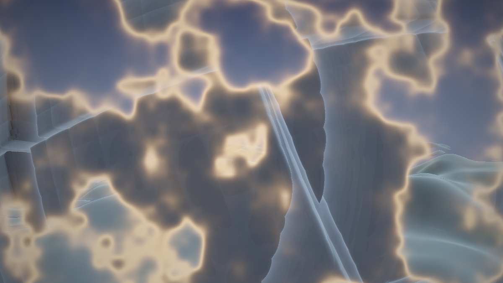

**Ergebnis:** Das fertige Werk. Neun Sekunden gleitet die Kamera über das blinkende Kristallfeld; dann hellt sich das Bild einen Hauch auf, der Dunst weicht, und eine glutgesäumte Front frisst den Himmel zu Panzerplatten – vier Sekunden später kreist dieselbe Kamera tief unter einem rot bedornten Moloch, und die Welt hat vergessen, dass sie je aus Kristall war. Bis zur nächsten Blende.

### Was passiert hier – die drei Politur-Griffe

1. **Der Belichtungs-Kick** ist die kleinste denkbare Dramaturgie: `4t(1−t)` ist während der Plateaus exakt null und blüht mitten in der Blende zu 1 auf – multipliziert auf die Belichtung hebt er den Wechselmoment um bis zu 35 % an. Der Effekt liest sich nicht als „heller", sondern als **Ereignis**: ein Blitz ohne Blitzquelle, das visuelle Ausrufezeichen. (MilkDrop-Preset-Wechsel leben von genau diesem Moment – dort entsteht er oft ungewollt, wenn zwei Presets ihre Helligkeit addieren. Wir setzen ihn absichtlich und dosiert.)
2. **Der Dunst-Puls** zieht am selben `puls`-Faden in die Gegenrichtung: Während der Blende sinkt die geteilte Dunstdichte um bis zu 45 % – die Luft „klart auf", beide Welten zeigen sich im Moment ihrer Begegnung ungewohnt deutlich, und die glühende Front steht frei statt im Nebel. Nach der Blende fällt der Dunst zurück und die haltende Welt hüllt sich wieder ein. Dass Kick und Puls **dieselbe Parabel** lesen, ist Kohärenz im Kleinen: ein Ereignis, zwei Symptome.
3. **Die Farbdrift** (das frosty-caves-Erbe der Serie, hier in der ±8-%-Dosierung des Juggernaut) liegt als letzte multiplikative Schicht über dem **fertigen Composite** – nicht über den Einzelwelten. Beide Welten atmen also im selben langsamen Farbwind; selbst wer nur ein Standbild sieht, sieht ein gemeinsam gestimmtes Bild. Eine Drift *pro Welt* wäre nicht falsch – aber sie würde die Naht wieder aufmachen, die wir gerade zugenäht haben.

### Die Anti-Flau-Checkliste

Das Kondensat der Schritte 4–12 – sieben Fragen an jeden Übergang zwischen zwei Bildwelten, auf Shadertoy wie anderswo:

1. **Verweilt er?** Die puren Welten müssen die Zeit dominieren; der Mischzustand ist Passage, nicht Zustand. *(Plateaus, Schritt 5)*
2. **Mischt er Pixel oder Bilder?** Eine Maske lässt jedes Pixel eine pure Welt zeigen; global gemischt wird nur, wer Grau mag. *(Schritt 6)*
3. **Ist die Front gestaltet?** Fransen und Glühsaum machen aus der Trennlinie ein Motiv. *(Schritte 6–7)*
4. **Wird linear gemischt und einmal entwickelt?** Tonemapping nach dem Mix, ein Tonemapping für alles. *(Schritt 9)*
5. **Kommen die Welten einander entgegen?** Alles mit gemeinsamer Rolle (Licht, Dunst, Belichtung) wird gemorpht – die Maske tauscht nur noch, was wirklich unvereinbar ist. *(Schritt 9)*
6. **Gibt es EINE Kamera?** Zwei Bewegungsfelder = Doppelbelichtung; eines = Verwandlung. *(Schritt 10)*
7. **Ist der Wechsel ein Auftritt?** Ein Akzent (Kick, Puls, Klang …) macht aus dem Übergang ein Ereignis mit Anfang und Ende. *(Schritt 12)*

🧠 **Merke:** Kein Punkt der Liste ist teuer – flau wird ein Übergang nicht aus Ressourcenmangel, sondern aus Unentschiedenheit. Die Checkliste ist in Wahrheit eine einzige Frage in sieben Kleidern: *Weiß jedes Pixel in jedem Moment, zu welcher Welt es gehört?*

---

### Das Gesamtlisting

Drei Pässe. Die Aufteilung ist die didaktisch sauberste, nicht die einzig mögliche – und sie hat einen Grund: **Common** trägt alles, was zeitlos ist (die zwei Welten samt Werkzeugkasten – Schritte 1–2 und 9–10), **Buffer A** trägt das Gedächtnis (Schritt 11), das **Image** trägt das Compositing (Maske, Morph-Verdrahtung, Politur – Schritte 6–9 und 12). So bleibt sichtbar, was die Schritte 1–10 als Single-Pass konnten und was erst der Buffer erlaubt hat. *(Einrichtung: Buffer A → iChannel0 = Buffer A; Image → iChannel0 = Buffer A. Sonst nichts.)*

**COMMON:**

```glsl
// ============================================================================
// "Composite: Transitions" - Kristall-Terrain <-> Juggernaut, mit Maske,
// Morph und Zustandsmaschine. Endstand des Tutorials (Schritt 12).
// Welten: Skelette aus Crystal-Lights- und Juggernaut-Shader-Tutorial.
// Kern-Modus braucht keine iChannels ausser Buffer A (Anhang A: + Music).
// ============================================================================

// ---- STELLSCHRAUBEN --------------------------------------------------------
const float HALTEDAUER  = 9.0;   // s Verweilzeit je Welt (Timer-Trigger)
const float BLENDEDAUER = 4.0;   // s je Uebergang
const float COOLDOWN    = 2.0;   // s Sperrzeit nach der Blende
const int   BLENDART    = 1;     // 0 Crossfade  1 Noise-Wipe  2 radial  3 Richtung
const float SAUM        = 0.06;  // halbe Breite des Misch-Saums
const float GLUT        = 1.2;   // Staerke des Gluehsaums an der Front
const float KICK        = 0.35;  // Belichtungs-Kick im Wechselmoment
const float A_TIEFE     = -1.8;  // Welt A: y der Lichtebene
const float A_ZELLE     = 1.7;   // Welt A: Rasterabstand der Leuchtkoerper
const float B_RADIUS    = 6.0;   // Welt B: Radius des Molochs
const float B_ZELLE1    = 2.6;   // Welt B: grosse Platten
const float B_ZELLE2    = 0.9;   // Welt B: Raster der Positionslichter
const float B_ZELLE3    = 0.32;  // Welt B: feine Rillen
// ----------------------------------------------------------------------------

#define R(a) mat2(cos(a), sin(a), -sin(a), cos(a))

// ---- Meta-Zustand: EIN Satz Regler fuer beide Welten -----------------------
// (setzt das Image je Frame aus dem Blendwert t - VOR Kamera- und Welt-Aufrufen)
float gMorph      = 0.0;                       // 0 = Welt A haelt .. 1 = Welt B haelt
float gDunst      = 0.0018;                    // Dunstdichte (geteilt)
vec3  gDunstFarbe = vec3(0.05, 0.07, 0.12);    // Dunstfarbe  (geteilt)
vec3  b_sonne     = vec3(0.0, 0.3, 1.0);       // setzt kamera() je Frame

// ---- gemeinsamer Zufalls-Baukasten -----------------------------------------
float hash21(vec2 p) { return fract(sin(dot(p, vec2(127.1, 311.7))) * 43758.5453); }

vec2 hash22(vec2 p)
{
    return fract(sin(vec2(dot(p, vec2(127.1, 311.7)),
                          dot(p, vec2(269.5, 183.3)))) * 43758.5453);
}

float hash31(vec3 p) { return fract(sin(dot(p, vec3(127.1, 311.7, 74.7))) * 43758.5453); }

float vnoise(vec2 p)
{
    vec2 i = floor(p), f = fract(p);
    vec2 u = f * f * (3.0 - 2.0 * f);
    return mix(mix(hash21(i),              hash21(i + vec2(1, 0)), u.x),
               mix(hash21(i + vec2(0, 1)), hash21(i + vec2(1, 1)), u.x), u.y);
}

float fbm(vec2 p)
{
    float v = 0.0, a = 0.5;
    for (int i = 0; i < 4; i++) { v += a * vnoise(p); p = p * 2.03 + 11.7; a *= 0.5; }
    return v;
}

float smin(float a, float b, float k)
{
    float h = max(k - abs(a - b), 0.0) / k;
    return min(a, b) - h * h * k * 0.25;
}
float smax(float a, float b, float k) { return -smin(-a, -b, k); }

// ============================================================================
// WELT A: Kristall-Terrain (Skelett; Vollausbau: Crystal-Lights-Tutorial)
// ============================================================================

float a_terrain(vec2 p) { return (fbm(p * 0.35) - 0.45) * 2.4; }

float a_march(vec3 ro, vec3 rd)
{
    float t = 0.0;
    for (int i = 0; i < 90; i++) {
        vec3 p = ro + rd * t;
        float d = p.y - a_terrain(p.xz);
        if (d < 0.002 + 0.002 * t) return t;
        if (t > 30.0) break;
        t += d * 0.45;
    }
    return -1.0;
}

vec3 a_normal(vec2 p, float t)
{
    vec2 e = vec2(0.014 * (1.0 + t * 0.12), 0.0);
    return normalize(vec3(a_terrain(p - e.xy) - a_terrain(p + e.xy),
                          2.0 * e.x,
                          a_terrain(p - e.yx) - a_terrain(p + e.yx)));
}

vec3 a_lampColor(float t)
{
    vec3 bunt = 0.55 + 0.45 * cos(6.28318 * (t + vec3(0.0, 0.33, 0.67)));
    return mix(bunt, vec3(1.0, 0.16, 0.10), gMorph * 0.7);   // Morph: Richtung Welt B
}

float a_blink(vec2 id)
{
    float ph = hash21(id + 31.7);
    float sp = 0.35 + 0.75 * hash21(id + 17.3);
    float w  = 0.5 + 0.5 * sin(6.28318 * (iTime * sp * 0.25 + ph));
    return smoothstep(0.70, 0.97, w) * (0.2 + 0.8 * hash21(id + 5.1));
}

vec3 a_lights(vec2 q)
{
    vec2 base = floor(q / A_ZELLE);
    vec3 acc = vec3(0.0);
    for (int y = -1; y <= 1; y++)
    for (int x = -1; x <= 1; x++) {
        vec2 id = base + vec2(float(x), float(y));
        vec2 c  = (id + 0.5 + 0.7 * (hash22(id + 7.0) - 0.5)) * A_ZELLE;
        vec2 d  = q - c;
        float hell = a_blink(id) + 0.05;
        acc += a_lampColor(hash21(id)) * hell / (0.02 + dot(d, d) * 14.0);
    }
    return acc * 0.05;
}

vec3 a_himmel(vec3 rd)
{
    return mix(vec3(0.10, 0.12, 0.22), vec3(0.02, 0.03, 0.08),
               clamp(rd.y * 3.0, 0.0, 1.0));
}

vec3 a_render(vec3 ro, vec3 rd)          // liefert LINEARE Farbe
{
    float t = a_march(ro, rd);
    vec3 col;
    if (t > 0.0) {
        vec3 p = ro + rd * t;
        vec3 n = a_normal(p.xz, t);

        vec3 rr = refract(rd, n, 1.0 / 1.45);
        if (dot(rr, rr) < 0.5) rr = rd;
        float tE = (A_TIEFE - p.y) / min(rr.y, -0.05);
        vec2 q = (p + rr * tE).xz;

        float dicke = max(p.y - A_TIEFE, 0.0);
        vec3 T = exp(-dicke * vec3(0.85, 0.30, 0.16) * 0.55);

        col = a_lights(q) * T;

        float fres = pow(1.0 - max(dot(n, -rd), 0.0), 3.0);
        col += fres * vec3(0.35, 0.50, 0.65) * 0.5;
        col += max(dot(n, normalize(vec3(0.4, 0.75, -0.5))), 0.0)
             * vec3(0.10, 0.14, 0.20);

        col = mix(col, gDunstFarbe, 1.0 - exp(-gDunst * t * t));
    } else {
        col = a_himmel(rd);
    }
    return col;
}

// ============================================================================
// WELT B: Juggernaut, dark (Skelett; Vollausbau: Juggernaut-Tutorial)
// ============================================================================

vec3 b_gedreht(vec3 p)
{
    p.yz *= R(0.42);
    p.xz *= R(iTime * 0.02);
    return p;
}

float b_fugen(vec3 p, float zelle)
{
    vec3 q = abs(fract(p / zelle) - 0.5) * zelle;
    return zelle * 0.5 - max(q.x, max(q.y, q.z));
}

float b_map(vec3 p)
{
    vec3 q = b_gedreht(p);
    float d = length(q) - B_RADIUS;

    vec3 z1 = floor(q / B_ZELLE1);
    d -= (hash31(z1) - 0.5) * 0.35;

    float slab   = b_fugen(q, B_ZELLE1) - 0.07;
    float schale = (B_RADIUS - 0.30) - length(q);
    d = smax(d, -max(slab, schale), 0.05);

    vec3 h = pow(abs(2.0 * fract(q / B_ZELLE3) - 1.0), vec3(3.0));
    d += 0.02 * (h.x + h.y + h.z) * 0.33;

    return d;
}

float b_march(vec3 ro, vec3 rd, out float glow)
{
    glow = 0.0;
    float t = 0.0;
    for (int i = 0; i < 110; i++) {
        vec3 p = ro + rd * t;
        float d = b_map(p);
        glow += 0.012 / (0.05 + d * d);
        if (d < 0.001 + 0.001 * t) return t;
        if (t > 40.0) break;
        t += d * 0.5;
    }
    return -1.0;
}

vec3 b_normal(vec3 p)
{
    const vec2 e = vec2(0.004, 0.0);
    return normalize(vec3(b_map(p + e.xyy) - b_map(p - e.xyy),
                          b_map(p + e.yxy) - b_map(p - e.yxy),
                          b_map(p + e.yyx) - b_map(p - e.yyx)));
}

float b_fenster(vec3 q)
{
    vec3 z = floor(q / B_ZELLE2);
    float an = step(0.93, hash31(z + 29.0));
    float sp = 0.10 + 0.25 * hash31(z + 3.0);
    float w  = 0.5 + 0.5 * sin(6.28318 * (iTime * sp + hash31(z + 11.0)));
    float blink = 0.25 + 0.75 * smoothstep(0.55, 0.95, w);
    vec3 lokal = (fract(q / B_ZELLE2) - 0.5) * B_ZELLE2;
    float punkt = 1.0 - smoothstep(0.06, 0.24, length(lokal));
    return an * blink * punkt;
}

vec3 b_himmel(vec3 rd)
{
    vec3 col = mix(vec3(0.030, 0.028, 0.045), vec3(0.010, 0.012, 0.022),
                   clamp(rd.y * 1.5 + 0.5, 0.0, 1.0));
    float s = max(dot(rd, b_sonne), 0.0);
    col += pow(s, 30.0) * vec3(0.35, 0.42, 0.60) * 1.2;
    col += pow(s, 5.0)  * vec3(0.35, 0.42, 0.60) * 0.12;
    return col;
}

vec3 b_shade(vec3 p, vec3 rd)
{
    vec3 n = b_normal(p);
    vec3 albedo = vec3(0.16, 0.17, 0.19);

    float dif = max(dot(n, b_sonne), 0.0);
    float amb = 0.5 + 0.5 * n.y;
    vec3 col = albedo * (dif * vec3(0.30, 0.38, 0.55) * 0.6
                       + amb * vec3(0.020, 0.025, 0.045));

    float rim = pow(1.0 - max(dot(n, -rd), 0.0), 3.0);
    col += rim * vec3(0.30, 0.38, 0.55) * 0.55;

    // Positionslichter - der Morph laesst sie in Richtung Welt A schielen
    vec3 lichtFarbe = mix(vec3(0.45, 0.75, 1.00), vec3(1.0, 0.12, 0.08), gMorph);
    col += b_fenster(b_gedreht(p)) * lichtFarbe * 1.4;

    return col;
}

vec3 b_render(vec3 ro, vec3 rd)          // liefert LINEARE Farbe
{
    float glow;
    float t = b_march(ro, rd, glow);
    vec3 col;
    if (t > 0.0) {
        col = b_shade(ro + rd * t, rd);
        col = mix(col, gDunstFarbe, 1.0 - exp(-gDunst * t * t));
    } else {
        col = b_himmel(rd);
    }
    col += glow * 0.05 * vec3(0.28, 0.34, 0.55);
    return col;
}

// ============================================================================
// EINE Kamera fuer beide Welten
// ============================================================================

void kamera(vec2 uv, out vec3 ro, out vec3 rd)
{
    float zt = iTime;

    float wink = zt * 0.03 + 1.2 * sin(zt * 0.021);   // gemeinsame Orbit-Basis

    float dist  = mix(7.0, 11.5, gMorph);             // Welt-Ziele, mitgeblendet
    float hoehe = mix(3.2, -1.4, gMorph);
    vec3  ta    = vec3(0.0, mix(0.0, 1.6, gMorph), 0.0);
    float brenn = mix(1.4, 1.1, gMorph);

    ro = vec3(sin(wink) * dist, hoehe, cos(wink) * dist);
    ro.y = max(ro.y, mix(a_terrain(ro.xz) + 1.5, -4.0, gMorph));   // Boden-Anker

    vec3 fw = normalize(ta - ro);
    vec3 rt = normalize(cross(vec3(0.0, 1.0, 0.0), fw));
    vec3 up = cross(fw, rt);
    rd = normalize(fw * brenn + rt * uv.x + up * uv.y);

    b_sonne = normalize(fw + vec3(0.0, 0.35, 0.0));   // Gegenlicht der Welt B
}
```

**BUFFER A** *(iChannel0 = Buffer A):*

```glsl
// ============================================================================
// BUFFER A - die Zustandsmaschine. Pixel (0,0):
//   x = phase, y = welt, z = haltezeit, w = cooldown   (siehe Schritt 11)
// ============================================================================

void mainImage(out vec4 fragColor, in vec2 fragCoord)
{
    vec4 z = texelFetch(iChannel0, ivec2(0, 0), 0);
    float phase = z.x, welt = z.y, halte = z.z, cool = z.w;

    if (iFrame == 0) { phase = 0.0; welt = 0.0; halte = 0.0; cool = 0.0; }

    float dt = clamp(iTimeDelta, 1.0 / 240.0, 1.0 / 24.0);

    if (phase <= 0.0) {
        halte += dt;
        // TRIGGER (Timer-Modus) - Anhang A ersetzt diese eine Zeile durch den Beat
        bool wechsel = halte > HALTEDAUER;
        if (wechsel && cool <= 0.0) phase = 0.0001;
    } else {
        phase += dt / BLENDEDAUER;
        if (phase >= 1.0) {
            phase = 0.0; welt = 1.0 - welt;
            halte = 0.0; cool = COOLDOWN;
        }
    }
    cool = max(cool - dt, 0.0);

    fragColor = vec4(phase, welt, halte, cool);
}
```

**IMAGE** *(iChannel0 = Buffer A):*

```glsl
// ============================================================================
// IMAGE - das Composite: Maske, Morph-Verdrahtung, Politur
// ============================================================================

float front(vec2 uv)
{
    if (BLENDART == 2)
        return clamp(length(uv) * 1.1
                     + (fbm(uv * 4.0 + 5.0) - 0.5) * 0.25, 0.0, 1.0);
    if (BLENDART == 3)
        return clamp(uv.x + 0.5
                     + (fbm(uv * 5.0 + 9.0) - 0.5) * 0.30, 0.0, 1.0);
    return clamp((fbm(uv * 3.0 + 17.0) - 0.5) * 1.6 + 0.5, 0.0, 1.0);
}

float maske(vec2 uv, float t)
{
    if (BLENDART == 0) return t;
    float s = mix(-2.0 * SAUM, 1.0 + 2.0 * SAUM, t);
    return 1.0 - smoothstep(s - SAUM, s + SAUM, front(uv));
}

vec3 saumGlut(vec2 uv, float t)
{
    if (BLENDART == 0) return vec3(0.0);
    float s = mix(-2.0 * SAUM, 1.0 + 2.0 * SAUM, t);
    float d = abs(front(uv) - s);
    float glut = GLUT / (1.0 + d * d * 900.0);
    glut *= 4.0 * t * (1.0 - t);
    return glut * vec3(1.1, 0.55, 0.25) * 0.5;
}

void mainImage(out vec4 fragColor, in vec2 fragCoord)
{
    vec2 uv = (fragCoord - 0.5 * iResolution.xy) / iResolution.y;

    // (1) Zustand lesen: Blende und Basis-Welt aus Buffer A
    vec4 z = texelFetch(iChannel0, ivec2(0, 0), 0);
    float kurve = smoothstep(0.0, 1.0, z.x);
    float t = mix(kurve, 1.0 - kurve, z.y);          // 0 = Welt A .. 1 = Welt B

    // (2) Parameter-Morph: die Welten wachsen aufeinander zu
    gMorph      = t;
    gDunst      = mix(0.0018, 0.0035, t);
    gDunstFarbe = mix(vec3(0.05, 0.07, 0.12), vec3(0.020, 0.024, 0.040), t);
    float belichtung = mix(1.5, 2.3, t);

    // (3) Wechsel-Akzent: Kick und Dunst-Puls am selben Faden
    float puls = 4.0 * t * (1.0 - t);
    belichtung *= 1.0 + KICK * puls;
    gDunst     *= 1.0 - 0.45 * puls;

    // (4) EINE Kamera (liest gMorph -> nach dem Morph-Block)
    vec3 ro, rd;
    kamera(uv, ro, rd);

    // (5) Maske mit Early-Out: nur zahlen, was man sieht
    float m = maske(uv, t);
    vec3 col;
    if      (m < 0.002) col = a_render(ro, rd);
    else if (m > 0.998) col = b_render(ro, rd);
    else                col = mix(a_render(ro, rd), b_render(ro, rd), m);

    // (6) Gluehsaum: die Front brennt durch
    col += saumGlut(uv, t);

    // (7) EIN Abschluss fuer beides: Drift, Tonemapping, Gamma, Vignette
    col *= 0.92 + 0.08 * cos(iTime * 0.04 + vec3(0.0, 2.1, 4.2));
    col = 1.0 - exp(-col * belichtung);
    col = pow(col, vec3(1.0 / 2.2));
    col *= 1.0 - 0.33 * dot(uv, uv);

    fragColor = vec4(col, 1.0);
}
```

### 🎨 Experimentieren – jetzt am Gesamtwerk

- Das Stellschrauben-Brett durchspielen: `HALTEDAUER 20 / BLENDEDAUER 12 / BLENDART 2 / KICK 0` ist eine meditative Installations-Schleife; `HALTEDAUER 4 / BLENDEDAUER 1.5 / KICK 0.6` ein nervöses Club-Visual – dasselbe Programm
- `KICK` negativ (`-0.3`): der Wechsel *verdunkelt* sich – die neue Welt tritt aus einem Schatten hervor; völlig andere Dramaturgie aus einem Vorzeichen
- Dritte Welt einbauen: ein weiteres Skelett (`c_`), `welt` zählt modulo 3, und aus dem einen `t` werden zwei Maskenläufe – das Schema trägt, nur das Image wird ein `if` reicher
- Die Glut ans Morph-Ziel koppeln: `glutFarbe = mix(vec3(1.1,0.55,0.25), vec3(0.4,0.9,1.2), z.y)` – Hinweg brennt warm, Rückweg kalt; die Blende bekommt eine sichtbare Richtung

---

# Anhang A: Audio – der beat-getriggerte Wechsel

In den anderen Tutorials der Serie ist Audio der Schmuck – hier ist es **das Kernstück**: Der Welt-Wechsel *ist* das Shadertoy-Pendant zum Milkdrop-Preset-Wechsel, und ein Preset-Wechsel, der nicht auf die Musik hört, ist nur ein Diakarussell. Die Zustandsmaschine aus Schritt 11 wurde genau dafür gebaut – ihre Trigger-Zeile wartet auf diesen Anhang.

Voraussetzung auf shadertoy.com: im **Buffer-A**-Tab zusätzlich **iChannel1 mit „Music"** belegen (iChannel0 bleibt die Selbstreferenz). Die Textur ist 512×2: Zeile 0 (`y ≈ 0.25`) das FFT-Spektrum. Die `bandLevel`-Grundlagen und die Skalen-Fallen der Shadertoy-FFT stehen im **Anhang A des Crystal-Lights-Tutorials**; dessen Anhang B3 skizzierte die Buffer-Envelope als Ausblick – hier wird sie **voll ausgeführt**, denn sie ist jetzt kein Nice-to-have mehr, sondern der Zündmechanismus des ganzen Werks.

---

## Schritt A1 – Die Beat-Envelope in der Zustandsmaschine (voll ausgeführt)

**Neu:** Der Audio-Zustand zieht als **zweites Zustandspixel** (1,0) neben die Wechsel-Maschine: geglätteter Bass, adaptiver Beat-Trigger, Abkling-Envelope, Energie-Vorrat, geglättete Lautheit. Und ein Prüfstand-Image, um die Schwellen **vor** dem Einbau zu kalibrieren.

**Buffer A** (eigenständiger Mini-Aufbau zum Testen; iChannel0 = Buffer A, iChannel1 = Music):

```glsl
// ============================================================================
// BUFFER A (Pruefstand A1) - Zustandsmaschine + Audio-Zustand
// Pixel (0,0): x = phase, y = welt, z = haltezeit, w = cooldown
// Pixel (1,0): x = glatterBass, y = beatEnv, z = energieVorrat, w = glatteLautheit
// iChannel0: Buffer A (Selbstreferenz), iChannel1: Music
// ============================================================================

const float HALTEDAUER  = 24.0;  // Timer ist nur noch FALLBACK (greift bei Stille)
const float BLENDEDAUER = 4.0;
const float COOLDOWN    = 2.0;
const float MIN_HALTE   = 3.0;   // Mindest-Verweilzeit: Hysterese gegen Geflacker

float bandLevel(float lo, float hi)
{
    float sum = 0.0;
    const int N = 12;
    for (int i = 0; i < N; i++) {
        float x = mix(lo, hi, (float(i) + 0.5) / float(N));
        sum += texture(iChannel1, vec2(x, 0.25)).x;
    }
    return sum / float(N);
}

void mainImage(out vec4 fragColor, in vec2 fragCoord)
{
    vec4 zust  = texelFetch(iChannel0, ivec2(0, 0), 0);
    vec4 audio = texelFetch(iChannel0, ivec2(1, 0), 0);
    if (iFrame == 0) { zust = vec4(0.0); audio = vec4(0.0); }

    float dt = clamp(iTimeDelta, 1.0 / 240.0, 1.0 / 24.0);

    // ---- AUDIO-ZUSTAND: das B3-Muster der Schablone, voll ausgefuehrt ------
    float bass  = bandLevel(0.00, 0.05);
    float vol   = bandLevel(0.00, 0.70);

    float glatt = mix(audio.x, bass, 0.10);            // Tiefpass ueber die Zeit
    float schlag = step(glatt * 1.35 + 0.02, bass);    // adaptiver Beat-Trigger
    float env   = max(audio.y * 0.90, schlag);         // zuendet hart, klingt weich aus

    float vorrat = audio.z + bass * dt * 0.4;          // laedt kontinuierlich ...
    float drop   = schlag * step(1.5, vorrat);         // ... Kick nach viel Ruhe = DROP
    vorrat *= 1.0 - schlag * 0.8;                      // jeder Schlag entlaedt

    float lautheit = mix(audio.w, vol, 0.05);          // sehr traege Lautheit

    // ---- WECHSEL-ZUSTAND: die Maschine aus Schritt 11, Trigger = Beat ------
    float phase = zust.x, welt = zust.y, halte = zust.z, cool = zust.w;

    if (phase <= 0.0) {
        halte += dt;
        // DER Trigger-Tausch: Beat schaltet den Welt-Wechsel (Timer als Fallback)
        bool wechsel = (schlag > 0.5 && halte > MIN_HALTE) || halte > HALTEDAUER;
        if (wechsel && cool <= 0.0) phase = 0.0001;
    } else {
        phase += dt / BLENDEDAUER;
        if (phase >= 1.0) {
            phase = 0.0; welt = 1.0 - welt;
            halte = 0.0; cool = COOLDOWN;
        }
    }
    cool = max(cool - dt, 0.0);

    // ---- beide Zustandspixel schreiben -------------------------------------
    if (ivec2(fragCoord) == ivec2(1, 0))
        fragColor = vec4(glatt, env, vorrat, lautheit);
    else
        fragColor = vec4(phase, welt, halte, cool);
}
```

**Image** (Prüfstand; iChannel0 = Buffer A):

```glsl
void mainImage(out vec4 fragColor, in vec2 fragCoord)
{
    vec2 uv = fragCoord / iResolution.xy;
    vec4 zust  = texelFetch(iChannel0, ivec2(0, 0), 0);
    vec4 audio = texelFetch(iChannel0, ivec2(1, 0), 0);

    // Hintergrund = Blendwert: dunkelblau haelt A, dunkelrot haelt B
    float kurve = smoothstep(0.0, 1.0, zust.x);
    float t = mix(kurve, 1.0 - kurve, zust.y);
    vec3 col = mix(vec3(0.04, 0.07, 0.16), vec3(0.14, 0.03, 0.03), t);

    // Balken: geglaetteter Bass | Beat-Envelope | Blende-Phase
    if (uv.x < 0.31)                col = uv.y < audio.x ? vec3(0.9, 0.6, 0.2) : col;
    if (uv.x > 0.35 && uv.x < 0.65) col = uv.y < audio.y ? vec3(0.3, 0.9, 1.0) : col;
    if (uv.x > 0.69)                col = uv.y < zust.x  ? vec3(0.8, 0.3, 0.9) : col;

    fragColor = vec4(col, 1.0);
}
```


**Ergebnis:** Musik an – und die Maschine lebt: Links wogt träge der geglättete Bass, in der Mitte zuckt die Envelope bei jedem Kick auf und glüht aus, rechts fährt bei jedem *akzeptierten* Kick die Phase einmal hoch – und der Hintergrund wechselt die Farbe: Der Welt-Wechsel folgt jetzt dem Schlagzeug. In der Strophe schaltet er auf jeden markanten Kick (frühestens alle `MIN_HALTE + COOLDOWN` Sekunden), in der Stille übernimmt der 24-Sekunden-Timer.

### Was passiert hier

**Der adaptive Trigger ist das Herz** – und der Grund, warum das Ganze im Buffer leben muss. `bass > glatt·1.35 + 0.02` vergleicht den Moment nicht mit einer Absolutschwelle (die für jeden Track anders läge – die A1-Falle der Schablone), sondern mit dem **eigenen gleitenden Mittel**: „deutlich lauter als zuletzt üblich" funktioniert für leise und laute Tracks gleichermaßen, wie MilkDrops normiertes `bass`. Das gleitende Mittel *ist* Gedächtnis – ohne Buffer gäbe es nur die Absolutschwelle.

**Drei Hysterese-Schichten** verhindern das Wechsel-Geflacker, die Berufskrankheit aller Beat-Trigger (jeder Kick eines 4/4-Tracks käme sonst als Wechselbefehl – acht Weltwechsel in vier Sekunden):

1. `MIN_HALTE` – frisch angekommene Welten sind unantastbar; der Trigger hört erst wieder hin, wenn die Welt sich etabliert hat.
2. `COOLDOWN` – nach der Ankunft ist die Maschine taub (aus Schritt 11 geerbt).
3. Das **Einrasten der Phase** – eine laufende Blende ist nicht unterbrechbar; ein Kick *während* der Blende verpufft.

Zusammen ergibt das den Ziel-Rhythmus: *Der Wechsel kommt auf einen Beat – aber nicht auf jeden.* Die Musik bestimmt das **Wann exakt**, die Hysterese das **Wie oft**.

**Die eine neue Buffer-Technik** dieses Schritts steht in den letzten vier Zeilen: **zwei Zustandspixel in einem Pass**. Beide Pixel rechnen denselben Code (jedes Buffer-Pixel tut das), aber jedes *schreibt* nur seinen Teil des Zustands – das `ivec2(fragCoord)`-Gate verteilt die Rollen. Verschwenderisch (alle anderen Pixel rechnen ins Leere) und völlig üblich: Der Buffer ist winzig im Vergleich zum Image-Pass.

### 🎨 Experimentieren

- Den Faktor `1.35` auf `1.15` senken: der Trigger wird nervös und nimmt auch Snare-Ghost-Notes – die Hysterese fängt es ab, aber der Wechsel klebt jetzt am frühesten erlaubten Beat statt am *markanten*. Empfindlichkeit ist Geschmackssache pro Genre
- `MIN_HALTE = 8.0` bei treibender Musik: der Wechsel fällt fast immer auf den Phrasen-Anfang – ganz ohne Takt-Erkennung, reine Statistik
- Den Drop-Balken dazulegen: vierten Streifen mit `audio.z / 3.0` – man *sieht* den Vorrat in Breaks anwachsen und beim Drop kollabieren

---

## Schritt A2 – Der Mapping-Katalog: wohin mit welchem Signal?

Kein neuer Shader – eine Landkarte. Alle Schnipsel beziehen sich auf das Gesamtlisting aus Schritt 12 plus den A1-Audio-Zustand; `audio` ist das Zustandspixel (1,0). Wie immer gilt: *musikalische Rolle → visuelle Rolle* – und hier zusätzlich: fast alle Mappings landen in der **Maschine**, nicht im Bild.

| # | Audio | steuert | Eingriff | warum es passt |
|---|---|---|---|---|
| 1 | Beat (adaptiv) | **den Welt-Wechsel** | Trigger-Zeile in Buffer A: `(schlag > 0.5 && halte > MIN_HALTE) \|\| halte > HALTEDAUER` | **Das Haupt-Mapping – der Preset-Wechsel.** Der Kick ist die größte Zäsur der Musik, der Weltwechsel die größte des Bildes; fallen beide zusammen, wirkt das Werk „geschnitten". Timer-Fallback hält Stille am Leben |
| 2 | Drop (Energie-Vorrat) | seltene, **große** Wechsel | Trigger-Zeile stattdessen: `(drop > 0.5) \|\| halte > HALTEDAUER` | Nur der erste Kick nach viel angestautem Vorrat schaltet – der Wechsel wird zum Track-Ereignis (2–4× pro Song statt alle paar Takte). Ideal mit langer `BLENDEDAUER`: der Drop reißt eine breite Front auf |
| 3 | Bass (geglättet) | **Blendtempo** | in Buffer A: `phase += dt / BLENDEDAUER * (0.6 + 1.2 * min(glatt * 2.5, 1.5));` | Die verbotene Frucht der Serie – „Geschwindigkeit statt Position" – ist hier **legal**, weil `phase` Zustand ist: Bei druckvoller Musik frisst sich die Front schneller durch, in ruhigen Passagen kriecht sie. Kein Teleportieren, nur Integration |
| 4 | Lautheit (träge) | **Glühsaum-Breite** | Common: `float gLautheit = 0.0;` + in `maske()`/`saumGlut()` jedes `SAUM` durch `(SAUM * (0.7 + 2.0 * gLautheit))` ersetzen; Image setzt `gLautheit = audio.w;` | Laute Passagen = breite, lodernde Front; leise = schmaler Schnitt. Die *träge* Lautheit (Zeitkonstante ~Sekunden) hält die Frontbreite ruhig – roher Pegel würde die Kante im Frame-Takt zittern lassen |
| 5 | Beat-Envelope | Wechsel-Akzent | Image: `belichtung *= 1.0 + KICK * puls + 0.10 * audio.y;` | Der kleine Bruder von Mapping 1: Auch *ohne* Wechsel zuckt das Bild dezent mit – das Werk hört hörbar zu, selbst mitten im Halten. Sparsam dosieren |

**Zwei Warnungen**, beide sind hier Chefsache:

- **Cooldown und Hysterese sind nicht optional.** Ohne `MIN_HALTE`/`COOLDOWN`/Einrasten wechselt das Werk im Kick-Takt – acht Blenden in vier Sekunden sind kein Visual, sondern ein Stroboskop mit Umbaupause. Wer die Empfindlichkeit hochdreht (Faktor 1.35 runter), muss die Hysterese *mit* hochdrehen. Die beiden Regler arbeiten als Paar: Empfindlichkeit wählt die Kicks aus, Hysterese verteilt sie über die Zeit.
- **Die Welt-Uhren bleiben tabu.** Alle `iTime`-Uhren in den Welten (Blinken, Eigendrehung, Orbit) sind weiterhin *Positionen* – für sie gilt die alte Regel unverändert. Die Buffer-Erlaubnis gilt nur für Größen, die tatsächlich als Zustand integriert werden (`phase`, und wer mag: ein eigener Kamera-Winkel-Zustand als 🎨-Projekt).

---

## Schritt A3 – Das Werk hört zu: die Einbau-Diffs

**Neu:** Die Mappings 1, 3, 4 und 5 wandern in das Gesamtlisting aus Schritt 12. Auf shadertoy.com zusätzlich: **Buffer A → iChannel1 = Music**.

**(a) Common** – zwei Ergänzungen:

```glsl
// STELLSCHRAUBEN, ergaenzen bzw. aendern:
const float HALTEDAUER = 24.0;   // GEAENDERT: Timer ist jetzt Fallback bei Stille
const float MIN_HALTE  = 3.0;    // NEU: Mindest-Verweilzeit (Hysterese)

// bei den Meta-Globals, NEU:
float gLautheit = 0.0;           // traege Lautheit (setzt das Image aus Buffer A)
```

**(b) Buffer A** – komplett ersetzen durch das A1-Listing (dessen lokale Konstanten `HALTEDAUER`/`BLENDEDAUER`/`COOLDOWN`/`MIN_HALTE` streichen – sie kommen jetzt aus Common), dann zwei Zeilen anfassen:

```glsl
// Mapping [3]: das Blendtempo atmet mit dem (geglaetteten!) Bass
        phase += dt / BLENDEDAUER * (0.6 + 1.2 * min(glatt * 2.5, 1.5));

// Wer Mapping [2] statt [1] will - der Drop-Modus, eine Zeile:
        bool wechsel = (drop > 0.5) || halte > HALTEDAUER;
```

**(c) Image** – drei Zeilen:

```glsl
// nach dem Zustands-Read (1), NEU:
    vec4 audio = texelFetch(iChannel0, ivec2(1, 0), 0);
    gLautheit = audio.w;                                     // [4] Saum-Breite

// im Akzent-Block (3), die Belichtungs-Zeile erweitert:
    belichtung *= 1.0 + KICK * puls + 0.10 * audio.y;        // [5] Envelope-Zucken
```

**(d) maske() und saumGlut()** – Mapping [4], jeweils die `SAUM`-Vorkommen:

```glsl
    float saum = SAUM * (0.7 + 2.0 * gLautheit);             // statt SAUM direkt
    float s = mix(-2.0 * saum, 1.0 + 2.0 * saum, t);
    // ... und in den smoothstep-/Glut-Zeilen ebenfalls "saum" statt "SAUM"
```

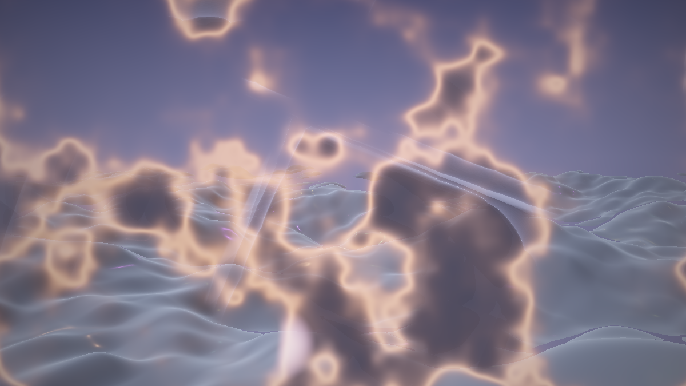

**Ergebnis:** Das fertige, hörende Werk. Es hält seine Welt, solange die Musik trägt – und wenn nach der Mindest-Verweilzeit der nächste markante Kick fällt, bricht auf diesen Schlag die Front auf: bei lauter Musik breit und lodernd, mit bass-getriebenem Tempo; in ruhigen Passagen als schmaler, langsamer Schnitt. Wird es still, wechselt der Timer gemächlich weiter. Und bei jedem Kick dazwischen zuckt die Belichtung kaum merklich – das Werk atmet mit, auch wenn es gerade nicht wechselt.

### Was passiert hier

Das dramaturgische Kalkül unterscheidet sich von den Quell-Tutorials: Dort *verstärkte* Audio vorhandene Effekte – hier **entscheidet** es. Deshalb liegt fast alles in Buffer A statt im Image: Die Musik steuert die *Maschine* (wann, wie schnell, wie breit), und die Maschine steuert das Bild. Nur die Mappings 4 und 5 berühren das Image direkt – und beide über *geglättete* Größen (`audio.w`, `audio.y`), nie über rohe Pegel. Die Sockel-plus-Hub-Bauform (`0.6 + 1.2·…`, `0.7 + 2.0·…`) hält auch hier den Stille-Fall gesund: Ohne Musik fällt alles auf die Timer-Defaults zurück – das Werk ist nie tot, nur geduldiger.

### 🎨 Experimentieren

- Beide Trigger kombinieren: normaler Beat wechselt die Welt, ein **Drop** erzwingt zusätzlich `BLENDART`-Wechsel oder verdoppelt den `KICK` (dazu `drop` als fünften Zustandswert exportieren – das zweite Pixel hat noch Platz im Kopf, nicht in den Slots: Zeit für Pixel (2,0)!)
- Mapping 3 invertieren: `(1.8 - 1.2 * min(glatt * 2.5, 1.0))` – bei harter Musik *langsame*, majestätische Fronten; gegen den Strich gebürstet, überraschend edel
- Welt-Bindung: `MIN_HALTE = mix(3.0, 8.0, welt);` – das Terrain wechselt willig, der Moloch lässt sich nicht hetzen; die Welten bekommen Charakter im *Zeitverhalten*

---

# Anhang B: LumiViz – In-Shader-Übergang vs. Chain-Wechsel

Die **allgemeine Mechanik** (drei Import-Wege, Portabilitäts-Checkliste, Audio-Adapter, Buffer-Semantik) steht vollständig im **Crystal-Lights-Shader-Tutorial, Anhang B** – das wiederholen wir nicht. Hier die Kurzfassung plus das, was an *diesem* Werk besonders ist: Es konkurriert in der App mit einem eingebauten Feature.

## B1 – Der Weg in die App (Kurzfassung)

- **Copy & Paste** in einen Shadertoy-Chain-Node: Common, Buffer A und Image entsprechen dem Multipass-Support des Nodes (Buffer-Pass mit **Selbstreferenz** als Eingang – die Ping-Pong-Semantik liest wie beim Original das Vorframe; Common-Inhalte je nach Editor-Stand in beide Pässe kopieren). Kompilierfehler kommen dank `#line 1` mit den eigenen Zeilennummern zurück.
- **Audio:** Buffer A bekommt Music auf dem gewählten Audio-iChannel – das 512×2-Layout ist identisch, `bandLevel` läuft unverändert. Oder gleich das **Adapter-Muster** (Crystal Lights, B2): `glatt`/`schlag`/`env` lassen sich auch aus den eingebauten Uniforms `bass`/`beat` speisen – die Glättung im Buffer bleibt trotzdem sinnvoll (eigene Zeitkonstanten).
- **Determinismus:** In LumiViz tickt `iTime` als deterministische Sim-Uhr mit festem Frame-Schritt – damit ist sogar die Zustandsmaschine reproduzierbar (die `iTimeDelta`-Einschränkung aus Schritt 11 entfällt praktisch). Der Timer-Modus ist dort prüfstandsfest.

## B2 – Die konzeptionelle Brücke: wann In-Shader, wann App-Wechsel?

Dieses Tutorial baut einen Preset-Wechsel **im** Shader nach – aber LumiViz *hat* Preset-Wechsel: Chains werden getauscht, und der MilkDrop-Node kennt je Wechsel sogar wählbare Puffer-Strategien (Behalten, Löschen, Fading mit Mix-Regler, Ausblenden). Wozu dann das alles? Weil die beiden Werkzeuge Verschiedenes können – die Trennlinie ist genau der Stoff dieses Tutorials:

| | **In-Shader-Übergang** (dieses Werk) | **Chain-Wechsel** (App) |
|---|---|---|
| Was wechselt | zwei fest **einkompilierte** Welten | beliebige, auch fremde Chains |
| Maske | ✅ pro Pixel, mit Front & Glühsaum – beide Welten leben im selben Frame | ❌ die Pässe sehen einander nicht; Fading mischt Feedback-*Puffer*, keine live gerenderten Welten |
| Parameter-Morph | ✅ gemeinsame Regler, echtes Aufeinander-Zuwachsen | ❌ Parameter des alten Presets enden mit ihm |
| Kamera-Kontinuität | ✅ eine Fahrt trägt beide | ❌ jede Chain hat ihre eigene Welt |
| Vorbereitung | hoch – beide Welten müssen als Skelette **im selben Code** stehen | null – jedes Preset-Paar geht sofort |
| Kosten | im Saum beide Welten pro Pixel | immer genau eine Chain |

Kurz: **Der In-Shader-Übergang ist die Kür für ein kuratiertes Welten-Paar** – wenn der Übergang selbst das Kunstwerk sein soll (Konzert-Visual, Installations-Loop). **Der Chain-Wechsel ist das Werkzeug für den Alltag** – Playlist, Zufalls-Rotation, fremde Presets. Die Zwischenstufe gibt es auch: dieses Werk als *ein* Node in einer Chain, die per App-Wechsel gegen andere getauscht wird – der Wechsel im Wechsel.

**Panel-Parameter-Kandidaten** für den Node-Editor (die natürlichen ersten Griffe, alle bereits als STELLSCHRAUBEN oben im Common):

- `HALTEDAUER` / `BLENDEDAUER` – der Grundrhythmus (das Pendant zum Preset-Wechsel-Intervall der App)
- `BLENDART` – Crossfade/Noise/Radial/Richtung (das Pendant zur Puffer-Wechsel-Strategie des MilkDrop-Nodes)
- die **Trigger-Empfindlichkeit** (der `1.35`-Faktor aus A1) samt `MIN_HALTE` – Beat-gierig bis drop-geduldig
- `GLUT` und `KICK` – wie laut der Übergang auftritt

---

## Abspann

Damit ist das Composite komplett: zwei kondensierte Welten in einem Namensraum, eine Übergangs-Kurve mit Plateaus, drei Wipe-Masken mit brennender Front, ein Parameter-Morph, eine geteilte Kamera, eine Zustandsmaschine mit Beat-Ohr – und die Erkenntnis, dass der Moment *zwischen* zwei Bildern ein eigenes Bauwerk ist.

Zwei ehrliche Hinweise zum Schluss:

- **Dieses Tutorial ist am Schreibtisch konstruiert – und inzwischen in LumiViz gegengerendert:** Alle Schritte laufen als Chains im AvsStandalone (die Screenshots bei den Schritten; Einleitung und `composite_transitions_schritte/`), inklusive nachgewiesener Weltwechsel der Zustandsmaschine (Timer-Modus deterministisch, Beat-Modus über die dokumentierte B1-Anpassung); auf shadertoy.com selbst wurde weiterhin kein Schritt geprüft, dort sind Überraschungen möglich. Die kritischen Formeln (Plateau-Amplitude, Masken-Vertrag, Zustandsübergänge) sind nachgerechnet und im Render bestätigt – *ästhetische* Fehleinschätzungen (eine Glut zu fett, ein Morph zu früh, ein Kick zu laut) bleiben trotzdem Geschmacksfragen ans lebende Bild. Wer beim Nachbauen stolpert: Die „Was passiert hier"-Abschnitte tragen jeweils die Absicht – sie ist im Zweifel verlässlicher als die Konstante daneben.
- **Die Balance der Blende ist Feinmechanik.** Haltedauer, Blendedauer, Saum-Breite, Morph-Stärke und Kick greifen ineinander wie die dark-Konstanten des Juggernaut: Eine Zahl ändern heißt meist, zwei nachziehen. Der verlässlichste Kompass ist die Checkliste aus Schritt 12 – und die Frage dahinter: *Weiß jedes Pixel in jedem Moment, zu welcher Welt es gehört?*

Wer weitermachen will: Fast jeder 🎨-Kasten ist ein eigenes Werk – besonders ergiebig sind der Drop-Modus mit langen Fronten (A2, Mapping 2), die Blendart-pro-Wechsel-Würfelei (Schritt 11) und die dritte Welt (Schritt 12). Und wer statt zweier *fremder* Welten zwei **Varianten derselben** blenden will (dark ↔ brighter, wie das Juggernaut-Preset-Paar), stellt fest: Dann ist fast alles Morph und fast nichts Maske – das entgegengesetzte Ende derselben Skala, und ein Wochenende wert.

Und jetzt: Musik an – und auf den Wechsel warten. 🎵🔀

Screenshots: gerendert mit AvsStandalone (Testing-Build), Chains in `composite_transitions_schritte/`.

