# Crystal Lights – Ein Kristall-Terrain von Grund auf

> **Dokumenttyp:** Tutorial  
> **Version:** 1.2.0  
> **Status:** Stabil  
> **Domain:** Programming  
> **Kategorie:** Algorithms  
> **Programmiersprache:** GLSL (Shadertoy/WebGL2)  
> **Voraussetzungen:** [Pyramid-Spiral-Shader-Tutorial](PyramidSpiral-tutorial.md), Schritte 1–7  
> **Schwierigkeitsgrad:** Fortgeschritten  
> **Tutorial-Typ:** Implementierung  
> **Zeitschätzung:** 6–8 h für die Schritte 1–14 auf shadertoy.com (inkl. Experimentieren), zusätzlich ~2 h für die Anhänge A/B; reines Durchlesen ~2 h  
> **Gültigkeit:** Shadertoy-Image-Shader (WebGL2); Anhang B zusätzlich für den Shadertoy-Node der LumiViz-Effect-Chain (Stand Session 65/67)  
> **Zweck:** Schritt-für-Schritt-Aufbau eines halbliquiden Kristall-Terrains mit Höhenfeld-Raymarching, Brechung und blinkenden Punktlichtern – vom leeren Shader bis zum fertigen Werk samt Audio-Reaktivität.  
> **Zielgruppe:** Shader-Entwickler mit Raymarching-Grundlagen; Leser der Shader-Tutorial-Serie  
> **Sprache:** Deutsch  

> ⚠ **HINWEIS: Nicht-normative ASCII-Darstellungen**
>
> Die ASCII-Skizze im Bauplan-Abschnitt dient ausschließlich der **illustrativen Unterstützung**
> und setzt eine Monospace-Schrift voraus. Verbindlich sind die textuelle Beschreibung und der Code.

---

## Inhaltsverzeichnis

1. Einleitung
2. Lernziele
3. Voraussetzungen
4. Übersicht der Schritte
5. Der Bauplan: Was wir eigentlich rendern
6. Schritt 1 – Die Bühne: Bildaufteilung
7. Schritt 2 – Die Kamera: Strahlen auf eine Bodenebene
8. Schritt 3 – Höhenfeld-Raymarching: die Ebene wird Landschaft
9. Schritt 4 – FBM: aus Sinus wird Terrain
10. Schritt 5 – Normalen und kaltes Licht
11. Schritt 6 – Kristall-Facetten: Voronoi-Platten
12. Schritt 7 – Halbliquid: das Liquiditätsfeld
13. Schritt 8 – Lücken im Terrain
14. Schritt 9 – Die Leuchtkörper
15. Schritt 10 – Transparenz: Brechung und Absorption
16. Schritt 11 – Glow und Sparkle: liquide Stellen leuchten
17. Schritt 12 – Isometrie ↔ Perspektive: die Kamera wird ein Instrument
18. Schritt 13 – Die Kamerafahrt: Umkehr, Rotation, Perspektivwechsel
19. Schritt 14 – Politur: Nebel, Farbdrift, Tonemapping – der fertige Shader
20. Anhang A: Audio-Reaktivität (Schritte A1–A3)
21. Anhang B: Der Weg in die App – und zurück (B1–B3)
22. End-Validierung
23. Fehlerbehebung
24. Nächste Schritte
25. Abspann
26. Siehe auch
27. Changelog

---

## Einleitung

**Ziel:** Ein halbtransparentes, halb-flüssiges **Kristall-Terrain**, das die untere Bildhälfte füllt (mit Hügeln, die gelegentlich darüber hinauswachsen). Unter dem Kristall liegen **farbige Leuchtkörper**, die unregelmäßig aufblinken – ihr Licht wird vom Kristall gebrochen und erzeugt an den flüssigeren Stellen weichen Glow. Das Terrain kann durchgängig sein oder **Lücken** haben (parametrierbar oder dynamisch), und am Ende fliegt eine Kamera darüber – mit Richtungsumkehr, langsamer Rotation und einem fließenden Wechsel zwischen **isometrischer** und perspektivischer Sicht.

**Stil-Vorbilder** (beide liegen im Repo unter `asset/Milkdrop3/presets/`):

- *martin – frosty caves 2.milk*: das kalte Eis-Farbklima, punktförmige Lichter als `1/d²`-Blitze (`flash1 = 1/dot(uva,uva)` im Comp-Shader), die langsam wandernde Farbdrift (`roam_sin`) und das Tonemapping `ret = 1-exp(-ret)` – alle vier Zutaten bauen wir in GLSL nach.
- *GreatWho – Rock The House_2024.milk*: das harte Bass-Gate (`a = if(above(bass,0.95), 2, 0)`) – die Vorlage für die Beat-Blitze in Anhang A.

**So funktioniert dieses Tutorial:**

- Es läuft **direkt auf Shadertoy**: Jeder Schritt ist ein vollständiger, lauffähiger Shader. Kopiere ihn nach [shadertoy.com/new](https://www.shadertoy.com/new), drücke `Alt+Enter` – fertig. (Der Weg in die App ist Thema von Anhang B.)
- **In LumiViz:** Jeder Schritt liegt zusätzlich als lauffähige Ein-Node-Chain in `crystal_lights_schritte/` (die `.glsl` dort sind die materialisierte Rekonstruktion der Diff-Schritte, `make_schritte.py` generiert daraus die Chains – das Markdown ist die SSOT). Die Screenshots bei den Schritten stammen aus genau diesen Chains, gerendert im AvsStandalone (`AvsStandalone crystal_lights_schritte --auto --frames 300 --size 800x450 --out crystal_lights_bilder`); die Anhang-Bilder hören dabei das synthetische Testsignal des Standalone.
- Jeder Schritt fügt **genau eine Technik** hinzu; unter jedem Schritt stehen Variationsideen (🎨).
- Die Reihenfolge folgt derselben Schule wie beim Vorgänger: **Geometrie → Material → Licht → Bewegung → Politur.** Erst muss die Form stimmen, dann kommt der Schmuck.
- Wer Raymarching-Grundlagen (SDF, Normalen aus dem Gradienten, `fract(sin(dot(...)))`-Hash) noch nie gesehen hat, liest am besten vorher die Schritte 1–7 des Pyramid-Spiral-Tutorials – hier gehen wir über diese Basics zügiger hinweg. Neu ist diesmal die Königsdisziplin **Höhenfeld-Raymarching** (Terrain statt Tunnel).

Die Schritt-Konvention der Serie deckt die vier Elemente eines Tutorial-Schritts (Ziel, Anleitung, Validierung, Vertiefung) mit festen Markierungen ab – Tab. 1 zeigt die Zuordnung, die in jedem Schritt dieses Dokuments gilt:

| Konvention im Schritt | Bedeutung |
|---|---|
| **Neu:** | Ziel des Schritts – die eine Technik, die hinzukommt |
| Code-Block | Durchführung – der vollständige bzw. geänderte Shader-Code |
| **Ergebnis:** | Validierung des Schritts – das prüfbare Sichtergebnis |
| „Was passiert hier" | Anleitung und Erklärung des Codes |
| 🎨 Experimentieren | Optionale Vertiefung und Variationen |

*Tab. 1: Konventions-Mapping – Schritt-Markierungen dieses Tutorials und ihre Rolle in der Schritt-Struktur*

## Lernziele

Nach diesem Tutorial können Sie …

1. … einen **Höhenfeld-Raymarcher** mit gedrosselter Schrittweite und wachsender Trefftoleranz implementieren, der auch eine unstetige Terrainfunktion (Plattensprünge, Lücken) ohne Durchschuss-Artefakte rendert (Schritte 2–3, 6).
2. … **prozedurale Felder** (Value-Noise, FBM, Voronoi, Schwellwert-Masken) zu einer parametrierbaren Landschaft mit örtlich wechselndem Material kombinieren (Schritte 4, 6–8).
3. … ein **transparentes Material** mit `refract`-Brechung und Beer-Lambert-Absorption implementieren, dessen Farbe aus der Materialdicke entsteht, ergänzt um Fresnel, Streu-Glow und Specular-Sparkle (Schritte 9–11).
4. … eine **Kamera** erstellen, die stufenlos zwischen Lochkamera und isometrischer Parallelprojektion überblendet und mit fünf inkommensurablen Sinus-Uhren deterministisch choreografiert ist – inklusive weicher Richtungsumkehr (Schritte 12–13).
5. … **Audio-Reaktivität** mit Beat-Gate und Mapping-Katalog in den Shader einbauen sowie geglättete Pegel und adaptive Beat-Envelopes über einen Buffer-A-Zustand implementieren (Anhang A, B3).
6. … typische **Raymarching-Artefakte** (Durchschuss an steilen Flanken, Fern-Flimmern) gezielt erzeugen, erkennen und beheben (Schritte 3, 5; Fehlerbehebung).

## Voraussetzungen

**Wissen:**

- [Pyramid-Spiral-Shader-Tutorial](PyramidSpiral-tutorial.md), Schritte 1–7 – UV-Aufbau, SDF-Raymarching-Grundlagen, Normalen aus dem Gradienten, Hash-Funktionen. Diese Basics werden hier vorausgesetzt und nur zügig wiederholt.

**Software:**

- Ein aktueller, WebGL2-fähiger Browser (Chrome, Firefox, Edge oder Safari in einer aktuellen Desktop-Version) – Shadertoy ist eine Web-Plattform, es ist keine Installation nötig.
- Zugang zu [shadertoy.com](https://www.shadertoy.com/new) – Shader lassen sich ohne Konto erstellen und ausführen; zum Speichern eigener Shader ist ein kostenloses Konto erforderlich.
- Für Anhang A: ein „Music"-Kanal im Shadertoy-Editor (eingebaute Track-Auswahl, keine eigene Datei nötig).

**Optional (nur Anhang B):**

- LumiViz/MyViz mit Shadertoy-Node in der Effect-Chain (Stand Session 65/67); für den URL-Import zusätzlich ein kostenloser Shadertoy-App-Key.

## Übersicht der Schritte

Das Tutorial führt in 14 Schritten vom leeren Shader zum fertigen Werk; die Anhänge ergänzen Audio-Reaktivität (A1–A3) und den Weg in die App (B1–B3):

1. Die Bühne: Bildaufteilung
2. Die Kamera: Strahlen auf eine Bodenebene
3. Höhenfeld-Raymarching: die Ebene wird Landschaft
4. FBM: aus Sinus wird Terrain
5. Normalen und kaltes Licht
6. Kristall-Facetten: Voronoi-Platten
7. Halbliquid: das Liquiditätsfeld
8. Lücken im Terrain
9. Die Leuchtkörper
10. Transparenz: Brechung und Absorption
11. Glow und Sparkle: liquide Stellen leuchten
12. Isometrie ↔ Perspektive: die Kamera wird ein Instrument
13. Die Kamerafahrt: Umkehr, Rotation, Perspektivwechsel
14. Politur: Nebel, Farbdrift, Tonemapping – der fertige Shader

Dieselben Schritte, nach Phasen gruppiert (Tab. 2):

| Phase | Schritte | Thema |
|---|---|---|
| Grundgerüst | 1–2 | Bildaufteilung, Kamera, Bodenebene |
| Terrain | 3–5 | Höhenfeld-Raymarching, FBM-Rauschen, Normalen & Licht |
| Kristall | 6–8 | Voronoi-Facetten, Liquiditätsfeld, Lücken |
| Licht | 9–11 | Leuchtkörper, Brechung & Absorption, Glow & Sparkle |
| Kamera | 12–13 | Isometrie ↔ Perspektive, Fahrt mit Richtungsumkehr |
| Politur | 14 | Nebel, Farbdrift, Tonemapping, der fertige Shader |
| Anhang A | A1–A3 | Audio-Reaktivität (Bänder, Beat-Gates, Mapping-Katalog) |
| Anhang B | B1–B3 | Der Weg Shadertoy → LumiViz und zurück |

*Tab. 2: Phasen-Gliederung der Schritte und Anhänge*

---

## Der Bauplan: Was wir eigentlich rendern

Bevor die erste Zeile fällt, lohnt ein Blick auf die Architektur des Bildes – sie erklärt, warum die Schritte so geordnet sind:

```
   Himmel (dunkel, kalt)                        ← obere Bildhälfte
   ────────────────── Horizont (~knapp über Bildmitte)
   Kristall-Terrain                             ← untere Bildhälfte
   ██ facettiert ██ ~~liquide~~ ██   ░Lücke░    ← Material wechselt örtlich
   ────────────────── Lichtebene (y = TIEFE)
   ● ● Leuchtkörper (Farb-Raster, blinken)  ● ●
```

*Fig. 1 [Blockdiagramm]: Die drei Etagen des Bildes – Himmel, Kristall-Terrain mit wechselndem Material und Lücken, Lichtebene mit Leuchtkörpern*

Drei Etagen also. Der Strahl jedes Pixels läuft von oben nach unten durch diese Welt:

1. Trifft er **nichts**, sieht er den Himmel.
2. Trifft er das **Terrain**, wird er an der Oberfläche **gebrochen**, läuft durch den Kristall weiter nach unten und sammelt dort das Licht der Leuchtkörper ein – gefiltert durch die Dicke des Materials (dicker Kristall schluckt mehr, Rot zuerst → Eis-Farbe).
3. Fällt er durch eine **Lücke**, sieht er die Leuchtkörper direkt – als harte, helle Punkte.

Fast jede Eigenschaft des Bildes ist ein **Feld über der Bodenebene** – eine Funktion `f(x, z)`: die Terrainhöhe, die „Liquidität" (kristallin vs. flüssig), die Lückenmaske, die Lampenfarben. Dieses Denken in Feldern ist das Herzstück des Shaders.

---

## Schritt 1 – Die Bühne: Bildaufteilung

**Neu:** Zentrierte UV-Koordinaten und die Horizontlinie – die Komposition „Terrain unten, Himmel oben" als reine 2D-Skizze.

```glsl
void mainImage(out vec4 fragColor, in vec2 fragCoord)
{
    // Ursprung in die Bildmitte, Teilen durch die HOEHE (unverzerrt)
    vec2 uv = (fragCoord - 0.5 * iResolution.xy) / iResolution.y;

    // Horizont knapp UEBER der Mitte: Terrain bekommt etwas mehr als
    // die halbe Bildflaeche - Reserve fuer Huegel kommt spaeter von selbst
    const float HORIZONT = 0.15;

    vec3 himmel = mix(vec3(0.10, 0.12, 0.22), vec3(0.02, 0.03, 0.08),
                      clamp((uv.y - HORIZONT) * 2.5, 0.0, 1.0));
    vec3 boden  = mix(vec3(0.30, 0.55, 0.65), vec3(0.04, 0.09, 0.13),
                      clamp((HORIZONT - uv.y) * 1.6, 0.0, 1.0));

    fragColor = vec4(uv.y > HORIZONT ? himmel : boden, 1.0);
}
```


**Ergebnis:** Unten ein eisblauer Verlauf (hell am Horizont, dunkel zum Rand), oben ein dunkler Nachthimmel. Noch flach – aber die Komposition steht.

### Was passiert hier

Die UV-Formel ist der Standard-Opener (Ursprung Mitte, Division nur durch die Höhe → keine Verzerrung). Interessant ist die eine Designentscheidung: **`HORIZONT = 0.15` statt 0.** Der Wunsch lautet „Terrain in der unteren Hälfte, Hügel dürfen zwischendurch mehr füllen" – also legen wir die Trennlinie leicht über die Mitte. Später erzeugt die Kamera diese Linie geometrisch (über ihren Neigungswinkel), aber die Zielvorgabe legen wir jetzt fest, solange sie noch eine einzige Konstante ist.

Die beiden Verläufe sind bereits das endgültige Farbklima: entsättigtes Eisblau unten, kaltes Nachtblau oben – die frosty-caves-Palette.

### 🎨 Experimentieren

- `HORIZONT = 0.0` bzw. `0.3` → wie stark die Bildwirkung an dieser einen Zahl hängt
- Tausche die Bodenfarben gegen Bernstein (`vec3(0.65, 0.45, 0.20)`) → aus Eis wird Wüstenglas; alles Spätere funktioniert genauso

---

## Schritt 2 – Die Kamera: Strahlen auf eine Bodenebene

**Neu:** Ray Origin, Ray Direction, ein Neigungswinkel – und der analytische Schnitt mit der Ebene `y = 0`, sichtbar gemacht als Schachbrett.

```glsl
#define R(a) mat2(cos(a), sin(a), -sin(a), cos(a))

void mainImage(out vec4 fragColor, in vec2 fragCoord)
{
    vec2 uv = (fragCoord - 0.5 * iResolution.xy) / iResolution.y;

    vec3 ro = vec3(0.0, 2.8, iTime * 0.8);   // Kamera: 2.8 Einheiten Hoehe, fliegt in +z
    vec3 rd = normalize(vec3(uv, 1.3));      // 1.3 = Brennweite (groesser = Tele)
    rd.yz *= R(-0.12);                        // Blick leicht nach unten kippen

    vec3 color;
    if (rd.y < 0.0) {
        // Strahl trifft die Ebene y=0 nach t Einheiten (reine Algebra, kein Marsch)
        float t = -ro.y / rd.y;
        vec2 q = (ro + rd * t).xz;

        float schach = mod(floor(q.x) + floor(q.y), 2.0);
        color = mix(vec3(0.08, 0.16, 0.20), vec3(0.25, 0.45, 0.55), schach);
        color *= exp(-t * 0.05);             // Ferne abdunkeln (Mini-Nebel)
    } else {
        color = mix(vec3(0.10, 0.12, 0.22), vec3(0.02, 0.03, 0.08),
                    clamp(rd.y * 3.0, 0.0, 1.0));
    }

    fragColor = vec4(color, 1.0);
}
```

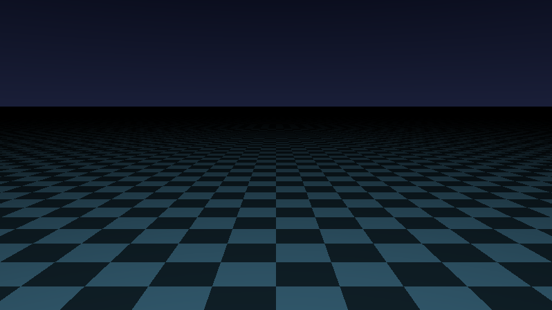

**Ergebnis:** Ein Flug über ein eisblaues Schachbrett, das sich am Horizont verliert – und der Horizont liegt genau dort, wo Schritt 1 ihn hingemalt hat.

### Was passiert hier

**Die Kamera** ist dieselbe Minimal-Konstruktion wie im Pyramid-Tutorial: `ro` ist der Augpunkt, `rd` zeigt für jeden Pixel leicht anders in die Welt. Neu ist die Zeile `rd.yz *= R(-0.12)`: Sie kippt **alle** Strahlen um ~7° nach unten. Damit wandert der Horizont (die Richtung, in der `rd.y = 0` ist) im Bild nach **oben** – rechne nach: `rd.y = uv.y·cos(0.12) − 1.3·sin(0.12) = 0` ergibt `uv.y ≈ 0.157`. Das ist (kein Zufall) fast exakt das `HORIZONT = 0.15` aus Schritt 1. **Der Neigungswinkel der Kamera IST die Bildaufteilung.**

**Der Ebenen-Schnitt:** Für die Ebene `y = 0` braucht es kein Raymarching – die Schnittweite ist pure Algebra: Der Strahl startet auf Höhe `ro.y` und sinkt pro Einheit um `|rd.y|`, also trifft er nach `t = −ro.y/rd.y` auf. Diese eine Zeile kommt später zweimal wieder: für die **Lichtebene** unter dem Terrain (Schritt 9) und für den gebrochenen Strahl **im** Kristall (Schritt 10).

### 💡 Warum ein Schachbrett?

Das Schachbrett ist das Terrain-Pendant zum „Koordinaten als Farbe"-Trick: Es macht Perspektive, Maßstab und Flughöhe sofort sichtbar. Stimmt hier etwas nicht (Verzerrung, falsche Kipprichtung, Horizont an falscher Stelle), sieht man es auf einen Blick – *bevor* das Terrain die Fehler versteckt.

### 🎨 Experimentieren

- `R(-0.5)` → steiler Blick: der Horizont verschwindet oben aus dem Bild, das Terrain füllt alles. Genau zwischen diesen beiden Extremen pendelt später die Kamerafahrt (Schritt 13)
- Brennweite `1.3` → `0.7` (Weitwinkel, dramatisch) bzw. `2.5` (Tele, flach gestaucht)
- `ro.y = 8.0` → Vogelperspektive; die Schachfelder werden winzig

---

## Schritt 3 – Höhenfeld-Raymarching: die Ebene wird Landschaft

**Neu:** `terrain(p)` als Höhenfunktion und der Terrain-Marsch – Raymarching für Landschaften, der Kern-Algorithmus des ganzen Shaders.

```glsl
#define R(a) mat2(cos(a), sin(a), -sin(a), cos(a))

// Hoehe der Landschaft am Ort (x,z) - vorerst simple Sinus-Huegel
float terrain(vec2 p)
{
    return 0.55 * sin(p.x * 0.8) * sin(p.y * 0.6);
}

// Terrain-Marsch: laeuft am Strahl entlang, bis er unter die Landschaft taucht
float marchTerrain(vec3 ro, vec3 rd)
{
    float t = 0.0;
    for (int i = 0; i < 150; i++) {
        vec3 p = ro + rd * t;
        float d = p.y - terrain(p.xz);       // Hoehe UEBER dem Terrain
        if (d < 0.001 + 0.0015 * t) return t; // aufgesetzt -> Treffer
        if (t > 45.0) break;                  // Horizont -> aufgeben
        t += d * 0.4;                         // vorsichtiger Schritt
    }
    return -1.0;
}

void mainImage(out vec4 fragColor, in vec2 fragCoord)
{
    vec2 uv = (fragCoord - 0.5 * iResolution.xy) / iResolution.y;

    vec3 ro = vec3(0.0, 2.8, iTime * 0.8);
    vec3 rd = normalize(vec3(uv, 1.3));
    rd.yz *= R(-0.12);

    float t = marchTerrain(ro, rd);

    vec3 color;
    if (t > 0.0) {
        color = vec3(clamp(1.0 - t * 0.035, 0.0, 1.0)); // Tiefe als Helligkeit
    } else {
        color = mix(vec3(0.10, 0.12, 0.22), vec3(0.02, 0.03, 0.08),
                    clamp(rd.y * 3.0, 0.0, 1.0));
    }

    fragColor = vec4(color, 1.0);
}
```

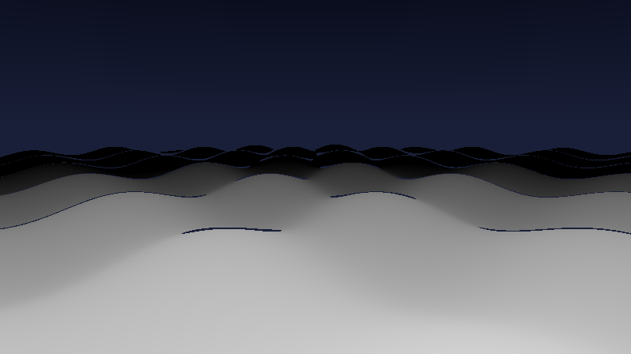

**Ergebnis:** Sanfte Graustufen-Wellen ziehen unter der Kamera vorbei – nah hell, fern dunkel. Die Ebene hat Relief bekommen.

### Was passiert hier – Terrain-Marsch vs. SDF-Marsch

Beim Tunnel-Shader lieferte die SDF einen *garantierten* Sicherheitsabstand in alle Richtungen. Eine Höhenfunktion kann das nicht: `d = p.y − terrain(p.xz)` ist nur der **vertikale** Abstand zur Landschaft – direkt vor dem Strahl könnte trotzdem schon ein Hügel aufragen. Zwei Anpassungen machen den Marsch trotzdem sicher:

1. **Gedrosselte Schritte:** `t += d * 0.4` statt `t += d`. Wir gehen nur 40 % des vertikalen Abstands – die Reserve fängt Hügelflanken ab, die die Höhendifferenz unterschätzt. (Der Preis: mehr Iterationen, daher 150 statt 80.)
2. **Wachsende Trefftoleranz:** `0.001 + 0.0015 * t`. In der Ferne genügt „ungefähr aufgesetzt" – ein Pixel dort deckt ohnehin mehrere Meter Landschaft ab. Das killt das typische Streifen-Flimmern flacher Fernsicht.

🧠 **Merke:** Terrain-Marsch = „Wie hoch bin ich über der Landschaft? Geh einen *Bruchteil* davon vorwärts." Der Drosselfaktor tauscht Tempo gegen Sicherheit – er ist der wichtigste Qualitätsregler dieses Shaders.

### 🎨 Experimentieren

- Drossel `0.4` → `0.9`: schneller, aber an steilen Flanken frisst sich der Strahl durch Hügel hindurch (Löcher!). Genau dieses Artefakt einmal *absichtlich* zu erzeugen ist die beste Impfung dagegen
- `color = vec3(float(i) / 150.0);` im Trefferfall (dazu `i` aus der Schleife herausreichen) → wo die Schritte draufgehen: an Kuppen und am Horizont
- `0.55 * sin(...)` → `1.2 * sin(...)`: höhere Berge – beobachte, wie die Kamera bei `ro.y = 2.8` gefährlich nah über die Kämme rauscht

---

## Schritt 4 – FBM: aus Sinus wird Terrain

**Neu:** Hash → Value-Noise → fraktales Rauschen (FBM) – die Standard-Werkzeugkette für natürliche Landschaften.

```glsl
#define R(a) mat2(cos(a), sin(a), -sin(a), cos(a))

// Hash: Gitterpunkt -> deterministische "Zufallszahl" 0..1
float hash21(vec2 p) { return fract(sin(dot(p, vec2(127.1, 311.7))) * 43758.5453); }

// Value-Noise: weich interpolierte Zufallswerte auf einem Einheitsgitter
float vnoise(vec2 p)
{
    vec2 i = floor(p), f = fract(p);
    vec2 u = f * f * (3.0 - 2.0 * f);            // smoothstep-Kurve
    return mix(mix(hash21(i),                hash21(i + vec2(1, 0)), u.x),
               mix(hash21(i + vec2(0, 1)),   hash21(i + vec2(1, 1)), u.x), u.y);
}

// Fraktales Rauschen: mehrere Oktaven, jede doppelt so fein und halb so laut
float fbm(vec2 p)
{
    float v = 0.0, a = 0.5;
    for (int i = 0; i < 5; i++) {
        v += a * vnoise(p);
        p = p * 2.03 + 11.7;                      // feiner + versetzt (gegen Gittermuster)
        a *= 0.5;
    }
    return v;                                     // ~0..1
}

float terrain(vec2 p)
{
    return (fbm(p * 0.35) - 0.45) * 2.4;          // Huegel ca. -1.1 .. +1.3
}

float marchTerrain(vec3 ro, vec3 rd)
{
    float t = 0.0;
    for (int i = 0; i < 150; i++) {
        vec3 p = ro + rd * t;
        float d = p.y - terrain(p.xz);
        if (d < 0.001 + 0.0015 * t) return t;
        if (t > 45.0) break;
        t += d * 0.4;
    }
    return -1.0;
}

void mainImage(out vec4 fragColor, in vec2 fragCoord)
{
    vec2 uv = (fragCoord - 0.5 * iResolution.xy) / iResolution.y;

    vec3 ro = vec3(0.0, 2.8, iTime * 0.8);
    vec3 rd = normalize(vec3(uv, 1.3));
    rd.yz *= R(-0.12);

    float t = marchTerrain(ro, rd);

    vec3 color;
    if (t > 0.0) {
        color = vec3(clamp(1.0 - t * 0.035, 0.0, 1.0));
    } else {
        color = mix(vec3(0.10, 0.12, 0.22), vec3(0.02, 0.03, 0.08),
                    clamp(rd.y * 3.0, 0.0, 1.0));
    }

    fragColor = vec4(color, 1.0);
}
```

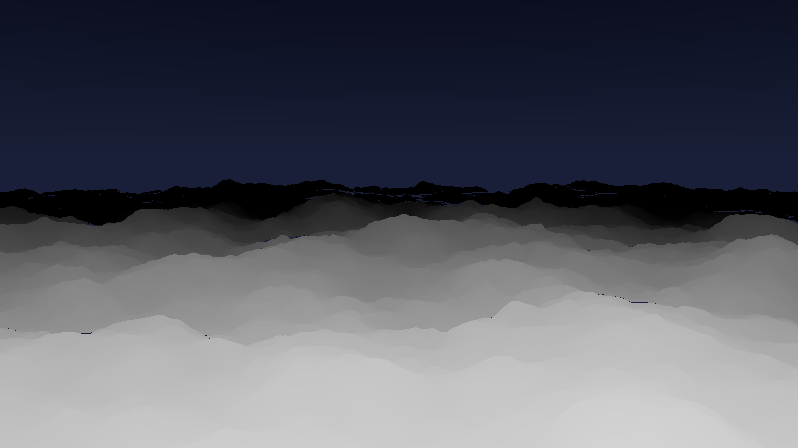

**Ergebnis:** Echte Hügellandschaft – unregelmäßige Kuppen und Senken in allen Größenordnungen, und am Horizont ragt gelegentlich ein Kamm in den Himmel. Die „Hügel, die mehr als die untere Hälfte füllen" gibt es ab jetzt gratis.

### Was passiert hier

Die Kette **Hash → Noise → FBM** ist das Brot-und-Butter-Rezept der prozeduralen Welt:

- **`hash21`** nagelt an jeden Gitterpunkt eine feste Pseudo-Zufallszahl (deterministisch – kein Flackern zwischen Frames).
- **`vnoise`** verbindet die Gitterwerte weich; die `3f²−2f³`-Kurve (smoothstep) vermeidet sichtbare Gitterkanten in der Ableitung.
- **`fbm`** (fractional Brownian motion) stapelt fünf „Oktaven": grobe Bergrücken + mittlere Buckel + feine Rauheit. Das `+ 11.7` verschiebt jede Oktave, damit sich die Gitter nicht überlagern und Kreuzmuster bilden.

Die Skalierung in `terrain` verdient einen Blick: `p * 0.35` bestimmt, *wie breit* die Hügel sind (kleiner = weiter), `* 2.4` wie *hoch*, `− 0.45` wo der Meeresspiegel liegt. Diese drei Zahlen sind die Landschaftsregler.

### 💡 Warum erst Sinus, dann Noise?

Sinus-Hügel sind vorhersagbar – ideal, um den *Marsch* zu debuggen (Schritt 3). Erst wenn der Algorithmus steht, kommt das unvorhersehbare Material hinein. Wieder die alte Regel: **eine Fehlerquelle zur Zeit.**

### 🎨 Experimentieren

- Oktaven `5` → `2` (weiche Dünen) bzw. `7` (zerklüftet, teurer)
- `fbm(p * 0.35)` → `fbm(p * 0.35 + fbm(p * 0.2) * 0.6)` – Noise verbiegt Noise: mäandrierende Rücken statt runder Buckel (*domain warping*, das Lieblingswerkzeug aller Terrain-Shader)
- `(h - 0.45)` → `(abs(h - 0.5) * 2.0 - 0.3)`: gefaltete Täler – Canyon-Charakter

---

## Schritt 5 – Normalen und kaltes Licht

**Neu:** Terrain-Normalen aus zentralen Differenzen und ein Zwei-Quellen-Licht (Mond + Himmelslicht) – das Relief wird plastisch.

```glsl
#define R(a) mat2(cos(a), sin(a), -sin(a), cos(a))

float hash21(vec2 p) { return fract(sin(dot(p, vec2(127.1, 311.7))) * 43758.5453); }

float vnoise(vec2 p)
{
    vec2 i = floor(p), f = fract(p);
    vec2 u = f * f * (3.0 - 2.0 * f);
    return mix(mix(hash21(i),              hash21(i + vec2(1, 0)), u.x),
               mix(hash21(i + vec2(0, 1)), hash21(i + vec2(1, 1)), u.x), u.y);
}

float fbm(vec2 p)
{
    float v = 0.0, a = 0.5;
    for (int i = 0; i < 5; i++) { v += a * vnoise(p); p = p * 2.03 + 11.7; a *= 0.5; }
    return v;
}

float terrain(vec2 p)
{
    return (fbm(p * 0.35) - 0.45) * 2.4;
}

float marchTerrain(vec3 ro, vec3 rd)
{
    float t = 0.0;
    for (int i = 0; i < 150; i++) {
        vec3 p = ro + rd * t;
        float d = p.y - terrain(p.xz);
        if (d < 0.001 + 0.0015 * t) return t;
        if (t > 45.0) break;
        t += d * 0.4;
    }
    return -1.0;
}

// Normale des Hoehenfelds: Steigung in x und z, "hochgeklappt" zu einem 3D-Vektor
vec3 terrainNormal(vec2 p, float t)
{
    vec2 e = vec2(0.012 * (1.0 + t * 0.12), 0.0); // Ferne groeber abtasten (Anti-Flimmern)
    return normalize(vec3(terrain(p - e.xy) - terrain(p + e.xy),
                          2.0 * e.x,
                          terrain(p - e.yx) - terrain(p + e.yx)));
}

vec3 himmelFarbe(vec3 rd)
{
    return mix(vec3(0.10, 0.12, 0.22), vec3(0.02, 0.03, 0.08),
               clamp(rd.y * 3.0, 0.0, 1.0));
}

void mainImage(out vec4 fragColor, in vec2 fragCoord)
{
    vec2 uv = (fragCoord - 0.5 * iResolution.xy) / iResolution.y;

    vec3 ro = vec3(0.0, 2.8, iTime * 0.8);
    vec3 rd = normalize(vec3(uv, 1.3));
    rd.yz *= R(-0.12);

    float t = marchTerrain(ro, rd);

    vec3 color;
    if (t > 0.0) {
        vec3 p = ro + rd * t;
        vec3 n = terrainNormal(p.xz, t);

        vec3 mond = normalize(vec3(0.4, 0.75, -0.5));
        float dif  = max(dot(n, mond), 0.0);        // Mondlicht: gerichtet, kuehl
        float amb  = 0.5 + 0.5 * n.y;               // Himmelslicht: von oben, diffus

        color  = dif * vec3(0.35, 0.42, 0.55);
        color += amb * vec3(0.08, 0.12, 0.18);
    } else {
        color = himmelFarbe(rd);
    }

    fragColor = vec4(color, 1.0);
}
```

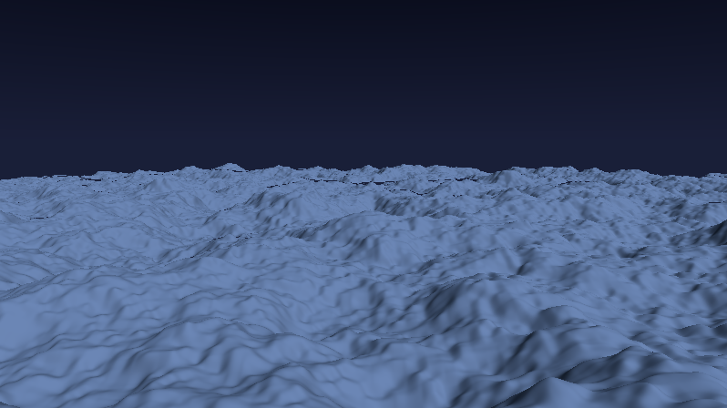

**Ergebnis:** Eine plastische, mondbeschienene Hügellandschaft in kaltem Blaugrau – dem Licht zugewandte Flanken schimmern, abgewandte liegen im blauen Schatten.

### Was passiert hier

**Die Normale** kommt wie immer aus Differenzen – aber billiger als beim SDF-Marsch: Ein Höhenfeld hat nur zwei Freiheitsgrade, also reichen **vier** `terrain`-Aufrufe (x vor/zurück, z vor/zurück) statt sechs `map`-Aufrufe. Die y-Komponente `2·e` „klappt" die beiden Steigungen zu einem Aufwärtsvektor zusammen. Der Trick mit `e * (1 + t·0.12)`: In der Ferne tasten wir *gröber* ab – feine Rauheit, die kleiner als ein Pixel wäre, würde sonst als Glitzer-Flimmern aliasen.

**Das Licht** hat zwei bewusst getrennte Quellen: ein gerichteter „Mond" (macht Flanken-Kontrast) und ein diffuses Himmelslicht über `n.y` (hellt alles, was nach oben zeigt, leicht auf – füllt die Schatten blau statt schwarz). Beide zusammen sind noch **nicht** das fertige Material – der Kristall bekommt in Schritt 10 seine eigene Beleuchtungslogik. Aber zum Beurteilen der Geometrie braucht es jetzt genau dieses neutrale Licht.

### 🎨 Experimentieren

- Debug-Klassiker: `color = n * 0.5 + 0.5;` → Normalen als Farbe
- Mond tiefer: `normalize(vec3(0.8, 0.25, -0.5))` → lange Schatten, dramatischer
- `e`-Skalierung entfernen (`vec2(0.012, 0.0)`) und die Ferne beim Flimmern beobachten

---

## Schritt 6 – Kristall-Facetten: Voronoi-Platten

**Neu:** Ein Voronoi-Feld zerlegt das Terrain in unregelmäßige Zellen, und jede Zelle bekommt ihren eigenen Höhenversatz – aus weichen Hügeln werden gegeneinander verkippte **Kristallplatten** mit scharfen Bruchkanten.

*Ab jetzt zeigen die Schritte nur noch die geänderten bzw. neuen Funktionen – alles andere bleibt wörtlich wie im vorherigen Schritt stehen. (Am Ende von Schritt 14 steht der komplette Shader noch einmal am Stück.)*

```glsl
// NEU: 2D-Hash mit 2D-Ergebnis (fuer die Voronoi-Punkte)
vec2 hash22(vec2 p)
{
    return fract(sin(vec2(dot(p, vec2(127.1, 311.7)),
                          dot(p, vec2(269.5, 183.3)))) * 43758.5453);
}

// NEU: Voronoi - liefert (Abstand², Zell-Id.x, Zell-Id.y) der naechsten Zelle
vec3 voronoi(vec2 p)
{
    vec2 i = floor(p), f = fract(p);
    float best = 8.0;
    vec2 bestId = vec2(0.0);
    for (int y = -1; y <= 1; y++)
    for (int x = -1; x <= 1; x++) {
        vec2 g = vec2(float(x), float(y));
        vec2 r = g + hash22(i + g) - f;        // Vektor zum Zufallspunkt der Nachbarzelle
        float d = dot(r, r);
        if (d < best) { best = d; bestId = i + g; }
    }
    return vec3(best, bestId);
}

// GEAENDERT: weiche Grundform + Platten-Versatz je Voronoi-Zelle
float terrainGlatt(vec2 p)
{
    return (fbm(p * 0.35) - 0.45) * 2.4;
}

float terrain(vec2 p)
{
    float h = terrainGlatt(p);
    vec3 vo = voronoi(p * 1.5);
    float platte = (hash21(vo.yz) - 0.5) * 0.55;   // jede Platte: -0.27 .. +0.27
    return h + platte;
}
```

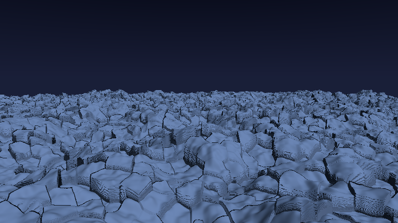

**Ergebnis:** Die Landschaft besteht jetzt aus unregelmäßigen, gegeneinander versetzten Platten – wie zerbrochenes Packeis oder ein Feld aus Kristallschollen. Die Bruchkanten stehen als kleine Klippen im Bild.

### Was passiert hier

**Voronoi** ist das dritte Muster im Zufalls-Baukasten (nach Hash und Noise): Jede Gitterzelle bekommt einen zufällig platzierten Punkt, und jede Position im Raum gehört zu dem Punkt, der ihr am nächsten liegt. Die Grenzen zwischen diesen Einzugsgebieten sind unregelmäßige Polygone – **die natürliche Geometrie von Rissen, Schollen und Kristallen.** Die 3×3-Nachbarschleife prüft alle Kandidaten (der nächste Punkt kann in einer Nachbarzelle liegen).

Wir benutzen hier zunächst nur die **Zell-Id** – dieselbe Idee wie der Zell-Index aus dem B-Anhang des Pyramid-Tutorials: `hash21(id)` gibt jeder Platte einen festen, eigenen Höhenversatz. Die Höhenfunktion wird dadurch **unstetig** – an den Zellgrenzen springt sie. Der Terrain-Marsch verkraftet das klaglos: Er läuft einfach gegen die Sprungstelle und setzt dort auf; die Differenzen-Normale macht aus dem Sprung automatisch eine fast senkrechte Wand-Normale. Die Klippen sind also „gratis" korrekt beleuchtet.

⚠️ **Aber:** An senkrechten Wänden unterschätzt der vertikale Abstand die wahre Distanz maximal – hier zahlt sich die 0.4-Drossel aus Schritt 3 aus. Wer sie auf 0.9 gedreht hat, sieht jetzt Löcher in den Klippen.

### 💡 Warum Platten-Versatz statt „echter" Kristall-Geometrie?

Man könnte je Zelle ein Prisma modellieren (SDF pro Zelle). Aber der Höhenfeld-Trick bewahrt die **eine** zentrale Vereinfachung dieses Shaders: Die ganze Welt bleibt eine Funktion `terrain(x, z)` – Marsch, Normalen, Brechung, alles Weitere funktioniert unverändert weiter. Die Facetten-Optik entsteht trotzdem, weil Auge und Licht nur Flächen und Kanten sehen, nicht die Konstruktion dahinter.

### 🎨 Experimentieren

- `p * 1.5` → `p * 3.0`: feinere Splitter; `* 0.7`: monumentale Schollen
- Versatz `0.55` → `1.2`: dramatische Klippen (Kamera ggf. höher setzen!)
- Platten zusätzlich **verkippen**: `platte += dot(fract(hash22(vo.yz) * 7.0) - 0.5, p - (vo.yz + 0.5) / 1.5) * 0.4;` → jede Scholle bekommt eine eigene Neigung – noch kristalliner
- `color = vec3(hash21(vo.yz));` als Debug im Trefferfall → die Zellstruktur pur

---

## Schritt 7 – Halbliquid: das Liquiditätsfeld

**Neu:** Ein zweites, langsames Feld `liquid(p)` entscheidet **örtlich**, ob das Material kristallin-facettiert oder flüssig-glatt ist – inklusive sanfter Wellenbewegung auf den flüssigen Zonen.

```glsl
// NEU: Liquiditaetsfeld 0..1 - 0 = harter Kristall, 1 = fluessig.
// Grobes, LANGSAM driftendes Noise: die fluessigen Zonen wandern durchs Bild.
float liquid(vec2 p)
{
    return smoothstep(0.35, 0.75, vnoise(p * 0.22 + vec2(0.0, iTime * 0.06)));
}

// GEAENDERT: terrain() blendet je nach Liquiditaet zwischen zwei Materialien
float terrain(vec2 p)
{
    float glatt = terrainGlatt(p);

    // Kristall: Platten-Versatz wie in Schritt 6
    vec3 vo = voronoi(p * 1.5);
    float kristall = glatt + (hash21(vo.yz) - 0.5) * 0.55;

    // Fluessig: glatte Form + kleine laufende Wellen
    float welle = (vnoise(p * 1.4 + vec2(iTime * 0.25, 0.0)) - 0.5) * 0.12;
    float fluessig = glatt + welle;

    float L = liquid(p);
    return mix(kristall, fluessig, L);
}
```

Und im Trefferfall von `mainImage` lohnt vorübergehend eine Debug-Färbung:

```glsl
        // Debug: Liquiditaet einfaerben (blau = Kristall, tuerkis = fluessig)
        float L = liquid(p.xz);
        color *= mix(vec3(0.7, 0.8, 1.2), vec3(0.4, 1.3, 1.1), L);
```

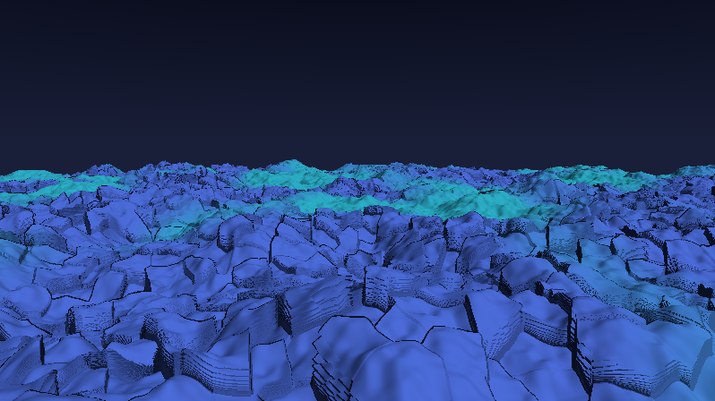

**Ergebnis:** Die Landschaft ist zweigeteilt: Zonen aus scharfkantigen Platten gehen weich in glatte, leicht wogende Flächen über – und diese Zonen **wandern** langsam durch das Terrain. Das „halbliquide" aus der Zielbeschreibung.

### Was passiert hier

`liquid` ist das zweite Feld über der Bodenebene (nach der Höhe) – und das Muster wiederholt sich gleich noch zweimal (Lücken, Lampen). **Ein Shader dieses Typs ist ein Stapel von Feldern über derselben 2D-Karte.**

Drei Entscheidungen stecken in den zwei Zeilen:

1. **`smoothstep(0.35, 0.75, …)`** presst das Noise in eine klare Aufteilung: unter 0.35 → sicher Kristall (0), über 0.75 → sicher flüssig (1), dazwischen ein weicher Übergangssaum. Ohne das wäre das ganze Terrain „halb-halb-Matsch" ohne erkennbare Zonen.
2. **`p * 0.22`** macht die Zonen *größer* als die Kristallplatten (`* 1.5`) – wichtig für die Lesbarkeit: Eine Zone umfasst viele Platten, nicht umgekehrt.
3. **`iTime * 0.06`** lässt das Feld driften: Die Materialgrenzen fließen in Zeitlupe über die Landschaft – die Wellen (`iTime * 0.25`) laufen bewusst schneller, zwei Zeitebenen wie bei frosty caves (dort: schnelles Preset-Innenleben unter langsamer `roam`-Farbdrift).

Der `mix` am Ende blendet die **Geometrie** – später blenden wir mit demselben `L` auch die **Optik** (Glow in Schritt 11). Dass Material und Geometrie an derselben Stelle „flüssig" sind, macht den Effekt glaubwürdig.

### 🎨 Experimentieren

- `smoothstep(0.35, 0.75, …)` → `smoothstep(0.45, 0.55, …)`: harte Materialgrenzen (wie Eisschollen in Wasser)
- Drift `0.06` → `0.3`: die Zonen wandern sichtbar schnell – wirkt eher wie Wetter als wie Geologie
- Wellen-Amplitude `0.12` → `0.3` und -Tempo `0.25` → `0.8`: kabbelige See
- Umkehren: `L = 1.0 - L` → flüssige Täler zwischen Kristallhügeln

---

## Schritt 8 – Lücken im Terrain

**Neu:** Eine Lückenmaske reißt Löcher in die Kristalldecke – **parametrierbar** über zwei Stellschrauben und auf Wunsch **dynamisch** (Löcher öffnen und schließen sich langsam).

```glsl
// ---- STELLSCHRAUBEN --------------------------------------------------------
const float LUECKEN     = 0.30;   // 0.0 = geschlossene Decke .. 0.6 = Inselwelt
const float LUECKEN_DYN = 0.15;   // dynamischer Anteil: 0.0 = statisch
// ----------------------------------------------------------------------------

// NEU: Lueckenmaske - 1 = Terrain vorhanden, 0 = Loch
float gapMask(vec2 p)
{
    float schwelle = LUECKEN + LUECKEN_DYN * (0.5 + 0.5 * sin(iTime * 0.09));
    float m = vnoise(p * 0.30 + 41.0);
    return smoothstep(schwelle - 0.10, schwelle + 0.10, m);
}

// GEAENDERT: Loecher stuerzen als Schluchten unter die (kommende) Lichtebene
float terrain(vec2 p)
{
    float glatt = terrainGlatt(p);

    vec3 vo = voronoi(p * 1.5);
    float kristall = glatt + (hash21(vo.yz) - 0.5) * 0.55;

    float welle = (vnoise(p * 1.4 + vec2(iTime * 0.25, 0.0)) - 0.5) * 0.12;
    float fluessig = glatt + welle;

    float h = mix(kristall, fluessig, liquid(p));

    return mix(-6.0, h, gapMask(p));   // Loch: Hoehe faellt auf -6
}
```

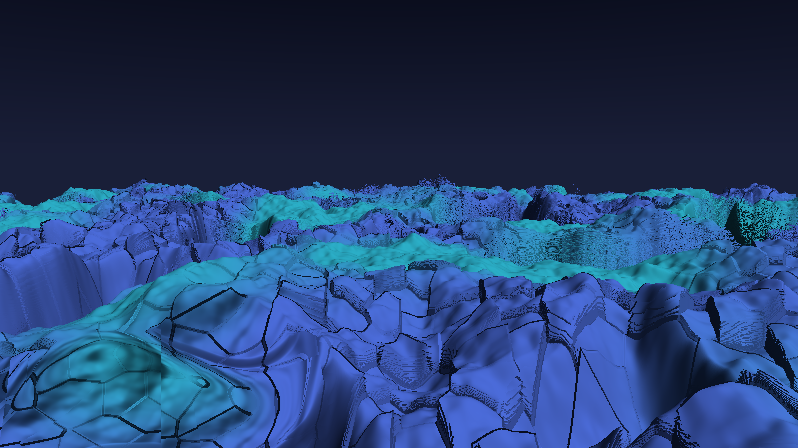

**Ergebnis:** Das Terrain reißt an unregelmäßigen Stellen auf – dunkle Schluchten mit steilen Kristallwänden. Mit `LUECKEN_DYN > 0` atmet die Landschaft: Löcher wachsen langsam zu und brechen wieder auf.

### Was passiert hier

Die Maske ist wieder ein Feld mit Schwellwert – aber die Umsetzung als **`mix(-6.0, h, g)`** ist der eigentliche Kniff. Naiv würde man das Loch als „kein Treffer" behandeln (Sonderfall im Marsch, zweiter Codepfad …). Stattdessen bleibt das Terrain eine ganz normale Höhenfunktion – das Loch ist einfach Terrain, das **6 Einheiten in die Tiefe stürzt**. Drei Dinge gibt es geschenkt:

1. Der Marsch braucht **keinerlei** Sonderbehandlung.
2. Der weiche `smoothstep`-Saum (±0.10) erzeugt automatisch **Schluchtwände** – die Lochränder sind keine papierdünnen Kanten, sondern sichtbare Kristallklippen.
3. In Schritt 9 liegt die Lichtebene bei y ≈ −1.8, also **oberhalb** des Lochbodens (−6): Ein Strahl, der ins Loch fällt, kreuzt die Lichtebene, *bevor* er den Boden erreicht – der Blick auf die nackten Leuchtkörper (der ganze Sinn der Löcher!) ergibt sich rein geometrisch.

Die **Dynamik** steckt komplett in der Schwelle: `sin(iTime * 0.09)` hebt und senkt sie über ~70 Sekunden. Da die Maske selbst statisch ist (das Noise driftet nicht), öffnen sich die Löcher immer an denselben Stellen – wie Atemlöcher im Packeis, nicht wie kochender Käse. Wer wandernde Löcher will, gibt dem Noise eine Zeitkomponente (siehe unten).

### 🎨 Experimentieren

- `LUECKEN = 0.0` → geschlossene Decke (der Ur-Zustand); `LUECKEN = 0.55` → Archipel aus Kristallinseln
- Saum `±0.10` → `±0.03`: gestanzte, fast senkrechte Lochränder
- Wandernde Löcher: `vnoise(p * 0.30 + 41.0 + vec2(iTime * 0.05))`
- Löcher an die Liquidität koppeln: `m += liquid(p) * 0.2;` → das Terrain reißt bevorzugt dort, wo es flüssig ist (oder mit `-` genau umgekehrt)

---

## Schritt 9 – Die Leuchtkörper

**Neu:** Die dritte Etage – eine Lichtebene unter dem Terrain mit einem Raster aus farbigen, unregelmäßig aufblinkenden Punktlichtern. Sichtbar vorerst nur durch die Löcher – der ehrlichste Testaufbau.

```glsl
// ---- STELLSCHRAUBEN (erweitert) --------------------------------------------
const float TIEFE        = -1.8;  // y der Lichtebene (unter dem Terrain)
const float LAMPEN_ZELLE = 1.7;   // Rasterabstand der Leuchtkoerper
// ----------------------------------------------------------------------------

// NEU: Farbe je Lampe - Cosinus-Palette, kraeftige Buehnenfarben
vec3 lampColor(float t)
{
    return 0.55 + 0.45 * cos(6.28318 * (t + vec3(0.0, 0.33, 0.67)));
}

// NEU: Blink-Kurve je Lampe - meist aus, gelegentlich weiches Aufleuchten
float blink(vec2 id)
{
    float ph = hash21(id + 31.7);                 // eigene Phase
    float sp = 0.35 + 0.75 * hash21(id + 17.3);   // eigenes Tempo
    float w  = 0.5 + 0.5 * sin(6.28318 * (iTime * sp * 0.25 + ph));
    return smoothstep(0.70, 0.97, w) * (0.2 + 0.8 * hash21(id + 5.1));
}

// NEU: Lichtsumme am Ort q auf der Lichtebene.
// weich = 1: harte Punkte; groesser: breiter Streukegel (fuer den Glow spaeter)
vec3 lightsAt(vec2 q, float weich)
{
    vec2 base = floor(q / LAMPEN_ZELLE);
    vec3 acc = vec3(0.0);
    for (int y = -1; y <= 1; y++)
    for (int x = -1; x <= 1; x++) {
        vec2 id = base + vec2(float(x), float(y));
        vec2 c  = (id + 0.5 + 0.7 * (hash22(id + 7.0) - 0.5)) * LAMPEN_ZELLE;
        vec2 d  = q - c;
        float hell = blink(id) + 0.05;            // 0.05 = schwaches Dauerglimmen
        acc += lampColor(hash21(id)) * hell / (0.02 + dot(d, d) * 14.0 / weich);
    }
    return acc * 0.05;
}
```

Und in `mainImage` bekommt der Strahl seine dritte Option:

```glsl
    float t = marchTerrain(ro, rd);

    // Schnittweite mit der Lichtebene (Algebra aus Schritt 2)
    float tP = (rd.y < -0.001) ? (TIEFE - ro.y) / rd.y : 1e5;

    vec3 color;
    if (tP < 1e4 && (t < 0.0 || tP < t)) {
        // Strahl faellt durch eine Luecke: Leuchtkoerper direkt
        vec2 q = (ro + rd * tP).xz;
        color = vec3(0.010, 0.015, 0.030) + lightsAt(q, 1.0);
    } else if (t > 0.0) {
        // ... Terrain-Shading wie bisher (Schritt 5 + Debug aus Schritt 7) ...
    } else {
        color = himmelFarbe(rd);
    }
```

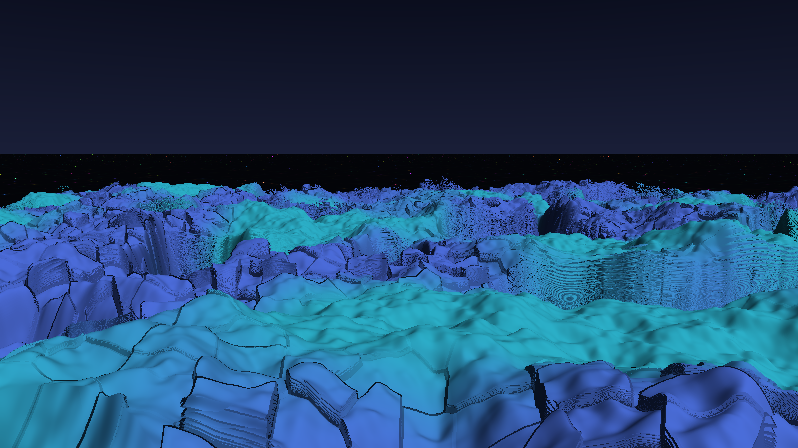

**Ergebnis:** In den Schluchten und Löchern glühen farbige Punkte auf dunklem Grund – jeder in eigener Farbe, jeder mit eigenem Blinkrhythmus: kurzes weiches Aufleuchten, dann wieder fast dunkel.

### Was passiert hier

**Die `1/d²`-Lichter sind direkt von frosty caves geerbt.** Dessen Comp-Shader macht exakt das: `flash1 = 1/dot(uva,uva)` – Helligkeit als Kehrwert des Abstandsquadrats. Diese Formel *ist* physikalisches Punktlicht (Abstandsgesetz), und sie ist der Grund, warum die Lichter „glühen" statt wie aufgemalte Kreise auszusehen: kein Rand, nur ein unendlich weicher Abfall. Die `0.02` im Nenner kappen die Singularität bei d = 0, der Faktor `14.0/weich` regelt die Enge des Kegels – `weich` ist der Hebel, an dem in Schritt 11 der Glow zieht.

**Das Blinken** kombiniert zwei Bausteine aus früheren Kapiteln: Zell-Identität (`hash21(id + Konstante)` liefert beliebig viele unabhängige Eigenschaften je Lampe – Phase, Tempo, Grundhelligkeit, Farbe) und die `smoothstep`-Schwelle über einer Sinuswelle: `smoothstep(0.70, 0.97, w)` schneidet nur die **Spitzen** der Welle heraus → die Lampe ist ~85 % der Zeit aus und flammt weich auf, statt dauerhaft zu pulsieren. Das ist dramaturgisch der Unterschied zwischen „Glühwürmchen-Feld" und „Discoboden".

**Die 3×3-Nachbarsumme** kennt man vom Voronoi: Auch das Licht einer Lampe aus der Nachbarzelle reicht bis zu uns herüber. Neun Lampen pro Auswertung genügen, weil der `1/d²`-Abfall bei diesem Zellabstand jenseits der direkten Nachbarn praktisch nichts mehr beiträgt.

### 💡 Warum zuerst „nackt" durch die Löcher testen?

Weil Brechung (Schritt 10) ein *Verzerrer* ist: Wären die Lampen von Anfang an nur durch den Kristall sichtbar, ließe sich nie unterscheiden, ob ein Fehler im Licht-Raster oder in der Brechung steckt. Die Löcher liefern die unverfälschte Referenz – dieselbe Philosophie wie das Schachbrett in Schritt 2.

### 🎨 Experimentieren

- `smoothstep(0.70, 0.97, w)` → `smoothstep(0.2, 0.8, w)`: gemächliches Atmen statt Blitzen
- Farbfamilie statt Regenbogen: `lampColor(hash21(id) * 0.25 + 0.55)` → nur Blau-Violett-Töne
- `LAMPEN_ZELLE = 0.8` → dichter Lichtteppich; `3.5` → einsame Signalfeuer
- Dauerglimmen `0.05` → `0.0`: zwischen den Blitzen herrscht echte Finsternis

---

## Schritt 10 – Transparenz: Brechung und Absorption

**Neu:** Der Kern des ganzen Shaders – der Kristall wird durchsichtig. Auftreffende Strahlen werden mit `refract` gebrochen, laufen durch das Material zur Lichtebene und sammeln dort Licht ein, gefiltert nach der **Dicke** des Kristalls (Beer-Lambert). Dazu Fresnel-Spiegelung des Himmels.

```glsl
// ---- STELLSCHRAUBEN (erweitert) --------------------------------------------
const float DICHTE = 0.55;   // Absorption im Kristall: 0 = Glas .. 1.5 = Milcheis
// ----------------------------------------------------------------------------

// NEU: das komplette Kristall-Material (ersetzt das Terrain-Shading in mainImage)
vec3 shadeKristall(vec3 p, vec3 rd, float t)
{
    vec3 n  = terrainNormal(p.xz, t);
    float L = liquid(p.xz);

    // (1) BRECHUNG: der Strahl knickt beim Eintritt in den Kristall
    //     (Brechungsindex ~1.45, wie Quarz)
    vec3 rr = refract(rd, n, 1.0 / 1.45);
    if (dot(rr, rr) < 0.5) rr = rd;               // Totalreflexions-Grenzfall abfangen

    // (2) DURCHLAUF bis zur Lichtebene (Ebenen-Algebra aus Schritt 2)
    float tt = (TIEFE - p.y) / min(rr.y, -0.05);
    vec2 q = (p + rr * tt).xz;

    // (3) ABSORPTION: dicker Kristall schluckt Licht - Rot zuerst (Eis-Look)
    float dicke = max(p.y - TIEFE, 0.0);
    vec3 T = exp(-dicke * vec3(0.85, 0.30, 0.16) * DICHTE);

    vec3 col = lightsAt(q, 1.0) * T;              // das gebrochene Lampenlicht

    // (4) OBERFLAECHE: Fresnel-Spiegelung des kalten Himmels ...
    float fres = pow(1.0 - max(dot(n, -rd), 0.0), 3.0);
    col += fres * vec3(0.35, 0.50, 0.65) * 0.5;

    //     ... und ein Hauch Mond, damit die Facetten lesbar bleiben
    float dif = max(dot(n, normalize(vec3(0.4, 0.75, -0.5))), 0.0);
    col += dif * vec3(0.10, 0.14, 0.20);

    return col;
}
```

In `mainImage` schrumpft der Terrain-Zweig auf eine Zeile:

```glsl
    } else if (t > 0.0) {
        vec3 p = ro + rd * t;
        color = shadeKristall(p, rd, t);
    }
```

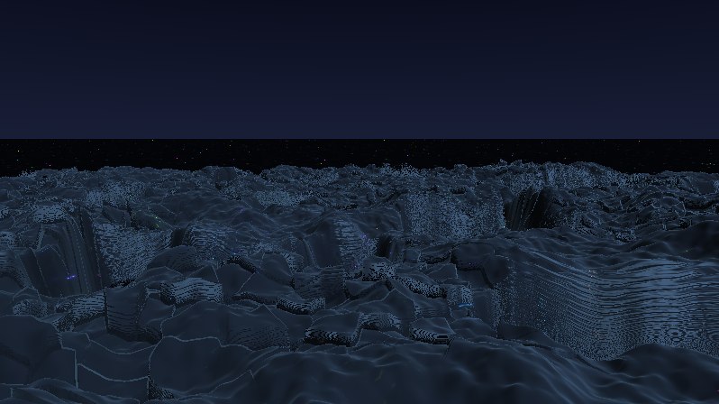

**Ergebnis:** Der Moment, in dem der Shader sein Versprechen einlöst: Das Terrain ist **durchscheinend**. Unter dünnen Stellen leuchten die Lampen in voller Farbe durch, unter dicken Hügeln nur noch als tiefblaues Schimmern. Auf jeder Facette knickt das durchscheinende Bild anders – Kristall.

### Was passiert hier – die Physik in vier Zeilen

**(1) `refract`** ist Snellius' Brechungsgesetz als GLSL-Builtin. Das Verhältnis `1.0/1.45` sagt „von dünn (Luft) nach dicht (Quarz)": Der Strahl wird zum Lot hin gebrochen. Weil jede Facette eine andere Normale hat, knickt jede Facette den Blick auf die Lampen **anders** ab – das ist der gesamte „Kristall bricht das Licht"-Effekt, eine einzige Zeile. Bei streifendem Einfall kann `refract` den Nullvektor liefern (Totalreflexion) – der `dot(rr,rr) < 0.5`-Fallback verhindert dann Schwarz.

**(2)** Statt den gebrochenen Strahl teuer weiterzumarschieren, nutzen wir aus, dass unter der Oberfläche nichts mehr im Weg ist: Ebenen-Schnitt, eine Zeile. *(Bewusste Vereinfachung: Der Strahl könnte im Innern eine zweite Terrainwand treffen – das ignorieren wir. Bei diesem Maßstab fällt es schlicht nicht auf, und es spart den halben Renderaufwand.)*

**(3) Beer-Lambert:** Licht, das durch Material läuft, wird exponentiell geschluckt – pro Farbkanal verschieden stark. Der Vektor `(0.85, 0.30, 0.16)` schluckt Rot am stärksten → auf dem Weg durch dicken Kristall bleibt Blaugrün übrig. **Genau daher kommt die Farbe von Gletschereis** – wir malen das Eis nicht blau an, es *wird* blau, und zwar exakt dort, wo es dick ist. Die „verschieden dicke" Struktur aus der Zielbeschreibung wird damit direkt sichtbar: Dicke = Farbe.

**(4) Fresnel** kennt man vom Pyramid-Tutorial: Bei streifendem Blick spiegelt jede Oberfläche stärker. Hier spiegelt sie den Himmel – das gibt den kalten Glanzsaum auf allen Kuppen und macht das Material „nass".

### 🎨 Experimentieren

- `DICHTE = 0.0` → klares Glas (Lampen fast ungefiltert); `1.5` → fast opakes Milcheis
- Absorption `vec3(0.85, 0.30, 0.16)` → `vec3(0.2, 0.5, 0.9)`: Bernstein statt Eis
- Brechungsindex `1.0/1.45` → `1.0/2.4` (Diamant): die Verzerrung wird drastisch
- `rr = rd;` erzwingen (Brechung aus) → der direkte Vorher/Nachher-Vergleich: erst jetzt sieht man, wie viel „Kristall-Gefühl" allein aus dem Knick kommt

---

## Schritt 11 – Glow und Sparkle: liquide Stellen leuchten

**Neu:** Die Liquidität wird optisch wirksam: An flüssigen Stellen **streut** das Lampenlicht zu weichem Glow auseinander; auf kristallinen Facetten **glitzert** stattdessen ein hartes Glanzlicht.

```glsl
// ---- STELLSCHRAUBEN (erweitert) --------------------------------------------
const float GLOW = 1.6;      // Streu-Glow an liquiden Stellen
// ----------------------------------------------------------------------------

// GEAENDERT: shadeKristall bekommt zwei neue Terme (zwischen (3) und (4)):

    vec3 col = lightsAt(q, 1.0) * T;

    // (3b) GLOW: an liquiden Stellen streut das Material das Licht -
    //      dieselben Lampen, aber mit weitem Streukegel, gewichtet mit L
    col += lightsAt(q, 1.0 + L * 10.0) * T * L * GLOW;

    // (3c) SPARKLE: harte Glanzblitze des Monds - NUR auf kristallinen Facetten
    vec3 mond = normalize(vec3(0.4, 0.75, -0.5));
    float spec = pow(max(dot(reflect(rd, n), mond), 0.0), 60.0);
    col += spec * (1.0 - L) * vec3(0.9, 0.95, 1.0) * 0.6;
```

*(Der Mond-Vektor wird dafür vor (3c) deklariert und in (4) wiederverwendet.)*

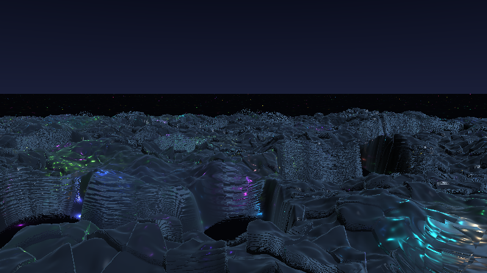

**Ergebnis:** Die zwei Materialien sind jetzt auf einen Blick unterscheidbar: Flüssige Zonen glühen weich und farbig von unten – als würde das Lampenlicht im Material zerfließen. Kristalline Zonen bleiben klar und antworten dem Mond mit harten, weißen Glitzerpunkten auf den Facettenkanten.

### Was passiert hier

**Der Glow ist kein Nachbearbeitungs-Blur, sondern Streuung.** Der Trick: Wir rufen `lightsAt` ein zweites Mal auf – mit `weich = 1 + L·10`. Physikalisch gelesen: In trübem, flüssigem Material erreicht uns nicht nur der direkte Sehstrahl-Punkt der Lampe, sondern gestreutes Licht aus einem ganzen **Kegel** – und ein breiter Kegel ist in unserem Modell einfach eine Lampe mit flacherem `1/d²`-Abfall. Gewichtet mit `L` passiert das nur dort, wo das Material flüssig ist, und mit `T` bleibt die Dicken-Färbung erhalten: Glow aus der Tiefe ist blaugrün, Glow unter dünnem Material bunt. *(frosty caves erreicht seinen Schimmer verwandt: `GetBlur1` – eine weichgezeichnete Kopie des Bildes – wird dem scharfen Bild beigemischt. Milkdrop hat Blur-Texturen gratis; wir haben stattdessen die analytische Lichtsumme, die sich beliebig aufweichen lässt.)*

**Der Sparkle** ist klassisches Phong-Specular (`reflect` + hohe Potenz), aber mit dem Faktor `(1 − L)` – die Materialweiche wieder. Exponent 60 heißt: nur fast perfekt ausgerichtete Facetten blitzen. Da jede Voronoi-Platte ihre eigene Neigung hat, blitzen beim Kameraflug immer andere Platten auf – das lebendige Funkeln eines Kristallfelds, ohne dass irgendwo Zufall in der Zeit steckt.

🧠 **Merke:** `L` steuert jetzt **drei** Dinge – Geometrie (glatt statt facettiert), Glow (an) und Sparkle (aus). Ein Feld, das mehrere Ebenen konsistent steuert, ist glaubwürdiger als drei unabhängige Effekte.

### 🎨 Experimentieren

- `GLOW = 4.0` → die liquiden Zonen werden zu Lichtseen (kurz vor Kitsch – Geschmackssache)
- Streubreite `L * 10.0` → `L * 30.0`: der Glow schluckt die Einzellampen komplett
- Sparkle-Exponent `60.0` → `8.0`: breiter Seidenglanz statt Glitzer
- Sparkle von den **Lampen** statt vom Mond: `spec`-Term mit `lampColor(...)` der nächsten Zelle einfärben – aufwendiger, aber die Blitze übernehmen die Lichtfarben

---

## Schritt 12 – Isometrie ↔ Perspektive: die Kamera wird ein Instrument

**Neu:** Eine richtige Kamera-Basis (Blick-, Rechts-, Hoch-Vektor aus Gier- und Nickwinkel) und der Clou des Schritts: **eine einzige Formel**, die stufenlos zwischen Lochkamera und isometrischer Parallelprojektion überblendet.

```glsl
// ---- STELLSCHRAUBEN (erweitert) --------------------------------------------
const float PERSPEKTIVE  = 0.0;   // 1.0 = Lochkamera .. 0.0 = isometrisch
const float ABSTAND      = 5.0;   // Kameraabstand zum Blickpunkt
const float ORTHO_BREITE = 6.0;   // Bildbreite (Welteinheiten) der Iso-Sicht
// ----------------------------------------------------------------------------

// NEU: ersetzt die bisherigen drei Kamera-Zeilen in mainImage
void kamera(vec2 uv, out vec3 ro, out vec3 rd)
{
    float persp = PERSPEKTIVE;

    float gier = 0.785;                       // 45 Grad - die klassische Iso-Diagonale
    float nick = mix(-0.62, -0.30, persp);    // Iso schaut steiler herab

    vec3 ta = vec3(0.0, 0.0, iTime * 0.8);    // Blickpunkt wandert geradeaus
    ta.y = terrainGlatt(ta.xz) * 0.5;         // ... und klebt grob am Terrain

    // Kamera-Basis: Blickrichtung aus den Winkeln, Rechts/Hoch per Kreuzprodukt
    vec3 fw = vec3(cos(nick) * sin(gier), sin(nick), cos(nick) * cos(gier));
    vec3 rt = normalize(cross(vec3(0.0, 1.0, 0.0), fw));
    vec3 up = cross(fw, rt);

    ro = ta - fw * ABSTAND;
    ro.y = max(ro.y, terrainGlatt(ro.xz) + 1.4);           // nie in den Boden

    // DIE UEBERBLENDUNG:
    //   Lochkamera  (persp=1): Pixel kippt die RICHTUNG, Ursprung fest
    //   Isometrisch (persp=0): Pixel verschiebt den URSPRUNG, Richtung fest
    rd  = normalize(fw * 1.3 + (rt * uv.x + up * uv.y) * persp);
    ro += (rt * uv.x + up * uv.y) * ORTHO_BREITE * (1.0 - persp);
    ro -= fw * 8.0 * (1.0 - persp);           // Iso: Strahlebene weit zurueckziehen
}
```

In `mainImage` bleibt nur noch:

```glsl
    vec3 ro, rd;
    kamera(uv, ro, rd);
```

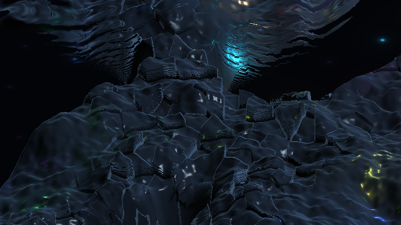

**Ergebnis (mit `PERSPEKTIVE = 0.0`):** Der Look kippt komplett – das Terrain liegt als **isometrisches Diorama** im Bild: keine Fluchtpunkte, hintere Hügel exakt so groß wie vordere, die vertraute „Brettspiel-Gott-Sicht". Mit `1.0` ist es wieder der Flug aus den bisherigen Schritten – und jeder Wert dazwischen ist ein gültiges, eigenartig „telezoomiges" Zwischending.

### Was passiert hier

**Der Unterschied zwischen den Projektionen ist winzig – und genau das nutzt die Überblendung aus.** Bei einer Lochkamera starten alle Strahlen am selben Punkt und *fächern in Richtungen* auf; bei einer Parallelprojektion haben alle Strahlen dieselbe Richtung und *fächern im Ursprung* auf. Der Pixel-Anteil `rt·uv.x + up·uv.y` ist in beiden Fällen derselbe Vektor – die Frage ist nur, ob er auf `rd` (Richtung) oder auf `ro` (Ursprung) addiert wird. `persp` blendet stufenlos zwischen beiden Zielen: eine Zeile pro Ziel, kein Sonderfall. *(Wer den Effekt aus dem Kino kennt: Der Übergang wirkt wie ein Dolly-Zoom – die Perspektive „friert langsam ein".)*

Drei Nebenentscheidungen machen die Iso-Sicht rund:

1. **`nick` steiler bei Iso** (−0.62 ≈ 35°, der klassische Isometrie-Winkel, plus `gier` 45° – zusammen die vertraute Diorama-Diagonale). In flacher Iso-Sicht gäbe es fast nur Himmel – Parallelstrahlen kennen keinen Horizont, der das Bild aufteilt: Entweder alle Strahlen treffen den Boden oder keiner. Deshalb übernimmt in der Iso-Sicht das Terrain das ganze Bild – der geforderte „zwischendurch mehr als die untere Hälfte"-Moment entsteht in Schritt 13 von selbst, wenn die Kamera dorthin überblendet.
2. **`ro -= fw * 8`** zieht die Strahl-Startebene weit zurück. Ohne das würden die Ursprünge der unteren Pixelzeilen (die ja um bis zu ±3 Einheiten verschoben werden) im Terrain landen – Startpunkt *unter* der Landschaft, Pixelmüll.
3. **`ta.y` klebt am glatten Terrain** – Vorgriff auf Schritt 13: Der Blickpunkt hebt und senkt sich mit der Landschaft.

### 🎨 Experimentieren

- `PERSPEKTIVE` in 0.25er-Schritten durchprobieren – ab wann „kippt" die Wahrnehmung?
- `gier = 0.0` → frontale Iso (wirkt sofort technischer, wie ein Querschnitt)
- `ORTHO_BREITE = 3.0` → Iso-Makroaufnahme weniger Zellen, Lampen werden riesig

---

## Schritt 13 – Die Kamerafahrt: Umkehr, Rotation, Perspektivwechsel

**Neu:** Alle Kamera-Parameter werden lebendig – eine Lissajous-Bahn mit **weicher Richtungsumkehr**, dazu langsame Gier-Rotation, pendelnde Neigung und der automatische Wechsel zwischen Perspektive und Isometrie. Fünf Sinus-Uhren, ein Prinzip.

```glsl
// ---- STELLSCHRAUBEN (PERSPEKTIVE entfaellt, neu:) --------------------------
const float TEMPO = 1.0;          // Gesamttempo der Fahrt (0.3 = meditativ)
// ----------------------------------------------------------------------------

// GEAENDERT: die Kamera bekommt ihre Choreografie
void kamera(vec2 uv, out vec3 ro, out vec3 rd)
{
    float zt = iTime * TEMPO;

    // (a) BAHN: Lissajous-Figur ueber dem Terrain.
    //     sin-POSITION => cos-GESCHWINDIGKEIT => an den Enden weiche UMKEHR
    vec2 bahn = vec2(sin(zt * 0.061) * 7.0, sin(zt * 0.043) * 10.0);

    // (b) ROTATION: die Blickrichtung dreht langsam hin und her
    float gier  = 0.785 + 0.9 * sin(zt * 0.023);

    // (c) PERSPEKTIVWECHSEL: pendelt zwischen Iso (0) und Lochkamera (1),
    //     verweilt durch das clamp an beiden Enden
    float persp = clamp(0.5 + 0.65 * sin(zt * 0.017), 0.0, 1.0);

    // (d) NEIGUNG: flach (Horizont sichtbar) <-> steil (Terrain fuellt alles)
    float nickP = -0.16 - 0.30 * (0.5 + 0.5 * sin(zt * 0.031));
    float nick  = mix(-0.62, nickP, persp);

    vec3 ta = vec3(bahn.x, 0.0, bahn.y);
    ta.y = terrainGlatt(ta.xz) * 0.5;

    vec3 fw = vec3(cos(nick) * sin(gier), sin(nick), cos(nick) * cos(gier));
    vec3 rt = normalize(cross(vec3(0.0, 1.0, 0.0), fw));
    vec3 up = cross(fw, rt);

    ro = ta - fw * ABSTAND;
    ro.y = max(ro.y, terrainGlatt(ro.xz) + 1.4);

    rd  = normalize(fw * 1.3 + (rt * uv.x + up * uv.y) * persp);
    ro += (rt * uv.x + up * uv.y) * ORTHO_BREITE * (1.0 - persp);
    ro -= fw * 8.0 * (1.0 - persp);
}
```

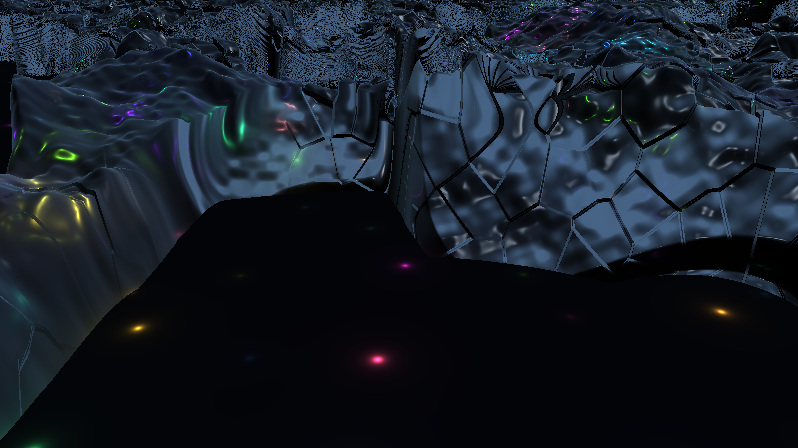

**Ergebnis:** Die Kamera gleitet über das Kristallfeld, wird langsamer, **kehrt weich um**, dreht sich dabei um die Hochachse, kippt mal flach (Horizont und Himmel erscheinen), mal steil (das Terrain füllt das ganze Bild) – und zwischendurch friert die Perspektive zur Isometrie ein und taut wieder auf. Die Fahrt wiederholt sich praktisch nie.

### Was passiert hier

**Die Umkehr ist die spinAngle-Lektion des Pyramid-Tutorials, auf Ortskoordinaten übertragen.** Dort wie hier gilt: Nicht die Geschwindigkeit vorgeben und hoffen, dass sich daraus eine schöne Position ergibt – sondern die **Position selbst als glatte Funktion** schreiben. `x(t) = A·sin(ωt)` hat als Ableitung `A·ω·cos(ωt)`: An den Bahn-Enden ist die Geschwindigkeit exakt null, die Kamera bremst organisch ab, steht einen Atemzug, fährt zurück. Richtungsumkehr gratis, ruckfrei, ohne Zustand. *(Und die Warnung von damals gilt spiegelbildlich: Wer stattdessen `ro.z += geschwindigkeit` schreiben will, braucht Gedächtnis zwischen Frames – das hat ein Shader nicht.)*

**Die fünf Uhren** (0.061, 0.043, 0.023, 0.017, 0.031) sind bewusst **inkommensurabel** gewählt – keine ist ein Vielfaches einer anderen. Bahn-x, Bahn-z, Rotation, Perspektive und Neigung geraten dadurch nie in einen gemeinsamen Takt: Die Fahrt ist streng deterministisch und wirkt trotzdem improvisiert. Das ist derselbe Kunstgriff, mit dem frosty caves seine Ewigkeits-Wirkung erzeugt (dort würfeln `rand`-Aufrufe; wir bleiben absichtlich deterministisch – wichtig für LumiViz' reproduzierbare Sim-Uhr, siehe Anhang B).

**Ein leicht zu übersehendes Detail:** Die Kamera fragt `terrainGlatt`, **nicht** `terrain`. Das echte Terrain enthält Plattensprünge und Lücken – eine Kamera, die daran klebt, würde bei jeder Kante hüpfen und über jedem Loch 6 Einheiten abstürzen. Die glatte Grundform ist die „gefederte" Version der Landschaft. Das `max(...)` darunter ist der Notanker: egal was die Choreografie will, nie in den Boden.

### 🎨 Experimentieren

- `TEMPO = 0.3` → Meditationsmodus; `2.5` → Achterbahn (mit `clamp`-Verweilen wird auch das nie hektisch)
- Uhren gleichschalten: alle fünf auf `0.05` → nach kurzer Zeit erkennt man die Schleife. Der beste Beweis, was die Inkommensurabilität leistet
- `persp`-Amplitude `0.65` → `0.0` bei Startwert `0.5 → 0.0`: dauerhafte Iso-Fahrt (der „Diorama-Modus")
- Bahn-Amplituden `7/10` → `2/3`: die Kamera kreist eng über denselben Lampen – gut, um einzelne Blink-Zyklen zu beobachten

---

## Schritt 14 – Politur: Nebel, Farbdrift, Tonemapping – der fertige Shader

**Neu:** Vier Veredelungen aus dem frosty-caves-Werkzeugkasten – Distanznebel, Sternenstaub im Himmel, die langsame Farbdrift (`roam_sin`-Erbe) und das Tonemapping `1 − exp(−x)`. Danach steht der komplette Shader – hier als **Gesamtlisting** zum Einfügen.

```glsl
// ============================================================================
// "Crystal Lights" - halbliquides Kristall-Terrain ueber pulsierenden Lichtern
// Endstand des Tutorials (Schritt 14). Braucht keine iChannels.
// Stil-Verwandtschaft: martin - frosty caves 2 (1/d²-Lichter, Eis-Palette,
// Farbdrift, 1-exp-Tonemapping).
// ============================================================================

// ---- STELLSCHRAUBEN --------------------------------------------------------
const float LUECKEN      = 0.30;  // 0.0 = geschlossene Decke .. 0.6 = Inselwelt
const float LUECKEN_DYN  = 0.15;  // dynamisches Oeffnen/Schliessen (0 = statisch)
const float DICHTE       = 0.55;  // Kristall-Absorption (0 = Glas, 1.5 = Milcheis)
const float GLOW         = 1.6;   // Streu-Glow an liquiden Stellen
const float LAMPEN_ZELLE = 1.7;   // Rasterabstand der Leuchtkoerper
const float TIEFE        = -1.8;  // y der Lichtebene
const float TEMPO        = 1.0;   // Gesamttempo der Kamerafahrt
const float ABSTAND      = 5.0;   // Kameraabstand zum Blickpunkt
const float ORTHO_BREITE = 6.0;   // Bildbreite (Welteinheiten) der Iso-Sicht
// ----------------------------------------------------------------------------

#define R(a) mat2(cos(a), sin(a), -sin(a), cos(a))

float hash21(vec2 p) { return fract(sin(dot(p, vec2(127.1, 311.7))) * 43758.5453); }

vec2 hash22(vec2 p)
{
    return fract(sin(vec2(dot(p, vec2(127.1, 311.7)),
                          dot(p, vec2(269.5, 183.3)))) * 43758.5453);
}

float vnoise(vec2 p)
{
    vec2 i = floor(p), f = fract(p);
    vec2 u = f * f * (3.0 - 2.0 * f);
    return mix(mix(hash21(i),              hash21(i + vec2(1, 0)), u.x),
               mix(hash21(i + vec2(0, 1)), hash21(i + vec2(1, 1)), u.x), u.y);
}

float fbm(vec2 p)
{
    float v = 0.0, a = 0.5;
    for (int i = 0; i < 5; i++) { v += a * vnoise(p); p = p * 2.03 + 11.7; a *= 0.5; }
    return v;
}

vec3 voronoi(vec2 p)
{
    vec2 i = floor(p), f = fract(p);
    float best = 8.0;
    vec2 bestId = vec2(0.0);
    for (int y = -1; y <= 1; y++)
    for (int x = -1; x <= 1; x++) {
        vec2 g = vec2(float(x), float(y));
        vec2 r = g + hash22(i + g) - f;
        float d = dot(r, r);
        if (d < best) { best = d; bestId = i + g; }
    }
    return vec3(best, bestId);
}

// ---- die Felder ueber der Bodenebene ---------------------------------------

float terrainGlatt(vec2 p) { return (fbm(p * 0.35) - 0.45) * 2.4; }

float liquid(vec2 p)
{
    return smoothstep(0.35, 0.75, vnoise(p * 0.22 + vec2(0.0, iTime * 0.06)));
}

float gapMask(vec2 p)
{
    float schwelle = LUECKEN + LUECKEN_DYN * (0.5 + 0.5 * sin(iTime * 0.09));
    return smoothstep(schwelle - 0.10, schwelle + 0.10, vnoise(p * 0.30 + 41.0));
}

float terrain(vec2 p)
{
    float glatt = terrainGlatt(p);

    vec3 vo = voronoi(p * 1.5);
    float kristall = glatt + (hash21(vo.yz) - 0.5) * 0.55;

    float welle = (vnoise(p * 1.4 + vec2(iTime * 0.25, 0.0)) - 0.5) * 0.12;
    float fluessig = glatt + welle;

    float h = mix(kristall, fluessig, liquid(p));
    return mix(-6.0, h, gapMask(p));
}

// ---- Marsch & Normale ------------------------------------------------------

float marchTerrain(vec3 ro, vec3 rd)
{
    float t = 0.0;
    for (int i = 0; i < 150; i++) {
        vec3 p = ro + rd * t;
        float d = p.y - terrain(p.xz);
        if (d < 0.001 + 0.0015 * t) return t;
        if (t > 45.0) break;
        t += d * 0.4;
    }
    return -1.0;
}

vec3 terrainNormal(vec2 p, float t)
{
    vec2 e = vec2(0.012 * (1.0 + t * 0.12), 0.0);
    return normalize(vec3(terrain(p - e.xy) - terrain(p + e.xy),
                          2.0 * e.x,
                          terrain(p - e.yx) - terrain(p + e.yx)));
}

// ---- Licht -----------------------------------------------------------------

vec3 lampColor(float t)
{
    return 0.55 + 0.45 * cos(6.28318 * (t + vec3(0.0, 0.33, 0.67)));
}

float blink(vec2 id)
{
    float ph = hash21(id + 31.7);
    float sp = 0.35 + 0.75 * hash21(id + 17.3);
    float w  = 0.5 + 0.5 * sin(6.28318 * (iTime * sp * 0.25 + ph));
    return smoothstep(0.70, 0.97, w) * (0.2 + 0.8 * hash21(id + 5.1));
}

vec3 lightsAt(vec2 q, float weich)
{
    vec2 base = floor(q / LAMPEN_ZELLE);
    vec3 acc = vec3(0.0);
    for (int y = -1; y <= 1; y++)
    for (int x = -1; x <= 1; x++) {
        vec2 id = base + vec2(float(x), float(y));
        vec2 c  = (id + 0.5 + 0.7 * (hash22(id + 7.0) - 0.5)) * LAMPEN_ZELLE;
        vec2 d  = q - c;
        float hell = blink(id) + 0.05;
        acc += lampColor(hash21(id)) * hell / (0.02 + dot(d, d) * 14.0 / weich);
    }
    return acc * 0.05;
}

vec3 himmelFarbe(vec3 rd)
{
    vec3 col = mix(vec3(0.10, 0.12, 0.22), vec3(0.02, 0.03, 0.08),
                   clamp(rd.y * 3.0, 0.0, 1.0));
    // NEU: Sternenstaub - Hash auf der Blickrichtung, nur hoch am Himmel
    float s = hash21(floor(rd.xy / max(abs(rd.z), 0.2) * 90.0));
    col += vec3(0.6) * smoothstep(0.997, 1.0, s) * clamp(rd.y * 4.0, 0.0, 1.0);
    return col;
}

// ---- Material --------------------------------------------------------------

vec3 shadeKristall(vec3 p, vec3 rd, float t)
{
    vec3 n  = terrainNormal(p.xz, t);
    float L = liquid(p.xz);

    vec3 rr = refract(rd, n, 1.0 / 1.45);
    if (dot(rr, rr) < 0.5) rr = rd;

    float tt = (TIEFE - p.y) / min(rr.y, -0.05);
    vec2 q = (p + rr * tt).xz;

    float dicke = max(p.y - TIEFE, 0.0);
    vec3 T = exp(-dicke * vec3(0.85, 0.30, 0.16) * DICHTE);

    vec3 col = lightsAt(q, 1.0) * T;                       // gebrochenes Lampenlicht
    col += lightsAt(q, 1.0 + L * 10.0) * T * L * GLOW;     // Streu-Glow (liquide)

    vec3 mond = normalize(vec3(0.4, 0.75, -0.5));
    float spec = pow(max(dot(reflect(rd, n), mond), 0.0), 60.0);
    col += spec * (1.0 - L) * vec3(0.9, 0.95, 1.0) * 0.6;  // Sparkle (kristallin)

    float fres = pow(1.0 - max(dot(n, -rd), 0.0), 3.0);
    col += fres * vec3(0.35, 0.50, 0.65) * 0.5;            // Himmel-Spiegelung

    col += max(dot(n, mond), 0.0) * vec3(0.10, 0.14, 0.20); // Mond-Schimmer

    return col;
}

// ---- Kamera ----------------------------------------------------------------

void kamera(vec2 uv, out vec3 ro, out vec3 rd)
{
    float zt = iTime * TEMPO;

    vec2 bahn = vec2(sin(zt * 0.061) * 7.0, sin(zt * 0.043) * 10.0);

    float gier  = 0.785 + 0.9 * sin(zt * 0.023);
    float persp = clamp(0.5 + 0.65 * sin(zt * 0.017), 0.0, 1.0);
    float nickP = -0.16 - 0.30 * (0.5 + 0.5 * sin(zt * 0.031));
    float nick  = mix(-0.62, nickP, persp);

    vec3 ta = vec3(bahn.x, 0.0, bahn.y);
    ta.y = terrainGlatt(ta.xz) * 0.5;

    vec3 fw = vec3(cos(nick) * sin(gier), sin(nick), cos(nick) * cos(gier));
    vec3 rt = normalize(cross(vec3(0.0, 1.0, 0.0), fw));
    vec3 up = cross(fw, rt);

    ro = ta - fw * ABSTAND;
    ro.y = max(ro.y, terrainGlatt(ro.xz) + 1.4);

    rd  = normalize(fw * 1.3 + (rt * uv.x + up * uv.y) * persp);
    ro += (rt * uv.x + up * uv.y) * ORTHO_BREITE * (1.0 - persp);
    ro -= fw * 8.0 * (1.0 - persp);
}

// ---- Hauptprogramm ---------------------------------------------------------

void mainImage(out vec4 fragColor, in vec2 fragCoord)
{
    vec2 uv = (fragCoord - 0.5 * iResolution.xy) / iResolution.y;

    vec3 ro, rd;
    kamera(uv, ro, rd);

    float t  = marchTerrain(ro, rd);
    float tP = (rd.y < -0.001) ? (TIEFE - ro.y) / rd.y : 1e5;

    vec3 color;
    float tHit = -1.0;

    if (tP < 1e4 && (t < 0.0 || tP < t)) {
        // Blick durch eine Luecke: Leuchtkoerper direkt
        vec2 q = (ro + rd * tP).xz;
        color = vec3(0.010, 0.015, 0.030) + lightsAt(q, 1.0);
        tHit = tP;
    } else if (t > 0.0) {
        // Kristall-Terrain
        color = shadeKristall(ro + rd * t, rd, t);
        tHit = t;
    } else {
        color = himmelFarbe(rd);
    }

    // NEU (1): Distanznebel - die Ferne versinkt im kalten Dunst
    if (tHit > 0.0)
        color = mix(color, vec3(0.05, 0.07, 0.12),
                    1.0 - exp(-0.0012 * tHit * tHit));

    // NEU (2): Farbdrift - das ganze Bild wandert langsam durch kalte Toene
    color *= 0.85 + 0.15 * cos(iTime * 0.05 + vec3(0.0, 2.1, 4.2));

    // NEU (3): Tonemapping wie frosty caves: ret = 1 - exp(-ret)
    color = 1.0 - exp(-color * 1.4);

    // NEU (4): Gamma + Vignette
    color = pow(color, vec3(1.0 / 2.2));
    color *= 1.0 - 0.35 * dot(uv, uv);

    fragColor = vec4(color, 1.0);
}
```

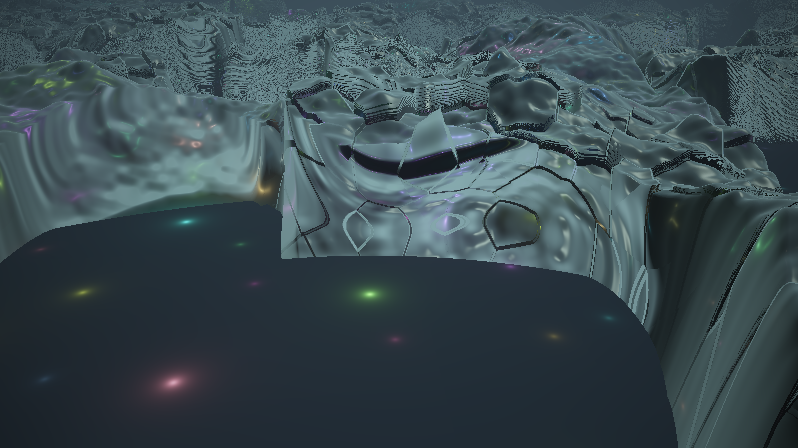

**Ergebnis:** Der fertige Shader. Kaltes, halbdurchsichtiges Kristall-Terrain unter einem Sternenhimmel; farbige Lichter flammen unter dem Eis auf, zerfließen an den liquiden Stellen zu Glow und stechen durch die Lücken; die Kamera gleitet, kehrt um, rotiert und friert zwischendurch zur Isometrie ein.

### Was passiert hier – die vier Politur-Griffe

1. **Distanznebel** mit `exp(-k·t²)`: Das Quadrat lässt die Nähe klar und drückt erst die Ferne in den Dunst – gleichzeitig kaschiert es die groben Fern-Schritte des Marschierers (die alte Doppelrolle des Nebels: Ästhetik *und* Fehlerdecke).
2. **Farbdrift:** Drei phasenversetzte, sehr langsame Cosinus-Wellen multiplizieren das Gesamtbild – nie mehr als ±15 %, aber das Bild „lebt", selbst wenn gerade keine Lampe blinkt. Das ist die GLSL-Fassung von frosty caves' `lerp(col, roam_sin, 0.5)` – dort mischen langsam wandernde Zufalls-Sinusse die Farbkanäle, hier tun es deterministische.
3. **Tonemapping `1 − exp(−x)`:** wörtlich frosty caves' letzte Shader-Zeile (`ret = 1-exp(-ret);`). Die Kurve ist linear für dunkle Werte und sättigt weich gegen 1 – die `1/d²`-Lampenkerne (die mathematisch beliebig hell werden) **clippen nie hart**, sondern glühen aus. Für einen Shader voller Punktlichter ist das die wichtigste einzelne Politur-Zeile.
4. **Gamma + Vignette:** Standard-Abschluss; die Vignette lenkt zusätzlich auf die Bildmitte.

### 🎨 Experimentieren – jetzt am Gesamtwerk

- Das komplette Stellschrauben-Brett oben durchspielen – jede Konstante ist ein anderer Charakter: `LUECKEN 0.55 / GLOW 3.0 / TEMPO 0.4` ergibt z. B. einen langsamen Flug über glühende Insel-Archipele
- Belichtung `* 1.4` im Tonemapping → `* 2.5`: „überbelichteter" Look, der Glow frisst sich in den Himmel
- Nebelfarbe an die Lampen koppeln: `mix(color, vec3(0.05, 0.07, 0.12) + lightsAt(ro.xz, 30.0) * 0.5, …)` → der Dunst selbst schimmert farbig (teuer, aber prächtig)

🧠 **Merke:** Die Politur-Phase hat keine einzige neue Idee gebraucht – nur Kurven (`exp`, `cos`, `pow`) auf das fertige Bild. Wenn sich ein Shader in dieser Phase noch „retten lassen muss", liegt der Fehler in den Phasen davor.

---

# Anhang A: Audio-Reaktivität

Voraussetzung auf shadertoy.com: im Shader-Editor **iChannel0 mit „Music"** belegen (Kanal-Kachel → Music → beliebiger Track). Die Textur ist 512×2: Zeile 0 (`y ≈ 0.25`) das FFT-Spektrum, Zeile 1 (`y ≈ 0.75`) die Wellenform. Die Grundlagen (Spektrum ansehen, `bandLevel`-Bänder bauen) stehen ausführlich im Anhang A des Pyramid-Spiral-Tutorials – hier bauen wir darauf auf und konzentrieren uns auf das, was *dieser* Shader braucht: **Beat-Gates** im Stil von Rock The House und einen **Katalog von Mappings** auf die vielen Stellschrauben des Kristall-Terrains.

---

## Schritt A1 – Das Beat-Gate: der Rock-The-House-Trick in GLSL

**Neu:** Aus dem kontinuierlichen Bass-Pegel wird ein binäres AN/AUS – die GLSL-Übersetzung von Milkdrops `above(bass, 0.95)`.

```glsl
// iChannel0: Music

float bandLevel(float lo, float hi)
{
    float sum = 0.0;
    const int N = 12;
    for (int i = 0; i < N; i++) {
        float x = mix(lo, hi, (float(i) + 0.5) / float(N));
        sum += texture(iChannel0, vec2(x, 0.25)).x;
    }
    return sum / float(N);
}

void mainImage(out vec4 fragColor, in vec2 fragCoord)
{
    vec2 uv = fragCoord / iResolution.xy;

    float bass = bandLevel(0.00, 0.05);
    float gate = smoothstep(0.60, 0.75, bass);    // DAS Beat-Gate

    vec3 color = vec3(0.02);

    // links: der rohe Bass-Pegel  |  rechts: das Gate (aus oder an)
    if (uv.x < 0.47) color = uv.y < bass ? vec3(0.9, 0.3, 0.3) : color;
    if (uv.x > 0.53) color = uv.y < gate ? vec3(0.3, 0.9, 1.0) : color;

    // und der ganze Hintergrund blitzt, wenn das Gate offen ist
    color += gate * vec3(0.10, 0.06, 0.02);

    fragColor = vec4(color, 1.0);
}
```

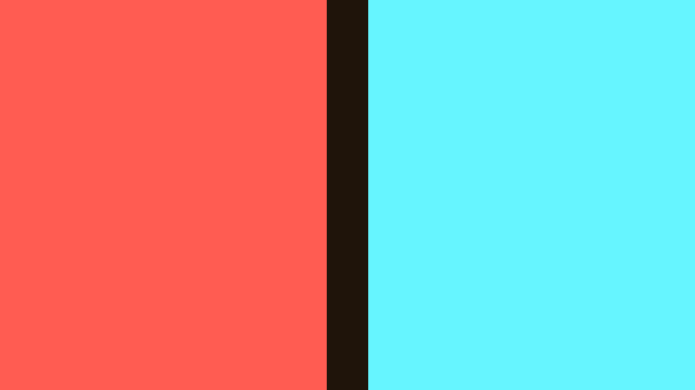

**Ergebnis:** Links wogt der Bass-Balken kontinuierlich – rechts springt der Gate-Balken **schlagartig** auf voll, sobald der Bass die Schwelle reißt, und fällt dazwischen auf null. Bei jedem Kick blitzt der Hintergrund.

### Was passiert hier – und was Rock The House anders macht

Das Vorbild aus dem Preset (`GreatWho – Rock The House_2024.milk`):

```
shape_0_per_frame9 = a = if(above(bass, 0.95), 2, 0);
per_pixel_2        = rot = if(above(bass, 0.9), 0.05*sin(time)*(...), 0);
```

Ein harter Schwellwert, null Übergang – die Form ist *da* oder *nicht da*. Genau diese Kompromisslosigkeit macht den „Rock"-Charakter aus; ein weich mitwachsender Parameter würde dieselbe Musik brav illustrieren statt sie zu schlagen.

Zwei Übersetzungsfallen von Milkdrop nach Shadertoy:

1. **Die Skala.** Milkdrops `bass` ist **normiert**: ~1.0 bedeutet „durchschnittlich laut", 0.95 ist also eine *relative* Schwelle („überdurchschnittlich"). Die Shadertoy-FFT ist ein **Absolutpegel** 0..1, der je nach Track und Lautstärke völlig anders liegt. Die Schwelle `0.60/0.75` hier ist darum Handarbeit pro Musikrichtung – die saubere, track-unabhängige Lösung (Vergleich mit dem eigenen gleitenden Mittel, wie Milkdrop es tut) braucht **Gedächtnis** und kommt in B3.
2. **`smoothstep` statt `step`.** Ein echter Binärschalter flackert, wenn der Pegel genau auf der Schwelle „sägt" (mehrmals pro Sekunde an/aus). Die schmale smoothstep-Rampe ist das zitterfreie Gate – von weitem wirkt sie trotzdem wie ein Schalter.

### 🎨 Experimentieren

- Schwelle absenken (`0.35/0.50`) und einen ruhigen Track spielen – das Gate übernimmt jetzt die Snare mit; Schwellen *sind* Instrumenten-Auswahl
- `gate = smoothstep(0.60, 0.75, bandLevel(0.25, 0.7));` → ein Hi-Hat-Gate: hektisch, glitzernd
- Zwei Gates mischen: Bass-Gate auf Rot, Höhen-Gate auf Blau → man *sieht* das Arrangement

---

## Schritt A2 – Der Mapping-Katalog: wohin mit welchem Signal?

Kein neuer Shader – eine Landkarte. Der Kristall-Shader hat ungewöhnlich viele sinnvolle Andockstellen; die Kunst ist wie immer *musikalische Rolle → visuelle Rolle*. Alle Schnipsel beziehen sich auf das Gesamtlisting aus Schritt 14 und benutzen die Globals `gBass/gMid/gTreb/gVol/gGate` (die A3 einführt).

| # | Audio | steuert | Eingriff | warum es passt |
|---|---|---|---|---|
| 1 | Bass-**Gate** | Alle Lampen zünden gemeinsam | in `blink()`: `return max(eigen, gGate * (0.4 + 0.6 * hash21(id + 2.2)));` (`eigen` = bisheriger Rückgabewert) | Der Beat schlägt **durch das ganze Feld** – das Rock-The-House-Erlebnis; das `hash21` hält die Lampen dabei ungleich hell, sonst wirkt es wie ein Stroboskop |
| 2 | Bass (kontinuierlich) | Glow-Stärke | in `shadeKristall`: `... * L * GLOW * (0.4 + 1.6 * gBass)` | Der Beat ist Masse und Wärme – er darf das Licht im Material pumpen |
| 3 | Mitten | Lampen-Farbwelt | in `lightsAt`: `lampColor(hash21(id) + gMid * 0.4)` | Melodie = Stimmung = Farbe; das ganze Feld wandert mit der Harmonik durch den Farbkreis |
| 4 | Höhen | Sparkle | in `shadeKristall`: `spec * (1.0 - L) * ... * (0.2 + 2.5 * gTreb)` | Hi-Hats sind spitz und glitzernd – exakt der Charakter der Facetten-Blitze |
| 5 | Lautheit | Liquidität („das Terrain schmilzt") | in `liquid()`: `smoothstep(0.35 + 0.25 * (1.0 - gVol * 2.0), 0.75, ...)` | Bei lauter Musik werden die flüssigen Zonen größer – das Material selbst reagiert, nicht nur sein Schmuck |
| 6 | Lautheit | Lücken öffnen sich | in `gapMask()`: `schwelle += gVol * 0.3;` | Energie reißt die Decke auf und legt die Lichter frei – der dramatischste Eingriff, sparsam dosieren |

*Tab. 3: Mapping-Katalog – Audio-Signal, Stellschraube, Eingriff und Begründung*

**Ergebnis:** Für jedes der sechs Mappings sind Signal, Eingriffsort (Funktion samt Zeile) und Begründung benannt – die Schnipsel aus Tab. 3 lassen sich in Schritt A3 unverändert übernehmen.

Zwei Warnungen aus dem Pyramid-Tutorial gelten verschärft:

- **Nie auf den Faktor vor `iTime`** – hier gleich fünffach relevant: Alle fünf Kamera-Uhren sind Positionen; ein audio-gesteuertes Tempo würde die Kamera bei jedem Beat teleportieren. Wer „bei Bass schneller fliegen" will, braucht Zustand (B3) – oder legt den Bass stattdessen auf die *Amplitude* der Bahn, nicht auf ihre Uhr.
- **Geometrie-Mappings ändern die Landschaft unter der Kamera.** Mapping 5 und 6 verformen `terrain()` – die Kamera federt das ab, weil sie auf `terrainGlatt` fährt (das absichtlich **un**-gemappt bleibt). Wer zusätzlich die Hügel-Amplitude pumpen will (`terrainGlatt` mit `gBass` skalieren), muss die Kamera-Klammer `+ 1.4` mit anheben – sonst taucht die Kamera bei lauten Passagen ins Terrain.

---

## Schritt A3 – Das Kristallfeld hört zu

**Neu:** Die Mappings 1–6 wandern in den fertigen Shader. Gezeigt sind nur die Änderungen gegenüber dem Gesamtlisting aus Schritt 14 – auf shadertoy.com zusätzlich **iChannel0 = Music** setzen.

**(a) Vor die Stellschrauben** – Audio-Infrastruktur:

```glsl
// ---- AUDIO -----------------------------------------------------------------
float gBass = 0.0, gMid = 0.0, gTreb = 0.0, gVol = 0.0, gGate = 0.0;

float bandLevel(float lo, float hi)
{
    float sum = 0.0;
    const int N = 12;
    for (int i = 0; i < N; i++) {
        float x = mix(lo, hi, (float(i) + 0.5) / float(N));
        sum += texture(iChannel0, vec2(x, 0.25)).x;
    }
    return sum / float(N);
}
// ----------------------------------------------------------------------------
```

**(b) Am Anfang von `mainImage`** – einmal pro Frame füllen, *bevor* Marsch und Kamera laufen:

```glsl
    gBass = bandLevel(0.00, 0.05);
    gMid  = bandLevel(0.05, 0.25);
    gTreb = bandLevel(0.25, 0.70);
    gVol  = bandLevel(0.00, 0.70);
    gGate = smoothstep(0.60, 0.75, gBass);
```

**(c) Die sechs Eingriffe** (Mapping-Nummern aus A2):

```glsl
// blink(): letzte Zeile ersetzen                                      [1]
    float eigen = smoothstep(0.70, 0.97, w) * (0.2 + 0.8 * hash21(id + 5.1));
    return max(eigen, gGate * (0.4 + 0.6 * hash21(id + 2.2)));

// liquid(): Schwelle atmet mit der Lautheit                           [5]
    return smoothstep(0.35 + 0.25 * (1.0 - min(gVol * 2.0, 1.0)), 0.75,
                      vnoise(p * 0.22 + vec2(0.0, iTime * 0.06)));

// gapMask(): Energie reisst die Decke auf                             [6]
    float schwelle = LUECKEN + LUECKEN_DYN * (0.5 + 0.5 * sin(iTime * 0.09))
                   + gVol * 0.3;

// lightsAt(): Farbwelt wandert mit den Mitten                         [3]
        acc += lampColor(hash21(id) + gMid * 0.4) * hell / (...unveraendert...);

// shadeKristall(): Glow pumpt mit dem Bass, Sparkle mit den Hoehen    [2][4]
    col += lightsAt(q, 1.0 + L * 10.0) * T * L * GLOW * (0.4 + 1.6 * gBass);
    col += spec * (1.0 - L) * vec3(0.9, 0.95, 1.0) * 0.6 * (0.2 + 2.5 * gTreb);
```

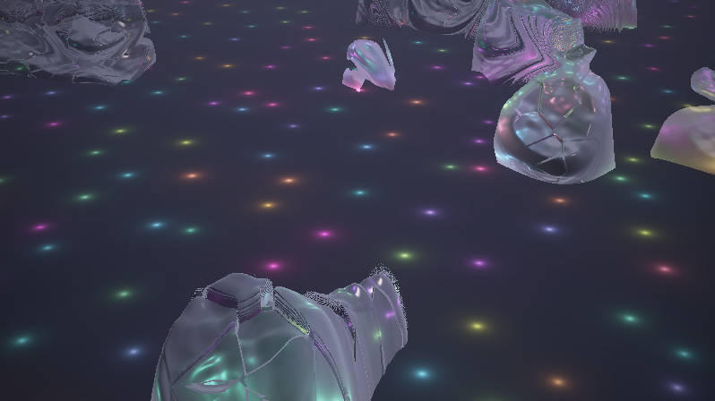

**Ergebnis:** Bei jedem Kick zünden die Lampen gemeinsam durch das ganze Feld und der Glow flammt in den liquiden Zonen auf; die Farbwelt schiebt sich mit der Melodie; Hi-Hats besprühen die Facetten mit Glitzer. In lauten Passagen schmilzt das Terrain sichtbar weicher und die Lücken reißen weiter auf – wird es still, friert alles wieder zu und die Lampen fallen in ihr einsames Einzel-Blinken zurück.

### Was passiert hier

Das dramaturgische Kalkül: Die **Grundmechanik** des Shaders (Einzel-Blinken, driftende Zonen, Kamerafahrt) läuft ohne Audio weiter – Musik **verstärkt** sie nur. Deshalb `max(eigen, gate...)` statt Ersetzen, deshalb Faktoren wie `(0.4 + 1.6·gBass)` statt `gBass` pur: Bei Stille fällt der Shader auf sein sehenswertes Eigenleben zurück, statt schwarz herumzustehen. Ein Visualizer, der ohne Musik tot ist, ist auch *mit* Musik meist nur ein VU-Meter.

Die Ausnahmen sind die Geometrie-Mappings 5/6 – die einzigen, die wirklich *in* die Landschaft eingreifen. Sie sind auch die riskantesten: zu viel `gVol`-Hub, und das Terrain flackert im Frame-Takt der Pegel. Wer hier mehr will, braucht geglättete Pegel – und damit sind wir bei B3.

### 🎨 Experimentieren

- Mapping 1 abschalten, nur 2 aktiv: „das Feld atmet" statt „das Feld schlägt" – zwei völlig verschiedene Visualizer aus einer Zeile Unterschied
- `gGate` zusätzlich auf die Vignette: `color *= 1.0 - (0.35 - gGate * 0.15) * dot(uv, uv);` → das Bild „öffnet" sich bei jedem Beat
- Bass auf die **Bahn-Amplitude** (die erlaubte Variante von „schneller fliegen"): `vec2 bahn = vec2(sin(zt*0.061)*7.0, sin(zt*0.043)*10.0) * (1.0 + gBass*0.15);` – dezent halten

---

# Anhang B: Der Weg in die App – und zurück

Der fertige Shader benutzt ausschließlich Standard-Uniforms (`iResolution`, `iTime`, `iChannel0`) – nach derselben Konvention wie die 100 Vorrats-Shader in `asset/shadertoys/` (STELLSCHRAUBEN-Konstantenblock, keine plattformspezifischen Extras). Das ist kein Zufall, sondern die Voraussetzung dafür, dass die drei Wege in diesem Anhang alle **verlustfrei in beide Richtungen** funktionieren. *(UI-Namen und Verhalten: Stand Session 65/67.)*

---

## B1 – Drei Wege von Shadertoy nach LumiViz

Der Shadertoy-Node der Effect-Chain führt `mainImage` unverändert aus – voller Standard-Uniform-Satz, eingebettet in GLSL 330. Drei Wege, den Code hineinzubekommen:

**Weg 1 – Copy & Paste (immer verfügbar, auch offline).** Chain-Node vom Typ *Shadertoy* anlegen, den kompletten Shader (samt aller Hilfsfunktionen, ohne Änderungen) in das GLSL-Feld des Editors einfügen. Für die Tutorial-Schritte und eigene Shader ist das der Normalweg. Komfort-Details des Editors: Großeditor hinter dem Code-Feld, Referenzseite (Uniforms/Audio/Buffer) hinter dem ⓘ, und Kompilierfehler werden **mit den Zeilennummern des eingefügten Codes** gemeldet (der Wrapper setzt `#line 1`) – ein Fehler in „Zeile 87" ist also wirklich Zeile 87 des eigenen Codes. Kompiliert der Shader nicht, rendert der Node Passthrough und das Panel zeigt die Meldung.

**Weg 2 – URL-/ID-Import im Editor.** Im Node-Editor die Shadertoy-URL (oder nackte ID) ins URL-Feld, *Importieren* drücken – der GET geht nur auf Knopfdruck raus. Voraussetzung: ein Shadertoy-**App-Key** (kostenlos auf shadertoy.com/howto beantragen) in den Einstellungen (`shadertoy/apiKey`, bleibt rein lokal). Die API liefert nur Shader mit Sichtbarkeit „public + api" – fremde Shader ohne diese Freigabe müssen (mit Erlaubnis des Autors) über Weg 1 wandern. Multipass-Shader werden mitsamt Buffer-Topologie aufgelöst (siehe B3), ein „music"-Kanal des Originals landet automatisch auf dem Audio-Kanal des Nodes.

**Weg 3 – das Shadertoy-Browser-Panel.** Das Dock-Panel mit Suchfeld, Sortierung und Thumbnail-Grid (gleicher App-Key). Doppelklick auf ein Ergebnis lädt den Shader als Ein-Node-Chain – der schnellste Weg, um Fremdmaterial zu sichten und als Ausgangspunkt zu übernehmen.

**Audio nach dem Import:** Die App stellt die Audio-Textur im **identischen 512×2-Layout** bereit (Zeile 0 FFT, Zeile 1 Waveform) – am iChannel, der im Editor als Audio-Kanal gewählt ist. Unser `bandLevel`-Code läuft also unverändert; es muss nur derselbe Kanalindex eingestellt sein, den der Code abfragt (hier: 0). Und eine Eigenheit, die zum Feature wird: `iTime` ist in LumiViz die **deterministische Sim-Uhr** – derselbe Frame ergibt dasselbe Bild, Prüfstand-tauglich. Unsere bewusst zufallsfreie Kamera-Choreografie (Schritt 13) zahlt genau darauf ein.

---

## B2 – Die Gegenrichtung: in LumiViz bauen, nach Shadertoy portieren

Der umgekehrte Arbeitsfluss hat handfeste Vorteile: In LumiViz entwickelt man mit **deterministischer Uhr** (reproduzierbare Vergleichsbilder), mit **echtem eigenem Audio** statt der Shadertoy-Musikauswahl, und mit den **fertigen Audio-Uniforms** `bass`, `mid`, `treb`, `vol`, `beat` – kein `bandLevel`-Geraffel während der Entwicklung. Der Preis ist die Portierungsarbeit am Ende. Sie bleibt klein, wenn man sie von Anfang an einplant:

**Portabilitäts-Checkliste (LumiViz → shadertoy.com):**

1. **Nur Standard-Uniforms im Kerncode** – LumiViz-Extras (`bass` & Co.) ausschließlich über eine Adapter-Schicht ansprechen (Muster unten). Dann ist die Portierung ein Kommentar-Tausch.
2. **Audio-Kanal:** auf shadertoy.com iChannel0 mit „Music" belegen; das Texturlayout ist identisch, `bandLevel` läuft 1:1.
3. **`beat` hat kein Shadertoy-Pendant** – als Ersatz das Gate aus A1 (oder für Qualität: die Buffer-Lösung aus B3).
4. **Skalen nachziehen:** die LumiViz-Uniforms und die rohe Shadertoy-FFT liegen auf verschiedenen Skalen (die endgültige Audio-Skalierung ist app-seitig noch in Klärung – Stand S65 offen). Beim Umzug einmal beide nebeneinander visualisieren (A1-Muster) und den Adapter-Faktor anpassen, statt allen Mappings neue Konstanten zu geben.
5. **Kein `#version`, kein `precision`, `mainImage`-Signatur unverändert** – beide Plattformen wrappen selbst.
6. **Multipass:** Buffer A–D entsprechen sich; Selbstreferenz liest auf beiden Plattformen das **Vorframe** (Ping-Pong). Kanalzuordnung beim Umzug prüfen.
7. **Alles Konfigurierbare als STELLSCHRAUBEN-Konstanten** im Kopf – Shadertoy hat keine Panels.

**Das Adapter-Muster** – der ganze Shader spricht nur `aBass()`/`aMid()`/`aTreb()`/`aVol()`/`aBeat()` an, und der Umzug ist ein Umkommentieren:

```glsl
// ===== AUDIO-ADAPTER =========================================================
// Genau EINEN der beiden Bloecke aktiv lassen.

// --- Variante SHADERTOY (iChannel0 = Music) ---------------------------------
float bandLevel(float lo, float hi)
{
    float sum = 0.0;
    const int N = 12;
    for (int i = 0; i < N; i++)
        sum += texture(iChannel0,
                       vec2(mix(lo, hi, (float(i) + 0.5) / float(N)), 0.25)).x;
    return sum / float(N);
}
float aBass() { return bandLevel(0.00, 0.05); }
float aMid()  { return bandLevel(0.05, 0.25); }
float aTreb() { return bandLevel(0.25, 0.70); }
float aVol()  { return bandLevel(0.00, 0.70); }
float aBeat() { return smoothstep(0.60, 0.75, aBass()); }

// --- Variante LUMIVIZ (eingebaute Uniforms; SKALEN-FAKTOR anpassen, s. Text) -
// float aBass() { return bass * 0.3; }
// float aMid()  { return mid  * 0.3; }
// float aTreb() { return treb * 0.3; }
// float aVol()  { return vol  * 0.3; }
// float aBeat() { return beat; }
// ============================================================================
```

In A3 hieße das: `gBass = aBass();` usw. – der Rest des Shaders weiß nicht, auf welcher Plattform er läuft.

---

## B3 – Gedächtnis: Beat-Envelopes über Buffer A (beide Plattformen)

Das eine Werkzeug, das im Haupt-Tutorial bewusst fehlte: **Zustand.** Ein Image-Shader hat kein Gedächtnis – aber ein Buffer, der sich selbst als Eingang liest, hat eins (er sieht sein Vorframe). Damit lassen sich die beiden Schwächen der A-Lösungen sauber beheben: geglättete Pegel (statt Frame-Zittern) und eine **adaptive** Beat-Erkennung mit Abklingkurve (statt absoluter Schwellen).

**Buffer A** (auf shadertoy.com: Tab „Buffer A" anlegen; iChannel0 = Music, iChannel1 = Buffer A selbst) – ein einziger Pixel trägt den Zustand:

```glsl
// BUFFER A - Zustand in Pixel (0,0):  x = geglaetteter Bass,  y = Beat-Envelope
float bandLevel(float lo, float hi) { /* wie in A1 */ }

void mainImage(out vec4 fragColor, in vec2 fragCoord)
{
    vec4 alt = texture(iChannel1, vec2(0.5) / iResolution.xy);   // MEIN Vorframe

    float bass   = bandLevel(0.00, 0.05);
    float glatt  = mix(alt.x, bass, 0.10);            // Tiefpass ueber die ZEIT

    // Beat = Bass springt deutlich ueber sein eigenes gleitendes Mittel
    float schlag = step(glatt * 1.35 + 0.02, bass);
    float env    = max(alt.y * 0.90, schlag);         // zuendet hart, klingt weich aus

    fragColor = vec4(glatt, env, 0.0, 1.0);
}
```

**Image-Shader:** iChannel1 = Buffer A, dann:

```glsl
    float gGate = texture(iChannel1, vec2(0.5) / iResolution.xy).y;
```

### Was passiert hier

Die drei Zeilen sind wörtlich das Muster, das jedes gute Milkdrop-Preset im `per_frame`-Code pflegt – Rock The House und frosty caves eingeschlossen (`vol_ = vol_*dec_m + (1-dec_m)*vol` bei frosty caves ist exakt unser `mix(alt.x, bass, 0.10)`):

1. **Tiefpass:** `mix(alt, neu, 0.10)` = exponentiell gleitendes Mittel. Aus dem Zittern der FFT wird ein träger Referenzpegel – „wie laut ist dieser Track gerade generell?"
2. **Adaptiver Trigger:** `bass > glatt·1.35` vergleicht den Moment mit dem *eigenen* Mittel statt mit einer Absolutzahl – das ist die Antwort auf das Skalenproblem aus A1: Der Trigger funktioniert für leise und laute Tracks gleich, wie Milkdrops normiertes `bass`.
3. **Envelope:** `max(alt·0.90, schlag)` zündet auf 1 und fällt pro Frame um 10 % – die klassische Attack-sofort/Release-weich-Hüllkurve. `gGate` aus A3 durch diese Envelope ersetzt, und die Lampen-Blitze bekommen ein *Ausglühen* statt eines harten Aus.

**In LumiViz** ist die Verdrahtung dieselbe Denkfigur: Der Shadertoy-Node unterstützt Multipass mit Buffer A–D; im Editor bekommt der Buffer-Pass Music auf dem Audio-Kanal und **sich selbst** als Eingang – die Selbstreferenz liest auch dort das Vorframe (Ping-Pong-Semantik wie beim Original). Ein importierter Multipass-Shader bringt diese Topologie automatisch mit (B1, Weg 2). Alternativ nimmt man in der App schlicht das fertige `beat`-Uniform über den Adapter aus B2 – und hebt sich Buffer A für das auf, was `beat` nicht kann: eigene Zeitkonstanten, mehrere Bänder mit eigenen Envelopes, oder einen langsam aufintegrierten „Energie-Vorrat", der sich in ruhigen Passagen auflädt und beim Drop entlädt.

### 🎨 Experimentieren

- Release `0.90` → `0.97`: Nachglühen über Sekunden – aus Beat-Blitzen werden Beat-Wellen
- Vier Zustände nutzen: `fragColor = vec4(glattBass, envBass, glattTreb, envTreb);` – getrennte Envelopes für Kick und Hi-Hat
- Der Energie-Vorrat: `z += bass * 0.002; z *= 1.0 - schlag * 0.8;` in einem weiteren Kanal – lädt sich leise auf, entlädt sich beim ersten Kick nach der Ruhe (der „Drop-Detektor")

---

## End-Validierung

Diese Validierung steht bewusst **hinter den Anhängen**: A1–A3 sind reguläre Schritte dieses Tutorials, und das Lernziel 5 (Audio-Reaktivität, Buffer-Zustand) ist erst dort erreichbar – die End-Validierung muss aber alle Lernziele abdecken. Die Kriterien 1–6 prüfen den Kern (Schritte 1–14), die Kriterien 7–8 die Anhänge. Jedes Kriterium ist am laufenden Shader auf shadertoy.com objektiv prüfbar:

1. **Kompilierbarkeit:** Das Gesamtlisting aus Schritt 14 kompiliert auf shadertoy.com ohne Fehlermeldung und rendert ein bewegtes Bild – kein Schwarzbild, kein Standbild. *(Basis aller Lernziele)*
2. **Terrain-Marsch:** Die Voronoi-Bruchkanten stehen als beleuchtete Klippen im Bild, ohne Löcher. Gegenprobe: Drossel `0.4` → `0.9` erzeugt sichtbare Durchschuss-Löcher in steilen Flanken; zurück auf `0.4` verschwinden sie wieder. *(Lernziele 1 und 6)*
3. **Felder:** `LUECKEN = 0.0` schließt die Kristalldecke vollständig, `LUECKEN = 0.55` erzeugt eine Inselwelt; die liquiden Zonen (weiche, wogende Flächen) wandern erkennbar in Zeitlupe durch das Terrain. *(Lernziel 2)*
4. **Brechung und Absorption:** `DICHTE = 0.0` zeigt die Lampen fast ungefiltert durch das Material, `DICHTE = 1.5` fast opak; unter dicken Stellen entsteht ein blaugrüner Farbstich, unter dünnen bleiben die Lampenfarben bunt. *(Lernziel 3)*
5. **Leuchtkörper:** Die Lampen blinken **unabhängig** voneinander – jede mit eigener Phase, eigenem Tempo, eigener Farbe und eigener Grundhelligkeit; kein gemeinsamer Takt ohne Audio. *(Lernziel 3, Teilaspekt Lichtsumme)*
6. **Kamera:** `PERSPEKTIVE = 0.0` (Stand Schritt 12) zeigt eine Parallelprojektion **ohne Fluchtpunkt** – hintere Hügel exakt so groß wie vordere; im Endstand (Schritt 13) verlangsamt die Fahrt an den Bahn-Enden sichtbar und kehrt weich um, ohne Sprung. *(Lernziel 4)*
7. **Audio:** Im A3-Stand (iChannel0 = Music) zünden die Lampen bei jedem Bass-Kick feldweit und der Glow flammt auf; **ohne Musik** läuft das Einzel-Blinken und die Kamerafahrt unverändert weiter. *(Lernziel 5)*
8. **Buffer-Envelope:** Mit dem B3-Aufbau (Buffer A liest sich selbst) klingt das Beat-Gate weich aus statt hart abzuschalten, und der Trigger funktioniert bei leisen wie lauten Tracks ohne Anpassung der Schwellwerte. *(Lernziel 5)*

---

## Fehlerbehebung

Die häufigsten Stolperstellen dieses Tutorials, gesammelt nach Symptom (Tab. 4). Die schritt-lokalen ⚠-Hinweise (etwa zur Marsch-Drossel in Schritt 6) bleiben davon unberührt – hier stehen die Probleme, die typischerweise erst beim Zusammenbau oder beim Experimentieren auftreten:

| # | Symptom | Ursache | Lösung |
|---|---|---|---|
| 1 | Schwarzes Bild nach dem Einfügen | Code unvollständig kopiert (Hilfsfunktionen fehlen) oder Kompilierfehler – Shadertoy rendert dann nichts bzw. den letzten lauffähigen Stand | Gesamtlisting aus Schritt 14 komplett kopieren, mit `Alt+Enter` kompilieren und die Fehlerkonsole unter dem Editor lesen |
| 2 | Kompilierfehler `'…' : undeclared identifier` | Ab Schritt 6 zeigen die Listings nur noch **geänderte** Funktionen – der Rest des Vorschritts muss stehen bleiben | Den vollständigen Stand des vorherigen Schritts behalten und nur die gezeigten Funktionen ersetzen bzw. ergänzen (Hinweis am Anfang von Schritt 6) |
| 3 | Löcher/Durchschuss in steilen Klippen | Marsch-Drossel zu groß (z. B. `0.9`) – der vertikale Abstand unterschätzt steile Flanken und Plattensprünge | Drossel zurück auf `t += d * 0.4` (Schritt 3); bei extremen Platten-Versätzen zusätzlich die Iterationszahl erhöhen |
| 4 | Glitzer-Flimmern in der Ferne | Normalen-Abtastung bzw. Trefftoleranz feiner als ein Pixel der Fernsicht | Die `e`-Skalierung `(1.0 + t * 0.12)` (Schritt 5) und die wachsende Toleranz `0.001 + 0.0015 * t` (Schritt 3) nicht entfernen |
| 5 | Niedrige Framerate / Ruckeln | 150 Marsch-Iterationen plus doppelte `lightsAt`-Auswertung sind teuer, besonders auf integrierten GPUs | Shadertoy-Vorschau verkleinern; Iterationen (`150`), FBM-Oktaven (`5`) oder den Glow-Term (zweiter `lightsAt`-Aufruf) reduzieren |
| 6 | Konstanten wirken anders als beschrieben | Die Shader dieser Serie sind konstruiert, nachgerechnet und in LumiViz gegengerendert (Screenshots im Text) – aber nicht jeder Zahlwert ist gegen das beschriebene Zielbild feinabgeglichen, und shadertoy.com ist noch ungeprüft | Die Stellschraube in kleinen Schritten nachstimmen; die beschriebene **Wirkrichtung** jeder Konstante stimmt, der Absolutwert ist Startpunkt, nicht Dogma |
| 7 | Audio-Mappings reagieren nicht | iChannel0 nicht mit „Music" belegt, Track pausiert, oder die Gate-Schwelle passt nicht zum Track | Kanal-Kachel prüfen (A1); Schwellen `0.60/0.75` sind Handarbeit pro Musikrichtung – oder gleich die adaptive Lösung aus B3 verwenden |

*Tab. 4: Fehlerbehebung – Symptom, Ursache, Lösung*

---

## Nächste Schritte

Die Fortsetzung folgt der [Wegleitung](ShaderTutorials-overview.md) der Serie:

- **3D-Strang:** [Stratospheric-Tunnel](StratosphericTunnel-tutorial.md) (Wand-Relief, Fenster, Pfadkrümmung) und [Space-Debris](SpaceDebris-tutorial.md) (3D-Repetition, taumelnde Zellen) vertiefen das SDF-Raymarching mit den hier gelernten Kamera-Techniken.
- **2D-Strang:** [Pimped-Kaleidoscope](PimpedKaleidoscope-tutorial.md) ist unabhängig vom 3D-Strang und erklärt Feedback und Zustand – Milkdrops Warp-Schleife als Shadertoy-Buffer.
- **Danach:** [Juggernaut](Juggernaut-tutorial.md) (setzt Marsch-Sicherheit voraus) und zuletzt die Composites – [Portals](CompositePortals-tutorial.md) und [Transitions](CompositeTransitions-tutorial.md) verbauen das hier gebaute Kristall-Terrain direkt weiter, [Postfx](CompositePostfx-tutorial.md) hängt Multipass-Veredelung dahinter.

---

## Abspann

Damit ist die Reise komplett: ein Terrain-Raymarcher mit drei Etagen (Himmel, Kristall, Licht), vier Feldern über einer Karte (Höhe, Liquidität, Lücken, Lampen), einer Kamera, die zwischen zwei Projektionen wandert – und drei Wegen, das Ganze zwischen shadertoy.com und LumiViz zu bewegen.

Wer weitermachen will:

- **Als Vorlage in die App:** den Endstand (oder die Lieblings-Variante) als `.lvfx` neben die Vorlagen in `asset/effectchain/shadertoys/` legen – Konvention siehe dort (`.glsl` = SSOT).
- **Die Weichen zurückverfolgen:** Fast jeder 🎨-Kasten ist ein eigener Shader. Besonders ergiebig: harte Materialgrenzen (Schritt 7), Bernstein-Absorption (Schritt 10), der reine Iso-Diorama-Modus (Schritt 13).
- **Die Milkdrop-Brücke:** Wer den Look als *Preset* statt als Shadertoy-Node will, hat mit frosty caves 2 die Blaupause vor sich – dessen Warp-Shader marcht eine Distanz **über den Feedback-Buffer verteilt** (ein Schritt pro Frame, `PutDist`/`GetDist`) statt 150 Schritte pro Pixel. Das ist eine ganz eigene, faszinierende Schule – und ein anderes Tutorial.

Und jetzt: Musik an. 🎵❄️

---

## Siehe auch

**Voraussetzungen:**

- [Pyramid-Spiral-Shader-Tutorial](PyramidSpiral-tutorial.md) – die Raymarching-Grundlagen (UV, SDF, Normalen, Hash), auf denen dieses Tutorial aufbaut (Schritte 1–7 dort genügen).

**Verwandte Dokumente:**

- [Shader-Tutorials-Wegleitung](ShaderTutorials-overview.md) – Fokus-Tabellen, Lesereihenfolge und Technik-Index der gesamten Tutorial-Serie.
- [Raymarching – Referenz](Raymarching-reference.md) – die technische Referenz zu Algorithmus, Distanzfunktionen, Normalen, Varianten und Artefakten; das „Warum" hinter den Schritten 2–6 zum Nachschlagen.

**Weiterführendes:**

- [martin – frosty caves 2](<../../Milkdrop3/presets/martin - frosty caves 2.milk>) – das Stil-Vorbild-Preset (MilkDrop): `1/d²`-Lichter, Eis-Palette, Farbdrift und `1-exp`-Tonemapping im Original.
- [iquilezles.org](https://iquilezles.org/articles/) – die Artikelsammlung von Inigo Quilez zu Terrain-Raymarching, Noise/FBM, Voronoi und Distanzfunktionen; die Primärquelle der meisten hier verwendeten Techniken.

## Changelog

| Version | Datum | Änderungen |
|---|---|---|
| **1.2.0** | 2026-08-04 | Screenshots + Schritt-Chains: je Schritt eine lauffähige Ein-Node-Chain in `crystal_lights_schritte/` (`.glsl` = materialisierte Rekonstruktion der Diff-Schritte, `make_schritte.py` generiert die `.lvfx`) und ein eingebettetes Render-Bild in `crystal_lights_bilder/` (Render-Nachweis AvsStandalone, Testing-Build, 800×450, Frame 300, alle 16 Chains „Warnungen=0, schwarz=nein"; Anhang-Bilder mit synthetischem Testsignal). Einleitungs-Bullet „In LumiViz" nach Pyramid-Vorbild ergänzt, überholter Hinweis „keine Chains/Screenshots" entfernt. Anhang A2 bleibt ohne Bild (laut Text „kein neuer Shader"). |
| **1.1.0** | 2026-08-04 | Formalisierung nach Tutorial_Base (Pilot der Serie): Blockquote-Header, Inhaltsverzeichnis, Lernziele, Voraussetzungen, Übersicht der Schritte, Konventions-Mapping (Tab. 1), End-Validierung, Fehlerbehebung, Nächste Schritte, Siehe auch; Tabellen als Tab. 1–4 und Bauplan-Skizze als Fig. 1 indexiert; **Ergebnis:**-Zeile in Schritt A2 ergänzt. Didaktischer Bestand (Schritt-Texte, Code, 🎨-Kästen, Anhänge) inhaltlich unverändert. Anschließend Umzug der Serie nach `projects/apps/MyViz/docs/tutorials/` und Umbenennung nach FNM-01 zu `CrystalLights-tutorial.md` (Entscheid Patrik, 2026-08-04). |
| **1.0.0** | 2026-08-04 | Erstfassung: 14 Schritte (Geometrie → Material → Licht → Bewegung → Politur) + Anhang A (Audio-Reaktivität) + Anhang B (Shadertoy ↔ LumiViz, Vollreferenz der Serie). |


