# Juggernaut – Ein kolossaler Moloch von Grund auf

> **Dokumenttyp:** Tutorial  
> **Version:** 1.2.0  
> **Status:** Stabil  
> **Domain:** Programming  
> **Kategorie:** Algorithms  
> **Programmiersprache:** GLSL (Shadertoy/WebGL2)  
> **Voraussetzungen:** [Pyramid-Spiral-Shader-Tutorial](PyramidSpiral-tutorial.md), Schritte 1–7; dazu [Stratospheric-Tunnel-Shader-Tutorial](StratosphericTunnel-tutorial.md) oder [Space-Debris-Shader-Tutorial](SpaceDebris-tutorial.md)  
> **Schwierigkeitsgrad:** Experte  
> **Tutorial-Typ:** Implementierung  
> **Zeitschätzung:** 6–8 h für die Schritte 1–14 auf shadertoy.com (inkl. Experimentieren), zusätzlich ~1–2 h für die Anhänge A/B; reines Durchlesen ~2 h  
> **Gültigkeit:** Shadertoy-Image-Shader (WebGL2); Anhang B zusätzlich für den Shadertoy-Node der LumiViz-Effect-Chain (Stand Session 65/67)  
> **Zweck:** Schritt-für-Schritt-Aufbau einer kolossalen, dunklen Megastruktur als SDF-Raymarcher – smin/smax-Greebles in drei Detail-Oktaven, zwei komplette Licht-Setups mit `STIMMUNG`-Blende, volumetrische God-Rays und Orbit-Kamera, vom leeren Shader bis zum fertigen Werk samt Audio-Reaktivität.  
> **Zielgruppe:** Shader-Entwickler mit Marsch-Sicherheit aus den Basis-Tutorials der Serie; Leser der Shader-Tutorial-Serie  
> **Sprache:** Deutsch  

> ⚠ **HINWEIS: Nicht-normative ASCII-Darstellungen**
>
> Die ASCII-Skizze im Bauplan-Abschnitt dient ausschließlich der **illustrativen Unterstützung**
> und setzt eine Monospace-Schrift voraus. Verbindlich sind die textuelle Beschreibung und der Code.

---

## Inhaltsverzeichnis

1. Einleitung
2. Lernziele
3. Voraussetzungen
4. Übersicht der Schritte
5. Der Bauplan: Was wir eigentlich rendern
6. Schritt 1 – Die Bühne: eine Silhouette, die das Bild sprengt
7. Schritt 2 – Das Raymarch-Gerüst: die nackte Riesenkugel
8. Schritt 3 – Die Kamera winzig, der Moloch riesig
9. Schritt 4 – Greebles I: das Panel-Gitter (und smin/smax)
10. Schritt 5 – Greebles II: Detail-Oktaven (Aufbauten und Rillen)
11. Schritt 6 – Die schiefe Achse: der Moloch dreht sich
12. Schritt 7 – Licht-Setup DARK: Gegenlicht und Silhouette
13. Schritt 8 – Licht-Setup BRIGHTER: warmes Streiflicht
14. Schritt 9 – Die STIMMUNGs-Blende: EIN Shader, ZWEI Licht-Welten
15. Schritt 10 – Positionslichter: der Moloch ist bewohnt
16. Schritt 11 – God-Rays I: der volumetrische Glow
17. Schritt 12 – God-Rays II: die Streu-Sonne mit 27 Keulen
18. Schritt 13 – Die Kamera-Choreografie: Orbit mit Pendeln
19. Schritt 14 – Politur: Dunst, Farbdrift, Tonemapping, Dither – der fertige Shader
20. Anhang A: Audio-Reaktivität (Schritte A1–A3)
21. Anhang B: Shadertoy ↔ LumiViz, kompakt (B1–B3)
22. End-Validierung
23. Fehlerbehebung
24. Nächste Schritte
25. Abspann
26. Siehe auch
27. Changelog

---

## Einleitung

**Ziel:** Eine **kolossale, dunkle Megastruktur** – ein Riesen-Orb, über und über mit Paneelen, Aufbauten und Rillen bedeckt – schwebt träge rotierend im Dunst. Die Kamera ist winzig dagegen: Sie umkreist den Moloch in Bodennähe, mal ehrfürchtig nah, mal mit Übersicht, und die Struktur füllt dabei den halben Himmel. Um die Silhouette stehen **God-Rays** – radiales Streulicht einer Sonne, die (je nach Stimmung) hinter oder neben dem Koloss steht. Und das Kern-Feature: **eine einzige Stellschraube `STIMMUNG`** blendet zwischen zwei kompletten Licht-Welten – `0.0` = *dark* (schwaches Gegenlicht, Silhouette, rote Positionslichter, dichter Dunst) und `1.0` = *brighter* (warmes Streiflicht, lesbare Panel-Struktur, hellerer Himmel).

**Stil-Vorbilder** (beide liegen im Repo unter `asset/Milkdrop3/presets/`):

- *MilkDrop2077 vs martin – juggernaut brighter.milk*: die lesbare Referenz. Sein Comp-Shader projiziert das ganze Bild anamorphotisch auf eine **Riesenkugel** (`argo`-Funktion: `asin`/`atan`-Mapping mit `ir0 = 4`) und akkumuliert in einer **27-Schritte-Schleife** (`anz = 27`) „shine" – radial skalierte Blur-Abgriffe, die um den Orb herum wie **Lichtstrahlen** stehen. Der Warp-Shader verzerrt über ein **kubisches Gitter** (`h1 = pow(2*abs(frac(zz))-1,3)`) und rotiert die Farben über eine 3×3-Matrix (`rotmat` aus `q20`–`q28`).
- *MilkDrop2077 vs martin – juggernaut 2 dark.milk2*: **derselbe Orb, dieselbe Schleife (dort `anz = 30`) – aber eine völlig andere Licht-Stimmung**: abgesenkte Kanäle, Farbsubtraktion (`ret -= float3(0,0,1)`), Dunkelheit als Gestaltungsmittel. Dieses Preset-*Paar* ist selbst ein Stilmittel: EIN Shader, ZWEI Licht-Stimmungen – genau das bauen wir als `STIMMUNG`-Regler nach.
- Aus beiden übernehmen wir außerdem das **Dither-Rauschen** (`- .006*(frame%2)*noise` bzw. die `treb_att`-gesteuerte Rausch-Saat) als Politur-Idee gegen Banding im Dunst.

Wichtig: Wir **portieren nicht das Preset** (das ist ein Feedback-System über den Frame-Buffer – eine ganz andere Maschine). Wir übernehmen die *Stilmittel* – Riesen-Orb, kubisches Gitter, radiales Strahlen-Licht, zwei Stimmungen, Dither – und bauen die Technik eigenständig: als klassischen SDF-Raymarcher.

**So funktioniert dieses Tutorial:**

- Es läuft **direkt auf Shadertoy**: Jeder Schritt ist ein vollständiger, lauffähiger Shader. Kopiere ihn nach [shadertoy.com/new](https://www.shadertoy.com/new), drücke `Alt+Enter` – fertig. Der Weg in die App ist Thema von Anhang B.
- Jeder Schritt fügt **genau eine Technik** hinzu; unter jedem Schritt stehen Variationsideen (🎨).
- Die Reihenfolge folgt der bewährten Schule: **Geometrie → Material → Licht → Bewegung → Politur.** Erst muss der Koloss stehen, dann bekommt er seine Stimmung.
- Raymarching-Grundlagen (SDF, `map`/`calcNormal`/Marsch, `fract(sin(dot(...)))`-Hash) setzen wir voraus – wer sie noch nie gesehen hat, liest zuerst die Schritte 1–7 des **Pyramid-Spiral-Tutorials** (im selben Ordner). Neu sind diesmal: **weiche Boolesche Operatoren** (`smin`/`smax`), **Greebles** durch Gitter-Verschneidung, und Beleuchtung als **umschaltbare Stimmung**.
- **In LumiViz:** Jeder Schritt liegt zusätzlich als lauffähige Ein-Node-Chain in `juggernaut_schritte/` (dieses Markdown ist die SSOT; da ab Schritt 9 nur noch Diffs abgedruckt sind, liegen dort je Schritt eine `.glsl`-Datei als materialisierte Rekonstruktion und die per `make_schritte.py` daraus verpackte `.lvfx`-Chain). Die Screenshots bei den Schritten stammen aus genau diesen Chains, gerendert im AvsStandalone (`AvsStandalone juggernaut_schritte --auto --frames 300 --size 800x450 --out juggernaut_bilder`); die Anhang-Bilder hören dabei das synthetische Testsignal des Standalone.

Die Schritt-Konvention der Serie deckt die vier Elemente eines Tutorial-Schritts (Ziel, Anleitung, Validierung, Vertiefung) mit festen Markierungen ab – Tab. 1 zeigt die Zuordnung, die in jedem Schritt dieses Dokuments gilt:

| Konvention im Schritt | Bedeutung |
|---|---|
| **Neu:** | Ziel des Schritts – die eine Technik, die hinzukommt |
| Code-Block | Durchführung – der vollständige bzw. geänderte Shader-Code |
| **Ergebnis:** | Validierung des Schritts – das prüfbare Sichtergebnis |
| „Was passiert hier" | Anleitung und Erklärung des Codes |
| 🎨 Experimentieren | Optionale Vertiefung und Variationen |

*Tab. 1: Konventions-Mapping – Schritt-Markierungen dieses Tutorials und ihre Rolle in der Schritt-Struktur*

## Lernziele

Nach diesem Tutorial können Sie …

1. … **Größenwirkung inszenieren:** ein Objekt per Anschnitt, Low-Angle und Weitwinkel „das Bild sprengen" lassen und die Wirkung über die Rechnung Objektwinkel (`asin(Radius/Abstand)`) gegen Bildwinkel (`atan(0.5/Brennweite)`) gezielt einstellen (Schritte 1–3).
2. … **smin/smax-Greebles** implementieren: weiche Boolesche Operatoren mit einem kubischen Gitter zu drei Detail-Oktaven (Platten, Aufbauten, Rillen) auf einer Kugel verschneiden – inklusive der Drossel-Rechnung, die den Marsch trotz nicht mehr exakter SDF lochfrei hält (Schritte 4–6).
3. … **zwei komplette Licht-Setups** (dark: Gegenlicht/Rim/Dunkelheit; brighter: Streiflicht/Füll-Licht/Glanz) aufbauen und über die eine Stellschraube `STIMMUNG` als Zutaten-Mischung überblenden, sodass jeder Zwischenwert ein gültiges Licht-Setup ergibt (Schritte 7–9).
4. … **volumetrische God-Rays** akkumulieren: Glow mit dem `k/(a + d²)`-Idiom entlang des Marsches aufsummieren und mit einer analytischen Streu-Sonne (Korona plus Strahlenkeulen um die Sonnenachse) zu einem Phänomen kombinieren (Schritte 11–12).
5. … eine **Orbit-Kamera** mit Radius-, Höhen- und Nick-Pendeln aus inkommensurablen sin-Uhren choreografieren – mit weicher Richtungsumkehr und nachgerechneter Kollisions-Sicherheit (Schritt 13).
6. … **Audio-Reaktivität** einbauen, deren Haupt-Mapping die Lautheit auf die `STIMMUNG`-Blende legt und deren Beat-Gate die Positionslichter zündet – mit Sockel-plus-Hub-Faktoren, die den Shader bei Stille lebendig lassen (Anhang A).

## Voraussetzungen

**Wissen:**

- [Pyramid-Spiral-Shader-Tutorial](PyramidSpiral-tutorial.md), Schritte 1–7 – UV-Aufbau, SDF-Raymarching-Grundlagen (`map`/`calcNormal`/Marsch), Hash-Funktionen. Diese Basics werden hier vorausgesetzt und nicht mehr wiederholt.
- [Stratospheric-Tunnel-Shader-Tutorial](StratosphericTunnel-tutorial.md) **oder** [Space-Debris-Shader-Tutorial](SpaceDebris-tutorial.md) – Marsch-Sicherheit an nicht-exakten SDFs bzw. Licht-Ideen aus dem 3D-Strang; eines der beiden genügt (Lesehilfe: [Wegleitung](ShaderTutorials-overview.md)). Dieses Tutorial ist als **Experten-Stufe** der Serie eingeordnet, weil die Verschneidungen ab Schritt 4 keine exakten SDFs mehr liefern und der Marsch bewusst am Limit gefahren wird.

**Software:**

- Ein aktueller, WebGL2-fähiger Browser (Chrome, Firefox, Edge oder Safari in einer aktuellen Desktop-Version) – Shadertoy ist eine Web-Plattform, es ist keine Installation nötig.
- Zugang zu [shadertoy.com](https://www.shadertoy.com/new) – Shader lassen sich ohne Konto erstellen und ausführen; zum Speichern eigener Shader ist ein kostenloses Konto erforderlich.
- Für Anhang A: ein „Music"-Kanal im Shadertoy-Editor (eingebaute Track-Auswahl, keine eigene Datei nötig).

**Optional (nur Anhang B):**

- LumiViz/MyViz mit Shadertoy-Node in der Effect-Chain (Stand Session 65/67); für den URL-Import zusätzlich ein kostenloser Shadertoy-App-Key.

## Übersicht der Schritte

Das Tutorial führt in 14 Schritten vom leeren Shader zum fertigen Werk; die Anhänge ergänzen Audio-Reaktivität (A1–A3) und den Weg in die App (B1–B3):

1. Die Bühne: eine Silhouette, die das Bild sprengt
2. Das Raymarch-Gerüst: die nackte Riesenkugel
3. Die Kamera winzig, der Moloch riesig
4. Greebles I: das Panel-Gitter (und smin/smax)
5. Greebles II: Detail-Oktaven (Aufbauten und Rillen)
6. Die schiefe Achse: der Moloch dreht sich
7. Licht-Setup DARK: Gegenlicht und Silhouette
8. Licht-Setup BRIGHTER: warmes Streiflicht
9. Die STIMMUNGs-Blende: EIN Shader, ZWEI Licht-Welten
10. Positionslichter: der Moloch ist bewohnt
11. God-Rays I: der volumetrische Glow
12. God-Rays II: die Streu-Sonne mit 27 Keulen
13. Die Kamera-Choreografie: Orbit mit Pendeln
14. Politur: Dunst, Farbdrift, Tonemapping, Dither – der fertige Shader

Dieselben Schritte, nach Phasen gruppiert (Tab. 2):

| Phase | Schritte | Thema |
|---|---|---|
| Grundgerüst | 1–3 | Silhouetten-Skizze, Raymarch-Gerüst, Low-Angle-Kamera |
| Greebles | 4–6 | smin/smax, Panel-Gitter, Detail-Oktaven, schiefe Achse |
| Licht | 7–9 | dark-Setup, brighter-Setup, die STIMMUNGs-Blende |
| Leben | 10–12 | Positionslichter, God-Rays (Glow + Streu-Sonne) |
| Kamera | 13 | Orbit mit Radius-, Höhen- und Nick-Pendeln |
| Politur | 14 | Dunst, Farbdrift, Tonemapping, Dither – der fertige Shader |
| Anhang A | A1–A3 | Audio-Reaktivität (Beat-Gate, Mapping-Katalog, Einbau) |
| Anhang B | B1–B3 | Shadertoy ↔ LumiViz, kompakt |

*Tab. 2: Phasen-Gliederung der Schritte und Anhänge*

---

## Der Bauplan: Was wir eigentlich rendern

Bevor die erste Zeile fällt, ein Blick auf die Architektur des Bildes – sie erklärt, warum die Schritte so geordnet sind:

```
            ~ ~ Dunst (dicht bei STIMMUNG = dark) ~ ~
                        █████████████
                   ███████████████████████
                 ███  Platten │ Aufbauten  ███        ← Kugel + kubisches Gitter
                ███  ── Fugen ──  · Rillen ·  ███        (drei Detail-Oktaven)
                 ███   ●    ●  Positionslichter          (blinken, rot im Dunkel)
                   ███████████████████████
                        █████████████
                ↘   ↓   ↙  God-Rays um die Silhouette
                      ☀  Sonne: hinter dem Orb (dark)
                          bzw. seitlich (brighter)
     📷  Kamera: winzig, Low-Angle, langsamer Orbit mit Radius-Pendeln
```

*Fig. 1 [Blockdiagramm]: Der Bauplan – Riesenkugel mit kubischem Panel-Gitter in drei Detail-Oktaven, blinkende Positionslichter, God-Rays um die Silhouette, Sonne hinter (dark) bzw. seitlich (brighter) des Orbs, winzige Low-Angle-Orbit-Kamera*

Drei Zutaten also, und eine Klammer darüber:

1. **Die Geometrie** ist eine einzige Riesenkugel-SDF, die von einem **kubischen Panel-Gitter** verschnitten wird – in drei Detail-Oktaven (große Platten, mittlere Aufbauten, feine Rillen). Das ist die 3D-Fassung des `h1`-Gitters aus dem Warp-Shader des Presets.
2. **Das Licht** existiert doppelt: ein *dark*-Setup und ein *brighter*-Setup, beide vollständig – und `STIMMUNG` blendet zwischen ihnen. Fast jede Farb- und Intensitäts-Konstante des Shaders wird am Ende ein `mix(dunkel, hell, STIMMUNG)` sein.
3. **Die Größe** ist kein Nebeneffekt, sondern ein eigenes Gestaltungsthema: Kamera tief unten (Low-Angle), Weitwinkel, Orbit-Radius knapp über dem Kugelradius – der Moloch *sprengt* das Bild, statt hineinzupassen.

Die God-Rays sind die Signatur des Vorbilds – und gleich die ehrlichste Lektion des Tutorials: Der 27er-Shine-Loop des Presets ist ein **2D-Radial-Blur über das fertige Bild**, und genau das kann ein Single-Pass-Shader nicht (er kann sein eigenes Ergebnis nicht lesen). Wir bauen den Effekt deshalb **volumetrisch** nach – die Schritte 11–12 erklären den Unterschied im Detail.

---

## Schritt 1 – Die Bühne: eine Silhouette, die das Bild sprengt

**Neu:** Zentrierte UV-Koordinaten und die Komposition als reine 2D-Skizze – ein Kreis, der bewusst *nicht* ins Bild passt.

```glsl
void mainImage(out vec4 fragColor, in vec2 fragCoord)
{
    // Ursprung in die Bildmitte, Teilen durch die HOEHE (unverzerrt)
    vec2 uv = (fragCoord - 0.5 * iResolution.xy) / iResolution.y;

    // Nachthimmel: unten leicht aufgehellt (Dunst), oben fast schwarz
    vec3 col = mix(vec3(0.030, 0.028, 0.045), vec3(0.010, 0.012, 0.022),
                   clamp(uv.y * 1.5 + 0.5, 0.0, 1.0));

    // Der Moloch als Silhouette: Mittelpunkt UEBER der Bildmitte,
    // Radius groesser als die halbe Bildhoehe -> der Kreis sprengt das Bild
    vec2 zentrum = vec2(0.0, 0.55);
    float r = length(uv - zentrum);
    float silhouette = smoothstep(0.725, 0.715, r);

    // Gegenlicht-Saum: ein schmaler, kalter Rand um die Silhouette
    float saum = smoothstep(0.79, 0.72, r) - silhouette;
    col += saum * vec3(0.30, 0.38, 0.55) * 0.7;

    // die Silhouette selbst: fast schwarz, nur eine Spur heller als nichts
    col = mix(col, vec3(0.012, 0.013, 0.020), silhouette);

    fragColor = vec4(col, 1.0);
}
```

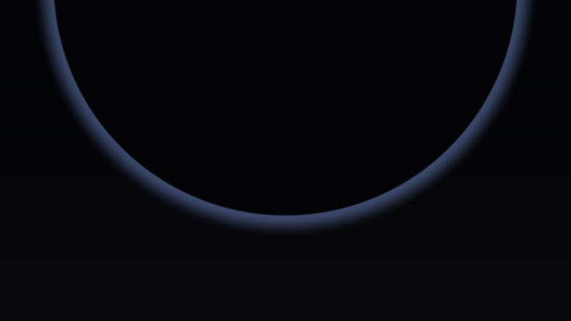

**Ergebnis:** Ein dunkler, fast schwarzer Kreis hängt im oberen Bilddrittel und ragt über beide Bildränder hinaus; um seine Unterkante steht ein kalter, blauer Lichtsaum. Noch ist nichts 3D – aber die Bildwirkung „etwas Riesiges steht über mir" ist schon da.

### Was passiert hier

Die UV-Formel ist der Standard-Opener (Ursprung Mitte, Division durch die Höhe → unverzerrt). Die eigentliche Designentscheidung sind **zwei Zahlen**: `zentrum.y = 0.55` und `r = 0.72`. Der sichtbare UV-Ausschnitt reicht vertikal von −0.5 bis +0.5 – ein Kreis mit Radius 0.72 um einen Punkt bei 0.55 schneidet also oben und seitlich aus dem Bild heraus und hängt mit seiner Unterkante (0.55 − 0.72 = −0.17) knapp unter der Bildmitte. **Größe entsteht im Kopf des Betrachters aus Beschnitt:** Ein Objekt, das vollständig ins Bild passt, ist ein Objekt; eines, das das Bild sprengt, ist eine Wand.

Der **Gegenlicht-Saum** ist die dark-Stimmung in ihrer billigsten Form: Die Silhouette ist dunkler als der Himmel, ihr Rand heller – das Auge liest sofort „Lichtquelle dahinter". Genau diese Lesart bauen wir in Schritt 7 dreidimensional nach.

### 💡 Warum eine 2D-Skizze vor dem Raymarching?

Weil die Komposition die *billigste* Eigenschaft des Bildes ist – und die wichtigste. Kreisgröße, Kreisposition, Himmelsfarben: vier Zahlen, sofortiges Feedback. Wenn diese Skizze nicht „kolossal" wirkt, wird es der teure Raymarcher auch nicht. Erst wenn das Ziel als Skizze steht, lohnt sich die Maschine dahinter. (Dieselbe Schule wie die Horizont-Konstante im Crystal-Lights-Tutorial: Zielvorgabe festlegen, solange sie noch eine einzige Zahl ist.)

### 🎨 Experimentieren

- `zentrum = vec2(0.0, 0.0)`, `r = 0.35` → der Moloch passt ins Bild und ist sofort nur noch ein Ball. Der beste Beweis für die Beschnitt-These
- `zentrum.x = 0.4` → asymmetrischer Anschnitt; wirkt „im Vorbeiflug"
- Saum-Farbe `vec3(0.30, 0.38, 0.55)` → `vec3(1.0, 0.55, 0.25)` → ein warmer Sonnenuntergangs-Saum: die brighter-Stimmung blitzt schon einmal auf

---

## Schritt 2 – Das Raymarch-Gerüst: die nackte Riesenkugel

**Neu:** `map`, Marsch mit Drossel, Normalen aus zentralen Differenzen – das klassische SDF-Gerüst (Details: Pyramid-Spiral-Tutorial, Schritte 3–5), aufgesetzt auf eine Kugel mit Radius 6.

```glsl
#define R(a) mat2(cos(a), sin(a), -sin(a), cos(a))

const float RADIUS = 6.0;    // Radius des Molochs

float map(vec3 p)
{
    return length(p) - RADIUS;   // vorerst: die nackte Riesenkugel
}

float march(vec3 ro, vec3 rd)
{
    float t = 0.0;
    for (int i = 0; i < 160; i++) {
        vec3 p = ro + rd * t;
        float d = map(p);
        if (d < 0.001 + 0.0008 * t) return t;   // Toleranz waechst mit der Ferne
        if (t > 40.0) break;
        t += d * 0.5;                            // Drossel - Begruendung: Schritt 5
    }
    return -1.0;
}

vec3 calcNormal(vec3 p)
{
    const vec2 e = vec2(0.004, 0.0);
    return normalize(vec3(map(p + e.xyy) - map(p - e.xyy),
                          map(p + e.yxy) - map(p - e.yxy),
                          map(p + e.yyx) - map(p - e.yyx)));
}

void mainImage(out vec4 fragColor, in vec2 fragCoord)
{
    vec2 uv = (fragCoord - 0.5 * iResolution.xy) / iResolution.y;

    vec3 ro = vec3(0.0, 0.0, 10.0);          // 10 Einheiten vor der Kugel
    vec3 rd = normalize(vec3(uv, -1.5));     // Blick in -z, Brennweite 1.5

    float t = march(ro, rd);

    vec3 col;
    if (t > 0.0) {
        vec3 n = calcNormal(ro + rd * t);
        float dif = max(dot(n, normalize(vec3(0.5, 0.7, 0.4))), 0.0);
        col = vec3(0.16, 0.17, 0.19) * (dif + 0.15);   // neutrales Werkstatt-Licht
    } else {
        col = mix(vec3(0.030, 0.028, 0.045), vec3(0.010, 0.012, 0.022),
                  clamp(rd.y * 1.5 + 0.5, 0.0, 1.0));
    }

    fragColor = vec4(col, 1.0);
}
```


**Ergebnis:** Eine große, matte, grau-blaue Kugel vor dem Nachthimmel aus Schritt 1 – neutral beleuchtet, unspektakulär, korrekt. Das Gerüst steht.

### Was passiert hier

Nichts, was das Pyramid-Spiral-Tutorial nicht ausführlich erklärt – deshalb nur die drei Zahlen, die *hier* anders gewählt sind:

1. **`RADIUS = 6.0` bei Kameraabstand 10:** Die Kugel belegt einen Sehwinkel von `2·asin(6/10) ≈ 74°` – schon jetzt mehr, als die Brennweite 1.5 vertikal zeigt (`2·atan(0.5/1.5) ≈ 37°`). Die Kugel sprengt das Bild, wie in der Skizze geplant. Diese Rechnung – **Objektwinkel gegen Bildwinkel** – ist das Werkzeug, mit dem wir in Schritt 3 die Größenwirkung gezielt einstellen.
2. **Drossel `0.5`:** Für die nackte Kugel wäre `t += d` korrekt und schneller – die SDF ist exakt. Wir drosseln trotzdem schon jetzt, weil die Verschneidungen ab Schritt 4 die SDF zu einer bloßen *Abschätzung* machen. Die Begründung folgt dort; die Konstante steht schon einmal richtig.
3. **Budget 160 Schritte / Abbruch bei 40:** Die Szene ist kompakt (Kamera kreist später zwischen 8.5 und 15 Einheiten, alles Sichtbare liegt unter ~25), aber die Drossel halbiert den Fortschritt – 160 Schritte sind die bequeme Reserve dafür.

🧠 **Merke:** `asin(Objektradius / Abstand)` gegen `atan(0.5 / Brennweite)` – zwei Einzeiler, die entscheiden, ob etwas „groß im Bild" oder „im Bild" ist. Größenwirkung ist Geometrie, kein Material.

### 🎨 Experimentieren

- `RADIUS = 1.0` → Murmel statt Moloch; alles Weitere im Tutorial funktioniert trotzdem (mit angepassten Zellgrößen), aber die Wirkung ist weg
- `t += d * 1.0` statt `0.5` → bei der nackten Kugel: kein Unterschied (exakte SDF). Diesen Test ab Schritt 4 wiederholen!
- Debug-Klassiker: `col = n * 0.5 + 0.5;` im Trefferfall → Normalen als Farbe

---

## Schritt 3 – Die Kamera winzig, der Moloch riesig

**Neu:** Eine Look-at-Kamera (Blickpunkt statt Blickrichtung), tief unten positioniert – der **Low-Angle** – und Weitwinkel. Größenwirkung wird von der Zufalls-Eigenschaft zur eingestellten Eigenschaft.

```glsl
#define R(a) mat2(cos(a), sin(a), -sin(a), cos(a))

const float RADIUS = 6.0;
const float NAH    = 8.5;    // Abstand der Kamera von der Achse des Molochs

float map(vec3 p)
{
    return length(p) - RADIUS;
}

float march(vec3 ro, vec3 rd)
{
    float t = 0.0;
    for (int i = 0; i < 160; i++) {
        vec3 p = ro + rd * t;
        float d = map(p);
        if (d < 0.001 + 0.0008 * t) return t;
        if (t > 40.0) break;
        t += d * 0.5;
    }
    return -1.0;
}

vec3 calcNormal(vec3 p)
{
    const vec2 e = vec2(0.004, 0.0);
    return normalize(vec3(map(p + e.xyy) - map(p - e.xyy),
                          map(p + e.yxy) - map(p - e.yxy),
                          map(p + e.yyx) - map(p - e.yyx)));
}

// NEU: Look-at-Kamera - Position tief unten, Blick hinauf zum Moloch
void kamera(vec2 uv, out vec3 ro, out vec3 rd)
{
    ro = vec3(0.0, -3.2, NAH);                 // tief unten: Low-Angle
    vec3 ta = vec3(0.0, 1.2, 0.0);             // Blickpunkt am oberen Rumpf

    vec3 fw = normalize(ta - ro);              // Blickrichtung
    vec3 rt = normalize(cross(vec3(0.0, 1.0, 0.0), fw));
    vec3 up = cross(fw, rt);

    rd = normalize(fw * 1.1 + rt * uv.x + up * uv.y);   // 1.1 = Weitwinkel
}

void mainImage(out vec4 fragColor, in vec2 fragCoord)
{
    vec2 uv = (fragCoord - 0.5 * iResolution.xy) / iResolution.y;

    vec3 ro, rd;
    kamera(uv, ro, rd);

    float t = march(ro, rd);

    vec3 col;
    if (t > 0.0) {
        vec3 n = calcNormal(ro + rd * t);
        float dif = max(dot(n, normalize(vec3(0.5, 0.7, 0.4))), 0.0);
        col = vec3(0.16, 0.17, 0.19) * (dif + 0.15);
    } else {
        col = mix(vec3(0.030, 0.028, 0.045), vec3(0.010, 0.012, 0.022),
                  clamp(rd.y * 1.5 + 0.5, 0.0, 1.0));
    }

    fragColor = vec4(col, 1.0);
}
```


**Ergebnis:** Der Blick kippt nach oben: Die Kugel wölbt sich als dunkle Masse über die Kamera, ihr Scheitel verschwindet oben aus dem Bild, unten bleibt ein Streifen dunstiger Himmel. Das ist die Froschperspektive vor einem Hochhaus – nur dass das Hochhaus rund ist.

### Was passiert hier

**Die Look-at-Konstruktion** (Blickpunkt `ta`, Basis aus `fw`/`rt`/`up` per Kreuzprodukt) ersetzt das manuelle Kippen mit `R(a)` aus dem Vorgänger-Tutorial – sobald sich in Schritt 13 Kameraposition *und* Blickpunkt unabhängig bewegen, ist sie die einzig wartbare Form. Die Konvention: `fw` zeigt zur Szene, `rt` entsteht aus Welt-Oben × `fw`, `up` schließt das Dreibein.

**Die drei Größen-Hebel**, jetzt beisammen und nachgerechnet:

1. **Abstand:** Kamera bei `(0, −3.2, 8.5)` → Distanz zum Zentrum `√(8.5² + 3.2²) ≈ 9.1`, zur Oberfläche also ~3.1. Sehwinkel der Kugel: `2·asin(6/9.1) ≈ 83°`.
2. **Brennweite 1.1** (Weitwinkel): Bildwinkel vertikal `2·atan(0.5/1.1) ≈ 49°`, horizontal (16:9) `2·atan(0.89/1.1) ≈ 78°`. Die Kugel ist in beiden Achsen größer als das Bild – Anschnitt garantiert.
3. **Low-Angle:** `ro.y = −3.2` bei Blickpunkt `ta.y = +1.2` kippt die Blickachse um ~29° nach oben. Der Himmel rutscht in den unteren Bildrand, die Masse hängt *über* uns – die Untersicht ist psychologisch der stärkste der drei Hebel: Was man von unten sieht, ist groß.

### 💡 Warum Weitwinkel für Größe – ist Tele nicht „näher dran"?

Tele vergrößert, aber es *verflacht*: Bei Brennweite 2.5 füllt die Kugel das Bild auch, wirkt aber wie eine flache Scheibe, weil die Perspektiv-Verzerrung fehlt. Weitwinkel aus der Nähe krümmt die Fluchtlinien – die Wölbung der Kugel *beschleunigt* zum Bildrand hin, und genau diese Beschleunigung liest das Auge als „ich stehe direkt davor". Größe ist nicht Füllgrad, sondern Perspektive.

### 🎨 Experimentieren

- `ro.y = +6.0`, `ta.y = 0.0` → Draufsicht: der Moloch wird zum Planeten unter uns. Auch schön – aber ein anderes Tutorial
- Brennweite `1.1` → `2.5` und den Verflachungs-Effekt selbst ansehen
- `NAH = 20.0` → Übersichts-Distanz: die ganze Kugel im Bild. Zwischen diesem Wert und 8.5 pendelt später der Orbit (Schritt 13)

---
## Schritt 4 – Greebles I: das Panel-Gitter (und smin/smax)

**Neu:** Die neue Technik dieses Tutorials – **weiche Boolesche Operatoren** (`smin`/`smax`) – und ihre erste Anwendung: Die Kugel wird mit einem kubischen Gitter verschnitten. Jede Gitterzelle bekommt ihren eigenen Radius-Versatz (große Platten), und entlang der Zellgrenzen werden **Fugen** aus der Oberfläche geschnitten.

```glsl
#define R(a) mat2(cos(a), sin(a), -sin(a), cos(a))

// ---- STELLSCHRAUBEN --------------------------------------------------------
const float RADIUS  = 6.0;    // Radius des Molochs
const float NAH     = 8.5;    // Kameraabstand von der Achse
const float ZELLE1  = 2.6;    // Kantenlaenge der grossen Platten
const float PLATTE  = 0.35;   // Hoehenspiel der Platten (+- die Haelfte)
const float FUGE    = 0.07;   // halbe Breite der Panelfugen
const float TIEFE   = 0.30;   // Fugen-Schale: so tief unter den NENN-Radius
const float GLAETTE = 0.05;   // Kanten-Weiche der smax-Fugen
// ----------------------------------------------------------------------------

// NEU: 3D-Hash - eine deterministische Zufallszahl je Gitterzelle
float hash31(vec3 p) { return fract(sin(dot(p, vec3(127.1, 311.7, 74.7))) * 43758.5453); }

// NEU: weiche Boolesche Operatoren (polynomiale Form)
float smin(float a, float b, float k)
{
    float h = max(k - abs(a - b), 0.0) / k;
    return min(a, b) - h * h * k * 0.25;
}
float smax(float a, float b, float k) { return -smin(-a, -b, k); }

// NEU: Abstand zur naechsten Gitterebene einer kubischen Zellteilung
float fugen(vec3 p, float zelle)
{
    vec3 q = abs(fract(p / zelle) - 0.5) * zelle;   // Abstand zur Zellmitte je Achse
    return zelle * 0.5 - max(q.x, max(q.y, q.z));   // -> Abstand zur Zellgrenze
}

// GEAENDERT: Kugel + Platten-Versatz + Fugen-Schnitt
float map(vec3 p)
{
    // Basis: die Riesenkugel
    float d = length(p) - RADIUS;

    // Oktave 1: grosse Platten - jede Wuerfelzelle hat ihren eigenen Radius
    vec3 z1 = floor(p / ZELLE1);
    d -= (hash31(z1) - 0.5) * PLATTE;

    // Fugen: Gitterebenen-Slab, begrenzt auf die aeussere Schale, abgezogen
    float slab   = fugen(p, ZELLE1) - FUGE;        // < 0 nahe einer Zellgrenze
    float schale = (RADIUS - TIEFE) - length(p);   // < 0 in der aeusseren Schale
    d = smax(d, -max(slab, schale), GLAETTE);      // Schnittvolumen ABZIEHEN

    return d;
}

float march(vec3 ro, vec3 rd)
{
    float t = 0.0;
    for (int i = 0; i < 160; i++) {
        vec3 p = ro + rd * t;
        float d = map(p);
        if (d < 0.001 + 0.0008 * t) return t;
        if (t > 40.0) break;
        t += d * 0.5;
    }
    return -1.0;
}

vec3 calcNormal(vec3 p)
{
    const vec2 e = vec2(0.004, 0.0);
    return normalize(vec3(map(p + e.xyy) - map(p - e.xyy),
                          map(p + e.yxy) - map(p - e.yxy),
                          map(p + e.yyx) - map(p - e.yyx)));
}

void kamera(vec2 uv, out vec3 ro, out vec3 rd)
{
    ro = vec3(0.0, -3.2, NAH);
    vec3 ta = vec3(0.0, 1.2, 0.0);

    vec3 fw = normalize(ta - ro);
    vec3 rt = normalize(cross(vec3(0.0, 1.0, 0.0), fw));
    vec3 up = cross(fw, rt);

    rd = normalize(fw * 1.1 + rt * uv.x + up * uv.y);
}

void mainImage(out vec4 fragColor, in vec2 fragCoord)
{
    vec2 uv = (fragCoord - 0.5 * iResolution.xy) / iResolution.y;

    vec3 ro, rd;
    kamera(uv, ro, rd);

    float t = march(ro, rd);

    vec3 col;
    if (t > 0.0) {
        vec3 n = calcNormal(ro + rd * t);
        float dif = max(dot(n, normalize(vec3(0.5, 0.7, 0.4))), 0.0);
        col = vec3(0.16, 0.17, 0.19) * (dif + 0.15);
    } else {
        col = mix(vec3(0.030, 0.028, 0.045), vec3(0.010, 0.012, 0.022),
                  clamp(rd.y * 1.5 + 0.5, 0.0, 1.0));
    }

    fragColor = vec4(col, 1.0);
}
```

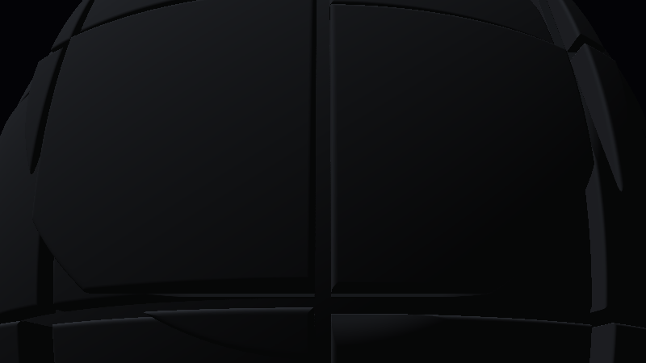

**Ergebnis:** Aus der glatten Kugel wird eine **gepanzerte**: Die Oberfläche zerfällt in unregelmäßig vorstehende und zurückweichende Rechteck-Platten, getrennt von sauber eingeschnittenen Fugen. Der Moloch hat seine erste Haut.

### Was passiert hier – drei Bausteine

**(1) Der Platten-Versatz** ist die 3D-Fassung der Voronoi-Platten aus dem Crystal-Lights-Tutorial (Schritt 6 dort): `floor(p / ZELLE1)` teilt den Raum in Würfelzellen, `hash31` gibt jeder Zelle eine feste Zahl, und die verschiebt den Kugelradius lokal um bis zu ±0.175. Die SDF wird dadurch an den Zellgrenzen **unstetig** – der gedrosselte Marsch setzt an den Sprungkanten einfach auf, die Differenzen-Normale macht daraus fast senkrechte Plattenkanten. Dass die Zellen *Würfel im Raum* sind (nicht Kacheln auf der Kugel), ist Absicht und Zitat zugleich: Der Warp-Shader des Presets arbeitet mit exakt so einem kubischen Gitter (`h1 = pow(2*abs(frac(zz))-1,3)`), und die leicht schiefe Art, wie die Würfelzellen die Kugelfläche schneiden, macht die Panele unregelmäßig – kein Panel gleicht dem anderen.

**(2) Die Fugen** sind eine echte **Boolesche Subtraktion** – und dafür braucht es erst das Schnittvolumen als eigene SDF: `fugen()` liefert den Abstand zur nächsten Gitterebene (exakt: pro Achsrichtung ist `zelle/2 − q` der Abstand zur Zellwand, das `max` über die Achsen wählt die nächste). `slab = fugen − FUGE` ist damit die SDF einer **verdickten Gitterebenen-Schar** (negativ = in der Fuge). Würden wir die direkt abziehen, schnitten die Ebenen als dünne Schlitze *durch die ganze Kugel hindurch*. Deshalb der zweite Term: `schale` ist negativ nur außerhalb der Kugel „Radius − TIEFE" – `max(slab, schale)` ist die **Verschneidung** beider (nur der Teil des Slabs, der in der äußeren Schale liegt), und erst dieses begrenzte Volumen wird abgezogen. Fugentiefe: kontrolliert.

**(3) `smax` statt `max`:** `max(d, -cut)` wäre die harte Subtraktion – korrekte Form, aber messerscharfe Kanten, die im Licht später als Aliasing-Säume flimmern. Die polynomiale `smin`/`smax`-Form (Inigo Quilez' Standard) rundet die Verschneidungskante im Radius `k = GLAETTE` – eine gefräste Fase statt eines Papierschnitts. `smax` ist dabei einfach das gespiegelte `smin`: `−smin(−a, −b, k)`.

⚠️ **SDF-Ehrlichkeit:** `max`/`smax`-Verschneidungen liefern nur noch eine **untere Schranke** der wahren Distanz (die Distanz zum Schnittkörper kann größer sein als das Maximum der Einzeldistanzen), und der Zellen-Versatz bricht die Lipschitz-Bedingung an den Sprüngen. Beides zusammen ist der Grund für die Drossel `0.5` – Schritt 5 rechnet das nach.

**Und eine Nebenrechnung, die man leicht übersieht:** `TIEFE = 0.30` ist auf den *Nenn*-Radius bezogen, die Platten stehen aber ±0.175 davor oder dahinter. Eine vorstehende Platte (Oberfläche bei 6.175) bekommt also ~0.48 tiefe Fugen, eine zurückgesetzte (5.825) nur ~0.13 – die Fugentiefe **variiert mit der Plattenhöhe**. Das ist kein Bug, sondern gratis Charakter: hohe Platten = tiefe Schatten. Wer es uniform will, setzt `TIEFE` deutlich über `PLATTE/2` hinaus (so wie hier) – bei `TIEFE < PLATTE/2` verlören die zurückgesetzten Platten ihre Fugen ganz.

### 🎨 Experimentieren

- `ZELLE1 = 1.2` → Kleinteilig-Nervöses; `4.5` → monumentale Bastionen
- `GLAETTE = 0.0` (hartes `max`) gegen `0.15` – die Fase ist einer der stärksten „teuer gefertigt"-Signale
- `FUGE = 0.02` → Haarfugen wie Fliesenspiegel; `0.18` → tiefe Wartungsgräben
- **Voronoi-Panelfugen** als Variante: die kubische Zellteilung durch die `voronoi()`-Funktion aus dem Crystal-Lights-Tutorial ersetzen (`floor(p/Z)` → Voronoi-Zell-Id, `fugen()` → Abstand zur Zellgrenze via zweitnächstem Punkt) → organisch gebrochene Panele wie Schildkrötenpanzer statt Raster

---

## Schritt 5 – Greebles II: Detail-Oktaven (Aufbauten und Rillen)

**Neu:** Zwei weitere Detail-Ebenen im selben Gitter-Idiom – mittlere **Aufbauten** (manche Zellen eines feineren Gitters stehen als Blöcke vor) und **feine Rillen** (das `h1`-Idiom des Warp-Shaders, wörtlich übersetzt, als Displacement). Dazu die überfällige Begründung der Marsch-Drossel.

```glsl
#define R(a) mat2(cos(a), sin(a), -sin(a), cos(a))

// ---- STELLSCHRAUBEN (erweitert) --------------------------------------------
const float RADIUS  = 6.0;
const float NAH     = 8.5;
const float ZELLE1  = 2.6;    // grosse Platten
const float ZELLE2  = 0.9;    // Raster der mittleren Aufbauten
const float ZELLE3  = 0.32;   // Raster der feinen Rillen
const float PLATTE  = 0.35;
const float AUFBAU  = 0.22;   // Hoehe der mittleren Aufbauten
const float FUGE    = 0.07;
const float TIEFE   = 0.30;
const float RILLE   = 0.02;   // Tiefe der feinen Rillen
const float GLAETTE = 0.05;
const float DROSSEL = 0.5;    // Marsch-Drossel (Displacement -> nur noch Bound!)
// ----------------------------------------------------------------------------

float hash31(vec3 p) { return fract(sin(dot(p, vec3(127.1, 311.7, 74.7))) * 43758.5453); }

float smin(float a, float b, float k)
{
    float h = max(k - abs(a - b), 0.0) / k;
    return min(a, b) - h * h * k * 0.25;
}
float smax(float a, float b, float k) { return -smin(-a, -b, k); }

float fugen(vec3 p, float zelle)
{
    vec3 q = abs(fract(p / zelle) - 0.5) * zelle;
    return zelle * 0.5 - max(q.x, max(q.y, q.z));
}

// GEAENDERT: drei Detail-Oktaven auf der Kugel
float map(vec3 p)
{
    float d = length(p) - RADIUS;

    // Oktave 1: grosse Platten
    vec3 z1 = floor(p / ZELLE1);
    d -= (hash31(z1) - 0.5) * PLATTE;

    // Fugen der grossen Platten
    float slab   = fugen(p, ZELLE1) - FUGE;
    float schale = (RADIUS - TIEFE) - length(p);
    d = smax(d, -max(slab, schale), GLAETTE);

    // Oktave 2: mittlere Aufbauten - manche Zellen stehen als Bloecke vor
    vec3 z2 = floor(p / ZELLE2);
    d -= step(0.72, hash31(z2 + 7.0)) * AUFBAU * (0.35 + 0.65 * hash31(z2 + 13.0));

    // Oktave 3: feine Rillen - das h1-Idiom des Warp-Shaders als Displacement
    vec3 h = pow(abs(2.0 * fract(p / ZELLE3) - 1.0), vec3(3.0));
    d += RILLE * (h.x + h.y + h.z) * 0.33;

    return d;
}

float march(vec3 ro, vec3 rd)
{
    float t = 0.0;
    for (int i = 0; i < 160; i++) {
        vec3 p = ro + rd * t;
        float d = map(p);
        if (d < 0.001 + 0.0008 * t) return t;
        if (t > 40.0) break;
        t += d * DROSSEL;
    }
    return -1.0;
}

vec3 calcNormal(vec3 p)
{
    const vec2 e = vec2(0.004, 0.0);
    return normalize(vec3(map(p + e.xyy) - map(p - e.xyy),
                          map(p + e.yxy) - map(p - e.yxy),
                          map(p + e.yyx) - map(p - e.yyx)));
}

void kamera(vec2 uv, out vec3 ro, out vec3 rd)
{
    ro = vec3(0.0, -3.2, NAH);
    vec3 ta = vec3(0.0, 1.2, 0.0);

    vec3 fw = normalize(ta - ro);
    vec3 rt = normalize(cross(vec3(0.0, 1.0, 0.0), fw));
    vec3 up = cross(fw, rt);

    rd = normalize(fw * 1.1 + rt * uv.x + up * uv.y);
}

void mainImage(out vec4 fragColor, in vec2 fragCoord)
{
    vec2 uv = (fragCoord - 0.5 * iResolution.xy) / iResolution.y;

    vec3 ro, rd;
    kamera(uv, ro, rd);

    float t = march(ro, rd);

    vec3 col;
    if (t > 0.0) {
        vec3 n = calcNormal(ro + rd * t);
        float dif = max(dot(n, normalize(vec3(0.5, 0.7, 0.4))), 0.0);
        col = vec3(0.16, 0.17, 0.19) * (dif + 0.15);
    } else {
        col = mix(vec3(0.030, 0.028, 0.045), vec3(0.010, 0.012, 0.022),
                  clamp(rd.y * 1.5 + 0.5, 0.0, 1.0));
    }

    fragColor = vec4(col, 1.0);
}
```

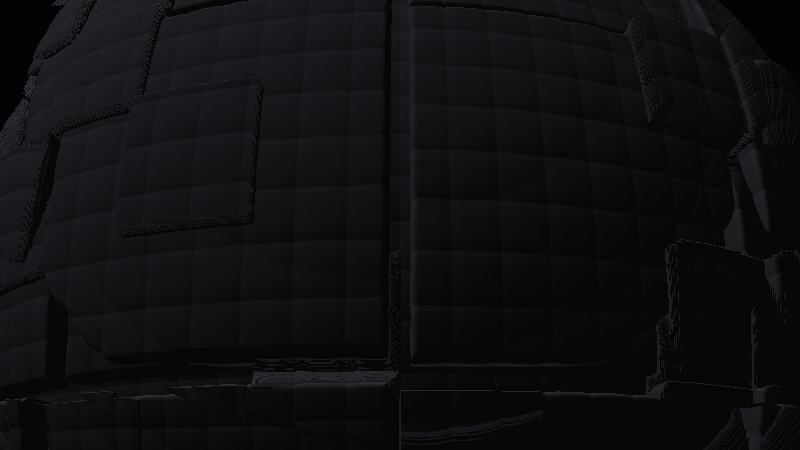

**Ergebnis:** Der Panzer bekommt Tiefe in drei Maßstäben: Auf den großen Platten sitzen kleinere, unregelmäßig verteilte Blöcke, und die ganze Oberfläche ist von einem feinen Rillenraster überzogen, das erst im Streiflicht (ab Schritt 8) richtig aufleben wird. Das klassische **Greeble**-Rezept: Detail dort, wo das Auge nach Maßstab sucht.

### Was passiert hier

**Oktave 2** wiederholt das Platten-Rezept eine Stufe feiner, aber mit `step(0.72, hash)`: Nur ~28 % der Zellen bekommen überhaupt einen Aufbau, und wer einen bekommt, würfelt sich (zweiter Hash, andere Konstante) eine eigene Höhe. Das bricht die Gleichförmigkeit – Flächen *und* Blöcke, nicht Noppenfolie.

**Oktave 3** ist das wörtlichste Preset-Zitat des Tutorials: `pow(abs(2*fract(x)−1), 3)` ist – bis auf die Schreibweise – exakt das `h1 = pow(2*abs(frac(zz))-1,3)` aus dem Warp-Shader. Die Funktion ist eine Dreieckswelle über dem Gitter, deren dritte Potenz die Mitte plattdrückt und nur nahe der Zellgrenzen aufsteilt: **flache Panele mit schmalen Kerben dazwischen.** Das Preset verbiegt damit UV-Koordinaten (2D-Verzerrung), wir verbiegen den *Abstand* (3D-Relief) – dasselbe Idiom, andere Dimension. `d += RILLE·…` schiebt die Oberfläche nahe der feinen Zellgrenzen um bis zu 2 cm (in Welteinheiten: 0.02) nach innen.

### 💡 Warum die Drossel? Die Rechnung.

Ein Raymarcher darf pro Schritt so weit gehen, wie die SDF Distanz *garantiert*. Unsere `map` garantiert nichts mehr, aus drei Gründen:

1. **Verschneidungen** (`smax`) liefern nur eine untere Schranke – das ist harmlos (zu kleine Schritte sind nur langsam, nie falsch).
2. **Zellen-Versätze** (Oktave 1 + 2) springen an den Zellgrenzen um bis zu `PLATTE/2 + AUFBAU ≈ 0.4`. Ein Strahl, der flach auf eine Plattenkante zuläuft, kann die Distanz um diesen Betrag **überschätzen** – er würde mit vollen Schritten *durch die Kante hindurchtreten*.
3. **Displacement** (Oktave 3) macht den Gradienten der SDF größer als 1: Die Ableitung von `RILLE·pow(…,3)` erreicht `3 · RILLE · 2/ZELLE3 ≈ 0.4` zusätzlich zum Kugel-Gradienten 1 – die wahre Distanz kann also nur ~`1/1.4 ≈ 0.7` des gemeldeten Werts betragen.

`DROSSEL = 0.5` unterbietet die 0.7 mit Reserve und fängt zugleich die Kanten-Überschreitungen aus (2) in der Praxis ab (die Sprünge sind klein gegen die Zellgröße). Der Preis: doppelt so viele Schritte – dafür stehen die 160 im Budget. **Der Test aus Schritt 2 lohnt jetzt wirklich:** `DROSSEL = 1.0` setzen und zusehen, wie Plattenkanten Löcher und Glitzer-Pixel bekommen.

🧠 **Merke:** Verschneidung, Versatz, Displacement – alle drei machen aus der Distanz eine bloße Schätzung, jede auf ihre Art. Die Drossel ist der eine Regler, der alle drei Sünden gleichzeitig verzeiht: Tempo gegen Sicherheit.

### 🎨 Experimentieren

- `col = vec3(float(i) / 160.0);` (dazu `i` aus der Schleife herausreichen) → wo das Schritt-Budget draufgeht: an den Plattenkanten und der Silhouette
- `AUFBAU = 0.5`, Schwelle `0.72` → `0.9` → wenige, monumentale Türme statt vieler Blöcke
- `RILLE = 0.06` → die Rillen werden zur dominanten Textur (und die Drossel-Rechnung oben kippt – nachrechnen und `DROSSEL` senken!)
- Vierte Oktave probieren: `ZELLE4 = 0.11`, `d += 0.006 * …` – ab wann sieht man nur noch Rauschen? (Antwort: sobald die Zellgröße unter die Pixelgröße am Objekt fällt – dann aliasing-bedingt wieder rausnehmen)

---

## Schritt 6 – Die schiefe Achse: der Moloch dreht sich

**Neu:** Die Struktur rotiert träge um eine **gekippte** Achse – als Transformation der `map`-Eingabe (Objekt- statt Weltkoordinaten).

```glsl
#define R(a) mat2(cos(a), sin(a), -sin(a), cos(a))

// ---- STELLSCHRAUBEN --------------------------------------------------------
const float RADIUS  = 6.0;
const float NAH     = 8.5;
const float ZELLE1  = 2.6;
const float ZELLE2  = 0.9;
const float ZELLE3  = 0.32;
const float PLATTE  = 0.35;
const float AUFBAU  = 0.22;
const float FUGE    = 0.07;
const float TIEFE   = 0.30;
const float RILLE   = 0.02;
const float GLAETTE = 0.05;
const float DROSSEL = 0.5;
// ----------------------------------------------------------------------------

float hash31(vec3 p) { return fract(sin(dot(p, vec3(127.1, 311.7, 74.7))) * 43758.5453); }

float smin(float a, float b, float k)
{
    float h = max(k - abs(a - b), 0.0) / k;
    return min(a, b) - h * h * k * 0.25;
}
float smax(float a, float b, float k) { return -smin(-a, -b, k); }

// NEU: traege Drehung um eine schiefe Achse (Objekt-Koordinaten)
vec3 gedreht(vec3 p)
{
    p.yz *= R(0.42);              // Achse kippen (~24 Grad aus der Senkrechten)
    p.xz *= R(iTime * 0.02);      // traege Eigendrehung um die gekippte Achse
    return p;
}

float fugen(vec3 p, float zelle)
{
    vec3 q = abs(fract(p / zelle) - 0.5) * zelle;
    return zelle * 0.5 - max(q.x, max(q.y, q.z));
}

// GEAENDERT: map arbeitet auf den gedrehten Koordinaten
float map(vec3 p)
{
    vec3 q = gedreht(p);

    float d = length(q) - RADIUS;

    vec3 z1 = floor(q / ZELLE1);
    d -= (hash31(z1) - 0.5) * PLATTE;

    float slab   = fugen(q, ZELLE1) - FUGE;
    float schale = (RADIUS - TIEFE) - length(q);
    d = smax(d, -max(slab, schale), GLAETTE);

    vec3 z2 = floor(q / ZELLE2);
    d -= step(0.72, hash31(z2 + 7.0)) * AUFBAU * (0.35 + 0.65 * hash31(z2 + 13.0));

    vec3 h = pow(abs(2.0 * fract(q / ZELLE3) - 1.0), vec3(3.0));
    d += RILLE * (h.x + h.y + h.z) * 0.33;

    return d;
}

float march(vec3 ro, vec3 rd)
{
    float t = 0.0;
    for (int i = 0; i < 160; i++) {
        vec3 p = ro + rd * t;
        float d = map(p);
        if (d < 0.001 + 0.0008 * t) return t;
        if (t > 40.0) break;
        t += d * DROSSEL;
    }
    return -1.0;
}

vec3 calcNormal(vec3 p)
{
    const vec2 e = vec2(0.004, 0.0);
    return normalize(vec3(map(p + e.xyy) - map(p - e.xyy),
                          map(p + e.yxy) - map(p - e.yxy),
                          map(p + e.yyx) - map(p - e.yyx)));
}

void kamera(vec2 uv, out vec3 ro, out vec3 rd)
{
    ro = vec3(0.0, -3.2, NAH);
    vec3 ta = vec3(0.0, 1.2, 0.0);

    vec3 fw = normalize(ta - ro);
    vec3 rt = normalize(cross(vec3(0.0, 1.0, 0.0), fw));
    vec3 up = cross(fw, rt);

    rd = normalize(fw * 1.1 + rt * uv.x + up * uv.y);
}

void mainImage(out vec4 fragColor, in vec2 fragCoord)
{
    vec2 uv = (fragCoord - 0.5 * iResolution.xy) / iResolution.y;

    vec3 ro, rd;
    kamera(uv, ro, rd);

    float t = march(ro, rd);

    vec3 col;
    if (t > 0.0) {
        vec3 n = calcNormal(ro + rd * t);
        float dif = max(dot(n, normalize(vec3(0.5, 0.7, 0.4))), 0.0);
        col = vec3(0.16, 0.17, 0.19) * (dif + 0.15);
    } else {
        col = mix(vec3(0.030, 0.028, 0.045), vec3(0.010, 0.012, 0.022),
                  clamp(rd.y * 1.5 + 0.5, 0.0, 1.0));
    }

    fragColor = vec4(col, 1.0);
}
```

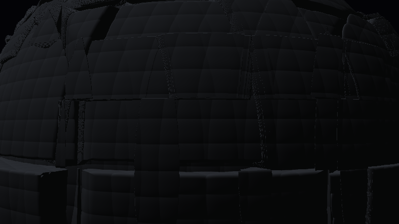

**Ergebnis:** Die Panele wandern in Zeitlupe schräg durchs Bild – der Koloss dreht sich, aber nicht brav um die Senkrechte, sondern leicht gekippt, wie ein taumelnder Planet. Bei `0.02` rad/s dauert eine volle Umdrehung über fünf Minuten: Man *sieht* keine Drehung, man bemerkt nach einer Weile, dass alles anders liegt. Genau richtig für einen Moloch.

### Was passiert hier

**Wir drehen nicht das Objekt, sondern die Frage.** `map(p)` beantwortet „wie weit ist es von `p` zur Oberfläche?" – wenn wir `p` erst durch die *inverse* Objektdrehung schicken, beantwortet dieselbe ungedrehte SDF die Frage für das gedrehte Objekt. Da die Drehung hier nur aus zwei `R(a)`-Anwendungen besteht, ist die Inverse schlicht „dieselben Drehungen" (das Vorzeichen steckt in der Drehrichtung, die uns egal sein darf). Die Reihenfolge macht die Achse schief: **erst kippen** (`yz`), **dann um y drehen** (`xz`) – aus Sicht der Welt rotiert das Objekt damit um eine um 24° geneigte Achse.

Rotationen sind längentreu – die SDF-Garantien (so weit sie nach Schritt 5 noch bestehen) bleiben unangetastet. Und alles, was auf Objektkoordinaten lebt (Zellen, Hashes – später die Positionslichter in Schritt 10), **dreht automatisch mit**: `gedreht(p)` ist ab jetzt die Adresse für „auf der Struktur festgetackert".

*Preset-Bezug:* Das Vorbild rotiert an dieser Stelle keine Geometrie, sondern **Farben** – die `rotmat`-3×3-Matrix aus `q20`–`q28` ist eine aus drei audio-gesteuerten Winkeln aufgebaute Rotationsmatrix im RGB-Raum. Der Aufbau (drei verkettete Einzeldrehungen, hier als zwei `R(a)`-Anwendungen statt einer ausgeschriebenen `mat3`) ist derselbe; wer die ausgeschriebene Form sehen will, findet sie in `per_frame_53`–`per_frame_55` des Presets. Die Farb-Variante greifen wir als 🎨-Idee in Schritt 14 wieder auf.

### 🎨 Experimentieren

- Kippwinkel `0.42` → `0.0` (brave Senkrechte – sofort langweiliger) bzw. `1.2` (fast liegend, wie ein rollender Asteroid)
- Tempo `0.02` → `0.15`: die Drehung wird sichtbar – und der Moloch verliert sofort an gefühlter Masse. Träge = schwer
- Taumeln statt Drehen: `p.yz *= R(0.42 + 0.06 * sin(iTime * 0.011));` → die Achse selbst pendelt in Superzeitlupe

---
## Schritt 7 – Licht-Setup DARK: Gegenlicht und Silhouette

**Neu:** Das erste der beiden Licht-Setups, komplett und pur: eine schwache, kalte Sonne **hinter** dem Moloch, ein Silhouetten-Saum (Rim), fast schwarzes Füll-Licht. Die Sonne hängt an der Kamera, damit die Stimmung später den Orbit überlebt.

```glsl
#define R(a) mat2(cos(a), sin(a), -sin(a), cos(a))

// ---- STELLSCHRAUBEN --------------------------------------------------------
const float RADIUS  = 6.0;
const float NAH     = 8.5;
const float ZELLE1  = 2.6;
const float ZELLE2  = 0.9;
const float ZELLE3  = 0.32;
const float PLATTE  = 0.35;
const float AUFBAU  = 0.22;
const float FUGE    = 0.07;
const float TIEFE   = 0.30;
const float RILLE   = 0.02;
const float GLAETTE = 0.05;
const float DROSSEL = 0.5;
// ----------------------------------------------------------------------------

// NEU: globale Sonnenrichtung - wird je Frame in kamera() gesetzt
vec3 gSonne = vec3(0.0, 0.3, 1.0);

float hash31(vec3 p) { return fract(sin(dot(p, vec3(127.1, 311.7, 74.7))) * 43758.5453); }

float smin(float a, float b, float k)
{
    float h = max(k - abs(a - b), 0.0) / k;
    return min(a, b) - h * h * k * 0.25;
}
float smax(float a, float b, float k) { return -smin(-a, -b, k); }

vec3 gedreht(vec3 p)
{
    p.yz *= R(0.42);
    p.xz *= R(iTime * 0.02);
    return p;
}

float fugen(vec3 p, float zelle)
{
    vec3 q = abs(fract(p / zelle) - 0.5) * zelle;
    return zelle * 0.5 - max(q.x, max(q.y, q.z));
}

float map(vec3 p)
{
    vec3 q = gedreht(p);

    float d = length(q) - RADIUS;

    vec3 z1 = floor(q / ZELLE1);
    d -= (hash31(z1) - 0.5) * PLATTE;

    float slab   = fugen(q, ZELLE1) - FUGE;
    float schale = (RADIUS - TIEFE) - length(q);
    d = smax(d, -max(slab, schale), GLAETTE);

    vec3 z2 = floor(q / ZELLE2);
    d -= step(0.72, hash31(z2 + 7.0)) * AUFBAU * (0.35 + 0.65 * hash31(z2 + 13.0));

    vec3 h = pow(abs(2.0 * fract(q / ZELLE3) - 1.0), vec3(3.0));
    d += RILLE * (h.x + h.y + h.z) * 0.33;

    return d;
}

float march(vec3 ro, vec3 rd)
{
    float t = 0.0;
    for (int i = 0; i < 160; i++) {
        vec3 p = ro + rd * t;
        float d = map(p);
        if (d < 0.001 + 0.0008 * t) return t;
        if (t > 40.0) break;
        t += d * DROSSEL;
    }
    return -1.0;
}

vec3 calcNormal(vec3 p)
{
    const vec2 e = vec2(0.004, 0.0);
    return normalize(vec3(map(p + e.xyy) - map(p - e.xyy),
                          map(p + e.yxy) - map(p - e.yxy),
                          map(p + e.yyx) - map(p - e.yyx)));
}

// GEAENDERT: kamera() setzt die Sonne relativ zur Blickrichtung
void kamera(vec2 uv, out vec3 ro, out vec3 rd)
{
    ro = vec3(0.0, -3.2, NAH);
    vec3 ta = vec3(0.0, 1.2, 0.0);

    vec3 fw = normalize(ta - ro);
    vec3 rt = normalize(cross(vec3(0.0, 1.0, 0.0), fw));
    vec3 up = cross(fw, rt);

    rd = normalize(fw * 1.1 + rt * uv.x + up * uv.y);

    // dark: GEGENLICHT - die Sonne steht in Blickrichtung HINTER dem Moloch
    gSonne = normalize(fw + vec3(0.0, 0.35, 0.0));
}

// NEU: Himmel mit Sonnen-Hof (ersetzt den bisherigen Verlauf in mainImage)
vec3 himmel(vec3 rd)
{
    vec3 col = mix(vec3(0.030, 0.028, 0.045), vec3(0.010, 0.012, 0.022),
                   clamp(rd.y * 1.5 + 0.5, 0.0, 1.0));

    // ein schwacher, kalter Hof um die (verdeckte) Sonne
    float s = max(dot(rd, gSonne), 0.0);
    col += pow(s, 6.0) * vec3(0.10, 0.13, 0.22);

    return col;
}

// NEU: das dark-Material (ersetzt das Werkstatt-Licht in mainImage)
vec3 shade(vec3 p, vec3 rd, float t)
{
    vec3 n = calcNormal(p);

    vec3 sonnenFarbe = vec3(0.30, 0.38, 0.55);     // kaltes, schwaches Gegenlicht
    vec3 himmelLicht = vec3(0.020, 0.025, 0.045);  // fast nichts von oben

    vec3 albedo = vec3(0.16, 0.17, 0.19);          // dunkles, mattes Metall

    float dif = max(dot(n, gSonne), 0.0);
    float amb = 0.5 + 0.5 * n.y;

    vec3 col = albedo * (dif * sonnenFarbe * 0.6 + amb * himmelLicht);

    // der Silhouetten-Saum: traegt die dark-Stimmung fast allein
    float rim = pow(1.0 - max(dot(n, -rd), 0.0), 3.0);
    col += rim * sonnenFarbe * 0.55;

    return col;
}

void mainImage(out vec4 fragColor, in vec2 fragCoord)
{
    vec2 uv = (fragCoord - 0.5 * iResolution.xy) / iResolution.y;

    vec3 ro, rd;
    kamera(uv, ro, rd);

    float t = march(ro, rd);

    vec3 col;
    if (t > 0.0) col = shade(ro + rd * t, rd, t);
    else         col = himmel(rd);

    fragColor = vec4(col, 1.0);
}
```

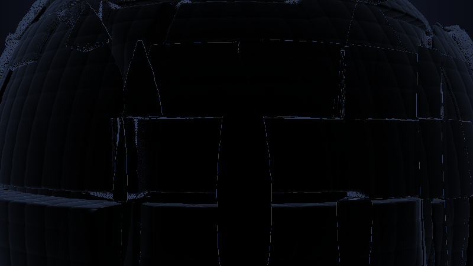

**Ergebnis:** Der Moloch kippt ins Bedrohliche: eine fast schwarze Masse, deren Panel-Struktur nur noch zu *ahnen* ist, umrandet von einem kalten, blauen Lichtsaum – und hinter ihr, dort wo er den Himmel freigibt, glimmt der Hof der verdeckten Sonne. Die Skizze aus Schritt 1, jetzt echt.

### Was passiert hier

**Gegenlicht heißt: `gSonne ≈ fw`.** Die Richtung *zur* Sonne zeigt (fast) in Blickrichtung – die Sonne steht also von der Kamera aus gesehen hinter der Szene. Für die Flächen, die uns zugewandt sind, ist `dot(n, gSonne)` dann meist negativ → kein Diffuslicht → Silhouette. Licht bekommen nur die *Kanten*, deren Normalen von uns weg kippen – und genau die fängt der **Rim-Term** ein: `pow(1 − dot(n, −rd), 3)` ist maximal, wo die Oberfläche im streifenden Winkel steht. Rim + Gegenlicht sind physikalisch dasselbe Ereignis, aus zwei Formeln: Der Rim ist unser billiger Ersatz für die teure Lichtstreuung an der Kante.

**Warum hängt die Sonne an der Kamera?** Stünde sie fest in der Welt, wäre das Gegenlicht nach einer halben Orbit-Runde (Schritt 13) ein Frontlicht – die Stimmung würde vom Kamerastand abhängen. Dramaturgisch soll aber *dark* immer dark aussehen. `gSonne = normalize(fw + …)` koppelt das Licht an die Blickrichtung: Die Sonne wandert mit und bleibt hinter dem Moloch, egal wo die Kamera steht. Das ist physikalisch unehrlich und filmisch völlig üblich (jede Filmcrew fährt ihre Lampen mit der Kamera mit).

**Die Zahlen sind bewusst leise:** `himmelLicht` bei 2–4 % Grau, Diffus-Faktor 0.6 auf einer ohnehin schwachen Sonnenfarbe. Dark lebt davon, dass *fast nichts* leuchtet – die Positionslichter (Schritt 10) und God-Rays (Schritt 11) brauchen diese Dunkelheit als Bühne. Wer jetzt „zu dunkel!" denkt: genau richtig; das Tonemapping in Schritt 14 holt noch etwas heraus, und die Stellschraube heißt am Ende `STIMMUNG`.

### 🎨 Experimentieren

- Rim-Exponent `3.0` → `8.0`: der Saum wird zur Haarlinie – noch grafischer, fast Scherenschnitt
- `gSonne = normalize(fw + vec3(0.0, -0.3, 0.0));` → Unterlicht statt Überlicht: sofort Horrorfilm
- `sonnenFarbe = vec3(0.55, 0.15, 0.10)` → rotes Gegenlicht: der Moloch vor einem sterbenden Stern

---

## Schritt 8 – Licht-Setup BRIGHTER: warmes Streiflicht

**Neu:** Das zweite Setup, ebenfalls komplett: eine warme Sonne **seitlich** der Blickrichtung (Streiflicht), sichtbares Füll-Licht, Glanzlichter – die Panel-Struktur aus den Schritten 4–5 bekommt endlich ihren Auftritt. Es ändern sich gegenüber Schritt 7 nur die `gSonne`-Zeile, `himmel()` und `shade()` – der Vollständigkeit halber (und weil die beiden Setups nebeneinander die halbe Lektion sind) hier trotzdem noch einmal das ganze Listing.

```glsl
#define R(a) mat2(cos(a), sin(a), -sin(a), cos(a))

// ---- STELLSCHRAUBEN --------------------------------------------------------
const float RADIUS  = 6.0;
const float NAH     = 8.5;
const float ZELLE1  = 2.6;
const float ZELLE2  = 0.9;
const float ZELLE3  = 0.32;
const float PLATTE  = 0.35;
const float AUFBAU  = 0.22;
const float FUGE    = 0.07;
const float TIEFE   = 0.30;
const float RILLE   = 0.02;
const float GLAETTE = 0.05;
const float DROSSEL = 0.5;
// ----------------------------------------------------------------------------

vec3 gSonne = vec3(0.0, 0.3, 1.0);

float hash31(vec3 p) { return fract(sin(dot(p, vec3(127.1, 311.7, 74.7))) * 43758.5453); }

float smin(float a, float b, float k)
{
    float h = max(k - abs(a - b), 0.0) / k;
    return min(a, b) - h * h * k * 0.25;
}
float smax(float a, float b, float k) { return -smin(-a, -b, k); }

vec3 gedreht(vec3 p)
{
    p.yz *= R(0.42);
    p.xz *= R(iTime * 0.02);
    return p;
}

float fugen(vec3 p, float zelle)
{
    vec3 q = abs(fract(p / zelle) - 0.5) * zelle;
    return zelle * 0.5 - max(q.x, max(q.y, q.z));
}

float map(vec3 p)
{
    vec3 q = gedreht(p);

    float d = length(q) - RADIUS;

    vec3 z1 = floor(q / ZELLE1);
    d -= (hash31(z1) - 0.5) * PLATTE;

    float slab   = fugen(q, ZELLE1) - FUGE;
    float schale = (RADIUS - TIEFE) - length(q);
    d = smax(d, -max(slab, schale), GLAETTE);

    vec3 z2 = floor(q / ZELLE2);
    d -= step(0.72, hash31(z2 + 7.0)) * AUFBAU * (0.35 + 0.65 * hash31(z2 + 13.0));

    vec3 h = pow(abs(2.0 * fract(q / ZELLE3) - 1.0), vec3(3.0));
    d += RILLE * (h.x + h.y + h.z) * 0.33;

    return d;
}

float march(vec3 ro, vec3 rd)
{
    float t = 0.0;
    for (int i = 0; i < 160; i++) {
        vec3 p = ro + rd * t;
        float d = map(p);
        if (d < 0.001 + 0.0008 * t) return t;
        if (t > 40.0) break;
        t += d * DROSSEL;
    }
    return -1.0;
}

vec3 calcNormal(vec3 p)
{
    const vec2 e = vec2(0.004, 0.0);
    return normalize(vec3(map(p + e.xyy) - map(p - e.xyy),
                          map(p + e.yxy) - map(p - e.yxy),
                          map(p + e.yyx) - map(p - e.yyx)));
}

// GEAENDERT: brighter - STREIFLICHT von rechts oben, quer zum Blick
void kamera(vec2 uv, out vec3 ro, out vec3 rd)
{
    ro = vec3(0.0, -3.2, NAH);
    vec3 ta = vec3(0.0, 1.2, 0.0);

    vec3 fw = normalize(ta - ro);
    vec3 rt = normalize(cross(vec3(0.0, 1.0, 0.0), fw));
    vec3 up = cross(fw, rt);

    rd = normalize(fw * 1.1 + rt * uv.x + up * uv.y);

    gSonne = normalize(rt * 1.3 + vec3(0.0, 0.55, 0.0) - fw * 0.10);
}

// GEAENDERT: hellerer, waermerer Himmel + kraeftiger Sonnen-Hof
vec3 himmel(vec3 rd)
{
    vec3 col = mix(vec3(0.24, 0.20, 0.18), vec3(0.10, 0.13, 0.20),
                   clamp(rd.y * 1.5 + 0.5, 0.0, 1.0));

    float s = max(dot(rd, gSonne), 0.0);
    col += pow(s, 6.0) * vec3(0.50, 0.38, 0.22);

    return col;
}

// GEAENDERT: das brighter-Material
vec3 shade(vec3 p, vec3 rd, float t)
{
    vec3 n = calcNormal(p);

    vec3 sonnenFarbe = vec3(1.05, 0.80, 0.55);   // warmes, kraeftiges Streiflicht
    vec3 himmelLicht = vec3(0.10, 0.12, 0.16);   // kuehles Fuell-Licht von oben

    vec3 albedo = vec3(0.16, 0.17, 0.19);

    float dif = max(dot(n, gSonne), 0.0);
    float amb = 0.5 + 0.5 * n.y;

    vec3 col = albedo * (dif * sonnenFarbe * 1.0 + amb * himmelLicht);

    // Rim bleibt, aber leise - nur noch Kantentrenner, kein Hauptdarsteller
    float rim = pow(1.0 - max(dot(n, -rd), 0.0), 3.0);
    col += rim * sonnenFarbe * 0.22;

    // NEU: Glanzlicht - die Rillen und Fasen antworten der Sonne
    float spe = pow(max(dot(reflect(rd, n), gSonne), 0.0), 24.0);
    col += spe * sonnenFarbe * 0.30;

    return col;
}

void mainImage(out vec4 fragColor, in vec2 fragCoord)
{
    vec2 uv = (fragCoord - 0.5 * iResolution.xy) / iResolution.y;

    vec3 ro, rd;
    kamera(uv, ro, rd);

    float t = march(ro, rd);

    vec3 col;
    if (t > 0.0) col = shade(ro + rd * t, rd, t);
    else         col = himmel(rd);

    fragColor = vec4(col, 1.0);
}
```

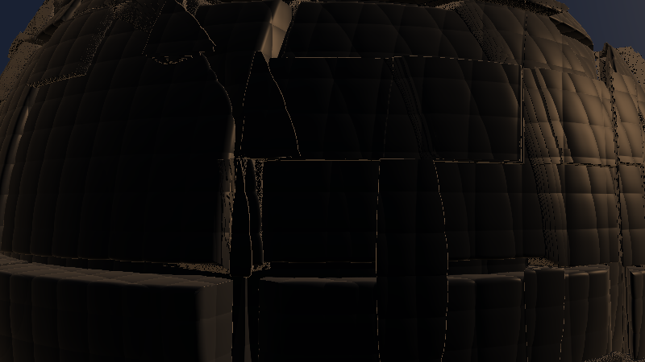

**Ergebnis:** Derselbe Koloss, ein anderes Wesen: Das Streiflicht schiebt lange Schatten über die Platten, jede Fuge und jeder Aufbau zeichnet sich ab, die feinen Rillen aus Schritt 5 werden als Mikro-Schraffur sichtbar, und auf den Fasen sitzen warme Glanzpunkte. Aus der Bedrohung wird eine Maschine, die man *ansehen* soll.

### Was passiert hier

**Streiflicht ist der Struktur-Verstärker.** Licht quer zur Blickrichtung (`gSonne ≈ rt`) bedeutet: Der Beleuchtungswinkel ändert sich schnell mit der Oberflächenneigung – kleine Reliefs werfen im Verhältnis riesige Helligkeitsunterschiede. Frontlicht (`gSonne ≈ −fw`) würde dieselbe Geometrie *plätten* (alle sichtbaren Flächen ähnlich hell). Deshalb ist die Sonnenrichtung – nicht die Intensität! – der eigentliche Unterschied zwischen den beiden Setups: **dark versteckt die Struktur (Licht längs), brighter zeigt sie (Licht quer).**

**Das Glanzlicht** (`reflect` + Potenz 24, klassisches Phong) gehört dramaturgisch zu brighter: Es erzählt „hartes Material, gefertigte Kanten". In Schritt 9 lassen wir es im dark-Setup nicht ganz verschwinden, sondern nur auf ein Restglimmen fallen – tote Materialien gibt es auch im Dunkeln nicht.

**Die zwei Setups nebeneinander lesen:** Es sind exakt dieselben Formeln – verschieden sind nur `gSonne`-Richtung, drei Farben und drei Skalare. Das ist kein Zufall, sondern die Vorbereitung von Schritt 9: Was sich nur in Konstanten unterscheidet, lässt sich blenden.

### 💡 Warum zwei komplette Setups bauen statt gleich einen Regler?

Weil man eine Überblendung nur beurteilen kann, wenn beide *Enden* für sich stimmen. Ein Regler zwischen zwei mittelmäßigen Stimmungen liefert hundert mittelmäßige Stimmungen. Erst jedes Setup einzeln auf den Punkt bringen (mit hartem Austausch der Konstanten, wie hier), dann verbinden – das ist die „eine Fehlerquelle zur Zeit"-Regel, auf Lichtdesign übertragen. Und es ist exakt die Situation des Preset-Paars: *brighter* und *2 dark* sind zwei getrennte, jeweils fertig abgestimmte Dateien – unser Schritt 9 baut den Übergang, den die Presets nicht haben.

### 🎨 Experimentieren

- `gSonne`-Richtung um die Kamera wandern lassen: `rt * 1.3` → `-rt * 1.3` (Licht von links), `fw * -1.0 + up` (Frontlicht – und zusehen, wie die Struktur stirbt)
- `spe`-Exponent `24.0` → `200.0`: Lackglanz statt Metallschimmer
- `himmelLicht = vec3(0.16, 0.10, 0.06)` → warmes Füll-Licht: „goldene Stunde" statt Vormittag

---

## Schritt 9 – Die STIMMUNGs-Blende: EIN Shader, ZWEI Licht-Welten

**Neu:** Die Kern-Stellschraube des Shaders. `STIMMUNG` (0 = dark, 1 = brighter) blendet **alle** Unterschiede der beiden Setups gleichzeitig – Sonnenrichtung, Farben, Gewichte, Himmel. Dazu die Laufzeit-Kopie `gStimmung`, an der später das Audio ziehen darf.

*Ab jetzt zeigen die Schritte nur noch die geänderten bzw. neuen Funktionen – alles andere bleibt wörtlich wie im vorherigen Schritt stehen. (Zwei Sammelpunkte gibt es: den Zwischenstand am Ende von Schritt 10 und das Gesamtlisting in Schritt 14.)*

```glsl
// ---- STELLSCHRAUBEN (erweitert) --------------------------------------------
const float STIMMUNG = 0.0;   // 0.0 = dark .. 1.0 = brighter  (DIE Stellschraube)
// ----------------------------------------------------------------------------

// NEU: Laufzeit-Kopie der Stimmung - Anhang A laesst sie mit der Musik driften
float gStimmung = STIMMUNG;

// GEAENDERT (kamera): die Sonnenrichtung blendet zwischen Gegen- und Streiflicht
    gSonne = normalize(mix(fw + vec3(0.0, 0.35, 0.0),
                           rt * 1.3 + vec3(0.0, 0.55, 0.0) - fw * 0.10,
                           gStimmung));

// GEAENDERT: der Himmel als Blende beider Setups
vec3 himmel(vec3 rd)
{
    vec3 oben  = mix(vec3(0.010, 0.012, 0.022), vec3(0.10, 0.13, 0.20), gStimmung);
    vec3 unten = mix(vec3(0.030, 0.028, 0.045), vec3(0.24, 0.20, 0.18), gStimmung);
    vec3 col = mix(unten, oben, clamp(rd.y * 1.5 + 0.5, 0.0, 1.0));

    float s = max(dot(rd, gSonne), 0.0);
    vec3 hofFarbe = mix(vec3(0.10, 0.13, 0.22), vec3(0.50, 0.38, 0.22), gStimmung);
    col += pow(s, 6.0) * hofFarbe;

    return col;
}

// GEAENDERT: shade() als Blende beider Setups
vec3 shade(vec3 p, vec3 rd, float t)
{
    vec3 n = calcNormal(p);

    // Stimmungs-Zutaten: dark <-> brighter
    vec3 sonnenFarbe = mix(vec3(0.30, 0.38, 0.55), vec3(1.05, 0.80, 0.55), gStimmung);
    vec3 himmelLicht = mix(vec3(0.020, 0.025, 0.045), vec3(0.10, 0.12, 0.16), gStimmung);
    float difStaerke = mix(0.6, 1.0, gStimmung);
    float rimStaerke = mix(0.55, 0.22, gStimmung);
    float speStaerke = mix(0.06, 0.30, gStimmung);

    vec3 albedo = vec3(0.16, 0.17, 0.19);

    float dif = max(dot(n, gSonne), 0.0);
    float amb = 0.5 + 0.5 * n.y;

    vec3 col = albedo * (dif * sonnenFarbe * difStaerke + amb * himmelLicht);

    float rim = pow(1.0 - max(dot(n, -rd), 0.0), 3.0);
    col += rim * sonnenFarbe * rimStaerke;

    float spe = pow(max(dot(reflect(rd, n), gSonne), 0.0), 24.0);
    col += spe * sonnenFarbe * speStaerke;

    return col;
}
```

Und am Anfang von `mainImage` (vor dem Kamera-Aufruf, denn `kamera()` liest `gStimmung` bereits):

```glsl
    gStimmung = STIMMUNG;   // Anhang A ersetzt diese Zeile durch Audio
```

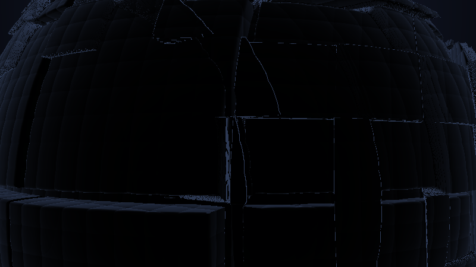

**Ergebnis:** `STIMMUNG = 0.0` ist Schritt 7, `1.0` ist Schritt 8 – und `0.35` ist ein glaubwürdiges Zwielicht dazwischen: Das Gegenlicht ist noch da, aber von rechts schiebt sich schon Wärme in die Panele. Jeder Zwischenwert ist ein gültiges Licht-Setup, kein Verwischungs-Matsch.

### Was passiert hier

**Warum die Blende funktioniert:** Wir mischen nicht zwei fertige *Bilder*, sondern die *Zutaten* – Richtungen, Farben, Gewichte – und rechnen das Licht dann einmal. Das ist billiger (kein doppeltes Shading) und vor allem besser: Die gemischte Sonnenrichtung ist eine echte Richtung (nach `normalize` wandert die Sonne auf einem Bogen von „hinter dem Orb" nach „rechts oben"), das gemischte Setup also ein echtes Setup. Zwei fertige Bilder zu mischen würde dagegen bei 0.5 zwei Schattenwürfe übereinanderlegen – Doppelbelichtung statt Zwielicht.

**Eine Grenze der Richtungs-Mischung, ehrlich benannt:** `mix` zweier fast entgegengesetzter Vektoren kann durch die Länge fast null gehen – hier sind Gegenlicht (`fw`) und Streiflicht (`rt`) aber ~90° auseinander, der Bogen ist gutmütig und `normalize` bleibt stabil. Wer die Setups weiter auseinanderlegt (Gegenlicht ↔ Frontlicht wären 180°!), nimmt statt `mix`+`normalize` eine Winkel-Interpolation.

**`gStimmung` vs. `STIMMUNG`:** Die Konstante ist die Stellschraube fürs Editieren; die globale Variable ist dieselbe Zahl zur Laufzeit. Diese Trennung wirkt jetzt pedantisch und zahlt sich doppelt aus: Anhang A lässt `gStimmung` mit der **Lautheit der Musik** zwischen dark und brighter driften (das dramaturgische Haupt-Mapping dieses Shaders), und in LumiViz ist genau so eine Zahl der ideale Panel-Parameter (Anhang B).

🧠 **Merke:** `STIMMUNG` steuert ab jetzt *jede* stimmungstragende Konstante über ein `mix` – in den nächsten Schritten kommen Lichtfarbe der Fenster, Dunstdichte, God-Ray-Farbe und Belichtung dazu. Ein Parameter, der konsistent durch alle Ebenen greift, ist glaubwürdiger als zehn einzelne Regler. (Dieselbe Lektion wie das Liquiditätsfeld `L` im Crystal-Lights-Tutorial – dort örtlich, hier global.)

### 🎨 Experimentieren

- `STIMMUNG` in 0.1er-Schritten durchfahren – wo „kippt" die Wahrnehmung von bedrohlich zu majestätisch? (Meist zwischen 0.4 und 0.6)
- Zeitautomatik als Vorgeschmack auf Anhang A: `gStimmung = 0.5 + 0.5 * sin(iTime * 0.03);` → ein ewiger Tag-Nacht-Zyklus
- Die Setups weiter spreizen: dark-`sonnenFarbe` auf `vec3(0.15, 0.20, 0.35)`, brighter auf `vec3(1.3, 0.9, 0.5)` – wie weit trägt die Blende, bevor Zwischenwerte unglaubwürdig werden?

---
## Schritt 10 – Positionslichter: der Moloch ist bewohnt

**Neu:** Emissive Punkte auf der Struktur – je Panel-Zelle per Hash entschieden, mit eigenem Blink-Rhythmus (das Blink-Idiom aus dem Crystal-Lights-Tutorial), in Objektkoordinaten (sie drehen mit). Rot und spärlich im dark-Setup, warm und unauffälliger im brighter-Setup.

```glsl
// NEU: Positionslichter - q in OBJEKT-Koordinaten (drehen mit dem Moloch mit)
float fenster(vec3 q)
{
    vec3 z = floor(q / ZELLE2);                          // dasselbe Raster wie die Aufbauten
    float an = step(0.93, hash31(z + 29.0));             // nur ~7% der Zellen leuchten

    float sp = 0.10 + 0.25 * hash31(z + 3.0);            // eigenes Blink-Tempo
    float w  = 0.5 + 0.5 * sin(6.28318 * (iTime * sp + hash31(z + 11.0)));
    float blink = 0.25 + 0.75 * smoothstep(0.55, 0.95, w);

    vec3 lokal = (fract(q / ZELLE2) - 0.5) * ZELLE2;     // Ort innerhalb der Zelle
    float punkt = 1.0 - smoothstep(0.06, 0.24, length(lokal));

    return an * blink * punkt;
}

// GEAENDERT: shade() bekommt am Ende die Emission dazu
    // Positionslichter: rot im Dunkel, warm und dezent im Hellen
    vec3 lichtFarbe = mix(vec3(1.0, 0.12, 0.08), vec3(1.0, 0.75, 0.45), gStimmung);
    col += fenster(gedreht(p)) * lichtFarbe * mix(1.4, 0.8, gStimmung);

    return col;
```

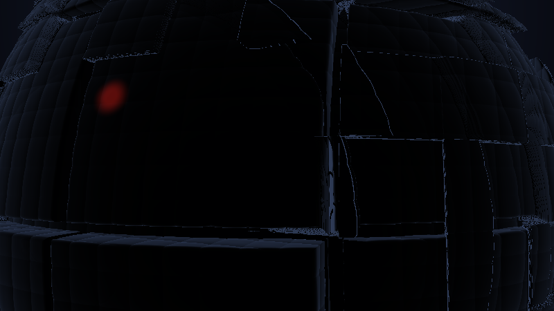

**Ergebnis:** Über die dunkle Masse verteilt glimmen kleine rote Lichter – die meisten ruhig, einzelne pulsierend heller und wieder dunkler, und alle wandern mit der trägen Drehung mit. Im dark-Setup sind sie das, was das Auge zuerst sucht: der Beweis, dass das Ding *lebt* (oder zumindest gewartet wird). In brighter-Stimmung treten sie hinter das Sonnenlicht zurück.

### Was passiert hier

**Emission ist der billigste Leuchtstoff:** einfach Farbe addieren, die nicht vom Licht abhängt – `col +=`, fertig. Die Kunst liegt in der *Platzierung*, und die ist hier komplett prozedural:

1. **Zell-Identität:** `floor(q / ZELLE2)` benutzt dasselbe Raster wie die Aufbauten – die Lichter sitzen also im selben „Bauplan" wie die Blöcke, was das Auge unbewusst als stimmig liest. `hash31(z + Konstante)` liefert (mit je anderer Konstante) beliebig viele unabhängige Eigenschaften pro Zelle: an/aus, Tempo, Phase – das Rezept aus dem Lampen-Raster des Vorgänger-Tutorials, von 2D auf 3D gehoben.
2. **Das Blink-Idiom:** `smoothstep(0.55, 0.95, sin(...))` schneidet die Spitzen der Sinuswelle heraus – aber anders als bei Crystal Lights sitzt hier ein Sockel davor (`0.25 + 0.75·…`): **Positionslichter gehen nie ganz aus.** Ein Navigationslicht, das erlischt, wäre ein Erzählfehler; eines, das atmet, ist Patina.
3. **Der Punkt in der Zelle:** `punkt` blendet mit dem Abstand zur *Zellmitte* ab (Radius ~0.24 bei Zellgröße 0.9). Der Clou steckt in dem, was **nicht** dasteht: Es gibt keine Prüfung „liegt die Zellmitte auf der Oberfläche?" – Zellen, deren Mitte tief im Kugelinneren oder draußen im Leeren liegt, erzeugen einfach nie einen sichtbaren Punkt (die Oberfläche kommt ihrer Mitte nicht nahe genug). Die 7 %-Dichte wird dadurch von der Geometrie nochmals ausgedünnt – gratis Unregelmäßigkeit.
4. **Objektkoordinaten:** `fenster(gedreht(p))` – dieselbe Adresse wie die Zellen der Geometrie. Die Lichter kleben an ihren Panelen und drehen mit. Mit `fenster(p)` (Weltkoordinaten) würden sie gespenstisch über die Oberfläche gleiten – einmal ausprobieren, dann nie wieder.

*Preset-Bezug:* Das dark-Preset erledigt „Leben auf der Struktur" über blinkende Custom Shapes (`shapecode_2` mit `a = (q15>1.5*(1+instance))` – ein hartes Beat-Gate je Instanz). Unser Blinken ist vorerst deterministisch; das Beat-Gate rüstet Anhang A nach – Mapping 1 lässt alle Fenster gemeinsam auf den Kick zünden.

### 🎨 Experimentieren

- Schwelle `0.93` → `0.80`: dichte Besiedlung; `0.99`: drei, vier einsame Signalfeuer (stark!)
- `punkt`-Radius `0.24` → `0.10`: stechende Nadelpunkte statt Bullaugen
- Farbfamilien mischen: `lichtFarbe` je Zelle variieren – `mix(vec3(1.0,0.12,0.08), vec3(0.2,0.6,1.0), step(0.5, hash31(z + 57.0)))` → rote und blaue Lichter wie an einem Flugzeugrumpf
- Lauflichter: `w`-Phase statt aus `hash31(z+11.0)` aus `z.x * 0.2` speisen → die Lichter laufen als Welle über die Struktur (sofort „Landebahn")

### Zwischenstand – der komplette Shader nach Schritt 10

Fünf Diff-Schritte in Folge sind fehleranfällig – hier der Sammelpunkt: der volle Stand *vor* den Signatur-Schritten (God-Rays, Kamerafahrt, Politur). Wer bis hierher etwas anderes auf dem Schirm hat, gleicht mit diesem Listing ab.

```glsl
#define R(a) mat2(cos(a), sin(a), -sin(a), cos(a))

// ---- STELLSCHRAUBEN (Stand Schritt 10) --------------------------------------
const float STIMMUNG = 0.0;   // 0.0 = dark .. 1.0 = brighter
const float RADIUS   = 6.0;
const float NAH      = 8.5;
const float ZELLE1   = 2.6;
const float ZELLE2   = 0.9;
const float ZELLE3   = 0.32;
const float PLATTE   = 0.35;
const float AUFBAU   = 0.22;
const float FUGE     = 0.07;
const float TIEFE    = 0.30;
const float RILLE    = 0.02;
const float GLAETTE  = 0.05;
const float DROSSEL  = 0.5;
// -----------------------------------------------------------------------------

float gStimmung = STIMMUNG;
vec3  gSonne    = vec3(0.0, 0.3, 1.0);

float hash31(vec3 p) { return fract(sin(dot(p, vec3(127.1, 311.7, 74.7))) * 43758.5453); }

float smin(float a, float b, float k)
{
    float h = max(k - abs(a - b), 0.0) / k;
    return min(a, b) - h * h * k * 0.25;
}
float smax(float a, float b, float k) { return -smin(-a, -b, k); }

vec3 gedreht(vec3 p)
{
    p.yz *= R(0.42);
    p.xz *= R(iTime * 0.02);
    return p;
}

float fugen(vec3 p, float zelle)
{
    vec3 q = abs(fract(p / zelle) - 0.5) * zelle;
    return zelle * 0.5 - max(q.x, max(q.y, q.z));
}

float map(vec3 p)
{
    vec3 q = gedreht(p);

    float d = length(q) - RADIUS;

    vec3 z1 = floor(q / ZELLE1);
    d -= (hash31(z1) - 0.5) * PLATTE;

    float slab   = fugen(q, ZELLE1) - FUGE;
    float schale = (RADIUS - TIEFE) - length(q);
    d = smax(d, -max(slab, schale), GLAETTE);

    vec3 z2 = floor(q / ZELLE2);
    d -= step(0.72, hash31(z2 + 7.0)) * AUFBAU * (0.35 + 0.65 * hash31(z2 + 13.0));

    vec3 h = pow(abs(2.0 * fract(q / ZELLE3) - 1.0), vec3(3.0));
    d += RILLE * (h.x + h.y + h.z) * 0.33;

    return d;
}

float march(vec3 ro, vec3 rd)
{
    float t = 0.0;
    for (int i = 0; i < 160; i++) {
        vec3 p = ro + rd * t;
        float d = map(p);
        if (d < 0.001 + 0.0008 * t) return t;
        if (t > 40.0) break;
        t += d * DROSSEL;
    }
    return -1.0;
}

vec3 calcNormal(vec3 p)
{
    const vec2 e = vec2(0.004, 0.0);
    return normalize(vec3(map(p + e.xyy) - map(p - e.xyy),
                          map(p + e.yxy) - map(p - e.yxy),
                          map(p + e.yyx) - map(p - e.yyx)));
}

float fenster(vec3 q)
{
    vec3 z = floor(q / ZELLE2);
    float an = step(0.93, hash31(z + 29.0));

    float sp = 0.10 + 0.25 * hash31(z + 3.0);
    float w  = 0.5 + 0.5 * sin(6.28318 * (iTime * sp + hash31(z + 11.0)));
    float blink = 0.25 + 0.75 * smoothstep(0.55, 0.95, w);

    vec3 lokal = (fract(q / ZELLE2) - 0.5) * ZELLE2;
    float punkt = 1.0 - smoothstep(0.06, 0.24, length(lokal));

    return an * blink * punkt;
}

vec3 himmel(vec3 rd)
{
    vec3 oben  = mix(vec3(0.010, 0.012, 0.022), vec3(0.10, 0.13, 0.20), gStimmung);
    vec3 unten = mix(vec3(0.030, 0.028, 0.045), vec3(0.24, 0.20, 0.18), gStimmung);
    vec3 col = mix(unten, oben, clamp(rd.y * 1.5 + 0.5, 0.0, 1.0));

    float s = max(dot(rd, gSonne), 0.0);
    vec3 hofFarbe = mix(vec3(0.10, 0.13, 0.22), vec3(0.50, 0.38, 0.22), gStimmung);
    col += pow(s, 6.0) * hofFarbe;

    return col;
}

vec3 shade(vec3 p, vec3 rd, float t)
{
    vec3 n = calcNormal(p);

    vec3 sonnenFarbe = mix(vec3(0.30, 0.38, 0.55), vec3(1.05, 0.80, 0.55), gStimmung);
    vec3 himmelLicht = mix(vec3(0.020, 0.025, 0.045), vec3(0.10, 0.12, 0.16), gStimmung);
    float difStaerke = mix(0.6, 1.0, gStimmung);
    float rimStaerke = mix(0.55, 0.22, gStimmung);
    float speStaerke = mix(0.06, 0.30, gStimmung);

    vec3 albedo = vec3(0.16, 0.17, 0.19);

    float dif = max(dot(n, gSonne), 0.0);
    float amb = 0.5 + 0.5 * n.y;

    vec3 col = albedo * (dif * sonnenFarbe * difStaerke + amb * himmelLicht);

    float rim = pow(1.0 - max(dot(n, -rd), 0.0), 3.0);
    col += rim * sonnenFarbe * rimStaerke;

    float spe = pow(max(dot(reflect(rd, n), gSonne), 0.0), 24.0);
    col += spe * sonnenFarbe * speStaerke;

    vec3 lichtFarbe = mix(vec3(1.0, 0.12, 0.08), vec3(1.0, 0.75, 0.45), gStimmung);
    col += fenster(gedreht(p)) * lichtFarbe * mix(1.4, 0.8, gStimmung);

    return col;
}

void kamera(vec2 uv, out vec3 ro, out vec3 rd)
{
    ro = vec3(0.0, -3.2, NAH);
    vec3 ta = vec3(0.0, 1.2, 0.0);

    vec3 fw = normalize(ta - ro);
    vec3 rt = normalize(cross(vec3(0.0, 1.0, 0.0), fw));
    vec3 up = cross(fw, rt);

    rd = normalize(fw * 1.1 + rt * uv.x + up * uv.y);

    gSonne = normalize(mix(fw + vec3(0.0, 0.35, 0.0),
                           rt * 1.3 + vec3(0.0, 0.55, 0.0) - fw * 0.10,
                           gStimmung));
}

void mainImage(out vec4 fragColor, in vec2 fragCoord)
{
    vec2 uv = (fragCoord - 0.5 * iResolution.xy) / iResolution.y;

    gStimmung = STIMMUNG;

    vec3 ro, rd;
    kamera(uv, ro, rd);

    float t = march(ro, rd);

    vec3 col;
    if (t > 0.0) col = shade(ro + rd * t, rd, t);
    else         col = himmel(rd);

    fragColor = vec4(col, 1.0);
}
```

---

## Schritt 11 – God-Rays I: der volumetrische Glow

**Neu:** Die erste Hälfte des Signatur-Effekts: Der Marsch sammelt nebenbei **Glow** auf – das `glow += k/(1+d²)`-Idiom – und legt damit einen Lichtkranz um die Silhouette. Vorweg die ehrliche Einordnung, warum wir den 27er-Loop des Presets *nicht* nachbauen können.

**Das Vorbild – und warum es hier nicht geht:** Der Comp-Shader von *juggernaut* sampelt in seiner Schleife das **fertige, weichgezeichnete Bild** 27-mal (dark: 30-mal), jedes Mal mit anderem radialem Maßstab um das Orb-Zentrum (`Get1(uv1*aspect.yx*radi+0.5)` mit schrumpfendem `radi`), und summiert die Abgriffe. Das ist ein **2D-Radial-Blur über das Ergebnisbild**: Alles Helle – Struktur, Fenster, Waveform – schmiert radial nach außen und wird zu Strahlen. Möglich ist das, weil Milkdrop dem Comp-Shader das gerenderte Bild als Textur reicht (`sampler_main`, `GetBlur1`). Ein Single-Pass-Shadertoy-Shader kann sein eigenes Ergebnis aber **nicht lesen** – das Bild entsteht ja gerade erst, Pixel für Pixel, unabhängig voneinander. Ein ehrlicher 2D-Radial-Blur über die berechnete Szenen-Helligkeit ist im Single-Pass darum **nicht möglich** (jedes Pixel müsste die fertigen Farben *anderer* Pixel kennen). Unser Ersatz besteht aus zwei Hälften: **volumetrischer Glow** (dieser Schritt) und **analytische Streu-Sonne** (Schritt 12).

```glsl
// ---- STELLSCHRAUBEN (erweitert) --------------------------------------------
const float GODRAY = 1.0;     // Staerke des volumetrischen Glows
// ----------------------------------------------------------------------------

// GEAENDERT: march() sammelt nebenbei Glow ein
float march(vec3 ro, vec3 rd, out float glow)
{
    glow = 0.0;
    float t = 0.0;
    for (int i = 0; i < 160; i++) {
        vec3 p = ro + rd * t;
        float d = map(p);
        glow += 0.012 / (0.05 + d * d);      // God-Ray-Saat: Naehe zum Moloch
        if (d < 0.001 + 0.0008 * t) return t;
        if (t > 40.0) break;
        t += d * DROSSEL;
    }
    return -1.0;
}
```

Und in `mainImage` – der Marsch-Aufruf ändert sich, und nach der Farbwahl kommt der Glow obendrauf:

```glsl
    float glow;
    float t = march(ro, rd, glow);

    vec3 col;
    if (t > 0.0) col = shade(ro + rd * t, rd, t);
    else         col = himmel(rd);

    // God-Rays (Teil 1): der beim Marsch gesammelte Glow um die Silhouette
    vec3 strahlFarbe = mix(vec3(0.28, 0.34, 0.55), vec3(1.0, 0.75, 0.50), gStimmung);
    col += glow * 0.06 * GODRAY * strahlFarbe;
```

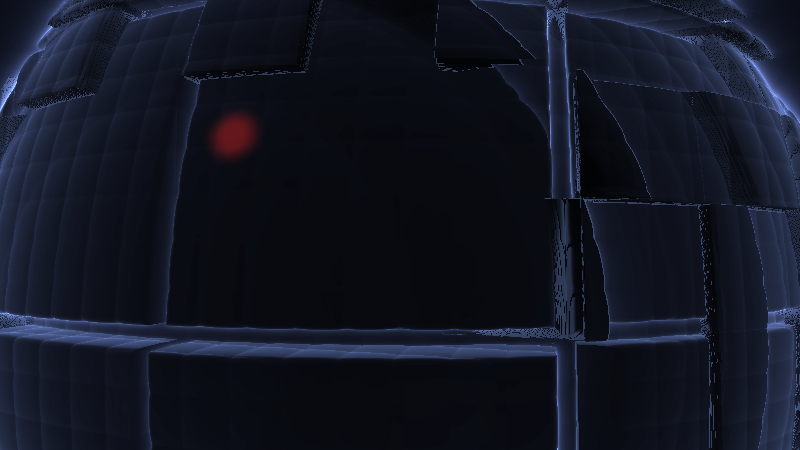

**Ergebnis:** Um die Silhouette des Molochs steht ein Lichtkranz, der sich in den Dunst hinein verliert – am dichtesten dort, wo der Blick die Struktur nur knapp verfehlt, und auch die Oberfläche selbst bekommt einen Hauch Streulicht-Schleier (Strahlen, die treffen, haben auf dem Weg dorthin ebenfalls gesammelt).

### Was passiert hier

**Der Trick ist, dass der Glow nichts kostet:** Der Marsch berechnet an jedem Wegpunkt ohnehin die Distanz `d` zum Moloch – wir werten sie nur ein zweites Mal aus. `glow += 0.012/(0.05 + d²)` summiert entlang des Strahls „wie lange und wie knapp lief ich an der Struktur vorbei":

- Strahlen, die die Silhouette **streifen**, sammeln viel – bei `d ≈ 0.2` trägt jeder Schritt ~0.13 bei, und weil die gedrosselten Schritte dort klein werden, gibt es Dutzende solcher Beiträge → Summen von 2 und mehr.
- Strahlen **weit draußen** sammeln fast nichts – bei `d ≥ 3` bleibt die Gesamtsumme über alle 160 Schritte unter ~0.2.
- Der Faktor `0.06` in `mainImage` skaliert das auf sichtbare, aber nicht fressende Helligkeit; das Tonemapping in Schritt 14 fängt die Ausreißer am Kranz weich ab.

Physikalisch lesbar ist das als **Streulicht im Dunst um den Koloss** – und es umrandet die Silhouette *im 3D-Sinn*, inklusive Parallaxe beim Kameraflug: Der Kranz sitzt an der Geometrie, nicht auf dem Bild. Das kann der 2D-Blur des Presets nicht – der schmiert auch Fenster und Zufallsstrukturen zu Strahlen. Dafür erfasst unser Glow eben *nur* die Silhouette, nicht die hellen Bildinhalte – die zweite Hälfte des Preset-Looks liefert erst die Streu-Sonne in Schritt 12.

**Die ehrliche Fußnote:** Der Glow-Term ist ein Idiom, keine Physik. Sein Wert hängt von der **Schrittdichte** des Marsches ab – mehr Schritte nahe der Silhouette bedeuten mehr Beiträge. Das ist hier sogar erwünscht (die Verdichtung betont die Kontur), aber es koppelt zwei scheinbar unabhängige Regler: Wer `DROSSEL` ändert, ändert die Schrittdichte und muss den Faktor `0.06` nachziehen. Solche versteckten Kopplungen zu *kennen* ist der halbe Weg, sie zu beherrschen.

🧠 **Merke:** `k/(a + d²)` am Marsch entlang aufsummiert ist das Universal-Idiom für „Leuchten um eine SDF" – jede Distanzfunktion, die man ohnehin auswertet, kann nebenbei glühen. Enge über `a`, Stärke über `k`, Charakter über die Drossel.

### 🎨 Experimentieren

- Enge: `0.05 + d*d` → `0.5 + d*d`: der Kranz wird breit und neblig; `0.01 + d*d*4.0`: harte, enge Kontur wie ein Neonrand
- `GODRAY = 3.0` in der dark-Stimmung → der Moloch „brennt" – kurz vor Kitsch, aber eindrucksvoll
- Glow nur im Gegenlicht: `col += glow * 0.06 * GODRAY * strahlFarbe * (0.3 + 0.7 * max(dot(rd, gSonne), 0.0));` → der Kranz konzentriert sich auf die sonnenzugewandte Seite der Silhouette – noch näher am God-Ray-Gefühl
- Farbe entkoppeln: `strahlFarbe` fix auf `vec3(0.9, 0.2, 0.1)` → der Moloch glüht rot im kalten Licht (Warnleuchten-Ästhetik)

---

## Schritt 12 – God-Rays II: die Streu-Sonne mit 27 Keulen

**Neu:** Die zweite Hälfte: eine **analytische Streu-Sonne** im Himmel – Korona plus radiale **Strahlenkeulen** um die Sonnenachse. Als Verbeugung vor dem Vorbild sind es exakt `STRAHLEN = 27` Keulen (das `anz = 27` des brighter-Presets).

```glsl
// ---- STELLSCHRAUBEN (erweitert) --------------------------------------------
const float STRAHLEN = 27.0;  // Strahlenkeulen der Streu-Sonne (Preset: anz = 27)
// ----------------------------------------------------------------------------

// GEAENDERT: himmel() bekommt die Streu-Sonne mit Strahlenkeulen
vec3 himmel(vec3 rd)
{
    vec3 oben  = mix(vec3(0.010, 0.012, 0.022), vec3(0.10, 0.13, 0.20), gStimmung);
    vec3 unten = mix(vec3(0.030, 0.028, 0.045), vec3(0.24, 0.20, 0.18), gStimmung);
    vec3 col = mix(unten, oben, clamp(rd.y * 1.5 + 0.5, 0.0, 1.0));

    // analytische Streu-Sonne mit Strahlenkeulen (Erbe des 27er-Shine-Loops)
    float s = max(dot(rd, gSonne), 0.0);
    vec3 seit = normalize(cross(gSonne, vec3(0.0, 1.0, 0.0)));
    vec3 hoch = cross(seit, gSonne);
    float wink = atan(dot(rd, hoch), dot(rd, seit));       // Winkel UM die Sonnenachse
    float keulen = 0.75 + 0.25 * sin(wink * STRAHLEN + iTime * 0.05);

    vec3 sonnenFarbe = mix(vec3(0.35, 0.42, 0.60), vec3(1.2, 0.9, 0.6), gStimmung);
    col += pow(s, 30.0) * keulen * sonnenFarbe * 1.2;      // enge Korona, gekeult
    col += pow(s, 5.0) * sonnenFarbe * 0.12;               // weiter, ruhiger Hof

    return col;
}
```

*(Der bisherige `pow(s, 6.0)`-Hof aus Schritt 9 geht in den beiden neuen Termen auf und entfällt.)*

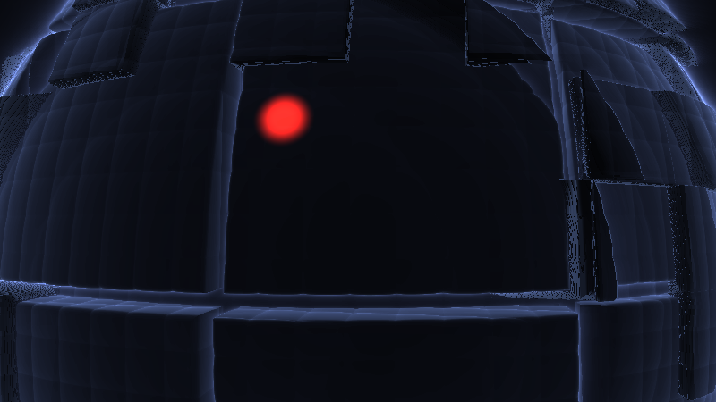

**Ergebnis:** Hinter dem Moloch fächert die verdeckte Sonne in feine radiale Speichen auf, die in Superzeitlupe rotieren – im dark-Setup ein fahles, kaltes Glorienlicht hinter schwarzer Masse, in brighter ein warmer Strahlenkranz neben ihr. Zusammen mit dem Kranz aus Schritt 11 ist das Vorbild-Preset jetzt auf einen Blick wiederzuerkennen.

### Was passiert hier – der 27er-Loop, übersetzt

**Die Korona** ist schlicht `pow(dot(rd, gSonne), 30)` – ein enger Helligkeits-Kegel um die Sonnenrichtung, das Standard-Rezept für „Lichtquelle im Himmel". Der zweite Term mit Exponent 5 legt einen weiten, ruhigen Hof darunter (zwei Skalen, wie beim Preset `GetBlur1` über `GetBlur3` liegt).

**Die Keulen** brauchen einen Winkel *um die Sonnenachse* – und den liefert ein Dreibein: `seit` und `hoch` spannen die Ebene senkrecht zu `gSonne` auf, die Projektionen `dot(rd, seit)` / `dot(rd, hoch)` sind die 2D-Koordinaten des Blickstrahls in dieser Ebene, `atan` macht daraus den Polarwinkel. `sin(wink · 27)` moduliert die Korona in 27 Speichen; die ±25 %-Amplitude hält sie subtil (Strahlen, nicht Turbine). Genau hier sitzt die Hommage: Das Preset erzeugt seine Strahligkeit, weil 27 diskrete radiale Abgriffe *Sampling-Speichen* hinterlassen – ein Artefakt, das zum Stilmittel wurde. Wir bauen das Artefakt absichtlich nach.

**Warum die Sonne im dark-Setup wirkt:** Sie steht dort in Blickrichtung *hinter* dem Moloch (Schritt 7) – ihre Korona ist genau da sichtbar, wo der Orb den Himmel freigibt. Die Speichen scheinen **hinter der Silhouette hervorzubrechen**, und der volumetrische Kranz aus Schritt 11 verbindet beide nahtlos: innen Glow an der Geometrie, außen Speichen im Himmel. Zwei Techniken, eine Lichtquelle – das Auge liest sie als ein Phänomen.

**Die ehrliche Fußnote:** `atan(0, 0)` – exakt in Sonnenrichtung – ist undefiniert. In der Praxis steht dort der Moloch davor (dark) oder das Pixel ist ohnehin in der gesättigten Korona-Mitte (brighter); wer die Sonne komplett freistellt, addiert dem ersten `atan`-Argument ein Epsilon. Und das Dreibein bricht zusammen, wenn `gSonne` exakt senkrecht steht (`cross` mit der Welt-Hochachse wird null) – unsere Sonnenrichtungen aus Schritt 9 bleiben davon weit entfernt.

### 💡 Warum nicht einfach Multipass?

Shadertoy *kann* Multipass (Buffer A rendert die Szene, das Image macht den Radial-Blur darüber – dann ginge der Preset-Ansatz wörtlich). Wir bleiben trotzdem Single-Pass: Das Tutorial-Ziel ist ein Shader, der als **ein** Codeblock kopierbar bleibt – auch in einen einzelnen LumiViz-Node. Wer den echten 2D-Shine will: 🎨 unten skizziert den Buffer-Aufbau; die Buffer-Mechanik selbst steht im Crystal-Lights-Tutorial, Anhang B3.

### 🎨 Experimentieren

- `STRAHLEN = 27.0` → `5.0`: wenige breite Keulen (Kirchenfenster-Licht); `90.0`: flirrender Heiligenschein
- Keulen-Drehtempo `0.05` → `0.4`: die Strahlen rotieren sichtbar – wirkt sofort „Scheinwerfer" statt „Sonne"
- Keulen-Amplitude `0.25` → `0.45` und Korona-Exponent `30.0` → `12.0`: aus der Sonne wird eine barocke Monstranz
- **Buffer-A-Variante** (der Preset-Weg): Buffer A = kompletter bisheriger Shader; Image: `for (int n = 1; n <= 27; n++) col += texture(iChannel0, mitte + (uv - mitte) * (1.0 - float(n) * 0.01)).rgb / 27.0;` um das projizierte Orb-Zentrum – der echte 27er-Loop, jetzt mit lesbarem Eigenbild; dann schmieren auch die Positionslichter zu Strahlen, wie im Original

---

## Schritt 13 – Die Kamera-Choreografie: Orbit mit Pendeln

**Neu:** Alle Kamera-Konstanten werden zu **sin-Uhren**: langsamer Orbit mit weicher Richtungsumkehr, Radius-Pendeln zwischen Ehrfurcht (nah) und Übersicht (fern), Höhen-Pendeln (Froschperspektive ↔ Augenhöhe) und Nick-Pendeln (der Blick wandert am Moloch hinauf und hinab). Vier inkommensurable Uhren, eine Stellschraube fürs Tempo.

```glsl
// ---- STELLSCHRAUBEN (erweitert) --------------------------------------------
const float TEMPO = 1.0;      // Orbit-Tempo (0.3 = meditativ)
const float FERN  = 15.0;     // Orbit-Radius fern (NAH = 8.5 gibt es schon)
// ----------------------------------------------------------------------------

// GEAENDERT: die Kamera bekommt ihre Choreografie
void kamera(vec2 uv, out vec3 ro, out vec3 rd)
{
    float zt = iTime * TEMPO;

    // (a) Orbit-Winkel: sin-POSITION -> weiche Richtungsumkehr
    float wink = 2.6 * sin(zt * 0.021);

    // (b) Radius-Pendeln: nah (Ehrfurcht) <-> fern (Uebersicht)
    float radius = mix(NAH, FERN, 0.5 + 0.5 * sin(zt * 0.013));

    // (c) Hoehen-Pendeln: Froschperspektive <-> Augenhoehe
    float hoehe = mix(-3.2, 0.6, 0.5 + 0.5 * sin(zt * 0.017));

    ro = vec3(sin(wink) * radius, hoehe, cos(wink) * radius);

    // (d) Nick-Pendeln: der Blickpunkt wandert am Moloch hinauf und hinab
    vec3 ta = vec3(0.0, mix(1.8, -0.5, 0.5 + 0.5 * sin(zt * 0.029)), 0.0);

    vec3 fw = normalize(ta - ro);
    vec3 rt = normalize(cross(vec3(0.0, 1.0, 0.0), fw));
    vec3 up = cross(fw, rt);

    rd = normalize(fw * 1.1 + rt * uv.x + up * uv.y);

    // Licht haengt an der Kamera: die Stimmung bleibt im Orbit konstant
    gSonne = normalize(mix(fw + vec3(0.0, 0.35, 0.0),
                           rt * 1.3 + vec3(0.0, 0.55, 0.0) - fw * 0.10,
                           gStimmung));
}
```

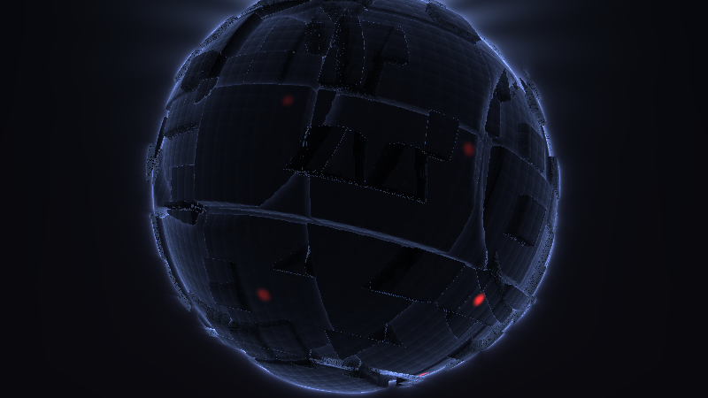

**Ergebnis:** Die Kamera zieht in Zeitlupe um den Koloss, wird langsamer, **kehrt weich um**; dabei atmet der Abstand – mal schiebt sich die Panel-Wand bedrohlich nah heran und füllt alles, mal öffnet sich der Blick und die ganze Kugel steht im Dunst; der Blick hebt und senkt sich am Rumpf entlang. Da der Moloch selbst gegenläufig träge rotiert (Schritt 6), wiederholt sich praktisch keine Ansicht.

### Was passiert hier

**Position als Funktion, nicht als Zustand** – die Kernlektion aller Kamera-Kapitel dieser Tutorial-Reihe: Jede bewegte Größe ist `mix(A, B, 0.5 + 0.5·sin(ω·t))`, also eine glatte *Positions*-Funktion. Ableitung eines Sinus ist ein Cosinus: An den Endlagen ist die Geschwindigkeit exakt null – die Umkehr des Orbits (a) kommt gratis, ruckfrei, ohne Gedächtnis. (Warum kein `winkel += geschwindigkeit`: Ein Shader hat kein Gedächtnis zwischen Frames – ausführlich im Crystal-Lights-Tutorial, Schritt 13.)

**Die vier Uhren** (0.021, 0.013, 0.017, 0.029) sind **inkommensurabel** – keine ist ein Vielfaches einer anderen, die Kombination aller vier Phasen wiederholt sich in keiner sinnvollen Zeitspanne. Dazu läuft als fünfte, unabhängige Uhr die Eigendrehung des Molochs (0.02 aus Schritt 6) und als sechste das Keulen-Drehen (0.05). Streng deterministisch, wirkt improvisiert.

**Die Sicherheits-Rechnung** (der Moloch hat scharfe Kanten, die Kamera soll nie hineinfahren): Maximaler Oberflächenradius = `RADIUS + PLATTE/2 + AUFBAU = 6.0 + 0.175 + 0.22 ≈ 6.4`. Minimaler Kameraabstand vom Zentrum = `√(NAH² + hoehe²) ≥ NAH = 8.5` (die Höhe kann den Abstand nur vergrößern). Freiraum also immer ≥ 2.1 Einheiten – mehr als das Doppelte jeder Displacement-Amplitude, und genug, dass auch der Weitwinkel keine Beinahe-Kollisions-Verzerrungen zeigt. Wer `NAH` senkt oder `AUFBAU` erhöht, rechnet diese eine Zeile nach.

**Warum der Orbit pendelt statt kreist:** Ein voller 360°-Kreis wäre die naheliegende Wahl – aber `wink = 2.6·sin(…)` deckt nur ±149° ab. Absicht: Die Rückseite des Molochs bleibt ungesehen. Was man nie ganz zu sehen bekommt, bleibt größer als das Bild – dieselbe Psychologie wie der Anschnitt in Schritt 1, diesmal in der Zeit statt im Raum. (Und praktisch: Die Umkehr ist die interessanteste Kamerabewegung, der Vollkreis hat keine.)

🧠 **Merke:** *Nah = Ehrfurcht, fern = Übersicht* – das Radius-Pendeln (b) ist dramaturgisch die wichtigste der vier Uhren, denn es spielt die Größenwirkung von Schritt 3 immer wieder neu an: Erst der Wechsel macht die Größe erlebbar. Eine Konstante wäre nur ein Standpunkt; das Pendel ist eine Erzählung.

### 🎨 Experimentieren

- `TEMPO = 0.3` → Meditationsmodus (empfohlen für die dark-Stimmung); `3.0` → Inspektionsflug
- Uhren gleichschalten (alle auf `0.02`) → nach zwei Minuten erkennt man die Schleife; der beste Beweis für die Inkommensurabilität
- `wink`-Amplitude `2.6` → `6.4` (voller Doppelkreis mit Umkehr) oder `0.4` (die Kamera verharrt fast, nur der Moloch dreht)
- `ta.x = 3.0` → der Blickpunkt sitzt seitlich am Rumpf: asymmetrische Anschnitte während des ganzen Orbits

---
## Schritt 14 – Politur: Dunst, Farbdrift, Tonemapping, Dither – der fertige Shader

**Neu:** Vier Veredelungen: **stimmungsabhängiger Dunst** (dicht bei dark, leicht bei brighter), die langsame **Farbdrift**, das Tonemapping **`1 − exp(−x)`** (die Verwandtschaft zur Schablone – Crystal Lights erbte es von frosty caves, wir erben es weiter) und **Dither** gegen Banding im Dunst (das Erbe des Preset-Rauschens). Danach steht der komplette Shader – hier als **Gesamtlisting** zum Einfügen.

```glsl
// ============================================================================
// "Juggernaut" - ein kolossaler Moloch im Dunst, von Grund auf geraymarcht.
// Endstand des Tutorials (Schritt 14). Braucht keine iChannels.
// Stil-Verwandtschaft: MilkDrop2077 vs martin - juggernaut brighter /
// juggernaut 2 dark (Riesen-Orb, 27er-Shine-Loop -> God-Rays, kubisches
// h1-Gitter -> Greebles, Dither). EIN Shader, ZWEI Licht-Stimmungen.
// ============================================================================

// ---- STELLSCHRAUBEN --------------------------------------------------------
const float STIMMUNG = 0.0;   // 0.0 = dark .. 1.0 = brighter  (DIE Stellschraube)
const float RADIUS   = 6.0;   // Radius des Molochs
const float ZELLE1   = 2.6;   // Kantenlaenge der grossen Platten
const float ZELLE2   = 0.9;   // Raster der mittleren Aufbauten (+ Positionslichter)
const float ZELLE3   = 0.32;  // Raster der feinen Rillen
const float PLATTE   = 0.35;  // Hoehenspiel der grossen Platten
const float AUFBAU   = 0.22;  // Hoehe der mittleren Aufbauten
const float FUGE     = 0.07;  // halbe Breite der Panelfugen
const float TIEFE    = 0.30;  // Fugen-Schale unter dem Nennradius
const float RILLE    = 0.02;  // Tiefe der feinen Rillen (h1-Idiom)
const float GLAETTE  = 0.05;  // Kanten-Weiche der smax-Fugen
const float DROSSEL  = 0.5;   // Marsch-Drossel (Displacement -> nur Bound!)
const float GODRAY   = 1.0;   // Staerke des volumetrischen Glows
const float STRAHLEN = 27.0;  // Strahlenkeulen der Streu-Sonne (Preset: anz = 27)
const float TEMPO    = 1.0;   // Orbit-Tempo (0.3 = meditativ)
const float NAH      = 8.5;   // Orbit-Radius nah (Ehrfurcht)
const float FERN     = 15.0;  // Orbit-Radius fern (Uebersicht)
const float DITHER   = 1.5;   // Dither gegen Banding, in 1/255-Stufen
// ----------------------------------------------------------------------------

#define R(a) mat2(cos(a), sin(a), -sin(a), cos(a))

float gStimmung = STIMMUNG;            // Laufzeit-Kopie: Anhang A laesst sie driften
vec3  gSonne    = vec3(0.0, 0.3, 1.0); // wird je Frame in kamera() gesetzt

// ---- Zufall & weiche Boolesche Ops -----------------------------------------

float hash21(vec2 p) { return fract(sin(dot(p, vec2(127.1, 311.7))) * 43758.5453); }
float hash31(vec3 p) { return fract(sin(dot(p, vec3(127.1, 311.7, 74.7))) * 43758.5453); }

float smin(float a, float b, float k)
{
    float h = max(k - abs(a - b), 0.0) / k;
    return min(a, b) - h * h * k * 0.25;
}
float smax(float a, float b, float k) { return -smin(-a, -b, k); }

// ---- Geometrie --------------------------------------------------------------

// traege Drehung um eine schiefe Achse (Objekt-Koordinaten)
vec3 gedreht(vec3 p)
{
    p.yz *= R(0.42);
    p.xz *= R(iTime * 0.02);
    return p;
}

// Abstand zur naechsten Gitterebene einer kubischen Zellteilung
float fugen(vec3 p, float zelle)
{
    vec3 q = abs(fract(p / zelle) - 0.5) * zelle;
    return zelle * 0.5 - max(q.x, max(q.y, q.z));
}

float map(vec3 p)
{
    vec3 q = gedreht(p);

    // Basis: die Riesenkugel
    float d = length(q) - RADIUS;

    // Oktave 1: grosse Platten - jede Wuerfelzelle hat ihren eigenen Radius
    vec3 z1 = floor(q / ZELLE1);
    d -= (hash31(z1) - 0.5) * PLATTE;

    // Fugen: Gitterebenen-Slab, begrenzt auf die aeussere Schale, abgezogen
    float slab   = fugen(q, ZELLE1) - FUGE;
    float schale = (RADIUS - TIEFE) - length(q);
    d = smax(d, -max(slab, schale), GLAETTE);

    // Oktave 2: mittlere Aufbauten - manche Zellen stehen als Bloecke vor
    vec3 z2 = floor(q / ZELLE2);
    d -= step(0.72, hash31(z2 + 7.0)) * AUFBAU * (0.35 + 0.65 * hash31(z2 + 13.0));

    // Oktave 3: feine Rillen - das h1-Idiom des Warp-Shaders als Displacement
    vec3 h = pow(abs(2.0 * fract(q / ZELLE3) - 1.0), vec3(3.0));
    d += RILLE * (h.x + h.y + h.z) * 0.33;

    return d;
}

float march(vec3 ro, vec3 rd, out float glow)
{
    glow = 0.0;
    float t = 0.0;
    for (int i = 0; i < 160; i++) {
        vec3 p = ro + rd * t;
        float d = map(p);
        glow += 0.012 / (0.05 + d * d);      // God-Ray-Saat: Naehe zum Moloch
        if (d < 0.001 + 0.0008 * t) return t;
        if (t > 40.0) break;
        t += d * DROSSEL;
    }
    return -1.0;
}

vec3 calcNormal(vec3 p)
{
    const vec2 e = vec2(0.004, 0.0);
    return normalize(vec3(map(p + e.xyy) - map(p - e.xyy),
                          map(p + e.yxy) - map(p - e.yxy),
                          map(p + e.yyx) - map(p - e.yyx)));
}

// ---- Positionslichter -------------------------------------------------------

float fenster(vec3 q)    // q in Objekt-Koordinaten (dreht mit dem Moloch mit)
{
    vec3 z = floor(q / ZELLE2);
    float an = step(0.93, hash31(z + 29.0));

    float sp = 0.10 + 0.25 * hash31(z + 3.0);
    float w  = 0.5 + 0.5 * sin(6.28318 * (iTime * sp + hash31(z + 11.0)));
    float blink = 0.25 + 0.75 * smoothstep(0.55, 0.95, w);

    vec3 lokal = (fract(q / ZELLE2) - 0.5) * ZELLE2;
    float punkt = 1.0 - smoothstep(0.06, 0.24, length(lokal));

    return an * blink * punkt;
}

// ---- Licht: EIN Shader, ZWEI Stimmungen -------------------------------------

vec3 himmel(vec3 rd)
{
    vec3 oben  = mix(vec3(0.010, 0.012, 0.022), vec3(0.10, 0.13, 0.20), gStimmung);
    vec3 unten = mix(vec3(0.030, 0.028, 0.045), vec3(0.24, 0.20, 0.18), gStimmung);
    vec3 col = mix(unten, oben, clamp(rd.y * 1.5 + 0.5, 0.0, 1.0));

    // analytische Streu-Sonne mit Strahlenkeulen (Erbe des 27er-Shine-Loops)
    float s = max(dot(rd, gSonne), 0.0);
    vec3 seit = normalize(cross(gSonne, vec3(0.0, 1.0, 0.0)));
    vec3 hoch = cross(seit, gSonne);
    float wink = atan(dot(rd, hoch), dot(rd, seit));
    float keulen = 0.75 + 0.25 * sin(wink * STRAHLEN + iTime * 0.05);

    vec3 sonnenFarbe = mix(vec3(0.35, 0.42, 0.60), vec3(1.2, 0.9, 0.6), gStimmung);
    col += pow(s, 30.0) * keulen * sonnenFarbe * 1.2;
    col += pow(s, 5.0) * sonnenFarbe * 0.12;

    return col;
}

vec3 shade(vec3 p, vec3 rd, float t)
{
    vec3 n = calcNormal(p);

    // Stimmungs-Zutaten: dark <-> brighter
    vec3 sonnenFarbe = mix(vec3(0.30, 0.38, 0.55), vec3(1.05, 0.80, 0.55), gStimmung);
    vec3 himmelLicht = mix(vec3(0.020, 0.025, 0.045), vec3(0.10, 0.12, 0.16), gStimmung);
    float difStaerke = mix(0.6, 1.0, gStimmung);
    float rimStaerke = mix(0.55, 0.22, gStimmung);
    float speStaerke = mix(0.06, 0.30, gStimmung);

    vec3 albedo = vec3(0.16, 0.17, 0.19);    // dunkles, mattes Metall

    float dif = max(dot(n, gSonne), 0.0);
    float amb = 0.5 + 0.5 * n.y;

    vec3 col = albedo * (dif * sonnenFarbe * difStaerke + amb * himmelLicht);

    // Silhouetten-Saum: traegt die dark-Stimmung fast allein
    float rim = pow(1.0 - max(dot(n, -rd), 0.0), 3.0);
    col += rim * sonnenFarbe * rimStaerke;

    // Glanzlicht: lebt erst im brighter-Setup richtig auf
    float spe = pow(max(dot(reflect(rd, n), gSonne), 0.0), 24.0);
    col += spe * sonnenFarbe * speStaerke;

    // Positionslichter: rot im Dunkel, warm und dezent im Hellen
    vec3 lichtFarbe = mix(vec3(1.0, 0.12, 0.08), vec3(1.0, 0.75, 0.45), gStimmung);
    col += fenster(gedreht(p)) * lichtFarbe * mix(1.4, 0.8, gStimmung);

    return col;
}

// ---- Kamera -----------------------------------------------------------------

void kamera(vec2 uv, out vec3 ro, out vec3 rd)
{
    float zt = iTime * TEMPO;

    float wink   = 2.6 * sin(zt * 0.021);                       // Orbit + Umkehr
    float radius = mix(NAH, FERN, 0.5 + 0.5 * sin(zt * 0.013)); // Ehrfurcht<->Uebersicht
    float hoehe  = mix(-3.2, 0.6, 0.5 + 0.5 * sin(zt * 0.017)); // Frosch<->Augenhoehe

    ro = vec3(sin(wink) * radius, hoehe, cos(wink) * radius);

    vec3 ta = vec3(0.0, mix(1.8, -0.5, 0.5 + 0.5 * sin(zt * 0.029)), 0.0);

    vec3 fw = normalize(ta - ro);
    vec3 rt = normalize(cross(vec3(0.0, 1.0, 0.0), fw));
    vec3 up = cross(fw, rt);

    rd = normalize(fw * 1.1 + rt * uv.x + up * uv.y);   // 1.1 = Weitwinkel

    // Licht haengt an der Kamera: die Stimmung bleibt im Orbit konstant
    gSonne = normalize(mix(fw + vec3(0.0, 0.35, 0.0),
                           rt * 1.3 + vec3(0.0, 0.55, 0.0) - fw * 0.10,
                           gStimmung));
}

// ---- Hauptprogramm ----------------------------------------------------------

void mainImage(out vec4 fragColor, in vec2 fragCoord)
{
    vec2 uv = (fragCoord - 0.5 * iResolution.xy) / iResolution.y;

    gStimmung = STIMMUNG;    // Anhang A ersetzt diese Zeile durch Audio

    vec3 ro, rd;
    kamera(uv, ro, rd);

    float glow;
    float t = march(ro, rd, glow);

    vec3 col;
    if (t > 0.0) {
        col = shade(ro + rd * t, rd, t);

        // NEU (1): Dunst - im dark-Setup deutlich dichter
        float dichte = mix(0.0035, 0.0012, gStimmung);
        vec3 dunstFarbe = mix(vec3(0.020, 0.024, 0.040),
                              vec3(0.16, 0.15, 0.15), gStimmung);
        col = mix(col, dunstFarbe, 1.0 - exp(-dichte * t * t));
    } else {
        col = himmel(rd);
    }

    // God-Rays: der beim Marsch gesammelte Glow um die Silhouette
    vec3 strahlFarbe = mix(vec3(0.28, 0.34, 0.55), vec3(1.0, 0.75, 0.50), gStimmung);
    col += glow * 0.06 * GODRAY * strahlFarbe;

    // NEU (2): Farbdrift - das Bild wandert langsam durch benachbarte Toene
    col *= 0.92 + 0.08 * cos(iTime * 0.04 + vec3(0.0, 2.1, 4.2));

    // NEU (3): Tonemapping 1-exp - Belichtung haengt an der Stimmung
    col = 1.0 - exp(-col * mix(2.4, 1.6, gStimmung));

    // NEU (4): Gamma + Vignette
    col = pow(col, vec3(1.0 / 2.2));
    col *= 1.0 - 0.32 * dot(uv, uv);

    // NEU (5): Dither gegen Banding im Dunst (Erbe des Preset-Rauschens)
    col += (hash21(fragCoord + fract(iTime * 0.37) * 61.7) - 0.5) * (DITHER / 255.0);

    fragColor = vec4(col, 1.0);
}
```

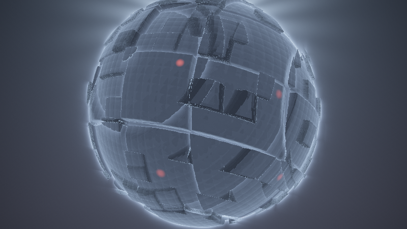

**Ergebnis:** Der fertige Shader. Im dark-Setup: eine fast schwarze, gepanzerte Masse, die träge im dichten Dunst rotiert, rote Lichter glimmen, um die Silhouette steht kaltes Streulicht, hinter ihr fächern 27 fahle Strahlenkeulen auf. `STIMMUNG = 1.0`, und dasselbe Bild wird zur warm bestrahlten Maschine unter hellem Himmel. Die Kamera pendelt dazu zwischen Ehrfurcht und Übersicht.

### Was passiert hier – die fünf Politur-Griffe

1. **Dunst** mit `1 − exp(−dichte·t²)`: Das Quadrat hält die Nähe klar und drückt die Ferne weg. Entscheidend ist die **Stimmungs-Kopplung**: dark bekommt fast die dreifache Dichte – bei Kameradistanz 9 stehen ~25 % Dunst vor der Oberfläche, bei 15 schon ~55 %. Der dunkle Moloch soll aus dem Dunst nur *hervortreten*, der helle darf gesehen werden. (Der Dunst liegt bewusst nur auf dem Treffer-Zweig – der Himmel trägt seine Dunstfarbe schon im Verlauf, und die Streu-Sonne soll nicht weggewaschen werden.)
2. **Farbdrift:** Drei phasenversetzte, sehr langsame Cosinus-Wellen multiplizieren das Bild – nie mehr als ±8 %, aber es „lebt" auch dann, wenn gerade kein Fenster blinkt. Die deterministische Fassung der `rotmat`-Farbrotation des Presets, nur eben diagonal (Kanal-Gewichte) statt voller 3×3-Mischung.
3. **Tonemapping `1 − exp(−x)`:** dieselbe Kurve wie in der Schablone (Crystal Lights ← frosty caves): linear im Dunklen, weiche Sättigung gegen 1 – Sonnen-Korona und Glow **clippen nie hart**, sondern glühen aus. Neu ist die **Belichtung als Stimmungs-Größe**: dark wird mit 2.4 stärker „entwickelt" als brighter mit 1.6, sonst ersöffe die mühsam gebaute Fast-Schwärze im Nichts. Diese eine Zahl ist der empfindlichste Regler des dark-Setups – siehe Abspann.
4. **Gamma + Vignette:** Standard-Abschluss; die Vignette dunkelt die Ecken um bis zu 32 % ab und schiebt den Blick zur Masse in der Bildmitte.
5. **Dither:** ±0.3 % Rauschen pro Pixel, zeitlich variiert. In einem Shader, der zu großen Teilen aus *sehr dunklen Verläufen* besteht (Dunst!), sind 8-Bit-Banding-Stufen sonst unvermeidlich – das Rauschen bricht sie unter die Sichtbarkeitsschwelle. Wörtlich die Rolle, die das Rauschen im Vorbild spielt: Der Warp-Shader streut `- .006·(frame%2)·noise` bzw. (brighter) eine `treb_att`-gesteuerte Rausch-Saat über das Bild – Banding-Bekämpfung im Feedback-Puffer. Unsere Version ist die Ein-Frame-Fassung davon.

### 🎨 Experimentieren – jetzt am Gesamtwerk

- Das Stellschrauben-Brett durchspielen: `STIMMUNG 1.0 / TEMPO 0.4 / STRAHLEN 9` ist ein völlig anderer Shader als `STIMMUNG 0.0 / GODRAY 2.0 / DITHER 3.0`
- Belichtung dark `2.4` → `3.5`: das dark-Setup wird „sichtbar" – und verliert genau dadurch seine Drohung; der beste Beweis, wie schmal der Grat ist
- Die volle `rotmat`-Hommage: statt der diagonalen Farbdrift eine echte 3×3-Rotationsmatrix im Farbraum bauen (drei Winkel `0.03·sin(iTime·…)`, Aufbau wie `per_frame_53`–`55` des Presets) und `col = rotmat * col;` – subtiler, seltsamer Farbwandel
- `albedo` je Platte variieren: in `shade` die Zell-Id `z1` erneut hashen und `albedo *= 0.8 + 0.4 · hash` → Flickwerk-Panzer wie ein lang gedientes Schiff

🧠 **Merke:** Auch hier hat die Politur-Phase keine neue Idee gebraucht – nur Kurven (`exp`, `cos`, `pow`) und ein Rauschen auf das fertige Bild. Neu gegenüber der Schablone ist allein, dass **zwei** der Politur-Konstanten (Dunstdichte, Belichtung) an `STIMMUNG` hängen: Die Stimmungs-Blende endet nicht beim Licht, sie reicht bis in die Nachbearbeitung.

---
# Anhang A: Audio-Reaktivität

Voraussetzung auf shadertoy.com: im Shader-Editor **iChannel0 mit „Music"** belegen (Kanal-Kachel → Music → beliebiger Track). Die Textur ist 512×2: Zeile 0 (`y ≈ 0.25`) das FFT-Spektrum, Zeile 1 (`y ≈ 0.75`) die Wellenform. Die Grundlagen (`bandLevel`-Bänder, Skalen-Fallen, Beat-Gates) stehen ausführlich im **Anhang A des Crystal-Lights-Tutorials** – hier fassen wir das Nötige lauffähig zusammen und konzentrieren uns dann auf den Mapping-Katalog *dieses* Shaders, dessen Hauptnummer die **audio-gesteuerte STIMMUNG** ist.

---

## Schritt A1 – bandLevel und Beat-Gate (eigenständig lauffähig)

**Neu:** Die Audio-Infrastruktur als Mini-Shader zum Kalibrieren – Bass-Pegel, Gate, und als Vorgeschmack: der Hintergrund blendet mit der Lautheit zwischen den beiden Himmel-Stimmungen des Hauptshaders.

```glsl
// iChannel0: Music

// Mittelwert eines FFT-Bandes (lo..hi in 0..1 der Spektrum-Breite)
float bandLevel(float lo, float hi)
{
    float sum = 0.0;
    const int N = 12;
    for (int i = 0; i < N; i++) {
        float x = mix(lo, hi, (float(i) + 0.5) / float(N));
        sum += texture(iChannel0, vec2(x, 0.25)).x;
    }
    return sum / float(N);
}

void mainImage(out vec4 fragColor, in vec2 fragCoord)
{
    vec2 uv = fragCoord / iResolution.xy;

    float bass = bandLevel(0.00, 0.05);
    float vol  = bandLevel(0.00, 0.70);
    float gate = smoothstep(0.60, 0.75, bass);    // das Beat-Gate

    // Hintergrund: die STIMMUNGs-Vorschau - Lautheit blendet dark -> brighter
    float stimmung = clamp(vol * 1.4 - 0.25, 0.0, 1.0);
    vec3 color = mix(vec3(0.010, 0.012, 0.022), vec3(0.10, 0.13, 0.20), stimmung);

    // links: roher Bass-Pegel  |  rechts: das Gate (aus oder an)
    if (uv.x < 0.47) color = uv.y < bass ? vec3(0.9, 0.3, 0.3) : color;
    if (uv.x > 0.53) color = uv.y < gate ? vec3(0.3, 0.9, 1.0) : color;

    fragColor = vec4(color, 1.0);
}
```

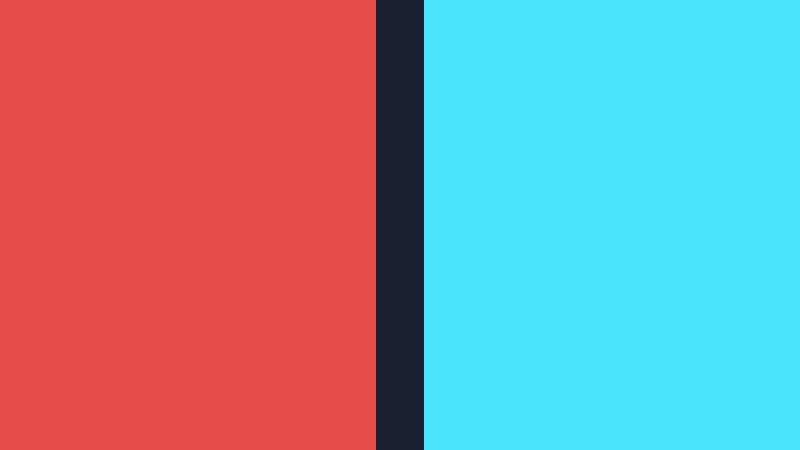

**Ergebnis:** Links wogt der Bass-Balken, rechts springt der Gate-Balken schlagartig auf voll, sobald der Bass die Schwelle reißt – und der Hintergrund wird in lauten Passagen sichtbar heller: die STIMMUNGs-Mechanik in ihrer nackten Form, noch ohne Moloch davor.

### Was passiert hier

Zwei Dinge sind kalibrierungsrelevant (die Herleitung steht in der Schablone, A1):

1. **Die Schwellen sind Handarbeit pro Musikrichtung.** Die Shadertoy-FFT ist ein Absolutpegel – `0.60/0.75` fürs Gate und `·1.4 − 0.25` für die Stimmungs-Gerade passen für durchschnittlich gemasterte elektronische Musik und sind für Klassik oder Podcast falsch. Genau dafür ist dieser Mini-Shader da: erst hier die vier Zahlen einstellen, *dann* in den Hauptshader übernehmen.
2. **Die Stimmungs-Gerade hat eine Totzone:** `vol·1.4 − 0.25` bleibt bis `vol ≈ 0.18` bei null – leise Passagen sind *satt* dark, nicht „ein bisschen hell". Das `clamp` oben hält laute Passagen satt brighter. Ohne die Totzonen würde die Stimmung nervös um Mittelwerte pendeln statt zwischen zwei Welten zu wechseln.

### 🎨 Experimentieren

- `stimmung` aus dem Bass statt der Gesamtlautheit: `clamp(bass * 1.6 - 0.3, 0.0, 1.0)` → die Stimmung folgt dem Beat-Gewitter statt dem Arrangement – hektischer
- Gate-Schwellen `0.35/0.50` bei ruhiger Musik → das Gate triggert auf die Snare
- Beide Balken mit `bandLevel(0.25, 0.7)` (Höhen) füttern → sehen, wie anders Hi-Hats „aussehen"

---

## Schritt A2 – Der Mapping-Katalog: wohin mit welchem Signal?

Kein neuer Shader – eine Landkarte. Alle Schnipsel beziehen sich auf das Gesamtlisting aus Schritt 14 und benutzen die Globals `gBass/gMid/gTreb/gVol/gGate`, die A3 einführt. Wie immer gilt: *musikalische Rolle → visuelle Rolle.*

| # | Audio | steuert | Eingriff | warum es passt |
|---|---|---|---|---|
| 1 | Lautheit | **STIMMUNG driftet dark ↔ brighter** | in `mainImage`: `gStimmung = clamp(STIMMUNG + gVol * 1.4 - 0.25, 0.0, 1.0);` | **Das Haupt-Mapping dieses Shaders:** Das Arrangement selbst schaltet das Licht – leise Strophe = Silhouette im Dunst, lauter Refrain = der Moloch tritt ins Licht. Ein einziger Skalar zieht Sonne, Himmel, Dunst, Fenster und Belichtung konsistent mit (die Ernte von Schritt 9) |
| 2 | Bass-**Gate** | Positionslichter zünden gemeinsam | in `fenster()`: `blink = max(blink, gGate * (0.5 + 0.5 * hash31(z + 41.0)));` | Der Kick schlägt sichtbar **durch die ganze Struktur** – das Shape-Gate des dark-Presets (`a = (q15 > 1.5*(1+instance))`), auf unsere Fenster übertragen; der Hash hält die Zündung ungleich hell (kein Stroboskop) |
| 3 | Bass (kontinuierlich) | God-Ray-Intensität pumpt | in `mainImage`: `col += glow * 0.06 * GODRAY * strahlFarbe * (0.5 + 1.5 * gBass);` | Der Beat ist Masse – er darf das Streulicht um den Koloss atmen lassen; auch das Preset skaliert sein `shine` mit `(q14+1)/4`, und `q14 = sqrt(bass+mid+treb)/2` |
| 4 | Mitten | Fenster-Emission | in `shade()`: Emissions-Zeile `* (0.6 + 1.2 * gMid)` | Melodie = Bewohner: In melodischen Passagen leuchtet die Struktur von innen, im reinen Beat-Gewitter bleiben nur die Notlichter |
| 5 | Höhen | Dither/Grain | in `mainImage`: Dither-Zeile `* (1.0 + 6.0 * gTreb)` | Hi-Hats = Körnung. Direktes `treb_att`-Zitat – wobei das brighter-Preset invers mappt (`saturate(1-treb_att)`: Rauschen bei *leisen* Höhen, als Stille-Patina). Beide Richtungen sind legitim; unten steht die direkte, die inverse ist eine 🎨-Variante |
| 6 | Bass, dezent | Korona-Keulen | in `himmel()`: `keulen`-Amplitude `0.25` → `0.25 + 0.20 * gBass` | Die Strahlen zucken im Takt – sparsam dosieren, sonst wird die Sonne zum Stroboskop |

*Tab. 3: Mapping-Katalog – Audio-Signal, Stellschraube, Eingriff und Begründung*

**Ergebnis:** Für jedes der sechs Mappings sind Signal, Eingriffsort (Funktion samt Zeile) und Begründung benannt – die Schnipsel aus Tab. 3 lassen sich in Schritt A3 unverändert übernehmen (die Mappings 1–5 wandern dort in den Shader, Mapping 6 bleibt optional).

**Zwei Warnungen**, beide verschärft gültig:

- **Die Orbit-Uhren nicht mappen.** Alle vier Kamera-Uhren (0.021/0.013/0.017/0.029) und die Eigendrehung (0.02) sind *Positions*-Uhren – ein audio-gesteuerter Faktor vor `iTime` teleportiert die Kamera bei jeder Pegeländerung (die Herleitung steht in der Schablone, A2). Wer „bei Bass schneller kreisen" will, braucht Zustand (→ B3-Verweis in Anhang B) – oder legt den Bass auf eine *Amplitude* (z. B. `wink`-Amplitude `2.6 · (1 + 0.1·gBass)` – schon das ist grenzwertig ruckelig).
- **Mapping 1 ist roh frame-zittrig.** `gVol` zappelt mit der FFT, und mit ihm die komplette Licht-Welt – bei perkussiver Musik flackert die Stimmung. Für den Hausgebrauch reicht die Totzone aus A1; die saubere Lösung ist eine **geglättete Envelope mit Gedächtnis** (Buffer A) – Anhang B3 der Schablone liefert sie fertig, Anhang B unten sagt, wie sie hier andockt.

---

## Schritt A3 – Der Moloch hört zu

**Neu:** Die Mappings 1–5 wandern in den fertigen Shader. Gezeigt sind nur die Änderungen gegenüber dem Gesamtlisting aus Schritt 14 – auf shadertoy.com zusätzlich **iChannel0 = Music** setzen.

**(a) Vor die Stellschrauben** – Audio-Infrastruktur:

```glsl
// ---- AUDIO ------------------------------------------------------------------
float gBass = 0.0, gMid = 0.0, gTreb = 0.0, gVol = 0.0, gGate = 0.0;

float bandLevel(float lo, float hi)
{
    float sum = 0.0;
    const int N = 12;
    for (int i = 0; i < N; i++) {
        float x = mix(lo, hi, (float(i) + 0.5) / float(N));
        sum += texture(iChannel0, vec2(x, 0.25)).x;
    }
    return sum / float(N);
}
// -----------------------------------------------------------------------------
```

**(b) Am Anfang von `mainImage`** – einmal pro Frame füllen, **vor** dem Kamera-Aufruf (die Kamera liest `gStimmung` für die Sonnenrichtung!):

```glsl
    gBass = bandLevel(0.00, 0.05);
    gMid  = bandLevel(0.05, 0.25);
    gTreb = bandLevel(0.25, 0.70);
    gVol  = bandLevel(0.00, 0.70);
    gGate = smoothstep(0.60, 0.75, gBass);

    // [1] DAS Haupt-Mapping: die Stimmung folgt dem Arrangement
    //     (ersetzt die Zeile "gStimmung = STIMMUNG;")
    gStimmung = clamp(STIMMUNG + gVol * 1.4 - 0.25, 0.0, 1.0);
```

**(c) Die übrigen Eingriffe** (Mapping-Nummern aus A2):

```glsl
// fenster(): nach der blink-Zeile einfuegen                             [2]
    blink = max(blink, gGate * (0.5 + 0.5 * hash31(z + 41.0)));

// mainImage: God-Rays pumpen mit dem Bass                               [3]
    col += glow * 0.06 * GODRAY * strahlFarbe * (0.5 + 1.5 * gBass);

// shade(): Fenster-Emission waechst mit den Mitten                      [4]
    col += fenster(gedreht(p)) * lichtFarbe * mix(1.4, 0.8, gStimmung)
         * (0.6 + 1.2 * gMid);

// mainImage: Grain mit den Hoehen                                       [5]
    col += (hash21(fragCoord + fract(iTime * 0.37) * 61.7) - 0.5)
         * (DITHER / 255.0) * (1.0 + 6.0 * gTreb);
```

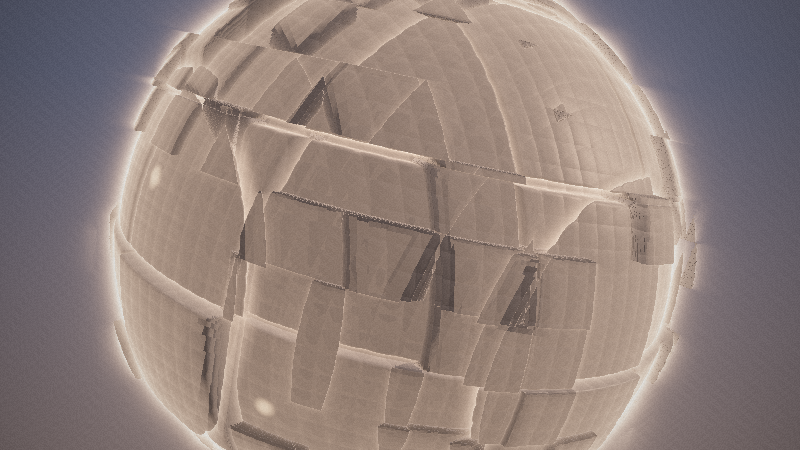

**Ergebnis:** In der leisen Strophe hängt der Moloch als Silhouette im dichten Dunst, rote Lichter glimmen, die fahle Korona steht dahinter. Der Refrain hebt das Licht an: Streiflicht wandert in die Panele, der Himmel öffnet sich, die Fenster leuchten mit der Melodie – und auf jeden Kick zündet ein Lichter-Schauer über die ganze Struktur, während die God-Rays pumpen. Wird es wieder still, sinkt das Ding zurück ins Dunkel.

### Was passiert hier

Das dramaturgische Kalkül ist dasselbe wie in der Schablone, mit einer Verschiebung: Dort verstärkte die Musik einzelne *Effekte*, hier steuert sie in erster Linie **die eine große Blende** – und die Einzel-Mappings 2–5 sind Ornament darüber. Deshalb sind alle Faktoren als `(Sockel + Hub·Signal)` gebaut: Bei Stille fällt der Shader auf sein deterministisches Eigenleben zurück (träge Drehung, Blink-Rhythmen, Orbit) statt schwarz herumzustehen. Und `STIMMUNG` bleibt als Konstante der *Offset* der Geraden: Wer `STIMMUNG = 0.5` setzt, bekommt einen Shader, der um das Zwielicht herum atmet – die Stellschraube und das Mapping arbeiten zusammen, nicht gegeneinander.

### 🎨 Experimentieren

- Nur Mapping 1 aktiv, alles andere aus: bereits ein kompletter Visualizer – „das Licht folgt der Musik" als einzige Aussage, sehr stark bei dynamikreichen Tracks
- Mapping 5 invers wie das brighter-Preset: `* (1.0 + 6.0 * max(0.0, 0.3 - gTreb))` → das Bild verrauscht in den *stillen* Momenten – Patina statt Glitzer
- `gGate` zusätzlich auf die Vignette: `col *= 1.0 - (0.32 - gGate * 0.12) * dot(uv, uv);` → das Bild „öffnet sich" bei jedem Kick

---

# Anhang B: Shadertoy ↔ LumiViz, kompakt

Der fertige Shader benutzt ausschließlich Standard-Uniforms (`iResolution`, `iTime`, in Anhang A `iChannel0`) – nach derselben Konvention wie die 100 Vorrats-Shader in `asset/shadertoys/`. Die **allgemeine Mechanik** (drei Import-Wege, Portabilitäts-Checkliste, Buffer-Semantik) steht vollständig im **Crystal-Lights-Shader-Tutorial, Anhang B** – das wiederholen wir nicht. Hier nur die Kurzfassung plus das, was an *diesem* Shader besonders ist.

## B1 – Die drei Wege (Kurzfassung)

1. **Copy & Paste:** Chain-Node vom Typ *Shadertoy* anlegen, Gesamtlisting (Schritt 14 bzw. A3) unverändert ins GLSL-Feld. Kompilierfehler kommen dank `#line 1` mit den Zeilennummern des eigenen Codes zurück.
2. **URL-/ID-Import** im Node-Editor (App-Key in den Einstellungen nötig) – für den Rückweg, falls der Shader auf shadertoy.com veröffentlicht wurde.
3. **Shadertoy-Browser-Panel** – zum Sichten; Doppelklick lädt als Ein-Node-Chain.

Checkliste für verlustfreies Hin und Her: Schablone, Anhang B2 (Punkte 1–7 gelten unverändert; dieser Shader erfüllt sie per Bauart – keine Custom-Uniforms im Kern, Konstanten als STELLSCHRAUBEN, kein `#version`).

## B2 – Der Audio-Adapter und STIMMUNG als Panel-Parameter

**Audio:** In LumiViz stellt der Shadertoy-Node die Audio-Textur im identischen 512×2-Layout am gewählten iChannel bereit – `bandLevel` aus A3 läuft unverändert. Bequemer sind die eingebauten Uniforms `bass/mid/treb/vol/beat`; der Wechsel ist mit dem **Adapter-Muster der Schablone (B2)** ein Umkommentieren:

```glsl
// ===== AUDIO-ADAPTER (Muster: Crystal-Lights-Tutorial, Anhang B2) ============
// Genau EINEN der beiden Bloecke aktiv lassen.

// --- Variante SHADERTOY (iChannel0 = Music) ----------------------------------
float aBass() { return bandLevel(0.00, 0.05); }
float aVol()  { return bandLevel(0.00, 0.70); }
float aMid()  { return bandLevel(0.05, 0.25); }
float aTreb() { return bandLevel(0.25, 0.70); }
float aBeat() { return smoothstep(0.60, 0.75, aBass()); }

// --- Variante LUMIVIZ (eingebaute Uniforms; Skalen-Faktor einmessen!) --------
// float aBass() { return bass * 0.3; }
// float aVol()  { return vol  * 0.3; }
// float aMid()  { return mid  * 0.3; }
// float aTreb() { return treb * 0.3; }
// float aBeat() { return beat; }
// =============================================================================
```

In A3 heißt es dann `gVol = aVol();` usw. Die Skalenfrage (LumiViz-Uniforms vs. rohe FFT) ist app-seitig noch in Klärung – beim Umzug einmal beide per A1-Muster nebeneinander visualisieren und **nur den Adapter-Faktor** anpassen, nie die Mappings.

**STIMMUNG in der App:** Genau solche Zahlen – ein Skalar 0..1, der eine ganze Bild-Welt konsistent umschaltet – sind der ideale Kandidat für einen **Panel-Parameter** am LumiViz-Node: Im Editor ist `const float STIMMUNG` die oberste Stellschraube des Codes und damit der natürliche erste Griff beim Anpassen einer Chain; wer denselben Shader in zwei Stimmungen in der Playlist haben will, legt schlicht zwei Node-Presets an – die Ein-Datei-Fassung des Preset-Paars *brighter*/*2 dark*.

## B3 – Weiche STIMMUNGs-Übergänge (Verweis)

Das rohe `gVol`-Mapping aus A3 schaltet die Stimmung im Frame-Takt – funktional, aber nervös. Die saubere Lösung ist die **Buffer-A-Envelope aus der Schablone (Anhang B3)**: ein 1-Pixel-Zustand mit Tiefpass (`mix(alt, neu, 0.10)`) und Attack/Release-Hüllkurve. Für diesen Shader lohnen sich **zwei getrennte Zeitkonstanten**: schneller Anstieg (~0.2 s – der Refrain *tritt ein*), langsamer Abfall (~3 s – das Licht *verglimmt*). Auf Shadertoy: Buffer A trägt die geglättete Stimmung, das Image liest sie statt `gVol`. In LumiViz: derselbe Aufbau über den Multipass-Support des Shadertoy-Nodes (Buffer-Pass mit Audio-Kanal und Selbstreferenz), oder gleich das eingebaute `beat`/`vol` mit app-seitiger Glättung – die Denkfigur ist in der Schablone vollständig ausgearbeitet.

---

## End-Validierung

Diese Validierung steht bewusst **hinter den Anhängen**: A1–A3 sind reguläre Schritte dieses Tutorials, und das Lernziel 6 (Audio-Reaktivität) ist erst dort erreichbar – die End-Validierung muss aber alle Lernziele abdecken. Die Kriterien 1–6 prüfen den Kern (Schritte 1–14), das Kriterium 7 den Anhang. Jedes Kriterium ist am laufenden Shader auf shadertoy.com objektiv prüfbar:

1. **Kompilierbarkeit:** Das Gesamtlisting aus Schritt 14 kompiliert auf shadertoy.com ohne Fehlermeldung und rendert ein bewegtes Bild – kein Schwarzbild, kein Standbild. *(Basis aller Lernziele)*
2. **Größenwirkung:** In der Nah-Phase des Orbits schneidet der Moloch mindestens zwei Bildränder an. Gegenprobe: `RADIUS = 1.0` zeigt eine frei im Bild schwebende Murmel; zurück auf `6.0` sprengt die Struktur das Bild wieder. *(Lernziel 1)*
3. **Greebles und Marsch:** Bei `STIMMUNG = 1.0` sind alle drei Detail-Oktaven unterscheidbar – Platten mit Fugen, aufgesetzte Blöcke, feine Rillen-Schraffur im Streiflicht. Gegenprobe: `DROSSEL = 1.0` erzeugt sichtbare Löcher und Glitzer-Pixel an den Plattenkanten; zurück auf `0.5` verschwinden sie. *(Lernziele 2 und – als Artefakt-Übung – die Drossel-Rechnung aus Schritt 5)*
4. **STIMMUNGs-Blende:** `STIMMUNG = 0.0` und `STIMMUNG = 1.0` erzeugen **sichtbar verschiedene Bilder** – dark: fast schwarze Silhouette mit kaltem Rim, roten Lichtern und dichtem Dunst; brighter: lesbare Panel-Struktur im warmen Streiflicht unter hellerem Himmel. Zwischenwerte (z. B. `0.35`) liefern ein plausibles Zwielicht ohne Doppelbelichtungs-Artefakte – die Sonne steht auf einer Zwischenrichtung, nicht zweimal im Bild. *(Lernziel 3)*
5. **God-Rays:** Um die Silhouette steht ein Glow-Kranz, der beim Orbit an der Geometrie klebt (Parallaxe); in der Fern-Phase des Orbits sind die Strahlenkeulen um die Sonne zu erkennen (zur Kontrolle macht `STRAHLEN = 5.0` sie grob und unübersehbar). `GODRAY = 0.0` entfernt den Kranz, die Keulen im Himmel bleiben – zwei getrennte Techniken, ein Phänomen. *(Lernziel 4)*
6. **Kamera:** Der Orbit verlangsamt an den Bahn-Enden sichtbar und kehrt weich um, ohne Sprung; der Abstand pendelt zwischen Nah-Wand und Ganz-Übersicht; die Kamera fährt nie in die Struktur (Freiraum-Rechnung aus Schritt 13: ≥ 2.1 Einheiten). *(Lernziel 5)*
7. **Audio:** Im A3-Stand (iChannel0 = Music) hängt der Moloch in leisen Passagen als dunkle Silhouette im Dunst und tritt in lauten ins Licht; jeder Bass-Kick zündet einen Lichter-Schauer über die Struktur; **ohne Musik** laufen Drehung, Blinken und Orbit unverändert weiter. *(Lernziel 6)*

---

## Fehlerbehebung

Die häufigsten Stolperstellen dieses Tutorials, gesammelt nach Symptom (Tab. 4). Die schritt-lokalen ⚠-Hinweise (etwa zur SDF-Ehrlichkeit in Schritt 4) bleiben davon unberührt – hier stehen die Probleme, die typischerweise erst beim Zusammenbau, beim Experimentieren oder beim Abgleich mit den Screenshots auftreten:

| # | Symptom | Ursache | Lösung |
|---|---|---|---|
| 1 | Schwarzes Bild nach dem Einfügen | Code unvollständig kopiert (Hilfsfunktionen fehlen) oder Kompilierfehler – Shadertoy rendert dann nichts bzw. den letzten lauffähigen Stand | Gesamtlisting aus Schritt 14 komplett kopieren, mit `Alt+Enter` kompilieren und die Fehlerkonsole unter dem Editor lesen |
| 2 | Kompilierfehler `'…' : undeclared identifier` | Ab Schritt 9 zeigen die Listings nur noch **geänderte** Funktionen – der Rest des Vorschritts muss stehen bleiben | Mit den Sammelpunkten abgleichen: Zwischenstand am Ende von Schritt 10 bzw. Gesamtlisting in Schritt 14 (Hinweis am Anfang von Schritt 9) |
| 3 | Löcher/Glitzer-Pixel an den Plattenkanten | Marsch-Drossel zu groß – Zellen-Versätze und Rillen-Displacement machen die SDF zur bloßen Abschätzung | `DROSSEL = 0.5` (Rechnung in Schritt 5); wer `RILLE` erhöht, rechnet die Drossel-Abschätzung nach und senkt weiter |
| 4 | Der dark-Endstand (Schritt 14, `STIMMUNG = 0.0`) rendert deutlich **heller** als die „fast schwarze Masse" der Prosa | Bekannter Befund der LumiViz-Gegenrender (siehe Abspann): Belichtung, Glow und Dunst greifen in den untersten 10 % des Wertebereichs ineinander | Nachstimm-Kandidaten: Belichtung `2.4` senken, Glow-Faktor `0.06` senken, Dunstfarbe abdunkeln – eine Zahl zur Zeit ändern und die anderen nachziehen; die „Was passiert hier"-Absicht ist verlässlicher als die Konstante daneben |
| 5 | Strahlenkeulen (Schritt 12) nicht zu sehen | Bei frontnaher Kamera verdeckt der Moloch die Sonne fast vollständig – der Kranz zeigt sich nur als Glimmen an den oberen Bildecken (so auch im Schritt-12-Screenshot) | Den Orbit aus Schritt 13 abwarten (Fern-Phase) oder zum Testen `NAH = 20.0` setzen; zur Kontrolle zusätzlich `STRAHLEN = 5.0` |
| 6 | Niedrige Framerate / Ruckeln | 160 Marsch-Iterationen mit Drossel 0.5 plus sechsfache `map`-Auswertung der Normalen sind teuer, besonders auf integrierten GPUs | Shadertoy-Vorschau verkleinern; Iterationen (`160`) reduzieren oder die feinste Oktave (`ZELLE3`-Rillen) probeweise deaktivieren |
| 7 | Audio-Balken/Gate stehen dauerhaft auf Vollausschlag | Pegel-Sättigung: das synthetische Testsignal des Standalone (und stark gemasterte Tracks) liegt dauerhaft über den Gate-Schwellen – die A1-/A3-Bilder zeigen genau diesen Fall | Schwellen (`0.60/0.75`) und die Stimmungs-Gerade (`·1.4 − 0.25`) im A1-Mini-Shader pro Musikmaterial kalibrieren, erst dann in den Hauptshader übernehmen; für adaptive Trigger die Buffer-Envelope (Anhang B3) |
| 8 | Audio-Mappings reagieren nicht | iChannel0 nicht mit „Music" belegt, Track pausiert, oder die Gate-Schwelle passt nicht zum Track | Kanal-Kachel prüfen (A1); Schwellen sind Handarbeit pro Musikrichtung – oder gleich die geglättete Lösung aus Anhang B3 |
| 9 | Konstanten wirken anders als beschrieben | Die Shader dieser Serie sind konstruiert, nachgerechnet und in LumiViz gegengerendert (Screenshots im Text) – aber nicht jeder Zahlwert ist gegen das beschriebene Zielbild feinabgeglichen, und shadertoy.com ist noch ungeprüft | Die Stellschraube in kleinen Schritten nachstimmen; die beschriebene **Wirkrichtung** jeder Konstante stimmt, der Absolutwert ist Startpunkt, nicht Dogma |

*Tab. 4: Fehlerbehebung – Symptom, Ursache, Lösung*

---

## Nächste Schritte

Die Fortsetzung folgt der [Wegleitung](ShaderTutorials-overview.md) der Serie – nach diesem Tutorial sind die **Composites** dran, und zwei davon bauen direkt auf dem Moloch auf:

- **[Composite-Postfx](CompositePostfx-tutorial.md)** veredelt genau diese Szene: Der Moloch wandert als Werk in eine Multipass-Kette (Bloom, Tiefenschärfe, Temporal-Glättung) – die Politur von Schritt 14, eine Etage höher.
- **[Composite-Transitions](CompositeTransitions-tutorial.md)** nutzt den Moloch als **Welt B**: beat-getriggerte Übergänge zwischen den fertigen Szenen der Serie – die STIMMUNGs-Blende von Schritt 9, auf ganze Welten übertragen.
- **[Composite-Portals](CompositePortals-tutorial.md)** merged die Basis-Szenen der Serie zu einer Portal-Welt – wer die anderen Basis-Tutorials noch nicht verbaut hat, steigt dort ein.

---

## Abspann

Damit ist der Moloch komplett: eine Kugel, drei Gitter-Oktaven, zwei Licht-Welten mit einer Blende dazwischen, ein volumetrischer Strahlenkranz mit 27 Keulen als Verbeugung vor dem Vorbild – und eine Kamera, die klein genug bleibt, um das alles groß aussehen zu lassen.

Zwei ehrliche Hinweise zum Schluss:

- **Dieses Tutorial ist am Schreibtisch konstruiert und inzwischen in LumiViz gegengerendert** (alle Schritte kompilieren warnungsfrei; die Screenshots im Text stammen aus diesen Läufen) – auf shadertoy.com ist der Sichttest weiterhin offen. Die angekündigte Empfindlichkeit der dark-Stimmung hat sich dabei bestätigt: Der Endstand (Schritt 14, dark) rendert deutlich heller als die „fast schwarze Masse" der Prosa – Nachstimm-Kandidaten sind Belichtung `2.4`↓, Glow `0.06`↓ und die Dunstfarbe. Wer beim Nachbauen stolpert: Die „Was passiert hier"-Abschnitte enthalten jeweils die Absicht – sie ist im Zweifel verlässlicher als die Konstante daneben.
- **Die dark-Stimmung ist empfindlich.** Sie lebt in den untersten 10 % des Wertebereichs, und dort kippen die Verhältnisse schnell: Die Belichtung (`2.4` im Tonemapping), die Dunstdichte (`0.0035`) und die Himmelswerte greifen ineinander – eine dieser Zahlen zu ändern heißt praktisch immer, die anderen nachzuziehen. Auch der Monitor redet mit (dasselbe dark sieht auf OLED und TN-Panel verschieden aus). Das brighter-Setup ist gutmütig; das dunkle ist Feinmechanik. Das ist kein Mangel des Shaders, sondern die Natur dunkler Bilder – die *juggernaut*-Presets haben ihre dark-Fassung auch nicht umsonst als eigene Datei abgestimmt.

Wer weitermachen will: Fast jeder 🎨-Kasten ist ein eigener Shader – besonders ergiebig sind die Voronoi-Panelfugen (Schritt 4), der Buffer-A-Radial-Blur (Schritt 12, der „echte" Preset-Weg) und die `rotmat`-Farbrotation (Schritt 14). Und wer den Moloch *bewohnen* will, statt ihn zu umkreisen: Die Kamera von Schritt 13 in die Fuge einer Platte zu legen ist nur eine `NAH`-Änderung entfernt – aber ein ganz anderes Tutorial.

Und jetzt: Musik an. 🎵🌑

*Screenshots: gerendert mit AvsStandalone (Testing-Build), Chains in `juggernaut_schritte/`.*

---

## Siehe auch

**Voraussetzungen:**

- [Pyramid-Spiral-Shader-Tutorial](PyramidSpiral-tutorial.md) – die Raymarching-Grundlagen (UV, SDF, `map`/`calcNormal`/Marsch, Hash), auf denen dieses Tutorial aufbaut (Schritte 1–7 dort genügen).
- [Stratospheric-Tunnel-Shader-Tutorial](StratosphericTunnel-tutorial.md) bzw. [Space-Debris-Shader-Tutorial](SpaceDebris-tutorial.md) – Marsch-Sicherheit an nicht-exakten SDFs und die Licht-Ideen des 3D-Strangs; eines der beiden genügt als Zubringer (Lesehilfe der Wegleitung).

**Verwandte Dokumente:**

- [Shader-Tutorials-Wegleitung](ShaderTutorials-overview.md) – Fokus-Tabellen, Lesereihenfolge und Technik-Index der gesamten Tutorial-Serie.
- [Raymarching – Referenz](Raymarching-reference.md) – die technische Referenz zum Nachschlagen; hier besonders §6 (Raumoperationen: Verschneidungen und ihre Folgen für die Drossel) und §8 (Beleuchtung: das Glow-Idiom) als das „Warum" hinter den Schritten 4–5 und 11.
- [Crystal-Lights-Shader-Tutorial](CrystalLights-tutorial.md) – die „Schablone" dieses Tutorials: Anhang A/B dort sind die Vollreferenz für die Audio-Grundlagen und den Weg Shadertoy ↔ LumiViz, auf die die Anhänge hier verweisen.

**Weiterführendes:**

- [MilkDrop2077 vs martin – juggernaut brighter](<../../../../../asset/Milkdrop3/presets/MilkDrop2077 vs martin - juggernaut brighter.milk>) und [MilkDrop2077 vs martin – juggernaut 2 dark](<../../../../../asset/Milkdrop3/presets/MilkDrop2077 vs martin - juggernaut 2 dark.milk2>) – das Stil-Vorbild-Paar (MilkDrop): Riesen-Orb, 27er-Shine-Loop, kubisches `h1`-Gitter, Dither und die zwei Licht-Stimmungen im Original.
- [iquilezles.org](https://iquilezles.org/articles/) – die Artikelsammlung von Inigo Quilez zu Distanzfunktionen, smin und Raymarching-Artefakten; die Primärquelle der polynomialen `smin`/`smax`-Form aus Schritt 4.

## Changelog

| Version | Datum | Änderungen |
|---|---|---|
| **1.2.0** | 2026-08-05 | Formalisierung nach Tutorial_Base (Muster: Crystal-Lights-Pilot): Blockquote-Header, Inhaltsverzeichnis, Lernziele, Voraussetzungen, Übersicht der Schritte, Konventions-Mapping (Tab. 1), End-Validierung, Fehlerbehebung, Nächste Schritte, Siehe auch; Tabellen als Tab. 1–4 und Bauplan-Skizze als Fig. 1 indexiert; **Ergebnis:**-Zeile in Schritt A2 ergänzt; bekannte Befunde (dark-Endstand heller als Prosa, frontverdeckte Strahlenkeulen, Testsignal-Sättigung) als Fehlerbehebungs-Zeilen aufgenommen. Didaktischer Bestand (Schritt-Texte, Code, 🎨-Kästen, Anhänge) inhaltlich unverändert. Einschließlich Umzug der Serie nach `projects/apps/MyViz/docs/tutorials/` und Umbenennung nach FNM-01 zu `Juggernaut-tutorial.md` (Entscheid Patrik, 2026-08-04). |
| **1.1.0** | 2026-08-04 | Schritt-Chains + Screenshots: je Schritt eine lauffähige Ein-Node-Chain in `juggernaut_schritte/` (`.glsl` = materialisierte Rekonstruktion der Diff-Schritte, `make_schritte.py` generiert die `.lvfx`) und ein eingebettetes Render-Bild in `juggernaut_bilder/` (Render-Nachweis AvsStandalone, Testing-Build, 800×450, Frame 300; Anhang-Bilder mit synthetischem Testsignal). |
| **1.0.0** | 2026-08-04 | Erstfassung: 14 Schritte (Geometrie → Material → Licht → Bewegung → Politur, Kern-Feature `STIMMUNG`-Blende) + Anhang A (Audio-Reaktivität mit Mapping-Katalog) + Anhang B (Shadertoy ↔ LumiViz, kompakt mit Verweis auf die Crystal-Lights-Vollreferenz). |

