# Pimped Kaleidoscope – Ein Feedback-Kaleidoskop von Grund auf

> **Dokumenttyp:** Tutorial  
> **Version:** 1.2.0  
> **Status:** Stabil  
> **Domain:** Programming  
> **Kategorie:** Algorithms  
> **Programmiersprache:** GLSL (Shadertoy/WebGL2)  
> **Voraussetzungen:** [Pyramid-Spiral-Shader-Tutorial](PyramidSpiral-tutorial.md), Schritte 1–2, sowie Hash-Idiom und Cosinus-Palette der Serie – kein Raymarching nötig: der 2D-Strang ist bewusst raymarching-frei  
> **Schwierigkeitsgrad:** Fortgeschritten  
> **Tutorial-Typ:** Implementierung  
> **Zeitschätzung:** 5–7 h für die Schritte 1–13 auf shadertoy.com (inkl. Experimentieren), zusätzlich ~1,5 h für die Anhänge A/B; reines Durchlesen ~1,5 h  
> **Gültigkeit:** Shadertoy-Multipass-Shader (WebGL2, Common + Buffer A + Image); Anhang B zusätzlich für den Shadertoy-Node der LumiViz-Effect-Chain (Stand Session 65/67)  
> **Zweck:** Schritt-für-Schritt-Aufbau eines Feedback-Kaleidoskops mit Shadertoy-Multipass und Buffer-Selbstreferenz – Milkdrops Warp-Schleife nachgebaut, von der Lichtsaat über das Feedback-Grundrezept und drei Faltstufen bis zum fertigen Werk samt Audio-Reaktivität.  
> **Zielgruppe:** Shader-Entwickler ohne Raymarching-Vorwissen (leichtester Einstieg der Serie); Leser der Shader-Tutorial-Serie  
> **Sprache:** Deutsch  

> ⚠ **HINWEIS: Nicht-normative ASCII-Darstellungen**
>
> Die ASCII-Skizze im Bauplan-Abschnitt dient ausschließlich der **illustrativen Unterstützung**
> und setzt eine Monospace-Schrift voraus. Verbindlich sind die textuelle Beschreibung und der Code.

---

## Inhaltsverzeichnis

1. Einleitung
2. Lernziele
3. Voraussetzungen
4. Übersicht der Schritte
5. Der Bauplan: Was wir eigentlich rendern
6. Schritt 1 – Die Bühne: ein wanderndes Licht
7. Schritt 2 – Die Lichtsaat: Punkte-Paar, Ring, Palette
8. Schritt 3 – Buffer A: das Bild bekommt ein Gedächtnis (und brennt aus)
9. Schritt 4 – Decay: die Vergessenskurve
10. Schritt 5 – Die Lese-Transformation: Zoom und Drehung
11. Schritt 6 – Sharpen: die Unsharp Mask
12. Schritt 7 – Die Dither-Saat
13. Schritt 8 – Winkel-Faltung: das klassische Kaleidoskop
14. Schritt 9 – Die Spiegel-Kachel
15. Schritt 10 – Rotations-Überlagerung: die anz-Schleife
16. Schritt 11 – Die unsichtbare Kamera
17. Schritt 12 – Politur: Farbrotation, Entsättigung, Tonemapping
18. Schritt 13 – Der fertige Shader: Common + Buffer A + Image
19. Anhang A: Audio-Reaktivität (Schritte A1–A3)
20. Anhang B: Der Weg in die App – und zurück (B1–B3)
21. End-Validierung
22. Fehlerbehebung
23. Nächste Schritte
24. Abspann
25. Siehe auch
26. Changelog

---

## Einleitung

**Ziel:** Ein **Kaleidoskop mit Gedächtnis**: Wandernde, farbige Lichtpunkte malen in einen Bildspeicher, der sich jeden Frame **selbst wieder einliest** – leicht gezoomt, leicht gedreht, geschärft und gedämpft. Aus den Lichtern werden glühende Schweife, aus den Schweifen Spiralen, und eine dreistufige Spiegel-Faltung macht daraus ein lebendes Mandala. Es ist das einzige **reine 2D-Tutorial** dieser Serie – mit Absicht: Nach zwei Raymarching-Welten (Pyramid Spiral, Crystal Lights) kommt die Tiefe diesmal nicht aus dem *Raum*, sondern aus der *Zeit*. Das Werkzeug dafür heißt **Feedback**, und es ist wörtlich Milkdrops Warp-Schleife – nachgebaut mit Shadertoy-Bordmitteln (Buffer A liest sich selbst).

**Stil-Vorbilder** (beide liegen im Repo unter `asset/Milkdrop3/presets/`):

- *martin – shader pimped caleidoscope.milk*: die komplette Blaupause dieses Tutorials. Sein **Warp-Shader** ist das Feedback-Rezept in vier Zeilen: Unsharp-Mask/Sharpen (`ret += (ret - GetBlur1(...))*0.35`), Decay (`ret *= 0.9`), eine Dither-Rauschsaat aus `sampler_noise_lq` und eine leichte Entsättigung (`lerp(ret, lum(ret), 0.1)`). Sein **Comp-Shader** ist das Faltwerk: `anz = 3` rotierte Kopien des Bildes, jede durch die Spiegel-Kachel `abs(frac(uv2*aspect.yx)-.5)` gefaltet und per `max()` gemischt – dazu wandernde Lichtpunkte als Farbquelle (`ret1 = (roam_sin+0.5)/(0.01+length(uv*r1-pos*0.07*q7))` – unsere Seeds!) und die Vignette `ret = ret1*(1-rad)`. Jede dieser Zutaten bekommt hier ihren eigenen Schritt.
- *GreatWho – Rock The House_2024.milk*: das harte Bass-Gate (`a = if(above(bass,0.95), 2, 0)`) – wie schon beim Vorgänger die Vorlage für die Beat-Zündung in Anhang A.

Und ein drittes Vorbild ist die Serie selbst: Die `1/d²`-Lichter, die Cosinus-Palette und das `1-exp`-Tonemapping kennst du aus dem **[Crystal-Lights-Tutorial](CrystalLights-tutorial.md)** (gleicher Ordner) – hier kommen sie in neuer Rolle wieder: nicht als fertiges Bild, sondern als **Saat**, die das Feedback-System füttert.

**So funktioniert dieses Tutorial:**

- Es läuft **direkt auf Shadertoy**: Jeder Schritt ist ein vollständiger, lauffähiger Shader. Kopiere ihn nach [shadertoy.com/new](https://www.shadertoy.com/new), drücke `Alt+Enter` – fertig. Ab Schritt 3 wird der Shader **mehrteilig** (Tab „Buffer A" + Tab „Image"); wie man das anlegt, steht dort ausführlich. Ab da zeigt jeder Schritt **beide** Code-Blöcke.
- Jeder Schritt fügt **genau eine Technik** hinzu; unter jedem Schritt stehen Variationsideen (🎨).
- Die Reihenfolge folgt der Natur des Systems: **Saat → Gedächtnis → Faltung → Bewegung → Politur.** Erst muss etwas *da* sein (die Seeds), dann bekommt es *Dauer* (das Feedback), dann *Form* (die Faltungen), dann *Leben* (die unsichtbare Kamera).
- **In LumiViz:** Jeder Schritt liegt zusätzlich als lauffähige Chain in `pimped_kaleidoscope_schritte/` (generiert aus diesem Dokument per `make_schritte.py` – das Markdown ist die SSOT; ab Schritt 3 als Multipass-Shadertoy-Node Buffer A + Image, das Common aus Schritt 13 wird dabei beiden Pässen vorangestellt). Die Screenshots bei den Schritten stammen aus genau diesen Chains, gerendert im AvsStandalone (`AvsStandalone pimped_kaleidoscope_schritte --auto --frames 300 --size 800x450 --out pimped_kaleidoscope_bilder`) – bei einem Feedback-System gehören die 300 Frames Anlaufzeit zum Bild (Kaltstart, Schritt 3). Zwei dokumentierte LumiViz-Anpassungen stecken NUR in den generierten Dateien, die Codeblöcke hier bleiben Shadertoy-treu: manuelles bilineares Lesen (`lesBilinear`, die Buffer-FBOs der App filtern derzeit NEAREST – ohne den bilinearen Tiefpass explodiert der Sharpen aus Schritt 6 wie dort beschrieben) und in Anhang A3 die App-Audio-Uniforms statt der FFT-Absolutschwellen (die B2-Regel; die dB-FFT des Standalone-Testsignals sättigt bei 1.0).
- Vorwissen: keins der Raymarching-Kapitel nötig – dieses Tutorial ist bewusst der leichteste Einstieg der Serie. Das Hash-Idiom `fract(sin(dot(...)))` und die Cosinus-Palette tauchen ohne lange Herleitung auf; wer sie zum ersten Mal sieht, findet die Herleitungen in den Schritten 4 und 9 des Crystal-Lights-Tutorials. Neu ist diesmal die Königsdisziplin **Feedback** – ein System, das seinen eigenen Ausgang als Eingang liest und dessen Verhalten man *züchtet* statt konstruiert.

Die Schritt-Konvention der Serie deckt die vier Elemente eines Tutorial-Schritts (Ziel, Anleitung, Validierung, Vertiefung) mit festen Markierungen ab – mit einer Besonderheit dieses Tutorials: Ab Schritt 3 ist der Shader **mehrteilig**, jeder Schritt zeigt darum **zwei Code-Blöcke** (Buffer A + Image). Tab. 1 zeigt die Zuordnung, die in jedem Schritt dieses Dokuments gilt:

| Konvention im Schritt | Bedeutung |
|---|---|
| **Neu:** | Ziel des Schritts – die eine Technik, die hinzukommt |
| Code-Blöcke **Buffer A** / **Image** | Durchführung – ab Schritt 3 je Pass ein Block mit dem vollständigen bzw. geänderten Code; „unverändert" heißt: der Stand des Vorschritts bleibt wörtlich stehen (Schritt 13 ergänzt **Common** als dritten Block) |
| **Ergebnis:** | Validierung des Schritts – das prüfbare Sichtergebnis |
| „Was passiert hier" | Anleitung und Erklärung des Codes |
| 💡-Kästen | Vertiefende Randfragen (Design-Entscheidungen, Stabilität) |
| 🧠 **Merke:** | Merksätze zu den Systemprinzipien des Feedbacks |
| 🎨 Experimentieren | Optionale Vertiefung und Variationen |

*Tab. 1: Konventions-Mapping – Schritt-Markierungen dieses Tutorials und ihre Rolle in der Schritt-Struktur*

## Lernziele

Nach diesem Tutorial können Sie …

1. … einen **Shadertoy-Multipass mit Buffer-Selbstreferenz** aufsetzen (Buffer A liest per iChannel sein eigenes Vorframe, Image zeigt an) und das Kaltstart-Verhalten eines frischen Buffers vorführen (Schritte 3, 13).
2. … das **Feedback-Grundrezept** Decay / Zoom+Rot / Sharpen / Dither implementieren und über seine Bilanz **stabil halten** – inklusive der Gleichgewichts-Rechnung (geometrische Reihe) und der Sharpen-Stabilitätsprobe (Schritte 4–7).
3. … drei **Kaleidoskop-Faltungen** (Winkel-Faltung, Spiegel-Kachel, Rotations-Überlagerung) nahtfrei implementieren und unter Beachtung ihrer Symmetrien kombinieren (Schritte 8–10).
4. … die **„unsichtbare Kamera"** als Lese-Transformation des Feedbacks steuern – Geschwindigkeiten statt Positionen vorgeben, die der Buffer aufintegriert (Schritte 5, 11).
5. … einen **Wellenform-Seed** einbauen, der die Audio-Wellenform als Leuchtspur in den Kreislauf stempelt, samt Beat-Gate und Mapping-Katalog eines Feedback-Systems (Anhang A).

## Voraussetzungen

**Wissen:**

- [Pyramid-Spiral-Shader-Tutorial](PyramidSpiral-tutorial.md), Schritte 1–2 – der UV-Aufbau (Ursprung Mitte, höhen-normiert) und die sin-Uhren-Konvention. Mehr braucht es nicht: Dieses Tutorial ist der **bewusst raymarching-freie 2D-Strang** der Serie – keines der Raymarching-Kapitel wird vorausgesetzt.
- Das Hash-Idiom `fract(sin(dot(...)))` und die Cosinus-Palette der Serie – sie tauchen hier ohne lange Herleitung auf; wer sie zum ersten Mal sieht, findet die Herleitungen in den Schritten 4 und 9 des [Crystal-Lights-Tutorials](CrystalLights-tutorial.md) (dessen übrige Inhalte werden nicht vorausgesetzt).

**Software:**

- Ein aktueller, WebGL2-fähiger Browser (Chrome, Firefox, Edge oder Safari in einer aktuellen Desktop-Version) – Shadertoy ist eine Web-Plattform, es ist keine Installation nötig.
- Zugang zu [shadertoy.com](https://www.shadertoy.com/new) – Shader lassen sich ohne Konto erstellen und ausführen; zum Speichern eigener Shader ist ein kostenloses Konto erforderlich.
- Für Anhang A: ein „Music"-Kanal im Shadertoy-Editor (eingebaute Track-Auswahl, keine eigene Datei nötig).

**Optional (nur Anhang B):**

- LumiViz/MyViz mit Shadertoy-Node in der Effect-Chain, inklusive Multipass-Unterstützung Buffer A–D (Stand Session 65/67); für den URL-Import zusätzlich ein kostenloser Shadertoy-App-Key.

## Übersicht der Schritte

Das Tutorial führt in 13 Schritten vom leeren Shader zum fertigen Werk; die Anhänge ergänzen Audio-Reaktivität (A1–A3) und den Weg in die App (B1–B3):

1. Die Bühne: ein wanderndes Licht
2. Die Lichtsaat: Punkte-Paar, Ring, Palette
3. Buffer A: das Bild bekommt ein Gedächtnis (und brennt aus)
4. Decay: die Vergessenskurve
5. Die Lese-Transformation: Zoom und Drehung
6. Sharpen: die Unsharp Mask
7. Die Dither-Saat
8. Winkel-Faltung: das klassische Kaleidoskop
9. Die Spiegel-Kachel
10. Rotations-Überlagerung: die anz-Schleife
11. Die unsichtbare Kamera
12. Politur: Farbrotation, Entsättigung, Tonemapping
13. Der fertige Shader: Common + Buffer A + Image

Dieselben Schritte, nach Phasen gruppiert (Tab. 2):

| Phase | Schritte | Thema |
|---|---|---|
| Saat | 1–2 | Wandernde `1/d²`-Lichter, Lissajous-Bahnen, Palette |
| Gedächtnis | 3–7 | Buffer A, Decay, Lese-Transformation, Sharpen, Dither-Saat |
| Faltung | 8–10 | Winkel-Faltung, Spiegel-Kachel, Rotations-Überlagerung |
| Bewegung | 11 | Die unsichtbare Kamera (die Lese-Transformation lebt) |
| Politur | 12–13 | Farbrotation, Entsättigung, Tonemapping – der fertige Shader |
| Anhang A | A1–A3 | Audio-Reaktivität (Beat-Gate, Mapping-Katalog, Wellenform-Seed) |
| Anhang B | B1–B3 | Multipass-Import nach LumiViz, Audio-Adapter, Panel-Parameter |

*Tab. 2: Phasen-Gliederung der Schritte und Anhänge*

---

## Der Bauplan: Was wir eigentlich rendern

Bevor die erste Zeile fällt, ein Blick auf die Architektur – sie ist diesmal keine Etagen-Landschaft, sondern ein **Kreislauf**:

```
        ┌──────────────────────────────────────────────┐
        │           BUFFER A  (das Gedächtnis)         │
        │                                              │
   ┌──▶ │  Vorframe lesen  (gezoomt + gedreht)         │
   │    │  + Sharpen       (Bild − Weichzeichnung)     │
   │    │  × Decay         (immer < 1 !)               │
   │    │  + Seeds         (wandernde 1/d²-Lichter)    │
   │    │  + Dither-Saat   (hauchfeines Rauschen)      │
   │    └──────────────────────┬───────────────────────┘
   │                           │
   └─── wird nächstes Vorframe ┤
                               ▼
        ┌──────────────────────────────────────────────┐
        │           IMAGE  (die Anzeige)               │
        │  Kaleidoskop-Faltung (Winkel/Kachel/Kopien)  │
        │  + Politur (Palette, Entsättigung, 1−exp)    │
        └──────────────────────────────────────────────┘
```

*Fig. 1 [Blockdiagramm]: Der Feedback-Kreislauf – Buffer A liest sein eigenes Vorframe (gezoomt, gedreht, geschärft, gedämpft, plus Seeds und Dither-Saat), Image faltet und poliert die Anzeige*

Zwei Pässe also. **Buffer A** ist der Motor: Er liest *sein eigenes* Vorframe, transformiert es, mischt frische Seeds hinein und dämpft das Ganze – jeder Frame ist eine Iteration derselben Vorschrift, und alles, was wir auf dem Schirm als „Schweif", „Spirale" oder „Gespinst" sehen, ist **aufsummierte Vergangenheit**. **Image** ist die Brille: Er faltet den Bufferinhalt zum Kaleidoskop und poliert die Farben – rein kosmetisch, ohne Rückwirkung auf den Kreislauf.

Wer Milkdrop kennt, erkennt die Landkarte sofort – dieses Tutorial ist eine Übersetzung des Vorbild-Presets, Zutat für Zutat:

| Preset (Milkdrop) | hier (Shadertoy) | Schritt |
|---|---|---|
| Warp: `ret *= 0.9` | Buffer A: `DECAY` | 4 |
| `zoom`/`rot` (per_pixel) | Buffer A: Lese-Transformation | 5 |
| Warp: `ret += (ret - GetBlur1)*0.35` | Buffer A: `SHARPEN` + `blur4()` | 6 |
| Warp: Dither aus `sampler_noise_lq` | Buffer A: `DITHER` + `hash21` | 7 |
| Shapes/Wave als Farbquelle | Buffer A: `seeds()` | 1–2 |
| Comp: `abs(frac(uv2)-.5)` | Image: `falteKachel()` | 9 |
| Comp: `anz = 3`-Rotationsschleife | Image: `kaleido()` | 10 |
| Comp: `ret = ret1*(1-rad)` | Image: Vignette | 12 |
| Warp: `lerp(ret, lum(ret), 0.1)` | Image: Entsättigung | 12 |

*Tab. 3: Übersetzungstabelle – die Warp-/Comp-Zutaten des Vorbild-Presets und ihre Schritte in diesem Tutorial*

Eine Faltung fehlt in der Tabelle: die **Winkel-Faltung** (Schritt 8) hat das Preset gar nicht – sie ist unsere Zugabe, das „klassische" Kaleidoskop mit N Spiegel-Sektoren. Zusammen mit Kachel und Rotations-Kopien ergibt das drei **kombinierbare** Faltstufen; ihre Reihenfolge ist ein eigenes Thema (Schritt 10 – dort lauert eine hübsche Symmetrie-Falle).

🧠 **Merke:** In einem Feedback-System entwirft man nicht das *Bild*, sondern die *Regel*. Das Bild ist, was die Regel nach hundert Iterationen übrig lässt – deshalb dreht sich in diesem Tutorial alles um Gleichgewichte: Was füttert (Seeds, Dither, Sharpen), was zehrt (Decay, Filterung), und wo pendelt sich das System ein.

---

## Schritt 1 – Die Bühne: ein wanderndes Licht

**Neu:** Zentrierte UV-Koordinaten und ein einzelner `1/d²`-Lichtpunkt auf einer Lissajous-Bahn – die kleinste sinnvolle Saat. (Noch ein ganz normaler Ein-Pass-Shader.)

```glsl
void mainImage(out vec4 fragColor, in vec2 fragCoord)
{
    // Ursprung in die Bildmitte, Teilen durch die HOEHE (unverzerrt)
    vec2 uv = (fragCoord - 0.5 * iResolution.xy) / iResolution.y;

    // Lissajous-Bahn: die POSITION ist eine glatte sin-Funktion der Zeit -
    // an den Umkehrpunkten wird das Licht von selbst langsam (cos-Ableitung)
    vec2 pos = vec2(sin(iTime * 0.31), sin(iTime * 0.23)) * vec2(0.35, 0.25);

    // 1/d2-Licht: Helligkeit = Kehrwert des Abstandsquadrats
    vec2 d = uv - pos;
    float licht = 0.0006 / (0.0004 + dot(d, d));

    fragColor = vec4(licht * vec3(0.45, 0.70, 1.00), 1.0);
}
```

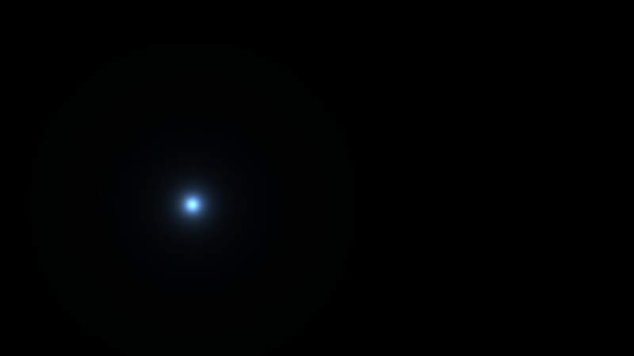

**Ergebnis:** Ein eisblauer Lichtpunkt mit weichem Halo zieht ruhige Schleifen über schwarzen Grund – wird an den Bahn-Enden langsamer, kehrt um, nimmt wieder Fahrt auf.

### Was passiert hier

Die UV-Formel ist der Standard-Opener der Serie (Ursprung Mitte, Division nur durch die Höhe → Kreise bleiben Kreise, auch auf 16:9 – das wird bei den Faltungen später noch wichtig).

**Das Licht** ist die `1/d²`-Formel aus dem Crystal-Lights-Tutorial (dort Schritt 9, geerbt von frosty caves' `flash1 = 1/dot(uva,uva)`): Helligkeit als Kehrwert des Abstandsquadrats – physikalisches Punktlicht, kein Rand, nur ein unendlich weicher Abfall. Die `0.0004` im Nenner kappen die Singularität bei `d = 0` (Kernhelligkeit `0.0006/0.0004 = 1.5`), der Zähler `0.0006` ist der Gesamt-Helligkeitsregler. Das Vorbild-Preset benutzt übrigens `1/d` statt `1/d²` (`ret1 = .../(0.01+length(...))`) – ein *breiterer* Abfall, mehr Halo, weniger Kern; wir starten mit der schärferen Variante und machen die weiche zur 🎨-Option.

**Die Bahn** ist eine Lissajous-Figur: zwei Sinusse mit inkommensurablen Frequenzen (`0.31` und `0.23` – keine ist ein Vielfaches der anderen), also wiederholt sich die Schleife praktisch nie. Und weil die **Position** eine glatte Funktion ist (nicht die Geschwindigkeit!), sind die Richtungsumkehrungen gratis weich – die spinAngle-Lektion der Serie, hier in ihrer einfachsten Form. In einem Feedback-Shader ist das doppelt wichtig: Der Punkt malt gleich *Spuren*, und jede Ecke in seiner Bahn stünde als Knick für Sekunden im Bild.

### 🎨 Experimentieren

- Die Preset-Variante: `float licht = 0.006 / (0.01 + length(d));` → breiter Glimmer statt Nadelstich (Zähler mit angepasst, sonst zu dunkel)
- `vec2(0.35, 0.25)` → `vec2(0.55, 0.45)`: weite Bahn bis fast an den Rand – gleich mit Feedback wird das den Unterschied zwischen „Zentrum-Mandala" und „Raumgreifend" machen
- Frequenzen gleichschalten (`0.31/0.31`) → die Bahn kollabiert zur Diagonale; der beste Beweis, was die Inkommensurabilität leistet

---

## Schritt 2 – Die Lichtsaat: Punkte-Paar, Ring, Palette

**Neu:** Aus dem einen Licht wird die `seeds()`-Funktion – ein punktsymmetrisches Lichter-**Paar** und ein atmender **Ring**, alle über eine Cosinus-Palette eingefärbt. Das ist die komplette Farbquelle des fertigen Shaders.

```glsl
// ---- STELLSCHRAUBEN --------------------------------------------------------
const float SEED_HELL  = 1.0;    // Gesamthelligkeit der Lichtsaat
const float BAHN_WEITE = 0.35;   // Radius der Lissajous-Bahn
// ----------------------------------------------------------------------------

// Cosinus-Palette: t -> Farbe; drei phasenversetzte Wellen
vec3 palette(float t)
{
    return 0.55 + 0.45 * cos(6.28318 * (t + vec3(0.0, 0.33, 0.67)));
}

// Die Lichtsaat: Punkte-Paar + Ring, jede Zutat auf eigener sin-Uhr
vec3 seeds(vec2 uv)
{
    vec3 acc = vec3(0.0);

    // (a) Punkte-Paar: EINE Bahn, zwei Lichter punktsymmetrisch dazu
    vec2 pos = vec2(sin(iTime * 0.31), sin(iTime * 0.23))
             * BAHN_WEITE * vec2(1.0, 0.7);
    vec3 farbe = palette(iTime * 0.021);

    vec2 d1 = uv - pos;
    vec2 d2 = uv + pos;                    // das Gegenstueck: Punktspiegelung
    acc += farbe     * 0.0006 / (0.0004 + dot(d1, d1));
    acc += farbe.bgr * 0.0006 / (0.0004 + dot(d2, d2));  // Kanaele getauscht

    // (b) Ring: Abstand zur KREISLINIE statt zum Punkt; der Radius atmet
    float r  = 0.26 + 0.10 * sin(iTime * 0.171);
    float dr = length(uv) - r;
    acc += palette(iTime * 0.021 + 0.5) * 0.0012 / (0.0008 + 8.0 * dr * dr);

    return acc * SEED_HELL;
}

void mainImage(out vec4 fragColor, in vec2 fragCoord)
{
    vec2 uv = (fragCoord - 0.5 * iResolution.xy) / iResolution.y;
    fragColor = vec4(seeds(uv), 1.0);
}
```

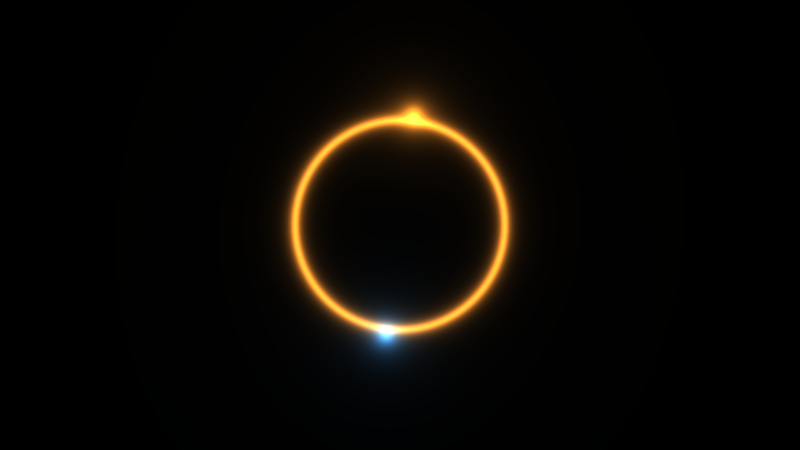

**Ergebnis:** Zwei Lichtpunkte in Komplementärfarben umkreisen einander punktsymmetrisch, dazwischen pulsiert ein dünner Leuchtring – und die Farben aller drei wandern in Zeitlupe durch den Farbkreis.

### Was passiert hier

Alle drei Zutaten sind wörtliche Übersetzungen aus dem Comp-Shader des Vorbild-Presets:

- **Das Paar:** Das Preset berechnet *eine* Position `pos = float2(sin(q10*3.14), cos(...))` und setzt zwei Lichter auf `uv - pos` **und** `uv + pos` – Punktspiegelung am Zentrum. Warum? Weil gleich ein Kaleidoskop folgt: Symmetrische Saat + Spiegel-Faltung verstärken einander, das Mandala „rastet ein". Und der Farbtrick ist derselbe: Das Preset gibt dem Gegenstück die Farbe `.bgr` – Rot- und Blaukanal getauscht, aus Orange wird Cyan. Ein Swizzle als Komplementärfarben-Generator.
- **Der Ring:** `length(uv) - r` ist der vorzeichenbehaftete Abstand zur Kreislinie; das Quadrat davon in den `1/d²`-Nenner ergibt eine leuchtende Linie statt eines Punkts (Preset: `.../(0.02+8*pow(length(uv)-r1,2))` – die `8.0` ist die Strichbreite, exakt übernommen). Merken: **Jede Abstandsfunktion wird per `1/(a + k·d²)` zum Leuchtobjekt** – der Wellenform-Seed in Anhang A wird genau so aus einer Kurve gebaut.
- **Die Palette:** die bekannte Cosinus-Palette der Serie. Das Preset erledigt seine Farbdrift mit `roam_sin` (langsam wandernde Zufalls-Sinusse pro Kanal) – unsere Palette auf einer `0.021`-Uhr ist die deterministische Fassung derselben Idee: Die Farbwelt ist nie statisch, aber auch nie sprunghaft.

Die Bahn-Stauchung `vec2(1.0, 0.7)` hält die Figur im 16:9-sicheren Bereich, und alle Uhren (`0.31`, `0.23`, `0.171`, `0.021`) bleiben inkommensurabel – vier Zutaten, die nie gemeinsam „einrasten".

### 💡 Warum so dunkel?

Kernhelligkeit ~1.5, Halo fast schwarz – als Standbild wirkt die Saat mager. Absicht: **Diese Funktion wird gleich pro Frame in ein Gedächtnis addiert.** Was der Ein-Pass-Shader einmal zeigt, summiert das Feedback über Dutzende Frames – eine Saat, die als Bild „gut aussieht", ist im Kreislauf sofort überbelichtet. Die Konstanten hier sind schon auf ihren künftigen Job kalibriert. (Die genaue Rechnung – Faktor 10 bei `DECAY = 0.9` – steht in Schritt 4.)

### 🎨 Experimentieren

- `farbe.bgr` → `farbe.grb` bzw. `1.0 - farbe`: andere Komplement-Logiken – jede gibt dem Paar ein anderes Farbklima
- Ring-Breite `8.0` → `40.0`: Haarlinie; `2.0`: weicher Farbwall
- Einen dritten Seed-Typ dazubauen: eine leuchtende **Linie** durch die Mitte, `float dl = dot(uv, vec2(cos(a), sin(a)));` mit langsamem `a`, dann `1/(0.0008 + 30.0*dl*dl)` – der Platzhalter für den Wellenform-Seed aus Anhang A
- `SEED_HELL = 3.0` einmal merken und in Schritt 4 wieder ausprobieren – dort hat dieselbe Zahl plötzlich dramatische Folgen

---
## Schritt 3 – Buffer A: das Bild bekommt ein Gedächtnis (und brennt aus)

**Neu:** Der Umzug in den Multipass – Buffer A liest **sich selbst** und sieht damit sein eigenes Vorframe. Wir addieren die Seeds naiv obendrauf und schauen dem System beim (absichtlichen) Ausbrennen zu – der wichtigste Fehlversuch des Tutorials.

**So legst du den Multipass auf shadertoy.com an:**

1. Im Editor auf das **„+"** neben dem „Image"-Tab klicken → **Buffer A** wählen. Es gibt jetzt zwei Tabs, jeder ist ein eigener `mainImage`-Shader.
2. Im Tab **Buffer A** unten die Kachel **iChannel0** anklicken → Reiter *Misc* → **Buffer A**. Ja, wirklich: Der Buffer bekommt **sich selbst** als Eingang. Shadertoy löst das per Ping-Pong (zwei Texturen im Wechsel) – gelesen wird immer das **Vorframe**, nie das eigene Halbfertige.
3. Im Tab **Image** ebenso **iChannel0 = Buffer A** setzen.

Der Code der beiden Tabs:

**Buffer A** *(iChannel0 = Buffer A – die Selbstreferenz!)*

```glsl
// ---- STELLSCHRAUBEN --------------------------------------------------------
const float SEED_HELL  = 1.0;    // Gesamthelligkeit der Lichtsaat
const float BAHN_WEITE = 0.35;   // Radius der Lissajous-Bahn
// ----------------------------------------------------------------------------

vec3 palette(float t)
{
    return 0.55 + 0.45 * cos(6.28318 * (t + vec3(0.0, 0.33, 0.67)));
}

vec3 seeds(vec2 uv)
{
    vec3 acc = vec3(0.0);

    vec2 pos = vec2(sin(iTime * 0.31), sin(iTime * 0.23))
             * BAHN_WEITE * vec2(1.0, 0.7);
    vec3 farbe = palette(iTime * 0.021);

    vec2 d1 = uv - pos;
    vec2 d2 = uv + pos;
    acc += farbe     * 0.0006 / (0.0004 + dot(d1, d1));
    acc += farbe.bgr * 0.0006 / (0.0004 + dot(d2, d2));

    float r  = 0.26 + 0.10 * sin(iTime * 0.171);
    float dr = length(uv) - r;
    acc += palette(iTime * 0.021 + 0.5) * 0.0012 / (0.0008 + 8.0 * dr * dr);

    return acc * SEED_HELL;
}

void mainImage(out vec4 fragColor, in vec2 fragCoord)
{
    vec2 uv = (fragCoord - 0.5 * iResolution.xy) / iResolution.y;

    // Vorframe an derselben Stelle lesen. Frame 0 liefert Schwarz -
    // ein frischer Buffer startet leer (das "Anlaufverhalten", siehe Text).
    vec3 alt = texture(iChannel0, fragCoord / iResolution.xy).rgb;

    // NAIV: einfach aufaddieren - ABSICHTLICH falsch, siehe Text!
    fragColor = vec4(alt + seeds(uv), 1.0);
}
```

**Image** *(iChannel0 = Buffer A)*

```glsl
void mainImage(out vec4 fragColor, in vec2 fragCoord)
{
    // vorerst reine Anzeige: Buffer A unveraendert auf den Schirm
    fragColor = vec4(texture(iChannel0, fragCoord / iResolution.xy).rgb, 1.0);
}
```

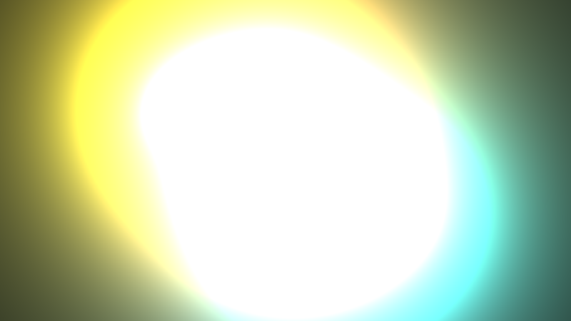

**Ergebnis:** Für zwei, drei Sekunden ist es wunderschön: Die Lichter ziehen leuchtende Spuren, der Ring malt Schlieren übereinander. Dann kippt es – die Spuren werden weiß, das Weiß frisst sich übers Bild, nach einer Minute ist alles eine gleißende Fläche. **Das System brennt aus.**

### Was passiert hier

**Die Selbstreferenz ist der ganze Trick.** Ein Fragment-Shader hat kein Gedächtnis – jeder Frame beginnt bei null. Aber ein Buffer, der sich selbst als Eingang liest, sieht das, was er *letzten* Frame geschrieben hat: `texture(iChannel0, ...)` in Buffer A liefert das **Vorframe**. Damit wird aus dem zustandslosen Shader ein **dynamisches System**: `bild[n] = f(bild[n-1])`. Alles Weitere in diesem Tutorial ist Arbeit an diesem `f`.

**Frame 0 ist schwarz.** Ein frisch angelegter (oder durch Fenster-Resize geleerter) Buffer enthält nichts – das System läuft aus dem Nichts an und braucht ein paar Dutzend Frames, bis es „eingeschwungen" ist. Bei uns füllen die Seeds das Bild binnen Sekunden; merken sollte man sich das Prinzip trotzdem: **Ein Feedback-Shader hat einen Kaltstart.** (In LumiViz ist genau dieses Anlaufverhalten ein bewusst behandeltes Thema – Stichwort Puffer-Wechsel-Verhalten und Start-Fade; Anhang B streift es.)

**Und das Ausbrennen?** Unsere Regel lautet `neu = alt + saat` – es kommt jeden Frame etwas dazu und **nie etwas weg**. Die Bildhelligkeit ist eine Summe ohne oberes Ende. Dass die Anzeige bei Weiß „stehenbleibt", täuscht: Shadertoy-Buffer sind **32-Bit-Float**-Texturen, die Werte klettern munter weiter (nach einer Minute stehen dort Hunderte). Das ist der fundamentale Hasard jedes Feedback-Systems, und er hat einen Namen: **positive Rückkopplung**. Jedes Mikrofon vor seinem eigenen Lautsprecher demonstriert ihn akustisch.

🧠 **Merke:** Ein Feedback-System braucht eine **Bilanz**: Was pro Frame dazukommt (Seeds), muss pro Frame auch wieder verschwinden können. Der Gegenspieler heißt Decay – nächster Schritt.

### 🎨 Experimentieren

- Fenstergröße ändern → der Buffer wird geleert, der Kaltstart ist direkt beobachtbar
- `alt * 1.001` statt `alt` → selbst ein Zuwachs von 0.1 % pro Frame explodiert; nur die Zeitskala ändert sich (Exponentialfunktion!)
- `alt * 0.999` → verblüffend: schon *das* reicht als Bremse fast aus – ein Vorgeschmack auf Schritt 4
- Im Image-Tab `sqrt()` um den Texture-Read → die frühen Sekunden des Ausbrennens in Zeitlupe ansehen

---

## Schritt 4 – Decay: die Vergessenskurve

**Neu:** Die eine Zeile, die das System stabil macht – `alt * DECAY` mit `DECAY < 1`. Milkdrops `ret *= 0.9`, und dahinter eine kleine, sehr nützliche Rechnung: die geometrische Reihe.

**Buffer A** *(iChannel0 = Buffer A)*

```glsl
// ---- STELLSCHRAUBEN --------------------------------------------------------
const float SEED_HELL  = 1.0;    // Gesamthelligkeit der Lichtsaat
const float BAHN_WEITE = 0.35;   // Radius der Lissajous-Bahn
const float DECAY      = 0.90;   // NEU: Daempfung je Frame - MUSS < 1 bleiben!
// ----------------------------------------------------------------------------

vec3 palette(float t)
{
    return 0.55 + 0.45 * cos(6.28318 * (t + vec3(0.0, 0.33, 0.67)));
}

vec3 seeds(vec2 uv)
{
    vec3 acc = vec3(0.0);

    vec2 pos = vec2(sin(iTime * 0.31), sin(iTime * 0.23))
             * BAHN_WEITE * vec2(1.0, 0.7);
    vec3 farbe = palette(iTime * 0.021);

    vec2 d1 = uv - pos;
    vec2 d2 = uv + pos;
    acc += farbe     * 0.0006 / (0.0004 + dot(d1, d1));
    acc += farbe.bgr * 0.0006 / (0.0004 + dot(d2, d2));

    float r  = 0.26 + 0.10 * sin(iTime * 0.171);
    float dr = length(uv) - r;
    acc += palette(iTime * 0.021 + 0.5) * 0.0012 / (0.0008 + 8.0 * dr * dr);

    return acc * SEED_HELL;
}

void mainImage(out vec4 fragColor, in vec2 fragCoord)
{
    vec2 uv = (fragCoord - 0.5 * iResolution.xy) / iResolution.y;

    vec3 alt = texture(iChannel0, fragCoord / iResolution.xy).rgb;

    // GEAENDERT: der Gegenspieler - jeder alte Wert verliert 10% pro Frame
    vec3 neu = alt * DECAY + seeds(uv);

    fragColor = vec4(neu, 1.0);
}
```

**Image** *(iChannel0 = Buffer A – unverändert, der Vollständigkeit halber)*

```glsl
void mainImage(out vec4 fragColor, in vec2 fragCoord)
{
    fragColor = vec4(texture(iChannel0, fragCoord / iResolution.xy).rgb, 1.0);
}
```

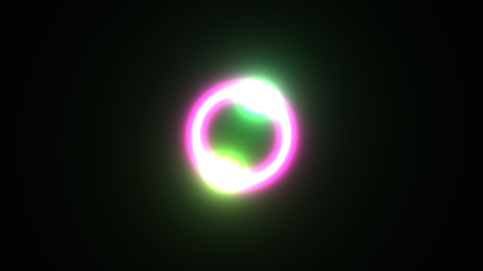

**Ergebnis:** Das Bild kippt nicht mehr. Die Lichter ziehen kurze, satte Schweife hinter sich her, die weich ins Schwarz auslaufen; der Ring hinterlässt geisterhafte Echos seiner letzten Pulse. Das System **atmet** – es vergisst genauso schnell, wie es lernt.

### Was passiert hier – die Mathematik des Vergessens

`neu = alt * 0.9 + saat` heißt: Jeder eingezahlte Lichtwert verliert pro Frame 10 %. Zwei Konsequenzen, beide ausrechenbar:

1. **Die Schweiflänge.** Ein einmal gemalter Punkt ist nach `n` Frames noch `0.9^n` hell. Halbwert nach `ln(0.5)/ln(0.9) ≈ 6.6` Frames – bei 60 fps also ~0.11 s sichtbarer Schweif. `DECAY = 0.97` ergäbe ~23 Frames Halbwert, fast 0.4 s: träumerische Schleier statt knackiger Spuren.
2. **Das Gleichgewicht.** Ein Licht, das *stillsteht*, pumpt jeden Frame denselben Wert `s` in dieselben Pixel. Die Summe `s + 0.9s + 0.81s + ...` ist die geometrische Reihe – sie konvergiert gegen `s/(1-DECAY) = 10·s`. **Der Feedback-Kessel verzehnfacht die Saat.** Genau deshalb war `seeds()` in Schritt 2 so dunkel kalibriert: Kernhelligkeit 1.5 wird im Stand zu 15 – das Tonemapping in Schritt 12 fängt solche Werte elegant ab, aber ohne die Vorab-Untertreibung wäre hier längst alles weiß. Und wer jetzt das gemerkte `SEED_HELL = 3.0` probiert, sieht: kein Ausbrennen mehr (die Reihe konvergiert ja), aber eine hart übersteuerte Bildmitte.

**Framerate-Ehrlichkeit:** „10 % pro Frame" ist eine *Frame*-Größe, keine Zeit-Größe. Auf einem 144-Hz-Monitor sind die Schweife entsprechend kürzer (mehr Dämpfungsschritte pro Sekunde), auf einem müden Laptop länger. Milkdrop-Presets leben seit jeher mit genau dieser Eigenheit; die saubere Lösung (`pow(DECAY, 60.0*iTimeDelta)`) existiert, kostet aber die schöne Ganzzahl-Intuition – wir bleiben beim Frame-Rezept des Originals und *wissen* um die Abhängigkeit.

### 💡 Warum multiplikativ und nicht subtraktiv?

`alt - 0.01` würde auch dämpfen – aber linear: Helle Stellen blieben lange hell, dunkle würden ins Negative rutschen. Der Faktor dagegen wirkt **relativ**: Jeder Wert verliert denselben *Anteil*, die Abklingkurve ist exponentiell, und Exponentialkurven sehen organisch aus (Glühen, Hall, Nachbild – die Natur klingt exponentiell ab). Zudem ist `alt * k` bei `k < 1` beweisbar stabil: Beschränkte Saat ⇒ beschränktes Bild, immer.

### 🎨 Experimentieren

- `DECAY` durchspielen: `0.80` (nervös, fast schweiflos) · `0.90` (Preset-Wert) · `0.96` (Nebelschleier) · `0.995` (das Bild vergisst fast nichts – meditativ, aber matschig)
- `DECAY = 1.0` → der kontrollierte Rückfall in Schritt 3; `1.001` → Explosion mit Ansage
- Farbiges Vergessen: `alt * vec3(0.88, 0.90, 0.92)` → Schweife kühlen beim Ausklingen ins Blaue ab (Rot stirbt zuerst – derselbe Beer-Lambert-Gedanke wie beim Kristall-Tutorial, nur in der Zeit statt im Raum!)

---

## Schritt 5 – Die Lese-Transformation: Zoom und Drehung

**Neu:** Das Vorframe wird nicht mehr an derselben Stelle gelesen, sondern **leicht gezoomt und gedreht** – Milkdrops `zoom`/`rot` als Lese-UV-Transformation. Aus Schweifen werden Strudel.

**Buffer A** *(iChannel0 = Buffer A – zum letzten Mal als Voll-Listing)*

```glsl
// ---- STELLSCHRAUBEN --------------------------------------------------------
const float SEED_HELL  = 1.0;    // Gesamthelligkeit der Lichtsaat
const float BAHN_WEITE = 0.35;   // Radius der Lissajous-Bahn
const float DECAY      = 0.90;   // Daempfung je Frame (< 1!)
const float ZOOM       = 1.010;  // NEU: > 1 = Inhalt waechst nach aussen
const float DREH       = 0.006;  // NEU: Drehung in Radiant PRO FRAME
// ----------------------------------------------------------------------------

#define R(a) mat2(cos(a), sin(a), -sin(a), cos(a))

// NEU: zentrierte Koordinaten -> 0..1-Texturkoordinaten (fuers Sampling)
vec2 uvZuTex(vec2 uv)
{
    return uv * vec2(iResolution.y / iResolution.x, 1.0) + 0.5;
}

vec3 palette(float t)
{
    return 0.55 + 0.45 * cos(6.28318 * (t + vec3(0.0, 0.33, 0.67)));
}

vec3 seeds(vec2 uv)
{
    vec3 acc = vec3(0.0);

    vec2 pos = vec2(sin(iTime * 0.31), sin(iTime * 0.23))
             * BAHN_WEITE * vec2(1.0, 0.7);
    vec3 farbe = palette(iTime * 0.021);

    vec2 d1 = uv - pos;
    vec2 d2 = uv + pos;
    acc += farbe     * 0.0006 / (0.0004 + dot(d1, d1));
    acc += farbe.bgr * 0.0006 / (0.0004 + dot(d2, d2));

    float r  = 0.26 + 0.10 * sin(iTime * 0.171);
    float dr = length(uv) - r;
    acc += palette(iTime * 0.021 + 0.5) * 0.0012 / (0.0008 + 8.0 * dr * dr);

    return acc * SEED_HELL;
}

void mainImage(out vec4 fragColor, in vec2 fragCoord)
{
    vec2 uv = (fragCoord - 0.5 * iResolution.xy) / iResolution.y;

    // GEAENDERT - Lese-UV: WO im Vorframe schaut dieser Pixel nach?
    // Teilen durch ZOOM liest naeher an der Mitte -> der Inhalt
    // erscheint jeden Frame ein Stueck weiter AUSSEN.
    vec2 lese = R(-DREH) * (uv / ZOOM);

    vec3 alt = texture(iChannel0, uvZuTex(lese)).rgb;

    vec3 neu = alt * DECAY + seeds(uv);
    fragColor = vec4(neu, 1.0);
}
```

**Image:** unverändert (reine Anzeige wie in Schritt 3).

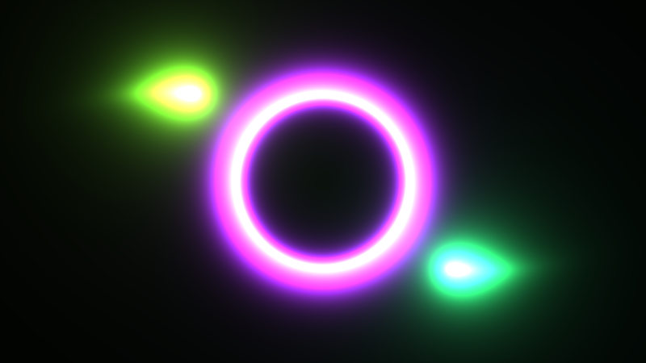

**Ergebnis:** Die Schweife stehen nicht mehr still – alles Gemalte driftet langsam nach außen und dreht sich dabei: Aus den Lichtspuren werden **Spiralen**, der Ring hinterlässt konzentrisch auswandernde Echo-Ringe, und die Bildmitte wirkt wie eine Quelle, aus der das Bild quillt.

### Was passiert hier

**Die Richtungs-Logik verwirrt anfangs jeden, darum einmal langsam:** Pixel `p` fragt „was stand letzten Frame bei `p / ZOOM`?" – also *näher an der Mitte*. Der Inhalt von innen erscheint eine Spur weiter außen: **Teilen durch einen Wert > 1 = Auswärts-Bewegung.** Das ist exakt Milkdrops Konvention (`zoom = 1.01` im Preset-Kopf: `zoom=1.00990` – unser Wert ist eine Hommage), und der Merksatz lautet: *Die Lese-Transformation ist die Umkehrung der sichtbaren Bewegung.* Genauso die Drehung: Lesen bei `R(-DREH)·uv` dreht den Inhalt pro Frame um `+DREH`.

**Das Entscheidende: Die Transformation wird jeden Frame ERNEUT angewendet.** Ein Punkt am Radius `r` sitzt nach `n` Frames bei `r · ZOOM^n` – die Bewegung ist keine einmalige Verzerrung, sondern eine **Geschwindigkeit**, die der Buffer aufintegriert. Bei `ZOOM = 1.010` verdoppelt sich jeder Radius nach `ln(2)/ln(1.01) ≈ 70` Frames (~1.2 s). Zoom und Drehung zusammen ergeben pro Bildpunkt eine logarithmische Spirale – die Signatur-Bewegung aller Milkdrop-Presets, jetzt weißt du, woher sie kommt.

**Ränder:** Bei `ZOOM > 1` liest jeder Pixel *einwärts* – nie außerhalb der Textur; die Drehung kann in den Bildecken knapp hinausgreifen, dort klemmt Shadertoys Standard-Sampler auf den Randwert (clamp). Sichtbar wird davon später nichts: Vignette und Faltungen decken die Ecken ab.

### 💡 texture() oder texelFetch()?

WebGL2 böte `texelFetch(iChannel0, ivec2(fragCoord), 0)` – exakter Pixelzugriff ohne Filterung. Für **Zustands**-Pixel (Anhang A/B3-Muster: ein Pixel = eine Zahl) ist das das richtige Werkzeug. Für unser transformiertes Lesen wäre es falsch: `uv/ZOOM` landet fast nie auf einem Texelzentrum, und `texture()` mit bilinearem Filter interpoliert die vier Nachbarn – **diese winzige Weichzeichnung bei jedem Umlauf ist kein Makel, sondern ein Systembaustein**: Sie diffundiert die Schweife weich (Milkdrop erbt denselben Effekt von seiner Textur-Hardware) und sie bändigt gleich in Schritt 6 den Sharpen. Also: `texture()` mit UV reicht – und ist hier sogar die einzig richtige Wahl.

### 🎨 Experimentieren

- `ZOOM = 0.992` → die Bewegung kehrt um: alles stürzt in die Mitte (Implosion – gleich doppelt interessant, wenn die Faltung dazukommt)
- `DREH = 0.03` → aus Spiralen werden Wirbel; ab ~0.1 zerreißt die Drehung die Schweife sichtbar in Interpolations-Treppen
- Zoom **richtungsabhängig**: `uv / (ZOOM + 0.004*sin(atan(uv.y, uv.x)*3.0))` → dreiflügelige Quellströmung, das Preset-Erbe von `zoom -= 0.03*((sin(ang*3)<0)-0.5)` im per_pixel-Code
- `seeds()` testweise auf `* 0.0` → nur der Resthauch des Kaltstarts spiralt davon; das System braucht seine Quelle

---
## Schritt 6 – Sharpen: die Unsharp Mask

**Neu:** Das Herzstück des „Pimped"-Looks – der Kontrast-Verstärker `ret += (ret - Blur)*k` aus dem Warp-Shader des Presets. Shadertoy hat kein `GetBlur1`, also bauen wir den Blur als kleinen 4-Tap-Kernel selbst. Dazu die Stabilitätsfrage: Warum explodiert das nicht (und wann doch)?

*Ab jetzt zeigen die Schritte nur noch die geänderten bzw. neuen Funktionen – alles andere bleibt wörtlich wie im vorherigen Schritt stehen. (In Schritt 13 steht alles noch einmal komplett.)*

**Buffer A**

```glsl
// ---- STELLSCHRAUBEN (erweitert) --------------------------------------------
const float SHARPEN = 0.35;  // Unsharp-Mask-Staerke (Preset: 0.35)
// ----------------------------------------------------------------------------

// NEU: kleiner Kreuz-Blur als GetBlur1-Ersatz.
// Milkdrop haelt weichgezeichnete Bildkopien gratis vor (GetBlur1..3) -
// Shadertoy nicht, also mitteln wir die vier Pixel-Nachbarn selbst.
vec3 blur4(vec2 st)
{
    vec2 px = 1.0 / iResolution.xy;
    return ( texture(iChannel0, st + vec2( px.x, 0.0)).rgb
           + texture(iChannel0, st + vec2(-px.x, 0.0)).rgb
           + texture(iChannel0, st + vec2(0.0,  px.y)).rgb
           + texture(iChannel0, st + vec2(0.0, -px.y)).rgb ) * 0.25;
}

// GEAENDERT: mainImage - Unsharp Mask zwischen Lesen und Decay
void mainImage(out vec4 fragColor, in vec2 fragCoord)
{
    vec2 uv = (fragCoord - 0.5 * iResolution.xy) / iResolution.y;

    vec2 st  = uvZuTex(R(-DREH) * (uv / ZOOM));
    vec3 alt = texture(iChannel0, st).rgb;

    // Unsharp Mask: (Bild - weiche Kopie) = die feinen Details;
    // die geben wir dem Bild verstaerkt zurueck
    alt += (alt - blur4(st)) * SHARPEN;

    vec3 neu = max(alt * DECAY + seeds(uv), 0.0);   // nie unter Null!
    fragColor = vec4(neu, 1.0);
}
```

**Image:** unverändert.

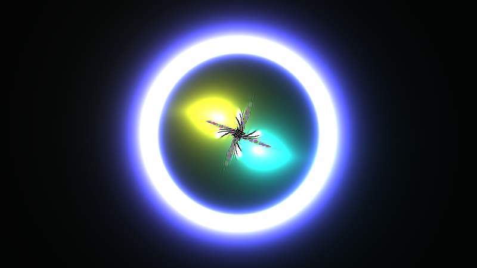

**Ergebnis:** Der Unterschied ist verblüffend: Eben noch verliefen die Spiralschweife weich ins Nichts – jetzt bekommen sie **Kanten**. Aus den Schlieren schälen sich feine, fast gezeichnete Fäden und Adern; wo sich Spuren überlagern, entstehen filigrane Interferenz-Muster. Genau der Moment, in dem aus „Nachleuchten" das *Gepimpte* des Preset-Namens wird.

### Was passiert hier

**Die Unsharp Mask** ist ein Fotolabor-Trick aus dem 19. Jahrhundert: `bild - blur(bild)` isoliert die feinen Details (der Blur enthält nur das Grobe – die Differenz ist das Feine), und diese Details addiert man dem Bild verstärkt wieder zu. Das Preset macht es wörtlich so: `ret += (ret.xyz - GetBlur1(uv))*0.35` – wobei `GetBlur1` in Milkdrop eine fertig vorberechnete Weichzeichnungs-Textur ist (das Preset definiert sich mit `Get1` sogar noch einen eigenen 7-Tap-Blur dazu). Unser `blur4` ist die Minimalfassung: vier Nachbarn, Kreuzform, ein Pixel Abstand – für eine Detail-Extraktion völlig ausreichend, und mit 4 zusätzlichen Textur-Reads billig.

**Warum verändert Schärfen ein Feedback-System so fundamental?** In einem Einzelbild hebt die Unsharp Mask Kanten einmalig an. Im Kreislauf aber wird sie **jeden Frame erneut** angewendet – sie ist kein Filter mehr, sondern ein *Wachstumsgesetz*: Feine Strukturen werden pro Umlauf verstärkt, grobe nicht. Ihr Gegenspieler ist die bilineare Filterung aus Schritt 5, die pro Umlauf feine Strukturen *glättet*. Sharpen baut auf, Filterung und Decay tragen ab – das Bild pendelt sich auf der Strukturgröße ein, wo sich beide die Waage halten. Deshalb die charakteristischen zarten Äderchen: Sie sind das **Eigenmuster des Systems**, nicht Teil der Saat. (Wer Reaktion-Diffusion-Systeme kennt: Das hier ist ein enger Verwandter – lokale Verstärkung plus Diffusion.)

**Das `max(..., 0.0)` ist keine Kosmetik.** Die Unsharp Mask kann *negative* Werte erzeugen (dunkler Saum neben heller Kante – Überschwinger sind ihr Wesen). Milkdrop lief auf 8-Bit-UNORM-Texturen, die bei 0 hart abschneiden; Shadertoys Float-Buffer schneiden **nicht** ab. Ohne Klammer sammeln sich negative Zonen im Buffer, die später einlaufende Seeds „auffressen" – tagelang unsichtbar, dann unerklärliche schwarze Löcher. Ein klassischer Portierungs-Stolperstein von D3D9-Presets zu Float-Pipelines.

### 💡 Warum explodiert das nicht?

Rechnen wir den schlimmsten Fall: ein 1-Pixel-Schachbrettmuster. Dort ist `blur4` exakt der *Gegenwert* des Pixels, die Differenz also `2·wert`, und ein Umlauf verstärkt um `(1 + 2·SHARPEN)·DECAY = 1.7·0.9 = 1.53` – **über 1, das Muster müsste explodieren!** Dass es das nicht tut, liegt allein an Schritt 5: Die Lese-UV landet durch Zoom und Drehung zwischen den Texeln, und die bilineare Interpolation löscht Ein-Pixel-Muster fast vollständig aus. Die Filterung ist der heimliche Tiefpass, der den Sharpen bändigt. Die Probe aufs Exempel: Setze `ZOOM = 1.0` und `DREH = 0.0` – jetzt liest jeder Pixel exakt sein Texelzentrum, nichts filtert mehr, und das Bild kocht binnen Sekunden in grellem Pixelgrieß hoch. **Im Feedback-System sind Bewegung und Stabilität gekoppelt** – wer die Kamera einfriert, muss den Sharpen mit einfrieren. Solche Kopplungen sind typisch; man findet sie nur durchs Ausprobieren – genau deshalb dieser Absatz.

### 🎨 Experimentieren

- `SHARPEN` durchspielen: `0.0` (weiche Schlieren, Schritt-5-Look) · `0.35` (Preset) · `0.6` (drahtige, nervöse Strukturen) · `1.0` (am Rand der Explosion – je nach ZOOM/DREH kippt es)
- Blur-Radius verdoppeln (`px * 2.0`) → die Unsharp Mask greift gröbere Strukturen ab; die Äderchen werden breiter und ruhiger
- Nur die **hellen** Details verstärken: `alt += max(alt - blur4(st), 0.0) * SHARPEN;` → Glanzfäden ohne dunkle Säume – ein ganz anderer, „gläserner" Charakter
- Die Explosion einmal absichtlich: `ZOOM = 1.0; DREH = 0.0;` – die beste Impfung gegen späteres Rätselraten

---

## Schritt 7 – Die Dither-Saat

**Neu:** Der vierte und letzte Baustein des Feedback-Rezepts: eine hauchfeine, jeden Frame andere Rausch-Beigabe – das Erbe von `ret += (tex2D(sampler_noise_lq, dither_uv)-0.1)*0.02` aus dem Preset-Warp. Sie hält dunkle Flächen am Leben und gibt dem Sharpen etwas zu beißen.

**Buffer A**

```glsl
// ---- STELLSCHRAUBEN (erweitert) --------------------------------------------
const float DITHER = 0.004;  // Staerke der Rausch-Saat je Frame
// ----------------------------------------------------------------------------

// NEU: das Hash-Idiom der Serie - deterministisch, kein echter Zufall
float hash21(vec2 p)
{
    return fract(sin(dot(p, vec2(127.1, 311.7))) * 43758.5453);
}

// GEAENDERT: mainImage - Dither zwischen Decay und Ausgabe
void mainImage(out vec4 fragColor, in vec2 fragCoord)
{
    vec2 uv = (fragCoord - 0.5 * iResolution.xy) / iResolution.y;

    vec2 st  = uvZuTex(R(-DREH) * (uv / ZOOM));
    vec3 alt = texture(iChannel0, st).rgb;

    alt += (alt - blur4(st)) * SHARPEN;

    vec3 neu = max(alt * DECAY + seeds(uv), 0.0);

    // NEU - Dither-Saat: je Frame ein anderes Muster (iFrame verschiebt das
    // Hash-Gitter), im Mittel LEICHT positiv - ein Glimmen statt reinem Zittern
    vec2 dsh = fragCoord + vec2(float(iFrame % 289), float(iFrame % 283)) * 1.618;
    neu += (hash21(dsh) - 0.45) * DITHER;

    fragColor = vec4(max(neu, 0.0), 1.0);
}
```

**Image:** unverändert.

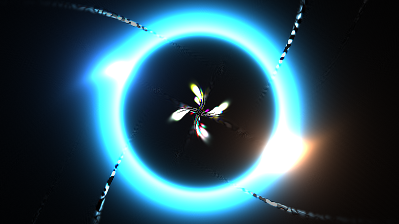

**Ergebnis:** Auf den ersten Blick kaum etwas – und genau so soll es sein. Auf den zweiten: Die tiefschwarzen Bildbereiche sind nicht mehr tot, sondern tragen ein kaum wahrnehmbares, lebendiges Grundglimmen, und in Zonen, die vorher glatt ausliefen, kristallisiert der Sharpen jetzt feinste Textur heraus – das Bild bekommt „Korn".

### Was passiert hier

Drei Aufgaben erfüllt diese unscheinbare Zeile:

1. **Der Boden.** `hash21(...) - 0.45` streut um `+0.05` statt um null – im Mittel kommt pro Frame `+0.05·DITHER = 0.0002` dazu. Mit der Gleichgewichts-Rechnung aus Schritt 4: Der Schwarzpegel pendelt sich bei `0.0002/(1-DECAY) = 0.002` ein – etwa ein halbes Achtbit-Stüfchen, unsichtbar als Helligkeit, aber **nie exakt null**. Das Preset macht mit `(noise - 0.1)*0.02` denselben asymmetrischen Trick.
2. **Das Futter.** Der Sharpen aus Schritt 6 verstärkt, was an feiner Struktur *da ist* – in einer mathematisch glatten Fläche findet er nichts. Das Dither liefert die Störkeime, aus denen die Äderchen wachsen; ohne Dither wirken die dunklen Zonen wie Plastik, mit ihm wie Material.
3. **Die Historien-Pflege.** Auf Milkdrops 8-Bit-Texturen hatte das Dithern noch einen dritten Job: Es verhinderte, dass der Decay auf Ganzzahlstufen „festfriert" (ein Wert unter einem halben Bit Änderung pro Frame rundet zurück auf sich selbst – der Abfall stoppt sichtbar in Grausockeln). Auf Float-Buffern existiert dieses Problem nicht – wir dithern trotzdem, weil die Aufgaben 1 und 2 bleiben. Ehrliche Fußnote: Wer dieses Preset auf originaler D3D9-Hardware vergleicht, vergleicht also ein *anderes* System.

Die `iFrame`-Konstruktion hält die Serie deterministisch: kein `fract(iTime*...)`-Gewackel, sondern ein Gitterversatz aus dem Frame-Zähler – Frame `n` würfelt immer dasselbe Muster. (Die Modulo-Primzahlen 289/283 lassen den Versatz lange nicht periodisch werden; `1.618` verteilt ihn irrational übers Gitter.)

### 🎨 Experimentieren

- `DITHER = 0.02` → sichtbares Analogfilm-Korn, die Äderchen wuchern deutlich schneller
- Das Dither **einfärben**: `neu += (vec3(hash21(dsh), hash21(dsh + 7.0), hash21(dsh + 13.0)) - 0.45) * DITHER;` → Farbrauschen, die dunklen Zonen schillern subtil
- Bias auf null (`- 0.5`) → das Grundglimmen verschwindet, reines Zittern bleibt; mit `- 0.35` wird der Boden hell wie Milchglas
- Dither nur, wo es dunkel ist: `* smoothstep(0.15, 0.0, dot(neu, vec3(0.33)))` → Korn im Schatten, Ruhe im Licht

---

## Schritt 8 – Winkel-Faltung: das klassische Kaleidoskop

**Neu:** Die erste von drei Faltstufen – und sie wohnt im **Image**-Pass: Alle Blickrichtungen werden in einen einzigen Winkel-Sektor gespiegelt. N-zählige Symmetrie, das Röhren-Kaleidoskop aus dem Spielzeugladen.

**Buffer A:** unverändert.

**Image** *(komplett – er bleibt klein genug)*

```glsl
// iChannel0 = Buffer A

// ---- STELLSCHRAUBEN --------------------------------------------------------
const float SEKTOREN = 6.0;   // Spiegel-Sektoren der Winkel-Faltung
// ----------------------------------------------------------------------------

vec2 uvZuTex(vec2 uv)
{
    return uv * vec2(iResolution.y / iResolution.x, 1.0) + 0.5;
}

// Winkel-Faltung: alle Richtungen in EINEN Sektor spiegeln
vec2 falteWinkel(vec2 uv, float n)
{
    float sektor = 6.28318 / n;
    float ang = atan(uv.y, uv.x);
    ang = mod(ang, sektor);
    ang = abs(ang - 0.5 * sektor);   // im Sektor spiegeln -> nahtlose Kanten
    return length(uv) * vec2(cos(ang), sin(ang));
}

void mainImage(out vec4 fragColor, in vec2 fragCoord)
{
    vec2 uv = (fragCoord - 0.5 * iResolution.xy) / iResolution.y;

    vec2 k = falteWinkel(uv, SEKTOREN);

    fragColor = vec4(texture(iChannel0, uvZuTex(k)).rgb, 1.0);
}
```

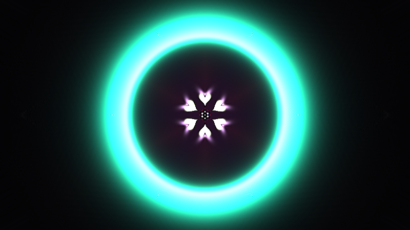

**Ergebnis:** Schlagartig Mandala: Die Spiralschweife erscheinen sechsfach um das Zentrum gespiegelt, jede Bewegung der Lichter läuft synchron in allen Sektoren, der Ring wird zur pulsierenden Rosette. Und der Buffer selbst? Weiß von alledem nichts – die Faltung ist eine reine **Anzeige-Brille**.

### Was passiert hier

Die Faltung arbeitet in Polarkoordinaten – dasselbe `atan`/`length`-Gespann wie beim Tunnel des Pyramid-Spiral-Tutorials (dort Schritt 9), nur mit anderem Ziel: Statt den Winkel als Textur-Koordinate zu benutzen, wird er **normalisiert**:

1. `mod(ang, sektor)` presst alle Winkel in den ersten Sektor – aus 360° werden 60°. Allein damit gäbe es an jeder Sektorgrenze einen **harten Sprung** (der rechte Rand des Sektors stößt an den linken der Kopie – die Bildinhalte passen nicht aneinander).
2. `abs(ang - sektor/2)` spiegelt die zweite Sektorhälfte auf die erste. Jetzt treffen sich an jeder Grenze zwei **Spiegelbilder** – die Übergänge sind mathematisch stetig, die Nähte unsichtbar. Physikalische Kaleidoskope funktionieren exakt so: Ihre Spiegel erzeugen die Winkel-Spiegelung, nicht die Rotation.

Zurückverwandelt (`r·(cos, sin)`) zeigt jeder Bildpunkt in den gefalteten **Tortenspitz** des Buffers – das Kaleidoskop schaut also nur einen schmalen Keil des Feedbacks an und tapeziert ihn 2N-fach (N Sektoren × Spiegelung) um das Zentrum. Deshalb war die punktsymmetrische Saat aus Schritt 2 so wertvoll: Die Lichter wandern regelmäßig durch den Keil, und jedes Mal „zündet" das ganze Mandala.

**Wo faltet man – Anzeige oder Kreislauf?** Eine echte Design-Entscheidung. Hier (Image) bleibt der Buffer „roh": Die Trails entwickeln sich unsymmetrisch weiter, die Brille macht die Symmetrie – nimmt man sie ab (Faltung auskommentieren), sieht man das ehrliche Innenleben; als Debug-Blick ist genau das Gold wert. Faltet man stattdessen die **Lese-UV in Buffer A**, wird die Symmetrie Teil des Systems: Jede Faltnaht wird mitgeschärft, mitgezoomt, rückgekoppelt – das Bild „kristallisiert" auf die Symmetrie zu und entwickelt fraktalere, härtere Muster. Beides ist gültig; das Preset faltet in der Anzeige (Comp), und wir folgen ihm – die Kreislauf-Variante ist die vielleicht lohnendste 🎨-Abzweigung des Tutorials.

### 🎨 Experimentieren

- `SEKTOREN`: `3.0` (grob, grafisch) · `6.0` (Klassiker) · `12.0` (Spitzendeckchen) · `1.0` (nur die Spiegelung – ein einziger „Klappspiegel" quer durchs Bild)
- Die Naht sehen: `abs`-Zeile auskommentieren → an den Sektorgrenzen reißt das Bild; wieder einkommentieren und würdigen
- Die Kreislauf-Variante: die Zeile `vec2 lese = R(-DREH) * (uv / ZOOM);` in Buffer A durch `vec2 lese = R(-DREH) * (falteWinkel(uv, 6.0) / ZOOM);` ersetzen (Funktion mit hinüberkopieren) → das Feedback selbst wird sechszählig; vergleiche die Bildcharaktere!
- Sektor-Drehung als Konstante: `ang = mod(ang + 0.3, sektor);` → das Mandala sitzt schief – interessant, aber Vorsicht: diesen Offset zu *animieren* ist eine Positions-Uhr-Falle (Anhang A warnt davor)

---
## Schritt 9 – Die Spiegel-Kachel

**Neu:** Faltstufe zwei, direkt aus dem Preset: `abs(fract(uv) - 0.5)` – die ganze Ebene wird zu einem Teppich aus gespiegelten Kopien einer einzigen Zelle. Zusammen mit der Winkel-Faltung entsteht die typische „gotische" Ornament-Dichte.

**Buffer A:** unverändert.

**Image**

```glsl
// ---- STELLSCHRAUBEN (erweitert) --------------------------------------------
const float KACHEL = 1.6;   // Kacheln pro Bildhoehe (Dichte der Spiegel-Kachel)
// ----------------------------------------------------------------------------

// NEU: Spiegel-Kachel - die Ebene als Teppich gespiegelter Kopien EINER Zelle
vec2 falteKachel(vec2 uv, float dichte)
{
    return abs(fract(uv * dichte) - 0.5) / dichte;
}

// GEAENDERT: mainImage - beide Faltungen hintereinander
void mainImage(out vec4 fragColor, in vec2 fragCoord)
{
    vec2 uv = (fragCoord - 0.5 * iResolution.xy) / iResolution.y;

    vec2 k = falteWinkel(uv, SEKTOREN);
    k = falteKachel(k, KACHEL);

    fragColor = vec4(texture(iChannel0, uvZuTex(k)).rgb, 1.0);
}
```

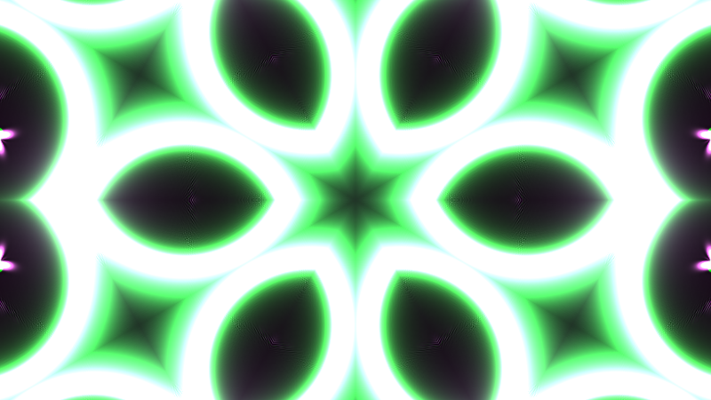

**Ergebnis:** Das Mandala bekommt eine zweite Ordnungs-Ebene: Innerhalb jedes Sektors wiederholt sich das Bild jetzt kachelweise, gespiegelt an unsichtbaren Achsen – aus der einen Rosette wird ein dichtes, teppichartiges Ornament, das an Kirchenfenster oder orientalische Fliesenspiegel erinnert. Und weil die Kacheln nur einen winzigen Ausschnitt um die Buffer-Mitte abtasten, sind die Strukturen plötzlich viel *feiner*.

### Was passiert hier

`abs(fract(x) - 0.5)` ist eine **Dreieckswelle**: Sie läuft 0.5 → 0 → 0.5, immer wieder, und ist dabei überall stetig. Auf beide Achsen angewendet, faltet sie die unendliche Ebene auf ein einziges Quadrat von halber Zellgröße – jede Kachel zeigt dieselbe Zelle, abwechselnd gespiegelt, und **an jeder Kachelgrenze treffen sich Spiegelbilder**: keine Sprünge, keine Nähte, dasselbe Stetigkeits-Argument wie bei der Winkel-Faltung, nur kartesisch statt polar. (Mathematisch ist das die Wallpaper-Symmetrie *pmm* – das Muster jeder gepunzten Blechdecke.)

Das Preset schreibt `uv3 = abs(frac(uv2*aspect.yx)-.5)` und muss sich dabei mit `aspect`-Faktoren herumschlagen, weil Milkdrops UV-Raum bildschirmverzerrt ist – **unsere höhen-normierten Koordinaten haben das Problem nicht**: Die Zellen sind automatisch quadratisch, Drehungen bleiben winkeltreu. Ein stiller Gewinn aus der UV-Konvention von Schritt 1.

Zwei Eigenheiten lohnen den Blick:

1. **Der Wertebereich schrumpft.** `falteKachel` liefert nur noch Werte in `[0, 0.5/KACHEL]` – gelesen wird also ein kleines Quadrat rechts oberhalb der Buffer-Mitte. Das gesamte Ornament speist sich aus diesem Ausschnitt; die Seeds wandern regelmäßig hindurch (ihre Bahn kreuzt die Mitte), aber ein Teil des Buffers wird schlicht nie angezeigt. Wieder gilt: Die Brille zeigt einen Keil des Keils – das System dahinter bleibt größer als sein Bild.
2. **Reihenfolge ist Gestaltung.** `falteWinkel` dann `falteKachel` (unsere Ordnung): erst Sektor-Symmetrie, dann wird der *Tortenspitz* gekachelt – das Ornament sitzt sternförmig um das Zentrum. Umgekehrt (`falteKachel` dann `falteWinkel`) wird die bereits gekachelte Koordinate in Sektoren gespiegelt – die radiale Ordnung dominiert weniger, das Bild wird flächiger, tapetenhafter. Beides ausprobieren; es gibt kein Richtig, nur Charaktere.

### 🎨 Experimentieren

- `KACHEL`: `0.8` (große, ruhige Spiegelfelder) · `1.6` (Standard) · `4.0` (Mikro-Ornament, fast Textil)
- Reihenfolge tauschen (siehe oben) – mit `SEKTOREN = 1.0` sieht man den Unterschied am deutlichsten
- Nur kacheln, nicht spiegeln: `fract(uv * dichte) / dichte - 0.25/dichte;` → die Nähte springen sichtbar; der beste Beweis, was das `abs` leistet
- Rechteck-Zellen: `abs(fract(uv * dichte * vec2(1.0, 0.5)) - 0.5) / (dichte * vec2(1.0, 0.5))` → gestreckte Spiegelbahnen, ein ganz anderer Rhythmus

---

## Schritt 10 – Rotations-Überlagerung: die anz-Schleife

**Neu:** Die dritte Faltstufe, das Markenzeichen des Presets: `anz = 3` **rotierte Kopien** des gefalteten Bildes, per `max()` übereinandergelegt. Unterwegs tappen wir absichtlich in eine Symmetrie-Falle – und lernen dabei, warum die Reihenfolge der drei Stufen nicht beliebig ist.

**Buffer A:** unverändert.

**Image**

```glsl
// ---- STELLSCHRAUBEN (erweitert) --------------------------------------------
const int KOPIEN = 3;   // Anzahl rotierte Kopien ("anz" im Preset)
// ----------------------------------------------------------------------------

#define R(a) mat2(cos(a), sin(a), -sin(a), cos(a))

// NEU: das komplette Faltwerk - Winkel-Faltung EINMAL, dann N rotierte
// Kopien der Kachel-Faltung, per max() gemischt
vec3 kaleido(vec2 uv)
{
    // Stufe 1: Winkel-Faltung VOR der Schleife (siehe Text: Symmetrie-Falle!)
    vec2 w = falteWinkel(uv, SEKTOREN);

    vec3 acc = vec3(0.0);
    for (int n = 1; n <= KOPIEN; n++) {
        float a = float(n) / float(KOPIEN) * 3.14159;   // Preset: n/anz*pi
        vec2 k = falteKachel(R(a) * w, KACHEL);         // Stufe 2+3
        acc = max(acc, texture(iChannel0, uvZuTex(k)).rgb);
    }
    return acc;
}

// GEAENDERT: mainImage
void mainImage(out vec4 fragColor, in vec2 fragCoord)
{
    vec2 uv = (fragCoord - 0.5 * iResolution.xy) / iResolution.y;

    fragColor = vec4(kaleido(uv), 1.0);
}
```

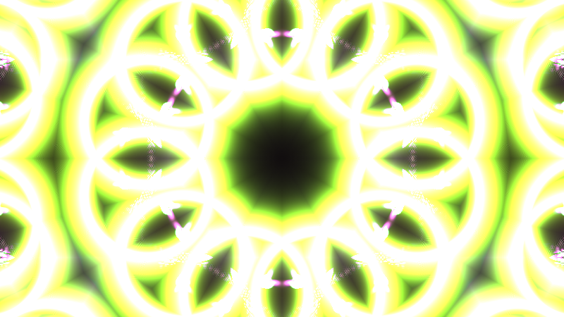

**Ergebnis:** Das Ornament verdreifacht seine Dichte, ohne heller zu werden: Drei gegeneinander verdrehte Fassungen desselben Musters liegen übereinander, und an jeder Stelle „gewinnt" die hellste – ein Geflecht aus sich durchdringenden Gittern, das je nach Seed-Stellung ständig andere Kreuzungspunkte aufleuchten lässt. Der Look des Vorbild-Presets ist damit komplett.

### Was passiert hier

**Die Falle zuerst,** denn sie ist lehrreicher als das Feature: Der naive Ansatz rotiert das *rohe* `uv` und faltet dann – `falteWinkel(R(a) * uv, 6.0)`. Rechne nach, was bei `KOPIEN = 3` passiert: Die Winkel sind 60°, 120°, 180° – alles **Vielfache des Sektorwinkels** (360°/6 = 60°), und `mod(ang + 60°, 60°) = mod(ang, 60°)`. Die Winkel-Faltung *schluckt* jede Sektor-Rotation restlos: **alle drei Kopien wären identisch**, die Schleife ein teures Nichts. Deshalb steht die Rotation bei uns **zwischen** den Faltungen: Der gefaltete Keil `w` wird gedreht und trifft dann auf das achsenfeste Kachel-Gitter – das bricht die Symmetrie, jede Kopie tastet einen anderen Kachel-Ausschnitt ab. (Das Preset hat das Problem nicht, weil es gar keine Winkel-Faltung besitzt: rotieren → kacheln, fertig. Sobald man Faltstufen *kombiniert*, muss man ihre Symmetrien gegeneinander prüfen – die allgemeine Lektion dieses Schritts.)

**Das `max()`-Mischen** ist die zweite Design-Entscheidung. Addieren würde die drei Kopien aufsummieren – dreifache Helligkeit, schnelle Übersteuerung. `max()` dagegen lässt an jeder Stelle nur die hellste Kopie durch: Die Überlagerung wird **dichter, aber nicht heller** – Strukturen *verzahnen* sich, statt sich aufzuhellen; dunkle Partien einer Kopie werden von hellen einer anderen gefüllt. Für Feedback-Material mit seinen glühenden Kernen ist das die deutlich gutmütigere Mischung.

**Eine Ehrlichkeits-Fußnote zum Vorbild:** Die berühmte Preset-Zeile `ret1 = max(ret1, neu+ret1)` sieht nach max-Mischung aus – ist aber keine: Da `neu` nie negativ ist, gilt `max(x, neu+x) = x + neu`, die Schleife **addiert** schlicht auf. Das echte `max` des Presets steckt eine Zeile früher: `neu = max(GetPixel(uv3), GetBlur1(uv3))/2` – pro Kopie gewinnt der hellere von scharfem und weichem Bild (ein Glow-Trick: Halos können den Kern überstrahlen). Wir haben uns das `max` als *Misch*-Operator herausgegriffen, weil er das robustere Werkzeug ist; die additive Preset-Treue steht unten als Variante. So oder so: Beim Nachbauen fremder Shader lohnt es, jede Zeile *auszurechnen* statt ihr Aussehen zu übernehmen.

Die Rotationswinkel `n/anz·π` (nicht 2π!) stammen ebenfalls aus dem Preset – dank der Spiegelsymmetrien der Kachel decken 180° bereits alle unterscheidbaren Lagen ab.

### 🎨 Experimentieren

- `KOPIEN`: `1` (pures Schritt-9-Bild) · `3` (Preset) · `5` (dichtes Moiré-Geflecht; ab ~7 verschwimmt alles zu Grau)
- Die Preset-treue Mischung: `acc += texture(...).rgb / float(KOPIEN);` → weicher, gleichmäßiger, weniger „verzahnt" – direkt vergleichen
- Der Glow-Trick des Originals: in der Schleife `vec3 p1 = texture(iChannel0, uvZuTex(k)).rgb; vec3 p2 = ...(k + 0.004)...; acc = max(acc, max(p1, p2));` als billige GetBlur-Näherung – die Kanten bekommen Aura
- Die Falle vorführen: `falteKachel(R(a) * w, ...)` → `falteKachel(falteWinkel(R(a) * uv, SEKTOREN), ...)` und `KOPIEN = 3`, `SEKTOREN = 6` – drei identische Kopien, totes `max()`. Dann `SEKTOREN = 7` (Winkel nicht mehr kommensurabel) – und es lebt wieder. Symmetrie ist unerbittlich arithmetisch

---

## Schritt 11 – Die unsichtbare Kamera

**Neu:** Dieses Tutorial hat keine Kamera im Raymarching-Sinn – aber es hat etwas Gleichwertiges: die **Lese-Transformation des Feedbacks**. Jetzt wird sie lebendig: Das Zoom-Zentrum driftet, die Drehung wechselt weich die Richtung, der Zoom atmet. Drei sin-Uhren, und das ganze System beginnt zu *navigieren*.

**Buffer A**

```glsl
// ---- STELLSCHRAUBEN (erweitert) --------------------------------------------
const float TEMPO = 1.0;   // Gesamttempo der unsichtbaren Kamera
// ----------------------------------------------------------------------------

// GEAENDERT: mainImage - die starre Lese-Zeile wird zur Choreografie
// (die Konstante DREH entfaellt; TEMPO kommt neu dazu)
void mainImage(out vec4 fragColor, in vec2 fragCoord)
{
    vec2 uv = (fragCoord - 0.5 * iResolution.xy) / iResolution.y;
    float zt = iTime * TEMPO;

    // (a) Das Zoom-Zentrum driftet auf einer kleinen Lissajous-Bahn
    vec2 zentrum = vec2(sin(zt * 0.043), sin(zt * 0.037)) * 0.10;

    // (b) Drehung: eine GESCHWINDIGKEIT, die weich die Richtung wechselt
    float dreh = 0.010 * sin(zt * 0.021);

    // (c) Zoom: atmet um den Grundwert (bleibt hier immer > 1)
    float zoom = ZOOM + 0.006 * sin(zt * 0.029);

    // Transformation UM das wandernde Zentrum herum
    vec2 lese = zentrum + R(-dreh) * ((uv - zentrum) / zoom);

    vec2 st  = uvZuTex(lese);
    vec3 alt = texture(iChannel0, st).rgb;

    // ... ab hier unveraendert: Sharpen, Decay+Seeds, Dither (Schritt 7)
    alt += (alt - blur4(st)) * SHARPEN;
    vec3 neu = max(alt * DECAY + seeds(uv), 0.0);
    vec2 dsh = fragCoord + vec2(float(iFrame % 289), float(iFrame % 283)) * 1.618;
    neu += (hash21(dsh) - 0.45) * DITHER;
    fragColor = vec4(max(neu, 0.0), 1.0);
}
```

**Image:** unverändert.

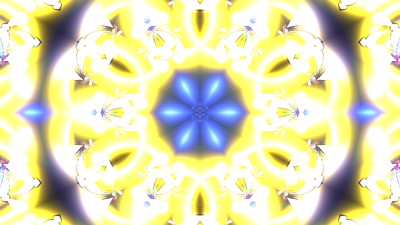

**Ergebnis:** Bisher quoll das Bild gleichförmig aus der Mitte – jetzt hat die Strömung ein **Wetter**: Die Quelle wandert langsam durchs Bild und zieht die Spiralarme mit sich; die Drehrichtung der Wirbel kehrt alle halbe Minute weich um (die Arme wickeln sich auf, stehen kurz, wickeln sich andersherum); das Ausströmen wird mal drängender, mal zögernder. Durch die Faltungs-Brille wirkt das Mandala dadurch nie zweimal gleich – es *lebt*, ohne dass irgendwo Zufall im Spiel wäre.

### Was passiert hier

Die Konstruktion `zentrum + R(-dreh)·((uv - zentrum)/zoom)` ist die Transformation aus Schritt 5, nur **um einen beliebigen Punkt herum** statt um den Ursprung: verschieben, transformieren, zurückschieben – das Standard-Rezept für „rotiere/skaliere um P". Milkdrop nennt dieselben Größen `cx/cy`; das driftende Zentrum entspricht einem animierten `cx/cy` im per_frame-Code.

### 💡 Warum diese „Kamera" anders tickt als jede Raymarching-Kamera

In den 3D-Tutorials der Serie galt das eherne Gesetz: **Position als glatte Funktion der Zeit**, niemals „Geschwindigkeit aufaddieren" – ein Shader hat kein Gedächtnis, das eine Integration tragen könnte. Hier liegt der Fall fundamental anders: **Dieses System HAT ein Gedächtnis – den Buffer selbst.** Die Lese-Transformation wird jeden Frame erneut angewendet; was wir mit `dreh` und `zoom` steuern, ist darum keine Position, sondern eine **Geschwindigkeit**, und der Buffer integriert sie für uns auf. Konkret: `dreh = 0.010·sin(...)` heißt nicht „das Bild steht um 0.01 rad verdreht", sondern „das Bild dreht *derzeit* mit 0.01 rad **pro Frame**" – die tatsächliche Verdrehung ist die aufgelaufene Summe, und weil unsere sin-Uhr symmetrisch um null pendelt, wickelt sie sich im Mittel auch wieder aus. Beide Welten haben also dieselbe Moral mit vertauschten Vorzeichen: Im zustandslosen Shader muss man Positionen vorgeben, im Feedback-System darf – und sollte – man Geschwindigkeiten vorgeben. (Für Audio-Mappings wird genau diese Unterscheidung in Anhang A zur Trennlinie zwischen „gefahrlos" und „Falle".)

Die drei Uhren (`0.043`, `0.037`, `0.021`, `0.029` – plus die vier Seed-Uhren) bleiben inkommensurabel: acht Zeitläufe, kein gemeinsamer Takt, die Gesamtfigur wiederholt sich praktisch nie. Und ein Detail mit großer Wirkung: Das *Zentrum* ist eine **Position** (direkt gesetzt, keine Integration) – es darf deshalb sorglos auf einer sin-Bahn fahren. Nur die integrierenden Größen (`dreh`, `zoom`) brauchen den Blick auf ihr Langzeit-Mittel.

### 🎨 Experimentieren

- Zoom-Amplitude `0.006` → `0.02`: der Zoom unterschreitet zeitweise 1.0 – **Implosions-Phasen**, in denen die Strömung umkehrt und die Arme ins Zentrum stürzen; einer der schönsten Momente dieses Systems
- Zentrum-Radius `0.10` → `0.30`: die Quelle wandert bis unter die Faltnähte – das Mandala „pumpt" sichtbar asymmetrisch
- `TEMPO = 0.3` → Zeitlupen-Meditation; `3.0` → das Wetter wird zum Sturm (Decay ggf. auf 0.93 anheben, sonst reißen die Arme ab)
- Drehung mit Dauerdrall: `dreh = 0.006 + 0.010*sin(zt*0.021);` → das Mittel ist nicht mehr null, das Bild rotiert netto stetig – völlig legitim, nur eine andere Entscheidung

---
## Schritt 12 – Politur: Farbrotation, Entsättigung, Tonemapping

**Neu:** Vier Veredelungen im Image-Pass, alle mit Preset-Stammbaum: eine langsame Farbrotation über die Zeit, die leichte Entsättigung heller Flächen (`lerp` auf die Luminanz), das `1-exp`-Tonemapping der Serie und die Vignette `ret·(1-rad)`.

**Buffer A:** unverändert.

**Image**

```glsl
// ---- STELLSCHRAUBEN (erweitert) --------------------------------------------
const float ENTSAETT   = 0.25;  // Entsaettigung heller Flaechen
const float VIGNETTE   = 0.65;  // Randabdunklung (Preset: ret*(1-rad))
const float BELICHTUNG = 1.6;   // Verstaerkung vor dem Tonemapping
// ----------------------------------------------------------------------------

// NEU: Luminanz (Rec.601-Gewichte, wie Milkdrops lum())
float lum(vec3 c) { return dot(c, vec3(0.299, 0.587, 0.114)); }

// GEAENDERT: mainImage
void mainImage(out vec4 fragColor, in vec2 fragCoord)
{
    vec2 uv = (fragCoord - 0.5 * iResolution.xy) / iResolution.y;

    vec3 col = kaleido(uv);

    // (1) Farbrotation: das ganze Bild wandert langsam durch den Farbkreis
    col *= 0.80 + 0.20 * cos(iTime * 0.07 + vec3(0.0, 2.1, 4.2));

    // (2) Entsaettigung heller Flaechen: lerp auf die Luminanz, nur wo es hell ist
    float l = lum(col);
    col = mix(col, vec3(l), ENTSAETT * smoothstep(0.6, 1.6, l));

    // (3) Tonemapping 1-exp: helle Kerne gluehen aus statt hart zu clippen
    col = 1.0 - exp(-col * BELICHTUNG);

    // (4) Vignette + Gamma
    col *= 1.0 - VIGNETTE * dot(uv, uv);
    col = pow(col, vec3(1.0 / 2.2));

    fragColor = vec4(col, 1.0);
}
```

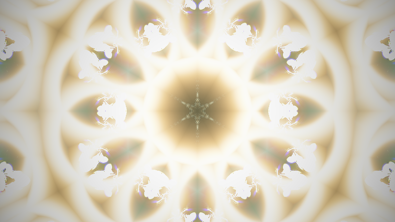

**Ergebnis:** Das Bild rückt vom „Techdemo"-Look ins Fertige: Die Farbwelt driftet als Ganzes durch kühle und warme Phasen; die glühenden Kreuzungspunkte des Geflechts brennen nicht mehr weiß aus, sondern laufen elegant in helles Pastell; der Rand dunkelt ab und schiebt den Blick auf das Zentrum – Kaleidoskop-Dramaturgie.

### Was passiert hier

1. **Farbrotation:** drei phasenversetzte Cosinus-Wellen als Multiplikator – die deterministische Fassung von Milkdrops `roam_sin`-Farbdrift, wie schon in Schritt 2 für die Seeds, jetzt zusätzlich global. Zwei Ebenen Farbbewegung (Seeds individuell, Bild gesamt) auf verschiedenen Uhren – deshalb wirken die Farben „lebendig", nie „animiert".
2. **Entsättigung:** Das Preset zieht mit `ret = lerp(ret, lum(ret), 0.1)*(0.95-0.05*lum(GetBlur3(uv)))` das ganze Bild 10 % Richtung Grau und dunkelt helle Zonen leicht ab – der Grund, warum sein Look „edel" statt „quietschig" wirkt: Übersättigte Feedback-Farben kippen sonst ins Bonbonhafte. Unsere Fassung koppelt die Entsättigung an die Helligkeit (`smoothstep(0.6, 1.6, l)`): Dunkle Partien behalten volle Farbe, glühende Kerne werden vornehm blass – das imitiert nebenbei, wie überbelichtetes Filmmaterial ausbleicht.
3. **Tonemapping `1 - exp(-x)`:** das Serien-Erbstück (frosty caves' letzte Zeile). Für ein Feedback-System ist es fast Pflicht: Der Buffer enthält *nach Konstruktion* Werte weit über 1 (die Gleichgewichts-Zehnfachung aus Schritt 4!), und die Exponentialkurve holt sie alle weich unter die Decke – linear im Dunkeln, asymptotisch gegen Weiß.
4. **Vignette:** `dot(uv, uv)` ist das Radius-Quadrat – billiger als `length` und weicher im Zentrum. Das Preset nimmt linear `(1-rad)`; das Quadrat lässt die Bildmitte unangetastet und greift erst zum Rand beherzt zu.

Die Reihenfolge ist bewusst: Farbarbeit **vor** dem Tonemapping (arbeitet auf linearen Werten), Vignette **nach** dem Tonemapping (dunkelt das fertige Bild, statt die Belichtung zu verschieben), Gamma zuletzt. Politur-Ketten sind Pipelines – umsortieren ändert das Ergebnis.

🧠 **Merke:** Auch hier hat die Politur keine neue *Idee* gebraucht – nur Kurven auf das fertige Bild. Die Substanz entsteht in Buffer A; wenn das Mandala erst durch die Politur „gerettet" werden muss, stimmt etwas am Kreislauf.

### 🎨 Experimentieren

- `BELICHTUNG = 3.0` → Überbelichtungs-Ästhetik, das Geflecht frisst sich ins Weiß; `0.8` → dunkel-samtiger Club-Look
- Entsättigung invertieren: `mix(vec3(l), col, ...)`-Logik umdrehen, sodass *dunkle* Zonen ergrauen → das Bild wirkt bedrohlicher, „aschig"
- Vignette einfärben: `col = mix(col * vec3(0.4, 0.5, 0.9), col, 1.0 - VIGNETTE * dot(uv, uv));` → der Rand kippt ins Blaue statt ins Schwarze
- Die Farbrotation aufs Feedback verlegen (den Faktor in Buffer A auf `alt` anwenden, sehr dezent: `0.995 + 0.005*cos(...)`) → die Schweife ändern die Farbe *während* sie ausklingen – hypnotisch, aber Vorsicht: das ist ein Eingriff in die Bilanz (Faktor > 1 je Kanal = Kanal-Explosion)

---

## Schritt 13 – Der fertige Shader: Common + Buffer A + Image

**Neu:** Kein neuer Effekt – der Endstand als **Gesamtlisting** zum Einfügen, jetzt sauber organisiert: Die Stellschrauben und geteilten Helfer ziehen in Shadertoys **Common**-Tab (Editor: „+" → *Common*), dessen Inhalt automatisch in **alle** Pässe eingefügt wird. Ein SSOT für Konstanten – Änderung an einer Stelle wirkt überall.

**Common** *(Tab „Common" – wird jedem Pass vorangestellt)*

```glsl
// ============================================================================
// "Pimped Kaleidoscope" - Feedback-Kaleidoskop, Endstand des Tutorials.
// Stil-Vorbild: martin - shader pimped caleidoscope.milk
// (Warp: Sharpen/Decay/Dither -> Buffer A; Comp: Faltwerk/Seeds -> hier).
// Aufbau: Common (dieser Tab) + Buffer A (iChannel0 = Buffer A!) + Image
// (iChannel0 = Buffer A). Braucht keine weiteren iChannels.
// ============================================================================

// ---- STELLSCHRAUBEN --------------------------------------------------------
// Feedback (Buffer A)
const float DECAY      = 0.90;   // Daempfung je Frame (< 1, sonst Explosion!)
const float SHARPEN    = 0.35;   // Unsharp-Mask-Staerke (Preset: 0.35)
const float DITHER     = 0.004;  // Rausch-Saat je Frame
const float ZOOM       = 1.010;  // Grund-Zoom der Lese-UV (> 1 = auswaerts)
const float TEMPO      = 1.0;    // Tempo der unsichtbaren Kamera
// Lichtsaat (Buffer A)
const float SEED_HELL  = 1.0;    // Helligkeit der Seeds
const float BAHN_WEITE = 0.35;   // Radius der Lissajous-Bahn
// Kaleidoskop (Image)
const float SEKTOREN   = 6.0;    // Spiegel-Sektoren der Winkel-Faltung
const float KACHEL     = 1.6;    // Kacheln pro Bildhoehe (Spiegel-Kachel)
const int   KOPIEN     = 3;      // rotierte Kopien ("anz" im Preset)
// Politur (Image)
const float ENTSAETT   = 0.25;   // Entsaettigung heller Flaechen
const float VIGNETTE   = 0.65;   // Randabdunklung
const float BELICHTUNG = 1.6;    // Verstaerkung vor dem 1-exp-Tonemapping
// ----------------------------------------------------------------------------

#define R(a) mat2(cos(a), sin(a), -sin(a), cos(a))

float hash21(vec2 p)
{
    return fract(sin(dot(p, vec2(127.1, 311.7))) * 43758.5453);
}

vec3 palette(float t)
{
    return 0.55 + 0.45 * cos(6.28318 * (t + vec3(0.0, 0.33, 0.67)));
}

float lum(vec3 c) { return dot(c, vec3(0.299, 0.587, 0.114)); }

// zentrierte, hoehen-normierte Koordinaten <-> 0..1-Texturkoordinaten
vec2 uvZuTex(vec2 uv)
{
    return uv * vec2(iResolution.y / iResolution.x, 1.0) + 0.5;
}
```

**Buffer A** *(iChannel0 = Buffer A – die Selbstreferenz)*

```glsl
// ---- Lichtsaat -------------------------------------------------------------

vec3 seeds(vec2 uv)
{
    vec3 acc = vec3(0.0);

    // Punkte-Paar: eine Lissajous-Bahn, zwei Lichter punktsymmetrisch
    vec2 pos = vec2(sin(iTime * 0.31), sin(iTime * 0.23))
             * BAHN_WEITE * vec2(1.0, 0.7);
    vec3 farbe = palette(iTime * 0.021);

    vec2 d1 = uv - pos;
    vec2 d2 = uv + pos;
    acc += farbe     * 0.0006 / (0.0004 + dot(d1, d1));
    acc += farbe.bgr * 0.0006 / (0.0004 + dot(d2, d2));

    // Ring: leuchtende Kreislinie mit atmendem Radius
    float r  = 0.26 + 0.10 * sin(iTime * 0.171);
    float dr = length(uv) - r;
    acc += palette(iTime * 0.021 + 0.5) * 0.0012 / (0.0008 + 8.0 * dr * dr);

    return acc * SEED_HELL;
}

// ---- Feedback-Werkzeug -----------------------------------------------------

// kleiner Kreuz-Blur als GetBlur1-Ersatz
vec3 blur4(vec2 st)
{
    vec2 px = 1.0 / iResolution.xy;
    return ( texture(iChannel0, st + vec2( px.x, 0.0)).rgb
           + texture(iChannel0, st + vec2(-px.x, 0.0)).rgb
           + texture(iChannel0, st + vec2(0.0,  px.y)).rgb
           + texture(iChannel0, st + vec2(0.0, -px.y)).rgb ) * 0.25;
}

// ---- der Kreislauf ---------------------------------------------------------

void mainImage(out vec4 fragColor, in vec2 fragCoord)
{
    vec2 uv = (fragCoord - 0.5 * iResolution.xy) / iResolution.y;
    float zt = iTime * TEMPO;

    // die unsichtbare Kamera: Zentrum-Drift, Dreh-GESCHWINDIGKEIT, Zoom-Atmen
    vec2  zentrum = vec2(sin(zt * 0.043), sin(zt * 0.037)) * 0.10;
    float dreh    = 0.010 * sin(zt * 0.021);
    float zoom    = ZOOM + 0.006 * sin(zt * 0.029);

    // Vorframe transformiert lesen (Frame 0 = Schwarz: der Kaltstart)
    vec2 lese = zentrum + R(-dreh) * ((uv - zentrum) / zoom);
    vec2 st   = uvZuTex(lese);
    vec3 alt  = texture(iChannel0, st).rgb;

    // Unsharp Mask: feine Details verstaerkt zurueckgeben
    alt += (alt - blur4(st)) * SHARPEN;

    // Decay + frische Saat; nie unter Null (Float-Buffer clampen nicht!)
    vec3 neu = max(alt * DECAY + seeds(uv), 0.0);

    // Dither-Saat: je Frame anderes Muster, im Mittel leicht positiv
    vec2 dsh = fragCoord + vec2(float(iFrame % 289), float(iFrame % 283)) * 1.618;
    neu += (hash21(dsh) - 0.45) * DITHER;

    fragColor = vec4(max(neu, 0.0), 1.0);
}
```

**Image** *(iChannel0 = Buffer A)*

```glsl
// ---- das Faltwerk ----------------------------------------------------------

// Winkel-Faltung: alle Richtungen in einen Sektor spiegeln
vec2 falteWinkel(vec2 uv, float n)
{
    float sektor = 6.28318 / n;
    float ang = atan(uv.y, uv.x);
    ang = mod(ang, sektor);
    ang = abs(ang - 0.5 * sektor);
    return length(uv) * vec2(cos(ang), sin(ang));
}

// Spiegel-Kachel: die Ebene aus gespiegelten Kopien einer Zelle
vec2 falteKachel(vec2 uv, float dichte)
{
    return abs(fract(uv * dichte) - 0.5) / dichte;
}

// Winkel-Faltung einmal, dann KOPIEN rotierte Kachel-Faltungen per max()
vec3 kaleido(vec2 uv)
{
    vec2 w = falteWinkel(uv, SEKTOREN);

    vec3 acc = vec3(0.0);
    for (int n = 1; n <= KOPIEN; n++) {
        float a = float(n) / float(KOPIEN) * 3.14159;
        vec2 k = falteKachel(R(a) * w, KACHEL);
        acc = max(acc, texture(iChannel0, uvZuTex(k)).rgb);
    }
    return acc;
}

// ---- Anzeige + Politur -----------------------------------------------------

void mainImage(out vec4 fragColor, in vec2 fragCoord)
{
    vec2 uv = (fragCoord - 0.5 * iResolution.xy) / iResolution.y;

    vec3 col = kaleido(uv);

    // Farbrotation ueber die Zeit
    col *= 0.80 + 0.20 * cos(iTime * 0.07 + vec3(0.0, 2.1, 4.2));

    // Entsaettigung heller Flaechen (lerp auf die Luminanz)
    float l = lum(col);
    col = mix(col, vec3(l), ENTSAETT * smoothstep(0.6, 1.6, l));

    // Tonemapping 1-exp, dann Vignette + Gamma
    col = 1.0 - exp(-col * BELICHTUNG);
    col *= 1.0 - VIGNETTE * dot(uv, uv);
    col = pow(col, vec3(1.0 / 2.2));

    fragColor = vec4(col, 1.0);
}
```

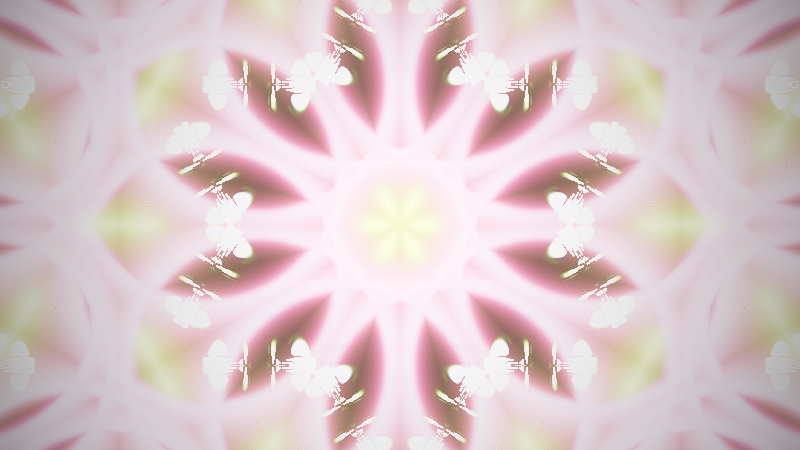

**Ergebnis:** Der fertige Shader. Zwei Komplementär-Lichter und ein atmender Ring säen Farbe in einen Bildspeicher; der schärft, dreht, dehnt und dämpft sich selbst zu spiraligen Glutfäden; ein dreistufiges Faltwerk spiegelt das Gespinst zum sechszähligen Mandala mit drei verzahnten Rotations-Lagen; und eine unsichtbare Kamera lässt die Strömung wandern, atmen und die Richtung wechseln – deterministisch bis ins letzte Bit und praktisch ohne Wiederholung.

### Was passiert hier – der Kreislauf im Rückblick

Lies das Buffer-A-`mainImage` noch einmal von oben nach unten – es ist Zeile für Zeile der Warp-Shader des Presets, nur in anderer Tracht:

| Buffer-A-Zeile | Preset-Warp |
|---|---|
| Kamera + `lese` | `zoom`/`rot`/`cx`/`cy` (per_frame/per_pixel) |
| `texture(iChannel0, st)` | `tex2D(sampler_main, uv)` |
| `alt += (alt - blur4)*SHARPEN` | `ret += (ret - GetBlur1(...))*0.35` |
| `alt * DECAY` | `ret *= 0.9` |
| `+ seeds(uv)` | Shapes/Wave, die Milkdrop in den Buffer malt |
| `+ (hash21 - 0.45)*DITHER` | `+ (tex2D(sampler_noise_lq, ...)-0.1)*0.02` |

*Tab. 4: Der Kreislauf im Rückblick – Buffer-A-Zeilen und ihre Entsprechungen im Preset-Warp*

Und das Image-`mainImage` ist der Comp-Shader: Faltwerk, Vignette, Farb-Politur. Wer ab hier eigene Feedback-Shader baut, hat mit diesen zwei Blöcken das komplette Vokabular – alles Weitere ist Rezeptur.

### 🎨 Experimentieren – jetzt am Gesamtwerk

- Das Stellschrauben-Brett durchspielen; drei erprobte Charaktere: `DECAY 0.96 / SHARPEN 0.2 / SEKTOREN 8` (Nebelrosette) · `DECAY 0.85 / SHARPEN 0.6 / KACHEL 3.0` (nervöses Drahtgeflecht) · `ZOOM 0.995 / DREH-Grundwert 0.004` (implodierender Strudel)
- `SEED_HELL` und `BELICHTUNG` sind ein Duo: Wer die Saat verdoppelt, halbiert sinnvollerweise die Belichtung – gleiches Niveau, anderes Verhältnis Kern/Halo
- Die Winkel-Faltung in den Kreislauf verlegen (🎨 aus Schritt 8) und `SEKTOREN` im Image auf `1.0` → das Feedback *ist* jetzt das Kaleidoskop – härter, kristalliner, ganz anderes Tier

---
# Anhang A: Audio-Reaktivität

Voraussetzung auf shadertoy.com: **iChannel1 mit „Music"** belegen – und zwar in **jedem Pass, der Audio liest** (bei uns: Buffer A; für ein Mapping auch Image). Die Textur ist 512×2: Zeile 0 (`y ≈ 0.25`) das FFT-Spektrum, Zeile 1 (`y ≈ 0.75`) die **Wellenform**. Die Grundlagen (Spektrum ansehen, Bänder bauen, Milkdrop- vs. Shadertoy-Skala) stehen ausführlich im Anhang A des Crystal-Lights-Tutorials – hier konzentrieren wir uns auf das, was ein **Feedback-System** anders macht. Und das ist eine gute Nachricht vorweg: Die Schablone brauchte für Envelopes und geglättete Pegel einen eigenen Zustands-Buffer (dort Anhang B3) – **wir haben unseren Zustand schon**. Der Buffer *ist* das Gedächtnis: Ein Beat, der einmal als Lichtblitz hineinfällt, klingt von ganz allein über den Decay aus. Im Feedback-Shader ist Audio-Nachhall kein Trick, sondern Systemverhalten – die B3-Envelope-Muster der Schablone lassen sich hier trotzdem 1:1 einbauen (etwa in einem Eck-Pixel von Buffer A), aber man braucht sie seltener.

Auch das Vorbild-Preset ist hier Lehrmeister: Seine Seeds sind bereits audio-gesteuert – `q7 = sqrt(max(0,vol_-0.3))` (geglättete Lautheit) skaliert die Lichtpunkt-Helligkeit, und `q10` ist eine **Beat-Uhr** (`trel1 += BPM/60*dt`), auf der die Positionen fahren. Genau diese zwei Ideen bauen wir nach – mit Shadertoy-Bordmitteln.

---

## Schritt A1 – Das Beat-Gate: der Rock-The-House-Trick

**Neu:** Aus dem kontinuierlichen Bass-Pegel wird ein binäres AN/AUS – die GLSL-Fassung von Milkdrops `above(bass, 0.95)` (Vorbild: *GreatWho – Rock The House_2024.milk*). Eigenständig lauffähig als Ein-Pass-Shader; die ausführliche Diskussion (Skalen-Falle, warum `smoothstep` statt `step`) steht in der Schablone – hier die kompakte Arbeitsfassung:

```glsl
// Eigenstaendiger Testshader - iChannel0: Music

// Bandpegel: N Stuetzstellen aus Zeile 0 (FFT) mitteln
float bandLevel(float lo, float hi)
{
    float sum = 0.0;
    const int N = 12;
    for (int i = 0; i < N; i++) {
        float x = mix(lo, hi, (float(i) + 0.5) / float(N));
        sum += texture(iChannel0, vec2(x, 0.25)).x;
    }
    return sum / float(N);
}

void mainImage(out vec4 fragColor, in vec2 fragCoord)
{
    vec2 uv = fragCoord / iResolution.xy;

    float bass = bandLevel(0.00, 0.05);
    float gate = smoothstep(0.60, 0.75, bass);   // DAS Beat-Gate

    vec3 color = vec3(0.02);
    if (uv.x < 0.47) color = uv.y < bass ? vec3(0.9, 0.3, 0.3) : color;
    if (uv.x > 0.53) color = uv.y < gate ? vec3(0.3, 0.9, 1.0) : color;
    color += gate * vec3(0.10, 0.06, 0.02);

    fragColor = vec4(color, 1.0);
}
```

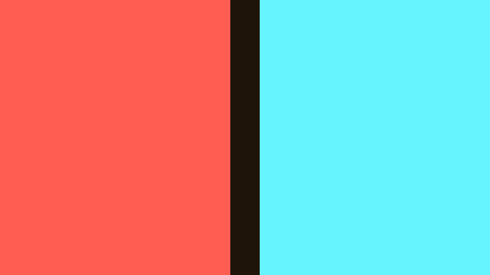

**Ergebnis:** Links wogt der rohe Bass-Balken, rechts springt der Gate-Balken schlagartig auf voll, sobald der Bass die Schwelle reißt. Die Schwelle `0.60/0.75` ist Handarbeit pro Musikrichtung – Shadertoys FFT ist ein Absolutpegel, kein normiertes Milkdrop-`bass`; wer die track-unabhängige Variante will (Vergleich mit dem eigenen gleitenden Mittel), findet sie im B3 der Schablone – oder legt den gleitenden Mittelwert einfach in ein Eck-Pixel unseres Buffer A.

### 🎨 Experimentieren

- Schwelle `0.35/0.50` → das Gate greift auch Snares; Schwellen *sind* Instrumenten-Auswahl
- `bandLevel(0.25, 0.70)` als Gate-Quelle → Hi-Hat-Getriggertes Geflacker – für unser Mandala meist zu nervös, aber gut zu wissen

---

## Schritt A2 – Der Mapping-Katalog: wohin mit welchem Signal?

Kein neuer Shader – die Landkarte. Ein Feedback-Kaleidoskop hat andere gute (und andere *gefährliche*) Andockstellen als ein Raymarcher; die Leitfrage bleibt *musikalische Rolle → visuelle Rolle*. Alle Schnipsel beziehen sich auf das Gesamtlisting aus Schritt 13 und benutzen die Globals `gBass/gMid/gTreb/gVol/gGate` (führt A3 ein).

| # | Audio | steuert | Eingriff | warum es passt |
|---|---|---|---|---|
| 1 | Bass-**Gate** | Die Seeds **zünden** | in Buffer A: `vec3 saat = seeds(uv) * (1.0 + 2.5 * gGate);` | Der Rock-The-House-Moment: Beim Kick flammt die Saat auf – und weil der Buffer sie erbt, **glüht jeder Beat sichtbar aus** statt hart abzureißen. Das Feedback liefert die Hüllkurve gratis |
| 2 | Lautheit | **Decay** – laute Musik = lange Trails | `float decay = min(DECAY + 0.07 * gVol, 0.97);` statt `DECAY` | Lautstärke wird buchstäblich zu *Nachhall*: Bei Energie im Track erinnert sich das Bild länger, in stillen Passagen wird es klar und aufgeräumt. Die `min`-Klammer ist Pflicht – Werte nahe 1 kippen Richtung Ausbrennen |
| 3 | Höhen | **Sharpen** | `... * SHARPEN * (0.5 + 1.8 * gTreb)` | Hi-Hats und Glitzer sind spitz – sie dürfen das Bild *ziselieren*; bei dumpfem Material bleibt es weich. Vorsicht: Stabilitätsrechnung aus Schritt 6 gilt weiter – lieber `SHARPEN`-Basis senken als die Spanne vergrößern |
| 4 | Mitten | **Palette**-Offset | in `seeds()`: `palette(iTime * 0.021 + gMid * 0.3)` | Melodie = Stimmung = Farbe; die Seeds (und damit alle Schweife, die sie ziehen) wandern mit der Harmonik durch den Farbkreis |
| 5 | Beat | **Sektorzahl**-Sprünge | siehe Diskussion unten | Der dramatischste Eingriff – und der heikelste |
| 6 | Wellenform | **Wellenform-Seed** | `saat += waveSeed(uv, fragCoord);` (A3) | Das Alleinstellungsmerkmal dieses Tutorials: Die Musik malt ihre eigene Kurve als Leuchtspur in den Kreislauf |

*Tab. 5: Mapping-Katalog – Audio-Signal, Stellschraube, Eingriff und Begründung*

**Ergebnis:** Kein neues Bild, aber eine geprüfte Landkarte: Für jedes der sechs Mappings sind Eingriffsort (Buffer A oder Image), Code-Schnipsel und Begründung benannt – und mit der Positions-vs.-Geschwindigkeits-Unterscheidung (unten) ist für jede weitere Mapping-Idee entscheidbar, ob sie Falle oder Feature ist.

**Die Positions-Uhr-Warnung, Feedback-Ausgabe.** Die Serien-Regel „nie den Faktor vor `iTime` mappen" gilt hier verschärft und differenzierter:

- **NICHT mappen: die Rotation der Faltung.** Wer der Winkel-Faltung im Image eine Drehung `ang + iTime*speed` gibt und `speed` an Audio hängt, hat eine klassische Positions-Uhr gebaut: Jede Pegeländerung *teleportiert* das ganze Mandala auf einen anderen Drehwinkel – es zappelt statt zu tanzen. Dasselbe gilt für die Seed-Bahn-Uhren.
- **Mappbar: die Feedback-Drehung.** `dreh` in Buffer A ist eine **Geschwindigkeit** (Schritt 11!) – `dreh += gBass * 0.004` beschleunigt die Strömung beim Beat, und der Buffer integriert das zu einer Art Random-Walk der Verdrehung: völlig legitim, sieht organisch aus. Die Unterscheidung Position vs. Geschwindigkeit ist im Feedback-System die Trennlinie zwischen Falle und Feature.

**Zu Mapping 5 (Sektorzahl-Sprünge) in aller Ehrlichkeit:** Die Idee ist verführerisch – beim Beat springt `SEKTOREN` von 6 auf 8, das Mandala „schaltet". Der Pop-Effekt ist real und kann großartig sein (harte Musik, harte Schnitte). Aber: Ein Sprung der Sektorzahl ist eine **Diskontinuität der Anzeige** – das gesamte Bild rastet schlagartig um, und wenn das Gate flattert (Pegel sägt um die Schwelle), rastet es mehrmals pro Sekunde. Wer es probiert: `float sektoren = (gGate > 0.5) ? 8.0 : 6.0;` in `kaleido()` – und zwingend ein *stabiles* Gate (breite smoothstep-Rampe oder die B3-Envelope der Schablone mit Haltezeit) davor. Milde Alternative mit ähnlichem Reiz: nur eine der drei Rotations-Kopien beim Beat dazuschalten (`KOPIEN`-Schleife bis `2 + int(gGate + 0.5)`). Da die Faltung reine Anzeige ist, bleibt der Buffer von alledem unberührt – der Schaden eines zappelnden Mappings ist hier wenigstens nicht *persistent*.

---

## Schritt A3 – Das Kaleidoskop hört zu

**Neu:** Die Mappings wandern in den fertigen Shader – gezeigt sind nur die Änderungen gegenüber Schritt 13. Kanal-Setup: **Buffer A: iChannel0 = Buffer A, iChannel1 = Music. Image: iChannel0 = Buffer A, iChannel1 = Music** (nur für Mapping 4b nötig).

**(a) In den Common-Tab** – Audio-Infrastruktur (einmal für alle Pässe):

```glsl
// ---- AUDIO -----------------------------------------------------------------
// Bandpegel aus Zeile 0 (FFT) der Music-Textur am uebergebenen Kanal
#define BAND(ch, lo, hi, N)                                              \
    float sum = 0.0;                                                     \
    for (int i = 0; i < N; i++)                                          \
        sum += texture(ch, vec2(mix(lo, hi, (float(i)+0.5)/float(N)),    \
                                0.25)).x;                                \
    sum /= float(N);
// ----------------------------------------------------------------------------
```

*(Shadertoy-Eigenheit: `iChannel1` ist in Common nicht direkt ansprechbar – deshalb das Makro, das den Kanal im jeweiligen Pass einsetzt. Wem Makros widerstreben: die `bandLevel`-Funktion aus A1 schlicht in beide Pässe kopieren.)*

**(b) In Buffer A** – Pegel einlesen und die Mappings 1, 2, 3, 4, 6 setzen:

```glsl
// NEU ueber mainImage: bandLevel fuer DIESEN Pass (Makro setzt den Kanal ein;
// wer keine Makros mag, kopiert stattdessen die A1-Funktion hierher)
float bandLevel(float lo, float hi) { BAND(iChannel1, lo, hi, 12) return sum; }

// NEU am Anfang von mainImage:
    float gBass = bandLevel(0.00, 0.05);
    float gMid  = bandLevel(0.05, 0.25);
    float gTreb = bandLevel(0.25, 0.70);
    float gVol  = bandLevel(0.00, 0.70);
    float gGate = smoothstep(0.60, 0.75, gBass);

// [2] Decay atmet mit der Lautheit (Klammer nach oben ist Pflicht!)
    float decay = min(DECAY + 0.07 * gVol, 0.97);

// [3] Sharpen mit den Hoehen
    alt += (alt - blur4(st)) * SHARPEN * (0.5 + 1.8 * gTreb);

// [1]+[6] Saat: Beat-Zuendung + Wellenform-Seed
    vec3 saat = seeds(uv) * (1.0 + 2.5 * gGate);
    saat += waveSeed(uv, fragCoord);

    vec3 neu = max(alt * decay + saat, 0.0);
```

**(c) Der Wellenform-Seed** – die Kurve der Musik als Leuchtspur (neu in Buffer A, vor `mainImage` einfügen):

```glsl
// [6] Wellenform-Seed: Zeile 1 der Audio-Textur als leuchtende Kurve stempeln.
// Jede x-Position des Bildes liest "ihr" Sample; der 1/d2-Trick aus Schritt 2
// macht aus dem Hoehenabstand zur Kurve eine leuchtende Linie.
vec3 waveSeed(vec2 uv, vec2 fragCoord)
{
    float sx = fragCoord.x / iResolution.x;            // 0..1 quer durchs Bild
    float w  = texture(iChannel1, vec2(sx, 0.75)).x;   // Wellenform-Zeile
    float dy = uv.y - (w - 0.5) * 0.45;                // Abstand zur Kurve
    return palette(iTime * 0.021 + 0.25) * 0.25
         * 0.0016 / (0.0016 + dy * dy * 60.0);
}
```

**(d) In Image** – Mapping 4b, die globale Farbrotation hört auf die Mitten:

```glsl
// GEAENDERT (optional): die Farbrotations-Zeile
    float gMid = bandLevel(0.05, 0.25);   // bandLevel auch hier definieren
    col *= 0.80 + 0.20 * cos(iTime * 0.07 + gMid * 2.0 + vec3(0.0, 2.1, 4.2));
```

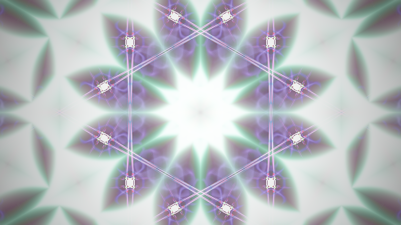

**Ergebnis:** Bei jedem Kick zünden Punkte-Paar und Ring auf das Dreieinhalbfache und der Blitz **glüht durch das Feedback aus** – im gefalteten Bild explodiert kurz das ganze Mandala und beruhigt sich organisch. Quer durch den Kreislauf zieht die Wellenform der Musik als zarte, ständig neu gezeichnete Leuchtader, die vom Kaleidoskop in schwingende Ornament-Bänder gefaltet wird – bei ruhiger Musik fast eine Gerade, bei transientem Material ein zuckendes Gebirge. Laute Passagen verlängern die Schweife (Decay ↑), Höhen ziselieren das Geflecht (Sharpen ↑), und die Farbwelt schiebt mit der Melodie.

### Was passiert hier

**Der Wellenform-Seed ist das, was dieses Tutorial von den Raymarching-Geschwistern abhebt** – dort war Audio ein *Parameter*, hier wird es *Material*: Die Kurve wird physisch in den Bildspeicher gestempelt, altert dort wie alles andere (Decay, Zoom, Drehung, Sharpen) und ihre Vergangenheit bleibt als auswandernde Geisterlinien sichtbar – die Wellenform von vor zwei Sekunden spiralt noch als blasses Echo durchs Bild. Genau das tut Milkdrop mit seiner Wave seit 1998: `nWaveMode` malt die Kurve in den Frame, der Warp erbt sie. Unser `waveSeed` ist die Shadertoy-Fassung davon – und das `0.25` im Zähler hält sie bewusst *unter* der Helligkeit der Punkt-Seeds: Sie soll Textur sein, nicht Hauptdarsteller. (Wer sie pur sehen will: alle anderen Seeds nullen und `* 0.25` auf `* 1.0` – ein reiner Milkdrop-Oszilloskop-Shader.)

**Die Dramaturgie-Regel der Schablone gilt unverändert:** Alle Faktoren sind so gebaut, dass der Shader bei Stille auf sein volles Eigenleben zurückfällt (`1.0 + 2.5·gGate` statt `gGate` pur, `0.5 + 1.8·gTreb` statt `gTreb` pur). Ein Feedback-System hat hier sogar einen Startvorteil: Selbst wenn die Musik abreißt, trägt der Buffer die letzten Sekunden weiter – der Übergang in die Stille ist von Natur aus ein Ausklang, kein Schnitt.

**Stabilität zuletzt, weil es wichtig ist:** Mapping 2 und 3 verschieben beide die Bilanz nach oben – gleichzeitig „laut UND höhenreich" ist der Streßtest. Mit den angegebenen Klammern (`decay ≤ 0.97`, Sharpen-Spanne moderat) bleibt das System gutmütig; wer die Spannen vergrößert, sollte das Ausbrenn-Szenario aus Schritt 3 im Hinterkopf behalten und im Zweifel zuerst `SEED_HELL` senken – die Saat ist der einzige Posten, der *sicher* nie explodiert.

### 🎨 Experimentieren

- Nur Mapping 6 aktiv, `SEKTOREN = 12`, `KACHEL = 0.8` → ein reines „Musik-Mandala": nichts als die gefaltete, nachglühende Wellenform
- Beat-Zündung nur auf das **Gegenstück**: `acc += farbe.bgr * ... * (1.0 + 5.0*gGate)` in `seeds()` → der Beat hat eine eigene Farbe
- `waveSeed` um 90° drehen (`uv.yx` verwenden) → die Kurve läuft vertikal und die Winkel-Faltung macht Rosetten statt Bändern daraus
- Die Feedback-Drehung an den Bass (erlaubte Variante!): `dreh = 0.010*sin(zt*0.021) + gBass*0.004;` → jeder Kick gibt der Strömung einen Drall-Stoß, den der Buffer als bleibende Verdrehung erinnert

---
# Anhang B: Der Weg in die App – und zurück

Die Grundlagen stehen im Vorgänger und werden hier nicht wiederholt: **Die drei Import-Wege** (Copy & Paste in den Shadertoy-Node, URL-/ID-Import mit App-Key, Shadertoy-Browser-Panel) **und die allgemeine Portabilitäts-Checkliste findest du in [CrystalLights-tutorial.md](CrystalLights-tutorial.md), Anhang B.** Unser Shader hält sich an dieselbe Konvention wie die 100 Vorrats-Shader in `asset/shadertoys/` (nur Standard-Uniforms, STELLSCHRAUBEN-Block) – alle drei Wege funktionieren also unverändert. Hier nur das, was an *diesem* Shader besonders ist: Er ist **Multipass mit Selbstreferenz**. *(UI-Namen und Verhalten: Stand Session 65/67.)*

---

## B1 – Multipass-Import: Buffer A kommt mit

Der Shadertoy-Node der Effect-Chain unterstützt Buffer A–D als eigene Pässe mit frei verdrahtbaren Kanälen – unsere Zwei-Pass-Architektur passt ohne Umbau:

- **Beim URL-Import** (Weg 2) wird die **Buffer-Topologie automatisch aufgelöst**: Der Importer erkennt am Original, dass Buffer A existiert, dass sein iChannel0 auf Buffer A selbst zeigt und dass Image ihn liest – die Pässe und Kanal-Zuordnungen landen fertig verdrahtet im Node. Ein **Common**-Tab wird dabei **jedem Pass vorangestellt** – exakt die Semantik, für die wir das Gesamtlisting in Schritt 13 organisiert haben.
- **Bei Copy & Paste** (Weg 1) legt man die Pässe im Node-Editor von Hand an (Buffer-Pass hinzufügen, Kanäle wählen: Buffer/Audio/nichts) und kopiert die drei Blöcke aus Schritt 13 einzeln hinein; den Common-Inhalt stellt man dann jedem der beiden Pässe selbst voran (oder nutzt das Common-Feld des Editors, sofern vorhanden).
- **Die Selbstreferenz verhält sich identisch:** Auch in LumiViz liest ein Pass, der sich selbst als Eingang hat, das **Vorframe** – Ping-Pong-Puffer, Swap nach jedem Pass, exakt die Shadertoy-Semantik (und intern dieselbe Mechanik wie Milkdrops Warp-Loop im MilkdropVisualizer). Es gibt keinen Halbfertig-Lese-Fall.
- **Der Kaltstart gilt dort erst recht:** Frisch geladene Chain, Fenster-Resize, Puffer-Löschen beim Preset-Wechsel – jedes Mal startet Buffer A schwarz und das System schwingt sich neu ein. Das ist in LumiViz ein bewusst gestaltetes Thema (Puffer-Wechsel-Verhalten je Node, optionales Start-Fade-in); unser Shader ist dafür ein gutmütiger Kandidat: Die Seeds füllen das Bild in zwei, drei Sekunden.
- **Determinismus als Geschenk:** `iTime` ist in der App die deterministische Sim-Uhr und unser Shader enthält keinerlei echten Zufall (`hash21` + `iFrame` statt Rauschtexturen) – derselbe Frame ergibt dasselbe Bild, prüfstandtauglich. Für ein *Feedback*-System heißt das sogar: Dieselbe Frame-**Folge** ergibt dieselbe Bild-Folge – ganze Läufe sind reproduzierbar.

## B2 – Audio-Adapter: eine Weiche, zwei Plattformen

Die App stellt die Audio-Textur im **identischen 512×2-Layout** bereit (Zeile 0 FFT, Zeile 1 Wellenform – auch der `waveSeed` aus A3 läuft also unverändert!), am iChannel, der im Editor als Audio-Kanal gewählt ist. Zusätzlich gibt es die fertigen Uniforms `bass`, `mid`, `treb`, `vol`, `beat`. Das Adapter-Muster aus der Schablone (B2 dort: alle Mappings sprechen nur `aBass()`/`aMid()`/`aTreb()`/`aVol()`/`aBeat()` an, der Plattform-Block wird umkommentiert) übernimmt man wörtlich – in den Common-Tab, dann gilt die eine Weiche für beide Pässe. Zwei Feedback-spezifische Anmerkungen:

1. `aBeat()` ersetzt auf LumiViz-Seite das handkalibrierte `gGate` – damit entfällt die heikelste Konstante des Anhangs A (die Absolut-Schwelle). Die Skalen der übrigen Bänder beim Umzug einmal nebeneinander visualisieren (A1-Muster); die endgültige Audio-Skalierung ist app-seitig noch in Klärung (Stand S65).
2. Mapping 2 (Decay ← Lautheit) reagiert empfindlich auf die Pegel-Skala – die `min(..., 0.97)`-Klammer ist die Versicherung, dass ein zu heißer Adapter-Faktor *matschig* statt *explosiv* endet. Klammer nie entfernen.

## B3 – Panel-Parameter-Kandidaten

Shadertoy hat keine Regler – LumiViz schon: Der Node-Editor zeigt Parameter im Panel, und langfristig sollen Modulparameter auch dynamisch steuerbar sein. Unsere STELLSCHRAUBEN sind bewusst so geschnitten, dass sie diese Karriere machen können. Eine Triage als Vorschlag:

| Stellschraube | Panel-Eignung | Anmerkung |
|---|---|---|
| `DECAY` | ★★★ der wichtigste Regler | Bereich 0.80–0.985; alles darüber als „Gefahrenzone" begreifen |
| `SEKTOREN`, `KACHEL` | ★★★ die Charakter-Regler | `SEKTOREN` gern ganzzahlig gerastert (Pop-Effekt aus A2, hier als bewusster Nutzer-Klick unproblematisch) |
| `SEED_HELL`, `BELICHTUNG` | ★★ als Duo | gegenläufig koppeln (Schritt 13) |
| `SHARPEN`, `DITHER` | ★★ | `SHARPEN` mit Bedacht deckeln (Stabilität, Schritt 6) |
| `TEMPO`, `BAHN_WEITE` | ★★ | harmlos, sofort erlebbar |
| `ZOOM`, `DREH`-Grundwert | ★ Experten | Geschwindigkeiten: kleine Zahlen, große Wirkung; um 1.0 bzw. 0.0 zentrieren |
| `KOPIEN` | ○ | `int` und Schleifengrenze – auf Shadertoy eine Recompile-Konstante; im Node ggf. als fester Satz (1/3/5) anbieten |
| `ENTSAETT`, `VIGNETTE` | ★ Politur | unkritisch |

*Tab. 6: Panel-Parameter-Triage – Stellschrauben und ihre Regler-Eignung im Node-Editor*

Wer den Endstand (oder eine Lieblings-Variante) als Vorlage neben die anderen legt: Konvention siehe `asset/effectchain/shadertoys/` – die `.glsl` ist SSOT, `make_lvfx.py` generiert die Chain-Vorlage; Multipass-Shader liegen dort als Paare.

---

## End-Validierung

Diese Validierung steht bewusst **hinter den Anhängen**: A1–A3 sind reguläre Schritte dieses Tutorials, und das Lernziel 5 (Wellenform-Seed, Audio) ist erst dort erreichbar – die End-Validierung muss aber alle Lernziele abdecken. Die Kriterien 1–6 prüfen den Kern (Schritte 1–13), das Kriterium 7 die Anhänge. Jedes Kriterium ist am laufenden Shader auf shadertoy.com objektiv prüfbar:

1. **Kompilierbarkeit:** Das Gesamtlisting aus Schritt 13 (Common + Buffer A + Image, in beiden Pässen iChannel0 = Buffer A) kompiliert auf shadertoy.com ohne Fehlermeldung und rendert ein bewegtes Bild – kein Schwarzbild, kein Standbild. *(Basis aller Lernziele)*
2. **Selbstreferenz und Kaltstart:** Nach einer Änderung der Fenstergröße startet das Bild nachweislich schwarz und füllt sich binnen weniger Sekunden neu – der geleerte Buffer liest sein eigenes Vorframe und schwingt sich wieder ein. *(Lernziel 1)*
3. **Feedback-Wirkung:** Die Lichter ziehen Schweife, und die aufsummierten Trails sind **sichtbar heller als die reine Saat**. Gegenprobe: `DECAY = 0.0` (das Feedback trägt nichts bei) zeigt nur die nackten, dunklen Seeds ohne jede Spur; zurück auf `0.90` kehren die deutlich helleren Trails wieder – die Gleichgewichts-Verzehnfachung aus Schritt 4, direkt am Bild. *(Lernziele 1 und 2)*
4. **Stabilität des Rezepts:** Mit den Standard-Konstanten kippt das Bild über Minuten weder ins Weiß noch ins Schwarz. Gegenproben: `DECAY = 1.0` brennt binnen einer Minute aus (Schritt 3); im Schritt-6-Stand lässt `ZOOM = 1.0; DREH = 0.0` den Sharpen ungefiltert in Pixelgrieß hochkochen (Schritt 6); die Standardwerte stellen beides wieder her. *(Lernziel 2)*
5. **Faltwerk:** `SEKTOREN = 1.0` reduziert auf den einzelnen Klappspiegel, `6.0` zeigt die nahtfreie Rosette (Gegenprobe: ohne die `abs`-Spiegelung reißt das Bild an den Sektorgrenzen sichtbar); und die Symmetrie-Falle aus Schritt 10 ist vorführbar – naive Rotation **vor** der Winkel-Faltung macht bei `KOPIEN = 3`, `SEKTOREN = 6` alle Kopien identisch, die Rotation zwischen den Faltstufen belebt sie wieder. *(Lernziel 3)*
6. **Unsichtbare Kamera:** Die Drehrichtung der Spiralarme kehrt im Lauf von etwa einer halben Minute weich um, ohne Bildsprung – und ein Dauerdrall-Zusatz auf `dreh` (z. B. `+ 0.006`) verdreht das Bild stetig weiter statt es zu teleportieren: Geschwindigkeit, nicht Position. *(Lernziel 4)*
7. **Audio und Wellenform-Seed:** Im A3-Stand (iChannel1 = Music in Buffer A) zünden die Seeds bei jedem Bass-Kick und **glühen über das Feedback aus** statt hart abzureißen; die Wellenform der Musik zieht als gefaltete Leuchtader durch das Mandala; **ohne Musik** läuft das volle Eigenleben unverändert weiter. *(Lernziel 5)*

---

## Fehlerbehebung

Die häufigsten Stolperstellen dieses Tutorials, gesammelt nach Symptom (Tab. 7). Die schritt-lokalen Hinweise (etwa die Stabilitätsrechnung in Schritt 6) bleiben davon unberührt – hier stehen die Probleme, die typischerweise erst beim Zusammenbau, beim Experimentieren oder beim Umzug in die App auftreten:

| # | Symptom | Ursache | Lösung |
|---|---|---|---|
| 1 | Schwarzes Bild nach dem Einfügen | Multipass unvollständig: Buffer-A-Tab fehlt, die Selbstreferenz (iChannel0 = Buffer A) ist nicht gesetzt, der Common-Tab fehlt – oder ein Kompilierfehler | Tab- und Kanal-Setup aus Schritt 3 bzw. 13 prüfen (beide Pässe!), Gesamtlisting komplett in alle drei Tabs kopieren, Fehlerkonsole unter dem Editor lesen |
| 2 | Kurzes Schwarzbild nach Laden oder Fenster-Resize | Der Kaltstart: Ein frischer oder geleerter Buffer startet leer, das System schwingt sich erst ein (Schritt 3) | Kein Fehler – wenige Sekunden warten; in LumiViz zusätzlich Puffer-Wechsel-Verhalten je Node und optionales Start-Fade-in (B1) |
| 3 | Bild frisst sich ins gleißende Weiß (Ausbrand) | `DECAY ≥ 1.0` – direkt gesetzt oder via Mapping 2 ohne `min`-Klammer; alternativ zu heiße Saat-/Sharpen-Spannen: die Bilanz kippt in positive Rückkopplung (Schritt 3) | `DECAY < 1` halten (Schritt 4), die `min(..., 0.97)`-Klammer aus A3/B2 nie entfernen; Stimm-Reihenfolge aus dem Abspann: `DECAY`/`SHARPEN` runter |
| 4 | Grelles Pixelgrieß-Kochen trotz `DECAY < 1` | Sharpen ohne Tiefpass: `ZOOM = 1.0` und `DREH = 0.0` schalten das bilineare Zwischen-Sampling aus – die Stabilitätsrechnung aus Schritt 6 kippt | Bewegung anlassen oder `SHARPEN` senken – im Feedback-System sind Bewegung und Stabilität gekoppelt (Schritt 6) |
| 5 | In LumiViz Grieß/Explosion, obwohl derselbe Code auf Shadertoy stabil ist | Die Buffer-FBOs der App filtern derzeit NEAREST – der bilineare Tiefpass fehlt, der Sharpen explodiert | Manuell bilinear lesen (`lesBilinear`) wie in den generierten Schritt-Chains (Einleitung, Bullet „In LumiViz"); bei eigenen Ports genauso vorgehen |
| 6 | Beat-Gate steht am Standalone-Testsignal dauerhaft auf voll (A1-Bild) | Die dB-FFT des synthetischen Testsignals sättigt bei 1.0 – die Absolutschwellen `0.60/0.75` greifen nie | In der App die Audio-Uniforms über den B2-Adapter verwenden (`aBeat()` statt Absolutschwelle); Schwellen sind ohnehin Handarbeit pro Musikmaterial (A1) |
| 7 | Kompilierfehler `'…' : undeclared identifier` | Ab Schritt 6 zeigen die Listings nur noch **geänderte** Funktionen – der Rest des Vorschritts muss stehen bleiben | Den vollständigen Stand des vorherigen Schritts behalten und nur die gezeigten Funktionen ersetzen; im Zweifel das Gesamtlisting aus Schritt 13 verwenden |
| 8 | Konstanten wirken anders als beschrieben | Feedback-Systeme reagieren empfindlich auf Konstanten-**Paare** (`DECAY`/`SHARPEN`); shadertoy.com ist noch ungeprüft, und die Trails hängen an Framerate und Auflösung (Schritte 4 und 6) | Stimm-Reihenfolge aus dem Abspann: erst `SHARPEN = 0` und `DECAY` allein einpendeln, dann Sharpen in 0.1-Schritten, die Faltungen zuletzt beurteilen |

*Tab. 7: Fehlerbehebung – Symptom, Ursache, Lösung*

---

## Nächste Schritte

Die Fortsetzung folgt der [Wegleitung](ShaderTutorials-overview.md) der Serie – die Composites verbauen genau das hier Gelernte weiter:

- **[Composite-Postfx](CompositePostfx-tutorial.md)** nutzt die Techniken dieses Tutorials als **Post-Pässe**: Multipass-Ketten A→B→C→Image mit Common als SSOT, Bloom über separierbaren Blur (die GetBlur-Verwandtschaft aus Schritt 6) und ein Kaleidoskop-Finish als Veredelungsstufe.
- **[Composite-Transitions](CompositeTransitions-tutorial.md)** baut auf dem **Buffer-Zustand** auf: die 1-Pixel-Zustandsmaschine in Buffer A (das A1/B-Muster dieses Tutorials, weitergedacht) für beat-getriggerte Szenenwechsel und den Drop-Detektor.
- **3D-Strang (unabhängig):** Wer nach dem 2D-Ausflug ins Raymarching (zurück) will, findet die Reihenfolge in der Wegleitung – [Stratospheric-Tunnel](StratosphericTunnel-tutorial.md), [Space-Debris](SpaceDebris-tutorial.md), dann [Juggernaut](Juggernaut-tutorial.md) und [Composite-Portals](CompositePortals-tutorial.md).

---

## Abspann

Damit ist die 2D-Reise komplett: eine Lichtsaat aus drei Leuchtformen, ein Feedback-Kreislauf mit vier Bilanz-Posten (Decay zehrt, Seeds und Dither füttern, Sharpen und Filterung ringen um die Struktur), ein dreistufiges Faltwerk mit einer Symmetrie-Falle als Lehrstück, eine unsichtbare Kamera, die Geschwindigkeiten statt Positionen fährt – und mit dem Wellenform-Seed ein Mapping, das die Musik selbst zum Pinsel macht.

Zwei ehrliche Schlussworte:

- **Dieses Tutorial ist konstruiert – und inzwischen in LumiViz gegengerendert:** Alle Schritte laufen als Chains im AvsStandalone (die Screenshots bei den Schritten; Einleitung und `pimped_kaleidoscope_schritte/`); auf shadertoy.com selbst wurde weiterhin kein Schritt geprüft, dort sind Überraschungen möglich. Die Grundrezepte (Feedback-Bilanz, Unsharp Mask, Faltungen) sind erprobte Standardkost, aber **Feedback-Systeme reagieren empfindlich auf ihre Konstanten**: Dieselben Formeln kippen mit anderem `DECAY`/`SHARPEN`-Paar von „filigran" nach „ausgebrannt" oder „tot". Stimm-Reihenfolge, wenn es klemmt: erst `SHARPEN = 0` und `DECAY` allein einpendeln (Schweiflänge nach Geschmack), dann Sharpen in 0.1-Schritten dazu, erst zuletzt die Faltungen beurteilen – sie verstärken jeden Eindruck nur. Brennt es aus: `DECAY`/`SHARPEN` runter. Säuft es ab: `DECAY`/`DITHER`/`SEED_HELL` rauf. Und die Trails hängen an Framerate und Auflösung (Schritte 4 und 6) – ein Vollbild-4K-Lauf ist ein anderes Tier als das Editor-Fenster.
- **Die Milkdrop-Brücke steht offen:** Wer diesen Look als *Preset* statt als Shadertoy-Node will, hat mit *martin – shader pimped caleidoscope.milk* die Blaupause im Repo – nach diesem Tutorial liest sich sein Warp- und Comp-Code wie ein alter Bekannter. Und umgekehrt: Jedes Milkdrop-Preset, dessen Warp-Shader du ab jetzt siehst, ist „unser Buffer A mit anderen Konstanten".

Und jetzt: Musik an. 🎵🔮

Screenshots: gerendert mit AvsStandalone (Testing-Build), Chains in `pimped_kaleidoscope_schritte/`.

---

## Siehe auch

**Voraussetzungen:**

- [Pyramid-Spiral-Shader-Tutorial](PyramidSpiral-tutorial.md) – der UV-Aufbau und die sin-Uhren-Konvention (Schritte 1–2 dort genügen; der Rest ist Raymarching und hier bewusst nicht nötig).
- [Crystal-Lights-Tutorial](CrystalLights-tutorial.md) – die Herleitungen von Hash-Idiom (Schritt 4), Cosinus-Palette und `1/d²`-Licht (Schritt 9) sowie die Anhang-B-Vollreferenz Shadertoy ↔ LumiViz, auf die Anhang B hier aufbaut.

**Verwandte Dokumente:**

- [Shader-Tutorials-Wegleitung](ShaderTutorials-overview.md) – Fokus-Tabellen, Lesereihenfolge und Technik-Index der gesamten Tutorial-Serie.
- [Raymarching – Referenz](Raymarching-reference.md) – §2.3 „Nicht-Raymarching-Ansätze" ordnet Feedback-/2D-Shader wie diesen in die Werkzeuglandschaft der Serie ein; als Kontrastlektüre zum 3D-Strang.

**Weiterführendes:**

- [martin – shader pimped caleidoscope](<../../../../../asset/Milkdrop3/presets/martin - shader pimped caleidoscope.milk>) – das Stil-Vorbild-Preset (MilkDrop): Warp-Rezept (Sharpen/Decay/Dither) und Comp-Faltwerk im Original – nach diesem Tutorial wie ein alter Bekannter lesbar.
- [GreatWho – Rock The House_2024](<../../../../../asset/Milkdrop3/presets/myPresets/md examples/GreatWho - Rock The House_2024.milk>) – das Beat-Gate-Vorbild aus Anhang A1 im Original.

## Changelog

| Version | Datum | Änderungen |
|---|---|---|
| **1.2.0** | 2026-08-05 | Formalisierung nach Tutorial_Base (nach dem Muster des Piloten [CrystalLights-tutorial.md](CrystalLights-tutorial.md)): Blockquote-Header, Inhaltsverzeichnis, Lernziele, Voraussetzungen, Übersicht der Schritte, Konventions-Mapping (Tab. 1, mit den Zwei-Block-Schritten Buffer A + Image), End-Validierung, Fehlerbehebung (Tab. 7), Nächste Schritte, Siehe auch; Tabellen als Tab. 1–7 und Kreislauf-Skizze als Fig. 1 [Blockdiagramm] indexiert; **Ergebnis:**-Zeile in Schritt A2 ergänzt. Didaktischer Bestand (Schritt-Texte, Code, 💡/🧠/🎨-Kästen, Anhänge) inhaltlich unverändert. Anschließend Umzug der Serie nach `projects/apps/MyViz/docs/tutorials/` und Umbenennung nach FNM-01 zu `PimpedKaleidoscope-tutorial.md` (Entscheid Patrik, 2026-08-04). |
| **1.1.0** | 2026-08-04 | Multipass-Schritt-Chains + Screenshots: je Schritt eine lauffähige Chain in `pimped_kaleidoscope_schritte/` (ab Schritt 3 als Multipass-Shadertoy-Node Buffer A + Image, generiert per `make_schritte.py` – das Markdown ist die SSOT) und ein eingebettetes Render-Bild in `pimped_kaleidoscope_bilder/` (AvsStandalone, 800×450, Frame 300). Zwei LumiViz-Anpassungen nur in den generierten Dateien dokumentiert (Codeblöcke bleiben Shadertoy-treu): manuelles bilineares Lesen `lesBilinear` (NEAREST-FBOs der App) und in A3 die App-Audio-Uniforms statt der FFT-Absolutschwellen (dB-Sättigung des Standalone-Testsignals). |
| **1.0.0** | 2026-08-04 | Erstfassung: 13 Schritte (Saat → Gedächtnis → Faltung → Bewegung → Politur) + Anhang A (Audio-Reaktivität mit Beat-Gate, Mapping-Katalog und Wellenform-Seed) + Anhang B (Multipass-Import nach LumiViz, Audio-Adapter, Panel-Parameter). |


