# Space Debris – Ein Trümmerfeld im Orbit von Grund auf

> **Dokumenttyp:** Tutorial  
> **Version:** 1.2.0  
> **Status:** Stabil  
> **Domain:** Programming  
> **Kategorie:** Algorithms  
> **Programmiersprache:** GLSL (Shadertoy/WebGL2)  
> **Voraussetzungen:** [Pyramid-Spiral-Shader-Tutorial](PyramidSpiral-tutorial.md) (SDF-Marsch, Domain Repetition), [Crystal-Lights-Shader-Tutorial](CrystalLights-tutorial.md) (Noise/FBM, Kamera-Basis)  
> **Schwierigkeitsgrad:** Fortgeschritten  
> **Tutorial-Typ:** Implementierung  
> **Zeitschätzung:** 6–8 h für die Schritte 1–14 auf shadertoy.com (inkl. Experimentieren), zusätzlich ~1,5 h für die Anhänge A/B; reines Durchlesen ~2 h  
> **Gültigkeit:** Shadertoy-Image-Shader (WebGL2); Anhang B zusätzlich für den Shadertoy-Node der LumiViz-Effect-Chain (Stand Session 65/67)  
> **Zweck:** Schritt-für-Schritt-Aufbau eines taumelnden Trümmerfelds im Orbit über einem Glutplaneten – 3D-Domain-Repetition mit Zell-Individualität, vom leeren Shader bis zum fertigen Werk samt Audio-Reaktivität.  
> **Zielgruppe:** Shader-Entwickler mit Raymarching-Grundlagen; Leser der Shader-Tutorial-Serie  
> **Sprache:** Deutsch  

> ⚠ **HINWEIS: Nicht-normative ASCII-Darstellungen**
>
> Die ASCII-Skizze im Bauplan-Abschnitt dient ausschließlich der **illustrativen Unterstützung**
> und setzt eine Monospace-Schrift voraus. Verbindlich sind die textuelle Beschreibung und der Code.

---

## Inhaltsverzeichnis

1. Einleitung
2. Lernziele
3. Voraussetzungen
4. Übersicht der Schritte
5. Der Bauplan: Was wir eigentlich rendern
6. Schritt 1 – Die Bühne: Sternenhimmel aus der Blickrichtung
7. Schritt 2 – Das Raymarching-Gerüst: eine einzelne Kugel
8. Schritt 3 – Domain-Repetition: aus einer Kugel wird ein Feld
9. Schritt 4 – Ausdünnung & Varianz: leere Zellen, Cluster – und die Zellwand-Klammer
10. Schritt 5 – Die Formbibliothek: Brocken, Platten, Träger, Ringe
11. Schritt 6 – Taumeln: jede Zelle rotiert um ihre eigene Achse
12. Schritt 7 – Der Planet: glühender Grund unter dem Feld
13. Schritt 8 – Atmosphäre & Wolken
14. Schritt 9 – Hartes Sonnenlicht
15. Schritt 10 – Das Glühen von unten: der Planet als zweite Lichtquelle
16. Schritt 11 – Blinklichter: Signalfarben je Trümmerteil
17. Schritt 12 – Die Kamera: Drift, Umkehr, Rollen, Nicken
18. Schritt 13 – Die Kamera-Blase und Sternen-Parallaxe
19. Schritt 14 – Politur: Dunst, Farbdrift, Tonemapping – der fertige Shader
20. Anhang A: Audio-Reaktivität (Schritte A1–A3)
21. Anhang B: Der Weg in die App – kompakt (B1–B3)
22. End-Validierung
23. Fehlerbehebung
24. Nächste Schritte
25. Abspann
26. Siehe auch
27. Changelog

---

## Einleitung

**Ziel:** Ein **treibendes Trümmerfeld im Orbit** – Brocken, Paneele, Träger und Ringe, jedes Teil mit eigener Größe, Form und eigenem, konstantem **Taumeln**, verteilt in Clustern über den unendlichen Raum. Unter dem Feld glüht ein **Planet**: ein Lavagrund aus mehrschichtigem Rauschen, überzogen von einer in Zeitlupe ziehenden Wolkenschicht und einem orangen **Atmosphären-Saum**. Beleuchtet wird die Szene doppelt – hartes, weißes Sonnenlicht von der Seite und das warme Glühen des Planeten von unten; einzelne Trümmer tragen blinkende **Positionslichter** in langsam rotierenden Signalfarben. Am Ende driftet eine Kamera schwerelos durch das Feld: weiche Richtungsumkehr, langsames Eigen-Rollen und ein Blick, der zwischen Trümmerfeld und Planet-Horizont pendelt.

**Stil-Vorbild** (liegt im Repo unter `asset/Milkdrop3/presets/`):

- *martin – space debris.milk*: Von dort stammen die zentralen Stilmittel, die wir in GLSL nachbauen. Der **glühende Lava-/Planetengrund**: der Warp-Shader legt ihn über ein Polar-Mapping in den Raum (`rs_lav` mit `z = 0.15/length(uvi)`) und schichtet dann Noise-Oktaven darüber (`noise3`: vier Abtastungen von `sampler_noise_lq`, jede doppelt so fein und halb so laut – exakt unser FBM). Die **langsam rotierenden Signalfarben**: `scol` mischt drei phasenversetzte Sinusse (`sin(M_PI/6*(12x + time/4 + float3(3,-1,-5)))`) – diese Formel übernehmen wir fast wörtlich für die Positionslichter. Die **wogende Wolkenschicht**: `tex2D(sampler_noise_hq, uv/8 + time*0.002)` – man beachte das Tempo 0.002, Wolken ziehen in Zeitlupe. Und das **weiche Kippen der ganzen Szene**: `tilt = 0.5*sin(time*.03)` – bei uns wird daraus das Eigen-Rollen der schwerelosen Kamera. *(Die Kanal-/Spuren-Struktur des Comp-Shaders – `num = 40` Frequenz-Kanäle als leuchtende Röhren – ist ein 2D-Spektrogramm-Konzept und bleibt bewusst außen vor; wer sie will, findet die Denkfigur in Anhang A wieder: Audio-Bänder als räumliche Struktur.)*

**So funktioniert dieses Tutorial:**

- Es läuft **direkt auf Shadertoy**: Jeder Schritt ist ein vollständiger, lauffähiger Shader (ab Schritt 6 zeigen wir nur noch die Änderungen – der jeweils letzte Vollstand bleibt gültig, und am Ende von Schritt 14 steht alles noch einmal am Stück). Kopieren nach [shadertoy.com/new](https://www.shadertoy.com/new), `Alt+Enter` – fertig.
- **In LumiViz:** Jeder Schritt liegt zusätzlich als lauffähige Ein-Node-Chain in `space_debris_schritte/` (das Markdown ist die SSOT; weil die Schritte ab der Mitte im Diff-Modus stehen, sind die `.glsl` dort die materialisierte, kumulativ ausgebaute Rekonstruktion – `make_schritte.py` verpackt sie in `.lvfx`). Die Screenshots bei den Schritten stammen aus genau diesen Chains, gerendert im AvsStandalone (`AvsStandalone space_debris_schritte --auto --frames 300 --size 800x450 --out space_debris_bilder`); die Anhang-Bilder hören dabei das synthetische Testsignal des Standalone.
- Jeder Schritt fügt **genau eine Technik** hinzu; unter jedem Schritt stehen Variationsideen (🎨).
- Die Reihenfolge folgt der bewährten Schule der Serie: **Geometrie → Material → Licht → Bewegung → Politur.** Erst muss das Feld stimmen, dann kommt der Schmuck.
- Voraussetzungen: klassisches SDF-Raymarching (map, Marsch, Normale aus dem Gradienten) wie in den Schritten 1–7 des Pyramid-Spiral-Tutorials, und das `fract(sin(dot(...)))`-Hash-Idiom – beides wird hier zügig wiederholt, nicht neu hergeleitet. Der direkte Vorgänger dieser Serie ist das **Crystal-Lights-Tutorial** (gleiche Struktur, gleicher Ordner); auf dessen Anhänge verweisen wir mehrfach. Neu ist diesmal die Königsdisziplin **3D-Domain-Repetition mit Zell-Individualität** – ein unendliches Feld, in dem trotzdem jedes Teil ein Individuum ist.

Die Schritt-Konvention der Serie deckt die vier Elemente eines Tutorial-Schritts (Ziel, Anleitung, Validierung, Vertiefung) mit festen Markierungen ab – Tab. 1 zeigt die Zuordnung, die in jedem Schritt dieses Dokuments gilt:

| Konvention im Schritt | Bedeutung |
|---|---|
| **Neu:** | Ziel des Schritts – die eine Technik, die hinzukommt |
| Code-Block | Durchführung – der vollständige bzw. geänderte Shader-Code |
| **Ergebnis:** | Validierung des Schritts – das prüfbare Sichtergebnis |
| „Was passiert hier" | Anleitung und Erklärung des Codes |
| 🎨 Experimentieren | Optionale Vertiefung und Variationen |

*Tab. 1: Konventions-Mapping – Schritt-Markierungen dieses Tutorials und ihre Rolle in der Schritt-Struktur*

## Lernziele

Nach diesem Tutorial können Sie …

1. … eine **3D-Domain-Repetition** mit `floor`/`mod` aufbauen, deren **Zell-Id** jedes Exemplar adressierbar macht – Belegung, Größe, Form, Achse, Albedo und Blinkrhythmus als deterministische Hash-Funktionen der Id (Schritte 3–6, 9, 11).
2. … die **Zellwand-Klammer** als beweisbare untere Distanz-Schranke herleiten, das Umkugel-Budget der Zellregel nachrechnen und eine Verletzung (negative `MARGE`) gezielt erzeugen, erkennen und beheben (Schritte 4–6; Fehlerbehebung).
3. … eine **Formbibliothek** mit Hash-Weiche implementieren und jedes Teil per **Rodrigues-Rotation** um eine eigene, konstante Achse mit eigenem Tempo und eigener Phase taumeln lassen (Schritte 5–6).
4. … einen **Planeten mit Atmosphäre analytisch** einbauen – Kugelschnitt statt Marsch, FBM-Glutgrund mit Domain-Warping, Zeitlupen-Wolken und ein exp-Atmosphären-Saum über der Scheitelhöhe des Strahls (Schritte 7–8).
5. … **Licht-Stimmungen kombinieren** – hartes Sonnenlicht ohne Umgebungslicht, das Planet-Glühen als zweite gerichtete Quelle mit Landkarten-Farbe, Emissions-Blinklichter – und sie per Audio-Mapping verstärken, ohne das Eigenleben des Shaders zu ersetzen (Schritte 9–11; Anhang A).
6. … eine **Schwerelosigkeits-Kamera** mit sechs inkommensurablen Sinus-Uhren deterministisch choreografieren – Drift mit weicher Umkehr, Eigen-Rollen, Nick-Uhr – und die Bahn per **Kamera-Blase** kollisionsfrei halten (Schritte 12–13).

## Voraussetzungen

**Wissen:**

- [Pyramid-Spiral-Shader-Tutorial](PyramidSpiral-tutorial.md), Schritte 1–7 – SDF-Marsch (`map`, Marsch-Schleife, Normale aus dem Gradienten), das `fract(sin(dot(...)))`-Hash-Idiom und die Domain Repetition. Diese Basics werden hier zügig wiederholt, nicht neu hergeleitet.
- [Crystal-Lights-Shader-Tutorial](CrystalLights-tutorial.md) – der direkte Vorgänger der Serie: Value-Noise/FBM und die Kamera-Basis werden hier weiterverwendet; auf dessen Anhänge A (Audio-Grundlagen) und B (Shadertoy ↔ LumiViz) verweisen die Anhänge dieses Tutorials mehrfach.

**Software:**

- Ein aktueller, WebGL2-fähiger Browser (Chrome, Firefox, Edge oder Safari in einer aktuellen Desktop-Version) – Shadertoy ist eine Web-Plattform, es ist keine Installation nötig.
- Zugang zu [shadertoy.com](https://www.shadertoy.com/new) – Shader lassen sich ohne Konto erstellen und ausführen; zum Speichern eigener Shader ist ein kostenloses Konto erforderlich.
- Für Anhang A: ein „Music"-Kanal im Shadertoy-Editor (eingebaute Track-Auswahl, keine eigene Datei nötig).

**Optional (nur Anhang B):**

- LumiViz/MyViz mit Shadertoy-Node in der Effect-Chain (Stand Session 65/67); für den URL-Import zusätzlich ein kostenloser Shadertoy-App-Key.

## Übersicht der Schritte

Das Tutorial führt in 14 Schritten vom leeren Shader zum fertigen Werk; die Anhänge ergänzen Audio-Reaktivität (A1–A3) und den Weg in die App (B1–B3):

1. Die Bühne: Sternenhimmel aus der Blickrichtung
2. Das Raymarching-Gerüst: eine einzelne Kugel
3. Domain-Repetition: aus einer Kugel wird ein Feld
4. Ausdünnung & Varianz: leere Zellen, Cluster – und die Zellwand-Klammer
5. Die Formbibliothek: Brocken, Platten, Träger, Ringe
6. Taumeln: jede Zelle rotiert um ihre eigene Achse
7. Der Planet: glühender Grund unter dem Feld
8. Atmosphäre & Wolken
9. Hartes Sonnenlicht
10. Das Glühen von unten: der Planet als zweite Lichtquelle
11. Blinklichter: Signalfarben je Trümmerteil
12. Die Kamera: Drift, Umkehr, Rollen, Nicken
13. Die Kamera-Blase und Sternen-Parallaxe
14. Politur: Dunst, Farbdrift, Tonemapping – der fertige Shader

Dieselben Schritte, nach Phasen gruppiert (Tab. 2):

| Phase | Schritte | Thema |
|---|---|---|
| Grundgerüst | 1–2 | Sternenhimmel, Raymarching-Gerüst |
| Trümmerfeld | 3–6 | 3D-Repetition, Ausdünnung & Zellregel, Formbibliothek, Taumeln |
| Planet | 7–8 | Glutgrund, Wolken, Atmosphären-Saum |
| Licht | 9–11 | Hartes Sonnenlicht, Planet-Glühen, Blinklichter |
| Kamera | 12–13 | Drift mit Umkehr, Rollen, Nick-Uhr; Kamera-Blase, Parallaxe |
| Politur | 14 | Dunst, Farbdrift, Tonemapping, der fertige Shader |
| Anhang A | A1–A3 | Audio-Reaktivität (Beat-Gate, Mapping-Katalog, Einbau) |
| Anhang B | B1–B3 | Shadertoy ↔ LumiViz (kompakt, mit Verweisen auf Crystal Lights) |

*Tab. 2: Phasen-Gliederung der Schritte und Anhänge*

---

## Der Bauplan: Was wir eigentlich rendern

Bevor die erste Zeile fällt, ein Blick auf die Architektur des Bildes – sie erklärt, warum die Schritte so geordnet sind:

```
   ·  .      ·      Sterne (3 Schichten, Hash auf der Blickrichtung)      .  ·
        ▪                       ▫
    ▫        ◇   [Kamera]   ▪          Trümmerfeld: unendliches Zellgitter.
        ▪         ▫       ◇            Jede Zelle: LEER oder genau EIN Teil –
    ◇       ▪          ▫               Form, Größe, Taumelachse, Blinklicht:
        ▫        ◇        ▪            alles Funktionen der ZELL-ID.
   ~~~~~~~~~~~~~~~~~~~~~~~~~~~~~~~~   Atmosphären-Saum (exp-Falloff am Limbus)
   ≈≈≈≈≈≈≈  Wolkenschicht  ≈≈≈≈≈≈≈    zieht in Zeitlupe (Preset: time*0.002)
   ████████  GLUT-GRUND  █████████    Planet = Riesenkugel unter der Kamera
```

*Fig. 1 [Blockdiagramm]: Die drei Etagen des Bildes – Sterne, Trümmerfeld als Zellgitter mit der Kamera mittendrin, Planet mit Wolkenschicht und Atmosphären-Saum*

Drei Etagen also – aber anders geschichtet als beim Kristall-Terrain des Vorgängers: Die Kamera hängt diesmal **mitten in der mittleren Etage**. Der Strahl jedes Pixels läuft durch diese Welt und trifft entweder

1. ein **Trümmerteil** (geraymarcht – die einzige Etage, die einen Marsch braucht),
2. den **Planeten** (eine analytische Riesenkugel – reiner Kugelschnitt, keine Iterationen),
3. oder **nichts** – dann sieht er Sterne, und nahe am Planetenrand den Atmosphären-Saum.

Und das Herzstück: Beim Kristall-Terrain war fast jede Bildeigenschaft ein *Feld über einer 2D-Karte*. Hier ist fast jede Eigenschaft eines Trümmerteils eine **Funktion seiner Zell-Id** – ein `floor(p / ZELLE)`, das aus dem unendlichen Raum ein Gitter aus Adressen macht, und ein Stapel `hash(id + Konstante)`-Aufrufe, der an jede Adresse Form, Größe, Drehachse, Tempo, Farbe und Blinkrhythmus nagelt. **Dieses Denken in Zell-Identitäten ist das Herzstück des Shaders.**

---

## Schritt 1 – Die Bühne: Sternenhimmel aus der Blickrichtung

**Neu:** Zentrierte UV-Koordinaten, ein Sichtstrahl – und ein dreischichtiges Sternenfeld, das direkt aus der **Blickrichtung** gehasht wird. Kein Marsch, keine Geometrie: die Bühne.

```glsl
float hash21(vec2 p) { return fract(sin(dot(p, vec2(127.1, 311.7))) * 43758.5453); }

// Wuerfelflaechen-Projektion: Blickrichtung -> 2D-Koordinate fuer das Sterngitter
vec2 richtungsUv(vec3 rd)
{
    vec3 a = abs(rd);
    if (a.z >= a.x && a.z >= a.y) return rd.xy / a.z;
    if (a.x >= a.y)               return rd.zy / a.x;
    return rd.xz / a.y;
}

// Drei Sternschichten: je feiner das Gitter, desto schwaecher die Sterne
vec3 sterne(vec3 rd)
{
    vec3 acc = vec3(0.0);
    for (int s = 0; s < 3; s++) {
        float fs = float(s);
        vec2 su = richtungsUv(rd) * (24.0 + 30.0 * fs) + 13.7 * fs;
        float h = hash21(floor(su));
        float stern = smoothstep(0.988 + 0.004 * fs, 1.0, h);
        acc += stern * (0.30 + 0.70 * fract(h * 41.7)) * (1.0 - 0.28 * fs);
    }
    return acc * vec3(0.80, 0.87, 1.00);
}

void mainImage(out vec4 fragColor, in vec2 fragCoord)
{
    // Ursprung in die Bildmitte, Teilen durch die HOEHE (unverzerrt)
    vec2 uv = (fragCoord - 0.5 * iResolution.xy) / iResolution.y;

    vec3 rd = normalize(vec3(uv, 1.4));   // 1.4 = Brennweite

    // Weltraum: fast schwarz, minimal blaeulich ...
    vec3 color = vec3(0.008, 0.010, 0.018);
    // ... unten ein warmer Vorbote des Planeten (kommt in Schritt 7 wirklich)
    color += vec3(0.05, 0.02, 0.008) * clamp(-uv.y * 1.5, 0.0, 1.0);

    color += sterne(rd);

    fragColor = vec4(color, 1.0);
}
```

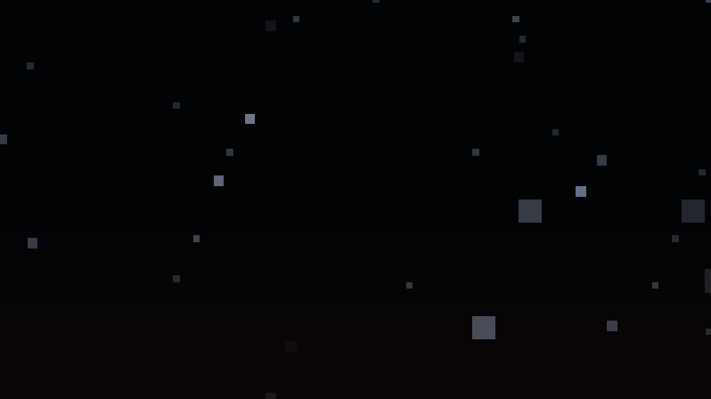

**Ergebnis:** Ein tiefschwarzer Raum voller kalter Sterne in drei Helligkeitsklassen, unten ein kaum sichtbarer warmer Schimmer. Statisch – aber die Bühne steht, und das Farbklima (kaltes Sternenlicht oben, Glut unten) ist bereits entschieden.

### Was passiert hier

**Sterne als Hash auf der Blickrichtung** ist der billigste Sternenhimmel, den es gibt: Die Richtung `rd` wird auf ein 2D-Gitter projiziert, jede Gitterzelle würfelt per `hash21` einmalig, ob sie einen Stern trägt (`smoothstep(0.988, 1.0, h)` lässt nur die obersten ~1 % der Hashwerte durch). Kein Zufall in der Zeit, kein Flackern – dasselbe Idiom wie der „Sternenstaub" im Crystal-Lights-Himmel, nur konsequent für den **vollen** Himmel statt nur für die obere Hälfte.

Dafür braucht es die kleine Funktion `richtungsUv`: Eine Richtung ist ein Punkt auf der Kugel, ein Gitter lebt in der Ebene – irgendeine Projektion muss vermitteln. Wir nehmen die **Würfelflächen-Projektion**: je nach dominanter Achse wird durch deren Betrag geteilt (die Richtung also auf eine der sechs Würfelseiten projiziert). Ehrlicherweise: An den Würfelkanten stoßen zwei verschiedene Gitter aneinander, und gegenüberliegende Flächen teilen sich ein Muster – beides ist bei einem Zufallsfeld aus Punkten praktisch unsichtbar. Genau deshalb dürfen wir uns diese grobe Projektion leisten; für ein strukturiertes Muster (Streifen, Text) wäre sie unbrauchbar.

Die **drei Schichten** unterscheiden sich in Gitterfeinheit (24/54/84), Schwelle und Helligkeit: wenige helle Sterne, viele schwache. Noch sind alle „unendlich fern" – in Schritt 13 bekommt jede Schicht einen eigenen **Parallaxe-Faktor**, dann wird aus den Schichten räumliche Tiefe: nahe Sternenstaub-Schicht zieht schneller am Bild vorbei als der ferne Hintergrund.

### 🎨 Experimentieren

- Schwelle `0.988` → `0.95`: Milchstraßen-Dichte (dann Helligkeit `0.30 + 0.70·…` senken, sonst rauscht es)
- `fract(h * 41.7)` steuert die Helligkeits-Streuung – durch `pow(fract(h * 41.7), 4.0)` ersetzen: wenige Leuchtfeuer zwischen vielen Glimmern
- Farbstich pro Stern: `mix(vec3(0.7, 0.8, 1.0), vec3(1.0, 0.85, 0.7), fract(h * 91.3))` – kalte und warme Sterne gemischt, wie am echten Himmel

---

## Schritt 2 – Das Raymarching-Gerüst: eine einzelne Kugel

**Neu:** `map()`, der klassische SDF-Marsch, die Tetraeder-Normale und ein neutrales Testlicht – das komplette Gerüst, an einer einzigen Kugel verifiziert, bevor die Repetition alles vervielfältigt.

```glsl
float hash21(vec2 p) { return fract(sin(dot(p, vec2(127.1, 311.7))) * 43758.5453); }

vec2 richtungsUv(vec3 rd)
{
    vec3 a = abs(rd);
    if (a.z >= a.x && a.z >= a.y) return rd.xy / a.z;
    if (a.x >= a.y)               return rd.zy / a.x;
    return rd.xz / a.y;
}

vec3 sterne(vec3 rd)
{
    vec3 acc = vec3(0.0);
    for (int s = 0; s < 3; s++) {
        float fs = float(s);
        vec2 su = richtungsUv(rd) * (24.0 + 30.0 * fs) + 13.7 * fs;
        float h = hash21(floor(su));
        float stern = smoothstep(0.988 + 0.004 * fs, 1.0, h);
        acc += stern * (0.30 + 0.70 * fract(h * 41.7)) * (1.0 - 0.28 * fs);
    }
    return acc * vec3(0.80, 0.87, 1.00);
}

// Die Szene: vorerst genau EINE Kugel im Ursprung
float map(vec3 p)
{
    return length(p) - 1.0;
}

// Klassischer SDF-Marsch (vgl. Pyramid-Spiral-Tutorial, Schritte 3-5)
float marchDebris(vec3 ro, vec3 rd)
{
    float t = 0.0;
    for (int i = 0; i < 110; i++) {
        float d = map(ro + rd * t);
        if (d < 0.001 + 0.0012 * t) return t;   // Trefftoleranz waechst mit der Ferne
        if (t > 60.0) break;
        t += d;                                  // volles Tempo - noch ist die SDF exakt
    }
    return -1.0;
}

// Normale aus dem Gradienten - Tetraeder-Variante: nur 4 map()-Aufrufe statt 6
vec3 calcNormal(vec3 p)
{
    const vec2 e = vec2(0.0012, -0.0012);
    return normalize(e.xyy * map(p + e.xyy) + e.yyx * map(p + e.yyx) +
                     e.yxy * map(p + e.yxy) + e.xxx * map(p + e.xxx));
}

void mainImage(out vec4 fragColor, in vec2 fragCoord)
{
    vec2 uv = (fragCoord - 0.5 * iResolution.xy) / iResolution.y;

    vec3 ro = vec3(0.0, 0.0, -4.5);
    vec3 rd = normalize(vec3(uv, 1.4));

    float t = marchDebris(ro, rd);

    vec3 color;
    if (t > 0.0) {
        vec3 p = ro + rd * t;
        vec3 n = calcNormal(p);
        // Neutrales Testlicht - das echte Material kommt in Schritt 9
        float dif = max(dot(n, normalize(vec3(0.65, 0.28, -0.70))), 0.0);
        color = vec3(0.05) + dif * vec3(0.85);
    } else {
        color = vec3(0.008, 0.010, 0.018) + sterne(rd);
    }

    fragColor = vec4(color, 1.0);
}
```

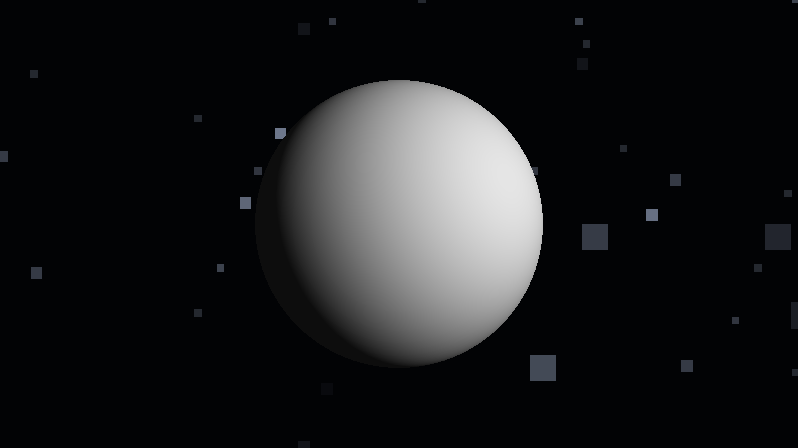

**Ergebnis:** Eine graue, seitlich beleuchtete Kugel vor dem Sternenhimmel. Unspektakulär – und genau richtig so: Marsch, Normale und Licht sind jetzt an der einfachsten möglichen Szene beweisbar korrekt.

### Was passiert hier

Das ist das Standard-Gerüst der Raymarching-Schule, in Kurzform: `map(p)` liefert den **vorzeichenbehafteten Abstand** zur Szene, der Marsch springt in Schritten dieser Größe am Strahl entlang (eine exakte SDF garantiert: nie zu weit), und die Normale entsteht aus vier leicht versetzten `map`-Auswertungen. Zwei Details lohnen den zweiten Blick:

1. **Die wachsende Trefftoleranz** `0.001 + 0.0012·t`: In der Ferne deckt ein Pixel viele Zentimeter Szene ab – dort genügt „ungefähr aufgesetzt". Ohne diesen Term flimmern ferne Silhouetten.
2. **Die Tetraeder-Normale** braucht nur vier statt sechs `map`-Aufrufe – die vier Versatzrichtungen `(+,−,−) (−,−,+) (−,+,−) (+,+,+)` bilden ein Tetraeder, und die gewichtete Summe der Abstände ergibt den Gradienten. Bei unserer späteren `map` (Hash-Kaskade + Rotationsmatrix pro Aufruf) zahlt sich jeder gesparte Aufruf doppelt aus.

Die Schleifengrenze ist bewusst eine **Konstante** (110) – WebGL2 verlangt das für verlässliche Kompilierung, und wir behalten sie das ganze Tutorial bei. Das Distanzlimit 60 ist unsere Weltgröße; wir rechnen in Schritt 7 nach, dass der Planet hineinpasst.

### 🎨 Experimentieren

- `t += d;` → `t += d * 0.5;`: exakt dasselbe Bild, doppelt so teuer – die Drossel ist bei einer exakten SDF reine Verschwendung. Merken für Schritt 5, wo sich das ändert
- `map` → `length(p) - 1.0 - 0.1 * sin(8.0 * p.y)`: erste Beulen – und mit `t += d` erste Löcher in der Silhouette. Die Vorschau auf das Drossel-Kapitel
- Brennweite `1.4` → `0.8`: Weitwinkel – im Trümmerfeld später deutlich dramatischer

---

## Schritt 3 – Domain-Repetition: aus einer Kugel wird ein Feld

**Neu:** `mod` in allen drei Achsen vervielfältigt die Kugel ins Unendliche – und `floor` liefert die **Zell-Id**, die Adresse jedes Exemplars. Dazu eine erste, provisorische Kamerafahrt zum Inspizieren.

```glsl
// ---- STELLSCHRAUBEN --------------------------------------------------------
const float ZELLE = 3.0;    // Kantenlaenge einer Gitterzelle (Welteinheiten)
// ----------------------------------------------------------------------------

float hash21(vec2 p) { return fract(sin(dot(p, vec2(127.1, 311.7))) * 43758.5453); }

// Hash: Zell-Id (vec3) -> drei unabhaengige "Zufallswerte" 0..1
vec3 hash33(vec3 p)
{
    return fract(sin(vec3(dot(p, vec3(127.1, 311.7,  74.7)),
                          dot(p, vec3(269.5, 183.3, 246.1)),
                          dot(p, vec3(113.5, 271.9, 124.6)))) * 43758.5453);
}

vec2 richtungsUv(vec3 rd)
{
    vec3 a = abs(rd);
    if (a.z >= a.x && a.z >= a.y) return rd.xy / a.z;
    if (a.x >= a.y)               return rd.zy / a.x;
    return rd.xz / a.y;
}

vec3 sterne(vec3 rd)
{
    vec3 acc = vec3(0.0);
    for (int s = 0; s < 3; s++) {
        float fs = float(s);
        vec2 su = richtungsUv(rd) * (24.0 + 30.0 * fs) + 13.7 * fs;
        float h = hash21(floor(su));
        float stern = smoothstep(0.988 + 0.004 * fs, 1.0, h);
        acc += stern * (0.30 + 0.70 * fract(h * 41.7)) * (1.0 - 0.28 * fs);
    }
    return acc * vec3(0.80, 0.87, 1.00);
}

// GEAENDERT: die Szene wiederholt sich in allen drei Achsen
float map(vec3 p)
{
    vec3 id = floor(p / ZELLE);            // Adresse der Zelle (noch ungenutzt)
    vec3 q  = mod(p, ZELLE) - 0.5 * ZELLE; // Position RELATIV zum Zellzentrum

    return length(q) - 0.9;
}

float marchDebris(vec3 ro, vec3 rd)
{
    float t = 0.0;
    for (int i = 0; i < 110; i++) {
        float d = map(ro + rd * t);
        if (d < 0.001 + 0.0012 * t) return t;
        if (t > 60.0) break;
        t += d;
    }
    return -1.0;
}

vec3 calcNormal(vec3 p)
{
    const vec2 e = vec2(0.0012, -0.0012);
    return normalize(e.xyy * map(p + e.xyy) + e.yyx * map(p + e.yyx) +
                     e.yxy * map(p + e.yxy) + e.xxx * map(p + e.xxx));
}

void mainImage(out vec4 fragColor, in vec2 fragCoord)
{
    vec2 uv = (fragCoord - 0.5 * iResolution.xy) / iResolution.y;

    // Provisorische Fahrt: geradeaus durchs Gitter, BEWUSST neben den Zentren
    vec3 ro = vec3(0.4, 0.3, iTime * 0.9);
    vec3 rd = normalize(vec3(uv, 1.4));

    float t = marchDebris(ro, rd);

    vec3 color;
    if (t > 0.0) {
        vec3 p = ro + rd * t;
        vec3 n = calcNormal(p);
        float dif = max(dot(n, normalize(vec3(0.65, 0.28, -0.70))), 0.0);
        color = vec3(0.05) + dif * vec3(0.85);

        // Debug: jede Zelle bekommt ihre Identitaet als Farbe
        vec3 id = floor(p / ZELLE);
        color *= 0.4 + 0.6 * hash33(id);
    } else {
        color = vec3(0.008, 0.010, 0.018) + sterne(rd);
    }

    fragColor = vec4(color, 1.0);
}
```

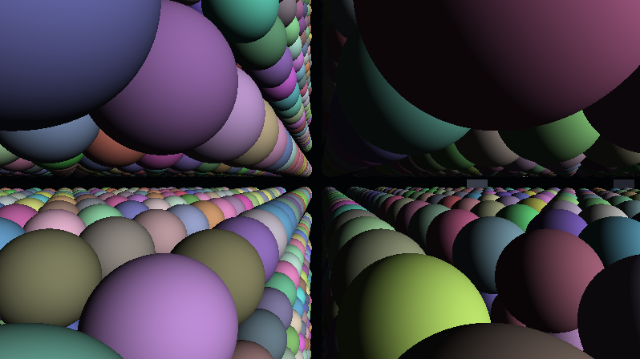

**Ergebnis:** Ein unendliches, regelmäßiges Gitter aus Kugeln zieht an der Kamera vorbei – jede in ihrer eigenen Pastellfarbe. Der Raum ist gefüllt, und jede Kugel ist bereits **adressierbar**.

### Was passiert hier

**Die zwei wichtigsten Zeilen des ganzen Shaders:**

```glsl
vec3 id = floor(p / ZELLE);
vec3 q  = mod(p, ZELLE) - 0.5 * ZELLE;
```

`mod` faltet den unendlichen Raum in eine einzige Zelle: Egal wo der Marsch gerade steht, `q` ist immer die Position relativ zum Zentrum der aktuellen Zelle (`− 0.5·ZELLE` schiebt den mod-Bereich `0..ZELLE` auf `−1.5..+1.5`). Eine Kugel-SDF auf `q` beschreibt damit **alle** Kugeln gleichzeitig – Repetition kostet exakt nichts. `floor` liefert das Gegenstück: die ganzzahlige **Adresse** der Zelle. Noch tut sie nichts außer Debug-Farbe – aber ab dem nächsten Schritt hängt das gesamte Individuum daran.

**Warum der Marsch hier noch exakt ist:** Weil `|q| ≤ 1.5` in jeder Komponente gilt, ist das eigene Zellzentrum immer das *nächste* Zentrum überhaupt – die Distanz zur eigenen Kugel ist also die wahre Szenen-Distanz, solange **alle Zellen identisch** sind. `t += d` in vollem Tempo bleibt erlaubt. Diese Begründung fällt in Schritt 4 in sich zusammen (verschieden große, teils fehlende Objekte), und genau dort bauen wir das Sicherheitsnetz.

**Die Kamerabahn ist nachgerechnet, nicht geraten:** Sie fliegt bei `x = 0.4, y = 0.3` – die Zellzentren liegen (durch das `floor`-Gitter) bei `±1.5, ±4.5, …` in jeder Achse. Der kleinste Quer-Abstand der Bahn zu einem Zentrum ist damit `√(1.1² + 1.2²) ≈ 1.63` – mehr als der Kugelradius 0.9, die Kamera fliegt garantiert **zwischen** den Kugeln hindurch, nie hindurch. Diese kleine Rechnung wird zur Pflicht, sobald die freie Kamerafahrt kommt (Schritt 13 löst das anders: mit einer „Kamera-Blase").

🧠 **Merke:** `floor` und `mod` sind ein Paar – dieselbe Division, zwei Auskünfte: **wo bin ich** (Id) und **wo in der Zelle bin ich** (q). Wer nur `mod` benutzt, hat Klone; erst mit `floor` bekommt jeder Klon ein Ich.

### 🎨 Experimentieren

- `ZELLE = 1.6` (Radius bleibt 0.9): die Kugeln durchdringen einander – so sieht der Bruch der Zellregel aus, die uns ab Schritt 4 beschäftigt
- Nur zwei Achsen wiederholen (`q.xy = mod(p.xy, ZELLE) - 0.5 * ZELLE; q.z = p.z - 1.5;` und `id.z = 0.0;`): eine unendliche Kugel-**Wand** statt eines Raums
- Debug-Farbe weglassen und `ZELLE = 6.0`: wie schnell aus „Feld" gefühlte Leere wird – Dichte ist Zellgröße

---

## Schritt 4 – Ausdünnung & Varianz: leere Zellen, Cluster – und die Zellwand-Klammer

**Neu:** Ein Hash entscheidet je Zelle über **leer oder belegt** (mit Cluster-Regionen aus grobem Noise), jede belegte Zelle bekommt ihre eigene **Größe** – und weil die Zellen damit verschieden werden, braucht der Marsch ein beweisbares Sicherheitsnetz: die **Zellwand-Klammer**.

```glsl
// ---- STELLSCHRAUBEN (erweitert) --------------------------------------------
const float ZELLE       = 3.0;   // Kantenlaenge einer Gitterzelle
const float DICHTE      = 0.55;  // Anteil belegter Zellen (0 = leer .. ~0.9 = voll)
const float GROESSE_MAX = 1.0;   // Groessen-Budget je Truemmerteil (s. Zellregel!)

// Abgeleitet: Sicherheitsabstand Zellwand -> naechstmoegliche Nachbar-Oberflaeche.
// 1.1 * GROESSE_MAX ist der maximale Umkugel-Radius eines Teils (Schritt 5).
const float MARGE = ZELLE * 0.5 - 1.1 * GROESSE_MAX;
// ----------------------------------------------------------------------------

float hash21(vec2 p) { return fract(sin(dot(p, vec2(127.1, 311.7))) * 43758.5453); }
float hash13(vec3 p) { return fract(sin(dot(p, vec3(127.1, 311.7, 74.7))) * 43758.5453); }

vec3 hash33(vec3 p)
{
    return fract(sin(vec3(dot(p, vec3(127.1, 311.7,  74.7)),
                          dot(p, vec3(269.5, 183.3, 246.1)),
                          dot(p, vec3(113.5, 271.9, 124.6)))) * 43758.5453);
}

// Value-Noise (2D) - fuer die groben Cluster-Regionen
float vnoise(vec2 p)
{
    vec2 i = floor(p), f = fract(p);
    vec2 u = f * f * (3.0 - 2.0 * f);
    return mix(mix(hash21(i),              hash21(i + vec2(1, 0)), u.x),
               mix(hash21(i + vec2(0, 1)), hash21(i + vec2(1, 1)), u.x), u.y);
}

vec2 richtungsUv(vec3 rd)
{
    vec3 a = abs(rd);
    if (a.z >= a.x && a.z >= a.y) return rd.xy / a.z;
    if (a.x >= a.y)               return rd.zy / a.x;
    return rd.xz / a.y;
}

vec3 sterne(vec3 rd)
{
    vec3 acc = vec3(0.0);
    for (int s = 0; s < 3; s++) {
        float fs = float(s);
        vec2 su = richtungsUv(rd) * (24.0 + 30.0 * fs) + 13.7 * fs;
        float h = hash21(floor(su));
        float stern = smoothstep(0.988 + 0.004 * fs, 1.0, h);
        acc += stern * (0.30 + 0.70 * fract(h * 41.7)) * (1.0 - 0.28 * fs);
    }
    return acc * vec3(0.80, 0.87, 1.00);
}

// NEU: ist diese Zelle belegt? Hash-Schwelle, moduliert von groben Clustern
bool belegt(vec3 id)
{
    // 2D-Noise mit y-Versatz als billiger 3D-Ersatz: dichte und leere Regionen
    float cluster = vnoise(id.xz * 0.23 + id.y * 0.31);
    float schwelle = DICHTE * 1.6 * smoothstep(0.25, 0.75, cluster);
    return hash13(id + 4.7) < schwelle;
}

// GEAENDERT: Ausduennung + Groesse je Zelle + Zellwand-Klammer
float map(vec3 p)
{
    vec3 id = floor(p / ZELLE);
    vec3 q  = mod(p, ZELLE) - 0.5 * ZELLE;

    // Zellwand-Klammer: Abstand zur naechsten Zellwand + MARGE ist eine
    // KONSERVATIVE untere Schranke fuer alles ausserhalb dieser Zelle
    float wand = ZELLE * 0.5 - max(abs(q.x), max(abs(q.y), abs(q.z)));
    float sicher = wand + MARGE;

    if (!belegt(id)) return sicher;

    float gr = GROESSE_MAX * (0.35 + 0.65 * hash13(id + 3.1));
    return min(length(q) - 0.9 * gr, sicher);
}

float marchDebris(vec3 ro, vec3 rd)
{
    float t = 0.0;
    for (int i = 0; i < 110; i++) {
        float d = map(ro + rd * t);
        if (d < 0.001 + 0.0012 * t) return t;
        if (t > 60.0) break;
        t += d;
    }
    return -1.0;
}

vec3 calcNormal(vec3 p)
{
    const vec2 e = vec2(0.0012, -0.0012);
    return normalize(e.xyy * map(p + e.xyy) + e.yyx * map(p + e.yyx) +
                     e.yxy * map(p + e.yxy) + e.xxx * map(p + e.xxx));
}

void mainImage(out vec4 fragColor, in vec2 fragCoord)
{
    vec2 uv = (fragCoord - 0.5 * iResolution.xy) / iResolution.y;

    vec3 ro = vec3(0.4, 0.3, iTime * 0.9);
    vec3 rd = normalize(vec3(uv, 1.4));

    float t = marchDebris(ro, rd);

    vec3 color;
    if (t > 0.0) {
        vec3 p = ro + rd * t;
        vec3 n = calcNormal(p);
        float dif = max(dot(n, normalize(vec3(0.65, 0.28, -0.70))), 0.0);
        color = vec3(0.05) + dif * vec3(0.85);

        vec3 id = floor(p / ZELLE);
        color *= 0.4 + 0.6 * hash33(id);
    } else {
        color = vec3(0.008, 0.010, 0.018) + sterne(rd);
    }

    fragColor = vec4(color, 1.0);
}
```

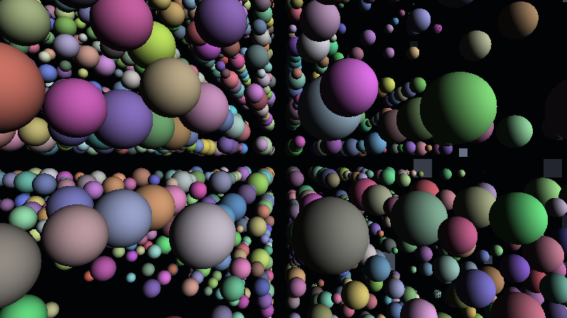

**Ergebnis:** Kein Gitter mehr – ein **Feld**. Kugeln verschiedener Größe hängen in unregelmäßigen Schwärmen im Raum, dazwischen echte Leere; der Blick findet dichte Wolken und offene Schneisen. Das Trümmerfeld hat seine Verteilung.

### Was passiert hier – die Zellregel und ihr Beweis

Sobald die Zellen verschieden sind, ist `map` **keine exakte SDF mehr**: Der Wert misst nur den Abstand zum Objekt der *eigenen* Zelle. Steht der Strahl in einer leeren Zelle, wäre der naive Abstand „unendlich" – ein Schritt in dieser Größe überspringt das dicke Trümmerteil der Nachbarzelle, und die Silhouetten bekommen Löcher. Der übliche Reflex (Drossel `t += d·0.4` und hoffen) ist hier unnötig – es geht **beweisbar**:

1. **Die Zellregel:** Jedes Objekt liegt vollständig in einer Umkugel vom Radius `R_MAX = 1.1·GROESSE_MAX` um sein Zellzentrum. (Die 1.1 rechnen wir in Schritt 5 für jede Form einzeln nach; die Kugel hier bleibt mit 0.9 deutlich darunter.)
2. **Die Klammer:** `wand` ist der Abstand zur nächsten Zellwand. Jedes fremde Zentrum liegt mindestens `ZELLE/2` **hinter** dieser Wand, jede fremde Oberfläche also mindestens `wand + (ZELLE/2 − R_MAX)` entfernt. Genau das ist `sicher = wand + MARGE` mit `MARGE = 1.5 − 1.1 = 0.4`.
3. `min(eigenesObjekt, sicher)` ist damit eine **echte untere Schranke** der Szenen-Distanz – der Marsch darf weiter mit vollem `t += d` laufen und kann nichts überspringen.

Der Preis ist Tempo: In leeren Zellen ist der Schritt auf `wand + 0.4` gedeckelt (~1.9 im Zellzentrum, weniger an den Wänden) – der Strahl tastet sich Zelle für Zelle voran statt in einem Satz zum Horizont. Überschlag: 60 Welteinheiten Leere ÷ ~1.3 mittlere Schrittweite ≈ 45 Iterationen – unser Budget von 110 trägt das samt Objektannäherungen. **Und die Warnung, die dazugehört:** Wer `GROESSE_MAX` über ~1.2 dreht (oder `ZELLE` verkleinert), macht `MARGE` negativ – dann ragen Teile aus ihren Zellen, die Klammer lügt, und es hagelt Wand-Artefakte. Zellgröße und Größenbudget sind **ein** Regler mit zwei Enden.

**Die Cluster** sind das Feld-Denken des Vorgängers, auf Ids übertragen: `vnoise(id.xz·0.23 + id.y·0.31)` liefert eine grobe, glatte Dichte-Landschaft über dem Gitter (der `id.y`-Versatz missbraucht 2D-Noise als billiges Pseudo-3D – gut genug, ehrlich benannt). `smoothstep` presst sie zu klaren Regionen: Schwärme und Leere statt gleichmäßigem Konfetti. Echte Trümmerfelder klumpen – Kollisionen erzeugen Wolken, keine Gleichverteilung.

### 💡 Warum die Klammer statt der Drossel?

Die Drossel (ein fester Faktor auf jeden Schritt) ist ein *Pauschalverdacht* – sie verlangsamt auch dort, wo nichts droht, und garantiert trotzdem nichts (bei genug Pech tunnelt der Strahl weiter). Die Klammer ist eine *Ortsauskunft*: exakt dort vorsichtig, wo Fremdes nah sein könnte, mit Beweis. Die Drossel kommt trotzdem gleich noch – aber aus einem anderen, ehrlichen Grund: Verbeulungs-Displacement (Schritt 5) macht die *eigene* Objektdistanz unscharf, und dagegen hilft nur Vorsicht.

### 🎨 Experimentieren

- `DICHTE = 0.15` → einsame Wrackteile; `0.85` → Asteroidengürtel (Achtung: teurer, mehr Zell-Stopps pro Strahl)
- Cluster-Schärfe: `smoothstep(0.25, 0.75, …)` → `smoothstep(0.45, 0.55, …)`: harte Schwarm-Grenzen wie Wetterfronten
- `MARGE` testweise auf `0.4 → 1.2` erhöhen: das Bild bleibt gleich, nur langsamer – die Klammer ist konservativ, nie falsch. Umgekehrt `0.0 → -0.5` erzwingen: die Wand-Artefakte einmal absichtlich ansehen
- `id.y * 0.31` → `id.y * 0.0`: die Cluster werden zu vertikalen Säulen – man sieht sofort, was der y-Versatz leistet

---

## Schritt 5 – Die Formbibliothek: Brocken, Platten, Träger, Ringe

**Neu:** Eine Form-Weiche je Zelle ersetzt die Einheitskugel durch vier Trümmer-Typen – verbeulte Brocken, flache Paneele, lange Träger und Ringe. Dazu die Drossel, die das Beulen-Displacement erzwingt.

```glsl
// NEU: SDF-Bausteine (Klassiker, vgl. Pyramid-Spiral-Tutorial)
float sdBox(vec3 p, vec3 b)
{
    vec3 q = abs(p) - b;
    return length(max(q, 0.0)) + min(max(q.x, max(q.y, q.z)), 0.0);
}

float sdTorus(vec3 p, vec2 t)
{
    vec2 q = vec2(length(p.xz) - t.x, p.y);
    return length(q) - t.y;
}

// NEU: die Formbibliothek - Form-Weiche aus der Zell-Id.
// ZELLREGEL: jede Form passt in eine Umkugel vom Radius 1.1 * gr (Nachweis im Text).
float truemmerForm(vec3 q, vec3 id, float gr)
{
    float wForm = hash13(id + 7.3);
    float d;

    if (wForm < 0.40) {
        // (a) BROCKEN: Box mit Hash-Proportionen, von Sinus-Noise verbeult
        vec3 b = gr * (0.30 + 0.28 * hash33(id + 2.6));
        d = sdBox(q, b);
        d -= 0.08 * gr * sin(4.7 * q.x) * sin(4.3 * q.y) * sin(5.1 * q.z);
    } else if (wForm < 0.65) {
        // (b) PLATTE / PANEEL: flach und breit - Solarpaneel-Silhouette
        d = sdBox(q, gr * vec3(0.85, 0.06, 0.55));
    } else if (wForm < 0.85) {
        // (c) TRAEGER / STAB: lang und duenn - Fachwerk-Rest
        d = sdBox(q, gr * vec3(0.08, 0.95, 0.08));
    } else {
        // (d) RING: Kopplungsring, Tankreif
        d = sdTorus(q, gr * vec2(0.62, 0.10));
    }
    return d;
}

// GEAENDERT: map ruft die Bibliothek auf
float map(vec3 p)
{
    vec3 id = floor(p / ZELLE);
    vec3 q  = mod(p, ZELLE) - 0.5 * ZELLE;

    float wand = ZELLE * 0.5 - max(abs(q.x), max(abs(q.y), abs(q.z)));
    float sicher = wand + MARGE;

    if (!belegt(id)) return sicher;

    float gr = GROESSE_MAX * (0.35 + 0.65 * hash13(id + 3.1));
    return min(truemmerForm(q, id, gr), sicher);
}

// GEAENDERT: der Marsch bekommt die Drossel (Displacement!)
float marchDebris(vec3 ro, vec3 rd)
{
    float t = 0.0;
    for (int i = 0; i < 110; i++) {
        float d = map(ro + rd * t);
        if (d < 0.001 + 0.0012 * t) return t;
        if (t > 60.0) break;
        t += d * 0.7;                       // 70%-Schritte: Reserve fuer die Beulen
    }
    return -1.0;
}
```

*(Alles andere – Stellschrauben, Hashes, `belegt`, `calcNormal`, Sterne, `mainImage` – bleibt wörtlich wie in Schritt 4.)*

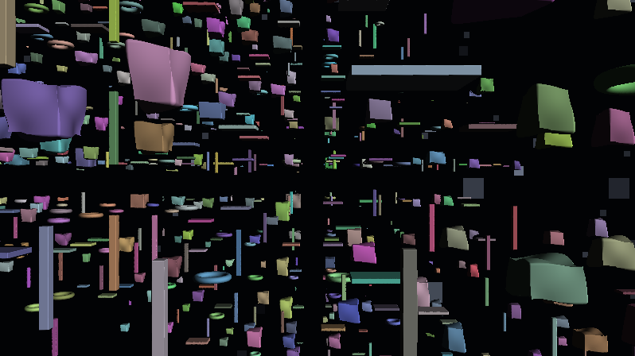

**Ergebnis:** Das Feld wird zum **Schrottplatz im Orbit**: kantige, verbeulte Brocken neben flachen Paneelen, dazwischen lange Streben und einzelne Ringe – alle Größen gemischt, alle noch achsenparallel ausgerichtet (das ändert der nächste Schritt).

### Was passiert hier

**Die Form-Weiche** ist dasselbe Muster wie jede andere Zell-Eigenschaft: ein Hash, vier Intervalle. Die Anteile (40 % Brocken, 25 % Platten, 20 % Träger, 15 % Ringe) sind Dramaturgie – Brocken sind die Basis-Masse, die selteneren, klar lesbaren Silhouetten (Ring!) werden zu Blickfängen. Solche Verteilungen stellt man nach Gefühl ein, aber an **einer** Stelle: Die Weiche lebt komplett in `truemmerForm`, der Rest des Shaders kennt nur „ein Objekt mit Radius ≤ 1.1·gr".

**Die Zellregel, nachgerechnet** (Umkugel-Radius je Form, in Einheiten von `gr`):

| Form | Ausdehnung | Umkugel |
|---|---|---|
| Brocken | Box-Halbachsen ≤ 0.58 → Diagonale √3·0.58 ≈ 1.00 | + Beule 0.08 ⇒ **1.08** |
| Platte | √(0.85² + 0.06² + 0.55²) | ≈ **1.01** |
| Träger | √(0.08² + 0.95² + 0.08²) | ≈ **0.96** |
| Ring | 0.62 + 0.10 | = **0.72** |

*Tab. 3: Zellregel-Nachweis – Umkugel-Radius je Form der Bibliothek, in Einheiten von `gr`*

Maximum 1.08 ≤ 1.1 – das Budget aus Schritt 4 hält, `MARGE = 0.4` bleibt gültig. **Diese Tabelle ist der Vertrag der Formbibliothek:** Wer eine fünfte Form ergänzt, rechnet ihre Umkugel nach und prüft sie gegen `1.1·gr` – sonst bricht die Klammer, und zwar nicht an der neuen Form, sondern als scheinbar zusammenhanglose Wand-Artefakte irgendwo im Feld. *(Wichtig für Schritt 6: Die Umkugel ist rotationsinvariant – ein Teil, das in seine Umkugel passt, passt auch getaumelt hinein. Das Budget ist bereits taumelfest.)*

**Die Beulen** sind klassisches Displacement: drei gekreuzte Sinusse, vom Objektmaß `gr` skaliert, werden von der Box-Distanz abgezogen – aus Frachtcontainern werden angeschlagene Brocken. Der Preis: Die Distanz ist jetzt nur noch eine *Schätzung* (das Displacement kann den echten Abstand um bis zu seine Steigung unterschätzen), und dagegen hilft nur die **Drossel** `t += d·0.7`. Man beachte die Arbeitsteilung, sie ist das Sicherheits-Fazit des ganzen Geometrie-Teils: **Die Klammer schützt vor den Nachbarn (beweisbar), die Drossel vor der eigenen Beule (heuristisch).**

### 🎨 Experimentieren

- Beulen-Amplitude `0.08` → `0.16` (und die Drossel auf `0.6`): zerschossene Wracks – Umkugel neu rechnen: 1.00 + 0.16 = 1.16 > 1.1, also auch `MARGE` nachziehen!
- Weiche umverteilen: `wForm < 0.10` für Brocken, Rest Ringe/Träger → ein zerbrochenes Gerüst statt eines Schuttfelds
- Platten dünner (`0.06` → `0.02`): Folien – von der Kante fast unsichtbar, im Gegenlicht (Schritt 9) dramatisch
- Debug: `color = vec3(wForm);` im Trefferfall – die Verteilung der Weiche als Graustufen prüfen

---

## Schritt 6 – Taumeln: jede Zelle rotiert um ihre eigene Achse

**Neu:** Jedes Trümmerteil bekommt eine eigene, **konstante** Rotationsachse und ein eigenes Tempo – deterministisch aus der Zell-Id – und dreht sich seit „Ewigkeiten" darum. Das Feld beginnt zu leben, ohne dass irgendetwas gesteuert wird.

*Ab jetzt zeigen die Schritte nur noch die geänderten bzw. neuen Funktionen – alles andere bleibt wörtlich wie im vorherigen Schritt stehen. (Am Ende von Schritt 14 steht der komplette Shader noch einmal am Stück.)*

```glsl
// ---- STELLSCHRAUBEN (erweitert) --------------------------------------------
const float TAUMEL = 1.0;   // globales Taumel-Tempo (0 = eingefroren)
// ----------------------------------------------------------------------------

// NEU: Rotationsmatrix um beliebige Achse (Rodrigues-Formel)
mat3 rotAchse(vec3 a, float w)
{
    float c = cos(w), s = sin(w), k = 1.0 - c;
    return mat3(a.x * a.x * k + c,       a.y * a.x * k + a.z * s,  a.z * a.x * k - a.y * s,
                a.x * a.y * k - a.z * s, a.y * a.y * k + c,        a.z * a.y * k + a.x * s,
                a.x * a.z * k + a.y * s, a.y * a.z * k - a.x * s,  a.z * a.z * k + c);
}

// GEAENDERT in map(): vor der Formauswertung wird die Zelle gedreht
float map(vec3 p)
{
    vec3 id = floor(p / ZELLE);
    vec3 q  = mod(p, ZELLE) - 0.5 * ZELLE;

    float wand = ZELLE * 0.5 - max(abs(q.x), max(abs(q.y), abs(q.z)));
    float sicher = wand + MARGE;

    if (!belegt(id)) return sicher;

    // Taumeln: Achse, Tempo und Phase sind KONSTANTEN der Zelle -
    // nur der Winkel laeuft mit der Zeit
    vec3 achse = normalize(hash33(id + 5.7) - 0.5 + vec3(0.01, 0.02, 0.03));
    float tempo = (0.25 + 1.25 * hash13(id + 9.2)) * TAUMEL;
    float phase = 6.28318 * hash13(id + 1.9);
    q = rotAchse(achse, iTime * tempo + phase) * q;

    float gr = GROESSE_MAX * (0.35 + 0.65 * hash13(id + 3.1));
    return min(truemmerForm(q, id, gr), sicher);
}
```

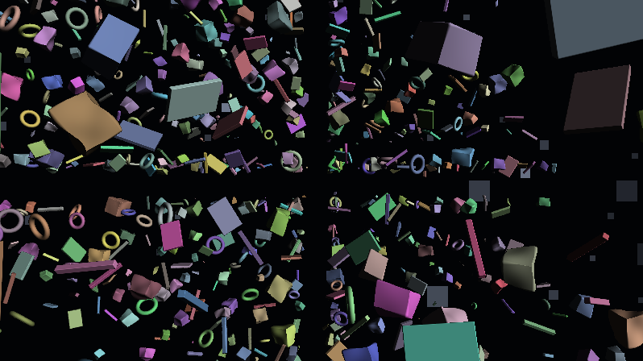

**Ergebnis:** Das Feld **taumelt**. Jeder Brocken kreiselt gemächlich um seine eigene, schiefe Achse, jede Platte kippt in ihrem eigenen Rhythmus, Ringe rollen scheinbar auf der Stelle – kein Teil bewegt sich wie ein anderes, und doch ist alles vollkommen deterministisch.

### Was passiert hier

**Wir drehen nicht das Objekt, sondern den Raum.** Der SDF-Grundtrick: Statt die Form zu transformieren (unmöglich – sie ist eine Formel), transformieren wir die Anfrage-Position **invers**. `q = R·q` vor dem `truemmerForm`-Aufruf heißt: Das Objekt erscheint um `R⁻¹` gedreht. Da unsere Achsen Zufall sind, ist die Unterscheidung egal – wichtig ist nur, dass die Rotation **starr** ist: Distanzen bleiben exakt erhalten, die Drossel- und Klammer-Argumentation aus den Schritten 4–5 gilt unverändert weiter. Und weil die Beulen auf dem *gedrehten* `q` ausgewertet werden, taumeln die Dellen korrekt mit ihrem Brocken mit.

**Drei Zell-Konstanten, eine Uhr:**

- `achse`: aus `hash33 − 0.5` – ein Zufallsvektor im Würfel, normalisiert. Das kleine `+ vec3(0.01, 0.02, 0.03)` ist kein Schmuck: Ohne es könnte eine (einzige, aber ewige) Pechzelle den fast-Nullvektor hashen und `normalize` zu NaN machen – deterministische Fehler sind treue Fehler.
- `tempo`: 0.25–1.5 rad/s, je Zelle fest. Ein gegenläufiger Drehsinn braucht kein Vorzeichen – die gespiegelte Achse *ist* der gegenläufige Drehsinn, und die decken die Hashes ab.
- `phase`: verhindert, dass alle Teile bei `iTime = 0` in Hash-Grundstellung stehen – das Feld taumelt „schon immer", auch im allerersten Frame.

**Die Kostenfrage gehört hier ins Protokoll:** `map` läuft bis zu 110-mal pro Pixel, und jetzt stecken darin ein `sin`/`cos`-Paar und ein Matrixaufbau (9 Multiplikationen) – zusätzlich viermal pro Treffer für die Normale. Das ist die teuerste Einzelentscheidung des Shaders, und sie ist es wert: Die Alternative (Winkel pro Zelle vorberechnen) existiert im Fragment-Shader schlicht nicht – es gibt keinen Ort, an dem „pro Zelle einmal" lebt. Was wir stattdessen tun: die Rotation **hinter** die beiden frühen Ausstiege legen (leere Zelle, ferne Wand) – der teure Code läuft nur, wenn die Zelle wirklich befragt wird. Auf moderner Hardware bleibt das flüssig; wer auf schwacher GPU testet, dreht zuerst die Marsch-Iterationen herunter, nicht das Taumeln.

⚠️ **Die Zellregel, zum Dritten:** Rotation ändert die Umkugel nicht (deshalb haben wir in Schritt 5 mit Umkugeln statt Bounding-Boxen gerechnet!) – aber wer jetzt „nur kurz" einen Träger auf `1.4·gr` verlängert, hat ein Teil, das **beim Taumeln periodisch** aus seiner Zelle ragt: Artefakte, die kommen und gehen, die schlimmste Sorte. Objekt muss in die Zelle passen – *auch rotiert*, und die Umkugel ist der einzige ehrliche Maßstab dafür.

### 🎨 Experimentieren

- `TAUMEL = 0.15`: majestätische Zeitlupe (sehr „2001"); `3.0`: nervöses Flirren – erstaunlich, wie stark allein dieses Tempo die Stimmung setzt
- Tempo an die Größe koppeln: `tempo *= GROESSE_MAX / max(gr, 0.2);` (dazu `gr` vor die Rotation ziehen) – kleine Teile wirbeln, große Brocken drehen träge: physikalisch plausibler Drehimpuls
- Nur eine Achse fürs ganze Feld (`achse = vec3(0.0, 1.0, 0.0)`): synchronisierte Drehung – sofort künstlich, wie ein Uhrwerk. Der beste Beweis, was die Individual-Achsen leisten
- `phase` weglassen und `iTime` bei 0 anhalten (Shadertoy-Pause + Rewind): alle Hash-Grundstellungen auf einen Blick

---

## Schritt 7 – Der Planet: glühender Grund unter dem Feld

**Neu:** Die dritte Etage – eine **analytische Riesenkugel** unter der Kamera, deren Oberfläche ein mehrschichtiger FBM-Glutgrund ist: das `rs_lav`/`noise3`-Erbe des Presets, übersetzt in ehrliche 3D-Treffpunkte.

```glsl
// ---- STELLSCHRAUBEN (erweitert) --------------------------------------------
const float PLANET_HOEHE  = 8.0;   // Abstand Kamerabahn -> Planetenoberflaeche
const float PLANET_RADIUS = 60.0;  // Kruemmungsradius (gross = flacher Horizont)
const float GLUT          = 1.2;   // Intensitaet des Lavagrunds

const vec3 PLANET_ZENTRUM = vec3(0.0, -(PLANET_RADIUS + PLANET_HOEHE), 0.0);
// ----------------------------------------------------------------------------

// NEU: fraktales Rauschen - unser noise3-Gegenstueck (Oktaven: feiner + leiser)
float fbm(vec2 p)
{
    float v = 0.0, a = 0.5;
    for (int i = 0; i < 5; i++) { v += a * vnoise(p); p = p * 2.03 + 11.7; a *= 0.5; }
    return v;
}

// NEU: Kugelschnitt - reine Algebra, kein Marsch
float planetHit(vec3 ro, vec3 rd)
{
    vec3 oc = ro - PLANET_ZENTRUM;
    float b = dot(oc, rd);
    float c = dot(oc, oc) - PLANET_RADIUS * PLANET_RADIUS;
    float h = b * b - c;
    if (h < 0.0) return -1.0;
    float t = -b - sqrt(h);
    return (t > 0.0) ? t : -1.0;
}

// NEU: der Glutgrund - Kontinente aus Glut, Adern aus verbogenem Noise
vec3 lavaFarbe(vec2 q)
{
    float grund = fbm(q * 0.045 + vec2(iTime * 0.010, 0.0));   // grosse Glut-Kontinente
    float adern = fbm(q * 0.16 + grund * 1.8 + 7.0);           // Noise verbiegt Noise
    float glut  = pow(clamp(adern * 1.35 - 0.25, 0.0, 1.0), 2.2) * GLUT;

    vec3 col = vec3(0.028, 0.010, 0.012);                       // dunkle Kruste
    col = mix(col, vec3(0.55, 0.08, 0.015), smoothstep(0.10, 0.45, glut));
    col = mix(col, vec3(1.15, 0.55, 0.10),  smoothstep(0.45, 0.85, glut));
    col = mix(col, vec3(1.60, 1.25, 0.55),  smoothstep(0.85, 1.05, glut));
    return col;
}

// NEU: Planet-Shading (Wolken und Atmosphaere folgen in Schritt 8)
vec3 shadePlanet(vec3 p, float t)
{
    vec3 col = lavaFarbe(p.xz);
    col *= exp(-t * 0.012);                 // Ferne daempfen (Provisorium)
    return col;
}

// GEAENDERT: der Marsch bekommt eine Obergrenze (nicht hinter den Planeten marschieren)
float marchDebris(vec3 ro, vec3 rd, float tMax)
{
    float t = 0.0;
    for (int i = 0; i < 110; i++) {
        float d = map(ro + rd * t);
        if (d < 0.001 + 0.0012 * t) return t;
        if (t > tMax) break;
        t += d * 0.7;
    }
    return -1.0;
}
```

Und `mainImage` sortiert die drei Etagen:

```glsl
    float tP = planetHit(ro, rd);
    float tMax = (tP > 0.0) ? min(60.0, tP + 0.5) : 60.0;
    float tD = marchDebris(ro, rd, tMax);

    vec3 color;
    if (tD > 0.0 && (tP < 0.0 || tD < tP)) {
        vec3 p = ro + rd * tD;
        vec3 n = calcNormal(p);
        float dif = max(dot(n, normalize(vec3(0.65, 0.28, -0.70))), 0.0);
        color = vec3(0.05) + dif * vec3(0.85);
        color *= 0.4 + 0.6 * hash33(floor(p / ZELLE));
    } else if (tP > 0.0) {
        color = shadePlanet(ro + rd * tP, tP);
    } else {
        color = vec3(0.008, 0.010, 0.018) + sterne(rd);
    }
```

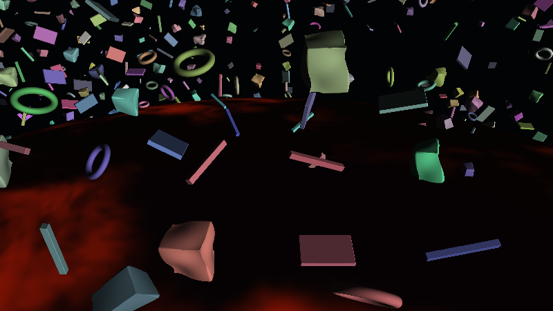

**Ergebnis:** Unter dem Trümmerfeld glüht jetzt ein Planet – dunkle Kruste, von orangeroten Glut-Adern durchzogen, zu den Kontinenrändern hin gelb aufbrechend, langsam driftend. Der Horizont krümmt sich sichtbar unter dem Feld weg. (Noch schaut die provisorische Kamera geradeaus – wer den Planeten sehen will, kippt `rd` testweise mit `rd.yz *= mat2(cos(-0.4), sin(-0.4), -sin(-0.4), cos(-0.4));` nach unten. Schritt 12 erledigt das choreografiert.)

### Was passiert hier

**Warum eine Riesenkugel und keine Ebene?** Wegen des Horizonts. Eine unendliche Ebene unter der Kamera hat ihren Horizont exakt auf Augenhöhe (`rd.y = 0`) – das Bild wäre hälftig geteilt wie beim Terrain-Shader, und „Orbit-Gefühl" käme nie auf. Bei einer Kugel mit Radius `R`, über der wir in Höhe `H` schweben, sinkt der Horizont um den Winkel `acos(R/(R+H)) ≈ √(2H/R)` unter die Waagerechte – mit `R = 60, H = 8` sind das ≈ 0.52 rad ≈ 30°. Der Planet ist damit ein **Boden mit sichtbarer Krümmung**: genau der Blick aus dem niedrigen Orbit. (Und die Kamera driftet später nur ±7 Einheiten – gegen `R = 60` ist die Näherung „Planet bleibt einfach, wo er ist" vollkommen unsichtbar.)

**Der Kugelschnitt** ist die 3D-Ausgabe der Ebenen-Algebra aus dem Vorgänger-Tutorial: Mitternachtsformel statt Marsch, eine Wurzel pro Pixel. Die Etagen-Sortierung in `mainImage` erledigt die Sichtbarkeit von selbst – Trümmer vor dem Planeten gewinnen per `tD < tP`, Trümmer *hinter* dem Planeten werden gar nicht erst ermarschiert, denn `tMax = tP + 0.5` bricht den Marsch an der Planetenoberfläche ab. Diese eine Zeile ist ein handfester Performance-Gewinn: Der halbe Bildschirm (alles unterhalb des Horizonts) spart sich den Leer-Marsch bis 60.

**Der Glutgrund ist das `rs_lav`-Erbe – mit einem ehrlichen Unterschied.** Das Preset hat keine 3D-Szene: Es verwandelt Bildschirmkoordinaten per Polar-Trick (`z = 0.15/length(uvi)`) in eine *gefühlte* Bodenperspektive und schichtet dann `noise3`-Oktaven darüber. Wir haben echte Treffpunkte `p` auf einer echten Kugel – die Perspektive entsteht geometrisch, und als Karte genügt `p.xz` (nahe des Kugelscheitels eine fast verzerrungsfreie Parametrisierung). Was wir wörtlich übernehmen, ist die **Rauschschichtung**: `fbm` ist `noise3` (vier Oktaven, jede doppelt so fein und halb so laut), und `adern = fbm(q·0.16 + grund·1.8)` ist Domain-Warping – das grobe Feld verbiegt das feine, aus runden Blobs werden mäandernde Glutadern. Die dreistufige `mix`-Rampe (Kruste → Rotglut → Orange → Gelbweiß) ist eine handgebaute Schwarzkörper-Karikatur: je heißer, desto weißer.

### 🎨 Experimentieren

- `PLANET_RADIUS = 20.0`: Asteroiden-Look, der Horizont krümmt sich dramatisch; `300.0`: Erdorbit-Flachheit
- Drift `iTime * 0.010` → `0.05`: die Kruste „fließt" sichtbar – eher Sonnenoberfläche als Planet
- Rampe kälter: die drei Glutfarben durch `vec3(0.02,0.10,0.30) / vec3(0.10,0.45,0.90) / vec3(0.60,0.90,1.30)` ersetzen – ein Eisplanet mit leuchtenden Rissen, das ganze Tutorial funktioniert identisch weiter
- `glut = pow(…, 2.2)` → `pow(…, 6.0)`: nur noch die heißesten Adern leuchten – Nachtseite eines Vulkanmonds

---

## Schritt 8 – Atmosphäre & Wolken

**Neu:** Zwei Hüllen für den Planeten – eine in Zeitlupe ziehende **Wolkenschicht** über der Glut (das `sampler_noise_hq`-Erbe) und ein **Atmosphären-Saum** mit exponentiellem Falloff, der den Planetenrand orange glühen lässt.

```glsl
// GEAENDERT: shadePlanet bekommt die Wolkenschicht und echten Horizont-Dunst
vec3 shadePlanet(vec3 p, float t)
{
    vec3 col = lavaFarbe(p.xz);

    // Wolken: grobes FBM, das in ZEITLUPE zieht (Preset: time*0.002) -
    // von unten von der Glut angestrahlt, zu den Ballungen hin dichter
    float cld = fbm(p.xz * 0.020 + iTime * vec2(0.020, 0.008));
    float w = smoothstep(0.45, 0.75, cld);
    vec3 wolke = vec3(0.050, 0.035, 0.030) + col * 0.25;
    col = mix(col, wolke, w);

    // Horizont-Dunst: ferne Oberflaeche versinkt im Atmosphaeren-Orange
    col = mix(col, vec3(0.45, 0.18, 0.06), 1.0 - exp(-t * 0.010));
    return col;
}

// NEU: Atmosphaeren-Saum fuer Strahlen, die den Planeten VERFEHLEN -
// exp-Falloff ueber der Scheitelhoehe des Strahls ueber der Oberflaeche
vec3 atmosphaere(vec3 ro, vec3 rd)
{
    vec3 oc = ro - PLANET_ZENTRUM;
    float tca = -dot(oc, rd);
    if (tca < 0.0) return vec3(0.0);            // Blick vom Planeten weg
    float hmin = sqrt(max(dot(oc, oc) - tca * tca, 0.0)) - PLANET_RADIUS;
    float saum = exp(-max(hmin, 0.0) * 0.30);
    return saum * vec3(0.90, 0.32, 0.08) * 0.55;
}
```

Und im Himmels-Zweig von `mainImage`:

```glsl
    } else {
        color = vec3(0.008, 0.010, 0.018) + sterne(rd);
        color += atmosphaere(ro, rd);           // NEU: der gluehende Limbus
    }
```

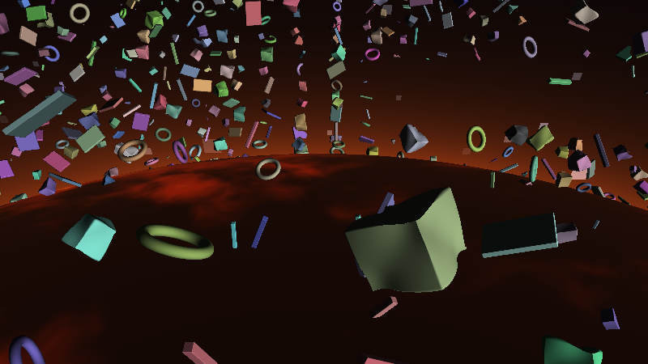

**Ergebnis:** Der Planet bekommt Tiefe: Dunkle Wolkenbänke schieben sich in Zeitlupe über die Glutadern und werden an ihren Rändern von unten angeleuchtet; zum Horizont hin versinkt die Oberfläche in orangem Dunst – und **über** dem Horizont zeichnet ein weicher, glühender Saum den Planetenrand gegen die Sterne.

### Was passiert hier

**Die Wolken sind eine Textur-Lüge mit Preset-Segen.** Echte Wolken wären eine Volumenschicht (zweiter Kugelschnitt, Dichte-Integration) – das Preset zeigt den billigen Weg: eine einzige Noise-Ebene, deren Wert als Deckkraft dient (`tex2D(sampler_noise_hq, uv/8 + time*0.002)`). Entscheidend ist das **Tempo**: 0.002 im Preset, bei uns `vec2(0.020, 0.008)` Welteinheiten pro Sekunde auf einer Karte der Skala 0.02 – in beiden Fällen so langsam, dass man die Bewegung nur merkt, wenn man **nicht** hinschaut. Wolken, die sichtbar ziehen, wirken wie Wetterbericht; Wolken, die *gezogen sind*, wenn der Blick zurückkommt, wirken wie ein Planet. Die zweite Zutat ist die Wolkenfarbe `0.05 + col·0.25`: Sie enthält die Glut *unter* der Wolke – dünne Stellen glimmen durch, dicke Bänke sind fast schwarz. Ein Term, der wie Streuung von unten liest.

**Der Atmosphären-Saum ist Geometrie, nicht Volumetrik.** Für jeden Strahl, der den Planeten verfehlt, berechnen wir die **Scheitelhöhe** `hmin`: den kleinsten Abstand des Strahls zur Planetenoberfläche (Fußpunkt des Lots vom Kugelzentrum auf den Strahl, Pythagoras, fertig). `exp(−hmin·0.30)` macht daraus einen Saum, der direkt am Rand voll glüht und nach ~10 Einheiten Höhe verschwunden ist – die exponentielle Dichteschichtung einer echten Atmosphäre, auf eine Zeile kondensiert. Der Effekt sitzt genau dort, wo das Auge ihn erwartet: als leuchtende Kante zwischen Glutscheibe und Sternenfeld. *(Bewusste Vereinfachung: Trümmer **vor** dem Saum müssten ihn eigentlich abdecken lassen – tun sie auch, denn der Saum wird nur im Himmels-Zweig addiert. Was fehlt, ist der Saum **hinter** halbtransparenten Kanten und der Dunst zwischen Kamera und nahen Trümmern – Letzteren liefert die Politur in Schritt 14 pauschal nach.)*

### 💡 Warum `tca < 0` früh aussteigen?

`tca` ist die Strahlweite bis zum erdnächsten Punkt. Ist sie negativ, liegt dieser Punkt **hinter** der Kamera – der Strahl entfernt sich vom Planeten. Ohne den Ausstieg würde der Saum auch beim Blick senkrecht nach oben glimmen (die Formel kennt keine Richtung, nur eine Gerade) – ein klassischer „warum glüht der Zenit?"-Bug, den man erst nach Minuten sucht.

### 🎨 Experimentieren

- Saum-Falloff `0.30` → `0.08`: eine dicke, weiche Gashülle (Gasriese); `1.0`: die dünne, scharfe Linie der ISS-Fotos
- Wolkendeckung `smoothstep(0.45, 0.75, …)` → `smoothstep(0.30, 0.55, …)`: bedeckter Himmel, die Glut nur noch in Rissen
- Saumfarbe an die Tageszeit hängen: `mix(vec3(0.9, 0.32, 0.08), vec3(0.3, 0.5, 0.9), 0.5 + 0.5 * sin(iTime * 0.02))` – der Planet atmet zwischen Feuer- und Ozonrand
- Zweite Wolkenlage mit anderem Tempo (`fbm(p.xz * 0.045 - iTime * vec2(0.012, 0.0))`, multiplikativ): Interferenz-Drift, deutlich lebendiger

---

## Schritt 9 – Hartes Sonnenlicht

**Neu:** Das neutrale Testlicht weicht dem echten Material: hartes, fast weißes **Sonnenlicht** ohne Umgebungslicht (Weltraum!), metallische Glints, ein Fresnel-Saum als Silhouetten-Gegenlicht – und eine Albedo, die je Zelle zwischen kaltem Metall und Rost variiert.

```glsl
// ---- STELLSCHRAUBEN (erweitert) --------------------------------------------
const vec3 SONNE = normalize(vec3(0.65, 0.28, -0.70));   // Sonnenrichtung
// ----------------------------------------------------------------------------

// NEU: das Truemmermaterial (ersetzt das Testlicht im Debris-Zweig von mainImage)
vec3 shadeDebris(vec3 p, vec3 n, vec3 rd)
{
    vec3 id = floor(p / ZELLE);

    // Albedo: kaltes Metallgrau, je Zelle heller/dunkler, manche Teile rostig
    float ton = hash13(id + 12.5);
    vec3 alb = vec3(0.42, 0.44, 0.47) * (0.55 + 0.90 * ton);
    alb = mix(alb, alb * vec3(1.12, 0.94, 0.78), hash13(id + 15.1));

    // (1) SONNE: gerichtet, hart, fast weiss - und KEIN Umgebungslicht
    float dif = max(dot(n, SONNE), 0.0);
    vec3 col = alb * dif * vec3(1.30, 1.18, 1.00);

    // (2) METALL-GLINT: enges Phong-Highlight
    float spec = pow(max(dot(reflect(rd, n), SONNE), 0.0), 24.0);
    col += spec * vec3(0.90, 0.85, 0.75) * 0.8;

    // (3) SILHOUETTEN-GEGENLICHT: Fresnel-Saum, nur wenn die Sonne
    //     grob HINTER dem Objekt steht (Blickrichtung ~ Sonnenrichtung)
    float fres = pow(1.0 - max(dot(n, -rd), 0.0), 4.0);
    col += fres * vec3(1.00, 0.85, 0.60) * 0.35 * clamp(dot(rd, SONNE), 0.0, 1.0);

    return col;
}
```

Der Debris-Zweig in `mainImage` schrumpft damit auf:

```glsl
    if (tD > 0.0 && (tP < 0.0 || tD < tP)) {
        vec3 p = ro + rd * tD;
        color = shadeDebris(p, calcNormal(p), rd);
    }
```

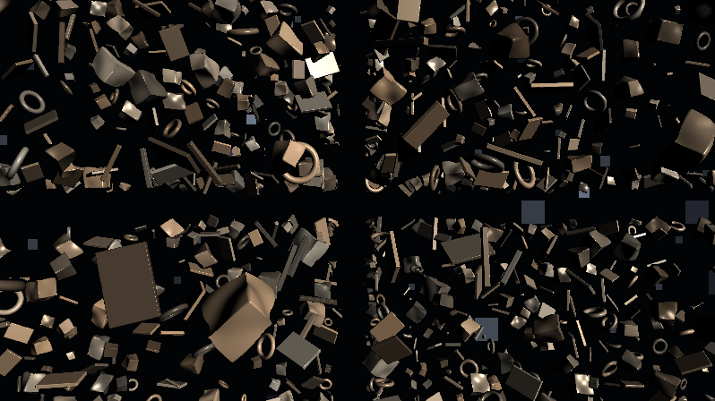

**Ergebnis:** Der Look kippt von „Rendertest" zu **Weltraum**: Sonnenzugewandte Flächen strahlen hell und hart, abgewandte fallen in fast vollständiges Schwarz – die Trümmer sind halbe Silhouetten mit gleißenden Kanten, auf Metallflächen wandern beim Taumeln kleine Glints entlang, und wer Richtung Sonne blickt, sieht Wracks als dunkle Umrisse mit glühendem Rand.

### Was passiert hier

**Die wichtigste Zutat ist eine Auslassung.** In jedem Standard-Shading steckt ein Ambient-Term – das diffuse Streulicht von Himmel und Umgebung. Im Orbit gibt es beides nicht: Licht kommt von der Sonne oder gar nicht (das Planet-Glühen reichen wir in Schritt 10 als *zweite gerichtete Quelle* nach – als Physik, nicht als Pauschale). Deshalb `col = alb·dif·sonnenfarbe` ohne Grundhelligkeit: Die Nachtseite jedes Brockens ist schwarz wie der Raum dahinter. Genau diese Kompromisslosigkeit erzeugt die „harten Kanten-Schatten" aus der Zielbeschreibung – der Terminator (die Licht-Schatten-Grenze) läuft beim Taumeln sichtbar über jede Facette. *(Bewusste Vereinfachung: Trümmer werfen keine Schatten **aufeinander** – das bräuchte einen zweiten Marsch Richtung Sonne pro Treffer. Bei einem locker gestreuten Feld fällt das kaum auf; der 🎨-Kasten hat den Schatten-Marsch für Neugierige.)*

**Das Gegenlicht ist Fresnel mit Richtungs-Torwächter.** `pow(1 − n·(−rd), 4)` glüht an allen streifenden Kanten – aber multipliziert mit `clamp(dot(rd, SONNE), 0, 1)` nur dann, wenn der Blick **in die Sonne** geht. Physikalisch ist das eine Karikatur von Kantenstreuung; dramaturgisch ist es der Term, der Silhouetten vor hellem Hintergrund lesbar macht. Ohne ihn verschwinden sonnenabgewandte Wracks vollständig; mit ihm bekommen sie den klassischen „backlit"-Umriss der Raumfahrtfotografie.

**Die Albedo bleibt beim Zell-Muster:** zwei weitere Hashes – einer für hell/dunkel, einer für den Rost-Einschlag (`vec3(1.12, 0.94, 0.78)` verschiebt das Grau Richtung Ocker). Man beachte, dass die Id am Trefferpunkt schlicht **neu berechnet** wird (`floor(p / ZELLE)`) – kein Durchreichen durch den Marsch nötig; dieselbe Adresse liefert dieselben Eigenschaften, das ist der stille Luxus des deterministischen Hashens.

### 🎨 Experimentieren

- Der Vergleichstest: `col += alb * 0.15;` (Ambient zurück) – sofort sieht alles nach Studiobeleuchtung aus. Wieder löschen und den Unterschied würdigen
- Echte Selbst-Schatten: vor (1) einen Schattenmarsch einschieben – `float s = 1.0; for (int i = 0; i < 24; i++) { float d = map(p + n * 0.02 + SONNE * (0.05 + float(i) * 0.25)); s = min(s, smoothstep(0.0, 0.3, d)); } dif *= s;` – teuer, aber Trümmer werfen jetzt Schatten aufeinander
- Glint-Exponent `24.0` → `120.0`: polierte Oberflächen, nur noch Nadelstiche aus Licht
- Sonne tief über den Horizont: `SONNE = normalize(vec3(0.65, 0.02, -0.70))` – jede Beule wirft einen langen Terminator, das Feld wird dramatisch flach angestrahlt

---

## Schritt 10 – Das Glühen von unten: der Planet als zweite Lichtquelle

**Neu:** Die Glut wird Lichtquelle: Trümmerflächen, die nach **unten** zeigen, fangen warmes Planetenlicht – mit Farbe aus dem Untergrund und exponentiellem Höhen-Falloff. Aus einem beleuchteten Feld über einem Bild wird eine zusammenhängende Szene.

```glsl
// ---- STELLSCHRAUBEN (erweitert) --------------------------------------------
const float GLUT_LICHT = 0.9;   // Staerke des Planet-Gluehens auf den Truemmern
// ----------------------------------------------------------------------------

// NEU: grobe Untergrund-Farbe fuer das Licht von unten -
// dieselbe Landschaft wie lavaFarbe, aber nur die grosse Welle davon
vec3 planetLicht(vec2 q)
{
    float g = fbm(q * 0.030 + vec2(iTime * 0.010, 0.0));
    return mix(vec3(0.30, 0.05, 0.01), vec3(1.00, 0.45, 0.10),
               smoothstep(0.35, 0.80, g));
}

// GEAENDERT: shadeDebris bekommt Term (4) - vor dem return einfuegen
    // (4) PLANET-GLUEHEN: die zweite Lichtquelle scheint von UNTEN -
    //     Farbe aus dem Untergrund, Staerke faellt mit der Hoehe exponentiell
    float unten = max(dot(n, vec3(0.0, -1.0, 0.0)), 0.0);
    float hoehe = clamp((p.y + PLANET_HOEHE) / PLANET_HOEHE, 0.0, 2.0);
    col += unten * planetLicht(p.xz) * GLUT_LICHT * exp(-hoehe * 1.1);
```

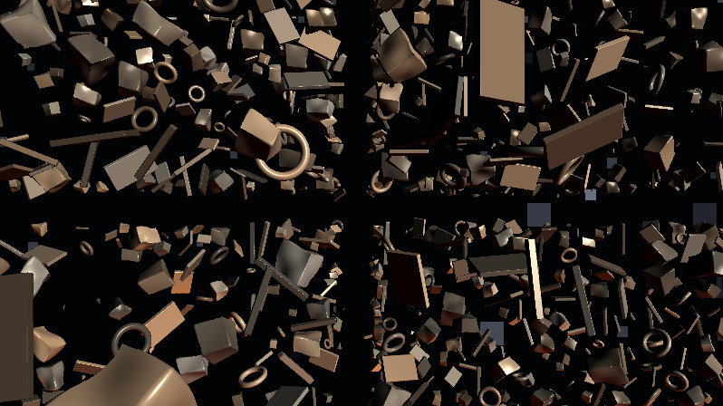

**Ergebnis:** Die Unterseiten der Trümmer glimmen warm auf – orange über den Glut-Kontinenten, dunkelrot über der Kruste. Tief hängende Teile baden im Licht, hohe fangen nur noch einen Hauch. Sonnen-Weiß von der Seite, Glut-Orange von unten: Jedes taumelnde Teil zeigt jetzt in jeder Lage eine andere Mischung der beiden Quellen.

### Was passiert hier

**Eine zweite Lichtquelle ist eine zweite `max(dot(n, L), 0)`-Zeile – der ganze Rest ist Charakterarbeit.** Drei Entscheidungen machen aus der Zeile „Planetenlicht":

1. **Die Richtung** ist konstant `(0, −1, 0)`: Wir behandeln den Glutgrund als unendlich ausgedehnte Leuchtfläche unter der Szene – für Objekte, die klein gegen den Planeten sind, stimmt das praktisch exakt (der Raumwinkel der Glutscheibe unter einem Trümmerteil ist fast der volle untere Halbraum, sein Schwerpunkt zeigt senkrecht nach unten).
2. **Die Farbe** kommt aus `planetLicht(p.xz)` – derselben Rausch-Landschaft wie die Glut selbst, aber **nur mit der groben Oktave**. Das ist kein Sparzwang, sondern Optik: Eine ausgedehnte Leuchtfläche wirkt wie ein riesiger Weichstrahler – die feinen Adern verschwimmen im Raumwinkel, übrig bleibt die großräumige Verteilung „hier drüben glüht es stärker als dort". Ein Trümmerteil, das über einen Glut-Kontinent driftet, wird sichtbar wärmer angestrahlt als eines über dunkler Kruste – **die Beleuchtung erzählt die Landkarte nach**, und genau diese Kopplung liest das Auge als „eine Szene" statt „Feld vor Hintergrundbild".
3. **Der Höhen-Falloff** `exp(−hoehe·1.1)` normiert die Höhe auf `PLANET_HOEHE` (0 = Oberfläche, 1 = Kamerabahn): Auf Kamerahöhe kommt noch ~33 % an, doppelt so hoch ~11 %. Physikalisch fällt Flächenlicht sanfter ab – aber der steilere Abfall staffelt das Feld sichtbar in „tief und glühend" vs. „hoch und kalt", eine zusätzliche Tiefenordnung neben der Perspektive.

🧠 **Merke:** Zwei Lichtquellen mit verschiedener Farbe **und** verschiedener Richtung sind das billigste „teuer aussehen" der Computergrafik – jede Oberflächenorientierung bekommt automatisch ihre eigene Farbmischung, ganz ohne Texturen.

### 🎨 Experimentieren

- `GLUT_LICHT = 2.5`: das Feld schwimmt in Glut – kurz vor Kitsch, mit dem Tonemapping aus Schritt 14 aber erstaunlich tragfähig
- Falloff `1.1` → `0.3`: auch hohe Trümmer glühen – das Feld wird wärmer, verliert aber die Höhenstaffel
- Das Glühen pulsieren lassen: `* (0.8 + 0.2 * sin(iTime * 0.11 + p.x * 0.05))` – die Glut „brodelt" ortsabhängig; Vorgriff auf das Bass-Mapping in Anhang A
- Gegenprobe: `planetLicht(p.xz)` durch konstantes `vec3(0.6, 0.25, 0.06)` ersetzen – sofort wirkt das Untenlicht „aufgemalt". Der Landkarten-Bezug ist der halbe Effekt

---

## Schritt 11 – Blinklichter: Signalfarben je Trümmerteil

**Neu:** Ein Teil der Trümmer trägt **Positionslichter**: Das ganze Teil flammt periodisch in einer Signalfarbe auf – Blink-Idiom und Farbrotation nach Preset-Vorbild (`scol`), Auswahl, Phase und Tempo natürlich wieder aus der Zell-Id.

```glsl
// ---- STELLSCHRAUBEN (erweitert) --------------------------------------------
const float BLINK_ANTEIL = 0.25;  // Anteil der Teile mit Positionslicht (0..1)
// ----------------------------------------------------------------------------

// NEU: Signalfarben - fast woertlich scol aus dem Preset:
// drei phasenversetzte Sinusse, die in Zeitlupe durchs Spektrum rotieren
vec3 signalFarbe(float x)
{
    return 0.1 + 0.9 * clamp(0.5 + sin(3.14159 / 6.0 *
        (12.0 * x + iTime / 4.0 + vec3(3.0, -1.0, -5.0))), 0.0, 1.0);
}

// NEU: Blink-Kurve je Zelle - meist aus, kurzes weiches Aufflammen
float blink(vec3 id)
{
    float gate = step(hash13(id + 4.4), BLINK_ANTEIL);   // traegt dieses Teil ein Licht?
    float ph = hash13(id + 8.8);                          // eigene Phase
    float sp = 0.5 + 1.3 * hash13(id + 6.6);              // eigenes Tempo
    float w  = 0.5 + 0.5 * sin(6.28318 * (iTime * sp * 0.35 + ph));
    return gate * smoothstep(0.82, 0.96, w);
}

// GEAENDERT: shadeDebris, Term (5) - direkt vor dem return:
    // (5) POSITIONSLICHT: Emission - unabhaengig von jeder Beleuchtung
    col += blink(id) * signalFarbe(hash13(id + 3.3)) * 1.8;
```

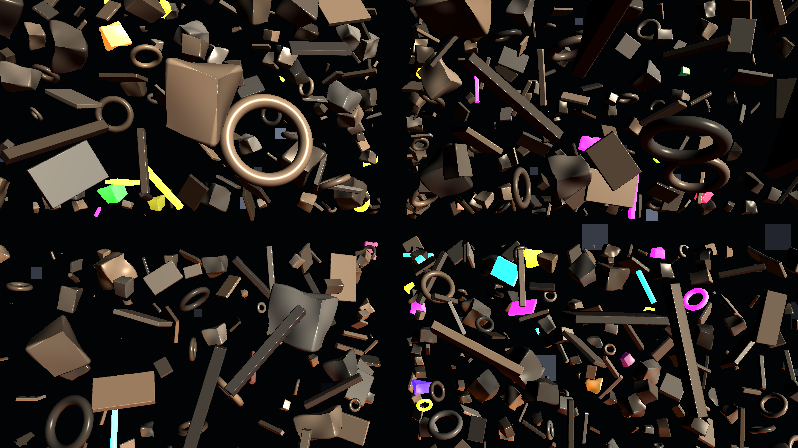

**Ergebnis:** Verstreut über das Feld flammen einzelne Trümmer auf – jedes in seiner eigenen Farbe aus einer langsam rotierenden Palette, jedes in seinem eigenen Rhythmus: kurz, weich, dann wieder dunkel. Besonders stark wirkt es auf den Nachtseiten: Ein völlig schwarzes Wrack, das plötzlich türkis aufglüht, ist der „es lebt noch etwas da draußen"-Moment des Shaders.

### Was passiert hier

**Emission ist die dritte Lichtsorte – und die einzige, die keine Richtung kennt.** Der Term wird schlicht addiert, nach Sonne und Planetenlicht, unbeeinflusst von der Normale: Das Teil *sendet* Licht, statt welches zu empfangen. Deshalb funktionieren die Blinklichter auf der Nachtseite – dort, wo `dif` und `unten` beide null sind, bleibt die Emission übrig. Dass das **ganze Teil** flammt (statt einer aufgesetzten Lampen-Kugel), ist eine bewusste Vergröberung: Auf Feldentfernung ist ein blinkendes Teil ohnehin nur eine Silhouette, und ein flächiges Aufglühen liest sich dort deutlich besser als ein Subpixel-Lichtpunkt. *(Wer echte Lampen will: eine kleine Kugel-SDF an einen Hash-Punkt der Zelle setzen und ihre Distanz separat durch den Marsch reichen – deutlich mehr Verdrahtung für einen Effekt, den man erst in Nahaufnahme sieht.)*

**Das Blink-Idiom ist wörtlich aus der Serie geerbt:** `smoothstep(0.82, 0.96, w)` über einer Sinuswelle schneidet nur die **Spitzen** heraus – das Licht ist ~85 % der Zeit aus und flammt weich auf, statt dauerhaft zu pulsieren (die Crystal-Lights-Leuchtkörper, Schritt 9 dort, sind derselbe Mechanismus). Und **die Farben sind `scol`:** Das Preset rotiert seine Signalfarben mit `.1 + 0.9·sat(0.5 + sin(M_PI/6·(12x + time/4 + (3,−1,−5))))` – drei um Stunden versetzte Sinusse, extrem langsam (`time/4` innerhalb eines π/6-Faktors ≈ eine Farbperiode pro ~48 s). Wir übernehmen Formel samt Konstanten: Der Hash-Anteil `12x` spreizt die Teile über die Palette, `iTime/4` dreht die gesamte Palette in Zeitlupe weiter – zwei Lichter, die eben noch rot und grün blinkten, sind eine Minute später orange und türkis. Diese **zwei Zeitebenen** (schnelles Blinken unter langsamer Farbdrift) sind dasselbe Bauprinzip wie Wolken-Zeitlupe unter Taumel-Tempo: Ein Bild wirkt lebendig, wenn es auf mehreren, weit auseinanderliegenden Zeitskalen gleichzeitig atmet.

### 🎨 Experimentieren

- `BLINK_ANTEIL = 0.05`: einsame Seenot-Signale; `0.8`: Weihnachtsbaum (und die perfekte Vorlage für das Beat-Mapping in Anhang A)
- Doppelblitz wie an echten Luftfahrzeugen: `smoothstep(0.82, 0.96, w) * (0.6 + 0.4 * sin(iTime * sp * 8.0))` – das Aufflammen bekommt ein schnelles Flackern obenauf
- Nur Träger und Ringe blinken lassen: `gate *= step(0.65, hash13(id + 7.3));` – derselbe Hash wie die Form-Weiche wählt dieselben Zellen: die Strukturteile werden zu Baken
- Farbrotation einfrieren (`iTime/4.0` streichen): jede Zelle behält ihre Farbe für immer – ruhiger, aber auch statischer

---

## Schritt 12 – Die Kamera: Drift, Umkehr, Rollen, Nicken

**Neu:** Die provisorische Geradeausfahrt weicht der Choreografie: schwerelose **Drift mit weicher Richtungsumkehr** (sin-Position ⇒ cos-Geschwindigkeit), langsames **Eigen-Rollen** (das `tilt`-Erbe), eine **Nick-Uhr**, die den Blick zwischen Trümmerfeld und Planet-Horizont pendeln lässt – alles auf inkommensurablen Uhren.

```glsl
// ---- STELLSCHRAUBEN (erweitert) --------------------------------------------
const float TEMPO = 1.0;    // Gesamttempo der Kamerafahrt (0.3 = meditativ)
// ----------------------------------------------------------------------------

// NEU: die Kamera-Choreografie
void kamera(vec2 uv, out vec3 ro, out vec3 rd)
{
    float zt = iTime * TEMPO;

    // (a) DRIFT: sin-Position => cos-Geschwindigkeit => weiche Umkehr an den Enden
    ro = vec3(sin(zt * 0.041) * 6.0,
              sin(zt * 0.033) * 2.5,
              sin(zt * 0.026) * 7.0);

    // (b) GIER: langsames Hin- und Herschwenken um die Hochachse
    float gier = 0.5 + 0.85 * sin(zt * 0.019);

    // (c) NICK-UHR: der Blick pendelt zwischen Planet-Horizont (-0.55)
    //     und Truemmerfeld/Sternen (+0.10)
    float nick = mix(-0.55, 0.10, 0.5 + 0.5 * sin(zt * 0.023));

    // (d) ROLLEN: Schwerelosigkeit - das Preset kippt seine Szene genauso
    //     (tilt = 0.5*sin(time*.03))
    float roll = 0.35 * sin(zt * 0.017);

    vec3 fw = vec3(cos(nick) * sin(gier), sin(nick), cos(nick) * cos(gier));
    vec3 rt = normalize(cross(vec3(0.0, 1.0, 0.0), fw));
    vec3 up = cross(fw, rt);

    // Rollen: Rechts- und Hoch-Vektor um die Blickachse drehen
    vec3 rt2 = rt * cos(roll) + up * sin(roll);
    up = up * cos(roll) - rt * sin(roll);
    rt = rt2;

    rd = normalize(fw * 1.4 + rt * uv.x + up * uv.y);
}
```

Und der Kopf von `mainImage`:

```glsl
    vec2 uv = (fragCoord - 0.5 * iResolution.xy) / iResolution.y;

    vec3 ro, rd;
    kamera(uv, ro, rd);
    // ... Rest wie gehabt
```

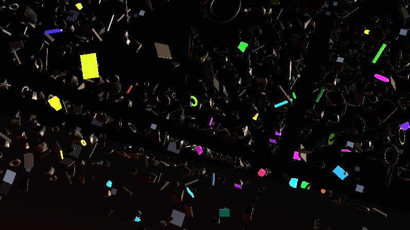

**Ergebnis:** Die Kamera **treibt**. Sie gleitet durchs Feld, wird langsamer, kehrt weich um; das Bild rollt dabei sacht um die Blickachse, als hätte niemand die Lagekontrolle übernommen; der Blick senkt sich über Minuten zum glühenden Horizont und hebt sich wieder zu den Sternen. **Mit einem ehrlichen Schönheitsfehler:** Hin und wieder pflügt die Bahn mitten durch ein Trümmerteil – das Bild füllt sich für Sekunden mit aufgeschnittener Geometrie. Diesen Fall löst der nächste Schritt.

### Was passiert hier

**Die Umkehr ist die alte Lektion der Serie, in drei Achsen:** `x(t) = A·sin(ωt)` bremst an den Bahnenden organisch ab, steht einen Atemzug, treibt zurück – Richtungsumkehr gratis, ruckfrei, zustandslos. Die **sechs Uhren** (0.041, 0.033, 0.026, 0.019, 0.023, 0.017) sind wieder bewusst **inkommensurabel** – keine ist ein Vielfaches einer anderen, Bahn, Schwenk, Nicken und Rollen geraten nie in einen gemeinsamen Takt. Deterministisch, aber nie repetitiv – dieselbe Ewigkeits-Mechanik wie beim Vorgänger, und in LumiViz (deterministische Sim-Uhr, Anhang B) exakt reproduzierbar.

**Das Rollen ist das `tilt`-Zitat.** Das Preset kippt seine ganze Röhren-Szene mit `tilt = 0.5·sin(time·.03)` – ein einziger langsamer Sinus, der dem Bild die starre Waagerechte nimmt. Unsere Fassung dreht `rt`/`up` um die Blickachse – **nach** dem Aufbau der Basis, sonst verdreht die Rotation Gier und Nick gleich mit. Der Effekt ist unverhältnismäßig groß: Ein Horizont, der nie ganz gerade ist, erzählt „schwerelos" lauter als jede Bahnbewegung – unser Innenohr meldet sich bei schiefen Horizonten, und genau dieses leise Unbehagen *ist* die Schwerelosigkeit.

**Die Nick-Uhr ist die Bildregie:** Bei `nick = −0.55` füllt der Planet mit Glutadern, Wolken und Saum das untere Bilddrittel; bei `+0.10` ist er verschwunden und das Feld hängt vor reinem Sternenhimmel. Die Uhr `0.023` braucht ~4,5 Minuten für einen vollen Zyklus – die Komposition wechselt so langsam, dass jeder Zwischenzustand als eigenes Bild funktioniert. Das ist derselbe Griff wie die Zeitlupenwolken: Große Bildänderungen gehören auf große Zeitskalen.

### 💡 Warum Position statt Geschwindigkeit?

Weil ein Shader **kein Gedächtnis** hat. `ro.z += geschwindigkeit` setzt voraus, dass sich jemand das alte `ro.z` gemerkt hat – zwischen zwei Frames existiert aber kein Ort dafür (außer man baut ihn als Buffer, siehe Anhang B3). Jede Bewegung in diesem Tutorial ist deshalb eine **geschlossene Funktion der Zeit**: Kamera, Taumeln, Blinken, Wolken – alles ist `f(iTime)`, nichts ist integriert. Der Lohn ist mehr als Bequemlichkeit: Vorspulen, Rückwärtslaufen und das frame-genaue Reproduzieren im LumiViz-Prüfstand sind gratis enthalten.

### 🎨 Experimentieren

- `TEMPO = 0.3` → Meditationsmodus; die Uhren gleichschalten (alle auf `0.03`) → nach zwei Minuten erkennt man die Schleife: der Inkommensurabilitäts-Beweis
- Roll-Amplitude `0.35` → `1.2`: Havarie-Modus, die Lagekontrolle ist wirklich ausgefallen (Vorsicht: manchen Betrachtern wird real flau)
- Nick-Uhr stillegen (`nick = -0.45;`): Dauerblick auf den Horizont – das Tutorial-Bild für Schritt 7/8, jetzt mit Feld davor
- Bahn-Amplituden `6/2.5/7` → `2/1/3`: die Kamera kreist eng im selben Schwarm – gut, um einzelne Taumel- und Blinkzyklen zu beobachten

---

## Schritt 13 – Die Kamera-Blase und Sternen-Parallaxe

**Neu:** Zwei Nachzügler, die die freie Fahrt erst rund machen: die **Kamera-Blase** (Trümmer nahe der Bahn schrumpfen weich weg – kein Near-Clipping mehr) und ein **Parallaxe-Faktor** je Sternschicht, der aus den drei Lagen echte Tiefenstaffelung macht.

```glsl
// NEU: die Kameraposition muss map() bekannt sein (fuer die Blase)
vec3 gKamera = vec3(0.0);

// GEAENDERT in map(): die Kamera-Blase - Zellen nahe der Kamera schrumpfen weg
// (direkt nach der gr-Berechnung):
    vec3 zentrum = (id + 0.5) * ZELLE;
    gr *= smoothstep(1.2, 4.5, length(zentrum - gKamera));
    if (gr < 0.02) return sicher;

// GEAENDERT: sterne() bekommt Parallaxe - helle (nahe) Schichten ziehen staerker
vec3 sterne(vec3 rd, vec3 kam)
{
    vec3 acc = vec3(0.0);
    for (int s = 0; s < 3; s++) {
        float fs = float(s);
        vec2 su = richtungsUv(rd) * (24.0 + 30.0 * fs) + 13.7 * fs;
        su += (kam.xz + kam.y * 0.4) * 0.5 / (1.0 + fs);
        float h = hash21(floor(su));
        float stern = smoothstep(0.988 + 0.004 * fs, 1.0, h);
        acc += stern * (0.30 + 0.70 * fract(h * 41.7)) * (1.0 - 0.28 * fs);
    }
    return acc * vec3(0.80, 0.87, 1.00);
}
```

Und im Kopf von `mainImage` bzw. im Himmels-Zweig:

```glsl
    kamera(uv, ro, rd);
    gKamera = ro;                       // VOR dem Marsch setzen!
    // ...
    color = vec3(0.008, 0.010, 0.018) + sterne(rd, ro);
```

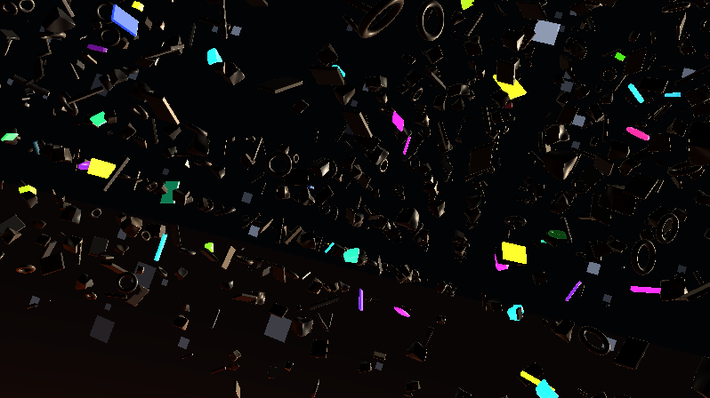

**Ergebnis:** Die Fahrt ist sauber: Trümmer, die der Bahn zu nahe kommen, sind einfach nicht da – kein Clipping, kein Ruck, nur eine natürliche freie Schneise, die mit der Kamera wandert. Und bei jeder Drift ziehen die drei Sternschichten verschieden schnell übers Bild – der Himmel hat Tiefe bekommen.

### Was passiert hier

**Die Kamera-Blase löst das Kollisionsproblem an der Wurzel.** Die Bahn füllt den Quader ±6/±2.5/±7 – mitten durchs dichteste Feld, und anders als in Schritt 3 lässt sich keine kollisionsfreie Gerade mehr nachrechnen. Statt die Bahn zu verbiegen (unmöglich zu garantieren) oder Beinahe-Treffer zu ertragen, schrumpfen Teile, deren **Zellzentrum** der Kamera näher als 4.5 Einheiten kommt, weich auf null (`gr·smoothstep(1.2, 4.5, dist)`); praktisch leere Zellen steigen früh als `sicher` aus. Da die Blase mit der Kamera wandert, „weicht" das Feld scheinbar aus, und weil das Schrumpfen weich ist, ploppt nichts. Zwei Details verdienen den zweiten Blick:

1. **Die Blasen-Distanz zählt zum Zell*zentrum*, nicht zum Objekt.** Sie ist damit je Zelle eine Konstante – ein Teil, das in die Blase *hineintaumelt*, würde sonst im Taumel-Takt flackern.
2. **Das Schrumpfen bricht keine Zusicherung:** Ein kleineres `gr` verkleinert die Umkugel nur – Zellregel und Klammer bleiben gültig, der Marsch merkt von der Blase nichts.

Der Nebeneffekt ist ehrlich benannt: `map` hängt jetzt über `gKamera` von einem Global ab, das **vor** dem Marsch gesetzt sein muss – die eine Zeile Reihenfolge-Disziplin, die man sich mit dem Trick einkauft. (Wer sie vergisst, bekommt keine Fehlermeldung, sondern eine Blase um den Ursprung – und wundert sich, warum die Feldmitte leer ist.)

**Die Sterne bekommen ihre Tiefe geschenkt:** Jede Schicht addiert einen Anteil der Kameraposition auf ihre Gitterkoordinate – die helle (nahe) Schicht den vollen (`0.5/(1+0) = 0.5`), die feinen (fernen) immer weniger. Bei ±7 Einheiten Drift verschiebt sich die nahe Schicht um ±3.5 Gitterzellen, die fernste nur um ±1.2: klassische Parallaxe, drei Zeilen. Genau genommen ist das eine Näherung (der Versatz müsste je Würfelfläche in deren Ebene liegen), aber bei einem Zufallsfeld aus Punkten ist der Fehler unsichtbar – dieselbe Sorte erlaubter Lüge wie die Würfelflächen-Projektion selbst.

### 💡 Warum keine echte Kollisionsvermeidung?

Weil sie das Zustandsproblem in anderem Gewand wäre: „Weiche aus, wenn etwas im Weg ist" heißt *die Bahn hängt von der Vergangenheit ab* – genau das, was eine geschlossene `f(iTime)`-Choreografie nicht kann. Die Blase dreht den Spieß um: Nicht die Kamera weicht dem Feld aus, das Feld weicht der Kamera. Das ist physikalisch Unsinn und dramaturgisch unsichtbar – niemand vermisst Trümmer, von denen er nie wusste, dass sie dort gewesen wären. Ein schönes Beispiel für die Shader-Grundregel: **Wenn ein Problem schwer ist, prüfe erst, ob man es sehen würde.**

### 🎨 Experimentieren

- Blase enger: `smoothstep(1.2, 4.5, …)` → `smoothstep(0.8, 2.0, …)` – Beinahe-Kollisionen! Teile rauschen dicht am Bild vorbei; zusammen mit `TEMPO = 2.0` wird aus der Drift ein Flug
- Blase ganz aus (Faktor löschen) und eine Minute zusehen: das Near-Clipping einmal bewusst ansehen – die beste Begründung für den Trick
- Parallaxe übertreiben: `0.5 / (1.0 + fs)` → `2.0 / (1.0 + fs)` – der Himmel wird zur Schneekugel; hübsch, aber die Sterne verraten sich als „nah"
- Parallaxe invertieren (`* (0.1 + 0.2 * fs)`): die *feinen* Schichten ziehen schneller – wirkt sofort falsch. Helligkeit und Parallaxe müssen dieselbe Tiefengeschichte erzählen

---

## Schritt 14 – Politur: Dunst, Farbdrift, Tonemapping – der fertige Shader

**Neu:** Die vier Politur-Griffe der Serie – **Dunst Richtung Planet**, langsame **Farbdrift**, das Tonemapping **`1 − exp(−x)`** und Gamma + Vignette. Danach steht der komplette Shader – hier als **Gesamtlisting** zum Einfügen.

```glsl
// ============================================================================
// "Space Debris" - taumelndes Truemmerfeld im Orbit ueber einem Glutplaneten
// Endstand des Tutorials (Schritt 14). Braucht keine iChannels.
// Stil-Verwandtschaft: martin - space debris.milk (rs_lav-Glutgrund /
// noise3-Oktaven, scol-Signalfarben, Wolken in Zeitlupe, tilt-Rollen).
// ============================================================================

// ---- STELLSCHRAUBEN --------------------------------------------------------
const float ZELLE         = 3.0;   // Kantenlaenge einer Gitterzelle
const float DICHTE        = 0.55;  // Anteil belegter Zellen (0..~0.9)
const float GROESSE_MAX   = 1.0;   // Groessen-Budget je Teil (Zellregel beachten!)
const float TAUMEL        = 1.0;   // globales Taumel-Tempo (0 = eingefroren)
const float BLINK_ANTEIL  = 0.25;  // Anteil der Teile mit Positionslicht
const float PLANET_HOEHE  = 8.0;   // Abstand Kamerabahn -> Planetenoberflaeche
const float PLANET_RADIUS = 60.0;  // Kruemmungsradius des Planeten
const float GLUT          = 1.2;   // Intensitaet des Lavagrunds
const float GLUT_LICHT    = 0.9;   // Planet-Gluehen auf den Truemmern
const float TEMPO         = 1.0;   // Gesamttempo der Kamerafahrt
const float BELICHTUNG    = 1.3;   // Tonemapping-Verstaerkung

// Abgeleitet - Zellregel: max. Umkugel-Radius eines Teils ist 1.1 * GROESSE_MAX
const float MARGE = ZELLE * 0.5 - 1.1 * GROESSE_MAX;
const vec3  PLANET_ZENTRUM = vec3(0.0, -(PLANET_RADIUS + PLANET_HOEHE), 0.0);
const vec3  SONNE = normalize(vec3(0.65, 0.28, -0.70));
// ----------------------------------------------------------------------------

vec3 gKamera = vec3(0.0);           // Kameraposition, fuer die Blase in map()

// ---- Hashes & Rauschen -----------------------------------------------------

float hash21(vec2 p) { return fract(sin(dot(p, vec2(127.1, 311.7))) * 43758.5453); }
float hash13(vec3 p) { return fract(sin(dot(p, vec3(127.1, 311.7, 74.7))) * 43758.5453); }

vec3 hash33(vec3 p)
{
    return fract(sin(vec3(dot(p, vec3(127.1, 311.7,  74.7)),
                          dot(p, vec3(269.5, 183.3, 246.1)),
                          dot(p, vec3(113.5, 271.9, 124.6)))) * 43758.5453);
}

float vnoise(vec2 p)
{
    vec2 i = floor(p), f = fract(p);
    vec2 u = f * f * (3.0 - 2.0 * f);
    return mix(mix(hash21(i),              hash21(i + vec2(1, 0)), u.x),
               mix(hash21(i + vec2(0, 1)), hash21(i + vec2(1, 1)), u.x), u.y);
}

float fbm(vec2 p)
{
    float v = 0.0, a = 0.5;
    for (int i = 0; i < 5; i++) { v += a * vnoise(p); p = p * 2.03 + 11.7; a *= 0.5; }
    return v;
}

// ---- Sterne ----------------------------------------------------------------

vec2 richtungsUv(vec3 rd)
{
    vec3 a = abs(rd);
    if (a.z >= a.x && a.z >= a.y) return rd.xy / a.z;
    if (a.x >= a.y)               return rd.zy / a.x;
    return rd.xz / a.y;
}

vec3 sterne(vec3 rd, vec3 kam)
{
    vec3 acc = vec3(0.0);
    for (int s = 0; s < 3; s++) {
        float fs = float(s);
        vec2 su = richtungsUv(rd) * (24.0 + 30.0 * fs) + 13.7 * fs;
        su += (kam.xz + kam.y * 0.4) * 0.5 / (1.0 + fs);   // Parallaxe je Schicht
        float h = hash21(floor(su));
        float stern = smoothstep(0.988 + 0.004 * fs, 1.0, h);
        acc += stern * (0.30 + 0.70 * fract(h * 41.7)) * (1.0 - 0.28 * fs);
    }
    return acc * vec3(0.80, 0.87, 1.00);
}

// ---- SDF-Werkzeug ----------------------------------------------------------

mat3 rotAchse(vec3 a, float w)
{
    float c = cos(w), s = sin(w), k = 1.0 - c;
    return mat3(a.x * a.x * k + c,       a.y * a.x * k + a.z * s,  a.z * a.x * k - a.y * s,
                a.x * a.y * k - a.z * s, a.y * a.y * k + c,        a.z * a.y * k + a.x * s,
                a.x * a.z * k + a.y * s, a.y * a.z * k - a.x * s,  a.z * a.z * k + c);
}

float sdBox(vec3 p, vec3 b)
{
    vec3 q = abs(p) - b;
    return length(max(q, 0.0)) + min(max(q.x, max(q.y, q.z)), 0.0);
}

float sdTorus(vec3 p, vec2 t)
{
    vec2 q = vec2(length(p.xz) - t.x, p.y);
    return length(q) - t.y;
}

// ---- das Truemmerfeld ------------------------------------------------------

bool belegt(vec3 id)
{
    float cluster = vnoise(id.xz * 0.23 + id.y * 0.31);   // Schwarm-Regionen
    float schwelle = DICHTE * 1.6 * smoothstep(0.25, 0.75, cluster);
    return hash13(id + 4.7) < schwelle;
}

// Formbibliothek - jede Form passt in eine Umkugel vom Radius 1.1 * gr
float truemmerForm(vec3 q, vec3 id, float gr)
{
    float wForm = hash13(id + 7.3);
    float d;

    if (wForm < 0.40) {                                   // Brocken (verbeult)
        vec3 b = gr * (0.30 + 0.28 * hash33(id + 2.6));
        d = sdBox(q, b);
        d -= 0.08 * gr * sin(4.7 * q.x) * sin(4.3 * q.y) * sin(5.1 * q.z);
    } else if (wForm < 0.65) {                            // Platte / Paneel
        d = sdBox(q, gr * vec3(0.85, 0.06, 0.55));
    } else if (wForm < 0.85) {                            // Traeger / Stab
        d = sdBox(q, gr * vec3(0.08, 0.95, 0.08));
    } else {                                              // Ring
        d = sdTorus(q, gr * vec2(0.62, 0.10));
    }
    return d;
}

float map(vec3 p)
{
    vec3 id = floor(p / ZELLE);
    vec3 q  = mod(p, ZELLE) - 0.5 * ZELLE;

    // Zellwand-Klammer: konservative Schranke fuer alles ausserhalb der Zelle
    float wand = ZELLE * 0.5 - max(abs(q.x), max(abs(q.y), abs(q.z)));
    float sicher = wand + MARGE;

    if (!belegt(id)) return sicher;

    // Groesse je Zelle + Kamera-Blase (Zellen an der Kamera schrumpfen weg)
    float gr = GROESSE_MAX * (0.35 + 0.65 * hash13(id + 3.1));
    vec3 zentrum = (id + 0.5) * ZELLE;
    gr *= smoothstep(1.2, 4.5, length(zentrum - gKamera));
    if (gr < 0.02) return sicher;

    // Taumeln: Achse, Tempo, Phase = Konstanten der Zelle; nur der Winkel laeuft
    vec3 achse = normalize(hash33(id + 5.7) - 0.5 + vec3(0.01, 0.02, 0.03));
    float tempo = (0.25 + 1.25 * hash13(id + 9.2)) * TAUMEL;
    float phase = 6.28318 * hash13(id + 1.9);
    q = rotAchse(achse, iTime * tempo + phase) * q;

    return min(truemmerForm(q, id, gr), sicher);
}

float marchDebris(vec3 ro, vec3 rd, float tMax)
{
    float t = 0.0;
    for (int i = 0; i < 110; i++) {
        float d = map(ro + rd * t);
        if (d < 0.001 + 0.0012 * t) return t;
        if (t > tMax) break;
        t += d * 0.7;                       // Drossel: Reserve fuer die Beulen
    }
    return -1.0;
}

vec3 calcNormal(vec3 p)
{
    const vec2 e = vec2(0.0012, -0.0012);
    return normalize(e.xyy * map(p + e.xyy) + e.yyx * map(p + e.yyx) +
                     e.yxy * map(p + e.yxy) + e.xxx * map(p + e.xxx));
}

// ---- der Planet ------------------------------------------------------------

float planetHit(vec3 ro, vec3 rd)
{
    vec3 oc = ro - PLANET_ZENTRUM;
    float b = dot(oc, rd);
    float c = dot(oc, oc) - PLANET_RADIUS * PLANET_RADIUS;
    float h = b * b - c;
    if (h < 0.0) return -1.0;
    float t = -b - sqrt(h);
    return (t > 0.0) ? t : -1.0;
}

vec3 lavaFarbe(vec2 q)
{
    float grund = fbm(q * 0.045 + vec2(iTime * 0.010, 0.0));
    float adern = fbm(q * 0.16 + grund * 1.8 + 7.0);
    float glut  = pow(clamp(adern * 1.35 - 0.25, 0.0, 1.0), 2.2) * GLUT;

    vec3 col = vec3(0.028, 0.010, 0.012);
    col = mix(col, vec3(0.55, 0.08, 0.015), smoothstep(0.10, 0.45, glut));
    col = mix(col, vec3(1.15, 0.55, 0.10),  smoothstep(0.45, 0.85, glut));
    col = mix(col, vec3(1.60, 1.25, 0.55),  smoothstep(0.85, 1.05, glut));
    return col;
}

vec3 planetLicht(vec2 q)
{
    float g = fbm(q * 0.030 + vec2(iTime * 0.010, 0.0));
    return mix(vec3(0.30, 0.05, 0.01), vec3(1.00, 0.45, 0.10),
               smoothstep(0.35, 0.80, g));
}

vec3 atmosphaere(vec3 ro, vec3 rd)
{
    vec3 oc = ro - PLANET_ZENTRUM;
    float tca = -dot(oc, rd);
    if (tca < 0.0) return vec3(0.0);
    float hmin = sqrt(max(dot(oc, oc) - tca * tca, 0.0)) - PLANET_RADIUS;
    float saum = exp(-max(hmin, 0.0) * 0.30);
    return saum * vec3(0.90, 0.32, 0.08) * 0.55;
}

vec3 shadePlanet(vec3 p, float t)
{
    vec3 col = lavaFarbe(p.xz);

    float cld = fbm(p.xz * 0.020 + iTime * vec2(0.020, 0.008));  // Zeitlupe!
    float w = smoothstep(0.45, 0.75, cld);
    col = mix(col, vec3(0.050, 0.035, 0.030) + col * 0.25, w);

    col = mix(col, vec3(0.45, 0.18, 0.06), 1.0 - exp(-t * 0.010));
    return col;
}

// ---- Licht & Material ------------------------------------------------------

vec3 signalFarbe(float x)   // scol-Erbe: rotierende Signalfarben
{
    return 0.1 + 0.9 * clamp(0.5 + sin(3.14159 / 6.0 *
        (12.0 * x + iTime / 4.0 + vec3(3.0, -1.0, -5.0))), 0.0, 1.0);
}

float blink(vec3 id)
{
    float gate = step(hash13(id + 4.4), BLINK_ANTEIL);
    float ph = hash13(id + 8.8);
    float sp = 0.5 + 1.3 * hash13(id + 6.6);
    float w  = 0.5 + 0.5 * sin(6.28318 * (iTime * sp * 0.35 + ph));
    return gate * smoothstep(0.82, 0.96, w);
}

vec3 shadeDebris(vec3 p, vec3 n, vec3 rd)
{
    vec3 id = floor(p / ZELLE);

    float ton = hash13(id + 12.5);
    vec3 alb = vec3(0.42, 0.44, 0.47) * (0.55 + 0.90 * ton);
    alb = mix(alb, alb * vec3(1.12, 0.94, 0.78), hash13(id + 15.1));

    // (1) Sonne: hart, fast weiss, KEIN Umgebungslicht
    float dif = max(dot(n, SONNE), 0.0);
    vec3 col = alb * dif * vec3(1.30, 1.18, 1.00);

    // (2) Metall-Glint
    float spec = pow(max(dot(reflect(rd, n), SONNE), 0.0), 24.0);
    col += spec * vec3(0.90, 0.85, 0.75) * 0.8;

    // (3) Silhouetten-Gegenlicht (nur Richtung Sonne)
    float fres = pow(1.0 - max(dot(n, -rd), 0.0), 4.0);
    col += fres * vec3(1.00, 0.85, 0.60) * 0.35 * clamp(dot(rd, SONNE), 0.0, 1.0);

    // (4) Planet-Gluehen von unten, Farbe aus dem Untergrund
    float unten = max(dot(n, vec3(0.0, -1.0, 0.0)), 0.0);
    float hoehe = clamp((p.y + PLANET_HOEHE) / PLANET_HOEHE, 0.0, 2.0);
    col += unten * planetLicht(p.xz) * GLUT_LICHT * exp(-hoehe * 1.1);

    // (5) Positionslicht: Emission, unabhaengig von jeder Beleuchtung
    col += blink(id) * signalFarbe(hash13(id + 3.3)) * 1.8;

    return col;
}

// ---- Kamera ----------------------------------------------------------------

void kamera(vec2 uv, out vec3 ro, out vec3 rd)
{
    float zt = iTime * TEMPO;

    ro = vec3(sin(zt * 0.041) * 6.0,          // Drift: sin-Position =>
              sin(zt * 0.033) * 2.5,          // weiche Umkehr an den Enden
              sin(zt * 0.026) * 7.0);

    float gier = 0.5 + 0.85 * sin(zt * 0.019);
    float nick = mix(-0.55, 0.10, 0.5 + 0.5 * sin(zt * 0.023));  // Nick-Uhr
    float roll = 0.35 * sin(zt * 0.017);                          // tilt-Erbe

    vec3 fw = vec3(cos(nick) * sin(gier), sin(nick), cos(nick) * cos(gier));
    vec3 rt = normalize(cross(vec3(0.0, 1.0, 0.0), fw));
    vec3 up = cross(fw, rt);

    vec3 rt2 = rt * cos(roll) + up * sin(roll);
    up = up * cos(roll) - rt * sin(roll);
    rt = rt2;

    rd = normalize(fw * 1.4 + rt * uv.x + up * uv.y);
}

// ---- Hauptprogramm ---------------------------------------------------------

void mainImage(out vec4 fragColor, in vec2 fragCoord)
{
    vec2 uv = (fragCoord - 0.5 * iResolution.xy) / iResolution.y;

    vec3 ro, rd;
    kamera(uv, ro, rd);
    gKamera = ro;                        // VOR dem Marsch (Kamera-Blase)

    float tP = planetHit(ro, rd);
    float tMax = (tP > 0.0) ? min(60.0, tP + 0.5) : 60.0;
    float tD = marchDebris(ro, rd, tMax);

    vec3 color;
    float tHit = -1.0;

    if (tD > 0.0 && (tP < 0.0 || tD < tP)) {
        vec3 p = ro + rd * tD;
        color = shadeDebris(p, calcNormal(p), rd);
        tHit = tD;
    } else if (tP > 0.0) {
        color = shadePlanet(ro + rd * tP, tP);
        tHit = tP;
    } else {
        color = vec3(0.008, 0.010, 0.018) + sterne(rd, ro);
        color += atmosphaere(ro, rd);
    }

    // NEU (1): Dunst - die Ferne versinkt, Richtung Planet waermer als zum All
    if (tHit > 0.0) {
        vec3 dunstFarbe = mix(vec3(0.010, 0.012, 0.022),
                              vec3(0.30, 0.13, 0.05),
                              clamp(-rd.y * 2.2, 0.0, 1.0));
        color = mix(color, dunstFarbe, 1.0 - exp(-0.0009 * tHit * tHit));
    }

    // NEU (2): Farbdrift - das Gesamtbild wandert in Zeitlupe durch die Toene
    color *= 0.88 + 0.12 * cos(iTime * 0.04 + vec3(0.0, 2.1, 4.2));

    // NEU (3): Tonemapping 1 - exp(-x): Glut und Glints gluehen aus statt zu clippen
    color = 1.0 - exp(-color * BELICHTUNG);

    // NEU (4): Gamma + Vignette
    color = pow(color, vec3(1.0 / 2.2));
    color *= 1.0 - 0.32 * dot(uv, uv);

    fragColor = vec4(color, 1.0);
}
```

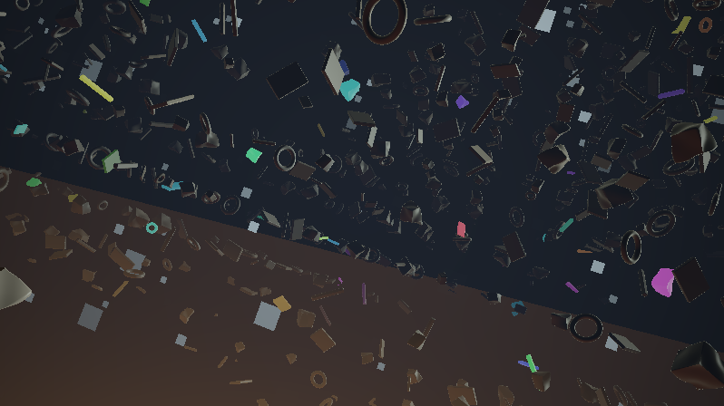

**Ergebnis:** Der fertige Shader. Ein taumelndes Trümmerfeld treibt in Schwärmen durch den Orbit; hartes Sonnenlicht von der Seite, warmes Glutlicht von unten, dazwischen blinken Positionslichter in wandernden Signalfarben. Unter allem der Planet: Glutadern unter ziehenden Wolken, am Rand der orange Atmosphären-Saum, darüber drei Schichten Sterne mit Parallaxe. Und mittendrin die schwerelose Kamera – driftend, rollend, nickend, nie auf demselben Weg zweimal.

### Was passiert hier – die vier Politur-Griffe

1. **Dunst mit Richtungs-Farbe:** Das `exp(−k·t²)`-Rezept der Serie (Nähe klar, Ferne im Dunst, Marsch-Artefakte der Distanz gleich mit kaschiert) – aber die Dunstfarbe ist hier **blickabhängig**: kaltes Blaugrau zum All, warmes Orange Richtung Planet (`clamp(−rd.y·2.2, …)`). Damit liefert die Politur nach, was Schritt 8 offen ließ: Auch *Trümmer* vor dem Planeten versinken jetzt in dessen Atmosphärenfarbe – der billigste denkbare Ersatz für echtes „Aerial Perspective", und er verkauft die Szene als ein zusammenhängendes Medium.
2. **Farbdrift:** Drei phasenversetzte, sehr langsame Cosinus-Wellen multiplizieren das Bild (±12 %). Das Erbe läuft hier doppelt: Es ist die GLSL-Fassung der langsamen Farbwanderung, die das Preset über `scol` in seine Signalfarben legt – bei uns wandern die Signalfarben *und* zusätzlich das Gesamtbild, auf verschiedenen Uhren.
3. **Tonemapping `1 − exp(−x)`:** die Standard-Schlusszeile der Serie – und ein hübscher Fund im Stil-Vorbild: *space debris* benutzt exakt diese Kurve mitten in seiner Logik (`r = 1-exp(-r)` im Shape-1-Code, um Pegel weich zu sättigen). Für uns entschärft sie die beiden „mathematisch grenzenlosen" Terme des Shaders – Glut-Spitzen und Glints – zu weichem Ausglühen statt hartem Clipping.
4. **Gamma + Vignette:** Standard-Abschluss; die Vignette drückt die Ecken und lenkt auf die Mitte der Drift.

### 🎨 Experimentieren – jetzt am Gesamtwerk

- Das Stellschrauben-Brett durchspielen – jede Konstante ist ein Charakter: `DICHTE 0.85 / TAUMEL 0.3 / TEMPO 0.4` = träger Asteroidengürtel; `DICHTE 0.2 / BLINK_ANTEIL 0.6 / TEMPO 1.5` = Signalboje-Slalom
- `BELICHTUNG 2.5`: überbelichteter Look, der Saum frisst in den Himmel; `0.7`: unterkühlte Doku-Optik
- Dunststärke `0.0009` → `0.003`: die Ferne verschwindet fast – klaustrophobisch, das Feld wirkt endlos dicht
- Den Planeten abschalten (`planetHit` immer `-1.0` zurückgeben lassen): plötzlich Tiefraum – erstaunlich, wie viel Stimmung an der unteren Bildkante hing

🧠 **Merke:** Auch diesmal hat die Politur keine neue Idee gebraucht – nur Kurven (`exp`, `cos`, `pow`) auf das fertige Bild. Wenn ein Shader in dieser Phase noch „gerettet" werden muss, liegt der Fehler in den Phasen davor.

---

# Anhang A: Audio-Reaktivität

Voraussetzung auf shadertoy.com: **iChannel0 mit „Music"** belegen (Kanal-Kachel → Music). Die Textur ist 512×2: Zeile 0 (`y ≈ 0.25`) das FFT-Spektrum, Zeile 1 (`y ≈ 0.75`) die Wellenform. Die Grundlagen – Spektrum lesen, `bandLevel`-Bänder, die Skalenfalle Milkdrop-normiert vs. Shadertoy-absolut, `smoothstep` statt `step` gegen Gate-Flackern – stehen ausführlich im **Anhang A des Crystal-Lights-Tutorials** (gleicher Ordner) und werden hier nicht wiederholt. A1 bringt das nötige Werkzeug trotzdem eigenständig lauffähig mit; A2/A3 konzentrieren sich auf das, was *dieses* Trümmerfeld braucht.

---

## Schritt A1 – Beat-Gate und Signal-Lampen: der Werkzeugtest

**Neu:** `bandLevel` + Beat-Gate als eigenständiger Mini-Shader – diesmal gleich im Ziel-Idiom: ein Raster aus „Positionslichtern", die einzeln vor sich hin blinken und beim Beat **gemeinsam** zünden.

```glsl
// iChannel0: Music

float hash21(vec2 p) { return fract(sin(dot(p, vec2(127.1, 311.7))) * 43758.5453); }

float bandLevel(float lo, float hi)
{
    float sum = 0.0;
    const int N = 12;
    for (int i = 0; i < N; i++) {
        float x = mix(lo, hi, (float(i) + 0.5) / float(N));
        sum += texture(iChannel0, vec2(x, 0.25)).x;
    }
    return sum / float(N);
}

vec3 signalFarbe(float x)   // dieselbe scol-Formel wie im Haupt-Shader
{
    return 0.1 + 0.9 * clamp(0.5 + sin(3.14159 / 6.0 *
        (12.0 * x + iTime / 4.0 + vec3(3.0, -1.0, -5.0))), 0.0, 1.0);
}

void mainImage(out vec4 fragColor, in vec2 fragCoord)
{
    vec2 uv = fragCoord / iResolution.xy;

    float bass = bandLevel(0.00, 0.05);
    float gate = smoothstep(0.60, 0.75, bass);        // DAS Beat-Gate

    vec3 color = vec3(0.012);

    // unten: der rohe Bass-Pegel als Kontrollbalken
    if (uv.y < 0.12) color = uv.x < bass ? vec3(0.85, 0.30, 0.20) : color;

    // darueber: 8x4 "Positionslichter" - Eigenblinken ODER gemeinsamer Beat
    if (uv.y > 0.18) {
        vec2 id = floor(vec2(uv.x * 8.0, (uv.y - 0.18) * 5.0));
        float eigen = smoothstep(0.90, 0.97, 0.5 + 0.5 *
            sin(6.28318 * (iTime * (0.3 + 0.5 * hash21(id + 7.0)) + hash21(id + 2.0))));
        float hell = max(eigen * 0.5, gate * (0.4 + 0.6 * hash21(id + 3.1)));
        color += hell * signalFarbe(hash21(id));
    }

    fragColor = vec4(color, 1.0);
}
```

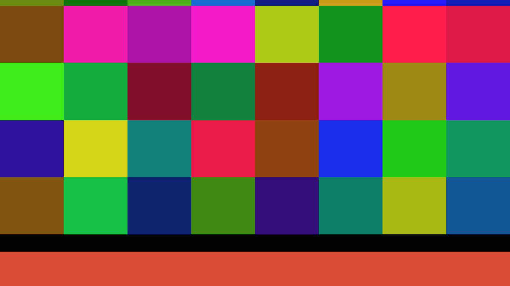

**Ergebnis:** Ein Lampenraster in rotierenden Signalfarben. Ohne Musik blinken die Lampen einzeln vor sich hin; bei jedem Kick reißt das Gate alle gemeinsam auf – jede aber unterschiedlich hell. Genau dieses `max(eigen, gate·hash)`-Muster wandert in A3 in den Haupt-Shader.

### Was passiert hier

Der Shader ist die Miniatur des Mapping-Kerns: **Eigenleben und Beat konkurrieren per `max`.** Das Eigenblinken läuft immer (der Visualizer ist ohne Musik nicht tot), das Gate übersteuert es im Beat-Moment – und der Hash-Faktor `0.4 + 0.6·hash` hält die Lampen dabei ungleich hell, sonst wird aus dem Beat ein Stroboskop. Die Schwelle `0.60/0.75` ist Handarbeit pro Musikrichtung (die Skalenfalle aus dem Crystal-Lights-Anhang); die saubere, track-unabhängige Lösung ist die Buffer-A-Envelope, auf die B3 verweist.

### 🎨 Experimentieren

- Schwelle `0.60/0.75` → `0.35/0.50`: das Gate triggert auch auf Snares – Schwellen *sind* Instrumenten-Auswahl
- `gate` zusätzlich als Hintergrund-Blitz: `color += gate * vec3(0.06, 0.03, 0.01);`
- Höhen-Gate parallel (`bandLevel(0.25, 0.7)` auf eigene Schwelle) und nur jede zweite Lampe damit füttern: man *sieht* das Arrangement zweistimmig

---

## Schritt A2 – Der Mapping-Katalog: wohin mit welchem Signal?

Kein neuer Shader – die Landkarte. Wie immer gilt: *musikalische Rolle → visuelle Rolle*. Alle Schnipsel beziehen sich auf das Gesamtlisting aus Schritt 14 und benutzen die Globals `gBass/gMid/gTreb/gVol/gGate`, die A3 einführt.

| # | Audio | steuert | Eingriff | warum es passt |
|---|---|---|---|---|
| 1 | Bass-**Gate** | Alle Positionslichter zünden gemeinsam | in `blink()`: `return max(eigen, gGate * step(hash13(id + 2.2), 0.6) * (0.5 + 0.5 * hash13(id + 1.4)));` (`eigen` = bisheriger Rückgabewert) | Der Beat schlägt durchs ganze Feld – beim Beat zünden auch Teile **ohne** eigenes Licht (das `step(…, 0.6)` wählt 60 % aller Zellen); die Hashes halten die Helligkeiten ungleich – kein Stroboskop |
| 2 | Bass (kontinuierlich) | Planet-Glühen pumpt | in `lavaFarbe()`: `… * GLUT * (0.7 + 0.9 * gBass)` – und in `shadeDebris` Term (4): `GLUT_LICHT * (0.6 + 1.4 * gBass)` | Bass ist Masse und Wärme – der Planet atmet, und weil das Untenlicht mitpumpt, spürt das ganze Feld den Puls |
| 3 | Mitten | Taumel-**Zusatzwinkel** | in `map()`: `q = rotAchse(achse, iTime * tempo + phase + gMid * 0.6 * (hash13(id + 0.7) - 0.5)) * q;` | Die Melodie „rüttelt" am Feld – als **Offset auf den Winkel**, ausdrücklich NICHT als Tempo (siehe Warnung unten) |
| 4 | Höhen | Sternenhelligkeit | in `sterne()`, letzte Zeile: `return acc * vec3(0.80, 0.87, 1.00) * (0.8 + 1.8 * gTreb);` | Hi-Hats sind das Glitzern des Himmels – ein flächiger, aber sehr leiser Effekt: perfekt für ein Signal, das ständig zappelt |
| 5 | Lautheit | Dichte-Schwelle | in `belegt()`: `float schwelle = DICHTE * 1.6 * smoothstep(0.25, 0.75, cluster) * (0.85 + 0.5 * gVol);` | Laute Passagen = volleres Feld. **Der dramatischste und riskanteste Eingriff** – nur mit geglättetem Pegel benutzen (B3), sonst ploppen Trümmer im Frame-Takt |
| 6 | Höhen | Metall-Glints | in `shadeDebris` Term (2): `… * 0.8 * (0.3 + 2.2 * gTreb)` | Spitze Transienten auf spitze Reflexe – die Glints „klicken" mit den Hi-Hats |

*Tab. 4: Mapping-Katalog – Audio-Signal, Stellschraube, Eingriff und Begründung*

**Ergebnis:** Für jedes der sechs Mappings sind Signal, Eingriffsort (Funktion samt Zeile) und Begründung benannt – die Schnipsel aus Tab. 4 lassen sich in Schritt A3 unverändert übernehmen.

**Die Warnung dieses Shaders – Uhren sind tabu, Amplituden und Offsets sind erlaubt:** Der Shader ist voll von Ausdrücken der Form `winkel = iTime · tempo` – die Taumel-Uhr jeder Zelle, die sechs Kamera-Uhren, die Farbrotation von `signalFarbe`. Das sind **Positionen** (im Winkel- bzw. Ortsraum), und Audio auf ihren Zeitfaktor zu legen („bei Bass schneller taumeln": `iTime · tempo · (1 + gBass)`) multipliziert die **gesamte bisherige Laufzeit** mit dem Momentanpegel – jedes Teil teleportiert bei jedem Pegelzucken in eine andere Orientierung, die Kamera springt durchs Feld. Deshalb mappt Nr. 3 einen **Zusatzwinkel** (beschränkt, kehrt bei Stille auf null zurück), und wer die Kamera atmen lassen will, legt Audio auf die **Bahn-Amplitude** (`ro *= 1.0 + gBass * 0.1`), nie auf `zt`. Wer wirklich „schneller bei Bass" will, braucht eine aufintegrierte Zeit – also Zustand – also Buffer A (B3).

**Zweite Warnung – Geometrie-Mappings ändern die Welt unter der Kamera:** Nr. 5 verformt das Feld selbst. Die Kamera-Blase fängt das ab (neu erscheinende Teile in Kameranähe sind weggeschrumpft), aber im Bild ploppen ferne Teile trotzdem – mit rohem `gVol` im Frame-Takt, unansehnlich. Regel: Geometrie nur an **träge** Signale koppeln (geglättete Lautheit, Envelope), Licht und Farbe dürfen an nervöse.

---

## Schritt A3 – Das Trümmerfeld hört zu

**Neu:** Die Mappings 1–6 wandern in den fertigen Shader. Gezeigt sind nur die Änderungen gegenüber dem Gesamtlisting aus Schritt 14 – auf shadertoy.com zusätzlich **iChannel0 = Music** setzen.

**(a) Vor die Stellschrauben** – Audio-Infrastruktur:

```glsl
// ---- AUDIO -----------------------------------------------------------------
float gBass = 0.0, gMid = 0.0, gTreb = 0.0, gVol = 0.0, gGate = 0.0;

float bandLevel(float lo, float hi)
{
    float sum = 0.0;
    const int N = 12;
    for (int i = 0; i < N; i++) {
        float x = mix(lo, hi, (float(i) + 0.5) / float(N));
        sum += texture(iChannel0, vec2(x, 0.25)).x;
    }
    return sum / float(N);
}
// ----------------------------------------------------------------------------
```

**(b) Am Anfang von `mainImage`** – einmal pro Frame füllen, **vor** Kamera und Marsch:

```glsl
    gBass = bandLevel(0.00, 0.05);
    gMid  = bandLevel(0.05, 0.25);
    gTreb = bandLevel(0.25, 0.70);
    gVol  = bandLevel(0.00, 0.70);
    gGate = smoothstep(0.60, 0.75, gBass);
```

**(c) Die sechs Eingriffe** (Mapping-Nummern aus A2):

```glsl
// blink(): letzte Zeile ersetzen                                       [1]
    float eigen = gate * smoothstep(0.82, 0.96, w);
    return max(eigen, gGate * step(hash13(id + 2.2), 0.6)
                            * (0.5 + 0.5 * hash13(id + 1.4)));

// lavaFarbe(): die Glut pumpt mit dem Bass                             [2]
    float glut = pow(clamp(adern * 1.35 - 0.25, 0.0, 1.0), 2.2)
               * GLUT * (0.7 + 0.9 * gBass);

// shadeDebris(), Term (4): auch das Untenlicht pumpt                   [2]
    col += unten * planetLicht(p.xz) * GLUT_LICHT * (0.6 + 1.4 * gBass)
                 * exp(-hoehe * 1.1);

// map(): Taumel-ZUSATZWINKEL - Offset, keine Uhr!                      [3]
    q = rotAchse(achse, iTime * tempo + phase
                        + gMid * 0.6 * (hash13(id + 0.7) - 0.5)) * q;

// sterne(): letzte Zeile                                               [4]
    return acc * vec3(0.80, 0.87, 1.00) * (0.8 + 1.8 * gTreb);

// belegt(): Dichte atmet mit der (moeglichst geglaetteten!) Lautheit   [5]
    float schwelle = DICHTE * 1.6 * smoothstep(0.25, 0.75, cluster)
                   * (0.85 + 0.5 * gVol);

// shadeDebris(), Term (2): Glints klicken mit den Hoehen               [6]
    col += spec * vec3(0.90, 0.85, 0.75) * 0.8 * (0.3 + 2.2 * gTreb);
```

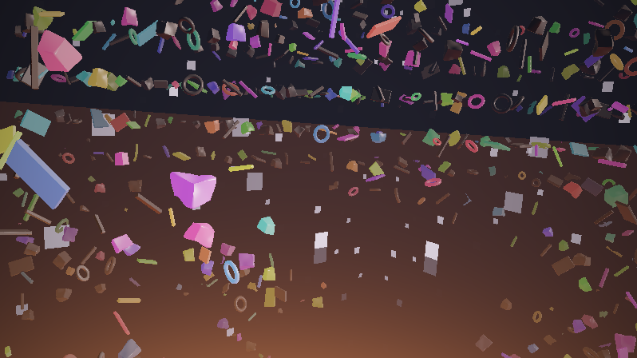

**Ergebnis:** Bei jedem Kick zünden die Positionslichter durchs ganze Feld und die Glut flammt unter der Szene auf – der Planet atmet mit dem Bass, und sein Untenlicht trägt den Puls auf jede Trümmer-Unterseite. Die Mitten rütteln spürbar am Taumeln, Hi-Hats besprühen Sterne und Metallkanten mit Glitzern, laute Passagen verdichten das Feld. Wird es still, fällt alles auf sein sehenswertes Eigenleben zurück: Einzelblinken, Zeitlupenwolken, Drift.

### Was passiert hier

Das dramaturgische Kalkül ist das der ganzen Serie: Die **Grundmechanik** (Taumeln, Blinken, Wolken, Kamerafahrt) läuft ohne Audio weiter – Musik **verstärkt** sie nur. Deshalb überall `max(eigen, …)` statt Ersetzen und Faktoren wie `(0.6 + 1.4·gBass)` statt `gBass` pur. Ein Visualizer, der ohne Musik tot ist, ist auch mit Musik meist nur ein VU-Meter. Die eine echte Ausnahme bleibt Mapping 5 – der einzige Eingriff in die Geometrie selbst, und der einzige, der nach der Envelope aus B3 verlangt, bevor er wirklich vorzeigbar ist.

### 🎨 Experimentieren

- Nur Mapping 2 aktiv lassen: „der Planet atmet" – ein komplett anderer, ruhigerer Visualizer aus einer einzigen Zeile
- `gGate` zusätzlich auf den Atmosphären-Saum: `return saum * vec3(0.90, 0.32, 0.08) * (0.55 + 0.45 * gGate);` – der Horizont blitzt beim Kick
- Bass auf die Bahn-Amplitude (die *erlaubte* Variante von „schneller fliegen"): `ro *= 1.0 + gBass * 0.10;` direkt nach der Drift-Zeile – dezent halten
- Mapping 3 auf `gMid * 2.5` übersteuern: das Feld „zappelt" hörbar mit – lehrreich, warum der Offset klein bleiben will

---

# Anhang B: Der Weg in die App – kompakt

Der fertige Shader benutzt ausschließlich Standard-Uniforms (`iResolution`, `iTime`, mit Anhang A zusätzlich `iChannel0`) und hält die Konventionen der 100 Vorrats-Shader in `asset/shadertoys/` ein (STELLSCHRAUBEN-Block, keine Plattform-Extras). **Die drei Import-Wege** (Copy & Paste in den Shadertoy-Node, URL-/ID-Import mit App-Key, Shadertoy-Browser-Panel) **und die allgemeine Portabilitäts-Checkliste** (Adapter-Schicht, Skalen, `#version`-Verbot, Multipass-Semantik …) stehen ausführlich im **Crystal-Lights-Shader-Tutorial, Anhang B** – das gilt hier unverändert und wird nicht wiederholt. Dieser Anhang ergänzt nur das Shader-Spezifische.

---

## B1 – Dieser Shader im Shadertoy-Node

Der Grundshader (Schritt 14) braucht **keine iChannels** – Weg 1 (Copy & Paste) ist damit trivial: kompletten Code ins GLSL-Feld, fertig; Kompilierfehler kommen dank `#line 1` mit den Zeilennummern des eigenen Codes. Mit dem Audio-Ausbau aus A3 zusätzlich im Node-Editor den **Audio-Kanal auf 0** stellen (die App liefert das identische 512×2-Layout, `bandLevel` läuft unverändert). Zwei Punkte, die genau diesem Shader zugutekommen: Die deterministische **Sim-Uhr** der App macht die komplett zufallsfreie Choreografie (Taumel-Phasen, sechs Kamera-Uhren) exakt reproduzierbar – derselbe Frame ergibt dasselbe Bild, Prüfstand-tauglich. Und die konstanten Schleifengrenzen (110 Marsch-Schritte, feste Oktav- und Sternschleifen) sind GLSL-330-freundlich – nichts daran muss für den Node angefasst werden.

## B2 – Stellschrauben als Panel-Parameter + Audio-Adapter

**Welche Konstanten sich als Panel-Parameter anbieten** – und welche nicht:

| Stellschraube | Panel? | Vorschlag | Bemerkung |
|---|---|---|---|
| `DICHTE` | ja | Slider 0.0–0.9 | der stärkste Charakter-Regler |
| `TAUMEL` | ja | Slider 0.0–3.0 | 0 = eingefrorenes Standbild-Feld |
| `TEMPO` | ja | Slider 0.0–2.5 | Kamerafahrt bis Stillstand |
| `BLINK_ANTEIL` | ja | Slider 0.0–1.0 | Seenot ↔ Weihnachtsbaum |
| `GLUT`, `GLUT_LICHT` | ja | Slider 0.0–3.0 | Planet-Stimmung, gern gekoppelt |
| `BELICHTUNG` | ja | Slider 0.5–3.0 | Tonemapping-Charakter |
| `ZELLE`, `GROESSE_MAX` | **nur gekoppelt** | – | die **Zellregel** (Schritt 4/5): unabhängig verstellt wird `MARGE` negativ → Wand-Artefakte. Entweder als festes Paar lassen oder einen einzigen „Maßstab"-Regler bauen, der beide gemeinsam skaliert |
| `PLANET_*`, `SONNE` | eher nein | – | Szenen-Identität; wer sie ändert, baut einen anderen Shader |

*Tab. 5: Panel-Eignung der Stellschrauben – Regler-Vorschläge und die Zellregel-Kopplung*

**Der Audio-Adapter für diesen Shader** – nach dem Muster aus Crystal Lights B2 (genau einen Block aktiv lassen; in A3(b) dann `gBass = aBass();` usw.):

```glsl
// ===== AUDIO-ADAPTER =========================================================
// --- Variante SHADERTOY (iChannel0 = Music) ---------------------------------
float aBass() { return bandLevel(0.00, 0.05); }
float aMid()  { return bandLevel(0.05, 0.25); }
float aTreb() { return bandLevel(0.25, 0.70); }
float aVol()  { return bandLevel(0.00, 0.70); }
float aBeat() { return smoothstep(0.60, 0.75, aBass()); }

// --- Variante LUMIVIZ (eingebaute Uniforms; Skalen-Faktor s. Crystal Lights B2)
// float aBass() { return bass * 0.3; }
// float aMid()  { return mid  * 0.3; }
// float aTreb() { return treb * 0.3; }
// float aVol()  { return vol  * 0.3; }
// float aBeat() { return beat; }
// ============================================================================
```

In der LumiViz-Variante entfällt `bandLevel` komplett – und `aBeat()` wird zum fertigen `beat`-Uniform, das die Schwellen-Handarbeit von A1 erledigt.

## B3 – Gedächtnis: der Envelope-Verweis

Die zwei Stellen, an denen dieser Shader nach **Zustand** verlangt, sind in A2 markiert: die Dichte-Schwelle (Mapping 5 braucht *geglättete* Lautheit statt Frame-Zittern) und das Beat-Gate (adaptive Schwelle + Ausglüh-Envelope statt Absolutwert). Beides ist exakt der Stoff von **Crystal Lights, Anhang B3**: ein Buffer A, der sich selbst als Eingang liest, ein Pixel als Zustandsspeicher – Tiefpass (`mix(alt, neu, 0.1)`), adaptiver Trigger (`bass > glatt·1.35`), Envelope (`max(alt·0.9, schlag)`). Für dieses Tutorial übernimmt man den dortigen Buffer wörtlich und ersetzt in A3 `gGate` durch die Envelope (die Positionslichter bekommen ein *Ausglühen*) und `gVol` durch den geglätteten Pegel (die Dichte atmet, statt zu flackern). Im LumiViz-Node ist es dieselbe Topologie über Multipass Buffer A–D; die Selbstreferenz liest auch dort das Vorframe.

---

## End-Validierung

Diese Validierung steht bewusst **hinter den Anhängen**: A1–A3 sind reguläre Schritte dieses Tutorials, und der Audio-Teil von Lernziel 5 ist erst dort erreichbar – die End-Validierung muss aber alle Lernziele abdecken. Die Kriterien 1–7 prüfen den Kern (Schritte 1–14), Kriterium 8 die Anhänge. Jedes Kriterium ist am laufenden Shader auf shadertoy.com objektiv prüfbar:

1. **Kompilierbarkeit:** Das Gesamtlisting aus Schritt 14 kompiliert auf shadertoy.com ohne Fehlermeldung und rendert ein bewegtes Bild – kein Schwarzbild, kein Standbild. *(Basis aller Lernziele)*
2. **Repetition & Zell-Individualität:** Das Feld zeigt gleichzeitig alle vier Formen in verschiedenen Größen, Lagen und Helligkeiten, verteilt in Schwärmen mit echter Leere dazwischen; jede Eigenschaft eines Teils (Form, Größe, Achse, Farbe) bleibt über die Zeit konstant – nichts wechselt seine Identität zwischen Frames. *(Lernziel 1)*
3. **Zellwand-Klammer:** `MARGE` testweise erhöht (z. B. auf 1.2) ändert das Bild nicht, nur das Tempo – die Klammer ist konservativ. Gegenprobe: `GROESSE_MAX = 1.6` (`MARGE` negativ) erzeugt sichtbare Wand-Artefakte; zurück auf `1.0` verschwinden sie wieder. *(Lernziel 2)*
4. **Taumeln:** `TAUMEL = 0.0` friert das Feld ein; bei `1.0` dreht jedes Teil um seine eigene, konstante Achse mit eigenem Tempo – kein gemeinsamer Takt, und die Beulen der Brocken taumeln mit ihrem Teil mit. *(Lernziel 3)*
5. **Planet & Atmosphäre:** Der Horizont krümmt sich sichtbar unter dem Feld weg (`PLANET_RADIUS = 20` dramatisch, `300` fast flach); die Wolken ziehen nur in Zeitlupe erkennbar; der Atmosphären-Saum glüht ausschließlich am Limbus – beim Blick senkrecht nach oben bleibt der Zenit dunkel (`tca`-Ausstieg). *(Lernziel 4)*
6. **Licht-Stimmungen:** Sonnenabgewandte Flächen sind ohne Blinklicht vollständig schwarz (kein Umgebungslicht); Trümmer-Unterseiten über Glut-Kontinenten glimmen sichtbar wärmer als über dunkler Kruste; Positionslichter flammen auch auf Nachtseiten auf – jedes in eigener Farbe und eigenem Rhythmus, und die Farbpalette rotiert in Zeitlupe. *(Lernziel 5)*
7. **Kamera:** Die Drift verlangsamt an den Bahnenden sichtbar und kehrt ohne Sprung um; der Horizont ist nie dauerhaft waagerecht (Rollen); mit entferntem Blasen-Faktor tritt Near-Clipping auf, mit Blase nicht. *(Lernziel 6)*
8. **Audio:** Im A3-Stand (iChannel0 = Music) zünden bei jedem Bass-Kick Positionslichter feldweit und die Glut pumpt unter der Szene; **ohne Musik** laufen Taumeln, Einzel-Blinken, Wolken und Kamerafahrt unverändert weiter. *(Lernziel 5, Audio-Teil)*

---

## Fehlerbehebung

Die häufigsten Stolperstellen dieses Tutorials, gesammelt nach Symptom (Tab. 6). Die schritt-lokalen ⚠-Hinweise (etwa zur Zellregel in den Schritten 4–6) bleiben davon unberührt – hier stehen die Probleme, die typischerweise erst beim Zusammenbau, beim Experimentieren oder beim Gegenrendern auftreten:

| # | Symptom | Ursache | Lösung |
|---|---|---|---|
| 1 | Schwarzes Bild nach dem Einfügen | Code unvollständig kopiert (Hilfsfunktionen fehlen) oder Kompilierfehler – Shadertoy rendert dann nichts bzw. den letzten lauffähigen Stand | Gesamtlisting aus Schritt 14 komplett kopieren, mit `Alt+Enter` kompilieren und die Fehlerkonsole unter dem Editor lesen |
| 2 | Kompilierfehler `'…' : undeclared identifier` | Ab Schritt 6 zeigen die Listings nur noch **geänderte** Funktionen – der Rest des Vorschritts muss stehen bleiben | Den vollständigen Stand des vorherigen Schritts behalten und nur die gezeigten Funktionen ersetzen bzw. ergänzen (Hinweis am Anfang von Schritt 6) |
| 3 | Wand-Artefakte: flackernde Schnittflächen an unsichtbaren Ebenen im Feld | Zellregel verletzt – `GROESSE_MAX` zu groß bzw. `ZELLE` zu klein (`MARGE` negativ), oder eine neue Form ohne Umkugel-Nachweis | Umkugel-Budget nachrechnen (Tab. 3) und `MARGE = ZELLE·0.5 − 1.1·GROESSE_MAX` positiv halten; die beiden Konstanten nur als Paar verstellen (Schritte 4–5, Tab. 5) |
| 4 | Die Feldmitte bleibt leer, obwohl die Kamera woanders ist | `gKamera` wird nicht vor dem Marsch gesetzt – die Kamera-Blase schrumpft dann die Zellen um den Ursprung statt um die Kamera | `gKamera = ro;` direkt nach `kamera(…)` und **vor** `marchDebris` setzen (Schritt 13) |
| 5 | Sterne erscheinen als kleine Quadrate statt als Punkte | Bekannter Schönheits-Kandidat aus dem Render-Lauf (Abspann): die zellweise Schwelle aus Schritt 1 leuchtet die ganze Gitterzelle aus, ohne Punktformung | Punktformung nachrüsten, z. B. `stern *= smoothstep(0.5, 0.1, length(fract(su) - 0.5));` in `sterne()` – oder als Stilentscheid belassen |
| 6 | Leere Schneisen fluchten als Kreuz/Korridor im Bild (Schritte 3–11) | Die geradlinige Provisoriums-Kamera blickt exakt entlang der Gitterachse – die achsparallelen Zellkorridore fluchten perspektivisch zu einem Kreuz | Kein Bug: verschwindet mit der choreografierten Kamera aus Schritt 12 (Gier, Nick und Rollen brechen die Flucht); zum Prüfen `rd` testweise leicht schwenken |
| 7 | Der Planet ist nicht zu sehen (Schritte 7–11) | Die Provisoriums-Kamera blickt geradeaus; der Planet liegt unter dem Feld | `rd` testweise kippen (Schritt 7 nennt −0.4; die Schritt-Chains rendern mit −0.7, sonst bleibt der Planet hinter dem Feld verdeckt) – ab Schritt 12 übernimmt die Nick-Uhr |
| 8 | Niedrige Framerate / Ruckeln | 110 Marsch-Iterationen mit Hash-Kaskade und Rotationsmatrix pro `map`-Aufruf sind teuer, besonders auf integrierten GPUs | Shadertoy-Vorschau verkleinern; Marsch-Iterationen (`110`) oder FBM-Oktaven (`5`) reduzieren – nicht das Taumeln (Begründung in Schritt 6) |
| 9 | Audio-Mappings reagieren nicht – oder stehen dauerhaft am Anschlag | iChannel0 nicht mit „Music" belegt bzw. Schwellen passen nicht zum Track; mit dem synthetischen Testsignal des Standalone sättigen die dB-skalierten FFT-Bänder nahe 1.0 – das Gate steht dauerhaft offen (so entstanden auch die Anhang-Bilder) | Kanal-Kachel prüfen (A1); Schwellen `0.60/0.75` pro Musikrichtung nachstimmen und für Sichttests Musik mit echter Dynamik verwenden – oder gleich die adaptive Envelope aus B3 |
| 10 | Konstanten wirken anders als beschrieben | Die Shader dieser Serie sind konstruiert, nachgerechnet und in LumiViz gegengerendert (Screenshots im Text) – aber nicht jeder Zahlwert ist gegen das beschriebene Zielbild feinabgeglichen, und shadertoy.com ist noch ungeprüft (Abspann) | Die Stellschraube in kleinen Schritten nachstimmen; die beschriebene **Wirkrichtung** jeder Konstante stimmt, der Absolutwert ist Startpunkt, nicht Dogma |

*Tab. 6: Fehlerbehebung – Symptom, Ursache, Lösung*

---

## Nächste Schritte

Die Fortsetzung folgt der [Wegleitung](ShaderTutorials-overview.md) der Serie:

- **Parallel im 3D-Strang:** [Stratospheric-Tunnel](StratosphericTunnel-tutorial.md) (Wand-Relief, Fenster, Pfadkrümmung) steht auf derselben Stufe wie dieses Tutorial – beide vertiefen das SDF-Raymarching unabhängig voneinander.
- **Danach:** [Juggernaut](Juggernaut-tutorial.md) setzt die hier erarbeitete Marsch-Sicherheit (Klammer, Drossel, Budgets) voraus.
- **Zum Schluss die Composites:** [Portals](CompositePortals-tutorial.md) und [Transitions](CompositeTransitions-tutorial.md) verbauen die fertigen Basis-Shader weiter, [Postfx](CompositePostfx-tutorial.md) hängt Multipass-Veredelung dahinter.

---

## Abspann

Damit ist die Reise komplett: ein unendliches Zellgitter, in dem jede Adresse ein Individuum ist – Form, Größe, Taumelachse, Rost, Blinklicht, alles aus `hash(id)`; darunter ein analytischer Planet mit Glutadern, Zeitlupenwolken und Atmosphären-Saum; darüber drei Schichten Sterne; mittendrin eine schwerelose Kamera auf sechs inkommensurablen Uhren. Und als roter Faden die Zellregel samt Zellwand-Klammer – das eine Stück beweisbare Sicherheit in einem Shader voller erlaubter Lügen.

Wer weitermachen will:

- **Die Weichen zurückverfolgen:** Fast jeder 🎨-Kasten ist ein eigener Shader. Besonders ergiebig: der Eisplanet (Schritt 7), der Havarie-Roll (Schritt 12), das zerbrochene Gerüst aus Trägern und Ringen (Schritt 5).
- **Die Milkdrop-Brücke:** Wer den Look als *Preset* statt als Shadertoy-Node will, hat mit *martin – space debris* die Blaupause vor sich – dort entsteht der Lavagrund **über den Feedback-Buffer verteilt** (die `quality`-Schleife des Warp-Shaders iteriert nur dreimal pro Frame und stützt sich auf `GetPixel`/`GetBlur1` des Vorbilds). Eine ganz eigene Schule – und ein anderes Tutorial.
- **Als Vorlage in die App:** den Endstand (oder die Lieblings-Variante) als `.lvfx` neben die Vorlagen in `asset/effectchain/shadertoys/` legen – Konvention siehe dort (`.glsl` = SSOT).

**Ehrlichkeits-Hinweis:** Alle Shader dieses Tutorials sind am Schreibtisch konstruiert und grob nachgerechnet (Zellregel, Marsch-Budget, Horizontwinkel) und inzwischen **in LumiViz gegengerendert** (alle Schritte kompilieren warnungsfrei; die Screenshots im Text stammen aus diesen Läufen) – auf shadertoy.com ist der Sichttest weiterhin offen. Für das Feintuning bleiben die Zahlen Startwerte; bekannte Schönheits-Kandidaten aus dem Render-Lauf: die blockigen „Quadrat-Sterne" aus Schritt 1 (zellweise Schwelle ohne Punktformung) und der Planeten-Kipp der Schritte 7–8 (die Schritt-Chains rendern mit −0.7 statt −0.4, sonst bleibt der Planet hinter dem Feld verdeckt).

Und jetzt: Musik an. 🎵🛰️

*Screenshots: gerendert mit AvsStandalone (Testing-Build), Chains in `space_debris_schritte/`.*

---

## Siehe auch

**Voraussetzungen:**

- [Pyramid-Spiral-Shader-Tutorial](PyramidSpiral-tutorial.md) – SDF-Marsch, Normalen, Hash-Idiom und Domain Repetition, auf denen dieses Tutorial aufbaut (Schritte 1–7 dort genügen).
- [Crystal-Lights-Shader-Tutorial](CrystalLights-tutorial.md) – Noise/FBM und die Kamera-Basis; dessen Anhänge A/B sind die Vollreferenz für Audio-Grundlagen und die drei Wege Shadertoy ↔ LumiViz, auf die die Anhänge hier verweisen.

**Verwandte Dokumente:**

- [Shader-Tutorials-Wegleitung](ShaderTutorials-overview.md) – Fokus-Tabellen, Lesereihenfolge und Technik-Index der gesamten Tutorial-Serie.
- [Raymarching – Referenz](Raymarching-reference.md) – die technische Referenz zu Algorithmus, Distanzfunktionen, Normalen und Artefakten; besonders die Abschnitte zur Zellregel und zu den Marsch-Varianten (Klammer vs. Drossel) als Nachschlagewerk zu den Schritten 2–6.

**Weiterführendes:**

- [martin – space debris](<../../../../../asset/Milkdrop3/presets/martin - space debris.milk>) – das Stil-Vorbild-Preset (MilkDrop): `rs_lav`-Glutgrund, `noise3`-Oktaven, `scol`-Signalfarben, Zeitlupen-Wolken und `tilt`-Rollen im Original.
- [iquilezles.org](https://iquilezles.org/articles/) – die Artikelsammlung von Inigo Quilez zu Distanzfunktionen, Domain-Repetition und Noise/FBM; die Primärquelle der meisten hier verwendeten Techniken.

## Changelog

| Version | Datum | Änderungen |
|---|---|---|
| **1.2.0** | 2026-08-05 | Formalisierung nach Tutorial_Base (nach dem Muster des Piloten [Crystal Lights](CrystalLights-tutorial.md)): Blockquote-Header, Inhaltsverzeichnis, Konventions-Mapping (Tab. 1), Lernziele, Voraussetzungen, Übersicht der Schritte, End-Validierung, Fehlerbehebung, Nächste Schritte, Siehe auch; Tabellen als Tab. 1–6 und Bauplan-Skizze als Fig. 1 indexiert; **Ergebnis:**-Zeile in Schritt A2 ergänzt. Didaktischer Bestand (Schritt-Texte, Code, 🎨-Kästen, Anhänge) inhaltlich unverändert. Inklusive Umzug der Serie nach `projects/apps/MyViz/docs/tutorials/` und Umbenennung nach FNM-01 zu `SpaceDebris-tutorial.md` (Entscheid Patrik, 2026-08-04). |
| **1.1.0** | 2026-08-04 | Schritt-Chains + Screenshots: je Schritt eine lauffähige Ein-Node-Chain in `space_debris_schritte/` (`.glsl` = materialisierte, kumulativ ausgebaute Rekonstruktion der Diff-Schritte, `make_schritte.py` generiert die `.lvfx`) und ein eingebettetes Render-Bild in `space_debris_bilder/` (Render-Nachweis AvsStandalone, Testing-Build, 800×450; Anhang-Bilder mit synthetischem Testsignal). Dokumentierte Abweichung: die Schritt-Chains rendern den Kamera-Kipp der Schritte 7–11 mit −0.7 statt der im Text genannten −0.4, sonst bleibt der Planet hinter dem Feld verdeckt. |
| **1.0.0** | 2026-08-04 | Erstfassung: 14 Schritte (Geometrie → Material → Licht → Bewegung → Politur) + Anhang A (Audio-Reaktivität) + Anhang B (Shadertoy ↔ LumiViz kompakt, mit Verweisen auf Crystal Lights). |

